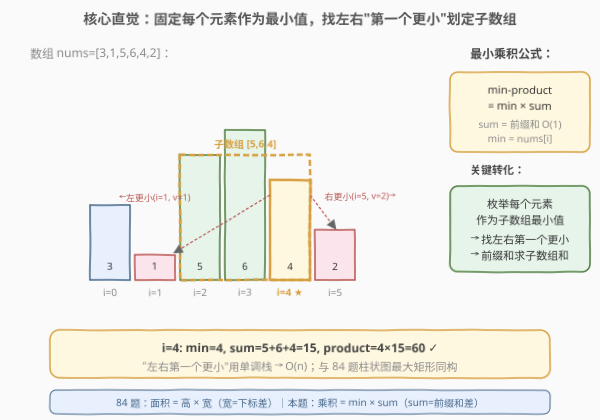
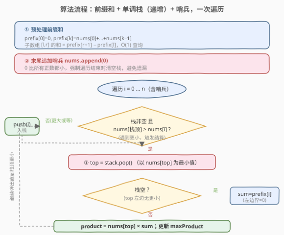

# LeetCode 子数组最小乘积的最大值 题解

## 1. 题目概述

- **标题 / 题号**：子数组最小乘积的最大值（#1856，medium）
- **链接**：https://leetcode.cn/problems/maximum-subarray-min-product/
- **难度**：中等
- **标签**：栈、单调栈、数组、前缀和

**题意**：一个数组的**最小乘积**定义为这个数组中**最小值**乘以数组的**和**。例如 `[3,2,5]` 的最小乘积为 $\min(3,2,5) \times (3+2+5) = 2 \times 10 = 20$。

给定正整数数组 `nums`，返回任意**非空子数组**的最小乘积的**最大值**。由于答案可能很大，返回对 $10^9 + 7$ 取余的结果。题目保证最小乘积的最大值在取余前可用 64 位有符号整数保存。

**示例 1**：

```text
输入：nums = [1,2,3,2]
输出：14
解释：子数组 [2,3,2]，min=2，sum=7，最小乘积 = 2 × 7 = 14。
```

**示例 2**：

```text
输入：nums = [2,3,3,1,2]
输出：18
解释：子数组 [3,3]，min=3，sum=6，最小乘积 = 3 × 6 = 18。
```

**示例 3**：

```text
输入：nums = [3,1,5,6,4,2]
输出：60
解释：子数组 [5,6,4]，min=4，sum=15，最小乘积 = 4 × 15 = 60。
```

**约束**：

- $1 \le \text{nums.length} \le 10^5$
- $1 \le \text{nums[i]} \le 10^7$

> 💡 **关键直觉**：最小乘积 $= \min \times \text{sum}$。要让这个值最大，需要同时权衡「最小值」和「子数组和」。直接枚举所有子数组是 $O(n^2)$，必超时。但注意到——**取到最大最小乘积的子数组，其最小值一定是子数组中某个元素**。所以可以**固定每个元素作为最小值**，求它作为最小值时能扩展到的最宽子数组（即左右第一个比它更小的元素之间），再用**前缀和** $O(1)$ 算出该子数组的和。这与 [84. 柱状图中最大的矩形](../0001-0100/84_柱状图中最大的矩形.md) 完全同构——84 题是「高 × 宽（下标差）」，本题是「min × sum（前缀和差）」。

## 2. 解题思路

### 2.1 暴力思路：枚举所有子数组

枚举所有 $O(n^2)$ 个子数组 $[l, r]$，对每个子数组求 $\min$ 与 $\text{sum}$（各 $O(n)$），算最小乘积取最大。总时间 $O(n^3)$，即使优化到 $O(n^2)$（预处理前缀和后 sum 为 $O(1)$，但求 min 仍需 $O(n)$），$n = 10^5$ 时仍超时。

> ⚠️ 瓶颈：子数组数量 $O(n^2)$ 太多。需要换一个枚举维度——不枚举子数组，而是**枚举最小值**。

### 2.2 核心观察：固定每个元素作为最小值



**关键转化**：取到最大最小乘积的子数组，其最小值一定是子数组中某个元素 `nums[i]`。所以只需对每个 `i`，求「以 `nums[i]` 为最小值的最宽子数组」：

1. **找左右第一个更小**：`left[i]` = `i` 左边第一个 $< \text{nums}[i]$ 的下标（无则 $-1$）；`right[i]` = `i` 右边第一个 $< \text{nums}[i]$ 的下标（无则 $n$）。
2. **最宽子数组**：$[\text{left}[i]+1,\ \text{right}[i]-1]$，其中所有元素 $\ge \text{nums}[i]$，故 `nums[i]` 确实是这段子数组的最小值。
3. **前缀和求 sum**：$\text{sum} = \text{prefix}[\text{right}[i]] - \text{prefix}[\text{left}[i]+1]$，其中 $\text{prefix}[k] = \sum_{j=0}^{k-1} \text{nums}[j]$。
4. **最小乘积** $= \text{nums}[i] \times \text{sum}$，取所有 $i$ 的最大值。

> 💡 **为什么是"第一个更小"而不是"第一个更小或等"？** 用严格小于 $<$ 划界，等值元素不会阻挡扩展。例如 `[3,3]`，对 `i=0` 找右第一个 $<3$ 的位置 → 无（到 $n$），子数组 $[0,1]$ 包含两个 3，$\min=3$ 正确。等值元素被同一段子数组覆盖多次（每个等值元素各算一次），但取 $\max$ 不影响结果。

> ⚠️ **与 84 题的异同**：84 题固定每根柱子高度，求左右第一个更矮，面积 $= h \times w$（$w$ 是下标差）；本题固定每个元素作为最小值，求左右第一个更小，乘积 $= \text{min} \times \text{sum}$（$\text{sum}$ 是前缀和差）。**单调栈骨架完全相同**，只是结算时用前缀和差代替下标差。

### 2.3 算法流程图



用**高度递增**的单调栈，一次遍历即可在出栈时结算每个元素：

1. **预处理前缀和** `prefix[0..n]`，$O(n)$。
2. **末尾追加哨兵** `0`（比所有正数都小），强制遍历结束时清空栈。
3. **遍历** `i` **从 0 到** $n$（含哨兵）：
   - 当 $\text{nums}[\text{栈顶}] > \text{nums}[i]$ 时，栈顶的右边界就是 $i$（遇到更小了），弹出栈顶 `top`，结算：
     - $\text{sum} = \text{prefix}[i] - \text{prefix}[\text{新栈顶}+1]$（栈空则 $\text{sum} = \text{prefix}[i]$，左边界为 $0$）
     - $\text{product} = \text{nums}[\text{top}] \times \text{sum}$，更新 $\text{maxProduct}$
   - 重复弹出直到栈顶值 $\le \text{nums}[i]$，然后 `push(i)`。
4. 返回 $\text{maxProduct} \bmod (10^9+7)$。

> ⚠️ **哨兵技巧**：在 `nums` 末尾追加 `0`，比所有正元素都小，保证遍历结束时栈中剩余元素全部被弹出结算。不加哨兵则需循环后额外清栈，容易遗漏。

### 2.4 示例演算

![示例演算：nums=[3,1,5,6,4,2] + 哨兵 0](../images/1856_example_walkthrough.svg)

以 `nums = [3,1,5,6,4,2]` 为例，追加哨兵后为 `[3,1,5,6,4,2,0]`，`prefix = [0,3,4,9,15,19,21]`：

| 步 | i | nums[i] | 动作 | 栈 | 结算 sum | product |
|----|---|---------|------|----|----------|---------|
| 1 | 0 | 3 | 栈空，入栈 | [0] | — | — |
| 2 | 1 | 1 | 3>1 弹0；入栈1 | [1] | prefix[1]−0 = 3 | 3×3=9 |
| 3 | 2 | 5 | 1<5，入栈 | [1,2] | — | — |
| 4 | 3 | 6 | 5<6，入栈 | [1,2,3] | — | — |
| 5 | 4 | 4 | 6>4 弹3；5>4 弹2；入栈4 | [1,4] | 6×6=36；5×11=55 | 36, 55 |
| 6 | 5 | 2 | 4>2 弹4 ★；入栈5 | [1,5] | prefix[5]−prefix[2]=19−4=15 | **4×15=60** ⭐ |
| 7 | 6 | 0 | 哨兵：2>0 弹5；1>0 弹1 | [] | 2×17=34；1×21=21 | 34, 21 |

最终 $\text{maxProduct} = 60$，返回 $60 \bmod (10^9+7) = 60$。

> 💡 **步 6 是本题精髓**：`i=5` 时 `nums[5]=2 < nums[4]=4`，触发弹出 `top=4`。此时栈从 `[1,4]` 变为 `[1]`，新栈顶 `1` 对应 `nums[1]=1`（左边界第一个更小），故子数组为 $[\text{left}+1, \text{right}-1] = [2, 4] = [5,6,4]$，$\text{sum} = \text{prefix}[5] - \text{prefix}[2] = 19 - 4 = 15$，$\text{product} = 4 \times 15 = 60$。这正是前缀和差的妙用——$O(1)$ 算出任意子数组的和。

## 3. 参考代码

### C++

```cpp
// 子数组最小乘积的最大值.cpp —— 单调栈 + 前缀和
// 编译: g++ -O2 -std=c++17 子数组最小乘积的最大值.cpp -o maxminprod
#include <vector>
#include <stack>
#include <algorithm>
using namespace std;

class Solution {
  public:
    int maxSumMinProduct(vector<int>& nums) {
        int n = nums.size();
        // 前缀和：prefix[k] = nums[0]+...+nums[k-1]
        vector<long long> prefix(n + 1, 0);
        for (int i = 0; i < n; ++i) {
            prefix[i + 1] = prefix[i] + nums[i];
        }

        nums.push_back(0); // 哨兵，强制清栈
        stack<int> st;     // 存下标，对应值单调递增
        long long maxProd = 0;

        for (int i = 0; i <= n; ++i) {
            while (!st.empty() && nums[st.top()] > nums[i]) {
                int top = st.top();
                st.pop();
                long long sum = st.empty()
                    ? prefix[i]
                    : prefix[i] - prefix[st.top() + 1];
                maxProd = max(maxProd, (long long)nums[top] * sum);
            }
            st.push(i);
        }

        nums.pop_back(); // 恢复（可选）
        return maxProd % 1000000007;
    }
};
```

### Python

```python
class Solution:
    def maxSumMinProduct(self, nums: list[int]) -> int:
        n = len(nums)
        # 前缀和：prefix[k] = nums[0]+...+nums[k-1]
        prefix = [0] * (n + 1)
        for i in range(n):
            prefix[i + 1] = prefix[i] + nums[i]

        nums = nums + [0]          # 哨兵，不修改原数组
        stack = []                  # 存下标，对应值单调递增
        max_prod = 0

        for i in range(n + 1):
            while stack and nums[stack[-1]] > nums[i]:
                top = stack.pop()
                total = prefix[i] if not stack else prefix[i] - prefix[stack[-1] + 1]
                max_prod = max(max_prod, nums[top] * total)
            stack.append(i)

        return max_prod % (10**9 + 7)
```

> 💡 **实现细节**：① 前缀和用 `long long`（C++）——`nums[i]` 最高 $10^7$，子数组和最高 $10^5 \times 10^7 = 10^{12}$，超出 `int` 范围；乘积最高 $10^7 \times 10^{12} = 10^{19}$，但题目保证答案在 `int64` 内。② Python 整数任意精度，无需担心溢出，但取余必须在最后统一做（不能边算边取余，否则 `max` 比较会出错）。③ **不能边算边取余**：`max` 比较的是真实值大小，取余会破坏单调性。先在 64 位整数域求出 $\text{maxProduct}$，最后返回 `maxProd % MOD`。

> ⚠️ **比较用 `>` 而非 `>=`**：用 `>` 时等高元素延后出栈，结算时拿到最宽右边界，逻辑最直观。用 `>=` 也能过（等值元素后续被更靠右的同值元素覆盖），但 `>` 与 84 题保持一致，不易出错。

## 4. 复杂度分析

| 维度 | 复杂度 | 说明 |
|------|--------|------|
| **时间** | $O(n)$ | 前缀和预处理 $O(n)$；每个下标入栈 1 次、出栈 1 次，栈操作总计 $O(n)$ |
| **空间** | $O(n)$ | 前缀和数组 $O(n)$；单调栈最坏 $O(n)$（元素递增时全部入栈） |

> ⚠️ 虽有 `while` 嵌套在 `for` 里，但**均摊分析**：每个元素至多入栈 1 次出栈 1 次，`while` 的总弹出次数 $\le n$，总时间 $O(n) + O(n) = O(n)$。与 [84. 柱状图中最大的矩形](../0001-0100/84_柱状图中最大的矩形.md)、[239. 滑动窗口最大值](../0201-0300/239_滑动窗口最大值.md) 的均摊分析完全一致——这是所有单调结构的共性。

## 5. 扩展：左右两次单调栈（无哨兵写法）

除「一次遍历 + 哨兵」外，也可分别预处理 `left[i]` 和 `right[i]`，再统一算乘积。逻辑分层清晰、易调试：

```python
class Solution:
    def maxSumMinProduct(self, nums: list[int]) -> int:
        n = len(nums)
        prefix = [0] * (n + 1)
        for i in range(n):
            prefix[i + 1] = prefix[i] + nums[i]

        # 左边第一个更小的下标
        left = [-1] * n
        stack = []
        for i in range(n):
            while stack and nums[stack[-1]] >= nums[i]:
                stack.pop()
            left[i] = stack[-1] if stack else -1
            stack.append(i)

        # 右边第一个更小的下标
        right = [n] * n
        stack.clear()
        for i in range(n - 1, -1, -1):
            while stack and nums[stack[-1]] >= nums[i]:
                stack.pop()
            right[i] = stack[-1] if stack else n
            stack.append(i)

        max_prod = 0
        for i in range(n):
            total = prefix[right[i]] - prefix[left[i] + 1]
            max_prod = max(max_prod, nums[i] * total)

        return max_prod % (10**9 + 7)
```

**对比**：哨兵法一次遍历、代码短；左右两遍法逻辑分层清晰、易调试。面试中哨兵法更优，能体现对边界处理的驾驭。

> 💡 注意左右两遍法中用 `>=` 弹出（找到严格更小的边界），与哨兵法用 `>` 弹出并不矛盾——两套写法在等值处理上等价，最终 $\max$ 结果一致。

### 单调栈家族：三个"第一个更小/大"问题

| 题目 | 求什么 | 栈单调性 | 结算公式 |
|------|--------|---------|---------|
| [84. 柱状图中最大的矩形](../0001-0100/84_柱状图中最大的矩形.md) | 左右第一个更矮 | 递增 | 面积 $= h \times (\text{下标差})$ |
| **1856. 子数组最小乘积的最大值** | 左右第一个更小 | 递增 | 乘积 $= \min \times (\text{前缀和差})$ |
| [42. 接雨水](../0001-0100/42_接雨水.md) | 左右第一个更高 | 递减 | 水量 $= \text{短板高度} \times \text{宽度}$ |

> 💡 三题共享「单调栈 + 出栈时结算」骨架，区别仅在栈方向（递增/递减）与结算公式。掌握 84 题的模板，1856 只是「把下标差换成前缀和差」的一行改动。

## 6. 面试要点

1. **为什么不能边算边取余？**

   > `max` 比较的是真实值大小，取余会破坏值的单调性。例如 $A = 10^9 + 8$ 和 $B = 10$，取余后 $A \bmod \text{MOD} = 1 < B = 10$，但真实值 $A \gg B$。必须先在 64 位整数域求出 $\text{maxProduct}$，最后统一取余返回。

2. **为什么前缀和用 `long long` 而不是 `int`？**

   > $\text{nums}[i] \le 10^7$，$n \le 10^5$，子数组和最高 $10^5 \times 10^7 = 10^{12}$，远超 `int`（$\sim 2 \times 10^9$）。乘积最高 $10^7 \times 10^{12} = 10^{19}$，但题目保证答案在 `int64`（$\sim 9.2 \times 10^{18}$）内。故前缀和与乘积都必须用 `long long`。

3. **比较用 `>` 还是 `>=`？有什么区别？**

   > 用 `>`（严格大于才出栈）：等值元素入栈延后结算，结算时拿到最宽右边界。用 `>=`：等值元素提前出栈，右边界偏小，但后续同值元素会覆盖更宽范围。两种都能过，最终 $\max$ 一致。`>` 与 84 题保持一致，更直观。

4. **哨兵的作用是什么？不加哨兵会怎样？**

   > 哨兵 `0` 比所有正元素都小，遍历到它时强制弹出栈中所有剩余元素并结算。不加哨兵的话，遍历结束后栈中可能还有未结算的元素（它们的右边界是数组末尾 $n$），需额外写循环清栈，容易遗漏。

5. **本题和 84 题柱状图中最大的矩形有什么关系？**

   > 完全同构。84 题固定每根柱子高度，求左右第一个更矮，面积 $= h \times w$（$w$ 是下标差）；本题固定每个元素作为最小值，求左右第一个更小，乘积 $= \min \times \text{sum}$（$\text{sum}$ 是前缀和差）。单调栈骨架完全相同，只是结算公式从「下标差」换成「前缀和差」。

6. **为什么用"第一个严格更小"而不是"第一个更小或等"？**

   > 用严格 $<$ 划界，等值元素不阻挡扩展，保证同值元素所在的最宽子数组被完整覆盖。若用 $\le$，等值元素会提前截断，导致某些子数组被遗漏（虽然取 $\max$ 后结果可能仍正确，但逻辑上不够完备）。

> 💡 **一句话总结**：单调栈递增 + 前缀和 + 哨兵，一次遍历 $O(n)$。每个元素出栈时，用「前缀和差」$O(1)$ 算出以其为最小值的最宽子数组的和，乘积 $= \text{nums}[\text{top}] \times \text{sum}$ 取 $\max$。与 84 题柱状图最大矩形完全同构，只是把「下标差」换成「前缀和差」。

## 同类练习题

| # | 题目 | 与本题的关联 |
|---|------|-------------|
| 84 | [柱状图中最大的矩形](https://leetcode.cn/problems/largest-rectangle-in-histogram/)（[题解](../0001-0100/84_柱状图中最大的矩形.md)） | 单调栈递增 + 哨兵的母题，面积 $= h \times w$（下标差），本题的直接原型 |
| 907 | [子数组的最小值之和](https://leetcode.cn/problems/sum-of-subarray-minimums/) | 单调栈求每个元素作为最小值的子数组个数，与本题共享「固定最小值 + 找左右边界」核心思路，区别在结算时数贡献次数而非求乘积 |
| 1139 | [最大的以 1 为边界的正方形](https://leetcode.cn/problems/largest-1-bordered-square/) | 另一种「枚举最小值边界」思路，巩固「固定一个维度求另一维度最值」的转化范式 |
| 2281 | [巫师的总力量之和](https://leetcode.cn/problems/sum-of-total-strength-of-wizards/) | 单调栈 + 前缀和的前缀和，本题的进阶版——不仅要求和，还要求和的和 |
| 42 | [接雨水](https://leetcode.cn/problems/trapping-rain-water/)（[题解](../0001-0100/42_接雨水.md)） | 单调栈递减找「左右第一个更高」，与本题的递增栈形成对偶，巩固单调栈方向选型 |
