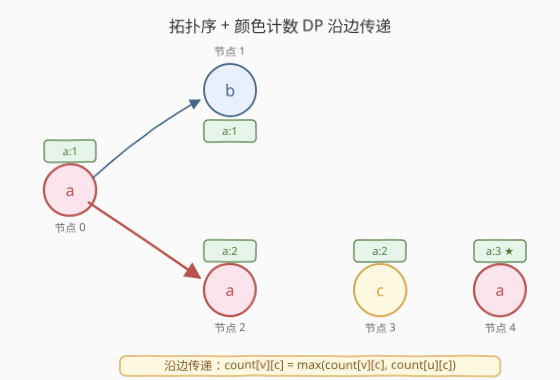
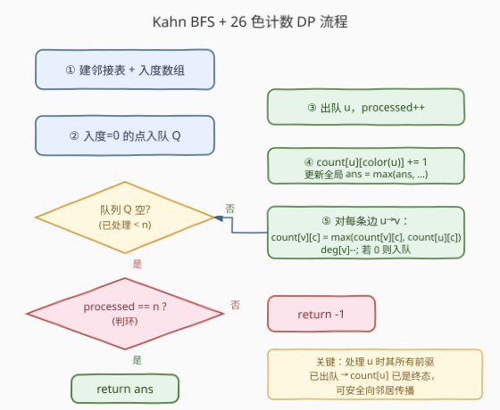
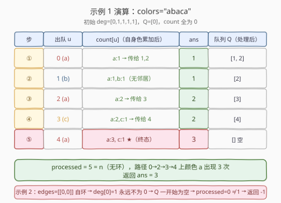

# LeetCode 有向图中最大颜色值 题解

## 1. 题目概述

- **标题 / 题号**：有向图中最大颜色值（#1857，hard）
- **链接**：https://leetcode.cn/problems/largest-color-value-in-a-directed-graph/
- **难度**：困难
- **标签**：图、拓扑排序、动态规划、广度优先搜索

**题意**：给定一个 **有向图**，含 `n` 个节点（编号 `0` 到 `n-1`）和 `m` 条有向边。字符串 `colors` 中 `colors[i]` 表示节点 `i` 的颜色（小写字母）。数组 `edges` 中 `edges[j] = [aj, bj]` 表示从 `aj` 到 `bj` 有一条有向边。

一条有效**路径**是点序列 $x_1 \to x_2 \to \dots \to x_k$（每对相邻点之间有有向边）。路径的**颜色值**是路径中出现次数最多的颜色的节点数。要求返回图中所有有效路径里的**最大颜色值**；若图中有环，返回 `-1`。

**示例 1**：

```text
输入：colors = "abaca", edges = [[0,1],[0,2],[2,3],[3,4]]
输出：3
解释：路径 0 -> 2 -> 3 -> 4 含 3 个颜色为 "a" 的节点。
```

**示例 2**：

```text
输入：colors = "a", edges = [[0,0]]
输出：-1
解释：从 0 到 0 有一个自环（环）。
```

**约束**：

- $n = \text{colors.length}$，$1 \le n \le 10^5$
- $m = \text{edges.length}$，$0 \le m \le 10^5$
- `colors` 只含小写英文字母
- $0 \le a_j, b_j < n$

> 💡 **关键直觉**：题目问的是「所有路径」上的最大颜色值，路径数量可能是指数级，不可能枚举。但注意——**沿一条路径走，颜色计数只会累加**。若我们能按某种顺序保证「处理节点 `u` 时，它的所有前驱都已处理完毕」，那么 `u` 处的「以 `u` 结尾的路径上各颜色最大计数」就是**终态**，可以直接向其后继传播。这个「前驱先于后继处理」的顺序正是**拓扑序**，而拓扑排序还能顺便**判环**——环上的节点永远等不到入度归零。两件事一箭双雕。

## 2. 解题思路

### 2.1 暴力思路：枚举所有路径

从每个节点出发 DFS 枚举所有路径，对每条路径统计 26 种颜色的频次取最大值，再对全体路径取最大。问题：路径数量可达指数级，且若有环会**无限循环**，必须额外维护访问状态防死循环——即便如此，复杂度仍不可接受。

> ⚠️ 瓶颈：① 路径数指数爆炸；② 重复子问题——「以 `u` 结尾的最优颜色计数」会被不同前驱路径重复计算。两处都指向同一个优化：**按拓扑序做 DP**，让每个节点的状态只计算一次并向下传播。

### 2.2 核心观察：拓扑排序 + 26 色计数 DP



把问题拆成三件事：

1. **拓扑排序判环**：用 Kahn 算法（入度 + BFS）。入度为 0 的节点先入队，出队时把其所有出边删掉（邻居入度 `−1`），邻居入度归零则入队。若最终处理节点数 `processed < n`，说明剩下的节点在环里（入度永远降不到 0），返回 `-1`。

2. **状态定义**：`count[u][c]` = 以节点 `u` 结尾的所有路径中，颜色 `c` 出现的最大次数（`c` ∈ 26 个小写字母）。这是典型的 **DAG 上路径 DP**——`count[u]` 是一个长度 26 的数组。

3. **状态转移**：处理节点 `u` 时（此时其所有前驱已出队，`count[u]` 已是终态）：
   - 先累加自身颜色：`count[u][color(u)] += 1`；
   - 更新全局答案：`ans = max(ans, max(count[u]))`；
   - 对每条出边 `u → v`，把 `count[u]` 传播给 `v`：`count[v][c] = max(count[v][c], count[u][c])`（对所有 `c`），再把 `deg[v] -= 1`，归零则入队。

> 💡 **为什么处理 `u` 时 `count[u]` 已是终态？** Kahn 拓扑序保证 `u` 入队当且仅当其所有前驱都已出队。每个前驱 `p` 出队时都把 `count[p]` 传播给了 `u`，故 `u` 入队时 `count[u]` 已聚合了所有前驱的最优值。再在出队时加上 `u` 自己的颜色，`count[u]` 即为终态——可以安全地向后继传播。这是「**拓扑序 DP**」的根本保证：状态依赖的方向与拓扑序方向一致。

> ⚠️ **常见错误**：① 把自身颜色累加放在「入队时」而非「出队时」——若 `u` 有多个前驱，入队时前驱未必全部传播完，过早累加自身色会得到错误状态；② 只传播 `count[u]` 的最大颜色而非全部 26 色——最大颜色会随路径延伸而变化（如 `a` 多的路径后面接一堆 `c`，最终最大色变成 `c`），必须保留全色数组；③ 漏判环，遇到环时返回了错误的最大值。

### 2.3 算法流程图



三步循环骨架：

```text
建邻接表 adj + 入度数组 deg
把所有 deg[u]==0 的节点入队 Q；processed = 0；ans = 0
while Q 非空:
    u = Q.pop()
    processed += 1
    count[u][color(u)] += 1            # 累加自身颜色
    ans = max(ans, max(count[u]))      # 更新全局答案
    for v in adj[u]:
        for c in 0..25:                # 传播 26 色
            count[v][c] = max(count[v][c], count[u][c])
        deg[v] -= 1
        if deg[v] == 0: Q.push(v)
if processed < n: return -1            # 存在环
return ans
```

> ⚠️ **初始化要点**：所有 `deg==0` 的节点（不仅节点 0）都要在 BFS 开始前入队——图可能不连通，存在多个源点。漏入会导致 `processed < n` 误判为有环。

### 2.4 示例演算



以示例 1 `colors = "abaca"`，`edges = [[0,1],[0,2],[2,3],[3,4]]` 为例。建图后入度 `deg = [0,1,1,1,1]`，初始队列 `Q = [0]`，`count` 全为 0。

| 步 | 出队 u | count[u]（自身色累加后） | 传播 | ans | 队列 Q（处理后） |
|----|--------|--------------------------|------|-----|------------------|
| ① | 0 (a) | {a:1} | →1, →2 各得 {a:1} | 1 | [1, 2] |
| ② | 1 (b) | {a:1, b:1} | 无邻居 | 1 | [2] |
| ③ | 2 (a) | {a:2} | →3 得 {a:2} | 2 | [3] |
| ④ | 3 (c) | {a:2, c:1} | →4 得 {a:2, c:1} | 2 | [4] |
| ⑤ | 4 (a) | {a:3, c:1} ★ | 无邻居 | **3** | [] |

`processed = 5 = n`，无环，返回 `ans = 3`，与期望一致。

> 💡 **步 ③ 是本题精髓**：节点 2 的颜色也是 `a`，它继承了节点 0 的 `{a:1}`，加上自身 `a` 后变 `{a:2}`——这正是「同色沿路径累加」的体现。到步 ⑤ 节点 4 时 `a` 累加到 3，对应路径 `0→2→3→4`（节点 0/2/4 都是 `a`）。

## 3. 参考代码

### Python

```python
from collections import deque

class Solution:
    def largestPathValue(self, colors: str, edges: list[list[int]]) -> int:
        n = len(colors)
        adj = [[] for _ in range(n)]
        deg = [0] * n
        for u, v in edges:
            adj[u].append(v)
            deg[v] += 1

        # 26 色计数 DP
        count = [[0] * 26 for _ in range(n)]
        q = deque(i for i in range(n) if deg[i] == 0)
        processed = 0
        ans = 0

        while q:
            u = q.popleft()
            processed += 1
            cu = colors[u]
            count[u][ord(cu) - 97] += 1          # 累加自身颜色
            ans = max(ans, max(count[u]))        # 更新全局答案
            for v in adj[u]:
                cv, cntu = count[v], count[u]
                for c in range(26):               # 传播 26 色
                    if cntu[c] > cv[c]:
                        cv[c] = cntu[c]
                deg[v] -= 1
                if deg[v] == 0:
                    q.append(v)

        return -1 if processed < n else ans
```

### C++

```cpp
class Solution {
public:
    int largestPathValue(string colors, vector<vector<int>>& edges) {
        int n = colors.size();
        vector<vector<int>> adj(n);
        vector<int> deg(n, 0);
        for (const auto& e : edges) {
            adj[e[0]].push_back(e[1]);
            ++deg[e[1]];
        }

        vector<array<int, 26>> count(n);          // 默认全 0
        queue<int> q;
        for (int i = 0; i < n; ++i)
            if (deg[i] == 0) q.push(i);

        int processed = 0, ans = 0;
        while (!q.empty()) {
            int u = q.front(); q.pop();
            ++processed;
            int cu = colors[u] - 'a';
            ++count[u][cu];                        // 累加自身颜色
            for (int c = 0; c < 26; ++c)
                ans = max(ans, count[u][c]);       // 更新全局答案
            for (int v : adj[u]) {
                for (int c = 0; c < 26; ++c)       // 传播 26 色
                    count[v][c] = max(count[v][c], count[u][c]);
                if (--deg[v] == 0) q.push(v);
            }
        }
        return processed < n ? -1 : ans;
    }
};
```

> 💡 **实现细节**：① C++ 用 `vector<array<int,26>>` 比 `vector<vector<int>>` 更紧凑（连续内存，缓存友好），且默认零初始化；Python 用二维列表即可。② 传播内层循环固定 26 次，是常数因子——Python 中可用 `cv, cntu = count[v], count[u]` 取局部引用减少下标寻址，或用 `map(max, cv, cntu)` 写法但未必更快。③ **勿用 DFS + 记忆化**：DFS 判环需维护三色标记（白/灰/黑），且递归深度最坏 $10^5$ 易栈溢出（Python 尤甚）；Kahn BFS 天然无递归、判环与 DP 合一，是本题正解。④ 自环 `[[0,0]]` 会使 `deg[0]=1`，初始队列为空，`processed=0 < 1` → 返回 `-1`，无需特判。

> ⚠️ **为什么不能只在 `u` 入队时累加自身颜色？** 节点 `u` 可能有多个前驱，入队时刻未必所有前驱都已传播（实际上 Kahn 保证入队时前驱已全部出队，但「出队时再累加」更直观且与传播顺序自洽：先收齐前驱传播，再加自己，再向后代传播）。统一在**出队时**做「加自身 + 更新答案 + 传播后代」三件事，逻辑最清晰。

## 4. 复杂度分析

| 维度 | 复杂度 | 说明 |
|------|--------|------|
| **时间** | $O((n + m) \cdot 26) = O(n + m)$ | 每个节点出队一次，出队时累加自身色 $O(26)$、更新答案 $O(26)$；每条边触发一次 26 色传播 $O(26)$；建图 $O(n+m)$。26 为字母表大小，视为常数 |
| **空间** | $O(n \cdot 26 + n + m) = O(n + m)$ | `count` 数组 $O(26n)$；邻接表 $O(n+m)$；入度数组 $O(n)$；队列最坏 $O(n)$ |

> 💡 **为何 26 是常数而非因子？** 颜色仅限小写字母，共 26 种，与输入规模 $n, m$ 无关。故 $O(26(n+m))$ 在渐进意义上即 $O(n+m)$。若颜色种类数 $|\Sigma|$ 可变（如扩展到任意 Unicode），则复杂度为 $O((n+m)\cdot|\Sigma|)$，需在 $|\Sigma|$ 与 $n$ 之间权衡（此时可改用稀疏哈希表存非零颜色，但常数更大）。

> ⚠️ 暴力枚举路径指数级 $O(2^n)$ 必超时；优化到 $O((n+m)\cdot 26) \approx 2 \times 10^5 \times 26 \approx 5.2 \times 10^6$，远在时限内。核心是把「枚举路径」升级为「拓扑序 DP 状态传播」，把「判环」与「求最值」合并到同一次 BFS 中。

## 5. 扩展：DFS 三色标记 vs Kahn BFS 判环

判环有两种主流做法，本题 Kahn 更优，但 DFS 思路值得对照：

- **Kahn BFS（本题）**：入度数组 + 队列。入度归零入队，出队时做 DP。判环看 `processed` 是否等于 $n$。优点：**无递归**（不会栈溢出）、判环与 DP 天然合一、状态传播方向与拓扑序一致。缺点：需显式建邻接表与入度数组。

- **DFS 三色标记**：节点分白（未访问）/灰（在递归栈中）/黑（已完结）。遇到灰节点即发现环。可在 DFS 回溯时做 DP：先递归所有后继，再用后继的 `count` 更新自身。优点：无需入度数组。缺点：① 递归深度最坏 $O(n)$，$n=10^5$ 时 Python 默认递归上限 1000 必爆栈（需 `sys.setrecursionlimit` 且仍有 C 栈溢出风险）；② 判环与 DP 耦合在递归回溯中，状态时序不如 Kahn 直观。

> 💡 **选型建议**：$n$ 较大（$\ge 10^4$）时优先 Kahn；$n$ 较小或需按特定拓扑序（如字典序最小）时 DFS 更灵活。本题 $n \le 10^5$，Kahn 是稳妥正解。

### 其他解法一瞥

- **稀疏颜色哈希**：若颜色种类远少于 26，可用 `dict` 只存非零颜色，传播时合并哈希。最坏仍 $O(26)$，但稀疏情形常数更小。本题 26 已是极小常数，过度优化反增开销。
- **SCC 缩点**：用 Tarjan 找强连通分量，分量大小 $>1$ 或含自环即有环；缩点后在 DAG 上 DP。能处理更一般的「环上颜色也参与计数」变体（本题环直接判 `-1`，无需缩点），但实现远比 Kahn 重。

## 6. 面试要点

1. **为什么用拓扑排序而不是枚举所有路径？**

   > 路径数量可达指数级，且环会导致无限循环。拓扑排序把「求所有路径上的最大颜色值」转化为「DAG 上的路径 DP」——每个节点的 `count[u][c]`（以 `u` 结尾路径中颜色 `c` 的最大次数）只需在前驱传播完毕后计算一次，状态数 $O(26n)$，转移 $O(26)$。同时 Kahn 的 `processed < n` 判据天然判环，一箭双雕。

2. **为什么 `count` 数组要保留全部 26 种颜色，而不是只记当前最大色？**

   > 最大颜色会随路径延伸而变化。例如前半段路径 `a` 多，`count={a:5, c:0}`；后半段接一串 `c`，最终最大色变成 `c`。若只记 `a:5`，传播到后代时就丢了 `c` 的累积信息，无法正确更新。必须保留全色数组，让每种颜色的计数都能独立沿路径传播。

3. **Kahn 算法如何判环？为什么 `processed < n` 就一定有环？**

   > 环上的每个节点至少有一条入边来自环内另一节点，故环上节点的入度永远无法归零（删边只能删来自环外的边，环内边互相支撑）。BFS 结束时这些节点既没入队也没出队，`processed` 严格小于 $n$。反之 DAG 中每个节点都能被剥到入度 0，`processed == n`。

4. **为什么要在节点「出队时」累加自身颜色，而不是「入队时」或「传播给后代时」？**

   > 出队时刻，`u` 的所有前驱都已出队并把 `count` 传播给了 `u`，此时 `count[u]` 已聚合所有前驱最优值。在此时加上 `u` 自身颜色，`count[u]` 即为终态，可安全向后代传播并用于更新答案。若在入队时累加，虽然 Kahn 也保证入队时前驱已处理完，但「出队时统一做加自身+更新答案+传播」逻辑最内聚；若在传播时才加，则后代收到的 `count[u]` 还没包含 `u` 自身颜色，会少算一格。

5. **自环 `[[0,0]]` 是如何被处理的？**

   > 自环使 `deg[0] += 1`（节点 0 有一条来自自己的入边），故 `deg[0] = 1 ≠ 0`，初始队列为空，BFS 一步都不执行，`processed = 0 < 1 = n`，返回 `-1`。无需对自环做任何特判——它就是环的最简形式，统一被 Kahn 判环逻辑捕获。

> 💡 **一句话总结**：Kahn 拓扑排序判环 + 26 色计数 DP 沿边传播，每个节点出队时累加自身色并更新全局答案，`processed < n` 即有环返回 `-1`，否则返回最大颜色计数。$O((n+m)\cdot 26)$。

## 同类练习题

| # | 题目 | 与本题的关联 |
|---|------|-------------|
| 207 | [课程表](https://leetcode.cn/problems/course-schedule/)（[题解](../0201-0300/207_课程表.md)） | Kahn 拓扑排序判环的母题，巩固「入度归零入队 + processed 计数判环」模板，本题的判环子套路直接来源 |
| 210 | [课程表 II](https://leetcode.cn/problems/course-schedule-ii/) | Kahn 拓扑排序输出拓扑序，进一步熟悉入度数组 + BFS 流程 |
| 2392 | [给定条件下构造矩阵](https://leetcode.cn/problems/build-a-matrix-with-conditions/) | 拓扑排序 + 关系约束建图，巩固拓扑序在「依赖关系」场景的应用 |
| 329 | [矩阵中的最长递增路径](https://leetcode.cn/problems/longest-increasing-path-in-a-matrix/) | DAG 上路径 DP（记忆化 DFS 版），对照本题「拓扑序 DP 求最长路径属性」的同一思想不同实现 |
| 1916 | [统计为蚁群构筑房子的不同顺序](https://leetcode.cn/problems/count-ways-to-build-rooms-in-an-ant-colony/) | 树形 DAG 上拓扑序 + 组合计数 DP，进阶巩固「拓扑序传递状态」范式 |
