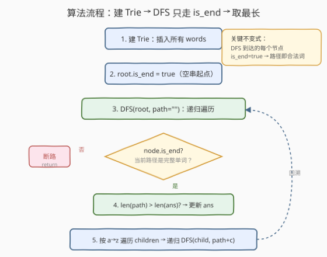
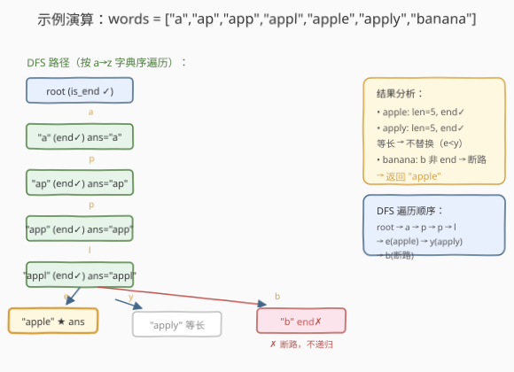
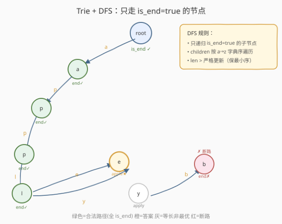

# LeetCode 包含所有前缀的最长单词 题解

## 1. 题目概述

- **标题 / 题号**：包含所有前缀的最长单词（#1858，medium）
- **链接**：https://leetcode.cn/problems/longest-word-with-all-prefixes/
- **难度**：中等
- **标签**：字典树、深度优先搜索、哈希表、排序

**题意**：给定一个字符串数组 `words`，找出其中**最长**的单词——该单词的**每一个前缀**（从长度 1 到自身长度的所有前缀）都必须出现在 `words` 中。若存在多个等长候选，返回**字典序最小**的那个；若无解，返回空字符串 `""`。

> 💡 **前缀的定义**：字符串 `s` 的前缀是 `s[0:k]`（$1 \le k \le |s|$）。注意：前缀长度从 1 开始（不含空串），到单词自身长度结束（含单词自身，而单词自身显然在 `words` 中）。

**示例 1**：

```text
输入：words = ["a", "banana", "app", "appl", "ap", "apply", "apple"]
输出："apple"
解释："apple" 的所有前缀 "a", "ap", "app", "appl", "apple" 都在 words 中。
      "apply" 同样合法且等长，但 "apple" 字典序更小（e < y）。
      "banana" 的前缀 "b" 不在 words 中，非法。
```

**示例 2**：

```text
输入：words = ["a", "b"]
输出："a"
解释："a" 和 "b" 都合法（长度 1 的单词前缀只有自身，必在 words 中），等长取字典序最小 "a"。
```

**示例 3**：

```text
输入：words = ["abc", "ab", "a"]
输出："abc"
解释："a" 合法 → "ab" 的前缀 "a" 在 words 中，合法 → "abc" 的前缀 "a", "ab" 都在 words 中，合法且最长。
```

**约束**：

- $1 \le \text{words.length} \le 10^4$
- $1 \le \text{words}[i].\text{length} \le 10^3$
- $\sum \text{words}[i].\text{length} \le 10^5$
- `words[i]` 仅由小写英文字母组成
- `words` 中所有字符串**互不相同**

> 💡 **关键直觉**：合法单词的前缀也一定合法——这构成了一条从短到长的「前缀链」。如果沿这条链走，每到达一个节点就意味着「从根到这里路径上每一步都是完整单词」。这正是 **Trie（字典树）** 的天然结构：Trie 的每条边对应一个字符，`is_end` 标记「到此为止是一个完整单词」。只要 DFS 时**只走 `is_end = true` 的子节点**，就能保证路径上每一步都合法。

## 2. 解题思路

### 2.1 暴力思路：逐词检查全部前缀

对每个单词 `word`，检查它的所有前缀 `word[:1], word[:2], …, word[:len-1]` 是否都在 `words` 中。若全部存在，则 `word` 是合法候选。最后在所有合法候选中取最长（等长取字典序最小）者。

若用哈希集合存储 `words`，每次前缀查询 $O(L)$（取子串 + 哈希），每个单词需查 $L$ 次前缀，整体 $O(N \cdot L^2)$。当 $L$ 较大时（$L \le 10^3$），$L^2$ 可达 $10^6$，总运算量 $10^{10}$ 级，可能超时。

> ⚠️ 瓶颈：① 对每个单词**重复验证**前缀——合法的长词的前缀也合法，但暴力法不利用这一传递性；② 取子串 + 哈希的常数开销随 $L$ 增大而放大。两处都指向同一个优化：用 Trie 把前缀关系编码进树结构，沿树行走时**天然完成前缀验证**。

### 2.2 核心观察：Trie + DFS（只走 is_end 节点）


把问题拆成两件事：

1. **前缀链的传递性**：若 `word` 合法（所有前缀在 `words` 中），则 `word[:-1]` 也合法（它的前缀是 `word` 前缀的真子集，自然也都在）。反之，若 `word[:-1]` 合法且 `word` 在 `words` 中，则 `word` 也合法。这构成了一条从短到长的构建链。

2. **Trie 把前缀链编码为树路径**：将所有 `words` 插入 Trie，每个单词末字符节点标记 `is_end = true`。从根出发，沿某条路径行走，每经过一个 `is_end` 节点就意味着「到此为止是一个完整单词」。若 DFS 时**只递归进入 `is_end = true` 的子节点**，则路径上每一步都是完整单词——即「前缀链不断裂」。

> 💡 **为什么只走 `is_end` 节点就够？** `is_end = false` 的节点表示「到此为止不是完整单词」。例如 `words = ["apple"]` 时，Trie 中 `a → p → p → l → e` 路径上只有 `e` 标记 `is_end`，中间节点都不是。若 DFS 到了 `a` 发现 `is_end = false`（`"a"` 不在 `words` 中），说明 `"apple"` 的前缀 `"a"` 缺失，立即断路——无需继续往下走。这就是 Trie **天然剪枝**的优势：前缀断裂处自动停止。

> ⚠️ **等长取字典序最小**：DFS 遍历子节点时按 `a → z` 字典序，配合 `len(path) > len(ans)` 严格大于更新，保证等长时保留先到（字典序更小）的那个。

### 2.3 算法流程图



三步骨架：

```text
1. 建 Trie：遍历 words，逐字符插入，末字符节点 is_end = true
2. root.is_end = true（空串视为合法起点，让单字符词能被接受）
3. DFS(root, path="")：
   - 若 node.is_end == false → 断路，return
   - 若 len(path) > len(ans) → 更新 ans = path
   - 按 a→z 遍历 children → 递归 DFS(child, path + c)
4. 返回 ans
```

> 💡 **root.is_end = true 的含义**：根节点对应空串 `""`，不对应任何单词。但单字符词（如 `"a"`）的合法性要求其前缀（空串）「存在」——逻辑上空串天然存在。将 `root.is_end` 设为 `true` 使 DFS 能从根出发进入第一个字符的子节点，否则所有单字符词都被误判为非法。

### 2.4 示例演算



以 `words = ["a", "banana", "app", "appl", "ap", "apply", "apple"]` 为例。建 Trie 后，从 `root` 出发 DFS（按 `a→z` 字典序遍历子节点）：

| 步 | DFS 到达节点 | path | is_end? | 动作 | ans |
|----|-------------|------|---------|------|-----|
| ① | root | "" | ✓（预设） | 进入子节点 `a` | "" |
| ② | a | "a" | ✓ | 更新 ans（更长） | "a" |
| ③ | a→p | "ap" | ✓ | 更新 ans | "ap" |
| ④ | a→p→p | "app" | ✓ | 更新 ans | "app" |
| ⑤ | a→p→p→l | "appl" | ✓ | 更新 ans | "appl" |
| ⑥ | a→p→p→l→e | "apple" | ✓ | 更新 ans（len=5） | "apple" ★ |
| ⑦ | a→p→p→l→y | "apply" | ✓ | 等长(5)，**不替换** | "apple" |
| ⑧ | b | "b" | ✗ | **断路**，不递归 | "apple" |

最终返回 `"apple"`。

> 💡 **步 ⑦ 是关键**：DFS 按 `a→z` 字典序遍历 `l` 的子节点，先走 `e`（`"apple"`），再走 `y`（`"apply"`）。两者等长（5），用严格 `>` 不替换，`"apple"` 被保留。这是「字典序遍历 + 严格大于」配合解决等长取最小的标准技巧。
>
> ⚠️ **步 ⑧ 的剪枝**：`"b"` 节点 `is_end = false`（`"b"` 不在 `words` 中），DFS 立即断路，不会深入 `"ba"`、`"ban"` 等节点。即使 `banana` 长达 6，也无需检查——前缀链在第一字符就断了。

## 3. 参考代码

### 方法一：Trie + DFS（推荐）

### Python

```python
class TrieNode:
    def __init__(self):
        self.children = {}
        self.is_end = False

class Solution:
    def longestWord(self, words: list[str]) -> str:
        root = TrieNode()
        for w in words:
            cur = root
            for c in w:
                if c not in cur.children:
                    cur.children[c] = TrieNode()
                cur = cur.children[c]
            cur.is_end = True

        root.is_end = True                    # 空串视为合法起点
        ans = ""

        def dfs(node: TrieNode, path: str):
            nonlocal ans
            if not node.is_end:
                return                        # 前缀断裂，断路
            if len(path) > len(ans):
                ans = path                    # 严格大于，保字典序最小
            for c in sorted(node.children):   # a→z 字典序遍历
                dfs(node.children[c], path + c)

        dfs(root, "")
        return ans
```

### C++

```cpp
struct TrieNode {
    TrieNode* children[26] = {nullptr};
    bool is_end = false;
};

class Solution {
  public:
    string longestWord(vector<string>& words) {
        TrieNode* root = new TrieNode();
        for (const string& w : words) {
            TrieNode* cur = root;
            for (char c : w) {
                int idx = c - 'a';
                if (!cur->children[idx]) cur->children[idx] = new TrieNode();
                cur = cur->children[idx];
            }
            cur->is_end = true;
        }
        root->is_end = true;                  // 空串视为合法起点

        string ans;
        dfs(root, "", ans);
        return ans;
    }

  private:
    void dfs(TrieNode* node, string path, string& ans) {
        if (!node->is_end) return;            // 前缀断裂，断路
        if (path.size() > ans.size()) ans = path;
        for (int i = 0; i < 26; ++i) {        // a→z 字典序遍历
            if (node->children[i]) {
                path.push_back('a' + i);
                dfs(node->children[i], path, ans);
                path.pop_back();
            }
        }
    }
};
```

> ⚠️ **三个易错点**：
> 1. **`root.is_end` 必须设为 `true`**：否则 DFS 在根节点就断路，所有单词都无法到达。根节点对应空串，是前缀链的逻辑起点。
> 2. **更新条件用严格 `>`**：等长不替换才能保留字典序更小者（`a→z` 遍历已让小者先到）。若误用 `>=` 会把后到的同长更大者覆盖上去，违反题意。
> 3. **Python `sorted(node.children)`**：`dict` 的键顺序不保证（Python 3.7+ 插入序但非字典序），必须 `sorted()` 确保按 `a→z` 遍历。C++ 用 `for (int i = 0; i < 26; ++i)` 天然有序。

### 方法二：排序 + 哈希集合（对照）

```python
class Solution:
    def longestWord(self, words: list[str]) -> str:
        words.sort()                          # 字典序排序
        built = {""}                          # 空串为起点
        ans = ""
        for word in words:
            if word[:-1] in built:            # 前缀（去尾）已在 built 中
                built.add(word)
                if len(word) > len(ans):
                    ans = word
        return ans
```

> 💡 **原理**：字典序排序保证「前缀先于原词处理」（前缀更短，字典序更小）。遍历时只需检查 `word[:-1] ∈ built`，命中则 `word` 也合法（传递性）。`built` 初始含 `""` 让单字符词能被接受。与 Trie 解法核心思想一致——沿前缀链传递合法性，只是数据结构不同。

## 4. 复杂度分析

| 维度 | 复杂度 | 说明 |
|------|--------|------|
| **时间** | $O(S)$ | 建 Trie 遍历所有字符 $O(S)$；DFS 最坏访问所有 Trie 节点 $O(S)$（每个节点访问一次，子节点遍历 26 次=常数）。$S = \sum \text{words}[i].\text{length}$ |
| **空间** | $O(S)$ | Trie 节点总数 $\le S$（每字符至多新建一节点）；DFS 递归栈深度 $\le \max L$；`ans` 字符串 $O(\max L)$ |

其中 $S \le 10^5$，总运算量约 $10^5$ 级，远在时限内。

> 💡 **与排序+哈希集合的对比**：排序法时间 $O(S \log N \cdot L / N + S) \approx O(S \log N + S)$（排序 $O(N \log N \cdot \bar L)$ + 遍历 $O(S)$），空间 $O(S)$。当 $N$ 较大时排序的 $\log N$ 因子使 Trie 法更优；$N$ 较小时二者相当。Trie 法无需排序、天然剪枝，是大规模数据下的稳健选择。

> ⚠️ 暴力逐词检查前缀 $O(N \cdot L^2)$ 在 $L$ 较大时可能超时（$L = 10^3$ 时 $L^2 = 10^6$，$N = 10^4$ 时总 $10^{10}$）。Trie 把前缀验证分摊到树结构中，每个字符只处理一次，降到 $O(S)$。

## 5. 扩展：Trie + BFS 与方法对比



### 5.1 BFS 替代 DFS

DFS 用递归栈，也可改用 BFS（队列）遍历 Trie——按层扩展，同样只走 `is_end` 节点：

```python
from collections import deque

class Solution:
    def longestWord(self, words: list[str]) -> str:
        root = TrieNode()
        for w in words:
            cur = root
            for c in w:
                if c not in cur.children:
                    cur.children[c] = TrieNode()
                cur = cur.children[c]
            cur.is_end = True

        root.is_end = True
        ans = ""
        q = deque([(root, "")])
        while q:
            node, path = q.popleft()
            if not node.is_end:
                continue
            if len(path) > len(ans):
                ans = path
            for c in sorted(node.children, reverse=True):  # 逆序入队，正序出队
                q.append((node.children[c], path + c))
        return ans
```

> 💡 **BFS 的入队顺序**：队列是 FIFO，若要按 `a→z` 顺序处理，需**逆序入队**（`z→a`），出队时即 `a→z`。或改用优先队列按 `(len, path)` 排序。本题 BFS 与 DFS 等价——都是遍历 Trie 中所有 `is_end` 连通路径，时间空间同为 $O(S)$。

### 5.2 三种方法对比

| 维度 | Trie + DFS | Trie + BFS | 排序 + 哈希集合 |
|------|-----------|-----------|----------------|
| **时间** | $O(S)$ | $O(S)$ | $O(S + N \log N \cdot \bar L)$ |
| **空间** | $O(S)$（Trie + 栈） | $O(S)$（Trie + 队列） | $O(S)$（哈希集合） |
| **排序** | 不需要 | 不需要 | 需要 |
| **剪枝** | 天然（is_end 断路） | 天然 | 无（全词检查前缀） |
| **实现** | 中等 | 中等 | 简洁 |
| **大规模** | 稳健 | 稳健 | $\log N$ 因子 |

> 💡 **选型建议**：$S$ 较大（$\ge 10^5$）时优先 Trie + DFS，无排序开销且天然剪枝；$N$ 较小（$\le 10^3$）时排序 + 哈希集合更简洁。面试建议先讲 Trie + DFS（展示 Trie 能力），再提排序法作为简洁对照。

### 5.3 与 720. 词典中最长的单词 的关系

本题与 [720. 词典中最长的单词](../0701-0800/720_词典中最长的单词.md) 本质相同：720 要求「能由词典中其他单词每次加一个字符逐步构建」，等价于「所有前缀都在词典中」。两题解法完全互通，区别仅在数据规模——720 的 $N \le 1000$、$L \le 30$，排序+哈希集合已绰绰有余；本题 $S$ 可达 $10^5$，Trie 的线性复杂度更有优势。

## 6. 面试要点

1. **为什么用 Trie 而不是逐词检查前缀？**

   > 逐词检查需对每个单词验证 $O(L)$ 个前缀，每次取子串 + 哈希 $O(L)$，整体 $O(N \cdot L^2)$，$L$ 大时超时。Trie 把前缀关系编码进树结构——沿树行走时每经过一个 `is_end` 节点就自动确认了一个合法前缀，无需重复取子串。每个字符只处理一次，总时间 $O(S)$。

2. **为什么 DFS 只走 `is_end = true` 的子节点？**

   > `is_end` 标记「从根到当前节点的路径构成一个完整单词」。若某节点 `is_end = false`，说明该前缀不在 `words` 中，路径在此断裂——后续更长前缀必然也不合法（它们包含这个缺失前缀）。立即断路（return）是安全的剪枝，避免无意义深入。

3. **`root.is_end = true` 的作用是什么？**

   > 根节点对应空串。单字符词（如 `"a"`）的前缀只有空串，逻辑上空串天然存在。将 `root.is_end` 设为 `true`，DFS 才能从根进入第一个字符的子节点；否则根节点就断路了，所有单词都无法到达。这与排序法中 `built` 初始含 `""` 是同一思想。

4. **等长候选如何保证取字典序最小？**

   > DFS 按 `a→z` 字典序遍历子节点（Python `sorted(children)`，C++ `for i in 0..25`），保证同长度单词中字典序小者先被访问。更新条件用严格 `len(path) > len(ans)`，等长不替换，自然保留先到（更小）的那个。若误用 `>=`，后到的同长更大者会覆盖。

5. **Trie + DFS 与排序 + 哈希集合各有何优劣？**

   > Trie 法时间 $O(S)$，无排序开销，天然剪枝，适合大规模数据；但需实现 Trie 结构，代码量更大。排序法简洁（几行核心代码），但有 $O(N \log N)$ 排序开销，适合小规模数据。两者核心思想一致——沿前缀链传递合法性，只是数据结构不同。

> 💡 **一句话总结**：建 Trie 后 DFS 只走 `is_end` 节点，按 `a→z` 字典序遍历 + 严格 `>` 更新，天然剪枝且保证等长取字典序最小。$O(S)$ 时间、$O(S)$ 空间。

## 同类练习题

| # | 题目 | 与本题的关联 |
|---|------|-------------|
| 720 | [词典中最长的单词](https://leetcode.cn/problems/longest-word-in-dictionary/)（[站内题解](../0701-0800/720_词典中最长的单词.md)） | 本题的免费版，题意完全等价，数据规模更小（$N \le 1000, L \le 30$），排序+哈希集合即可，对照本题 Trie 解法的选择动机 |
| 208 | [实现 Trie（前缀树）](https://leetcode.cn/problems/implement-trie-prefix-tree/)（[站内题解](../0201-0300/208_实现Trie.md)） | Trie 的基础模板，先掌握插入/查找/前缀搜索再回看本题 Trie + DFS 的剪枝逻辑 |
| 1233 | [删除子文件夹](https://leetcode.cn/problems/remove-sub-folders/)（[站内题解](../1201-1300/1233_删除子文件夹.md)） | Trie 遇终点即截断子树——与本题「遇 `is_end` 断路」互为镜像，一个保留前缀链、一个截断前缀子树 |
| 648 | [单词替换](https://leetcode.cn/problems/replace-words/) | Trie 找最短前缀根词，与本题同为「Trie + `is_end` 标记」的词典型应用，对照「找最短前缀」与「找最长前缀链」 |
| 820 | [单词的压缩编码](https://leetcode.cn/problems/short-encoding-of-words/)（[站内题解](../0801-0900/820_单词的压缩编码.md)） | Trie 反向插入找后缀完整性，与本题「前缀完整性」对照，都是用 `is_end`/叶子节点判定字符串的合法边界 |
