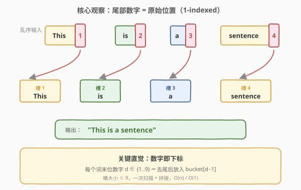
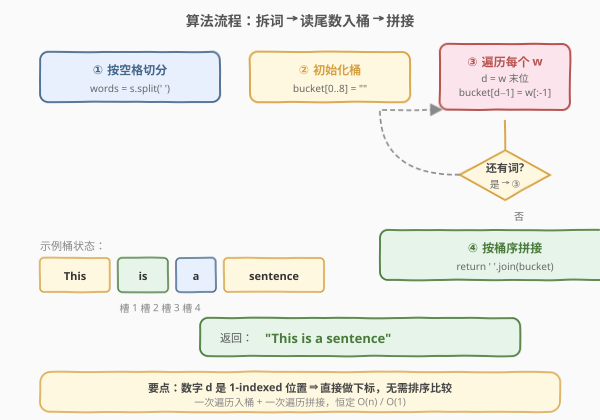
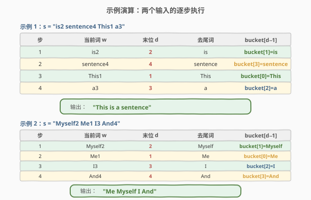

# 把句子排序

- **题目名称**：把句子排序
- **链接**：[1859. 把句子排序](https://leetcode.cn/problems/sorting-the-sentence/)
- **难度**：简单
- **标签**：字符串、排序、数组

## 1. 题目概述

一个 **句子** 指的是由若干用单个空格分隔、且不含前导/尾随空格的单词组成的串。每个单词由大小写英文字母组成。

现把一个句子的单词打乱：在每个单词末尾追加一个 **数字**（`1` 到 `9`）表示它在原句中的位置，再把所有单词顺序打乱。给你打乱后的句子 `s`（至多 9 个单词），请还原出原始句子。

**示例 1**：

```text
输入：s = "is2 sentence4 This1 a3"
输出："This is a sentence"
解释：词尾数字给出原始位置——This1 在第 1 位，is2 在第 2 位，a3 在第 3 位，sentence4 在第 4 位。
```

**示例 2**：

```text
输入：s = "Myself2 Me1 I3 And4"
输出："Me Myself I And"
```

**约束条件**：

- `2 <= s.length <= 200`
- `s` 由大小写英文字母、空格以及数字 `1` 到 `9` 组成
- `s` 中单词数在 `1` 到 `9` 之间
- 单词间以单个空格分隔，无前导/尾随空格

> 💡 **核心矛盾**：词序被打乱，但每个词自带的「尾部数字」就是它的原始下标——这是一个**键已嵌入数据**的排序问题。关键观察：数字范围仅 `1..9`，可否跳过比较排序、直接按下标「入桶」？

---

## 2. 解题思路

### 2.1 暴力思路：按数字排序

最直觉的做法：把 `s` 按空格切成单词数组，以每个词的末位数字为键做一次**比较排序**，再去掉每个词的末位数字、用空格拼接。

```text
words = s.split(' ')
words.sort(key=lambda w: w[-1])              # 按末位数字升序排
return ' '.join(w[:-1] for w in words)        # 去尾拼接
```

时间 $O(m \log m)$（$m$ 为单词数，$m \le 9$），空间 $O(m)$。能 AC，但有一个可优化点：

- **比较排序是「大炮打蚊子」**：键值取值范围只有 $\{1, 2, \dots, 9\}$，且**恰好覆盖** $1$ 到 $m$ 的一个排列。比较排序无视这一约束，仍花费 $\log m$ 层比较；而事实上数字本身就是目标下标，**无需两两比较**。

> 💡 转机：把「排序」重定义为「按下标直接放置」——读出词尾数字 $d$，把去尾后的词写入 `bucket[d-1]`，最后顺次拼接桶即可。这就是**键值即下标**的桶排序退化形式（计数排序的「直接放置」版）。

### 2.2 核心观察：数字即下标，入桶即排序



题目保证每个单词末尾的数字 $d \in \{1, \dots, 9\}$，且整个句子是一个 $1$ 到 $m$ 的排列（无重复、无缺失）。这意味着：

$$\text{词尾数字 } d \;\longleftrightarrow\; \text{原始位置（1-indexed）} \;\longleftrightarrow\; \text{桶下标 } d-1 \text{（0-indexed）}$$

于是排序被「降维」为一次直接寻址写入：

$$\text{bucket}[d - 1] \;\gets\; w[\,0\,:\,\text{len}(w)-1\,]$$

最后 `' '.join(bucket)` 即得原句。

> 💡 **为什么成立？** 桶排序在键值取值有限且密集时退化为 $O(m)$ 的「直接放置」——本题键值 $\{1,\dots,m\}$ 恰好是 $m$ 个连续整数、互不重复，每个词独占一个桶，**入桶顺序无关、入桶即定序**。比较排序的 $\log m$ 比较层完全被「数字 = 下标」的常数时间寻址取代。

### 2.3 算法流程图



一次遍历 + 一次拼接：

1. **切分**：`words = s.split(' ')`，得到 $m$ 个带尾数的单词。
2. **建桶**：开长度为 $m$（或固定 `9`）的数组 `bucket`，初始为空串。
3. **入桶**：对每个词 $w$：读末位字符 $d = w[-1]$（ASCII 数字），去尾得 $w' = w[:-1]$，令 `bucket[d - '1'] = w'`。
4. **拼接**：`return ' '.join(bucket)`，按桶序输出。

> 💡 **末位即键**：$w[-1]$ 是字符 `'1'`..`'9'`，直接用 `d - '1'`（C++）或 `ord(d) - ord('1')`（Python）得到 $0$-indexed 下标，无需把数字字符转成 `int` 再减 1，省一次类型转换。

### 2.4 示例演算



以题目给出的两个示例逐字验证。示例 1 中 `This1` 虽排在输入第 3 位，但因尾数为 `1` 被直接放入 `bucket[0]`——**输入顺序与放置位置完全解耦**，这正是「键即下标」的优势：无论词以何种顺序到来，只要尾数正确，最终桶序恒为原句顺序。

| 示例 | 输入 | 桶状态（1→4） | 输出 |
|------|------|--------------|------|
| 1 | `"is2 sentence4 This1 a3"` | `This | is | a | sentence` | `"This is a sentence"` |
| 2 | `"Myself2 Me1 I3 And4"` | `Me | Myself | I | And` | `"Me Myself I And"` |

> 💡 两个示例中输入的词序都「乱」，但每个词的尾数精确指明其归属桶。第 2 个示例尤其直观：`Me1` 在输入里排第 2，却因尾数 `1` 直接落在 `bucket[0]`，输出时率先登场。

---

## 3. 参考代码

### C++（数组入桶 + 拼接）

```cpp
class Solution {
  public:
    string sortSentence(string s) {
        vector<string> words;
        stringstream ss(s);
        string w;
        while (ss >> w) words.push_back(w);     // 按空格切分

        int m = words.size();
        vector<string> bucket(m);
        for (const string& w : words) {
            int d = w.back() - '1';             // 末位数字 → 0-indexed 下标
            bucket[d] = w.substr(0, w.size() - 1);
        }

        string ans;
        for (int i = 0; i < m; ++i) {
            if (i) ans += ' ';
            ans += bucket[i];
        }
        return ans;
    }
};
```

### Python（列表入桶 + join）

```python
class Solution:
    def sortSentence(self, s: str) -> str:
        bucket = [''] * 9
        m = 0
        for w in s.split(' '):
            d = ord(w[-1]) - ord('1')          # 末位数字 → 0-indexed 下标
            bucket[d] = w[:-1]
            m = max(m, d + 1)
        return ' '.join(bucket[:m])
```

### Python（排序一行流，对照用）

```python
class Solution:
    def sortSentence(self, s: str) -> str:
        return ' '.join(w[:-1] for w in sorted(s.split(), key=lambda x: x[-1]))
```

> ⚠️ **两种写法的对比**：排序写法 `sorted(..., key=lambda x: x[-1])` 简洁优雅、工程中常用，但 (1) 调用通用比较排序，无视「键即 $1..m$ 排列」这一约束，多花 $\log m$ 层比较（$m \le 9$ 时常数可忽略，但思想上有差别）；(2) 需额外排好序的中间数组。入桶写法把「排序」退化为 $O(m)$ 直接寻址，且 `bucket[d-1] = w[:-1]` 一行同时完成「定位 + 去尾」。面试建议先写入桶版点出「键即下标」的观察，再提排序版作为对照。

---

## 4. 复杂度分析

| 维度 | 复杂度 | 说明 |
|------|--------|------|
| 时间复杂度 | $O(n)$ | 切分扫描整串一次 $O(n)$；$m$ 个词各 $O(1)$ 入桶共 $O(n)$；拼接再 $O(n)$。$n$ 为串长 |
| 空间复杂度 | $O(n)$ | 存 $m$ 个去尾词的桶，总字符数等于原句字母数 $O(n)$（不计返回值的额外常数） |

> 💡 与比较排序法的对比：比较排序法时间 $O(n + m \log m)$、空间 $O(n)$。由于 $m \le 9$，$\log m \le 3.17$，二者实际常数差异极小；但入桶法体现了「键值受限时排序可退化为线性寻址」这一通用思想，可迁移到键值范围更大的桶排序/计数排序场景。

---

## 5. 扩展：从「键即下标」到桶排序/计数排序

### 5.1 三种「受限键值排序」的谱系

| 方法 | 适用键值 | 本题关系 |
|------|----------|----------|
| **直接放置**（本题） | 键是 $1..m$ 的排列，一一对应 | 每个键独占一桶，入桶即定序 |
| **桶排序** | 键值范围有限但可能重复 | 每个桶是一个链表，容纳同键多元素 |
| **计数排序** | 键值为整数，需统计频次 | 桶里存的是计数而非元素本身 |

本题是「直接放置」的最简形态——键值互不重复且恰好覆盖下标区间，连「桶内链表」都退化成单元素。

### 5.2 若数字范围扩大

若题面放宽为「词尾数字范围 $1..k$，$k$ 较大且可能有重复」，则：

- 仍有重复时退化为标准桶排序（桶内链表/动态数组）。
- 若需稳定排序，入桶时按扫描顺序尾插即可保序。

### 5.3 与「键已嵌入数据」模式的联系

本题词尾数字是一种**自描述键**——键随数据一起携带，无需外部键函数。同类模式：

- 数据库自增主键、日志带时间戳：键即数据一部分。
- LRU 缓存里「访问顺序」需外部维护（键不自带），对比之下本题的「自带键」省去了维护顺序的开销。

---

## 6. 面试要点

**Q1：为什么用入桶而不是比较排序？**

> 词尾数字 $d \in \{1,\dots,9\}$ 且是 $1..m$ 的排列，键值受限且密集。比较排序的 $\log m$ 比较层在此完全多余——数字本身就是目标下标，`bucket[d-1] = w[:-1]` 一步完成定位 + 去尾，时间退化为线性 $O(m)$。虽 $m \le 9$ 时常数差异微小，但「键即下标」是可迁移到更大规模的核心思想。

**Q2：如何把末位字符转成下标？需要 `stoi` 吗？**

> 不需要。$w[-1]$ 是字符 `'1'`..`'9'`，其 ASCII 值连续，直接 `w.back() - '1'`（C++）或 `ord(w[-1]) - ord('1')`（Python）即得 $0$-indexed 下标。省去字符串→整数的类型转换，且天然向下标对齐。

**Q3：桶大小开 `9` 还是开 `m`？**

> 两者皆可。开 `m = words.size()` 精确匹配，拼接时遍历 `[0, m)`；开固定 `9`（题面上限）更省一次 `size()` 调用，但拼接前需记录实际词数 `m`（Python 版用 `m = max(m, d+1)`）。题目保证数字是 $1..m$ 的排列，故两种开法都安全，无越界风险。

**Q4：题目保证「数字是 $1..m$ 的排列」，若不保证（可能有缺失/重复）怎么办？**

> 缺失：对应桶为空串，拼接时会出现连续空格或空词——需在 `join` 前过滤空桶。重复：后写入会覆盖先写入，丢失数据——需把桶升级为链表/动态数组容纳同键多元素，即标准桶排序。此时线性「直接放置」退化为 $O(n + k)$ 的桶排序，$k$ 为键值范围。

**Q5：能否做到 $O(1)$ 额外空间（原地）？**

> 较难。本题输入是单个字符串，单词长度不一，原地修改需处理「去尾后词长变化 + 重排」两次内存搬移，常数大且易错。工程上不如直接开 $O(n)$ 桶清晰。若改为「词等长 + 输入为字符数组」可尝试双指针重排，但已偏离本题题面。

---

## 7. 同类练习题

- [1816. 截断句子](https://leetcode.cn/problems/truncate-sentence/)（[站内题解](../1801-1900/1816_截断句子.md)）：同为「句子按空格切分 + 一次扫描」——找第 k 个空格截断前 k 词，对照本题「切分后按尾数入桶」，一个截断一个重排，共享「单词边界 = 空格位置」的预处理
- [1662. 检查两个字符串数组是否相等](https://leetcode.cn/problems/check-if-two-string-arrays-are-equivalent/)（[站内题解](../1601-1700/1662_检查两个字符串数组是否相等.md)）：同为「字符串数组与单空格拼接的等价判定」——把词数组 join 成串后比较，对照本题把桶数组 join 成串输出，共享 `' '.join` 拼接语义
- [1704. 判断字符串的两半是否相近](https://leetcode.cn/problems/determine-if-string-halves-are-alike/)（[站内题解](../1701-1800/1704_判断字符串的两半是否相近.md)）：同为「按位置切分字符串 + 字符级统计」——对半切分后比较元音频次，对照本题按尾数切分后按下标重排，都是「位置信息驱动处理」的字符串题
- [1854. 人口最多的年份](https://leetcode.cn/problems/maximum-population-year/)（[站内题解](../1801-1900/1854_人口最多的年份.md)）：同为「键值受限时的线性统计」——年份范围仅 100，用差分数组/桶统计人口峰值，对照本题数字范围仅 9 用桶重排，都是「键值小⇒放弃比较、直接寻址」的桶思想
- [1832. 判断句子是否为全字母句](https://leetcode.cn/problems/check-if-the-sentence-is-pangram/)（[站内题解](../1801-1900/1832_判断句子是否为全字母句.md)）：同为「对句子做字符级处理 + 受限状态压缩」——用 26 比特掩码判全字母，对照本题用 9 桶判词序，都是「状态空间小⇒用紧凑结构替代通用容器」的思路
