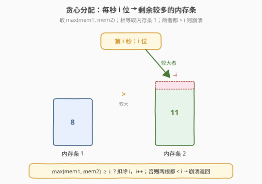
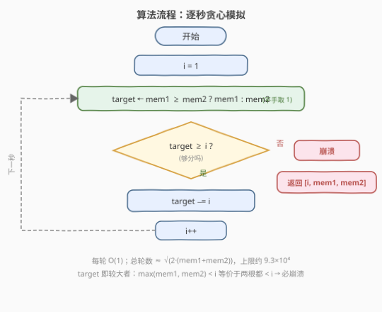

# 增长的内存泄露

- **题目名称**：增长的内存泄露
- **链接**：[1860. 增长的内存泄露](https://leetcode.cn/problems/incremental-memory-leak/)
- **难度**：中等
- **标签**：模拟、贪心、数学

## 1. 题目概述

给你两个整数 `memory1` 和 `memory2`，分别表示两个内存条剩余可用内存的位数。现在有一个程序以**每秒递增**的速度消耗内存。

在第 `i` 秒（秒数从 `1` 开始），有 `i` 位内存被分配到**剩余内存较多**的内存条（如果两者一样多，则分配到第一个内存条）。如果两者剩余内存都**不足** `i` 位，那么程序将**意外退出**。

请返回一个数组 `[crashTime, memory1crash, memory2crash]`，其中 `crashTime` 是程序意外退出的时间（秒），`memory1crash` 和 `memory2crash` 分别是两个内存条最后剩余内存的位数。

**示例 1**：

```text
输入：memory1 = 2, memory2 = 2
输出：[3,1,0]
解释：
- 第 1 秒，内存条 1 被占用 1 位，剩余 1 位。
- 第 2 秒，内存条 2 被占用 2 位，剩余 0 位。
- 第 3 秒，程序意外退出，两个内存条分别剩 1 位和 0 位。
```

**示例 2**：

```text
输入：memory1 = 8, memory2 = 11
输出：[6,0,4]
解释：
- 第 1 秒，内存条 2 被占用 1 位，剩 10 位。
- 第 2 秒，内存条 2 被占用 2 位，剩 8 位。
- 第 3 秒，内存条 1 被占用 3 位，剩 5 位。
- 第 4 秒，内存条 2 被占用 4 位，剩 4 位。
- 第 5 秒，内存条 1 被占用 5 位，剩 0 位。
- 第 6 秒，程序意外退出，两个内存条分别剩 0 位和 4 位。
```

**约束条件**：

- $0 \le \text{memory1},\ \text{memory2} \le 2^{31} - 1$

> 💡 **审题关键**：消耗速度是**递增**的（第 `i` 秒恰好消耗 `i` 位），不是匀速；分配目标是**当前**剩余较多者，每秒都要重新比较；崩溃条件是"两者都 `< i`"——由于我们总是挑较大者，这等价于"较大者 `< i`"（见 2.2）。`memory` 上界达 $2^{31}-1$，必须确认模拟轮数不会爆炸（见第 5 节的界分析）。

---

## 2. 解题思路

### 2.1 暴力思路：逐秒模拟

最直白的做法就是**照着题意一秒一秒推**：维护 `i = 1, 2, 3, ...`，每秒先比较 `memory1` 与 `memory2`，把 `i` 位扣给较大者（平手给内存条 1）；若较大者都凑不够 `i` 位，则崩溃，返回 `[i, memory1, memory2]`。

- **正确性**：完全复刻题意，无歧义；
- **效率顾虑**：`memory` 可达 $2^{31}-1$，乍看似乎会循环几十亿次。但崩溃时间 $T$ 满足 $1 + 2 + \cdots + (T-1) \le \text{memory1} + \text{memory2}$，即 $T(T-1)/2 \le M$，故 $T = O(\sqrt{M}) \approx O(\sqrt{2 \cdot 2^{32}}) \approx 9.3 \times 10^4$。也就是说**最多约 9 万轮**，模拟完全可行。

> ⚠️ 关键在于识别"消耗递增"带来的 $\sqrt{\ \ }$ 收敛：累计消耗是 $i$ 的二次函数，所以轮数是总内存的**平方根量级**，而非线性。若题目改成"每秒消耗 1 位"（匀速），则轮数退化为 $O(M)$，$M = 2^{31}$ 时会超时。第 5 节给出严格推导。

### 2.2 核心观察：贪心分配——较大者独占与单一崩溃判定



题意可以提炼为两条等价规则，把"分配 + 崩溃判定"压成每轮 $O(1)$：

**规则一（贪心选择）**：第 $i$ 秒分配给 $\max(\text{memory1},\ \text{memory2})$，平手时取内存条 1。这一步是纯比较 + 一次减法，无需回溯、无需记忆历史——因为每秒的决策只依赖**当前**两根内存条的剩余量。

**规则二（崩溃判定的等价简化）**：题目说"两者都 `< i` 才崩溃"。由于我们总是把 $i$ 分给较大者，若**较大者**已经 `< i`，则较小者 $\le$ 较大者 `< i` 也必然 `< i`。反之若较大者 $\ge i$，就一定能成功分配。因此：

$$\text{崩溃} \iff \max(\text{memory1},\ \text{memory2}) < i$$

> 💡 这条等价让代码极其简洁：选定 `target = memory1 >= memory2 ? memory1 : memory2` 后，只需检查 `target >= i`——成立则 `target -= i`，不成立直接 `break`。**无需单独再判另一根**。平手条件 `memory1 >= memory2`（含等号）天然把平手归入内存条 1 的分支。

> ⚠️ **平手归内存条 1** 是易错点：比较必须用 `memory1 >= memory2`（带等号）把"选谁"与"扣谁"写在同一个 `if` 分支里，避免先判严格大小再单独处理平手导致遗漏。第 6 节 Q2 详述。

### 2.3 算法流程图



流程核心：初始化 `i = 1`，进入循环——

1. **选 target**：`target = memory1 >= memory2 ? memory1 : memory2`（平手取内存条 1）。
2. **判崩溃**：若 `target < i`，说明较大者都凑不够，`break`，此时 `i` 即崩溃时间。
3. **扣减**：`target -= i`（即对相应内存条减 `i`）。
4. **递进**：`i++`，回到步骤 1。

> 💡 `target` 只是个临时别名，真正改动的是 `memory1` 或 `memory2` 本身。循环退出时的 `i`、`memory1`、`memory2` 即返回值三元组。

### 2.4 示例演算

![示例演算：memory1=8, memory2=11 → [6,0,4]](../images/1860_example_walkthrough.svg)

以示例 2 `memory1 = 8, memory2 = 11` 为例，逐秒推演：

| 秒 $i$ | 较大者 | 分配 | memory1 余 | memory2 余 | 说明 |
|--------|--------|------|------------|------------|------|
| 1 | 内存条 2 (11) | −1 | 8 | **10** | 11 > 8，扣 mem2 |
| 2 | 内存条 2 (10) | −2 | 8 | **8** | 10 > 8，扣 mem2 |
| 3 | 内存条 1 (平手) | −3 | **5** | 8 | 8 == 8，平手归 mem1 |
| 4 | 内存条 2 (8) | −4 | 5 | **4** | 8 > 5，扣 mem2 |
| 5 | 内存条 1 (5) | −5 | **0** | 4 | 5 > 4，扣 mem1 |
| 6 | 崩溃 | — | 0 | 4 | max(0,4)=4 < 6 → 退出 |

最终返回 `[6, 0, 4]` ✓。

> 💡 **观察要点**：① 第 3 秒两根都剩 8，平手触发"归内存条 1"，这是把 `>=` 写进比较分支的直接体现；② 第 5 秒扣完 mem1 归 0，第 6 秒虽然 mem2 还剩 4 但 $4 < 6$ 凑不够，且 mem1 = 0 更不够，于是崩溃——验证了"较大者 `< i` 即崩溃"的等价判定；③ 整个过程两根内存条的剩余量始终被贪心地"拉向平衡"，这是后面界分析中"平衡输入崩溃更早"的直观来源。

---

## 3. 参考代码

### C++

```cpp
class Solution {
  public:
    vector<int> memLeak(int memory1, int memory2) {
        int i = 1;
        while (true) {
            if (memory1 >= memory2) {   // 平手也归内存条 1
                if (memory1 < i) break; // 较大者 < i 等价于两根都 < i → 崩溃
                memory1 -= i;
            } else {
                if (memory2 < i) break;
                memory2 -= i;
            }
            ++i;
        }
        return {i, memory1, memory2};
    }
};
```

### Python

```python
class Solution:
    def memLeak(self, memory1: int, memory2: int) -> List[int]:
        i = 1
        while True:
            if memory1 >= memory2:      # 平手也归内存条 1
                if memory1 < i:         # 较大者 < i 等价于两根都 < i → 崩溃
                    break
                memory1 -= i
            else:
                if memory2 < i:
                    break
                memory2 -= i
            i += 1
        return [i, memory1, memory2]
```

> ⚠️ **三个易错点**：① 比较用 `memory1 >= memory2`（带等号）把平手归入 mem1 分支；② 崩溃判定只看较大者 `target < i` 即可，不必再判另一根；③ `break` 时**不要**再 `i++`——崩溃发生在第 `i` 秒，`i` 本身就是 `crashTime`，扣减失败的这一秒未实际分配。

---

## 4. 复杂度分析

| 维度 | 复杂度 | 说明 |
|------|--------|------|
| 时间复杂度 | $O(\sqrt{\text{memory1} + \text{memory2}})$ | 崩溃时间 $T$ 满足 $T(T-1)/2 \le M$，故 $T = O(\sqrt{M})$；上限 $M \le 2(2^{31}-1) \approx 4.3 \times 10^9$，$T \le 9.3 \times 10^4$ |
| 空间复杂度 | $O(1)$ | 仅 `i` 与两个内存条变量，原地模拟 |

> 💡 关键在于"消耗速度递增"让累计消耗是 $i$ 的**二次**函数，轮数取平方根量级。即便内存拉满到 $2^{31}-1$，循环也不到 $10^5$ 次，毫秒级 AC。这与"匀速消耗"问题的 $O(M)$ 形成鲜明对比——递增 vs 匀速决定了对大输入是否需要数学优化。

---

## 5. 扩展：崩溃时间的界分析与闭式上界

### 5.1 闭式上界

设 $M = \text{memory1} + \text{memory2}$，崩溃时间为 $T$（第 $T$ 秒退出，此前成功分配了 $1, 2, \dots, T-1$）。前 $T-1$ 秒累计消耗为

$$S(T-1) = 1 + 2 + \cdots + (T-1) = \frac{T(T-1)}{2} \le M.$$

解 $T(T-1)/2 \le M$ 得崩溃时间的**上界**：

$$T \le \left\lfloor \frac{1 + \sqrt{1 + 8M}}{2} \right\rfloor.$$

代入最大输入 $M \le 2(2^{31}-1) \approx 4.29 \times 10^9$，得 $T \le 92\,673$。这从理论上保证了逐秒模拟最多约 $9.3 \times 10^4$ 轮，无需任何加速。

> ⚠️ 计算时 $8M$ 可达 $3.4 \times 10^{10}$，超过 32 位 `int` 范围，C++ 中需用 `long long` 或 `double`：`T_bound = (1 + sqrt(1 + 8LL * M)) / 2`。

### 5.2 上界何时紧、何时不紧——崩溃时间依赖分配

上面的闭式只是一个**上界**，并非精确崩溃时间。精确的 $T$ 还依赖两根内存条的**初始分配**，因为贪心选择会动态影响每根的剩余：

- **单根独占时上界紧**：如 `memory1 = 10, memory2 = 0`，$M = 10$，公式给出 $T \le 5$，模拟恰在第 5 秒崩溃（mem1 被一路扣到 0 后，第 5 秒 $0 < 5$ 退出）。此时贪心始终扣同一根，行为等同于"一根内存条对抗递增消耗"，$T$ 取到上界。
- **平衡时崩溃更早**：如 `memory1 = 5, memory2 = 5`，$M$ 同为 10，公式上界仍是 5，但实际第 4 秒就崩溃——因为平手与交替扣减让两根**同步**下降，更快地双双跌破当前秒的需求。

$$\underbrace{(10, 0)}_{M=10,\ T=5} \quad \text{vs} \quad \underbrace{(5, 5)}_{M=10,\ T=4}$$

> 💡 直觉：贪心总是扣较大者，相当于一直在"削峰填谷"地拉平两根。初始越平衡，两根下降越同步，越早出现"两根都 `< i`"。因此**总内存相同，平衡输入崩溃更早**，闭式上界只在极端不平衡时取到。这也说明崩溃时间无法用 $M$ 的单一闭式精确表达，必须模拟（或按"扣同一根的连续段"批量推进，但并无必要）。

### 5.3 是否需要批量加速？

理论上可以：当某根严格较大时，它会**连续**独占若干秒，直到被扣到不超过另一根。设其领先量为 $D$、当前秒为 $i$，连续独占秒数 $k$ 满足 $k(2i + k - 1)/2 \le D$，用二次求根公式 $O(1)$ 解出 $k$ 后整段跳过。但由于总轮数上界仅 $9.3 \times 10^4$，逐秒模拟已绰绰有余，批量优化属于"能做但无收益"的过度设计——**保持模拟的简单性更可取**。

---

## 6. 面试要点

**Q1：崩溃时间为什么是 $O(\sqrt{M})$ 而不是 $O(M)$？**

> 因为每秒消耗 $i$ 位且 $i$ 递增，前 $T-1$ 秒累计消耗 $\frac{T(T-1)}{2}$ 是 $T$ 的二次函数。由 $\frac{T(T-1)}{2} \le M$ 解得 $T = O(\sqrt{M})$。若改成每秒消耗常数位（匀速），累计消耗是 $T$ 的一次函数，$T$ 才会是 $O(M)$。识别"递增消耗"是判断模拟可行性的关键。

**Q2：为什么用 `memory1 >= memory2` 而不是 `memory1 > memory2`？**

> 平手时题目要求分配给**第一个**内存条。用 `>=` 把相等情形归入 mem1 分支，"选谁"与"扣谁"在同一 `if` 内完成，逻辑自洽。若写成 `>`，平手会落入 `else` 分支被当作 mem2 处理，方向就错了。这是本题最高频的 off-by-one 错误。

**Q3：崩溃判定为什么只看较大者 `< i` 就够？**

> 我们总是把 $i$ 分给较大者。若较大者 `< i`，则较小者 $\le$ 较大者 `< i` 也 `< i`，即两根都不够，崩溃；若较大者 $\ge i$，分配必成功。因此 $\max(\text{mem1}, \text{mem2}) < i \iff$ 两根都 `< i`，单一判定即可，无需分别检查两根。

**Q4：`break` 时要不要再 `i++`？返回的 `crashTime` 是哪个值？**

> 不要。`break` 发生在第 `i` 秒发现较大者 `< i` 的时刻，这一秒**未实际分配**（分配失败导致崩溃），所以 `i` 本身就是崩溃时间，直接返回 `[i, memory1, memory2]`。若多写一句 `i++` 会让 `crashTime` 偏大 1。

**Q5：总内存相同但初始分配不同，崩溃时间会一样吗？**

> 不一定。闭式 $T \le \lfloor(1+\sqrt{1+8M})/2\rfloor$ 只是上界。贪心始终扣较大者，会拉平两根：初始越平衡，两根下降越同步，越早双双跌破当前秒需求，崩溃越早（如 $M=10$ 时 $(10,0)$ 到第 5 秒才崩，$(5,5)$ 第 4 秒就崩）。所以崩溃时间依赖分配方式，不能仅由 $M$ 决定，需模拟。

---

## 7. 同类练习题

- [202. 快乐数](https://leetcode.cn/problems/happy-number/)（[题解](../0201-0300/202_快乐数.md)）：按规则逐步模拟数位平方和直到终止（收敛到 1 或判环），对照本题"模拟至崩溃"的终止逻辑，同属"规则驱动逐步推进"家族
- [59. 螺旋矩阵 II](https://leetcode.cn/problems/spiral-matrix-ii/)（[题解](../0001-0100/59_螺旋矩阵II.md)）：按方向规则模拟填充矩阵，对照"规则驱动的逐格/逐步模拟"范式，边界条件切换方向 vs 本题切换内存条
- [54. 螺旋矩阵](https://leetcode.cn/problems/spiral-matrix/)（[题解](../0001-0100/54_螺旋矩阵.md)）：按方向规则模拟遍历，同属规则模拟家族，对照"状态切换"的不同触发条件
- [292. Nim 游戏](https://leetcode.cn/problems/nim-game/)（[题解](../0201-0300/292_Nim游戏.md)）：取石子博弈，**递减**消耗 vs 本题**递增**消耗，对照两种"消耗过程"模拟与胜负/崩溃判定的差异
- [2582. 递枕头](https://leetcode.cn/problems/pass-the-pillow/)：步数递增 + 方向反转的纯模拟，与本题"秒数递增 + 内存条切换"结构同构，对照"递增计数器驱动状态切换"的同类骨架
