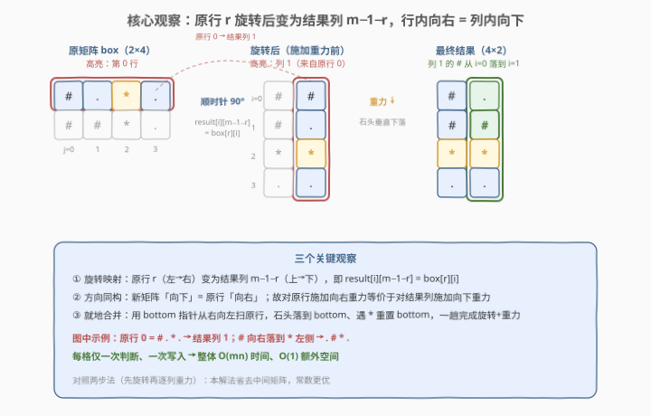
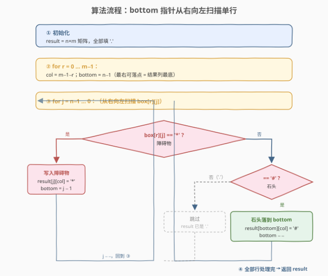

# 旋转盒子

- **题目名称**：旋转盒子
- **链接**：[1861. 旋转盒子](https://leetcode.cn/problems/rotating-the-box/)
- **难度**：中等
- **标签**：数组、双指针、矩阵

## 1. 题目概述

给定一个 $m \times n$ 的字符矩阵 `boxGrid`，表示一个箱子的侧视图。每个格子可能为：

- `'#'` 表示石头
- `'*'` 表示固定的障碍物
- `'.'` 表示空位置

箱子被**顺时针旋转 90 度**，由于重力作用，石头会**垂直下落**，直到遇到障碍物、另一块石头或箱子底部。障碍物位置不受重力影响，旋转也不产生惯性（石头水平位置不变）。

题目保证初始时所有石头都已落在障碍物、另一石头或底部上。请返回旋转并施加重力后的 $n \times m$ 矩阵。

> 💡 **核心矛盾**：需要同时完成「旋转」与「重力」两件事。朴素做法是先旋转再对每列模拟重力，两次 $O(mn)$。但注意到旋转把「原行」变成「新列」、把「行内右方向」变成「列内下方向」，于是**行内向右的重力**与**列内向下的重力**等价——两者可在一次扫描中合并完成。

**示例 1**：

```text
输入：box = [["#",".","#"]]
输出：[["."],
       ["#"],
       ["#"]]
解释：1×3 矩阵顺时针旋转 90° 后变为 3×1，列从上到下为 # . #；重力使顶部的 # 下落到中间，得到 . # #。
```

**示例 2**：

```text
输入：box = [["#",".","*","."],
             ["#","#","*","."]]
输出：[["#","."],
       ["#","#"],
       ["*","*"],
       [".","."]]
解释：2×4 旋转为 4×2。原第 0 行 # . * . 变为结果第 1 列，# 落到障碍物 * 上方 → . # * .；原第 1 行 # # * . 变为结果第 0 列，两块 # 落到 * 上方 → # # * .。
```

**示例 3**：

```text
输入：box = [["#","#","*",".","*","."],
             ["#","#","#","*",".","."],
             ["#","#","#",".","#","."]]
输出：[[".","#","#"],
       [".","#","#"],
       ["#","#","*"],
       ["#","*","."],
       ["#",".","*"],
       ["#",".","."]]
```

**约束条件**：

- $m == \text{boxGrid.length}$
- $n == \text{boxGrid}[i].\text{length}$
- $1 \le m, n \le 500$
- $\text{boxGrid}[i][j]$ 只可能是 `'#'`、`'*'` 或 `'.'`

---

## 2. 解题思路

### 2.1 暴力思路

最直观的两步法：

1. **旋转**：新建 $n \times m$ 矩阵 `rotated`，按 $\text{rotated}[i][j] = \text{box}[m-1-j][i]$ 逐格搬运，$O(mn)$。
2. **重力**：对 `rotated` 的每一列，从底向上收集所有 `#` 与 `*`，遇到 `*` 时把它当「隔板」，把隔板之上的石头压到隔板上方、把更上段的石头压到底部。每列 $O(n)$，共 $n$ 列，$O(mn)$。

两步合计 $O(mn)$，时间上已是最优；但需要先建一个中间矩阵 `rotated`、再原地改写，逻辑割裂、容易在「分段隔板」处写出 off-by-one。能否把两步**合并成一次扫描**？

### 2.2 核心观察：行内重力即列内重力，一次扫描合并旋转



关键洞察分三层：

**第一层：旋转的行列映射。** 顺时针旋转 90° 后，原矩阵的**行 $r$**（从左到右）变成结果矩阵的**列 $m-1-r$**（从上到下）。即 $\text{result}[i][m-1-r] = \text{box}[r][i]$，其中 $i \in [0, n-1]$。

**第二层：重力方向同构。** 新矩阵中重力「向下」= 行号递增方向；映射回原行即为「列号递增」方向，也就是**向右**。因此对原行施加「向右的重力」（石头向右落，遇到 `*` 或右边界停住）完全等价于对结果列施加「向下的重力」。

**第三层：用 `bottom` 指针就地处理一行。** 对原行从右向左扫描，维护一个 `bottom` 指针，表示「当前最右侧可放石头的空槽」：

- 遇到 `'*'`：障碍物固定，把它直接写入结果列对应位置；同时 `bottom = j - 1`（障碍物左侧才开始有新空槽）。
- 遇到 `'#'`：石头要落到 `bottom` 处，写入 `result[bottom][col]`，然后 `bottom -= 1`（该槽被占，下一个槽上移一格）。
- 遇到 `'.'`：空格天然不产生任何写入（`result` 初始全 `'.'`），`bottom` 不变。

> 💡 **为何从右向左扫？** 因为重力方向是向右，越靠右的石头越先「着地」。`bottom` 从最右端 $n-1$ 出发，每放一块石头就左移一格，保证后处理的石头叠在已落石头之上（更靠左=结果列中更靠上）。若从左向右扫则会把石头顺序搞反。

> ⚠️ **障碍物重置 `bottom` 的时机**：遇到 `*` 时 `bottom = j - 1`，意味着「障碍物本身占住 $j$，其左侧 $j-1$ 才是下一个可落点」。漏掉这步会让石头穿过障碍物继续下落。

### 2.3 算法流程图



流程核心：

1. **初始化** `result` 为 $n \times m$ 全 `'.'` 矩阵。
2. **逐行处理** $r = 0 \dots m-1$：令 $\text{col} = m-1-r$（本行对应的结果列），`bottom = n-1`（最右可落点）。
3. **从右向左扫描** $j = n-1 \dots 0$：
   - `box[r][j] == '*'` → `result[j][col] = '*'`；`bottom = j - 1`。
   - `box[r][j] == '#'` → `result[bottom][col] = '#'`；`bottom -= 1`。
   - `box[r][j] == '.'` → 跳过（`result` 已是 `'.'`）。
4. 返回 `result`。

> 💡 **为何 `result` 初始化全 `'.'` 就够？** 因为所有非空格子的去向都被两种分支显式写入了：障碍物落在原位（旋转后仍是同一列内的原行号位置），石头落在 `bottom` 处。空格不需要写——它本就该留在「没被石头或障碍物占据」的位置，而 `bottom` 指针的移动逻辑天然保证了这一点。

### 2.4 示例演算

![示例演算：box = [["#",".","*","."],["#","#","*","."]]](../images/1861_example_walkthrough.svg)

以示例 2 `box = [["#",".","*","."],["#","#","*","."]]`（$m=2, n=4$）为例，结果为 $4 \times 2$ 矩阵，初始化全 `'.'`。

**处理 $r=0$（对应结果列 $\text{col}=1$）**，`bottom = 3`：

| $j$ | `box[0][j]` | 动作 | `bottom` | 结果列 1（行 0→3） |
|-----|-------------|------|----------|---------------------|
| 3 | `'.'` | 跳过 | 3 | . . . . |
| 2 | `'*'` | 写 `result[2][1]='*'`；`bottom=1` | 1 | . . * . |
| 1 | `'.'` | 跳过 | 1 | . . * . |
| 0 | `'#'` | 写 `result[1][1]='#'`；`bottom=0` | 0 | . # * . |

**处理 $r=1$（对应结果列 $\text{col}=0$）**，`bottom = 3`：

| $j$ | `box[1][j]` | 动作 | `bottom` | 结果列 0（行 0→3） |
|-----|-------------|------|----------|---------------------|
| 3 | `'.'` | 跳过 | 3 | . . . . |
| 2 | `'*'` | 写 `result[2][0]='*'`；`bottom=1` | 1 | . . * . |
| 1 | `'#'` | 写 `result[1][0]='#'`；`bottom=0` | 0 | . # * . |
| 0 | `'#'` | 写 `result[0][0]='#'`；`bottom=-1` | -1 | # # * . |

合并两列得到最终结果（按行读）：

```text
# .
# #
* *
. .
```

即 `[["#","."],["#","#"],["*","*"],[".","."]]` ✓

> 💡 **对照两列**：列 1 只有一块石头（`bottom` 从 3 经障碍物跳到 1 后落在 1）；列 0 有两块石头（障碍物之上叠了两块，`bottom` 一路减到 -1）。`bottom` 的左移步数恰好等于「已落石头数」，这是验证逻辑无误的快查手段。

---

## 3. 参考代码

### C++

```cpp
class Solution {
  public:
    vector<vector<char>> rotateTheBox(vector<vector<char>>& boxGrid) {
        int m = boxGrid.size(), n = boxGrid[0].size();
        vector<vector<char>> result(n, vector<char>(m, '.'));
        for (int r = 0; r < m; ++r) {
            int bottom = n - 1;       // 当前行最右侧可落点
            int col = m - 1 - r;      // 本行旋转后对应的结果列
            for (int j = n - 1; j >= 0; --j) {
                if (boxGrid[r][j] == '*') {
                    result[j][col] = '*';
                    bottom = j - 1;   // 障碍物左侧才有新空槽
                } else if (boxGrid[r][j] == '#') {
                    result[bottom][col] = '#';
                    --bottom;          // 该槽被占，下一个上移
                }
                // '.' 无需写入，result 已初始化为 '.'
            }
        }
        return result;
    }
};
```

### Python

```python
class Solution:
    def rotateTheBox(self, boxGrid: List[List[str]]) -> List[List[str]]:
        m, n = len(boxGrid), len(boxGrid[0])
        result = [['.'] * m for _ in range(n)]
        for r in range(m):
            bottom = n - 1              # 当前行最右侧可落点
            col = m - 1 - r             # 本行旋转后对应的结果列
            for j in range(n - 1, -1, -1):
                if boxGrid[r][j] == '*':
                    result[j][col] = '*'
                    bottom = j - 1      # 障碍物左侧才有新空槽
                elif boxGrid[r][j] == '#':
                    result[bottom][col] = '#'
                    bottom -= 1          # 该槽被占，下一个上移
                # '.' 无需写入，result 已初始化为 '.'
        return result
```

> ⚠️ **实现细节**：`bottom` 的初值是 $n-1$（最右=结果列最底），随扫描左移。由不变量 $\text{bottom} - j \ge 0$（见面试要点 Q5）保证**每次写石头时 `bottom ≥ j ≥ 0`**，绝不越界；`bottom` 减到 $-1$ 只可能发生在一行最左那块石头写完之后，此后不再有 `'#'` 触发写入。务必保证从右向左扫描——若写反（从左向右）则石头会被堆到左端、方向完全错乱。

---

## 4. 复杂度分析

| 维度 | 复杂度 | 说明 |
|------|--------|------|
| 时间复杂度 | $O(mn)$ | 外层遍历 $m$ 行、内层每行扫 $n$ 个格子，每个格子 $O(1)$ 分支处理，共 $mn$ 次 |
| 空间复杂度 | $O(1)$ | 仅用 `bottom`、`col` 等常数指针；结果矩阵 $O(mn)$ 不计入额外空间（输出本身） |

> 💡 **与两步法对比**：两步法时间同为 $O(mn)$，但需要先建 `rotated` 中间矩阵、再在列上模拟重力，常数更大且易错；本解法把旋转与重力融合进单趟扫描，每格仅一次判断、一次写入，实测常数更优。

---

## 5. 扩展：两步法（先旋转后重力）对比

将旋转与重力解耦的实现，便于理解但代码更长：

```cpp
vector<vector<char>> rotateTheBox(vector<vector<char>>& boxGrid) {
    int m = boxGrid.size(), n = boxGrid[0].size();
    // 1. 旋转 90° 顺时针：rotated[i][j] = box[m-1-j][i]
    vector<vector<char>> rotated(n, vector<char>(m));
    for (int i = 0; i < n; ++i)
        for (int j = 0; j < m; ++j)
            rotated[i][j] = boxGrid[m - 1 - j][i];
    // 2. 对每列施加重力：石头下落，遇障碍物/石头/底部停止
    for (int j = 0; j < m; ++j) {
        int bottom = n - 1;
        for (int i = n - 1; i >= 0; --i) {
            if (rotated[i][j] == '*') {
                bottom = i - 1;
            } else if (rotated[i][j] == '#') {
                rotated[i][j] = '.';
                rotated[bottom][j] = '#';
                --bottom;
            }
        }
    }
    return rotated;
}
```

| 维度 | 一步合并法（主解） | 两步解耦法 |
|------|--------------------|------------|
| 旋转与重力 | 同一趟扫描内完成 | 先整体旋转，再逐列重力 |
| 中间矩阵 | 无（直接写入 `result`） | 需要 `rotated` 中间态 |
| 写入次数 | 每非空格 1 次 | 旋转每格 1 次 + 重力石头 2 次（清原位、写新位） |
| 易错点 | `bottom` 与 `col` 的映射 | 列方向重力时 `bottom` 在列内移动 |
| 思维负担 | 需理解「行内右=列内下」同构 | 直观但啰嗦 |

> 💡 **两者的同构根源**：两步法第 2 步在列 $j$ 上从底向上扫、维护列内 `bottom`；主解在原行 $r$（=结果列 $m-1-r$）上从右向左扫、维护行内 `bottom`。两者是同一过程在「旋转前/后」两个坐标系下的描述，故复杂度一致、仅常数有别。

---

## 6. 面试要点

**Q1：为什么旋转后「原行」会变成「结果列」？**

> 顺时针旋转 90° 的坐标变换为 $\text{result}[i][m-1-r] = \text{box}[r][i]$。固定原行号 $r$，让 $i$ 从 $0$ 到 $n-1$ 变化，结果列号 $m-1-r$ 恒定、行号 $i$ 递增——所以原行 $r$ 的所有元素恰好落在结果列 $m-1-r$ 上，且顺序保持从上到下。

**Q2：为什么对原行做「向右重力」等价于对结果列做「向下重力」？**

> 因为旋转把原行的「列号递增方向」映射成了结果列的「行号递增方向」（即 $\text{box}[r][i]$ 的 $i$ 同时是原行下标和结果列内的行下标）。重力本质是「沿某方向寻找最近的支撑点」，方向同构则行为等价，故可在原行坐标系内就地完成重力。

**Q3：`bottom` 指针的语义是什么？为何从右向左扫？**

> `bottom` 是「当前最右侧可放石头的空槽」的下标。从右向左扫是因为重力向右，越靠右的石头越先着地；先处理右侧石头、占据靠右的槽，后处理的石头自然叠在其左侧（= 结果列中更靠上）。若从左向右扫，石头会被错误地堆到左端而非右端。

**Q4：遇到障碍物 `*` 时为什么 `bottom = j - 1` 而不是 `j`？**

> 障碍物本身占据位置 $j$，不可放石头；它左侧的 $j-1$ 才是「障碍物正上方/正左方」第一个可落点。若设成 $j$，下一块石头会覆盖障碍物；若设成更左的值，则会凭空留出空隙。`j-1` 精确对应「障碍物挡住右侧一切、新空槽从其左邻开始」。

**Q5：`bottom` 会越界访问负数下标吗？**

> 不会，且无需任何输入假设。考察不变量 $d = \text{bottom} - j$：初始 $j=n-1$ 时 $d=0$；遇 `'.'` 时 $j$ 减 1、`bottom` 不变 → $d$ 加 1；遇 `'#'` 时两者各减 1 → $d$ 不变（且写入时 $d \ge 0$ 即 $\text{bottom} \ge j \ge 0$）；遇 `'*'` 时 `bottom=j-1`、随后 $j$ 减 1 → $d$ 归 0。故 $d \ge 0$ 恒成立，**每次写石头时 `bottom ≥ j ≥ 0`**，绝不越界。`bottom` 减到 $-1$ 只可能发生在一行最左侧那块石头写完之后——此时循环已无更多 `'#'` 待处理（剩余只可能是已扫过的右侧格子），不会再触发写入。

---

## 7. 同类练习题

- [48. 旋转图像](https://leetcode.cn/problems/rotate-image/)：矩阵顺时针旋转 90° 的原位实现，本题旋转映射的母题（48 是方阵原位转，本题是矩形需新矩阵）
- [73. 矩阵置零](https://leetcode.cn/problems/set-matrix-zeroes/)：矩阵原地标记/写入类操作，与本题「按规则改写矩阵」范式同源
- [1089. 复写零](https://leetcode.cn/problems/duplicate-zeros/)：一维数组内「双指针从右向左」就地搬移元素，与本题 `bottom` 指针思路一致（先预扫定位终点再反向写入）
- [844. 比较退格的字符串](https://leetcode.cn/problems/backspace-string-compare/)：从右向左扫描 + 跳过逻辑，对照本题「反向扫描遇障碍物重置指针」的处理
- [1883. 准时抵达会议现场的最小跳数](https://leetcode.cn/problems/minimum-skips-to-arrive-at-meeting-on-time/)：同为矩阵/数组上带约束的扫描模拟，练手「一次扫描多条件分支」的代码组织
