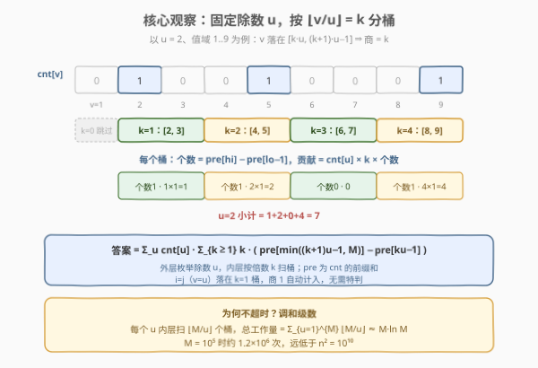
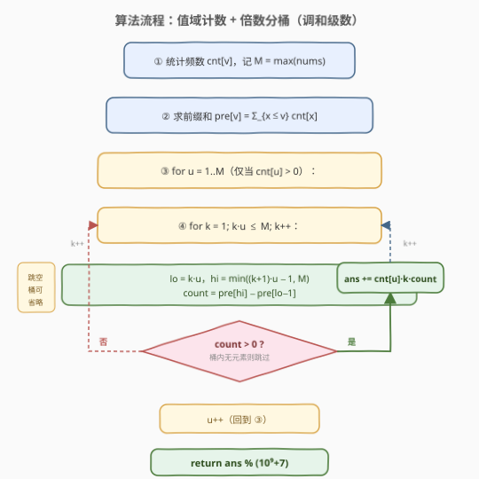

# LeetCode 向下取整数对和 题解

## 1. 题目概述

- **标题 / 题号**：向下取整数对和（#1862，hard）
- **链接**：https://leetcode.cn/problems/sum-of-floored-pairs/
- **难度**：困难
- **标签**：数组、值域计数、前缀和、调和级数、数学

**题意**：给定整数数组 `nums`，返回所有下标对 `0 <= i, j < nums.length` 的 $\lfloor \text{nums}[i] / \text{nums}[j] \rfloor$ 之和。由于答案可能很大，返回对 $10^9 + 7$ 取余的结果。函数 `floor()` 返回输入数字的整数部分（向下取整）。

**示例 1**：

```text
输入：nums = [2,5,9]
输出：10
解释：
floor(2/5)=floor(2/9)=floor(5/9)=0
floor(2/2)=floor(5/5)=floor(9/9)=1
floor(5/2)=2，floor(9/2)=4，floor(9/5)=1
所有数对商向下取整求和 = 10。
```

**示例 2**：

```text
输入：nums = [7,7,7,7,7,7,7]
输出：49
解释：7 个 7 两两配对共 49 对，每对 floor(7/7)=1，总和 49。
```

**约束**：

- $1 \le \text{nums.length} \le 10^5$
- $1 \le \text{nums}[i] \le 10^5$

> 💡 **关键直觉**：这是一道"数对求和"题，朴素做法是 $O(n^2)$ 枚举所有数对——$n = 10^5$ 时达 $10^{10}$，必超时。突破口在约束 **$\text{nums}[i] \le 10^5$**：值域很小。一旦把视角从「下标对」切换到「值域」，就能用**频数表 + 前缀和**把"一段值的贡献"压成 $O(1)$，再用**调和级数**的倍数分桶把双层枚举降到 $O(M \log M)$。

## 2. 解题思路

### 2.1 暴力思路

最朴素的做法：双层循环枚举所有下标对 $(i, j)$，累加 $\lfloor \text{nums}[i] / \text{nums}[j] \rfloor$。共 $n^2$ 个数对，$n = 10^5$ 时约 $10^{10}$ 次运算，远超时限。

> ⚠️ 瓶颈：数对数量本身是 $O(n^2)$，无法靠常数优化通过。必须**减少枚举的"粒度"**——不再逐数对计算，而是按"值"批量统计。

### 2.2 核心观察：值域计数 + 按除数倍数分桶



把答案改写成**按值聚团**的形式。记 $\text{cnt}[v]$ 为值 $v$ 在 `nums` 中出现的次数（频数表），令 $v = \text{nums}[i]$（被除数），$u = \text{nums}[j]$（除数）：

$$\text{ans} = \sum_{u} \text{cnt}[u] \cdot \left( \sum_{v} \text{cnt}[v] \cdot \left\lfloor \frac{v}{u} \right\rfloor \right)$$

> 💡 **这一步的意义**：把"逐下标对"换成"逐值对"。值的种类数 $\le M = 10^5$，但两两组合仍是 $O(M^2) = 10^{10}$，看似没省。真正的省时来自下一步——**对固定的 $u$，不再逐个枚举 $v$，而是按 $\lfloor v/u \rfloor$ 的值分桶批量求和**。

**固定除数 $u$ 时，$\lfloor v/u \rfloor$ 是分段常数。** 令 $k = \lfloor v/u \rfloor$，则 $v$ 落在区间 $[k \cdot u,\; (k+1) \cdot u - 1]$ 内时商都等于 $k$。于是内层求和可以按 $k$ 分桶：

$$\sum_{v} \text{cnt}[v] \cdot \left\lfloor \frac{v}{u} \right\rfloor = \sum_{k \ge 1} k \cdot \underbrace{\left( \sum_{v \in [ku,\,(k+1)u-1]} \text{cnt}[v] \right)}_{\text{桶内元素个数}}$$

- $k = 0$ 的桶（$v < u$）贡献为 0，直接跳过。
- 桶内元素个数用**频数前缀和** $O(1)$ 取得：$\text{pre}[\min((k+1)u-1,\, M)] - \text{pre}[ku - 1]$。

**总工作量是调和级数。** 对每个 $u$，桶数（$k$ 的取值数）为 $\lfloor M/u \rfloor$。把所有 $u$ 的桶数加起来：

$$\sum_{u=1}^{M} \left\lfloor \frac{M}{u} \right\rfloor \approx M \ln M \approx 10^5 \times 12 \approx 1.2 \times 10^6$$

> 💡 **为什么是 $O(M \log M)$ 而非 $O(M^2)$？** 关键在于"分桶"把内层从"逐个 $v$"换成"逐段 $k$"——段数 $\lfloor M/u \rfloor$ 随 $u$ 增大而急剧减少（$u=1$ 时 $M$ 段，$u=M$ 时仅 1 段），总和恰为调和级数。这正是**埃氏筛**（[204. 计数质数](https://leetcode.cn/problems/count-primes/)）"每个数划掉其倍数"的同款骨架——都是 $\sum M/u$。

> ⚠️ **为什么固定"除数 $u$"而不是"被除数 $v$"？** 因为 $\lfloor v/u \rfloor$ 作为 $v$ 的函数（$u$ 固定）是**分段常数、等长周期**（周期为 $u$），天然适合用前缀和按区间求和；而作为 $u$ 的函数（$v$ 固定）变化点散落在 $v$ 的因数处，难以批量。**固定分段常数的那一维**是本题的破题点。

### 2.3 算法流程图



三步骨架：

```text
① 统计频数 cnt[v]，记 M = max(nums)
② 求前缀和 pre[v] = Σ_{x≤v} cnt[x]
③ for u = 1..M（仅当 cnt[u] > 0）:
       for k = 1; k·u ≤ M; k++:
           lo = k·u, hi = min((k+1)·u − 1, M)
           count = pre[hi] − pre[lo−1]      # 桶内元素个数
           if count > 0:
               ans = (ans + cnt[u] · k · count) % MOD
④ return ans
```

> 💡 **两个要点**：① 外层只遍历 $\text{cnt}[u] > 0$ 的 $u$（除数必须在数组中出现），空 $u$ 直接跳过；② 桶内 $\text{count} = 0$ 时整桶贡献为 0，可跳过省常数。即便不跳，复杂度仍为 $O(M \log M)$，因总桶数固定。

### 2.4 示例演算

![示例演算：nums = [2,5,9]，答案 = 10](../images/1862_example_walkthrough.svg)

以 `nums = [2,5,9]` 为例。频数 $\text{cnt}[2]=\text{cnt}[5]=\text{cnt}[9]=1$，$M=9$，前缀和 $\text{pre} = [0,0,1,1,1,2,2,2,2,3]$。

| 除数 $u$ | cnt[u] | 非空桶（$k$：区间 → 个数 → 贡献） | 小计 |
|----------|--------|-----------------------------------|------|
| 2 | 1 | $k{=}1\,[2,3]\to1\to1$；$k{=}2\,[4,5]\to1\to2$；$k{=}3\,[6,7]\to0$；$k{=}4\,[8,9]\to1\to4$ | 7 |
| 5 | 1 | $k{=}1\,[5,9]\to2\to2$ | 2 |
| 9 | 1 | $k{=}1\,[9,9]\to1\to1$ | 1 |

总和 $= 7 + 2 + 1 = 10$，与暴力枚举全部 9 个数对的结果一致 ✓。

> 💡 **看 $u=5$ 这一行体会分桶的威力**：$v=5$ 和 $v=9$ 都落在 $k=1$ 的桶 $[5,9]$ 内（$\lfloor 5/5 \rfloor = \lfloor 9/5 \rfloor = 1$），一次前缀和查询 $\text{pre}[9]-\text{pre}[4]=3-1=2$ 就同时处理了两个被除数——这就是"批量"的本质。

## 3. 参考代码

### Python

```python
class Solution:
    def sumOfFlooredPairs(self, nums: List[int]) -> int:
        MOD = 10**9 + 7
        M = max(nums)
        cnt = [0] * (M + 1)
        for x in nums:
            cnt[x] += 1

        # 前缀和：pre[v] = sum(cnt[1..v])
        pre = [0] * (M + 1)
        for v in range(1, M + 1):
            pre[v] = pre[v - 1] + cnt[v]

        ans = 0
        for u in range(1, M + 1):
            cu = cnt[u]
            if cu == 0:                     # 除数未出现，跳过
                continue
            # lo = k*u，按 u 的步长扫桶
            for k, lo in enumerate(range(u, M + 1, u), start=1):
                hi = lo + u - 1
                if hi > M:
                    hi = M
                count = pre[hi] - pre[lo - 1]
                if count:
                    ans = (ans + cu * k * count) % MOD
        return ans
```

### C++

```cpp
class Solution {
public:
    int sumOfFlooredPairs(vector<int>& nums) {
        const int MOD = 1e9 + 7;
        int M = *max_element(nums.begin(), nums.end());
        vector<int> cnt(M + 1, 0);
        for (int x : nums) ++cnt[x];

        // 前缀和：pre[v] = sum(cnt[1..v])，最大为 n <= 1e5，int 足够
        vector<int> pre(M + 1, 0);
        for (int v = 1; v <= M; ++v) pre[v] = pre[v - 1] + cnt[v];

        long long ans = 0;
        for (int u = 1; u <= M; ++u) {
            int cu = cnt[u];
            if (cu == 0) continue;                 // 除数未出现，跳过
            for (int lo = u, k = 1; lo <= M; lo += u, ++k) {
                int hi = min(lo + u - 1, M);
                int count = pre[hi] - pre[lo - 1];
                if (count) {
                    ans = (ans + (long long)cu * k * count) % MOD;
                }
            }
        }
        return ans;
    }
};
```

> ⚠️ **溢出与取模**：单桶贡献 $\text{cnt}[u] \cdot k \cdot \text{count}$ 上界达 $10^5 \times 10^5 \times 10^5 = 10^{15}$，超出 32 位 `int`（约 $2.1 \times 10^9$）。C++ 中必须用 `(long long)cu * k * count` 提升后再累加取模；`pre` 各值 $\le n \le 10^5$，用 `int` 存即可，但累加项务必先转 `long long`。Python 大整数自动处理，无此顾虑。

> 💡 **为何用 `lo += u` 步长而非 `k*u`？** `lo` 从 $u$ 出发按步长 $u$ 递增（$u, 2u, 3u, \dots$），等价于 $k \cdot u$ 但避免每次乘法；`k` 仅作桶编号同步自增。这是调和级数枚举的标准写法，与埃氏筛 `for (int j = i*i; j <= M; j += i)` 同构。

## 4. 复杂度分析

| 维度 | 复杂度 | 说明 |
|------|--------|------|
| **时间** | $O(M \log M)$ | 建频数表 $O(n)$；前缀和 $O(M)$；双层倍数枚举总桶数 $\sum_{u=1}^{M} \lfloor M/u \rfloor = O(M \log M)$，每桶 $O(1)$ |
| **空间** | $O(M)$ | 频数表 `cnt` 与前缀和 `pre` 各 $O(M)$，$M = \max(\text{nums}) \le 10^5$ |

> 💡 **$M$ 与 $n$ 的关系**：复杂度由值域上界 $M$ 决定，与元素个数 $n$ 只在"建频数表"阶段相关。当 $n \gg M$（大量重复值）时本法优势最大——重复值被频数表压缩成一次处理；当 $n$ 较小但 $M$ 很大时（本题不会，因 $M \le 10^5$）则需谨慎。最坏 $M = 10^5$ 时 $M \ln M \approx 1.2 \times 10^6$，远低于 $n^2 = 10^{10}$。

> ⚠️ 若 $\text{nums}[i]$ 值域上界提升到 $10^9$，本法失效（$M$ 太大建不了频数表），需改用排序 + 双指针或离线处理等 $O(n \log n)$ 方案。本题 $M \le 10^5$ 正是调和级数法的"甜区"。

## 5. 扩展：调和级数枚举的范式

本题与一类"值域有界 + 按倍数批量处理"的问题共享同一骨架——**调和级数枚举**：对每个基数 $u$，以步长 $u$ 扫过 $[1, M]$，总操作数 $\sum_{u=1}^{M} \lfloor M/u \rfloor = O(M \log M)$。代表场景：

- **埃氏筛**（[204. 计数质数](https://leetcode.cn/problems/count-primes/)）：对每个质数 $p$，划掉其倍数 $2p, 3p, \dots$，复杂度 $O(M \log \log M)$（只对质数划倍数，更紧）。
- **按倍数并查集连通**（[1627. 带阈值的图连通性](https://leetcode.cn/problems/graph-connectivity-with-threshold/)）：对每个 $\ge \text{threshold}$ 的 $u$，把其所有倍数 union 起来，$O(M \log M)$。
- **枚举因数/倍数求和**（[1390. 四因数](https://leetcode.cn/problems/four-divisors/)）：对每个数 $u$，给其所有倍数累加因数贡献，$O(M \log M)$。

> 💡 **识别信号**：当看到 ① 值域上界不大（$\le 10^5$ 量级）；② 需要对"所有数对"或"所有倍数关系"做统计/连通；③ 朴素 $O(n^2)$ 或 $O(M^2)$ 不可行时，**优先联想到调和级数枚举**——把"两层枚举值"换成"一层枚举基数 + 一层按倍数扫"。

### 其他思路一瞥

- **固定被除数 $v$ 枚举除数 $u$**：$\lfloor v/u \rfloor$ 在 $u$ 取 $v$ 的因数附近变化，需按因数分段，实现复杂且仍需因数枚举，不如固定除数直观。
- **整除分块（数论分块）**：经典手法可把"对 $u$ 求和 $\lfloor v/u \rfloor$"在 $O(\sqrt{M})$ 内算出单 $v$ 的贡献，但本题还需乘 $\text{cnt}$ 加权、对每个 $u$ 求内层和，整除分块的优势不易直接发挥；倍数分桶 + 前缀和更贴合"批量计个数"的需求。

## 6. 面试要点

1. **为什么不能直接 $O(n^2)$ 枚举所有数对？**

   > $n = 10^5$ 时数对数达 $10^{10}$，远超时限。突破口是值域约束 $\text{nums}[i] \le 10^5$——把"逐下标对"切换为"逐值对"，再用倍数分桶把内层降到调和级数。

2. **为什么固定"除数 $u$"分桶，而不是固定"被除数 $v$"？**

   > $\lfloor v/u \rfloor$ 作为 $v$ 的函数（$u$ 固定）是分段常数，周期为 $u$，可用前缀和按区间 $[ku, (k+1)u-1]$ 批量求和；而作为 $u$ 的函数（$v$ 固定）变化点散落在 $v$ 的因数处，难以批量。固定"分段常数"那一维是破题关键。

3. **调和级数 $O(M \log M)$ 是怎么来的？为什么不会退化到 $O(M^2)$？**

   > 对每个 $u$，桶数为 $\lfloor M/u \rfloor$（$u=1$ 时 $M$ 桶，$u=M$ 时 1 桶）。总桶数 $\sum_{u=1}^{M} \lfloor M/u \rfloor \approx M \ln M$。分桶把内层从"逐个 $v$"换成"逐段 $k$"，段数随 $u$ 增大急剧减少，故总和是 $M \log M$ 而非 $M^2$。

4. **$i = j$（同一个位置）的情况如何被正确计入？**

   > 当 $v = u$ 时，$v$ 落在 $k=1$ 的桶 $[u, 2u-1]$ 内（因 $u \in [u, 2u-1]$），商 $\lfloor u/u \rfloor = 1$ 被自然计入。前缀和查询 $\text{pre}[\min(2u-1,M)] - \text{pre}[u-1]$ 已包含 $\text{cnt}[u]$ 自身，无需特判 $i=j$。

5. **溢出与取模要注意什么？**

   > 单桶贡献 $\text{cnt}[u] \cdot k \cdot \text{count}$ 上界 $10^{15}$，超 `int`。C++ 须用 `(long long)cu * k * count` 提升后取模；`pre` 各值 $\le n \le 10^5$ 可用 `int` 存，但累加项先转 `long long`。Python 无此问题。最终返回 `ans % MOD`（累加中已逐次取模则可直接返回）。

> 💡 **一句话总结**：值域计数 + 前缀和 + 按除数 $u$ 的倍数分桶，总工作量 $\sum_{u=1}^{M} \lfloor M/u \rfloor = O(M \log M)$，把数对求和从 $O(n^2)$ 降到 $O(M \log M)$。

## 同类练习题

| # | 题目 | 与本题的关联 |
|---|------|-------------|
| 204 | [计数质数](https://leetcode.cn/problems/count-primes/)（[站内题解](../0201-0300/204_计数质数.md)） | 埃氏筛"划倍数"——与本题"按 $u$ 的倍数分桶"同属调和级数骨架 $\sum M/u$，巩固倍数枚举范式 |
| 1627 | [带阈值的图连通性](https://leetcode.cn/problems/graph-connectivity-with-threshold/) | 并查集按 $\ge \text{threshold}$ 的 $u$ 把其倍数 union，$O(M \log M)$ 调和级数经典应用，对照"倍数批量处理" |
| 952 | [按公因数计算最大组件大小](https://leetcode.cn/problems/largest-component-size-by-common-factor/) | 值域 + 枚举因数连通，对照"值域预处理 + 因数/倍数关系"思路 |
| 1390 | [四因数](https://leetcode.cn/problems/four-divisors/) | 对每个数 $u$ 向其所有倍数累加因数贡献，$O(M \log M)$，调和级数枚举倍数的另一面 |
| 719 | [找出第 K 小的数对距离](https://leetcode.cn/problems/find-k-th-smallest-pair-distance/)（[站内题解](../0701-0800/719_找出第K小的数对距离.md)） | 同为"数对求值"问题，但用二分答案 + 双指针计数，对照不同范式（值域分桶 vs 二分计数）的选型 |
