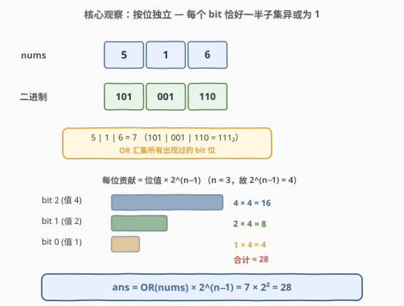
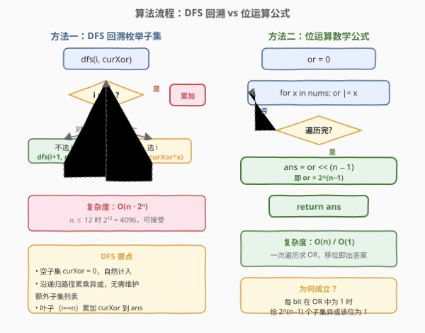

# 所有子集的异或总和

- **题目名称**：所有子集的异或总和
- **链接**：[1863. 所有子集的异或总和](https://leetcode.cn/problems/sum-of-all-subset-xor-totals/)
- **难度**：简单
- **标签**：位运算、数组、数学、回溯

## 1. 题目概述

数组的**异或总和**（XOR total）定义为该数组所有元素按位异或的结果。给定一个数组 `nums`，返回 `nums` 的**所有子集**的异或总和之和。

> 💡 **空子集**的异或总和为 `0`，它也计入求和，但对总和没有贡献。

**示例 1**：

```text
输入：nums = [1,3]
输出：6
解释：所有子集的异或总和分别为 0、1、3、1^3=2，求和 0+1+3+2 = 6。
```

**示例 2**：

```text
输入：nums = [5,1,6]
输出：28
解释：8 个子集的异或总和为 0、5、1、6、4、3、7、2，求和 0+5+1+6+4+3+7+2 = 28。
```

**示例 3**：

```text
输入：nums = [3,4,5,6,7,8]
输出：480
```

**约束条件**：

- $1 \le \text{nums.length} \le 12$
- $1 \le \text{nums[i]} \le 20$

> 💡 **关键直觉**：$n \le 12$ 意味着子集数 $2^{12} = 4096$，直接 DFS 枚举所有子集完全可行。但题目问的是「异或总和之和」——这是一个**可加的聚合量**，异或又是**按位独立**的运算。若能找到每位贡献的计数规律，就能把 $O(2^n)$ 的枚举压缩成 $O(n)$ 的位运算。

---

## 2. 解题思路

### 2.1 暴力思路：DFS 回溯枚举所有子集

最直觉的做法：用 DFS 枚举 `nums` 的所有 $2^n$ 个子集，对每个子集计算其元素异或值，累加求和。

```text
dfs(i, curXor):
    if i == n:
        total += curXor
        return
    dfs(i+1, curXor)              # 不选 nums[i]
    dfs(i+1, curXor ^ nums[i])    # 选 nums[i]
```

时间 $O(n \cdot 2^n)$，空间 $O(n)$（递归栈）。$n \le 12$ 时 $2^{12} = 4096$，完全在时限内。

> ⚠️ 瓶颈：当 $n$ 增大（如 $n = 30$）时，$2^{30}$ 子集无法枚举。能否跳过枚举，直接计算总和？

### 2.2 核心观察：按位独立 + 半数子集贡献



异或是**按位独立**的运算——每个 bit 位的异或结果只取决于子集中该位为 1 的元素个数（奇偶性），与其他位无关。因此可以把「异或总和之和」拆成**每位贡献之和**：

$$\text{ans} = \sum_{b=0}^{\infty} \left( \text{bit}_b \text{ 的值} \times \text{有多少个子集的异或在第 } b \text{ 位为 1} \right)$$

**关键引理**：若第 $b$ 位在**至少一个**元素中为 1（即第 $b$ 位在全体 OR 中为 1），则 $2^n$ 个子集中**恰好** $2^{n-1}$ 个的异或在第 $b$ 位为 1。

**证明**：设 $k \ge 1$ 个元素的第 $b$ 位为 1，其余 $n - k$ 个为 0。异或的第 $b$ 位为 1 当且仅当选中的这 $k$ 个元素中**奇数个**被纳入子集。$k$ 个元素的奇数大小子集数为 $2^{k-1}$（二项式系数求和 $\sum_{j \text{ 奇}} \binom{k}{j} = 2^{k-1}$），其余 $n-k$ 个元素任意选有 $2^{n-k}$ 种。故总数 $= 2^{k-1} \times 2^{n-k} = 2^{n-1}$，**与 $k$ 无关**（只要 $k \ge 1$）。若 $k = 0$（没有任何元素该位为 1），贡献为 $0$。

由此，第 $b$ 位的贡献 $= 2^b \times 2^{n-1}$（若该位在 OR 中为 1），否则 $0$。对所有位求和：

$$\text{ans} = 2^{n-1} \times \sum_{b \in \text{OR}} 2^b = 2^{n-1} \times \text{OR}(\text{nums})$$

即 **答案 = 全体元素的按位或 $\times$ $2^{n-1}$**。

> 💡 **为什么成立？** 异或的按位独立性让每位可单独计算贡献。「奇数个 1 异或为 1」的奇偶性恰好把 $2^n$ 个子集**对半劈开**——只要该位至少出现一次，就有一半子集贡献该位。这个「半数」不依赖具体有几个元素该位为 1（$k \ge 1$ 即可），是组合恒等式 $2^{k-1} \cdot 2^{n-k} = 2^{n-1}$ 的直接推论。

> ⚠️ **常见错误**：① 误以为「该位出现的元素越多贡献越大」——实际上只要 $k \ge 1$，贡献恒为 $2^{n-1} \cdot 2^b$，与 $k$ 无关；② 忘记空子集——空子集异或为 0，对和的贡献为 0，公式中 $2^{n-1}$ 已含空子集（空子集该位为 0，不计入「一半」）；③ 用 AND 而非 OR——AND 只保留所有元素共有的位，会漏掉只出现部分元素的位。

### 2.3 算法流程图



两种解法并存：$n \le 12$ 时 DFS 可 AC，位运算公式则给出 $O(n)$ 最优解。面试中先讲 DFS（直观、易想到），再推导位运算公式（体现数学洞察）。

### 2.4 示例演算

![示例演算：nums = [5,1,6] 的 8 个子集异或和](../images/1863_example_walkthrough.svg)

以示例 2 `nums = [5, 1, 6]`（$n = 3$）为例，先枚举验证，再用公式复核：

**枚举 8 个子集**：

| 子集 | 异或 | 说明 |
|------|------|------|
| `{}` | 0 | 空集，异或为 0 |
| `{5}` | 5 | 单元素 |
| `{1}` | 1 | 单元素 |
| `{6}` | 6 | 单元素 |
| `{5,1}` | 4 | $5 \oplus 1 = 101_2 \oplus 001_2 = 100_2 = 4$ |
| `{5,6}` | 3 | $5 \oplus 6 = 101_2 \oplus 110_2 = 011_2 = 3$ |
| `{1,6}` | 7 | $1 \oplus 6 = 001_2 \oplus 110_2 = 111_2 = 7$ |
| `{5,1,6}` | 2 | $5 \oplus 1 \oplus 6 = 010_2 = 2$ |

求和 $= 0+5+1+6+4+3+7+2 = 28$。

**公式验证**：

- $\text{OR} = 5 \mid 1 \mid 6 = 101_2 \mid 001_2 \mid 110_2 = 111_2 = 7$
- $2^{n-1} = 2^2 = 4$
- $\text{ans} = 7 \times 4 = 28$ ✓

**按位拆解**（验证「半数」引理）：

| bit 位 | 值 ($2^b$) | 在 OR 中? | 贡献子集数 | 贡献值 |
|--------|-----------|-----------|-----------|--------|
| bit 2 | 4 | ✓（6 = 110₂） | $2^2 = 4$ | $4 \times 4 = 16$ |
| bit 1 | 2 | ✓（5, 6） | $4$ | $2 \times 4 = 8$ |
| bit 0 | 1 | ✓（5, 1） | $4$ | $1 \times 4 = 4$ |
| 合计 | — | — | — | $16 + 8 + 4 = 28$ |

> 💡 **bit 2 只有 6 一个元素拥有**，但贡献子集数仍是 4（含 6 的 4 个子集：`{6}`, `{5,6}`, `{1,6}`, `{5,1,6}`）。bit 0 有 5、1 两个元素拥有，贡献子集数也是 4。这就是「与 $k$ 无关」的体现——只要 $k \ge 1$，恒为 $2^{n-1}$。

---

## 3. 参考代码

### Python

```python
class Solution:
    def subsetXORSum(self, nums: list[int]) -> int:
        # 位运算公式：ans = OR(nums) << (n-1)
        or_all = 0
        for x in nums:
            or_all |= x
        return or_all << (len(nums) - 1)
```

### Python（DFS 回溯版，对照用）

```python
class Solution:
    def subsetXORSum(self, nums: list[int]) -> int:
        n = len(nums)
        total = 0

        def dfs(i: int, cur: int) -> None:
            nonlocal total
            if i == n:
                total += cur
                return
            dfs(i + 1, cur)               # 不选 nums[i]
            dfs(i + 1, cur ^ nums[i])     # 选 nums[i]

        dfs(0, 0)
        return total
```

### C++

```cpp
class Solution {
public:
    int subsetXORSum(vector<int>& nums) {
        int orAll = 0;
        for (int x : nums) orAll |= x;
        return orAll << (nums.size() - 1);
    }
};
```

### C++（DFS 回溯版，对照用）

```cpp
class Solution {
public:
    int subsetXORSum(vector<int>& nums) {
        int total = 0;
        dfs(nums, 0, 0, total);
        return total;
    }
private:
    void dfs(const vector<int>& nums, int i, int cur, int& total) {
        if (i == (int)nums.size()) {
            total += cur;
            return;
        }
        dfs(nums, i + 1, cur, total);              // 不选
        dfs(nums, i + 1, cur ^ nums[i], total);    // 选
    }
};
```

> 💡 **实现细节**：① 公式版一行核心 `orAll << (n-1)`，注意 `n >= 1` 保证移位量非负（$n = 1$ 时左移 0 位即原值，此时只有一个单元素子集，异或和 = 该元素本身 $=$ OR）；② DFS 版用 `cur ^ nums[i]` 沿递归路径传播异或值，无需维护子集列表——异或的「可逆性」（$a \oplus a = 0$）使增删元素天然用 XOR 模拟；③ 两版都自动处理空子集（DFS 的 `i==n` 分支累加 `cur=0`；公式版的 $2^{n-1}$ 已含空子集的零贡献）。

> ⚠️ **数据范围**：`nums[i] <= 20 < 2^5`，$n \le 12$，故 OR $\le 31$，$2^{n-1} \le 2^{11} = 2048$，答案最大 $31 \times 2048 \approx 6.3 \times 10^4$，远在 32 位整数范围内，无需担心溢出。

---

## 4. 复杂度分析

| 维度 | 公式版复杂度 | DFS 版复杂度 | 说明 |
|------|-------------|-------------|------|
| **时间** | $O(n)$ | $O(n \cdot 2^n)$ | 公式版一次遍历求 OR；DFS 版枚举 $2^n$ 个子集，每个叶子 $O(1)$ 累加 |
| **空间** | $O(1)$ | $O(n)$ | 公式版仅一个累加变量；DFS 版递归栈深 $n$ |

> 💡 **公式版为何是 $O(n)$ 而非 $O(2^n)$？** 关键在于「异或总和之和」是聚合量，可用按位独立性拆解。每个 bit 位的贡献由「是否在 OR 中」这一布尔量决定，而该布尔量只需求一次 OR 即可获得。$2^n$ 个子集的异或结果被「半数引理」压缩成一个乘法因子 $2^{n-1}$——这是组合计数对暴力枚举的降维。

> ⚠️ 当 $n$ 较大（如 $n = 30$）时，DFS 必超时（$2^{30} \approx 10^9$），而公式版仍为 $O(n)$。本题 $n \le 12$ 让两版都能 AC，但公式版体现了更深的问题洞察。

---

## 5. 扩展：半数引理的推广与变体

### 5.1 引理的一般形式

**引理**：给定 $n$ 个数，其中 $k \ge 1$ 个数的第 $b$ 位为 1，则所有 $2^n$ 个子集中，异或第 $b$ 位为 1 的子集数恰为 $2^{n-1}$。

证明的核心是**奇偶分割**：$k$ 个「1 位元素」的子集按大小奇偶性对半分（$2^{k-1}$ vs $2^{k-1}$），而 $n - k$ 个「0 位元素」对异或结果无影响，任意选 $2^{n-k}$ 种。乘积 $2^{k-1} \cdot 2^{n-k} = 2^{n-1}$。

### 5.2 若改为「子集异或的最大值」

若题目改为求所有子集异或的**最大值**（[421. 数组中两个数的最大异或值](https://leetcode.cn/problems/maximum-xor-of-two-numbers-in-an-array/) 的推广），则不能用半数引理——最大值是**极值**而非聚合量，需用线性基（Linear Basis）在 $O(n \log \max)$ 内求解。半数引理只适用于「求和」这类**线性可加**的聚合。

### 5.3 若改为「子集异或等于某值的子集数」

若求异或等于目标值 $t$ 的子集数，半数引理不再直接适用——需要精确计数而非「半数」。此时可用 DP：`dp[i][x]` = 前 $i$ 个元素中异或为 $x$ 的子集数，转移 `dp[i][x] = dp[i-1][x] + dp[i-1][x ^ nums[i]]`，时间 $O(n \cdot \max\_val)$。

### 5.4 异或的代数结构

异或构成阿贝尔群 $(\mathbb{F}_2^n, \oplus)$：每个元素自逆（$a \oplus a = 0$）、交换结合、单位元为 0。这使得子集的异或值仅取决于每个元素的「选/不选」二元状态，与顺序无关——这是 DFS 枚举和位运算公式共同成立的代数根基。

---

## 6. 面试要点

**Q1：为什么答案等于 OR × 2^(n−1)？**

> 异或按位独立，每位贡献可单独计算。若第 $b$ 位在至少一个元素中为 1（即在 OR 中为 1），则 $2^n$ 个子集中恰 $2^{n-1}$ 个的异或在该位为 1（奇数个「1 位元素」被选中，由组合恒等式 $2^{k-1} \cdot 2^{n-k} = 2^{n-1}$ 保证，与 $k$ 无关）。故每位贡献 $= 2^b \times 2^{n-1}$，求和得 $\text{OR} \times 2^{n-1}$。

**Q2：「半数」为什么不依赖具体有几个元素该位为 1？**

> 设 $k \ge 1$ 个元素该位为 1。$k$ 个元素中选奇数个的方案数 $= 2^{k-1}$（二项式系数奇偶求和相等），剩余 $n-k$ 个元素任意选 $2^{n-k}$ 种。乘积 $2^{k-1} \cdot 2^{n-k} = 2^{n-1}$，指数 $(k-1)+(n-k) = n-1$ 与 $k$ 无关。直观理解：固定一个「1 位元素」做「配对」——每对子集（差这一个元素）恰有一个异或该位为 1，故对半分。

**Q3：DFS 回溯和位运算公式分别适用什么场景？**

> DFS 适用于 $n$ 较小（$\le 20$）或题目要求输出所有子集异或值列表的情况；位运算公式适用于只需求和且 $n$ 可能较大的情况。本题 $n \le 12$，两版都能 AC，但公式版 $O(n)$ 更优。面试中先讲 DFS 展示枚举能力，再推导公式展示数学洞察。

**Q4：空子集如何处理？**

> 空子集的异或为 0（异或的单位元），对求和无贡献。DFS 中 `i==n` 时 `cur=0` 被累加（加 0 无影响）；公式中 $2^{n-1}$ 是「该位为 1 的子集数」，空子集该位为 0 不被计入，自然正确。无需特判空子集。

**Q5：如果 nums 中有 0 会怎样？**

> 元素为 0 不影响 OR（$0 \mid x = x$），但会增加 $n$ 从而使 $2^{n-1}$ 翻倍——这是正确的，因为 0 元素虽不改变异或值，但会让子集数翻倍（每个子集可选/不选这个 0，异或结果不变）。例如 `nums = [5, 0]`：OR = 5，$2^1 = 2$，ans = 10。枚举验证：`{}`→0, `{5}`→5, `{0}`→0, `{5,0}`→5，和 = 10 ✓。

> 💡 **一句话总结**：异或按位独立 + 半数引理（$k \ge 1$ 时恰 $2^{n-1}$ 个子集该位异或为 1）⇒ $\text{ans} = \text{OR}(\text{nums}) \times 2^{n-1}$，$O(n)$ 一行出答案。

---

## 7. 同类练习题

- [78. 子集](https://leetcode.cn/problems/subsets/)（[站内题解](../0001-0100/78_子集.md)）：子集枚举的母题，巩固 DFS 回溯「选/不选」二叉树模板，本题 DFS 版的直接来源
- [421. 数组中两个数的最大异或值](https://leetcode.cn/problems/maximum-xor-of-two-numbers-in-an-array/)：异或极值问题（非聚合），对照本题「异或聚合求和」——极值需线性基/字典树，求和可用半数引理
- [136. 只出现一次的数字](https://leetcode.cn/problems/single-number/)（[站内题解](../0101-0200/136_只出现一次的数字.md)）：异或自反性 $a \oplus a = 0$ 的经典应用，巩固异或的代数性质
- [1835. 所有数对按位与结果的异或和](https://leetcode.cn/problems/find-xor-sum-of-all-pairs-bitwise-and/)（[站内题解](../1801-1900/1835_所有数对按位与结果的异或和.md)）：同为「聚合异或」问题——所有数对 AND 之和再异或，用按位独立 + 配对计数降维，思路与本题半数引理一脉相承
- [1442. 形成两个异或相等数组的三元数组数目](https://leetcode.cn/problems/count-triplets-that-can-form-two-arrays-equal-xor/)：异或前缀性质应用（$a = b \iff \text{prefix}[i] \oplus \text{prefix}[k+1] = 0$），巩固异或的可逆性与前缀异或技巧
