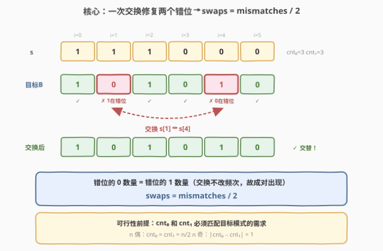
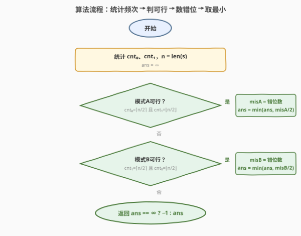
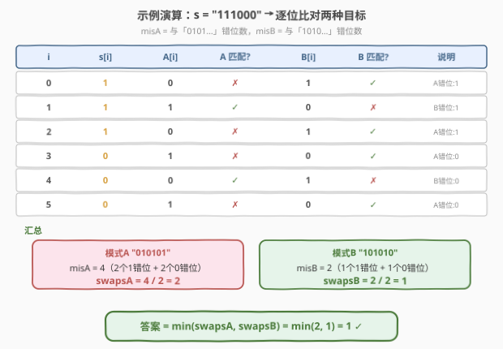

# 构成交替字符串需要的最小交换次数

- **题目名称**：构成交替字符串需要的最小交换次数
- **链接**：[1864. 构成交替字符串需要的最小交换次数](https://leetcode.cn/problems/minimum-number-of-swaps-to-make-the-binary-string-alternating/)
- **难度**：中等
- **标签**：字符串、贪心、计数

## 1. 题目概述

给定一个仅由 `'0'` 和 `'1'` 组成的字符串 `s`。一次**交换**操作可以选择任意两个下标并将对应字符互换。**交替二进制字符串**定义为任意两个相邻字符都不相等的字符串（即形如 `"010101…"` 或 `"101010…"`）。返回使 `s` 成为交替字符串所需的最少交换次数；若不可能则返回 `-1`。

**示例 1**：

```text
输入：s = "111000"
输出：1
解释：交换 s[1] 和 s[4]，得到 "101010"，即为交替串。
```

**示例 2**：

```text
输入：s = "010"
输出：0
解释："010" 已是交替串，无需交换。
```

**示例 3**：

```text
输入：s = "1110"
输出：-1
解释：cnt₀=1, cnt₁=3，无论哪种交替模式都无法匹配频次，返回 −1。
```

**约束条件**：

- $1 \le \text{s.length} \le 1000$
- `s[i]` 为 `'0'` 或 `'1'`

> 💡 **与 1758 的关键区别**：1758「生成交替二进制字符串的最少操作数」用的是**翻转**（每位独立可变），逐位统计差异即可；本题用的是**交换**（不改字符频次），必须先判可行性，且一次交换同时修复两个错位——`swaps = mismatches / 2`。

---

## 2. 解题思路

### 2.1 暴力思路：枚举两种目标，逐位统计错位

与 1758 类似，交替串只有两种目标——`"0101…"`（起始 `'0'`）和 `"1010…"`（起始 `'1'`）。对每个目标，逐位统计 `s` 与目标的错位数 `mis`，若可行则交换次数为 `mis / 2`，取两种目标的较小值。

但与 1758 不同的是：**交换不改变字符频次**，因此并非所有串都能变成交替串——必须先验证 `cnt_0`、`cnt_1` 是否匹配目标模式的需求。

```text
ans = ∞
cnt0 = count(s, '0'),  cnt1 = n - cnt0

for start in {0, 1}:                       # 目标起始字符
    need0 = (start == 0) ? ⌈n/2⌉ : ⌊n/2⌋  # 该模式需要的 '0' 数量
    need1 = n - need0
    if cnt0 == need0 and cnt1 == need1:    # 频次匹配才可行
        mis = 0
        for i in 0 .. n-1:
            expected = start if i 偶 else 1-start
            if s[i] != expected: mis += 1
        ans = min(ans, mis / 2)            # 一次交换修复两个错位

return ans == ∞ ? -1 : ans
```

时间 $O(n)$、空间 $O(1)$。

> ⚠️ **症结**：为什么 `swaps = mis / 2` 而非 `mis`？因为交换操作一次同时移动两个字符——一个错位的 `'0'` 和一个错位的 `'1'` 互换后双双归位。当频次匹配时，错位的 `'0'` 数量必然等于错位的 `'1'` 数量，故 `mis` 必为偶数，`mis / 2` 即最小交换次数。

### 2.2 核心观察：交换成对修复 + 频次可行性



关键洞察分两层：

**第一层——可行性**：交换不改频次，故 `cnt_0`、`cnt_1` 必须匹配目标模式：

| 模式 | 需要的 `'0'` 数 | 需要的 `'1'` 数 | 条件 |
|------|------------------|------------------|------|
| A `"0101…"`（起始 `'0'`） | $\lceil n/2 \rceil$ | $\lfloor n/2 \rfloor$ | $cnt_0 = \lceil n/2 \rceil$ |
| B `"1010…"`（起始 `'1'`） | $\lfloor n/2 \rfloor$ | $\lceil n/2 \rceil$ | $cnt_1 = \lceil n/2 \rceil$ |

- $n$ 为偶数时，两模式都需要 $cnt_0 = cnt_1 = n/2$，要么都可行、要么都不可行。
- $n$ 为奇数时，至多一个模式可行（由谁多一个决定）。

**第二层——交换次数**：当频次匹配时，错位的 `'0'` 与错位的 `'1'` **成对出现**（因为整体 `0`/`1` 总数恰好满足模式需求，多放了一个 `0` 的地方必然少放了一个 `0` 即多放了一个 `1`）。于是

$$
\text{misplaced}_0 = \text{misplaced}_1 = \frac{\text{mis}}{2} \qquad \Longrightarrow \qquad \text{swaps} = \frac{\text{mis}}{2}
$$

> 💡 **为什么不能用 1758 的 `diffB = n - diffA` 互补 trick？** 1758 中翻转操作每位独立，两目标逐位互补故 `diffA + diffB = n`。但本题的可行性是**按模式独立判定**的——$n$ 为奇数时只有一个模式可行，互补关系在可行性层面就已断裂。即便两模式都可行（$n$ 偶），`misA + misB = n` 仍成立，但 `misA / 2` 和 `misB / 2` 取最小仍需分别计算，互补 trick 只能省一次遍历的常数，不如 1758 那样有结构性简化。

### 2.3 算法流程图



1. **统计频次**：一趟扫描得 `cnt0`、`cnt1`，`ans = ∞`。
2. **模式 A 可行性**：若 `cnt0 == ⌈n/2⌉` 且 `cnt1 == ⌊n/2⌋`，逐位统计与 `"0101…"` 的错位数 `misA`，`ans = min(ans, misA / 2)`。
3. **模式 B 可行性**：若 `cnt1 == ⌈n/2⌉` 且 `cnt0 == ⌊n/2⌋`，逐位统计与 `"1010…"` 的错位数 `misB`，`ans = min(ans, misB / 2)`。
4. **终止**：返回 `ans == ∞ ? -1 : ans`。

两次独立的可行性判断 + 错位统计，每次 $O(n)$。

### 2.4 示例演算

以示例 1 `s = "111000"`（$n=6$，$cnt_0=3$，$cnt_1=3$）为例：



**可行性**：$n=6$ 为偶数，两模式都需要 $cnt_0=3, cnt_1=3$，均可行。

**逐位比对**（A = `"010101"`，B = `"101010"`）：

| $i$ | `s[i]` | `A[i]` | A 匹配? | `B[i]` | B 匹配? |
|-----|--------|--------|---------|--------|---------|
| $0$ | `1` | `0` | ✗ | `1` | ✓ |
| $1$ | `1` | `1` | ✓ | `0` | ✗ |
| $2$ | `1` | `0` | ✗ | `1` | ✓ |
| $3$ | `0` | `1` | ✗ | `0` | ✓ |
| $4$ | `0` | `0` | ✓ | `1` | ✗ |
| $5$ | `0` | `1` | ✗ | `0` | ✓ |

- **模式 A**：$\text{misA} = 4$（位置 0、2、3、5 错位），其中错位 `'1'` 有 2 个（位置 0、2），错位 `'0'` 有 2 个（位置 3、5），成对 ✓。$\text{swapsA} = 4 / 2 = 2$。
- **模式 B**：$\text{misB} = 2$（位置 1、4 错位），其中错位 `'1'` 有 1 个（位置 1），错位 `'0'` 有 1 个（位置 4），成对 ✓。$\text{swapsB} = 2 / 2 = 1$。
- 答案 $= \min(2, 1) = 1$ ✓

> 💡 注意模式 B 只需交换 `s[1]`（`'1'`）与 `s[4]`（`'0'`）即可得到 `"101010"`——一次交换同时修复两个错位。

---

## 3. 参考代码

### C++

```cpp
class Solution {
public:
    int minSwaps(string s) {
        int cnt0 = count(s.begin(), s.end(), '0');
        int cnt1 = s.size() - cnt0;
        int n = s.size();
        int ans = INT_MAX;

        // 模式 A "0101..."：需要 cnt0 == (n+1)/2, cnt1 == n/2
        if (cnt0 == (n + 1) / 2 && cnt1 == n / 2) {
            int mis = 0;
            for (int i = 0; i < n; ++i) {
                char expected = (i % 2 == 0) ? '0' : '1';
                if (s[i] != expected) ++mis;
            }
            ans = min(ans, mis / 2);
        }

        // 模式 B "1010..."：需要 cnt1 == (n+1)/2, cnt0 == n/2
        if (cnt1 == (n + 1) / 2 && cnt0 == n / 2) {
            int mis = 0;
            for (int i = 0; i < n; ++i) {
                char expected = (i % 2 == 0) ? '1' : '0';
                if (s[i] != expected) ++mis;
            }
            ans = min(ans, mis / 2);
        }

        return ans == INT_MAX ? -1 : ans;
    }
};
```

### Python

```python
class Solution:
    def minSwaps(self, s: str) -> int:
        cnt0 = s.count('0')
        cnt1 = len(s) - cnt0
        n = len(s)
        ans = float('inf')

        # 模式 A "0101..."
        if cnt0 == (n + 1) // 2 and cnt1 == n // 2:
            mis = sum(1 for i, c in enumerate(s)
                      if c != ('0' if i % 2 == 0 else '1'))
            ans = min(ans, mis // 2)

        # 模式 B "1010..."
        if cnt1 == (n + 1) // 2 and cnt0 == n // 2:
            mis = sum(1 for i, c in enumerate(s)
                      if c != ('1' if i % 2 == 0 else '0'))
            ans = min(ans, mis // 2)

        return -1 if ans == float('inf') else ans
```

> 💡 **写法对照**：两版逻辑一致——先判频次可行性，再统计错位并除以 2。`(n + 1) / 2` 即 $\lceil n/2 \rceil$，`n / 2` 即 $\lfloor n/2 \rfloor$，利用整数除法自然实现。
>
> ⚠️ **与 1758 的代码差异**：1758 利用互补关系 `diffB = n - diffA` 只算一趟；本题因可行性按模式独立判定，需分别统计两个模式的错位数。$n$ 为偶数时两模式要么都可行、要么都不可行，若都可行则 `misA + misB = n` 仍成立，可省一次遍历，但代码简洁起见通常分别计算。

---

## 4. 复杂度分析

| 维度 | 复杂度 | 说明 |
|------|--------|------|
| 时间复杂度 | $O(n)$ | 至多两趟扫描（每模式一趟），每位 $O(1)$ 比较 |
| 空间复杂度 | $O(1)$ | 仅 `cnt0`、`cnt1`、`mis`、`ans` 等常数变量 |

> 💡 $n \le 1000$，两趟 $O(2n)$ 完全可接受。若 $n$ 为偶数且两模式均可行，可利用 `misA + misB = n` 省去第二次遍历，但常数优化意义不大。

---

## 5. 扩展：交换次数的最小性证明

为什么 `mis / 2` 一定是最小交换次数？这涉及**置换环分解**的视角。

将问题建模为：`s` 中位置分为「应为 `0` 的位置集」$P_0$ 和「应为 `1` 的位置集」$P_1$。当前 `s` 在 $P_0$ 中放了若干 `'1'`（错位 `'1'`），在 $P_1$ 中放了等量 `'0'`（错位 `'0'`）。每次交换一个错位 `'1'` 与一个错位 `'0'`，两者同时归位。这等价于二分图上的**完美匹配**——每个错位 `'1'` 必须与一个错位 `'0'` 配对交换。

由于所有错位 `'1'` 等价（都是 `'1'` 需要移到某个 $P_1$ 位置）、所有错位 `'0'` 也等价，任意配对方案所需交换数都相同 $= \text{misplaced}_0 = \text{mis} / 2$。因此无需构造具体交换方案，直接计数即可。

> ⚠️ 这与一般的「最小交换次数排序」（涉及多元素置换环分解，答案为 $n - \text{环数}$）不同——本题只有两种字符，错位关系构成简单的二分匹配，退化为一一配对。

---

## 6. 面试要点

**Q1：为什么交换次数是 `mis / 2` 而非 `mis`？**
> 一次交换同时移动两个字符——把一个错位的 `'0'` 和一个错位的 `'1'` 互换，两者同时归位。当频次匹配时，错位 `'0'` 数量等于错位 `'1'` 数量，故 `mis` 必为偶数，`mis / 2` 即最小交换次数。对比 1758 的翻转操作每位独立，答案就是 `mis` 本身。

**Q2：如何判断不可能（返回 −1）？**
> 交换不改字符频次，交替串对 `0`/`1` 数量有硬约束：模式 `"0101…"` 需要 $cnt_0 = \lceil n/2 \rceil$，模式 `"1010…"` 需要 $cnt_1 = \lceil n/2 \rceil$。若两个条件都不满足，则无论怎么交换都无法构成交替串，返回 −1。$n$ 为偶数时两模式要求相同（$cnt_0 = cnt_1 = n/2$），$n$ 为奇数时至多一个模式可行。

**Q3：本题与 1758「生成交替二进制字符串的最少操作数」有何异同？**
> **同**：都只有两种交替目标（`"0101…"` 和 `"1010…"`），都逐位统计错位数。**异**：1758 用翻转（每位独立可变），答案 $= \min(\text{diffA}, n - \text{diffA})$，利用互补关系一趟扫描即可，且永远可行；1864 用交换（不改频次），必须先判可行性，且答案 $= \min(\text{misA}/2, \text{misB}/2)$，互补 trick 在可行性层面断裂。核心区别在于操作语义——翻转改值不改位，交换改位不改值。

**Q4：$n$ 为偶数时 `misA + misB = n` 是否仍成立？能否省一次遍历？**
> 成立。两目标逐位互补，同一位置恰与一方错位，故 `misA + misB = n`。若两模式均可行（$n$ 偶时要么都可行要么都不可行），算出 `misA` 后 `misB = n - misA`，可省第二次遍历。但 $n$ 为奇数时只有一个模式可行，互补关系在可行性层面失效，必须分别判断。

**Q5：为什么不需要构造具体交换方案？**
> 本题只有两种字符，错位关系构成简单的二分匹配——所有错位 `'1'` 等价、所有错位 `'0'` 等价，任意配对方案的交换数都相同 $= \text{mis} / 2$。因此只需计数，无需模拟交换过程。这与多元素的最小交换排序（需置换环分解）不同。

---

## 7. 同类练习题

- [1758. 生成交替二进制字符串的最少操作数](https://leetcode.cn/problems/minimum-changes-to-make-alternating-binary-string/)（[题解](../1701-1800/1758_生成交替二进制字符串的最少操作数.md)）：翻转版对照题，利用互补关系 `diffB = n - diffA` 一趟扫描，永远可行；本题是交换版，需判可行性且 `swaps = mis / 2`
- [1869. 仅含 1 的子串的较长长度](https://leetcode.cn/problems/longer-contiguous-segments-of-ones-than-zeros/)：二进制串的连续段长度比较，相邻同/异字符的统计对照
- [1702. 修改后的最大二进制字符串](https://leetcode.cn/problems/maximum-binary-string-after-change/)（[题解](../1701-1800/1702_修改后的最大二进制字符串.md)）：二进制串操作优化，同样关注 `0`/`1` 的位置布局对结果的影响
- [1784. 检查二进制字符串字段](https://leetcode.cn/problems/check-if-binary-string-has-at-most-one-segment-of-ones/)：二进制串格式校验，相邻字符关系的判定变体
