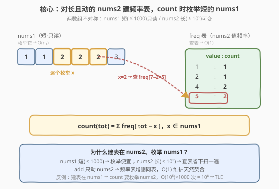
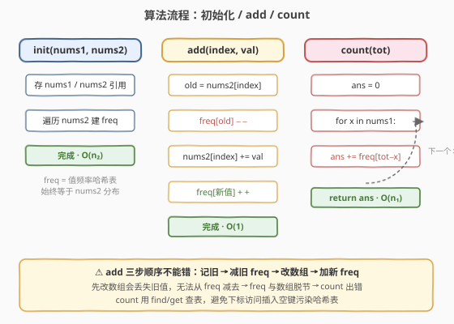
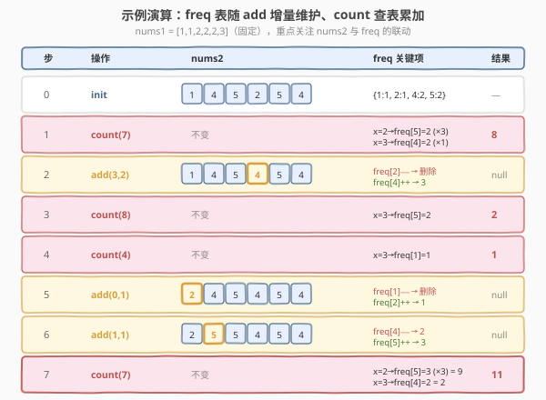

# LeetCode 找出和为指定值的下标对 题解

## 1. 题目概述

- **标题 / 题号**：找出和为指定值的下标对（#1865，medium）
- **链接**：https://leetcode.cn/problems/finding-pairs-with-a-certain-sum/
- **难度**：中等
- **标签**：设计、哈希表

**题意**：给定两个整数数组 `nums1` 和 `nums2`，实现一个支持下述两类查询的数据结构 `FindSumPairs`：

- `add(int index, int val)`：将 `val` 加到 `nums2[index]` 上，即 `nums2[index] += val`。
- `count(int tot)`：统计满足 `nums1[i] + nums2[j] == tot` 的下标对 `(i, j)` 数目（`0 <= i < nums1.length` 且 `0 <= j < nums2.length`）。

**示例 1**：

```text
输入：
["FindSumPairs", "count", "add", "count", "count", "add", "add", "count"]
[[[1, 1, 2, 2, 2, 3], [1, 4, 5, 2, 5, 4]], [7], [3, 2], [8], [4], [0, 1], [1, 1], [7]]
输出：
[null, 8, null, 2, 1, null, null, 11]

解释：
FindSumPairs([1, 1, 2, 2, 2, 3], [1, 4, 5, 2, 5, 4])
count(7) → 8     // (2,2),(3,2),(4,2),(2,4),(3,4),(4,4) 满足 2+5=7
                // (5,1),(5,5) 满足 3+4=7
add(3, 2)        // nums2 = [1,4,5,4,5,4]
count(8) → 2     // (5,2),(5,4) 满足 3+5=8
count(4) → 1     // (5,0) 满足 3+1=4
add(0, 1)        // nums2 = [2,4,5,4,5,4]
add(1, 1)        // nums2 = [2,5,5,4,5,4]
count(7) → 11    // 9 个 2+5 + 2 个 3+4
```

**约束**：

- $1 \le \text{nums1.length} \le 1000$
- $1 \le \text{nums2.length} \le 10^5$
- $1 \le \text{nums1}[i] \le 10^9$
- $1 \le \text{nums2}[i] \le 10^5$
- $0 \le \text{index} < \text{nums2.length}$
- $1 \le \text{val} \le 10^5$
- $1 \le \text{tot} \le 10^9$
- 最多调用 `add` 和 `count` 各 $1000$ 次

> 💡 注意两个数组的关键**不对称性**：`nums1` 短（$\le 1000$）且**只读**，`nums2` 长（$\le 10^5$）且**会被 `add` 修改**。这种「一短一长、一静一动」的结构决定了算法的设计方向——对长且动的数组建频率哈希，对短且静的数组线性枚举。

## 2. 解题思路

### 2.1 暴力思路：每次 count 双重遍历

最直观的做法是 `count(tot)` 时双重循环：枚举每个 `nums1[i]`，再枚举每个 `nums2[j]`，判断 `nums1[i] + nums2[j] == tot` 并计数。

```text
count(tot):
  ans = 0
  for i in range(len(nums1)):
    for j in range(len(nums2)):
      if nums1[i] + nums2[j] == tot: ans += 1
  return ans
```

> ⚠️ 单次 `count` 即 $O(n_1 \cdot n_2) = 1000 \times 10^5 = 10^8$，而 `count` 最多调用 $1000$ 次，总量高达 $10^{11}$，必然超时。瓶颈在于：每次查询都把 `nums2` 全扫一遍，而 `nums2` 的高频信息本可以预处理复用。

### 2.2 核心观察：对 nums2 建频率表，枚举短的 nums1



关键观察是**两数组的不对称性**：

- `nums1` 短（$\le 1000$）且**永不变** → 适合在 `count` 时**线性枚举**。
- `nums2` 长（$\le 10^5$）且**会被 `add` 修改** → 适合维护一张**值频率哈希表** `freq`，把「逐个比较」转化为「按值聚合 + $O(1)$ 查表」。

于是：

$$\text{count}(tot) = \sum_{x \in \text{nums1}} \text{freq}[\,tot - x\,]$$

- `count(tot)`：遍历 `nums1` 的每个元素 $x$，把 `freq[tot - x]` 累加。单次 $O(n_1)$。
- `add(index, val)`：把 `nums2[index]` 的旧值从 `freq` 减一、更新数组、新值在 `freq` 加一。单次 $O(1)$。

> 💡 **为什么频率表建在 nums2 而非 nums1？** 两种选择都能把双循环降为「枚举一个 + 查表另一个」。但建在 `nums2` 上时，`count` 枚举的是短的 `nums1`（$O(1000)$）；若建在 `nums1` 上，`count` 要枚举长的 `nums2`（$O(10^5)$）。两者相差 100 倍。同时 `add` 只动 `nums2`，把频率表建在 `nums2` 上，`add` 的增删刚好对应同一张表，$O(1)$ 维护；若建在 `nums1` 上，`add` 反而无需动表，但 `count` 会被长数组拖垮。综合看，**建表在长数组、枚举短数组**是本题最优分工，与 [454. 四数相加 II](https://leetcode.cn/problems/4sum-ii/) 的「分组 Meet-in-the-Middle」同源——都是把双循环拆成「枚举一半 + 哈希查另一半」。

### 2.3 算法流程图



三个流程：

- **初始化** `FindSumPairs(nums1, nums2)`：保存 `nums1` 与 `nums2` 引用，遍历 `nums2` 建立 `freq` 频率哈希表。$O(n_2)$。
- **`add(index, val)`**：三步走——`freq[nums2[index]] -= 1`（旧值减一）→ `nums2[index] += val`（更新数组）→ `freq[nums2[index]] += 1`（新值加一）。$O(1)$。
- **`count(tot)`**：`ans = 0`，遍历 `nums1` 中每个 $x$，`ans += freq.get(tot - x, 0)`，返回 `ans`。$O(n_1)$。

> ⚠️ `add` 中**先减旧值再更新数组再加新值**的顺序不能错。若先改了 `nums2[index]`，就丢失了旧值无法从 `freq` 中减去。务必「记旧 → 改数组 → 记新」。

### 2.4 示例演算



以题目示例逐步推演，重点观察 `freq` 表如何随 `add` 增量维护、`count` 如何枚举 `nums1` 查表累加：

| 步骤 | 操作 | nums2 | freq 关键项 | 计算 / 结果 |
|------|------|-------|-------------|-------------|
| 0 | `init` | `[1,4,5,2,5,4]` | `{1:1, 2:1, 4:2, 5:2}` | 建 freq，$O(n_2)$ |
| 1 | `count(7)` | 不变 | 同上 | $x=2\to\text{freq}[5]=2$（×3 个 2）+ $x=3\to\text{freq}[4]=2$（×1 个 3）= $6+2=$ **8** |
| 2 | `add(3, 2)` | `[1,4,5,4,5,4]` | `{1:1, 4:3, 5:2}` | 旧值 2 减一（freq[2] 归零删除），新值 4 加一 |
| 3 | `count(8)` | 不变 | 同上 | $x=3\to\text{freq}[5]=2$ = **2** |
| 4 | `count(4)` | 不变 | 同上 | $x=3\to\text{freq}[1]=1$ = **1** |
| 5 | `add(0, 1)` | `[2,4,5,4,5,4]` | `{2:1, 4:3, 5:2}` | 旧值 1 减一，新值 2 加一 |
| 6 | `add(1, 1)` | `[2,5,5,4,5,4]` | `{2:1, 4:2, 5:3}` | 旧值 4 减一，新值 5 加一 |
| 7 | `count(7)` | 不变 | 同上 | $x=2\to\text{freq}[5]=3$（×3 个 2）= 9 + $x=3\to\text{freq}[4]=2$ = **11** |

> 💡 每次操作只需关注 `freq` 的局部增量变化，无需重扫 `nums2`。这正是「维护不变式」思想：`freq` 始终等于 `nums2` 当前值分布，`count` 直接信任这张表即可。

## 3. 参考代码

### C++

```cpp
class FindSumPairs {
    vector<int> nums1, nums2;
    unordered_map<int, int> freq;              // nums2 的值频率表
  public:
    FindSumPairs(vector<int>& nums1, vector<int>& nums2)
        : nums1(nums1), nums2(nums2) {
        for (int x : this->nums2) freq[x]++;   // 建 freq，O(n2)
    }

    void add(int index, int val) {
        int old = nums2[index];
        if (--freq[old] == 0) freq.erase(old); // 旧值减一，归零则删键
        nums2[index] += val;                   // 更新数组
        freq[nums2[index]]++;                  // 新值加一
    }

    int count(int tot) {
        int ans = 0;
        for (int x : nums1) {                  // 枚举短的 nums1
            auto it = freq.find(tot - x);
            if (it != freq.end()) ans += it->second;
        }
        return ans;
    }
};
```

> 💡 C++ 用 `unordered_map`，`count` 中先 `find` 再读 `second` 比 `freq[tot - x]` 直接下标更优——后者会在键不存在时**插入一个 0**，污染哈希表并产生额外开销。`add` 中 `freq.erase(old)` 把归零的键删掉，保持表紧凑（也可不删，留 0 不影响正确性，只是略占空间）。

### Python

```python
from collections import Counter


class FindSumPairs:

    def __init__(self, nums1: list[int], nums2: list[int]):
        self.nums1 = nums1
        self.nums2 = nums2
        self.freq = Counter(nums2)            # 建 freq，O(n2)

    def add(self, index: int, val: int) -> None:
        old = self.nums2[index]
        self.freq[old] -= 1                   # 旧值减一
        self.nums2[index] += val             # 更新数组
        self.freq[self.nums2[index]] += 1    # 新值加一

    def count(self, tot: int) -> int:
        ans = 0
        for x in self.nums1:                  # 枚举短的 nums1
            ans += self.freq.get(tot - x, 0)
        return ans
```

> 💡 Python 用 `collections.Counter`，`.get(key, 0)` 对缺失键返回 0，不会像 `self.freq[key]` 那样对 `Counter` 插入键（`Counter` 的 `__missing__` 返回 0 但不插入，不过用 `get` 更明确）。`Counter` 的 `__init__` 接受可迭代对象，底层等价于一次遍历累加，$O(n_2)$。

## 4. 复杂度分析

| 维度 | 复杂度 | 说明 |
|------|--------|------|
| 时间复杂度（初始化） | $O(n_2)$ | 遍历 `nums2` 建频率表 |
| 时间复杂度（`add`） | $O(1)$ | 哈希表两次增删 + 数组一次赋值，均摊常数 |
| 时间复杂度（`count`） | $O(n_1)$ | 遍历 `nums1`（$\le 1000$），每次 $O(1)$ 哈希查表 |
| 空间复杂度 | $O(n_2)$ | `freq` 表最多存 `nums2` 长度个不同值 |

> 💡 设 `add` 与 `count` 各调用 $m = 1000$ 次，则总时间 $O(n_2 + m \cdot n_1 + m) = O(10^5 + 10^6 + 10^3) \approx 1.1 \times 10^6$，远低于时限。瓶颈被「枚举短数组」消除——若误把频率表建在 `nums1` 上，总时间会膨胀到 $O(n_1 + m \cdot n_2) \approx 10^8$，足以 TLE。

## 5. 扩展：为什么不能改用排序 + 双指针？

一个常见疑问：[1. 两数之和](https://leetcode.cn/problems/two-sum/) 的最优解是哈希，而 [167. 两数之和 II](https://leetcode.cn/problems/two-sum-ii-input-array-is-sorted/) 用排序 + 双指针也能 $O(n)$。本题能否排序 `nums2` 后用双指针做 `count`？

答案是**不适合**，原因有二：

1. **`add` 会破坏有序性**。`nums2[index] += val` 后数组不再有序，每次 `add` 都要重新排序（$O(n_2 \log n_2)$）或用平衡树维护（实现复杂）。而频率哈希表的 `add` 是 $O(1)$。
2. **`count` 是重复查询**。双指针法适合「一次性两数之和」，每次查询都要 $O(n)$ 重跑；而哈希表把 `nums2` 聚合成频率分布后，每次 `count` 只需枚举短的 `nums1`。

> 💡 本题是典型的「**在线查询 + 单点更新**」场景：查询多、更新也多，且更新只动一个位置。这类场景下，**预处理一个可增量维护的聚合结构（频率哈希）** 几乎总是优于「每次现算」的排序/双指针。与 [981. 基于时间的键值存储](https://leetcode.cn/problems/time-based-key-value-store/)（[题解](../0901-1000/981_基于时间的键值存储.md)）用有序数组 + 二分处理「单点插入 + 区间查询」是同一类权衡——只是本题的查询是「按值聚合」而非「按时间二分」。

## 6. 面试要点

1. **为什么频率表建在 nums2 而非 nums1？**

   - 两个数组不对称：`nums1` 短（$\le 1000$）且只读，`nums2` 长（$\le 10^5$）且可变。`count` 要枚举其中一个去查另一个的表。建表在 `nums2` 上，`count` 枚举短的 `nums1`，单次 $O(1000)$；反之建表在 `nums1` 上，`count` 要枚举长的 `nums2`，单次 $O(10^5)$，差 100 倍。同时 `add` 只动 `nums2`，频率表建在 `nums2` 上时 `add` 的增删恰好对应同一张表，$O(1)$ 维护天然契合。

2. **`add` 的三步顺序能调换吗？为什么？**

   - 不能。必须「记旧值 → 减旧 freq → 改数组 → 加新 freq」。若先改了 `nums2[index]`，就读不到旧值，无法从 `freq` 中减去旧值的计数，导致 `freq` 与实际数组脱节、`count` 出错。这是「先用后改」的典型顺序陷阱。

3. **`count` 中用哈希下标访问和 `find/get` 有何区别？**

   - C++ 的 `unordered_map::operator[]` 在键不存在时会**插入一个默认值 0**，既污染哈希表（增大表、影响后续操作）又多一次插入开销。`find` 只读不插，更安全高效。Python 的 `Counter` 下标访问虽不插入（`__missing__` 返回 0），但用 `get(key, 0)` 语义更清晰，避免依赖 `Counter` 的特殊行为。

4. **如果 `add` 调用极多而 `count` 极少，算法还合适吗？**

   - 仍然合适。`add` 是 $O(1)$，再多调用也只是线性增长。反过来若 `count` 极多而 `add` 极少，本题方案同样占优（`count` $O(n_1)$）。最坏情形是两者都打满 $1000$ 次，总量 $\approx 10^6$，毫无压力。真正会失效的是「`count` 枚举长数组」的误判方案。

5. **与 1. 两数之和、454. 四数相加 II 的异同？**

   - 都是「两数之和」家族，核心都是用哈希把双循环拆成「枚举一半 + 查另一半」。区别在于场景：[1](https://leetcode.cn/problems/two-sum/) 是一次性查询找下标；[454](https://leetcode.cn/problems/4sum-ii/) 是四个独立数组的计数（Meet-in-the-Middle 分组哈希）；本题是**在线数据结构**，要支持单点更新 `add` 后重复 `count`，因此频率表必须可增量维护，而非每次重建。

## 同类练习题

| # | 题目 | 与本题的关联 |
|---|------|-------------|
| 1 | [两数之和](https://leetcode.cn/problems/two-sum/)（[题解](../0001-0100/1_两数之和.md)） | 两数之和哈希套路的母题，一次性查询找下标，对比本题「在线 + 可更新」的升级 |
| 454 | [四数相加 II](https://leetcode.cn/problems/4sum-ii/)（[题解](../0401-0500/454_四数相加II.md)） | 分组 + 哈希 Meet-in-the-Middle 计数，思想同源（枚举一半 + 查另一半），对比本题的两组数据版本 |
| 981 | [基于时间的键值存储](https://leetcode.cn/problems/time-based-key-value-store/)（[题解](../0901-1000/981_基于时间的键值存储.md)） | 同为「设计 + 预处理聚合结构」范式，对比「按值频率哈希」与「按时间有序数组二分」两种聚合策略 |
| 1845 | [座位预约管理系统](https://leetcode.cn/problems/seat-reservation-manager/)（[题解](./1845_座位预约管理系统.md)） | 同题号区间相邻的设计题，对比「最小堆取最值」与「频率哈希计数」两种数据结构设计取向 |
