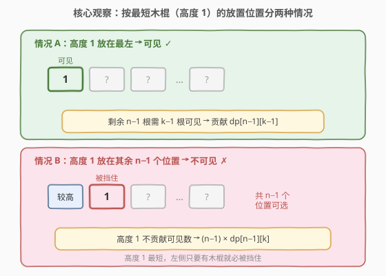
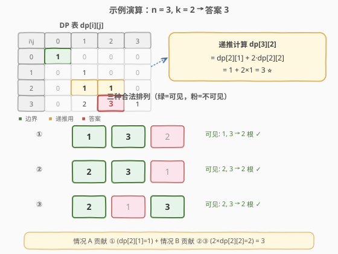

# 恰有K根木棍可以看到的排列数目

- **题目名称**：恰有K根木棍可以看到的排列数目
- **链接**：[1866. 恰有 K 根木棍可以看到的排列数目](https://leetcode.cn/problems/number-of-ways-to-rearrange-sticks-with-k-sticks-visible/)
- **难度**：困难
- **标签**：动态规划、数学、组合数学

## 1. 题目概述

有 $n$ 根长度互不相同的木棍，长度为从 $1$ 到 $n$ 的整数。将它们排成一排，从左侧**可以看到**一根木棍的前提是它的**左侧不存在比它更长的木棍**。

例如，排列 `[1,3,2,5,4]` 中从左侧可以看到长度分别为 $1$、$3$、$5$ 的木棍（共 $3$ 根）。

给定 $n$ 和 $k$，返回恰好有 $k$ 根木棍可以看到的排列数目。由于答案可能很大，返回对 $10^9 + 7$ 取余的结果。

> 💡 **本质**：「从左侧可见」等价于排列的**左到右最大值（left-to-right maxima / records）**——一个位置 $i$ 可见当且仅当 $\text{perm}[i] = \max(\text{perm}[1..i])$。本题就是统计 $n$ 元排列中恰有 $k$ 个左到右最大值的个数，这正是**第一类 Stirling 数** $\begin{bmatrix} n \\ k \end{bmatrix}$ 的组合含义。

**示例 1**：

```text
输入：n = 3, k = 2
输出：3
解释：[1,3,2], [2,3,1] 和 [2,1,3] 是仅有的满足恰好 2 根可见的排列。
      可见的木棍用粗体标识。
```

**示例 2**：

```text
输入：n = 5, k = 5
输出：1
解释：[1,2,3,4,5] 是唯一一种 5 根全部可见的排列（严格递增）。
```

**示例 3**：

```text
输入：n = 20, k = 11
输出：647427950
```

**约束条件**：

- $1 \le n \le 1000$
- $1 \le k \le n$

---

## 2. 解题思路

### 2.1 暴力思路

枚举 $1..n$ 的所有 $n!$ 种全排列，对每个排列从左到右扫描统计左到右最大值个数，数出等于 $k$ 的。$n = 1000$ 时 $n!$ 是天文数字，完全不可行。

能否直接组合计数？「$n$ 元排列中恰有 $k$ 个左到右最大值」的数目并没有简单的闭式公式，但有一个优美的**递推关系**——通过考察最短木棍的放置位置，把 $n$ 的问题归约到 $n-1$。

### 2.2 核心观察：按最短木棍（高度 1）的放置位置分类



关键洞察：考察**高度为 1 的木棍**（最短的那根）放在哪个位置。它要么在最左端，要么不在——这两种情况恰好对应递推的两项。

**情况 A：高度 1 放在最左（位置 1）。** 此时它的左侧没有任何木棍，因此**必定可见**。剩下的 $n-1$ 根木棍（高度 $2..n$，等价于一个 $n-1$ 规模的子问题）只需再有 $k-1$ 根可见即可。这给出 $\text{dp}[n-1][k-1]$ 种方案。

**情况 B：高度 1 放在其余 $n-1$ 个位置之一。** 无论放在哪里（非最左），它的左侧都至少有一根比它长的木棍（因为 $1$ 是最短的，其他所有木棍都比它长），因此**必定不可见**。高度 1 对可见数贡献为 $0$，剩余 $n-1$ 根木棍需恰有 $k$ 根可见。位置有 $n-1$ 种选择，这给出 $(n-1) \cdot \text{dp}[n-1][k]$ 种方案。

> 💡 **为什么选最短的而不是最长的？** 选最短木棍的精妙之处在于：只要它不在最左端就**一定被挡住**（所有其他木棍都比它长），结论干净利落、不依赖左侧具体排列。若改选最长木棍，它在任何位置都可见，但会遮挡其右侧所有更短的木棍，右侧子问题的结构会被打乱，分析更复杂。

### 2.3 状态转移

![状态转移：dp[n][k] = dp[n-1][k-1] + (n-1)·dp[n-1][k]](../images/1866_transition.svg)

综合两种情况，得到递推：

$$\text{dp}[n][k] = \text{dp}[n-1][k-1] + (n-1) \cdot \text{dp}[n-1][k]$$

- **状态定义**：$\text{dp}[i][j]$ = $i$ 根木棍恰有 $j$ 根可见的排列数。
- **边界**：$\text{dp}[0][0] = 1$（空排列，$0$ 根可见，算 $1$ 种）；$\text{dp}[i][0] = 0$（$i \ge 1$，至少最左端那根可见，不可能 $0$ 根）。
- **答案**：$\text{dp}[n][k]$。

> ⚠️ **取余**：每一步都对 $10^9+7$ 取余，乘法用 `long long` 防溢出。

### 2.4 示例演算



以 $n = 3, k = 2$ 为例，逐步填表：

| $i \backslash j$ | 0 | 1 | 2 | 3 |
|---|---|---|---|---|
| 0 | **1** | 0 | 0 | 0 |
| 1 | 0 | 1 | 0 | 0 |
| 2 | 0 | 1 | 1 | 0 |
| 3 | 0 | 2 | **3** | 1 |

计算 $\text{dp}[3][2]$：

$$\text{dp}[3][2] = \underbrace{\text{dp}[2][1]}_{\text{情况 A}} + 2 \cdot \underbrace{\text{dp}[2][2]}_{\text{情况 B}} = 1 + 2 \times 1 = 3$$

三种合法排列及其可见木棍（加粗）：

| 排列 | 可见木棍 | 数量 |
|------|----------|------|
| **1**, **3**, 2 | 1, 3 | 2 ✓ |
| **2**, **3**, 1 | 2, 3 | 2 ✓ |
| **2**, 1, **3** | 2, 3 | 2 ✓ |

> 💡 **验证情况 A**：高度 1 在最左 → 可见。剩余 $\{2,3\}$ 需 $1$ 根可见 → 只有 $[3,2]$（3 可见，2 被挡）→ 排列 $[1,3,2]$，贡献 $\text{dp}[2][1]=1$。
> **验证情况 B**：高度 1 在位置 2 或 3 → 不可见。位置 2：剩余 $\{2,3\}$ 排在位置 $\{1,3\}$ 需 $2$ 可见 → $[2,\_,3]$ → $[2,1,3]$；位置 3：剩余 $\{2,3\}$ 排在位置 $\{1,2\}$ 需 $2$ 可见 → $[2,3,\_]$ → $[2,3,1]$。共 $2 \times \text{dp}[2][2] = 2$。合计 $1+2=3$ ✓。

---

## 3. 参考代码

### 方法一：二维 DP（最直观）

### C++

```cpp
class Solution {
  public:
    int rearrangeSticks(int n, int k) {
        const int MOD = 1e9 + 7;
        vector<vector<long long>> dp(n + 1, vector<long long>(k + 1, 0));
        dp[0][0] = 1;
        for (int i = 1; i <= n; i++) {
            for (int j = 1; j <= min(i, k); j++) {
                dp[i][j] = (dp[i - 1][j - 1] + (long long)(i - 1) * dp[i - 1][j]) % MOD;
            }
        }
        return dp[n][k];
    }
};
```

### Python

```python
class Solution:
    def rearrangeSticks(self, n: int, k: int) -> int:
        MOD = 10**9 + 7
        dp = [[0] * (k + 1) for _ in range(n + 1)]
        dp[0][0] = 1
        for i in range(1, n + 1):
            for j in range(1, min(i, k) + 1):
                dp[i][j] = (dp[i - 1][j - 1] + (i - 1) * dp[i - 1][j]) % MOD
        return dp[n][k]
```

### 方法二：滚动数组（空间优化）

注意到 $\text{dp}[i]$ 只依赖 $\text{dp}[i-1]$，可用一维数组**倒序更新**——更新 $\text{dp}[j]$ 时 $\text{dp}[j-1]$ 和 $\text{dp}[j]$ 都还是上一轮（$i-1$）的旧值。

### C++

```cpp
class Solution {
  public:
    int rearrangeSticks(int n, int k) {
        const int MOD = 1e9 + 7;
        vector<long long> dp(k + 1, 0);
        dp[0] = 1;                        // dp[0][0] = 1
        for (int i = 1; i <= n; i++) {
            for (int j = min(i, k); j >= 1; j--) {
                dp[j] = (dp[j - 1] + (long long)(i - 1) * dp[j]) % MOD;
            }
            dp[0] = 0;                    // dp[i][0] = 0 (i >= 1)
        }
        return dp[k];
    }
};
```

### Python

```python
class Solution:
    def rearrangeSticks(self, n: int, k: int) -> int:
        MOD = 10**9 + 7
        dp = [0] * (k + 1)
        dp[0] = 1                          # dp[0][0] = 1
        for i in range(1, n + 1):
            for j in range(min(i, k), 0, -1):
                dp[j] = (dp[j - 1] + (i - 1) * dp[j]) % MOD
            dp[0] = 0                      # dp[i][0] = 0 (i >= 1)
        return dp[k]
```

> 💡 **倒序更新的正确性**：内层循环 $j$ 从大到小，更新 $\text{dp}[j]$ 时读取的 $\text{dp}[j-1]$（下标更小，尚未被本轮覆盖）和 $\text{dp}[j]$（尚未覆盖）都是 $i-1$ 轮的值，与二维递推完全一致。每轮结束后令 $\text{dp}[0]=0$，因为 $i \ge 1$ 时不可能有 $0$ 根可见。

---

## 4. 复杂度分析

| 维度 | 复杂度 | 说明 |
|------|--------|------|
| 时间复杂度 | $O(n \cdot k)$ | 双重循环，外层 $n$、内层至多 $k$；$n, k \le 1000$ 时约 $10^6$ 次 |
| 空间复杂度（二维） | $O(n \cdot k)$ | 二维 DP 表 |
| 空间复杂度（滚动） | $O(k)$ | 一维数组，仅保留当前轮 |

> 💡 本题的核心在于**发现递推结构**——通过考察最短木棍的位置，把 $n$ 元问题干净地归约到 $n-1$ 元。一旦递推建立，$O(nk)$ 的 DP 是水到渠成的。

---

## 5. 扩展：第一类 Stirling 数

本题的递推 $\text{dp}[n][k] = \text{dp}[n-1][k-1] + (n-1)\,\text{dp}[n-1][k]$ 正是**无符号第一类 Stirling 数** $\begin{bmatrix} n \\ k \end{bmatrix}$ 的标准递推。

第一类 Stirling 数的经典组合含义是「$n$ 元排列中恰有 $k$ 个轮换（cycle）的个数」。而「恰有 $k$ 个左到右最大值」的排列数也等于 $\begin{bmatrix} n \\ k \end{bmatrix}$——这是组合数学中一个优美的结果，通过 **Foata 变换**（一种双射）将轮换结构与左到右最大值结构一一对应。

因此 $\text{dp}[n][k]$ 的值可直接查 Stirling 数表，例如：

| $n \backslash k$ | 1 | 2 | 3 | 4 | 5 |
|---|---|---|---|---|---|
| 1 | 1 | | | | |
| 2 | 1 | 1 | | | |
| 3 | 2 | 3 | 1 | | |
| 4 | 6 | 11 | 6 | 1 | |
| 5 | 24 | 50 | 35 | 10 | 1 |

$n=5, k=5$ 时 $\begin{bmatrix} 5 \\ 5 \end{bmatrix} = 1$（对应唯一的全可见排列 $[1,2,3,4,5]$），与示例 2 吻合。

> 💡 **面试中**不必提前背 Stirling 数，但若能现场推出递推（按最短木棍分类），就等价于独立发现了 Stirling 数的递推——这正是面试官想看到的组合推理能力。

---

## 6. 面试要点

**Q1：为什么选择考察最短木棍（高度 1）而不是最长木棍？**

> 最短木棍只要不在最左端就**一定被挡住**（所有其他木棍都比它长），结论不依赖左侧具体排列，干净利落。若选最长木棍，它在任何位置都可见，但会遮挡其右侧所有更短的木棍，右侧子问题的结构会被打乱，分析更复杂。

**Q2：递推中 $(n-1)$ 这个系数是怎么来的？**

> 情况 B 中高度 1 放在「非最左」的任意位置都不可见，这样的位置共有 $n-1$ 个（位置 $2..n$）。每种位置下剩余 $n-1$ 根的可见数需求不变（仍为 $k$），故乘以 $n-1$。

**Q3：滚动数组为什么必须倒序更新 $j$？**

> 递推 $\text{dp}[j] = \text{dp}[j-1] + (i-1)\cdot\text{dp}[j]$ 中右边两项都来自上一轮 $i-1$。倒序更新保证修改 $\text{dp}[j]$ 时 $\text{dp}[j-1]$ 尚未被本轮覆盖，仍是旧值。若正序更新，$\text{dp}[j-1]$ 已被改成 $i$ 轮的新值，递推就错了。

**Q4：边界 $\text{dp}[0][0]=1$ 的含义？如何理解？**

> 空排列（$0$ 根木棍）有 $0$ 根可见，算 $1$ 种。这是递推的基石——$\text{dp}[1][1] = \text{dp}[0][0] + 0 \cdot \text{dp}[0][1] = 1$。若初始化为 $0$ 则全表归零。空积/空排列计 $1$ 是组合计数中的标准约定。

**Q5：这题与第一类 Stirling 数有什么关系？**

> $\text{dp}[n][k]$ 恰等于无符号第一类 Stirling 数 $\begin{bmatrix} n \\ k \end{bmatrix}$。Stirling 数的经典含义是「$n$ 元排列恰 $k$ 个轮换」的个数，而 Foata 变换证明「轮换个数」与「左到右最大值个数」在排列上是等分布的。能现场推出递推即等价于独立发现 Stirling 数。

---

## 7. 同类练习题

- [526. 优美的排列](https://leetcode.cn/problems/beautiful-arrangement/)（[站内题解](../0501-0600/526_优美的排列.md)）：排列计数 DP，$n \le 15$ 用状压，对比本题 $n \le 1000$ 用递推——两种不同规模的排列计数范式
- [96. 不同的二叉搜索树](https://leetcode.cn/problems/unique-binary-search-trees/)（[站内题解](../0001-0100/96_不同的二叉搜索树.md)）：卡塔兰数计数 DP，同属「按某一元素分情况 → 归约到子问题」的递推计数套路
- [377. 组合总和 IV](https://leetcode.cn/problems/combination-sum-iv/)（[站内题解](../0301-0400/377_组合总和IV.md)）：完全背包求排列数，对照「序列计数型 DP」的不同面貌
- [1641. 统计元音字母序列的数目](https://leetcode.cn/problems/count-vowels-permutation/)：按前驱字符分情况递推的计数 DP，同属「状态计数 + 分类转移」家族
