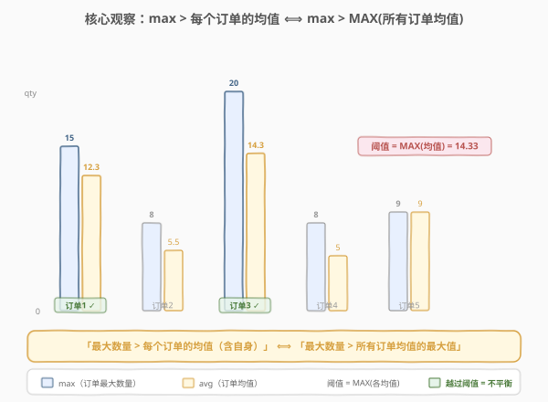
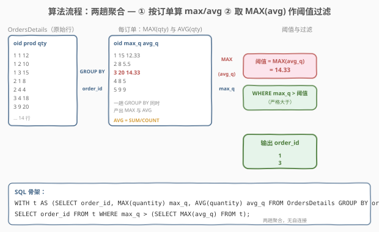
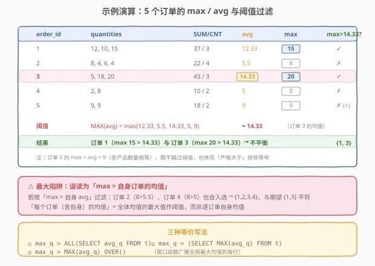

# LeetCode 最大数量高于平均水平的订单 题解

## 1. 题目概述

- **标题 / 题号**：最大数量高于平均水平的订单（#1867，medium）
- **链接**：https://leetcode.cn/problems/orders-with-maximum-quantity-above-average/
- **难度**：中等
- **标签**：数据库、SQL、`GROUP BY`、聚合函数 `MAX`/`AVG`、子查询、`ALL` 量词、窗口函数 `MAX() OVER()`、两趟聚合、LeetCode 锁题

**题意**：给定电商订单明细表 `OrdersDetails`，每个订单由多行表示（每个产品一行）。编写 SQL 查询，找出所有**不平衡订单**（imbalanced orders）的 `order_id`。所谓**不平衡订单**，是指该订单的**最大订购数量**（订单内任一产品的最高 `quantity`）**严格大于每个订单（包括自身）的平均数量**。

> 💡 **平均数量**的定义：`(订单内所有产品数量之和) / (订单内不同产品数)`，即 `AVG(quantity)`。**最大数量**即 `MAX(quantity)`。注意比较对象是「**每个订单**的均值」——并非该订单自身的均值。

**表结构**：

```text
Table: OrdersDetails
+-------------+------+
| Column Name | Type |
+-------------+------+
| order_id    | int  |
| product_id  | int  |
| quantity    | int  |
+-------------+------+
(order_id, product_id) 是该表的主键（联合唯一）。
单个订单由多行表示，订单中每个产品对应一行。
每行包含 order_id 订单中 product_id 产品的订购数量。
```

**输出列**：`order_id`，可按任意顺序返回。

**示例 1**：

```text
输入：
OrdersDetails 表:
+----------+------------+----------+
| order_id | product_id | quantity |
+----------+------------+----------+
| 1        | 1          | 12       |
| 1        | 2          | 10       |
| 1        | 3          | 15       |
| 2        | 1          | 8        |
| 2        | 4          | 4        |
| 2        | 5          | 6        |
| 3        | 3          | 5        |
| 3        | 4          | 18       |
| 4        | 5          | 2        |
| 4        | 6          | 8        |
| 5        | 7          | 9        |
| 5        | 8          | 9        |
| 3        | 9          | 20       |
| 2        | 9          | 4        |
+----------+------------+----------+

输出：
+----------+
| order_id |
+----------+
| 1        |
| 3        |
+----------+
```

**解释**：

| order_id | quantities | sum/cnt | avg | max | 不平衡? |
|----------|------------|---------|-----|-----|---------|
| 1 | 12, 10, 15 | 37 / 3 | 12.33 | 15 | ✓（15 > 14.33） |
| 2 | 8, 4, 6, 4 | 22 / 4 | 5.5 | 8 | ✗（8 ≤ 14.33） |
| 3 | 5, 18, 20 | 43 / 3 | 14.33 | 20 | ✓（20 > 14.33） |
| 4 | 2, 8 | 10 / 2 | 5 | 8 | ✗（8 ≤ 14.33） |
| 5 | 9, 9 | 18 / 2 | 9 | 9 | ✗（9 ≤ 14.33） |

阈值 = `MAX(各订单均值) = 14.33`（订单 3 的均值）。订单 1（max 15）与订单 3（max 20）的最大数量越过该阈值，故为不平衡订单。

**约束**：

- `(order_id, product_id)` 是 `OrdersDetails` 表的主键
- 结果可按任意顺序返回
- 该题为 LeetCode Plus 会员专享题 🔒

> ⚠️ **最大陷阱**：把「每个订单（含自身）的均值」误读为「该订单自身的均值」。若按 `max > 自身 avg` 过滤，订单 2（8 > 5.5）、订单 4（8 > 5）也会入选，得到 `{1,2,3,4}`，与期望 `{1,3}` 不符。详见 2.2 节。

> 💡 本题是 SQL **"两趟聚合 + 全局阈值过滤"招牌题**——核心套路：① `GROUP BY order_id` 在一趟里同时算出每订单的 `MAX(quantity)` 与 `AVG(quantity)`；② 取所有订单均值的最大值 `MAX(avg)` 作为**单一标量阈值**；③ 筛出 `max > 阈值` 的订单。难点全在**正确解读比较对象**——「每个订单的均值」是全体均值的最大值，而非逐订单自身均值。

## 2. 解题思路

### 2.1 暴力思路：逐订单比较

最直觉的过程式思路：对每个订单，统计其最大数量；再遍历所有订单算出各自的均值；最后判断「该订单的最大数量是否严格大于每个订单的均值」。

```text
for each order o:
    max_q[o] = max(quantity where order_id == o)
    avg_q[o] = sum(quantity) / count(products) where order_id == o
threshold = max(avg_q)              # 每个订单均值的最大值
for each order o:
    if max_q[o] > threshold:        # 严格大于阈值
        result.append(o)
```

但**纯 SQL 没有显式逐行循环**——「按订单分组算两个指标」对应 `GROUP BY` 聚合，「取所有均值的最大值」对应一次 `MAX` 聚合。关键洞察是：**「大于每个订单的均值」可归约为「大于这些均值的最大值」**——一个全称量词（∀）坍缩成一个标量阈值。

### 2.2 核心观察：∀ 坍缩为 MAX —— 「每个订单的均值」= 全体均值的最大值



**问题拆解为两步**：

1. **每订单聚合（一趟 `GROUP BY`）**：对每个 `order_id` 同时计算 `MAX(quantity)` 与 `AVG(quantity)`。`GROUP BY` 把明细行折叠成「订单 → (max, avg)」的小表，每订单一行。`AVG` 与 `MAX` 同属聚合函数，可写在同一个 `SELECT` 中，无需两次扫描。

2. **全局阈值 + 过滤**：「严格大于每个订单（含自身）的均值」等价于「严格大于这些均值的最大值」。因为要**同时**大于所有均值，只需大于其中最大的那个。于是阈值 = `MAX(avg)`，一个标量；再 `WHERE max > 阈值` 过滤即得结果。

> 💡 **为什么 ∀ 可以坍缩为 MAX？** 数学上，$x > a_i\ \forall i \iff x > \max_i a_i$。比较「是否大于集合中每一个元素」与「是否大于该集合的最大值」是等价命题（前提集合非空）。本题每个订单至少有一个产品（出现在 `OrdersDetails` 即非空），均值集合非空，故坍缩成立。SQL 里有三种等价表达：`> ALL(S)`、`> (SELECT MAX(*) FROM S)`、`> MAX(*) OVER()`（窗口广播）。

> ⚠️ **最大陷阱：误读比较对象**。题干「strictly greater than the average quantity of every order (including itself)」中的 "every order" 指的是**全体订单的均值集合**，不是「该订单自身的均值」。若误按 `max > avg`（自身均值）过滤，会误选订单 2、4——它们的 max 确实大于自身均值，但并未越过「全体均值的最大值 14.33」这道门槛。下表演示两种解读的差异：

| order_id | max | 自身 avg | 全体 MAX(avg)=14.33 | `max > 自身 avg`? | `max > 全体 MAX(avg)`? |
|----------|-----|----------|---------------------|-------------------|------------------------|
| 1 | 15 | 12.33 | 14.33 | ✓ | ✓ |
| 2 | 8 | 5.5 | 14.33 | ✓（误选） | ✗ |
| 3 | 20 | 14.33 | 14.33 | ✓ | ✓ |
| 4 | 8 | 5 | 14.33 | ✓（误选） | ✗ |
| 5 | 9 | 9 | 14.33 | ✗（=） | ✗ |

> ⚠️ **「严格大于」与等号**：题目要求 *strictly greater*，用 `>` 而非 `>=`。订单 5 的 `max = avg = 9`（各产品数量相等），恰好不越过任何阈值——既不大于自身均值（等号），更不大于全体均值的最大值。若题目改为「不低于」则需用 `>=` 并重新审视边界。

### 2.3 算法流程图



**逻辑执行步骤**：

| 步骤 | 子句 | 作用 |
|------|------|------|
| ① | `FROM OrdersDetails` | 读取全部明细行 |
| ② | `GROUP BY order_id` + `MAX(quantity)` + `AVG(quantity)` | 一趟折叠为「订单 → (max, avg)」表 |
| ③ | `(SELECT MAX(avg_q) FROM t)` 或 `MAX(avg_q) OVER()` | 取全体均值的最大值作标量阈值 |
| ④ | `WHERE max_q > 阈值` | 过滤保留最大数量越过阈值的订单 |

> 💡 **SQL 子句执行顺序**：`FROM` → `WHERE` → `GROUP BY` → `HAVING` → `SELECT`（含聚合与窗口函数）→ `ORDER BY` → `LIMIT`。步骤 ② 的 `MAX`/`AVG` 在 `GROUP BY` 后的 `SELECT` 阶段对每分组求值；步骤 ③ 的全局 `MAX(avg_q)` 是对**聚合结果**再聚合——必须用 CTE/子查询把第一次聚合的结果物化，外层再 `MAX`。两趟聚合天然分两层查询。

### 2.4 示例演算



以示例 1 数据为例，逐步演算「`GROUP BY` 聚合 → 取 `MAX(avg)` → 过滤」：

**步骤 ①②：GROUP BY + MAX/AVG 一趟聚合**

| order_id | quantities | SUM | CNT | avg = SUM/CNT | max |
|----------|------------|-----|-----|---------------|-----|
| 1 | 12, 10, 15 | 37 | 3 | 12.33 | 15 |
| 2 | 8, 4, 6, 4 | 22 | 4 | 5.5 | 8 |
| 3 | 5, 18, 20 | 43 | 3 | 14.33 | 20 |
| 4 | 2, 8 | 10 | 2 | 5 | 8 |
| 5 | 9, 9 | 18 | 2 | 9 | 9 |

> 💡 **`AVG(quantity)` 即 `SUM/COUNT`**：`(order_id, product_id)` 是主键 ⇒ 每订单每个产品只出现一行 ⇒ `COUNT(*)` = 不同产品数。故 `AVG(quantity) = SUM(quantity)/COUNT(*)`，与题干定义完全一致。直接用 `AVG(quantity)` 比手写 `SUM/COUNT` 更简洁，且避免整数除法歧义。

**步骤 ③：取 MAX(avg) 作阈值**

$$\text{阈值} = \max(12.33,\ 5.5,\ 14.33,\ 5,\ 9) = 14.33$$

即订单 3 的均值——它是全体订单均值中最大的那个。

**步骤 ④：过滤 max > 阈值**

| order_id | max | > 14.33? | 保留 |
|----------|-----|----------|------|
| 1 | 15 | ✓ | ✓ |
| 2 | 8 | ✗ | ✗ |
| 3 | 20 | ✓ | ✓ |
| 4 | 8 | ✗ | ✗ |
| 5 | 9 | ✗ | ✗ |

最终输出 `{1, 3}`，与期望一致。

> 💡 **订单 5 为何不入选？** 它的 `max = avg = 9`——两个产品数量相等，最大值等于均值。9 < 14.33，远未越过阈值。即便阈值更低，「严格大于」也排除了等号情形（`9 > 9` 为假）。这是「各产品数量相等 ⇒ max = avg ⇒ 永非不平衡」的体现。

## 3. 参考代码

### SQL（解法 A：`> ALL` 量词，语义最贴题）

```sql
WITH t AS (
    SELECT order_id,
           MAX(quantity) AS max_quantity,
           AVG(quantity)  AS avg_quantity
    FROM OrdersDetails
    GROUP BY order_id
)
SELECT order_id
FROM t
WHERE max_quantity > ALL (SELECT avg_quantity FROM t);
```

> 💡 **写法要点**：
> - **`> ALL(S)`**：意为「严格大于子查询结果中的**每一个**值」。这恰好直译题干「strictly greater than the average quantity of every order (including itself)」——`ALL` 量词天然表达「每一个」。子查询包含全体订单均值（含自身，因 `t` 未排除任何订单），与「including itself」吻合。
> - **等价于 `> MAX(S)`**：数学上 $x > \forall a_i \iff x > \max a_i$（集合非空时）。`ALL` 写法的可读性最佳，优化器通常将其改写为与 `MAX` 子查询相同的执行计划。
> - **`AVG(quantity)`**：直接对应题干「(总数量)/(不同产品数)」，因 `(order_id, product_id)` 主键保证 `COUNT = 不同产品数`。
> - ✓ **最推荐**：语义自文档化、与题干一一对应，面试讲解时最易说清「大于每个订单均值」的本意。

### SQL（解法 B：`MAX` 子查询，最通用）

```sql
WITH t AS (
    SELECT order_id,
           MAX(quantity) AS max_quantity,
           AVG(quantity)  AS avg_quantity
    FROM OrdersDetails
    GROUP BY order_id
)
SELECT order_id
FROM t
WHERE max_quantity > (SELECT MAX(avg_quantity) FROM t);
```

> 💡 **解法 B 的思路**：子查询 `SELECT MAX(avg_quantity) FROM t` 把「全体订单均值的最大值」物化为一个标量阈值，外层 `WHERE max_quantity > 阈值` 过滤。与解法 A 在逻辑上完全等价——`> ALL(S)` 与 `> (SELECT MAX(*) FROM S)` 是同一命题的两种写法。
>
> **与解法 A 的区别**：`MAX` 子查询更「过程式」——显式地分两步「先取最大值，再比较」，便于执行计划理解；`ALL` 量词更「声明式」——直译题意。两者性能相当（MySQL/PostgreSQL 优化器将 `> ALL` 改写为 `> MAX`）。生产环境二选一皆可，团队风格统一即可。
>
> ⚠️ **`t` 被引用两次**：MySQL 8.0+ 的 CTE 可被多次引用且只物化一次；MySQL 5.7 不支持 CTE，需把 `t` 写成派生表 `FROM (SELECT ... GROUP BY ...) t` 重复两遍，或用临时表。

### SQL（解法 C：窗口函数 `MAX() OVER()` 广播阈值）

```sql
WITH t AS (
    SELECT order_id,
           MAX(quantity) AS max_quantity,
           AVG(quantity)  AS avg_quantity
    FROM OrdersDetails
    GROUP BY order_id
)
SELECT order_id
FROM (
    SELECT order_id, max_quantity,
           MAX(avg_quantity) OVER () AS max_avg
    FROM t
) x
WHERE max_quantity > max_avg;
```

> 💡 **解法 C 的思路**：`MAX(avg_quantity) OVER ()`（空 `PARTITION BY`）把「全体均值的最大值」作为一列**广播到每一行**，外层 `WHERE max_quantity > max_avg` 过滤。无需标量子查询，一次 `SELECT` 内同时拿到行级 `max_quantity` 与全局 `max_avg`。
>
> **与解法 B 的对照**：解法 B 用标量子查询算阈值（每次求值一次），解法 C 用窗口函数广播阈值（每行都带一份）。结果等价，执行计划也常被优化为相同的聚合 + 过滤。窗口写法在「阈值还要参与其他行级计算」时更顺手（本题仅用于过滤，故优势不明显）。
>
> ⚠️ **窗口函数必须包在外层**：`MAX(avg_quantity) OVER ()` 作用于 `t`（已聚合的表），不能再与产生 `avg_quantity` 的 `GROUP BY` 写在同一层——`GROUP BY` 后的 `SELECT` 中窗口函数与聚合函数混用时，窗口函数的 `OVER()` 作用域是「分组后的结果集」。把它放在外层子查询 `x` 中最清晰。

### SQL（解法 D：单语句无 CTE，派生表 + `HAVING`）

```sql
SELECT order_id
FROM OrdersDetails
GROUP BY order_id
HAVING MAX(quantity) > (
    SELECT MAX(avg_quantity)
    FROM (
        SELECT AVG(quantity) AS avg_quantity
        FROM OrdersDetails
        GROUP BY order_id
    ) s
);
```

> 💡 **解法 D 的思路**：不依赖 CTE，全部用派生表（嵌套子查询）。外层 `GROUP BY order_id` + `HAVING MAX(quantity) > 阈值` 直接过滤；内层派生表 `s` 先算出每订单均值，再 `MAX` 取阈值。
>
> **适用场景**：MySQL 5.7 等不支持 CTE 的旧版本。代价是 `OrdersDetails` 被扫描两遍（外层 + 内层派生表），性能略逊于 CTE 物化一次的写法。`HAVING` 用于「对聚合结果过滤」（`MAX(quantity)` 是聚合值，不能用 `WHERE`）。

### Python（pandas）

```python
import pandas as pd

def orders_with_max_quantity_above_average(orders_details: pd.DataFrame) -> pd.DataFrame:
    g = (
        orders_details.groupby("order_id")["quantity"]
        .agg(["max", "mean"])
        .reset_index()
    )
    g.columns = ["order_id", "max_quantity", "avg_quantity"]
    threshold = g["avg_quantity"].max()
    return g.loc[g["max_quantity"] > threshold, ["order_id"]]
```

> 💡 **pandas 对照**：
> - `groupby("order_id")["quantity"].agg(["max", "mean"])` 对应 `GROUP BY order_id` + `MAX`/`AVG`——一趟分组同时算两个聚合指标。pandas 的 `mean()` 即 `SUM/COUNT`，与 SQL `AVG` 一致。
> - `g["avg_quantity"].max()` 对应 `SELECT MAX(avg_quantity) FROM t`——取全体均值的最大值作阈值。
> - `g["max_quantity"] > threshold` 对应 `WHERE max_quantity > 阈值`——布尔索引过滤，严格大于。
> - 若想对照解法 C 的窗口写法：`g["max_avg"] = g["avg_quantity"].transform("max")` 把全局最大值广播回每行，再 `g[g["max_quantity"] > g["max_avg"]]`。

## 4. 复杂度分析

| 维度 | 解法 A（`ALL`） | 解法 B（`MAX` 子查询） | 解法 C（窗口） | 解法 D（派生表） | pandas |
|------|-----------------|------------------------|----------------|------------------|--------|
| **时间** | $O(n)$ | $O(n)$ | $O(n)$ | $O(n)$（扫描两遍） | $O(n)$ |
| **空间** | $O(m)$ | $O(m)$ | $O(m)$ | $O(m)$ | $O(m)$ |
| **是否依赖 CTE** | 是 | 是 | 是 | 否 | — |
| **是否依赖窗口函数** | 否 | 否 | 是 | 否 | 否（`transform`） |
| **推荐度** | ✓ **首选** | ✓ 通用 | ✓ 对照 | ✓ 旧版本 | ✓ 验证用 |

> - $n$ = `OrdersDetails` 表行数，$m$ = 不同订单数（$m \le n$）
> - **时间**：解法 A/B/C 的第一趟 `GROUP BY` 聚合扫描一次 $O(n)$，哈希聚合得到 $m$ 行；第二趟取 `MAX(avg)` 为 $O(m)$，过滤 $O(m)$。总体 $O(n)$ 主导。解法 D 把 `OrdersDetails` 扫描两遍（外层 + 内层派生表），常数更大但仍 $O(n)$。
> - **空间**：CTE/派生表需 $O(m)$ 存储每订单的 `(max, avg)`；窗口函数广播阈值额外 $O(m)$。
> - **索引优化**：在 `OrdersDetails(order_id)` 上建索引可让 `GROUP BY order_id` 走索引有序聚合；但本题数据量小，索引收益有限。
> - **`ALL` vs `MAX` 性能**：MySQL 8.0+ 与 PostgreSQL 优化器将 `> ALL(S)` 改写为 `> (SELECT MAX(*) FROM S)`，两者执行计划相同，性能无差异。选哪个看可读性。

## 5. 扩展：`ALL` 量词与 `MAX` 的等价性 + NULL 语义

### 5.1 `> ALL(S)` ⟺ `> MAX(S)` 的严格证明

**命题**：设 $S$ 为非空有限实数集，$x$ 为实数。则 $x > a\ \forall a \in S \iff x > \max S$。

**证明**：

- （$\Rightarrow$）若 $x > a\ \forall a \in S$，而 $\max S \in S$（有限集最大值必在集合中），故 $x > \max S$。
- （$\Leftarrow$）若 $x > \max S$，因 $\forall a \in S,\ a \le \max S < x$，故 $x > a\ \forall a$。

> 💡 **SQL 落地**：这正是 `> ALL(SELECT ...)` 与 `> (SELECT MAX(...) FROM ...)` 等价的数学根基。两种写法只是同一命题的不同语法糖。本题 `t` 非空（每个订单都至少一行），故等价成立。

### 5.2 NULL 语义：`ALL` 的陷阱

`ALL` 与 `MAX` 在**含 NULL** 时行为分叉：

- `x > ALL(S)`：若 $S$ 中含 `NULL`，则 `x > NULL` 为 `UNKNOWN`，`ALL` 对 `UNKNOWN` 的判定按三值逻辑——只要有一个 `UNKNOWN` 且无 `FALSE`，结果为 `UNKNOWN`（被 `WHERE` 视为不满足）。等价于「`NULL` 让该行被过滤」。
- `x > (SELECT MAX(...) FROM S)`：`MAX` 聚合**忽略 NULL**，返回非 NULL 最大值。若无任何非 NULL 值，`MAX` 返回 `NULL`，则 `x > NULL` 为 `UNKNOWN`，同样被过滤。

> ⚠️ **本题无 NULL 风险**：`AVG(quantity)` 对每订单（至少一行、`quantity` 非空）必返回非 NULL 均值，故 `t.avg_quantity` 列无 NULL，`ALL` 与 `MAX` 行为一致。但**若题目允许 `quantity` 为 NULL**，`AVG` 会忽略 NULL 行（分母仍按非 NULL 行计数），需额外定义「NULL 行是否算一个产品」。生产场景遇到含 NULL 的聚合需谨慎选 `ALL` 或 `MAX`，二者在 NULL 边界可能给出不同结果。

### 5.3 三种「全局阈值」写法对照

| 写法 | 语义 | 可读性 | NULL 行为 |
|------|------|--------|-----------|
| `max_q > ALL(SELECT avg_q FROM t)` | 大于每个均值 | ★★★（直译题意） | 含 NULL → UNKNOWN |
| `max_q > (SELECT MAX(avg_q) FROM t)` | 大于均值之最大 | ★★（过程式） | MAX 忽略 NULL |
| `max_q > MAX(avg_q) OVER()` | 窗口广播阈值 | ★★（行级带阈值） | MAX 忽略 NULL |

### 5.4 若改为「max 高于全体订单均值的平均」会怎样？

若题干改为「max 严格大于全体订单均值的**平均**」（即阈值 = `AVG(avg)` 而非 `MAX(avg)`），则是一个**不同**的问题——「高于均值之均值」而非「高于每个均值」。此时阈值 $= \frac{12.33+5.5+14.33+5+9}{5} = 9.23$，max > 9.23 的订单为 `{1, 3}`（恰好本题数据下结果相同，但语义与数据规模大时可能分叉）。辨析：题干用 "every order"（全称量词 ∀）⇒ `MAX`；若用 "the average across orders"（聚合量词）⇒ `AVG`。读题时区分「每一个」与「平均的」是关键。

## 6. 面试要点

1. **「每个订单（含自身）的均值」为何等价于「全体均值的最大值」作阈值？**

   > 题干要求 max 严格大于**每一个**订单的均值。要同时大于集合中所有元素，等价于大于该集合的最大值（$x > a\ \forall a \in S \iff x > \max S$，集合非空时成立）。「含自身」只是强调比较集合包含该订单自身的均值，不剔除任何订单——`MAX` 自然包含全体。故阈值 = `MAX(avg)`，一个标量。

2. **为什么不能按 `max > 自身 avg` 过滤？**

   > 那是误读比较对象。「max > 自身 avg」只要求最大数量超过**本订单**的均值，而 `max ≥ avg` 恒成立（最大值不小于均值），等号仅在所有数量相等时取到——这意味着几乎所有「数量不均」的订单都入选。本题期望 `{1,3}`，而 `max > 自身 avg` 会给出 `{1,2,3,4}`（订单 2、4 误入）。正确比较对象是**全体订单均值的最大值**，远比自身均值严格。

3. **`> ALL` 与 `> (SELECT MAX)` 有何区别？**

   > 逻辑等价（非空集合下 $x > \forall a \iff x > \max a$），执行计划也常被优化器改写为相同。区别在可读性：`ALL` 直译「大于每一个」，声明式；`MAX` 子查询分两步「先取最大再比」，过程式。NULL 边界有细微分叉——`ALL` 遇 NULL 产生 UNKNOWN，`MAX` 忽略 NULL。本题无 NULL，两者完全一致。

4. **为什么用 `AVG(quantity)` 而非 `SUM(quantity)/COUNT(*)`？**

   > 二者等价：`(order_id, product_id)` 是主键 ⇒ 每订单每个产品只一行 ⇒ `COUNT(*)` = 不同产品数 ⇒ `AVG = SUM/COUNT`，与题干定义吻合。`AVG` 更简洁且避免整数除法歧义（某些 SQL 方言中 `int/int` 截断为整数，如 PostgreSQL `5/2=2`；MySQL 的 `/` 是浮点除法 `5/2=2.5`，故 `SUM/COUNT` 在 MySQL 也正确，但跨方言用 `AVG` 更安全）。

5. **「严格大于」与 `>=` 在本题有何影响？**

   > 题干用 *strictly greater*，必须用 `>`。订单 5 的 `max = avg = 9`（两产品数量相等），若用 `>=` 且阈值恰好为 9 会误选——但本题阈值 14.33 远大于 9，故订单 5 无论用 `>` 还是 `>=` 都不入选。真正的影响在边界：若某订单的 max 恰好等于 `MAX(avg)`（如均值最大者自身 max 等于其 avg——即该订单所有数量相等），`>` 排除而 `>=` 保留。严格大于排除了「均值最高且数量均匀」的退化情形。

> 💡 **一句话总结**：1867 是 SQL **"两趟聚合 + 全局阈值过滤"招牌题**——核心模板「`GROUP BY order_id` 一趟算 `MAX`/`AVG` → 取 `MAX(avg)` 作标量阈值 → `WHERE max > 阈值`」。最大要点：**正确解读「每个订单的均值」= 全体均值的最大值（∀ 坍缩为 MAX），非逐订单自身均值**；`> ALL`、`> (SELECT MAX)`、`> MAX() OVER()` 三写法等价；严格大于用 `>`。与「组内最值」类题（184/1571）共享聚合骨架，但本题独特在「阈值为聚合结果的聚合」两层结构。

## 同类练习题

| # | 题目 | 与本题的关联 |
|---|------|-------------|
| 1571 | [仓库经理 🔒](https://leetcode.cn/problems/warehouse-manager/)（[站内题解](../1501-1600/1571_仓库经理.md)） | `GROUP BY` + `SUM` 行级表达式聚合入门招牌题，同属「按维度聚合」骨架，对照本题「一趟 `GROUP BY` 同时算两个指标」 |
| 1211 | [查询结果的质量和占比](https://leetcode.cn/problems/queries-quality-and-percentage/)（[站内题解](../1201-1300/1211_查询结果的质量和占比.md)） | `GROUP BY` + 两个 `AVG` 聚合（数值均值 + 布尔比例），与本题「分组算 `MAX`/`AVG` 双指标」同构 |
| 184 | [部门工资最高的员工](https://leetcode.cn/problems/department-highest-salary/)（[站内题解](../0101-0200/184_部门工资最高的员工.md)） | Top-1 per group 入门题，组内最值比较，对照本题「`max` 越过全局阈值」的过滤思路 |
| 550 | [游戏玩法分析 IV](https://leetcode.cn/problems/game-play-analysis-iv/)（[站内题解](../0501-0600/550_游戏玩法分析IV.md)） | 两阶段聚合——先算每玩家首次登录日，再算「次日登录玩家占比」，共享「先按主体聚合属性、再全局聚合」的两层结构 |
| 1174 | [即时食物配送 II 🔒](https://leetcode.cn/problems/immediate-food-delivery-ii/)（[站内题解](../1101-1200/1174_即时食物配送II.md)） | 首次订单判定 + 比例聚合，同属「`GROUP BY` 取组内最值 + 全局聚合」两趟骨架，对照本题阈值过滤 |
