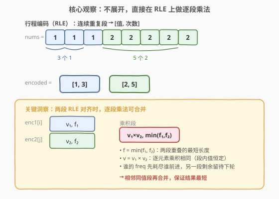
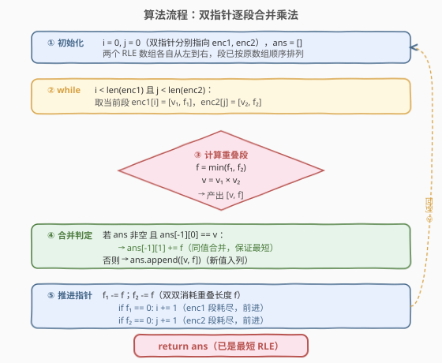

# LeetCode 两个行程编码数组的积 题解

## 1. 题目概述

- **标题 / 题号**：两个行程编码数组的积（#1868，medium）
- **链接**：https://leetcode.cn/problems/product-of-two-run-length-encoded-arrays/
- **难度**：中等
- **标签**：数组、双指针、模拟

**题意**：**行程编码（Run-length encoding, RLE）** 是一种压缩算法，能让一个含有许多段**连续重复**数字的整数数组 `nums` 以一个（通常更小的）二维数组 `encoded` 表示。每个 `encoded[i] = [val_i, freq_i]` 表示 `nums` 中第 $i$ 段重复数字，其中 `val_i` 是该段重复数字，重复了 `freq_i` 次。

例如，`nums = [1,1,1,2,2,2,2,2]` 可表示为行程编码数组 `encoded = [[1,3],[2,5]]`——读作"三个 1，后面有五个 2"。

两个行程编码数组 `encoded1` 和 `encoded2` 的积按下列步骤计算：

1. 将 `encoded1` 和 `encoded2` 分别**扩展**成完整数组 `nums1` 和 `nums2`。
2. 创建新数组 `prodNums`，长度为 `nums1.length`，设 $\text{prodNums}[i] = \text{nums1}[i] \times \text{nums2}[i]$。
3. 将 `prodNums` **压缩**成行程编码数组并返回。

> 💡 **本质**：对两个等长的展开数组做**逐元素乘法**，再把乘积结果压缩回 RLE。关键在于——不必真正展开，可以直接在 RLE 段上模拟。

**示例 1**：

```text
输入：encoded1 = [[1,3],[2,3]], encoded2 = [[6,3],[3,3]]
输出：[[6,6]]
解释：encoded1 扩展为 [1,1,1,2,2,2]，encoded2 扩展为 [6,6,6,3,3,3]。
      prodNums = [6,6,6,6,6,6]，压缩成 [[6,6]]。
```

**示例 2**：

```text
输入：encoded1 = [[1,3],[2,1],[3,2]], encoded2 = [[2,3],[3,3]]
输出：[[2,3],[6,1],[9,2]]
解释：encoded1 扩展为 [1,1,1,2,3,3]，encoded2 扩展为 [2,2,2,3,3,3]。
      prodNums = [2,2,2,6,9,9]，压缩成 [[2,3],[6,1],[9,2]]。
```

**约束**：

- $1 \le \text{encoded1.length}, \text{encoded2.length} \le 10^5$
- $\text{encoded1}[i].\text{length} == 2$，$\text{encoded2}[j].\text{length} == 2$
- 对每一个 `encoded1[i]`，$1 \le \text{val}_i, \text{freq}_i \le 10^4$
- 对每一个 `encoded2[j]`，$1 \le \text{val}_j, \text{freq}_j \le 10^4$
- `encoded1` 和 `encoded2` 表示的完整数组长度相同。

## 2. 解题思路

### 2.1 暴力思路

最直观的做法是按题面三步走：先把两个 RLE 数组各自**展开**为完整数组 `nums1`、`nums2`，逐元素相乘得到 `prodNums`，再扫描 `prodNums` 把连续相同值压缩成 RLE 段。

问题在于——完整数组长度可达 $10^5 \times 10^4 = 10^9$（每段 freq 最大 $10^4$，最多 $10^5$ 段），展开后内存与时间都爆炸。暴力展开不可行。

> 💡 **突破口**：展开后的数组是**分段恒定**的——`nums1` 在某段内全是 `val_i`，`nums2` 在某段内全是 `val_j`，因此两段重叠区间的乘积全是同一个值 `val_i × val_j`。完全可以**在 RLE 层面**直接做逐段乘法，跳过展开步骤。

### 2.2 核心观察：在 RLE 上做逐段乘法（双指针合并）



关键洞察：RLE 的每段 `[val, freq]` 表示 `freq` 个连续相同的 `val`。当 `enc1[i] = [v₁, f₁]` 与 `enc2[j] = [v₂, f₂]` 当前段对齐时：

- **重叠长度** $f = \min(f_1, f_2)$：两段重叠区域的最短长度。乘积在这个区域内的 $f$ 个位置上全部等于 $v_1 \times v_2$。
- **乘积值** $v = v_1 \times v_2$：段内值恒定，逐元素乘积自然相同。
- **消耗与推进**：两段的 freq 各减去 $f$，谁的 freq 先归零谁前进到下一段，另一段保留剩余 freq 等待下轮对齐。

> ⚠️ **同值合并**：相邻两次产出的乘积值 $v$ 可能相同（例如示例 1 中 `[1,3]×[6,3]` 和 `[2,3]×[3,3]` 都得到 6），必须合并为同一段，否则结果不是**最短**的 RLE。合并方法：若 `ans` 最后一段的值等于当前 $v$，就把 $f$ 累加到该段的 freq 上；否则新开一段。

### 2.3 算法流程图



算法用双指针 $i$、$j$ 分别扫描 `enc1`、`enc2`，模拟"展开后逐元素相乘再压缩"的过程：

1. **初始化**：$i = 0$，$j = 0$，`ans = []`。
2. **循环**（$i < m$ 且 $j < n$）：
   - 取 `enc1[i] = [v₁, f₁]`，`enc2[j] = [v₂, f₂]`。
   - $f = \min(f_1, f_2)$，$v = v_1 \times v_2$。
   - 若 `ans` 非空且 `ans[-1][0] == v`：`ans[-1][1] += f`（同值合并）。
   - 否则：`ans.append([v, f])`（新值入列）。
   - $f_1 \mathrel{-}= f$，$f_2 \mathrel{-}= f$；若 $f_1 = 0$ 则 $i\mathrel{+}= 1$，若 $f_2 = 0$ 则 $j\mathrel{+}= 1$。
3. **返回** `ans`（已是最短 RLE）。

> 💡 **为什么循环必然终止**：每轮至少消耗 $f \ge 1$ 的 freq，两数组总 freq 相等且有限，故 $i$ 与 $j$ 最终同时到达末尾。

### 2.4 示例演算

![示例演算：enc1=[[1,3],[2,1],[3,2]], enc2=[[2,3],[3,3]]](../images/1868_example_walkthrough.svg)

以示例 2 为例，逐步执行（等价于展开后 $[1,1,1,2,3,3] \times [2,2,2,3,3,3] = [2,2,2,6,9,9]$）：

| 步 | enc1[i] | enc2[j] | $f$ | $v=v_1 \times v_2$ | ans 操作 |
|----|---------|---------|-----|---------------------|----------|
| 1 | [1, 3] | [2, 3] | 3 | $1 \times 2 = 2$ | 追加 [2, 3] |
| 2 | [2, 1] | [3, 3] | 1 | $2 \times 3 = 6$ | 追加 [6, 1] |
| 3 | [3, 2] | [3, 2] | 2 | $3 \times 3 = 9$ | 追加 [9, 2] |

- **步骤 1**：`min(3, 3) = 3`，乘积 $1 \times 2 = 2$，产出 `[2, 3]`。两段 freq 同时归零，$i$、$j$ 均前进。
- **步骤 2**：`enc1[1]=[2,1]`，`enc2[1]=[3,3]`。`min(1, 3) = 1`，乘积 $2 \times 3 = 6$，产出 `[6, 1]`。`enc1` 段耗尽 $i$ 前进，`enc2` 段剩 freq 2。
- **步骤 3**：`enc1[2]=[3,2]`，`enc2[1]=[3,2]`（剩余）。`min(2, 2) = 2`，乘积 $3 \times 3 = 9$，产出 `[9, 2]`。两段同时耗尽，$i$、$j$ 均前进，循环结束。

最终 `ans = [[2,3],[6,1],[9,2]]`，与展开后 `[2,2,2,6,9,9]` 压缩结果一致 ✓。

> 💡 **本例无同值合并**：三步产出的值 $2, 6, 9$ 互不相同，无需合并。对照示例 1：两步产出均为 $6$，合并为 `[6, 6]`。

## 3. 参考代码

### C++

```cpp
class Solution {
  public:
    vector<vector<int>> findRLEArray(vector<vector<int>>& encoded1,
                                     vector<vector<int>>& encoded2) {
        vector<vector<int>> ans;
        int i = 0, j = 0;
        int m = encoded1.size(), n = encoded2.size();
        while (i < m && j < n) {
            int v1 = encoded1[i][0], f1 = encoded1[i][1];
            int v2 = encoded2[j][0], f2 = encoded2[j][1];
            int f = min(f1, f2);
            int v = v1 * v2;
            if (!ans.empty() && ans.back()[0] == v) {
                ans.back()[1] += f;          // 同值合并
            } else {
                ans.push_back({v, f});       // 新值入列
            }
            encoded1[i][1] -= f;             // 消耗 freq
            encoded2[j][1] -= f;
            if (encoded1[i][1] == 0) ++i;    // 段耗尽则前进
            if (encoded2[j][1] == 0) ++j;
        }
        return ans;
    }
};
```

### Python

```python
class Solution:
    def findRLEArray(
        self, encoded1: List[List[int]], encoded2: List[List[int]]
    ) -> List[List[int]]:
        ans = []
        i = j = 0
        m, n = len(encoded1), len(encoded2)
        while i < m and j < n:
            v1, f1 = encoded1[i]
            v2, f2 = encoded2[j]
            f = min(f1, f2)
            v = v1 * v2
            if ans and ans[-1][0] == v:
                ans[-1][1] += f               # 同值合并
            else:
                ans.append([v, f])            # 新值入列
            encoded1[i][1] -= f               # 消耗 freq
            encoded2[j][1] -= f
            if encoded1[i][1] == 0:
                i += 1                        # 段耗尽则前进
            if encoded2[j][1] == 0:
                j += 1
        return ans
```

> 💡 **原地修改 freq**：上述代码直接在 `encoded1`、`encoded2` 上修改 freq。若需保留原数组，可改用局部变量 `f1`、`f2` 配合"剩余 freq"逻辑——当某段未耗尽时，下一轮继续用该段的原始值与剩余 freq。

### Python（不修改原数组版）

```python
class Solution:
    def findRLEArray(
        self, encoded1: List[List[int]], encoded2: List[List[int]]
    ) -> List[List[int]]:
        ans = []
        i = j = 0
        m, n = len(encoded1), len(encoded2)
        f1 = f2 = 0  # 当前段剩余 freq
        v1 = v2 = 0
        while i < m or j < n:
            if f1 == 0 and i < m:
                v1, f1 = encoded1[i]
                i += 1
            if f2 == 0 and j < n:
                v2, f2 = encoded2[j]
                j += 1
            f = min(f1, f2)
            v = v1 * v2
            if ans and ans[-1][0] == v:
                ans[-1][1] += f
            else:
                ans.append([v, f])
            f1 -= f
            f2 -= f
        return ans
```

## 4. 复杂度分析

| 维度 | 复杂度 | 说明 |
|------|--------|------|
| 时间复杂度 | $O(m + n)$ | 每轮至少消耗一个段的 freq，$i$、$j$ 各最多前进 $m$、$n$ 步，合并判定 $O(1)$ |
| 空间复杂度 | $O(1)$（不含答案） | 仅双指针与若干临时变量；答案数组 $O(m + n)$ 是输出必需 |

> 💡 **为什么是 $O(m+n)$ 而非 $O(m \times n)$**：虽然有两层 `while`，但内层不是对 `enc2` 全扫描——每轮 $f \ge 1$，`enc2[j]` 的 freq 单调递减，$j$ 只前进不回退。双指针合计最多前进 $m + n$ 步，是线性扫描而非嵌套循环。

## 5. 扩展：RLE 与区间合并的统一视角

本题的双指针合并与**区间合并**（[56. 合并区间](https://leetcode.cn/problems/merge-intervals/)）有相同的结构：

| 维度 | 本题（RLE 乘积） | 区间合并 |
|------|------------------|----------|
| 输入 | 若干段 `[val, freq]`（等价区间 `[start, start+freq)`） | 若干区间 `[start, end)` |
| 对齐方式 | 双指针按 freq 重叠 | 双指针按端点重叠 |
| 合并条件 | 乘积值相同 → freq 累加 | 区间相交 → 取并 |
| 推进策略 | 谁先耗尽谁前进 | 端点小者前进 |

二者本质都是**在有序分段上做归并扫描**，只是"重叠"的定义不同——RLE 的重叠是 freq 对齐，区间合并的重叠是端点相交。

> 💡 RLE 还可以推广到**多维**（如二维行程编码压缩图像），核心思想不变：分段恒定 + 逐段操作 + 同值合并。

## 6. 面试要点

**Q1：为什么不能直接展开两个数组再逐元素相乘？**

> 完整数组长度可达 $10^5 \times 10^4 = 10^9$（段数 × 每段 freq），展开后内存与时间都爆炸。RLE 的优势正是避免展开——段内值恒定，乘积在重叠区间内也恒定，可直接在段层面操作。

**Q2：同值合并为什么必须做？去掉会怎样？**

> 题目要求"压缩成可能的**最小**长度"。若不做合并，示例 1 会输出 `[[6,3],[6,3]]` 而非 `[[6,6]]`，虽然展开后正确但不是最短 RLE。合并只需检查 `ans` 最后一段的值是否等于当前 $v$——因为 RLE 段按原数组顺序产出，同值段必然相邻。

**Q3：双指针的推进逻辑为什么是"谁先耗尽谁前进"？**

> 两段重叠长度 $f = \min(f_1, f_2)$。消耗 $f$ 后，freq 较短的那段归零，必须前进到下一段才有新值；freq 较长的段还有剩余，保留与下一段对齐。这保证每个位置只被处理一次，总推进步数 $\le m + n$。

**Q4：为什么时间复杂度是 $O(m+n)$ 而不是 $O(m \times n)$？**

> 虽然有外层 `while i < m` 和内层通过 `j` 的消耗，但 $j$ 只前进不回退——每轮 $f \ge 1$，`enc2[j]` 的 freq 单调递减。双指针合计最多前进 $m + n$ 步，是线性归并扫描而非嵌套循环。这与[986. 区间列表的交集](https://leetcode.cn/problems/interval-list-intersections/)的双指针归并同构。

**Q5：如果两个 RLE 数组表示的完整数组长度不同怎么办？**

> 题目保证长度相同。若不保证，则当一个指针到达末尾时另一个仍有剩余段，这些剩余段无法配对（没有对应的乘数），应直接结束或报错。实际工程中可在循环外加长度校验：展开后总长度 $\sum f_1 = \sum f_2$。

## 同类练习题

| # | 题目 | 与本题的关联 |
|---|------|-------------|
| 56 | [合并区间](https://leetcode.cn/problems/merge-intervals/)（[站内题解](../0001-0100/56_合并区间.md)） | 排序 + 贪心合并重叠区间，与本题"同值合并"思想同构——都是在有序分段上做归并 |
| 986 | [区间列表的交集](https://leetcode.cn/problems/interval-list-intersections/)（[站内题解](../0901-1000/986_区间列表的交集.md)） | 双指针归并有序区间取交集，"结束早的先走"与本题"freq 先耗尽的先前进"完全同构 |
| 88 | [合并两个有序数组](https://leetcode.cn/problems/merge-sorted-array/) | 双指针归并两个有序序列，同属"双指针线性归并"家族，对照本题在 RLE 段上的归并 |
| 38 | [外观数列](https://leetcode.cn/problems/count-and-say/) | 逐趟扫描统计连续相同字符的个数并描述，与 RLE 的"计数连续重复"思想一致，只是方向为生成而非压缩 |
| 443 | [压缩字符串](https://leetcode.cn/problems/string-compression/) | 原地压缩字符数组为"字符+次数"形式，即 RLE 的字符串版，对照本题的整数数组版 |
