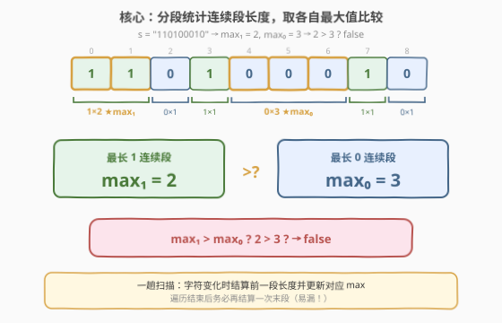
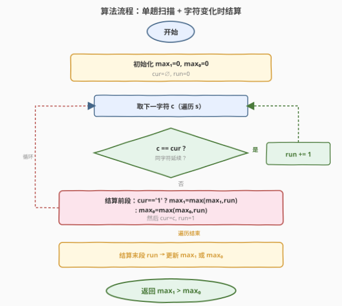
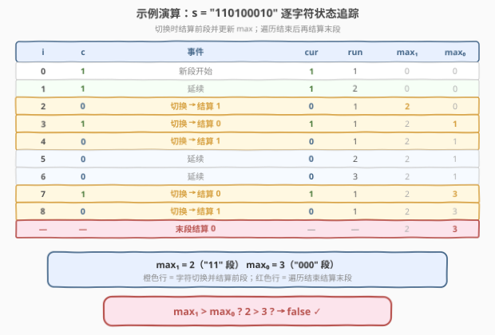

# LeetCode 哪种连续子字符串更长 题解

## 1. 题目概述

- **标题 / 题号**：哪种连续子字符串更长（#1869，easy）
- **链接**：https://leetcode.cn/problems/longer-contiguous-segments-of-ones-than-zeros/
- **难度**：简单
- **标签**：字符串、计数

**题意**：给定一个二进制字符串 `s`（仅含 `'0'` 和 `'1'`）。如果字符串中由 `'1'` 组成的**最长连续子字符串**严格长于由 `'0'` 组成的**最长连续子字符串**，返回 `true`；否则返回 `false`。

> 例如，`s = "110100010"` 中，由 `'1'` 组成的最长连续段长度为 $2$，由 `'0'` 组成的最长连续段长度为 $3$。

注意：如果字符串中不存在 `'0'`，则认为由 `'0'` 组成的最长连续段长度为 $0$；不存在 `'1'` 的情况同理。

**示例 1**：

```text
输入：s = "1101"
输出：true
解释：最长 1 连续段长度 = 2（"11"），最长 0 连续段长度 = 1（"0"），2 > 1 → true
```

**示例 2**：

```text
输入：s = "111000"
输出：false
解释：最长 1 连续段长度 = 3，最长 0 连续段长度 = 3，3 > 3 不成立 → false
```

**示例 3**：

```text
输入：s = "110100010"
输出：false
解释：最长 1 连续段长度 = 2，最长 0 连续段长度 = 3，2 > 3 不成立 → false
```

**约束**：

- $1 \le \text{s.length} \le 100$
- `s[i]` 为 `'0'` 或 `'1'`

> 💡 **审题关键**：比较的是**严格大于**（`>`，不是 `≥`）；比较对象是**各自最长**的连续段，而非段的数量或总字符数。若串中只有一种字符，另一种的最长段长度自然为 $0$（初始化即可覆盖，无需特判）。

## 2. 解题思路

### 2.1 直接思路：切分取最长段

最直观的做法是借助字符串切分——按 `'0'` 切分得到所有 `1` 连续段，按 `'1'` 切分得到所有 `0` 连续段，分别取最长即可：

```text
max1 = max(len(seg) for seg in s.split('0'))   # "1101".split('0') = ["11","1"] → 2
max0 = max(len(seg) for seg in s.split('1'))   # "1101".split('1') = ["","","0",""] → 1
return max1 > max0
```

- **正确性**：`split('0')` 把所有 `0` 当分隔符，留下若干纯 `1` 段（含空串），最长非空段即 `max1`；反之同理。
- **效率**：两次 `split` 各 $O(n)$，但产生中间数组，空间 $O(n)$。对于 $n \le 100$ 完全无压力，但面试中常被追问能否 $O(1)$ 空间一趟搞定。

### 2.2 核心观察：单趟扫描 + 字符变化时结算



关键洞察：**不需要存储所有段，只需维护两个最大值 `max1`、`max0` 和当前段的字符 `cur` 及长度 `run`**。遍历时：

- **字符延续**（`c == cur`）：`run += 1`，继续。
- **字符切换**（`c != cur`）：前一段结束，根据 `cur` 是 `'1'` 还是 `'0'` 更新对应最大值，然后 `cur = c`、`run = 1` 开启新段。

> ⚠️ **最高频陷阱**：遍历结束后**必须再结算一次末段**——最后一段没有"后续切换"来触发结算，若遗漏会导致末段长度未被计入 `max1`/`max0`。例如 `s = "1101"` 末段为 `"1"`（长度 1），若漏结算则 `max1` 停在 $0$（误判 `0 > 1` → `false`，而正确答案是 `true`）。

> 💡 **为什么 `cur` 初始化为 `'\0'`（空字符）是安全的？** 第一个字符 `c` 必为 `'0'` 或 `'1'`，不等于 `'\0'`，故首次必走"切换"分支。此时 `cur == '\0'` 既非 `'1'` 也非 `'0'`，不触发任何 `max` 更新（`run` 此时为 $0$，更新也无意义），随后 `cur = c`、`run = 1` 正常起步。无需对首字符特判。

### 2.3 算法流程图



1. **初始化**：`max1 = 0`、`max0 = 0`、`cur = '\0'`、`run = 0`。
2. **遍历**每个字符 `c`：
   - 若 `c == cur`：`run += 1`（延续当前段）。
   - 若 `c != cur`：结算前段（`cur == '1'` → `max1 = max(max1, run)`；`cur == '0'` → `max0 = max(max0, run)`），然后 `cur = c`、`run = 1`。
3. **结算末段**：遍历结束后再执行一次结算（与切换时的结算逻辑相同）。
4. **返回** `max1 > max0`。

### 2.4 示例演算

以示例 3 `s = "110100010"` 为例，逐字符追踪 `cur`、`run`、`max1`、`max0` 的变化：



| 步骤 | 事件 | cur | run | max₁ | max₀ | 说明 |
|------|------|-----|-----|------|------|------|
| $i=0$ | 新段 | `1` | $1$ | $0$ | $0$ | 首字符，`cur` 从 `∅` 切到 `'1'` |
| $i=1$ | 延续 | `1` | $2$ | $0$ | $0$ | `'1'` 连续第 2 个 |
| $i=2$ | 切换 | `0` | $1$ | $\mathbf{2}$ | $0$ | 结算前段 `'1'`×2 → `max1=2` |
| $i=3$ | 切换 | `1` | $1$ | $2$ | $\mathbf{1}$ | 结算前段 `'0'`×1 → `max0=1` |
| $i=4$ | 切换 | `0` | $1$ | $2$ | $1$ | 结算前段 `'1'`×1 → `max1=max(2,1)=2` |
| $i=5$ | 延续 | `0` | $2$ | $2$ | $1$ | `'0'` 连续第 2 个 |
| $i=6$ | 延续 | `0` | $3$ | $2$ | $1$ | `'0'` 连续第 3 个 |
| $i=7$ | 切换 | `1` | $1$ | $2$ | $\mathbf{3}$ | 结算前段 `'0'`×3 → `max0=3` |
| $i=8$ | 切换 | `0` | $1$ | $2$ | $3$ | 结算前段 `'1'`×1 → `max1=max(2,1)=2` |
| 末段 | 结算 | — | — | $2$ | $3$ | 末段 `'0'`×1 → `max0=max(3,1)=3` |

最终 `max1 = 2`、`max0 = 3`，`2 > 3` 不成立 → 返回 `false` ✓。

> 💡 **观察要点**：① 每次字符切换时才结算前段，延续时只增 `run`；② 末段（`i=8` 的 `'0'`）在遍历结束后才被结算，若遗漏则 `max0` 停在 $1$（来自 `i=3`），误判 `2 > 1` → `true`，方向完全反了；③ 切换结算时用 `max` 取较大值，保证只记录最长段。

## 3. 参考代码

### C++

```cpp
class Solution {
public:
    bool checkZeroOnes(string s) {
        int max1 = 0, max0 = 0;
        char cur = '\0';
        int run = 0;
        for (char c : s) {
            if (c == cur) {
                ++run;
            } else {
                if (cur == '1')      max1 = max(max1, run);
                else if (cur == '0') max0 = max(max0, run);
                cur = c;
                run = 1;
            }
        }
        // 结算末段（易漏！）
        if (cur == '1')      max1 = max(max1, run);
        else if (cur == '0') max0 = max(max0, run);
        return max1 > max0;
    }
};
```

### Python

```python
class Solution:
    def checkZeroOnes(self, s: str) -> bool:
        max1 = max0 = 0
        cur = ''
        run = 0
        for c in s:
            if c == cur:
                run += 1
            else:
                if cur == '1':
                    max1 = max(max1, run)
                elif cur == '0':
                    max0 = max(max0, run)
                cur = c
                run = 1
        # 结算末段（易漏！）
        if cur == '1':
            max1 = max(max1, run)
        elif cur == '0':
            max0 = max(max0, run)
        return max1 > max0
```

> 💡 **写法对照**：两版逻辑完全一致——`cur` 初始化为空字符（`'\0'` / `''`），首次必走 `else` 分支但不触发 `max` 更新，随后正常起步。结算逻辑在循环内（切换时）和循环后（末段）各出现一次，代码重复但清晰。若追求 DRY 可抽成 `settle()` 辅助函数，但对本题而言直写更直观。

## 4. 复杂度分析

| 维度 | 复杂度 | 说明 |
|------|--------|------|
| 时间复杂度 | $O(n)$ | 单趟遍历，每个字符 $O(1)$ 处理（比较 + 可能的 `max` 更新） |
| 空间复杂度 | $O(1)$ | 仅 `max1`、`max0`、`cur`、`run` 四个变量，无额外数组 |

> 💡 $n \le 100$，$O(n)$ 毫无压力。对比 2.1 的 `split` 方案虽同为 $O(n)$ 时间，但产生中间数组（空间 $O(n)$），在空间敏感场景（如嵌入式面试）中单趟扫描更优。

## 5. 扩展：避免末段遗漏的三种写法

"忘记结算末段"是本题最高频 bug。以下三种写法从不同角度规避此陷阱：

### 5.1 双指针分段法（无末段结算）

用内层 `while` 把每段一次性吃完，天然无需末段补结算：

```cpp
bool checkZeroOnes(string s) {
    int max1 = 0, max0 = 0, i = 0, n = s.size();
    while (i < n) {
        int j = i;
        while (j < n && s[j] == s[i]) ++j;   // 吃完整个同字符段
        if (s[i] == '1') max1 = max(max1, j - i);
        else             max0 = max(max0, j - i);
        i = j;                                 // 跳到下一段起点
    }
    return max1 > max0;
}
```

每段在 `while` 内被完整处理，`i = j` 直接跳到下一段，不存在"最后一段未结算"的问题。

### 5.2 split 一行流（Python 专属）

```python
def checkZeroOnes(self, s: str) -> bool:
    return max(len(seg) for seg in s.split('0')) > max(len(seg) for seg in s.split('1'))
```

`s.split('0')` 把所有 `0` 当分隔符，留下纯 `1` 段（含空串），`max(len(...))` 取最长 `1` 段；`split('1')` 同理。空串长度为 $0$，天然处理"无该字符"的情况。**面试中作为开场快解很亮眼，但务必能口述 $O(1)$ 空间版以应对追问。**

### 5.3 哨兵字符串法

在 `s` 末尾追加一个与末字符不同的哨兵，强制触发末段结算：

```text
s += (s.back() == '1') ? '0' : '1'    # 追加异字符哨兵
// 此后原末段必然在循环内被切换结算，无需循环后补结算
```

> ⚠️ 此法改变了输入，需确认题目允许修改 `s`（本题按值传递 `string`，安全）。C++ 中 `s.back()` 要求 `s` 非空（约束 $n \ge 1$ 保证）。

## 6. 面试要点

**Q1：为什么遍历结束后还要再结算一次？**

> 循环内的结算只在"字符切换"时触发。最后一段没有后续不同字符来触发切换，若不在循环后补结算，末段长度不会被计入 `max1`/`max0`。例如 `s = "1101"` 末段为 `"1"`（长度 1），漏结算会使 `max1` 停在 $0$，误判 `false`。

**Q2：`cur` 初始化为空字符为什么是安全的？**

> 首字符 `c` 必为 `'0'` 或 `'1'`，不等于空字符 `'\0'`，故首次必走"切换"分支。此时 `cur` 既非 `'1'` 也非 `'0'`，两个 `if` 均不触发（`run` 此时为 $0$，更新也无意义），随后 `cur = c`、`run = 1` 正常起步。无需对首字符特判，也无需预先读取 `s[0]`。

**Q3：本题与 485「最大连续 1 的个数」有何关系？**

> 485 只求 `max1`（最长 `1` 连续段），是本题的**单侧子问题**。本题需要同时维护 `max1` 和 `max0` 并比较——相当于做两次 485 再比大小，但在一趟扫描内合并完成。掌握了 485 的单趟扫描模板，本题只需再加一个 `max0` 变量。

**Q4：split 一行流和单趟扫描各有什么取舍？**

> split 版（`max(len(seg) for seg in s.split('0'))`）简洁直观，适合快速验证，但产生中间数组，空间 $O(n)$。单趟扫描版空间 $O(1)$，适合空间敏感场景。两者时间同为 $O(n)$。面试中可以先写 split 版展示思路，再口述优化为 $O(1)$ 空间版。

**Q5：如果题目改成"比较 1 段和 0 段的数量"而非最长长度，思路有何变化？**

> 段数比较只需统计**切换次数**：`cnt1 = 切换到 '1' 的次数 + (s[0]=='1')`，`cnt0` 同理。无需维护 `run` 长度，但需要额外记录上一次切换的目标字符。这把"最长段"问题转化为"段计数"问题，核心仍是字符变化的检测，只是结算内容不同。

## 同类练习题

| # | 题目 | 与本题的关联 |
|---|------|-------------|
| 485 | [最大连续 1 的个数](https://leetcode.cn/problems/max-consecutive-ones/)（[题解](../0401-0500/485_最大连续1的个数.md)） | 本题的单侧子问题——只求 `max1`，单趟扫描模板的母题，掌握后本题只需多维护一个 `max0` |
| 1864 | [构成交替字符串需要的最小交换次数](https://leetcode.cn/problems/minimum-number-of-swaps-to-make-the-binary-string-alternating/)（[题解](../1801-1900/1864_构成交替字符串需要的最小交换次数.md)） | 同为二进制串分析，关注 `0`/`1` 的位置布局与频次，对照"连续段统计"与"错位统计"两种视角 |
| 1784 | [检查二进制字符串字段](https://leetcode.cn/problems/check-if-binary-string-has-at-most-one-segment-of-ones/)（[题解](../1701-1800/1784_检查二进制字符串字段.md)） | 二进制串连续段格式校验，判断 `1` 是否至多一段，同样是"连续段"概念的判定变体 |
| 1758 | [生成交替二进制字符串的最少操作数](https://leetcode.cn/problems/minimum-changes-to-make-alternating-binary-string/)（[题解](../1701-1800/1758_生成交替二进制字符串的最少操作数.md)） | 二进制串逐位比对目标模式，对照"连续段长度比较"与"逐位差异统计"两种二进制串分析范式 |
