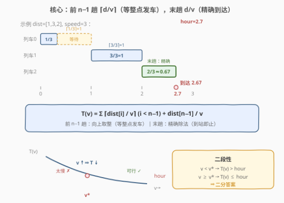
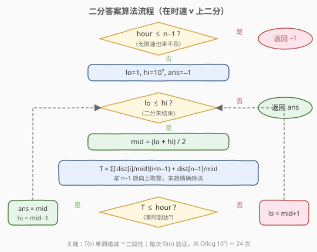

# LeetCode 准时到达的列车最小时速 题解

## 1. 题目概述

- **标题 / 题号**：准时到达的列车最小时速（#1870，medium）
- **链接**：https://leetcode.cn/problems/minimum-speed-to-arrive-on-time/
- **难度**：中等
- **标签**：数组、二分查找

**题意**：给定浮点数 `hour`，表示到达办公室可用的总通勤时间。必须按给定次序乘坐 `n` 趟列车，整数数组 `dist[i]` 表示第 `i` 趟列车的行驶距离（千米）。每趟列车均只能在**整点发车**，因此可能在两趟列车之间等待一段时间。返回能满足在时限前到达的**最小正整数**时速（千米/小时），若无法准时到达则返回 `-1`。

> 💡 **关键规则**：列车只能整点发车。第 $i$ 趟列车到达后，若到达时刻不是整数，必须等待到下一个整点才能搭乘第 $i+1$ 趟列车。因此前 $n-1$ 趟的耗时是 $\lceil \text{dist}[i] / v \rceil$（向上取整，含等待）；**末趟列车**只需到达无需再换乘，耗时是 $\text{dist}[n-1] / v$（精确除法）。

**示例 1**：

```text
输入：dist = [1,3,2], hour = 6
输出：1
解释：速度为 1 时，三趟分别耗时 1+3+2=6 小时，恰好在第 6 小时到达。
```

**示例 2**：

```text
输入：dist = [1,3,2], hour = 2.7
输出：3
解释：速度为 3 时，⌈1/3⌉=1, ⌈3/3⌉=1, 2/3≈0.67，总耗时 2.67 ≤ 2.7。
```

**示例 3**：

```text
输入：dist = [1,3,2], hour = 1.9
输出：-1
解释：即便无限速，前 2 趟至少各 1 小时，总耗时 > 2 > 1.9，不可能准时到达。
```

**约束**：

- $n = \text{dist.length}$
- $1 \le n \le 10^5$
- $1 \le \text{dist}[i] \le 10^5$
- $1 \le \text{hour} \le 10^9$
- `hour` 小数点后最多两位数字
- 答案不超过 $10^7$

## 2. 解题思路

### 2.1 暴力思路

时速 $v$ 的取值范围是 $[1, 10^7]$（题目保证答案不超过 $10^7$）。从 $v = 1$ 开始逐个尝试，对每个 $v$ 计算总耗时 $T(v)$，第一个满足 $T(v) \le \text{hour}$ 的 $v$ 即为答案。验证单个 $v$ 是 $O(n)$，整体 $O(n \times 10^7)$，$n$ 可达 $10^5$，必然超时。

### 2.2 核心观察：二分答案



关键直觉是：**总耗时 $T(v)$ 关于时速 $v$ 单调递减**。

- $v$ 越大，每趟列车跑得越快，总耗时越少。
- 前 $n-1$ 趟耗时为 $\lceil \text{dist}[i] / v \rceil$（需等整点发车）。
- **末趟列车**耗时为 $\text{dist}[n-1] / v$（到站即止，无需取整）——这是本题与 875「爱吃香蕉的珂珂」的**关键区别**。

于是存在一个**分界点** $v^*$：

```text
v < v*  → T(v) > hour   (太慢，来不及)
v >= v* → T(v) <= hour  (可行，准时到达)
```

这正是二分查找所需的**二段性**。把「求最小可行时速」转化为：在区间 $[1, 10^7]$ 上二分，每次 $O(n)$ 验证 $mid$ 是否可行，可行则去左半找更小的，不可行则去右半加快。

> 💡 **可行性预判**：前 $n-1$ 趟每趟至少 1 小时（$\lceil \text{dist}[i] / v \rceil \ge 1$），末趟耗时 $> 0$，所以 $T(v) > n - 1$。若 $\text{hour} \le n - 1$，即使无限速也来不及，直接返回 $-1$。

> ⚠️ **末趟不用取整**：这是本题最大的陷阱。很多解法错误地对所有列车都用 $\lceil \cdot \rceil$，导致末趟多算等待时间。只有前 $n-1$ 趟需要取整（因为要等下一趟整点发车），末趟到达即结束。

### 2.3 算法流程图



注意先做可行性预判（$\text{hour} \le n - 1$ → 返回 $-1$），再进入二分循环。判定为「可行」时**先记录 `ans = mid` 再收缩右界**（`hi = mid - 1`），保证最终保留的是「最小的可行值」。

### 2.4 示例演算

以示例 2 `dist = [1,3,2]`、`hour = 2.7` 为例：

![示例演算：dist=[1,3,2], hour=2.7](../images/1870_example_walkthrough.svg)

- **可行性**：$n = 3$，$n - 1 = 2$，$\text{hour} = 2.7 > 2$ → 可以继续。
- **$v = 1$**：$1 + 3 + 2.0 = 6.0 > 2.7$ ✗ 太慢。
- **$v = 2$**：$1 + 2 + 1.0 = 4.0 > 2.7$ ✗ 太慢。
- **$v = 3$**：$1 + 1 + 0.67 = 2.67 \le 2.7$ ✓ 可行。
- **二分**：在 $[1, 10^7]$ 上约 24 次迭代收敛到 $v^* = 3$。

> 💡 示例 3 `hour = 1.9`：$n - 1 = 2$，$1.9 \le 2$ → 直接返回 $-1$，无需二分。

## 3. 参考代码

### C++

```cpp
class Solution {
public:
    int minSpeedOnTime(vector<int>& dist, double hour) {
        int n = dist.size();
        if (hour <= n - 1) return -1;

        int lo = 1, hi = 1e7, ans = -1;
        while (lo <= hi) {
            int mid = lo + (hi - lo) / 2;
            double total = 0;
            for (int i = 0; i < n - 1; i++) {
                total += (dist[i] + mid - 1) / mid; // 向上取整 ceil(d/v)
            }
            total += (double)dist[n - 1] / mid;     // 末趟精确除法
            if (total <= hour) {
                ans = mid;
                hi = mid - 1;
            } else {
                lo = mid + 1;
            }
        }
        return ans;
    }
};
```

### Python

```python
class Solution:
    def minSpeedOnTime(self, dist: List[int], hour: float) -> int:
        n = len(dist)
        if hour <= n - 1:
            return -1

        def check(speed):
            total = 0.0
            for i in range(n - 1):
                total += (dist[i] + speed - 1) // speed  # 向上取整
            total += dist[-1] / speed                     # 末趟精确除法
            return total <= hour

        lo, hi = 1, 10**7
        ans = -1
        while lo <= hi:
            mid = (lo + hi) // 2
            if check(mid):
                ans = mid
                hi = mid - 1
            else:
                lo = mid + 1
        return ans
```

> ⚠️ **三个易错点**：
> 1. **末趟不取整**：前 $n-1$ 趟用 `(d + v - 1) / v` 向上取整，末趟用 `(double)d / v` 精确除法。混淆会导致末趟多算等待时间。
> 2. **可行性预判**：`hour <= n - 1` 时直接返回 $-1$。不做预判也能二分得到 `ans = -1`（所有 $v$ 都不可行），但预判可避免无效二分。
> 3. **浮点精度**：`(dist[i] + mid - 1) / mid` 是整数运算，转 `double` 累加无精度损失；末趟 `dist[n-1] / mid` 用浮点除法。在边界极值处可加 `1e-9` 容差：`total <= hour + 1e-9`。

## 4. 复杂度分析

| 维度 | 复杂度 | 说明 |
|------|--------|------|
| 时间复杂度 | $O(n \log M)$ | $M = 10^7$；二分 $O(\log M) \approx 24$ 次，每次验证 $O(n)$ |
| 空间复杂度 | $O(1)$ | 仅用常数额外变量 |

## 5. 扩展：与 875 爱吃香蕉的珂珂的对比

本题与 875「爱吃香蕉的珂珂」同属「二分答案」模板，但有**两个关键差异**：

| 维度 | 875 爱吃香蕉的珂珂 | 1870 准时到达的列车 |
|------|---------------------|----------------------|
| **取整方式** | 所有堆都用 $\lceil \text{piles}[i] / k \rceil$ | 前 $n-1$ 趟取整，**末趟精确除法** |
| **可行性保证** | 题目保证 $h \ge n$，恒有解 | 需自行判断 $\text{hour} \le n-1$ → 返回 $-1$ |
| **上界** | $\max(\text{piles})$（再大无意义） | $10^7$（题目保证） |
| **验证函数** | $\sum \lceil \text{piles}[i] / k \rceil \le h$ | $\sum_{i<n-1} \lceil \text{dist}[i] / v \rceil + \text{dist}[n-1] / v \le \text{hour}$ |

> 💡 **识别信号不变**：求「最小的满足某单调条件值」+ 能 $O(n)$ 验证 → 二分答案。1870 的陷阱在于验证函数的**末趟特殊处理**，而非二分框架本身。

## 6. 面试要点

**Q1：为什么末趟列车不用向上取整？**

> 前 $n-1$ 趟列车到达后需要换乘下一趟，而列车只在整点发车，所以到达后若非整点必须等待——耗时为 $\lceil \text{dist}[i] / v \rceil$。末趟列车到达即结束，无需再换乘，所以耗时就是精确的 $\text{dist}[n-1] / v$。多取整会导致末趟多算等待时间，答案偏大。

**Q2：为什么 `hour <= n - 1` 时返回 $-1$？**

> 前 $n-1$ 趟每趟至少 1 小时（$\text{dist}[i] \ge 1$，$v \ge 1$，$\lceil \text{dist}[i] / v \rceil \ge 1$），末趟耗时 $> 0$，所以 $T(v) > n - 1$ 恒成立。若 $\text{hour} \le n - 1$，则 $T(v) > \text{hour}$ 对所有 $v$ 成立，不可能准时到达。

**Q3：上界为什么取 $10^7$？**

> 题目保证答案不超过 $10^7$。当 $v = 10^7$ 时，末趟耗时 $\text{dist}[n-1] / 10^7 \le 10^5 / 10^7 = 0.01$，前 $n-1$ 趟各 1 小时，总耗时 $\approx n - 1 + 0.01$。只要 $\text{hour} > n - 1$（已通过预判），$v = 10^7$ 必然可行。

**Q4：浮点精度如何处理？**

> 前 $n-1$ 趟用整数运算 `(d + v - 1) / v` 计算向上取整，转 `double` 累加无精度损失。末趟 `dist[n-1] / v` 是浮点除法，可能有微小误差。在极值边界处可加 `1e-9` 容差：`total <= hour + 1e-9`，避免因浮点误差误判可行的 $v$ 为不可行。

**Q5：本题与 875 爱吃香蕉的珂珂有何异同？**

> **同**：都是二分答案，验证函数 $O(n)$，求最小可行值。**异**：875 所有堆都用 $\lceil \cdot \rceil$ 且题目保证 $h \ge n$（恒有解）；1870 末趟用精确除法（不取整），且需自行判断 $\text{hour} \le n - 1$ 的不可能情况。核心区别在验证函数的末趟特殊处理。

## 同类练习题

| # | 题目 | 与本题的关联 |
|---|------|-------------|
| 875 | [爱吃香蕉的珂珂](https://leetcode.cn/problems/koko-eating-bananas/)（[题解](../0801-0900/875_爱吃香蕉的珂珂.md)） | 同模板二分答案，所有堆都用向上取整，对比 1870 末趟精确除法的差异 |
| 1011 | [在 D 天内送达包裹的能力](https://leetcode.cn/problems/capacity-to-ship-packages-within-d-days/)（[题解](../1001-1100/1011_在D天内送达包裹的能力.md)） | 同模板二分答案，check 用贪心按天累加 |
| 410 | [分割数组的最大值](https://leetcode.cn/problems/split-array-largest-sum/)（[题解](../0401-0500/410_分割数组的最大值.md)） | 二分「最大子数组和」，check 贪心划分子数组 |
| 2187 | [完成旅途的最少时间](https://leetcode.cn/problems/minimum-time-to-complete-trips/) | 二分时间，check 统计各车完成的趟数，与 1870 互为镜像（1870 二分速度验证时间，2187 二分时间验证趟数） |
