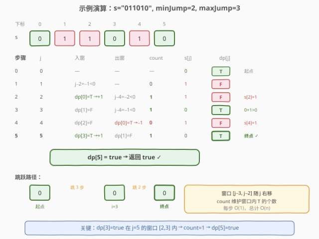

# 跳跃游戏 VII

- **题目名称**：跳跃游戏 VII
- **链接**：[1871. 跳跃游戏 VII](https://leetcode.cn/problems/jump-game-vii/)
- **难度**：中等
- **标签**：字符串、动态规划、滑动窗口、前缀和

## 1. 题目概述

给你一个下标从 **0** 开始的二进制字符串 `s` 和两个整数 `minJump` 和 `maxJump`。一开始你在下标 `0` 处，且该位置的值一定为 `'0'`。当同时满足如下条件时，你可以从下标 `i` 移动到下标 `j` 处：

- $i + \text{minJump} \le j \le \min(i + \text{maxJump},\ s.length - 1)$，且
- $s[j] == \text{'0'}$。

如果你可以到达 `s` 的下标 $s.length - 1$ 处，返回 `true`，否则返回 `false`。

**示例 1**：

```text
输入：s = "011010", minJump = 2, maxJump = 3
输出：true
解释：第一步从下标 0 移动到下标 3，第二步从下标 3 移动到下标 5。
```

**示例 2**：

```text
输入：s = "01101110", minJump = 2, maxJump = 3
输出：false
```

**约束条件**：

- $2 \le \text{s.length} \le 10^5$
- $s[i]$ 要么是 `'0'`，要么是 `'1'`
- $s[0] == \text{'0'}$
- $1 \le \text{minJump} \le \text{maxJump} < \text{s.length}$

> 💡 **关键直觉**：从 `i` 出发能跳到 $[i + \text{minJump},\ i + \text{maxJump}]$ 范围内的任意 `'0'` 位置。反过来想，**位置 `j` 能否到达**，取决于 $[j - \text{maxJump},\ j - \text{minJump}]$ 这个窗口内是否存在一个「已到达」的位置 `i`（且 $s[j] == \text{'0'}$）。随着 `j` 从左到右扫描，这个窗口也在右移——用 `count` 维护窗口内已到达位置的个数，入窗加一、出窗减一，每步 $O(1)$，总时间 $O(n)$。

---

## 2. 解题思路

### 2.1 暴力思路：枚举每个位置的来源

定义 `dp[j]` 表示能否到达下标 `j`。初始 `dp[0] = true`（$s[0] = \text{'0'}$ 保证）。对每个 `j`，检查窗口 $[j - \text{maxJump},\ j - \text{minJump}]$ 内所有位置 `i`，若有 `dp[i] = true` 且 $s[j] == \text{'0'}$，则 `dp[j] = true`。

```python
dp = [False] * n
dp[0] = True
for j in range(1, n):
    if s[j] == '1':
        continue
    for i in range(max(0, j - maxJump), j - minJump + 1):
        if dp[i]:
            dp[j] = True
            break
```

时间复杂度 $O(n \times (\text{maxJump} - \text{minJump}))$，最坏 $O(n^2)$，$n = 10^5$ 时超时。

> ⚠️ 瓶颈：内层循环遍历窗口内所有 `i`，但窗口宽度最大可达 $\text{maxJump}$（接近 $n$）。我们只关心窗口内**是否存在**一个 `dp[i] = true`，不需要逐个检查——这正是**滑动窗口计数**的用武之地。

### 2.2 核心观察：滑动窗口计数

![核心直觉：窗口 [j−maxJump, j−minJump] 随 j 右移，用 count 维护其中 dp[i]=true 的个数](../images/1871_concept.svg)

**关键转化**：对位置 `j`，合法来源窗口为 $[j - \text{maxJump},\ j - \text{minJump}]$（下标合法时）。我们不需要遍历窗口内每个 `i`，只需维护窗口内 `dp[i] = true` 的**计数** `count`：

1. **dp[j] 的判定**：$dp[j] = (s[j] == \text{'0'}) \wedge (\text{count} > 0)$。
2. **窗口滑动**：当 `j` 从 $j-1$ 变为 $j$ 时，窗口右端从 $(j-1) - \text{minJump}$ 变为 $j - \text{minJump}$（右端入窗），左端从 $(j-1) - \text{maxJump}$ 变为 $j - \text{maxJump}$（左端出窗）。
3. **O(1) 维护**：
   - **入窗**：若 $j - \text{minJump} \ge 0$ 且 $dp[j - \text{minJump}] = true$，则 `count++`。
   - **出窗**：若 $j - \text{maxJump} - 1 \ge 0$ 且 $dp[j - \text{maxJump} - 1] = true$，则 `count--`。

> 💡 **为什么是 $j - \text{maxJump} - 1$ 出窗？** 窗口左端是 $j - \text{maxJump}$。当 `j` 增加到 `j+1` 时，新左端变为 $j + 1 - \text{maxJump}$，旧左端 $j - \text{maxJump}$ 仍在窗口内，而 $j - \text{maxJump} - 1$ 刚好滑出。所以在处理 `j` 时，先移除 $j - \text{maxJump} - 1$（上一个窗口的左端再前一个），再加入 $j - \text{minJump}$（新右端），窗口恰好更新为 $[j - \text{maxJump},\ j - \text{minJump}]$。

> ⚠️ **顺序很重要**：必须先「入窗」再「出窗」，因为入窗的位置 $j - \text{minJump}$ 和出窗的位置 $j - \text{maxJump} - 1$ 不会重叠（$\text{minJump} \le \text{maxJump}$ 保证 $j - \text{minJump} \ge j - \text{maxJump} > j - \text{maxJump} - 1$），先后顺序不影响结果，但保持一致的入-出顺序便于理解和调试。

### 2.3 算法流程图

![算法流程：初始化 dp[0]=true, count=0，遍历 j=1..n−1，每步入窗+出窗+判定](../images/1871_algorithm_flow.svg)

1. **初始化**：`dp[0] = true`（$s[0] == \text{'0'}$ 保证），`count = 0`。
2. **遍历** `j` **从 1 到** $n - 1$：
   - **右端入窗**：若 $j - \text{minJump} \ge 0$ 且 $dp[j - \text{minJump}] == true$，`count++`。
   - **左端出窗**：若 $j - \text{maxJump} - 1 \ge 0$ 且 $dp[j - \text{maxJump} - 1] == true$，`count--`。
   - **判定**：$dp[j] = (s[j] == \text{'0'}) \wedge (\text{count} > 0)$。
3. 返回 $dp[n - 1]$。

> 💡 **j = 0 不进循环**：`dp[0]` 是起点，天然可达。`count` 初始为 0，对应 `j = 0` 时窗口 $[-\text{maxJump},\ -\text{minJump}]$ 为空，与 `dp[0]` 的基例逻辑一致。

### 2.4 示例演算



以 `s = "011010"`, `minJump = 2`, `maxJump = 3` 为例（$n = 6$）：

| 步 | j | 入窗 ($j - 2$) | 出窗 ($j - 4$) | count | s[j] | dp[j] | 说明 |
|----|---|----------------|----------------|-------|------|-------|------|
| 0 | 0 | — | — | — | 0 | **T** | 起点，基例 |
| 1 | 1 | $-1 < 0$，无 | $-3 < 0$，无 | 0 | 1 | F | count=0 且 s[1]='1' |
| 2 | 2 | dp[0]=T → +1 | $-2 < 0$，无 | **1** | 1 | F | count=1 但 s[2]='1' |
| 3 | 3 | dp[1]=F，不变 | $-1 < 0$，无 | **1** | 0 | **T** | count=1>0 且 s[3]='0' ✓ |
| 4 | 4 | dp[2]=F，不变 | dp[0]=T → −1 | **0** | 1 | F | count=0 且 s[4]='1' |
| 5 | 5 | dp[3]=T → +1 | dp[1]=F，不变 | **1** | 0 | **T** | count=1>0 且 s[5]='0' ✓ |

最终 $dp[5] = \text{true}$，返回 `true`。跳跃路径：$0 \xrightarrow{\text{跳3步}} 3 \xrightarrow{\text{跳2步}} 5$。

> 💡 **步 5 是精髓**：`j=5` 时入窗 `dp[3]=true`（$j - \text{minJump} = 5 - 2 = 3$），出窗 `dp[1]=false`（$j - \text{maxJump} - 1 = 5 - 3 - 1 = 1$），`count` 从 0 变为 1。窗口 $[2, 3]$ 中 `dp[3]=true`，故 `dp[5]=true`。这正是滑动窗口计数的核心——$O(1)$ 判定窗口内是否存在可达位置。

---

## 3. 参考代码

### C++

```cpp
// 跳跃游戏VII.cpp —— DP + 滑动窗口计数
// 编译: g++ -O2 -std=c++17 跳跃游戏VII.cpp -o jgvii
#include <string>
#include <vector>
using namespace std;

class Solution {
  public:
    bool canReach(string s, int minJump, int maxJump) {
        int n = s.size();
        if (s[n - 1] != '0') return false;

        vector<bool> dp(n, false);
        dp[0] = true;
        int count = 0;

        for (int j = 1; j < n; ++j) {
            if (j - minJump >= 0 && dp[j - minJump]) ++count;
            if (j - maxJump - 1 >= 0 && dp[j - maxJump - 1]) --count;
            dp[j] = (s[j] == '0') && (count > 0);
        }

        return dp[n - 1];
    }
};
```

### Python

```python
class Solution:
    def canReach(self, s: str, minJump: int, maxJump: int) -> bool:
        n = len(s)
        if s[n - 1] != '0':
            return False

        dp = [False] * n
        dp[0] = True
        count = 0

        for j in range(1, n):
            if j - minJump >= 0 and dp[j - minJump]:
                count += 1
            if j - maxJump - 1 >= 0 and dp[j - maxJump - 1]:
                count -= 1
            dp[j] = (s[j] == '0') and (count > 0)

        return dp[n - 1]
```

> 💡 **实现细节**：① 提前剪枝 `s[n-1] != '0'` 直接返回 `false`——终点是 `'1'` 永远不可达。② `dp` 用 `bool` 数组即可，不需要前缀和或线段树。③ **入窗在前、出窗在后**：先加 $dp[j - \text{minJump}]$ 再减 $dp[j - \text{maxJump} - 1]$，两者不会指向同一位置（$\text{minJump} \le \text{maxJump}$ 保证 $j - \text{minJump} > j - \text{maxJump} - 1$），顺序不影响正确性。④ `count` 始终等于当前窗口 $[j - \text{maxJump},\ j - \text{minJump}]$ 内 `dp[i] = true` 的个数。

> ⚠️ **不要用 `if s[j] == '0'` 包裹整段逻辑**：即使 $s[j] == \text{'1'}$ 导致 $dp[j] = false$，窗口的入窗/出窗操作仍然要执行——因为后续位置的窗口会包含 `j`，`dp[j]` 的值会影响未来的 `count`。把入窗/出窗放在 `s[j]` 判定之前、独立执行，是正确写法。

---

## 4. 复杂度分析

| 维度 | 复杂度 | 说明 |
|------|--------|------|
| **时间** | $O(n)$ | 一次遍历 `j = 1..n-1`，每步入窗+出窗+判定各 $O(1)$ |
| **空间** | $O(n)$ | `dp` 数组 $O(n)$；若用滚动变量替代可 $O(1)$ 但可读性下降 |

> ⚠️ 暴力 DP 内层循环 $O(\text{maxJump} - \text{minJump})$，最坏 $O(n^2)$。滑动窗口计数的优化本质是：**将「窗口内是否存在 true」的判定从 $O(w)$ 降为 $O(1)**，代价仅维护一个 `count` 变量。这与 [209. 长度最小的子数组](../0201-0300/209_长度最小的子数组.md) 的滑动窗口思想一脉相承——用增量维护代替重复扫描。

---

## 5. 扩展：其他解法对比

### 5.1 BFS

将每个 `'0'` 位置视为图中的节点，从 `i` 到 $[i + \text{minJump},\ i + \text{maxJump}]$ 范围内的 `'0'` 位置连边，BFS 从 0 出发能否到达 $n-1$。但同一个位置可能被多次入队，需额外去重，且边数最坏 $O(n^2)$，不如 DP + 滑窗简洁。

### 5.2 前缀和

用前缀和 $pre[j] = \sum_{i=0}^{j-1} dp[i]$，则窗口 $[j - \text{maxJump},\ j - \text{minJump}]$ 内是否有 `true` 等价于 $pre[j - \text{minJump} + 1] - pre[j - \text{maxJump}] > 0$。逻辑等价但需要多维护一个前缀和数组，空间常数略大。

### 5.3 线段树 / 树状数组

将 `dp` 视为01序列，查询区间和是否 > 0。$O(n \log n)$，能过但大材小用——滑动窗口已将区间查询降为 $O(1)$。

| 解法 | 时间 | 空间 | 评价 |
|------|------|------|------|
| **DP + 滑动窗口** | $O(n)$ | $O(n)$ | 最优，计数维护窗口内 true 个数 |
| DP + 前缀和 | $O(n)$ | $O(n)$ | 等价，多一个前缀和数组 |
| BFS + 去重 | $O(n)$ | $O(n)$ | 可行，但需额外处理重复入队 |
| 线段树 | $O(n \log n)$ | $O(n)$ | 大材小用 |

> 💡 滑动窗口计数是本题的最优解：**窗口宽度固定、只增不减地右移**，天然适合用一个 `count` 变量增量维护。前缀和也行但多一层间接，BFS 和线段树则是杀鸡用牛刀。

---

## 6. 面试要点

1. **为什么不能用暴力 DP？**

   > 暴力 DP 对每个 `j` 遍历窗口 $[j - \text{maxJump},\ j - \text{minJump}]$ 内所有 `i`，时间 $O(n \times w)$，$w$ 最大接近 $n$，最坏 $O(n^2)$，$n = 10^5$ 时超时。优化关键：只关心窗口内**是否存在** `dp[i] = true`，用 `count` 增量维护即可 $O(1)$ 判定。

2. **滑动窗口的入窗和出窗条件分别是什么？**

   > 入窗：位置 $j - \text{minJump}$ 进入窗口右端，若 $j - \text{minJump} \ge 0$ 且 $dp[j - \text{minJump}] = true$，则 `count++`。出窗：位置 $j - \text{maxJump} - 1$ 离开窗口左端，若 $j - \text{maxJump} - 1 \ge 0$ 且 $dp[j - \text{maxJump} - 1] = true`，则 `count--`。

3. **为什么出窗是 $j - \text{maxJump} - 1$ 而不是 $j - \text{maxJump}$？**

   > 窗口左端是 $j - \text{maxJump}$，它仍在当前窗口内。当 `j` 增加到 `j+1` 时，新左端变为 $j + 1 - \text{maxJump}$，此时 $j - \text{maxJump}$ 还在窗口里，而 $j - \text{maxJump} - 1$ 才是刚滑出的那个位置。

4. **入窗和出窗的顺序可以交换吗？**

   > 可以。因为 $\text{minJump} \le \text{maxJump}$，入窗位置 $j - \text{minJump} \ge j - \text{maxJump} > j - \text{maxJump} - 1$（出窗位置），两者不会指向同一下标，操作互不干扰，先后顺序不影响 `count` 的最终值。但建议保持一致的入-出顺序便于调试。

5. **如果 $s[n-1] == \text{'1'}$ 怎么办？**

   > 直接返回 `false`。终点是 `'1'` 时无论怎么跳都无法落在此处（题目要求 $s[j] == \text{'0'}$）。提前剪枝可避免无意义的 DP 计算。

6. **为什么即使 $s[j] == \text{'1'}$ 也要执行入窗/出窗？**

   > 入窗/出窗维护的是 `count`（窗口内 `dp[i] = true` 的个数），与 $s[j]$ 无关。即使 $dp[j] = false$（因为 $s[j] = \text{'1'}$），`j` 仍在后续位置的窗口范围内，$dp[j]$ 的值会通过入窗操作影响未来的 `count`。若跳过入窗/出窗，`count` 会失真。

> 💡 **一句话总结**：DP + 滑动窗口计数，`count` 维护窗口 $[j - \text{maxJump},\ j - \text{minJump}]$ 内 `dp[i] = true` 的个数，`j` 右移时右端入窗 `+1`、左端出窗 `−1`，$dp[j] = (s[j] == \text{'0'}) \wedge (\text{count} > 0)$，总时间 $O(n)$。本质是把「窗口内是否存在 true」的 $O(w)$ 扫描降为 $O(1)$ 增量维护。

---

## 7. 同类练习题

- [55. 跳跃游戏](https://leetcode.cn/problems/jump-game/)：跳跃游戏系列基础版，贪心维护最远可达位置，本题是其在「跳跃距离有下界 + 只能落在 0」约束下的变体
- [45. 跳跃游戏 II](https://leetcode.cn/problems/jump-game-ii/)（[题解](../0001-0100/45_跳跃游戏II.md)）：求最少跳跃次数，贪心 BFS 层序扩展，与本题的可达性判定形成对比
- [1306. 跳跃游戏 III](https://leetcode.cn/problems/jump-game-iii/)：数组上左右跳跃 BFS 判可达，非固定步长区间，对比本题的窗口约束
- [1345. 跳跃游戏 IV](https://leetcode.cn/problems/jump-game-furthest/)：同值位置可互跳的 BFS 最短路，跳跃规则的又一种变体
- [209. 长度最小的子数组](https://leetcode.cn/problems/minimum-size-subarray-sum/)（[题解](../0201-0300/209_长度最小的子数组.md)）：滑动窗口经典题，与本题共享「窗口右移 + 增量维护」核心思想，巩固滑动窗口范式
