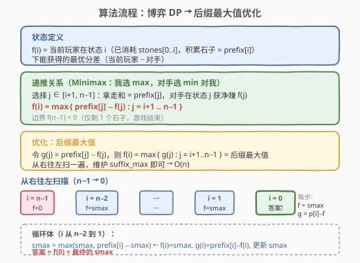
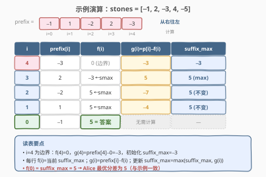

# LeetCode 石子游戏 VIII 题解

## 1. 题目概述

- **标题 / 题号**：石子游戏 VIII（#1872，hard）
- **链接**：https://leetcode.cn/problems/stone-game-viii/
- **难度**：困难
- **标签**：数组、动态规划、博弈、前缀和

**题意**：$n$ 个石子排成一行，Alice 和 Bob 轮流操作，**Alice 先手**。每次操作（当剩余石子 $> 1$ 时）：

1. 选择整数 $x > 1$，移除最左侧的 $x$ 个石子；
2. 将移除石子的**总和**加到当前玩家分数；
3. 在最左侧放置一个**新石子**，其值等于该总和。

游戏在**仅剩 1 个石子**时结束。分差 = Alice 分数 − Bob 分数。Alice 想最大化分差，Bob 想最小化分差。两人都采取最优策略，返回最终分差。

**示例 1**：

```text
输入：stones = [-1,2,-3,4,-5]
输出：5
解释：
- Alice 移除前 4 个，得分 = (−1)+2+(−3)+4 = 2，放置石子 2，行变为 [2,−5]
- Bob 移除 2 个，得分 = 2+(−5) = −3，放置石子 −3，行变为 [−3]
分差 = 2 − (−3) = 5
```

**示例 2**：

```text
输入：stones = [7,-6,5,10,5,-2,-6]
输出：13
解释：Alice 一次性移除全部 7 个，得分 = 13，行变为 [13]，游戏结束。分差 = 13 − 0 = 13
```

**示例 3**：

```text
输入：stones = [-10,-12]
输出：-22
解释：Alice 只能移除 2 个，得分 = −22。分差 = −22 − 0 = −22
```

**约束**：

- $n = \text{stones.length}$
- $2 \le n \le 10^5$
- $-10^4 \le \text{stones}[i] \le 10^4$

## 2. 解题思路

### 2.1 暴力思路

每一步玩家可以选择移除 $x \in [2, \text{剩余个数}]$ 个石子，选定后剩余局面交给对手。两人都最优，需递归枚举所有分支。最坏情况每步约 $n$ 种选择、深度可达 $n$，复杂度 $O(n^n)$，$n = 10^5$ 必爆。

关键在于发现操作的结构不变量，将状态压缩到一维。

### 2.2 核心观察：积累石子不变量

![核心观察：操作和恒为 prefix[终点]](../images/stone_game8_concept.svg)

定义**前缀和** $\text{prefix}[i] = \text{stones}[0] + \text{stones}[1] + \cdots + \text{stones}[i]$。

**不变量**：经过任意多次操作后，石子行一定形如：

$$[\,\text{积累石子},\ \text{stones}[i+1],\ \text{stones}[i+2],\ \cdots,\ \text{stones}[n-1]\,]$$

其中 $i$ 是**已消耗的最后一个原石子下标**，且**积累石子的值恰好等于 $\text{prefix}[i]$**。

> 💡 **为什么？** 初始时没有积累石子。Alice 第一次移除 $\text{stones}[0..k-1]$（$k \ge 2$），和为 $\text{prefix}[k-1]$，放置的新石子值 = $\text{prefix}[k-1]$，此时 $i = k-1$。此后每次操作移除「积累石子 + 若干原石子 $\text{stones}[i+1..j]$」，和 = $\text{prefix}[i] + (\text{prefix}[j] - \text{prefix}[i]) = \text{prefix}[j]$，新积累石子 = $\text{prefix}[j]$，$i$ 更新为 $j$。归纳成立。

**推论**：每次操作获得的分数**恒等于 $\text{prefix}[j]$**（$j$ 为本次移除的最后一个原石子下标），与历史无关。游戏状态**仅由 $i$ 决定** → 可以用一维 DP 刻画。

### 2.3 博弈 DP 与后缀最大值优化



**状态定义**：

> $f(i)$ = 当前玩家在状态 $i$（已消耗 $\text{stones}[0..i]$，积累石子 = $\text{prefix}[i]$，剩余 = $\text{stones}[i+1..n-1]$）时能获得的最优分差（当前玩家 − 对手）。

**转移**：当前玩家选择移除到下标 $j \in [i+1,\ n-1]$，获得 $\text{prefix}[j]$ 分，随后对手在状态 $j$ 获净赚 $f(j)$。由 Minimax（我选 max，对手最优 = 对我 min）：

$$f(i) = \max_{j=i+1}^{n-1}\bigl(\text{prefix}[j] - f(j)\bigr)$$

**边界**：$f(n-1) = 0$（仅剩 1 个石子，游戏结束，无操作）。

**答案**：Alice 的第一步相当于从「无积累石子」状态出发，移除 $\text{stones}[0..k-1]$（$k \ge 2$），获得 $\text{prefix}[k-1]$，到达状态 $k-1$。枚举 $k$：

$$\text{answer} = \max_{k=2}^{n}\bigl(\text{prefix}[k-1] - f(k-1)\bigr) = \max_{i=1}^{n-1}\bigl(\text{prefix}[i] - f(i)\bigr) = f(0)$$

> 💡 **为什么等于 $f(0)$？** $f(0) = \max_{j=1}^{n-1}(\text{prefix}[j] - f(j))$，与上式完全一致。直觉上：Alice 第一次移除 $\text{stones}[0]$ 相当于「消费第 0 个石子形成积累石子 $\text{prefix}[0]$」，之后从状态 0 出发的所有选择（移除积累 + $\text{stones}[1..j]$，$j \ge 1$）与初始状态的合法移除（$k \ge 2$ 即 $j \ge 1$）一一对应。

**朴素 DP 为 $O(n^2)$**（每个 $f(i)$ 枚举 $j$），$n = 10^5$ 仍超时。令 $g(j) = \text{prefix}[j] - f(j)$，则：

$$f(i) = \max_{j=i+1}^{n-1} g(j) = g \text{ 的后缀最大值}$$

从右往左扫一遍，维护 `suffix_max` 即可在 $O(n)$ 完成：

```
suffix_max = prefix[n-1]              // g(n-1) = prefix[n-1] - f(n-1) = prefix[n-1] - 0
for i = n-2 down to 1:
    // f(i) = suffix_max（即 max(g(i+1..n-1))）
    // g(i) = prefix[i] - f(i) = prefix[i] - suffix_max
    suffix_max = max(suffix_max, prefix[i] - suffix_max)
return suffix_max                      // = f(0) = max(g(1..n-1))
```

### 2.4 示例演算

以 `stones = [-1, 2, -3, 4, -5]`（示例 1）为例，`prefix = [-1, 1, -2, 2, -3]`，从右往左填表：



| $i$ | $\text{prefix}[i]$ | $f(i)$ | $g(i)=\text{prefix}[i]-f(i)$ | suffix_max（更新后） |
|-----|---------------------|--------|------------------------------|----------------------|
| 4   | $-3$                | $0$（边界） | $-3$                    | $-3$                 |
| 3   | $2$                 | $-3$ ← smax | $2-(-3)=5$              | $\max(-3,5)=5$       |
| 2   | $-2$                | $5$ ← smax  | $-2-5=-7$               | $\max(5,-7)=5$       |
| 1   | $1$                 | $5$ ← smax  | $1-5=-4$                | $\max(5,-4)=5$       |
| 0   | $-1$                | $5$ = **答案** | —                    | —                    |

$f(0) = 5$，与示例输出一致。最优策略：Alice 移除前 4 个获得 $\text{prefix}[3]=2$，Bob 被迫移除 2 个获得 $\text{prefix}[4]=-3$，分差 $= 2-(-3)=5$。

## 3. 参考代码

### C++

```cpp
class Solution {
  public:
    int stoneGameVIII(vector<int>& stones) {
        int n = stones.size();
        // 原地求前缀和：stones[i] 变为 prefix[i]
        for (int i = 1; i < n; i++) {
            stones[i] += stones[i - 1];
        }
        // 从右往左扫，维护 g(j) = prefix[j] - f(j) 的后缀最大值
        // f(n-1) = 0 → g(n-1) = prefix[n-1]
        int suffixMax = stones[n - 1];
        for (int i = n - 2; i >= 1; i--) {
            // f(i) = suffixMax, g(i) = prefix[i] - suffixMax
            // 更新 suffixMax = max(suffixMax, g(i))
            suffixMax = max(suffixMax, stones[i] - suffixMax);
        }
        // f(0) = max(g(1..n-1)) = suffixMax
        return suffixMax;
    }
};
```

### Python

```python
class Solution:
    def stoneGameVIII(self, stones: List[int]) -> int:
        n = len(stones)
        # 原地求前缀和
        for i in range(1, n):
            stones[i] += stones[i - 1]
        # 从右往左扫，维护 g 的后缀最大值
        suffix_max = stones[-1]  # g(n-1) = prefix[n-1] - 0
        for i in range(n - 2, 0, -1):
            # f(i) = suffix_max, g(i) = prefix[i] - suffix_max
            suffix_max = max(suffix_max, stones[i] - suffix_max)
        return suffix_max  # = f(0) = 答案
```

> 💡 **原地前缀和**：直接在 `stones` 数组上累加，省去额外 $O(n)$ 空间。若不允许修改输入，可新建 `prefix` 数组。

## 4. 复杂度分析

| 维度 | 复杂度 | 说明 |
|------|--------|------|
| 时间复杂度 | $O(n)$ | 一次前缀和预处理 $O(n)$ + 一次从右往左扫描 $O(n)$ |
| 空间复杂度 | $O(1)$ | 原地修改 `stones`，仅用常数变量 `suffix_max` |

> ⚠️ 朴素 DP 为 $O(n^2)$（每个 $f(i)$ 枚举 $j \in [i+1, n-1]$），$n = 10^5$ 必超时。核心优化在于识别 $f(i) = \max_{j>i} g(j)$ 是**后缀最大值**，将双重循环降为一重。

## 5. 扩展：与石子游戏系列的对比

LeetCode 的「石子游戏」系列（877 / 1140 / 1406 / 1510 / 1563 / 1690 / 1872）考察不同视角的博弈 DP：

| 题号 | 取法 | 状态维度 | 核心技巧 |
|------|------|----------|----------|
| 877  | 两端取一堆 | 二维区间 DP | 净赚定义 + $\max$ |
| 1140 | 左端取 $1..2M$ 堆 | 二维 $(i, M)$ | 前缀和 + 后缀最大值 |
| 1406 | 左端取 $1..3$ 个 | 一维 $f(i)$ | 后缀和 + 小常数枚举 |
| 1690 | 取两端，得分=剩余和 | 二维区间 DP | 净赚 + 前缀和 |
| **1872** | **左端取 $>1$ 个，合并** | **一维 $f(i)$** | **前缀和不变量 + 后缀最大值** |

本题独特之处在于**「移除后放回新石子」**的操作——看似状态会膨胀，但前缀和不变量将其压缩为一维。这与 1406（石子游戏 III）的「一维博弈 DP + 后缀优化」骨架最为相似，区别在于本题的「积累石子」让每次得分变成了前缀和而非单点值。

## 6. 面试要点

1. **为什么游戏状态只由一个下标 $i$ 决定？**
   - 前缀和不变量：积累石子值恒为 $\text{prefix}[i]$，剩余原石子恒为 $\text{stones}[i+1..n-1]$。无论经过多少次操作，状态完全由「已消耗到第几个原石子」确定，无需记录历史。

2. **递推里为什么是 $\text{prefix}[j] - f(j)$ 而不是 $\text{prefix}[j] + f(j)$？**
   - 博弈零和：当前玩家拿 $\text{prefix}[j]$ 后**身份互换**，对手成为状态 $j$ 的先手并获得净赚 $f(j)$。从当前玩家视角，对手的收益要扣除。

3. **答案为什么等于 $f(0)$？**
   - Alice 第一步移除 $\text{stones}[0..k-1]$（$k \ge 2$）获得 $\text{prefix}[k-1]$，到达状态 $k-1$。枚举 $k$ 得 $\max_{i=1}^{n-1}(\text{prefix}[i]-f(i))$，恰好等于 $f(0) = \max_{j=1}^{n-1}(\text{prefix}[j]-f(j))$。

4. **如何从 $O(n^2)$ 优化到 $O(n)$？**
   - 令 $g(j) = \text{prefix}[j] - f(j)$，则 $f(i) = \max_{j>i} g(j)$ 是 $g$ 的后缀最大值。从右往左维护 `suffix_max`，每步 $O(1)$ 更新。

5. **为什么 Alice 可能得到负分差？**
   - 石子值可正可负。当所有石子都为负时（如示例 3），Alice 被迫移除并获得负分，Bob 则得 0。这是与 877（石子全正、先手必胜）的关键区别。

## 同类练习题

| # | 题目 | 与本题的关联 |
|---|------|-------------|
| 877 | [石子游戏](https://leetcode.cn/problems/stone-game/)（[题解](../0801-0900/877_石子游戏.md)） | 博弈型区间 DP 母模板，两端取堆，对比本题的「左端取多 + 合并」 |
| 1406 | [石子游戏 III](https://leetcode.cn/problems/stone-game-iii/) | 一维博弈 DP + 后缀和，与本题骨架最相似（一维 $f(i)$ + 后缀优化） |
| 1140 | [石子游戏 II](https://leetcode.cn/problems/stone-game-ii/) | 二维 $(i, M)$ 状态 + 前缀和，体会额外约束如何影响状态定义 |
| 1690 | [石子游戏 VII](https://leetcode.cn/problems/stone-game-vii/) | 博弈型区间 DP，得分由「区间剩余和」决定，对比本题得分=前缀和 |
| 1563 | [石子游戏 V](https://leetcode.cn/problems/stone-game-v/) | 区间 DP + 前缀和，分割取较大半，对比本题的「左端合并」操作 |
