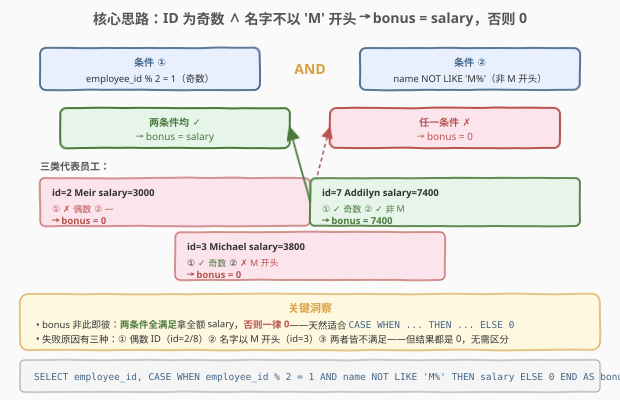
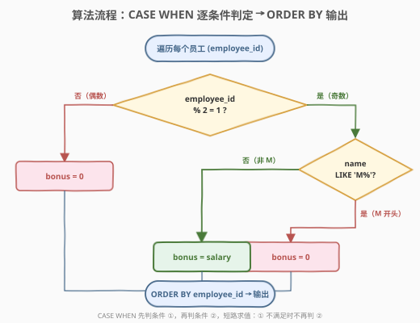
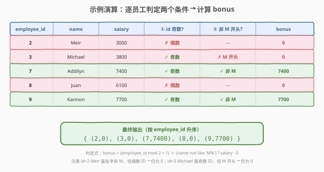

# 计算特殊奖金

- **题目名称**：计算特殊奖金
- **链接**：[1873. 计算特殊奖金](https://leetcode.cn/problems/calculate-special-bonus/)
- **难度**：简单
- **标签**：SQL、条件表达式、`CASE WHEN`、取模运算、`LIKE` 模式匹配、`ORDER BY`

## 1. 题目概述

给定一张表 `Employees`，每行记录员工编号、姓名和工资。要求计算每位员工的**特殊奖金**：

- 奖金 = **工资的 100%**，当且仅当**同时满足**两个条件：
  1. `employee_id` 是**奇数**；
  2. `name` **不以字符 `'M'`** 开头。
- 否则奖金 = **0**。

结果按 `employee_id` **升序**排列，输出两列：`employee_id`、`bonus`。

**表结构**：

```text
Table: Employees
+-------------+---------+
| Column Name | Type    |
+-------------+---------+
| employee_id | int     |  ← 员工主键
| name        | varchar |  ← 员工姓名
| salary      | int     |  ← 工资
+-------------+---------+
(employee_id 是主键)
```

> ⚠️ **两个条件是「与」关系**：必须**同时**满足「奇数 ID」和「名字非 M 开头」才发奖金。任一不满足，奖金即为 0——不存在「满足一半给半薪」的中间态。这种非此即彼的逻辑天然适合 `CASE WHEN ... THEN ... ELSE 0`。

**示例 1**：

```text
输入：
Employees 表:
+-------------+---------+--------+
| employee_id | name    | salary |
+-------------+---------+--------+
| 2           | Meir    | 3000   |
| 3           | Michael | 3800   |
| 7           | Addilyn | 7400   |
| 8           | Juan    | 6100   |
| 9           | Kannon  | 7700   |
+-------------+---------+--------+

输出：
+-------------+-------+
| employee_id | bonus |
+-------------+-------+
| 2           | 0     |
| 3           | 0     |
| 7           | 7400  |
| 8           | 0     |
| 9           | 7700  |
+-------------+-------+
```

**解释**：

| employee_id | name | salary | ① id 奇数？ | ② 名字非 M 开头？ | 两条件均满足？ | bonus |
|-------------|------|--------|-------------|-------------------|----------------|-------|
| 2 | Meir | 3000 | ✗ 偶数 | ✓（但 ① 已失败，短路） | ✗ | 0 |
| 3 | Michael | 3800 | ✓ 奇数 | ✗ M 开头 | ✗ | 0 |
| 7 | Addilyn | 7400 | ✓ 奇数 | ✓ 非 M | ✓ | 7400 |
| 8 | Juan | 6100 | ✗ 偶数 | ✓（但 ① 已失败） | ✗ | 0 |
| 9 | Kannon | 7700 | ✓ 奇数 | ✓ 非 M | ✓ | 7700 |

**约束条件**：

- `employee_id` 为 `Employees` 表主键，行唯一无重复。
- `salary` 为正整数。
- 结果按 `employee_id` 升序返回，仅需输出 `employee_id` 和 `bonus` 两列。

> 💡 **关键结构**：本题是 SQL **"条件表达式（CASE WHEN）+ 取模 + 模式匹配"入门招牌题**——核心是用 `CASE WHEN <条件> THEN salary ELSE 0 END` 把「满足条件发奖金，否则归零」的非此即彼逻辑一行表达。考点在三件事：① 把「奇数」翻译成 `employee_id % 2 = 1`；② 把「不以 M 开头」翻译成 `name NOT LIKE 'M%'`；③ 两条件用 `AND` 连接放 `WHEN` 里。难度不在算法，在 SQL 条件表达式的正确拼写。

---

## 2. 解题思路

### 2.1 暴力思路：逐行 if-else 模拟

最直觉的过程式思维是：遍历 `Employees` 每一行，逐员工检查两个条件——先看 `employee_id` 是否奇数，再看 `name` 是否以 `'M'` 开头；两个都满足则奖金等于 `salary`，否则为 0。

```text
result = []
for emp in Employees:
    if emp.employee_id % 2 == 1 and not emp.name.startswith('M'):
        bonus = emp.salary
    else:
        bonus = 0
    result.append((emp.employee_id, bonus))
result.sort(by=employee_id)
return result
```

逻辑完全正确，但这是**命令式思维**——SQL 不该用循环写。SQL 的声明式范式里，「逐行条件判断」直接对应 `CASE WHEN` 表达式，一行就能表达「满足则取 A，否则取 B」。

> ⚠️ **症结**：① 过程式思维把简单条件判断写成循环，啰嗦且非 SQL 惯用；② 两个条件容易写漏——奇数判定写成 `employee_id % 2 = 1`（不是 `!= 0`，负数取模有坑但本题全正）、名字判定用 `NOT LIKE 'M%'`（不是 `!= 'M%'`，`!=` 不是模式匹配）。`CASE WHEN` 把这些条件一次性声明清楚。

### 2.2 核心观察：CASE WHEN 条件表达式



把「**满足条件发奖金，否则归零**」直接写成 `CASE WHEN <条件> THEN salary ELSE 0 END`——这是 SQL 中 **条件表达式（conditional expression）** 的标准模式：

- `WHEN employee_id % 2 = 1 AND name NOT LIKE 'M%'`：两个条件用 `AND` 连接，**同时**满足才进入 `THEN` 分支。
- `THEN salary`：满足时奖金 = 工资的 100%，即 `salary` 本身。
- `ELSE 0`：任一不满足，奖金 = 0。

**两个条件的 SQL 翻译**：

| 自然语言 | SQL 写法 | 说明 |
|----------|----------|------|
| ID 是奇数 | `employee_id % 2 = 1` | 取模运算符 `%`（或 `MOD(employee_id, 2) = 1`），奇数模 2 余 1 |
| 名字不以 M 开头 | `name NOT LIKE 'M%'` | `LIKE 'M%'` 匹配以 M 开头的字符串，`NOT` 取反；`%` 是通配符代表任意后续字符 |

> ⚠️ **`NOT LIKE 'M%'` 的两个细节**：① `'M%'` 中的 `%` 是 SQL 通配符（匹配任意长度任意字符），不是字面百分号；② 大小写敏感性取决于**数据库排序规则（collation）**——MySQL 默认 `_ci`（case-insensitive）排序规则下 `'M%'` 同时匹配 `Michael` 和 `mike`；若需严格大小写，用 `BINARY name NOT LIKE 'M%'`。本题测试用例均为大写 M 开头，默认排序规则即可。

> 💡 **直觉理解**：把 `CASE WHEN` 想成一个「安检门」——每位员工依次通过，安检门检查两件事：ID 是不是奇数、名字是不是 M 打头。两关都过 → 拿全额工资；任一关被拦下 → 奖金归零。`ELSE 0` 就是「被拦下的默认下场」。

### 2.3 算法流程图



**逻辑执行步骤**：

| 步骤 | 子句 | 作用 |
|------|------|------|
| ① | `SELECT employee_id, CASE WHEN ... END AS bonus` | 对每行计算条件表达式，输出员工编号与奖金 |
| ② | `WHEN employee_id % 2 = 1 AND name NOT LIKE 'M%'` | 判定两个条件是否同时满足（`AND` 短路求值） |
| ③ | `THEN salary ELSE 0` | 满足 → 取工资；不满足 → 归零 |
| ④ | `FROM Employees` | 读取全部员工 |
| ⑤ | `ORDER BY employee_id` | 按员工编号升序排列输出 |

> 💡 **SQL 子句执行顺序**：`FROM` → `SELECT`（含 `CASE WHEN` 求值）→ `ORDER BY`。`CASE WHEN` 在 `SELECT` 阶段对每行求值，此时 `ORDER BY` 尚未生效——条件判定与排序互不干扰。`ORDER BY employee_id` 在最后对结果行排序，保证输出按编号升序。

> ⚠️ **AND 的短路求值**：`employee_id % 2 = 1 AND name NOT LIKE 'M%'` 中，若 `employee_id % 2 = 1` 为 `FALSE`，SQL 引擎**可能**不再求值第二个条件（`AND` 短路）。但 SQL 标准不保证短路顺序——别依赖副作用。本题两条件均无副作用，短路与否不影响结果。

### 2.4 示例演算

以示例 1 数据为例，观察 5 位员工的逐行判定：



**逐行分析**：

| employee_id | name | ① id % 2 = 1? | ② name NOT LIKE 'M%'? | AND 结果 | THEN / ELSE | bonus |
|-------------|------|---------------|------------------------|----------|-------------|-------|
| 2 | Meir | `2 % 2 = 0` → ✗ | ✓（Meir 非 M 开头） | `FALSE` | `ELSE 0` | 0 |
| 3 | Michael | `3 % 2 = 1` → ✓ | ✗（Michael 以 M 开头） | `FALSE` | `ELSE 0` | 0 |
| 7 | Addilyn | `7 % 2 = 1` → ✓ | ✓（Addilyn 非 M 开头） | `TRUE` | `THEN salary` | 7400 |
| 8 | Juan | `8 % 2 = 0` → ✗ | ✓（Juan 非 M 开头） | `FALSE` | `ELSE 0` | 0 |
| 9 | Kannon | `9 % 2 = 1` → ✓ | ✓（Kannon 非 M 开头） | `TRUE` | `THEN salary` | 7700 |

**排序后输出**（`ORDER BY employee_id`）：

| employee_id | bonus |
|------------|-------|
| 2          | 0     |
| 3          | 0     |
| 7          | 7400  |
| 8          | 0     |
| 9          | 7700  |

与示例输出一致。

> 💡 **易错点对照**：id=2 的 Meir 名字虽不以 M 开头，但 ID 是偶数 → 条件 ① 失败 → 奖金 0。id=3 的 Michael ID 虽是奇数，但名字以 M 开头 → 条件 ② 失败 → 奖金 0。两种「半满足」都归零，体现 `AND` 的严格性——**两条件是乘法关系，任一为 0 则整体为 0**。

---

## 3. 参考代码

### SQL（解法 A：CASE WHEN，推荐）

```sql
SELECT employee_id,
       CASE
           WHEN employee_id % 2 = 1 AND name NOT LIKE 'M%' THEN salary
           ELSE 0
       END AS bonus
FROM Employees
ORDER BY employee_id;
```

> 💡 **写法要点**：
> - `CASE WHEN ... THEN ... ELSE ... END`：标准 SQL 条件表达式，跨数据库通用（MySQL / PostgreSQL / SQL Server / Oracle 均支持）。
> - `employee_id % 2 = 1`：`%` 是取模运算符，奇数模 2 余 1。等价写法 `MOD(employee_id, 2) = 1`。
> - `name NOT LIKE 'M%'`：`LIKE 'M%'` 匹配以 M 开头的字符串，前置 `NOT` 取反。`%` 通配任意后续字符。
> - `ELSE 0`：必须写——不满足条件时默认为 `NULL`（而非 0），会导致输出出现 `NULL` 值。
> - `ORDER BY employee_id`：题面要求按编号升序，默认 `ASC` 可省略。
> - ✓ **最自然**：一条 `CASE WHEN` 把「两条件 AND + 非此即彼」一气呵成，可读性最佳，面试首选。

### SQL（解法 B：IF 函数，MySQL 专用）

```sql
SELECT employee_id,
       IF(employee_id % 2 = 1 AND name NOT LIKE 'M%', salary, 0) AS bonus
FROM Employees
ORDER BY employee_id;
```

> 💡 **与解法 A 的区别**：`IF(cond, true_val, false_val)` 是 **MySQL 专有函数**，等价于两分支的 `CASE WHEN`。写法更紧凑（一行搞定），但**不可移植**——PostgreSQL / SQL Server / Oracle 不支持 `IF` 函数（它们用 `CASE WHEN` 或 `IIF`）。LeetCode 的 MySQL 环境可用，但面试中若被问跨数据库兼容性，应主动说明「`CASE WHEN` 是 SQL 标准，`IF` 是 MySQL 方言」。**工程实践推荐 `CASE WHEN`**。

### SQL（解法 C：MOD 函数 + LEFT）

```sql
SELECT employee_id,
       CASE
           WHEN MOD(employee_id, 2) = 1 AND LEFT(name, 1) != 'M' THEN salary
           ELSE 0
       END AS bonus
FROM Employees
ORDER BY employee_id;
```

> 💡 **写法要点**：① `MOD(employee_id, 2) = 1` 是 `%` 的函数形式，某些数据库（如 Oracle）更推荐 `MOD`；② `LEFT(name, 1) != 'M'` 取名字首字符与 'M' 比较，替代 `NOT LIKE 'M%'`。两者等价但语义不同：`LEFT` 是「取首字符做等值比较」，`LIKE` 是「模式匹配」。`LEFT(name, 1)` 在名字为空字符串时返回 `''`，`'' != 'M'` 为 `TRUE`——但题面 `name` 为 `varchar` 非空，无影响。**面试中 `NOT LIKE 'M%'` 更地道**，因为「不以 M 开头」本身就是模式匹配语义。

### Python（pandas）

```python
import pandas as pd

def calculate_special_bonus(employees: pd.DataFrame) -> pd.DataFrame:
    mask = (employees['employee_id'] % 2 == 1) & (~employees['name'].str.startswith('M'))
    employees['bonus'] = employees['salary'].where(mask, 0)
    return employees[['employee_id', 'bonus']].sort_values('employee_id')
```

> 💡 **pandas 对照**：`employee_id % 2 == 1` 对应 SQL 取模；`str.startswith('M')` 对应 `LIKE 'M%'`，前置 `~` 取反对应 `NOT`；`Series.where(cond, other)` 在条件为 `False` 处填充 `other`（0），等价于 `CASE WHEN cond THEN salary ELSE 0`。`sort_values('employee_id')` 对应 `ORDER BY`。pandas 的 `where` 语义与 `CASE WHEN` 完美对应——「条件为真保留原值，否则替换」，是 SQL→pandas 迁移的惯用桥接。

---

## 4. 复杂度分析

| 维度 | 复杂度 | 说明 |
|------|--------|------|
| **时间** | $O(n)$ | 对 `Employees` 全表扫描一次，每行做取模（$O(1)$）和首字符匹配（$O(1)$），`CASE WHEN` 逐行求值；`ORDER BY` 排序 $O(n \log n)$。总体 $O(n \log n)$，瓶颈在排序 |
| **空间** | $O(n)$ | 输出结果集大小等于员工数 $n$；排序需 $O(n)$ 辅助空间 |
| **结果行数** | $= n$ | 每位员工一行，不增不减 |

> ⚠️ SQL 复杂度取决于**执行计划与索引**。本题表小，三种写法性能相当。若 `Employees` 很大且只需查有奖金的员工，可在 `employee_id` 上建索引加速 `ORDER BY`（若已按主键有序则排序可省）。面试中说明「全表扫描 $O(n)$ + 排序 $O(n \log n)$，主键有序时排序可省」即可。

---

## 5. 扩展：条件表达式三写法对比

### 5.1 CASE WHEN vs IF vs COALESCE + NULLIF

| 维度 | `CASE WHEN` | `IF()` | `COALESCE + NULLIF` |
|------|-------------|--------|----------------------|
| **标准** | SQL 标准（全数据库通用） | MySQL 专有方言 | SQL 标准 |
| **分支数** | 多分支（`WHEN ... WHEN ... ELSE`） | 仅两分支（true/false） | 仅两值（非空 / 默认） |
| **可读性** | 最清晰，分支语义明确 | 紧凑，简单两分支时简洁 | 巧妙但隐晦，需理解 `NULLIF` |
| **可移植** | ✓ 全平台 | ✗ 仅 MySQL | ✓ 全平台 |
| **推荐场景** | 通用首选，多分支必选 | MySQL 简单两分支 | 条件恰好是「等于某值则替换为 NULL」时 |

> 💡 **`COALESCE + NULLIF` 的巧妙写法**（本题不推荐，仅作扩展）：`NULLIF(x, y)` 在 `x = y` 时返回 `NULL`，否则返回 `x`。理论上可以用 `COALESCE(NULLIF(MOD(employee_id,2),0), NULLIF(...), salary)` 拼出条件，但极度不可读——**别为了炫技用 `NULLIF` 代替 `CASE WHEN`**。`CASE WHEN` 才是条件表达式的正道。

### 5.2 奇偶判定的等价写法

| 写法 | 含义 | 备注 |
|------|------|------|
| `employee_id % 2 = 1` | 模 2 余 1 → 奇数 | `%` 运算符，MySQL / PostgreSQL 支持 |
| `MOD(employee_id, 2) = 1` | 同上，函数形式 | SQL 标准，全数据库支持 |
| `employee_id & 1 = 1` | 按位与 1 → 最低位为 1 → 奇数 | 位运算，MySQL 支持，PostgreSQL 用 `#`，可移植性差 |
| `employee_id % 2 <> 0` | 模 2 不为 0 → 奇数 | 负奇数也满足（如 $-3 \% 2 = -1 \neq 0$），更鲁棒 |

> 💡 本题 `employee_id` 为正整数主键，四种写法等价。面试中 `employee_id % 2 = 1` 最直白；若被追问「负数怎么办」，答「`% 2 <> 0` 或 `ABS(employee_id) % 2 = 1` 更鲁棒，但 employee_id 作为主键恒正，无需考虑」。

### 5.3 「不以 M 开头」的等价写法

| 写法 | 含义 | 备注 |
|------|------|------|
| `name NOT LIKE 'M%'` | 模式匹配取反 | **最地道**，「不以 M 开头」直接对应 |
| `LEFT(name, 1) != 'M'` | 取首字符不等值比较 | 语义「首字符不是 M」，等价 |
| `SUBSTRING(name, 1, 1) != 'M'` | 同上，`SUBSTRING` 形式 | SQL 标准，跨数据库 |
| `name < 'M' OR name >= 'N'` | 字典序范围 | 利用排序规则，隐晦不推荐 |

> 💡 **`NOT LIKE 'M%'` vs `LEFT(name, 1) != 'M'`**：两者在非空 `name` 下等价。区别在于空字符串 `''`：`'' NOT LIKE 'M%'` 为 `TRUE`（空串不以 M 开头），`LEFT('', 1) != 'M'` 也为 `TRUE`（`LEFT('', 1)` 返回 `''`，`'' != 'M'` 为 `TRUE`）——一致。但若 `name` 为 `NULL`：`NULL NOT LIKE 'M%'` 为 `NULL`（非 `TRUE`），`LEFT(NULL, 1) != 'M'` 也为 `NULL`——`CASE WHEN` 中 `NULL` 被视为「不满足」，走 `ELSE 0`。题面 `name` 非空，无需担心。

---

## 6. 面试要点

1. **为什么用 `CASE WHEN` 而不是多个 `WHERE` 子查询？**

   - 奖金计算是**逐行条件赋值**——每行根据自身条件产出不同 `bonus` 值（`salary` 或 0），而非「筛选某些行」。`WHERE` 是行级过滤（保留/丢弃整行），无法在同一 `SELECT` 里对同一行输出两种不同值。`CASE WHEN` 是 SQL 中**行内条件表达式**的标准工具：在 `SELECT` 阶段对每行求值，按条件返回不同值。若硬要用 `WHERE`，需写两个子查询（一个查有奖金的 `UNION` 一个查无奖金的），啰嗦且低效。

2. **`ELSE 0` 能省略吗？**

   - **不能**。`CASE WHEN` 不写 `ELSE` 时，未匹配任何 `WHEN` 的行默认返回 `NULL`——而非 0。题面要求不满足条件时 `bonus = 0`，漏写 `ELSE 0` 会输出 `NULL`，与预期不符。面试中这是常见踩坑点：**「`CASE WHEN` 不写 `ELSE` 默认返 `NULL`」**，凡是需要默认值的场景必须显式写 `ELSE`。

3. **`employee_id % 2 = 1` 和 `employee_id % 2 != 0` 有区别吗？**

   - 对**正整数**完全等价。但对**负数**有差异：`-3 % 2` 在某些数据库（如 MySQL、C 风格）返回 `-1`，此时 `-3 % 2 = 1` 为 `FALSE`（漏判负奇数），而 `-3 % 2 != 0` 为 `TRUE`（正确）。本题 `employee_id` 是正整数主键，两种写法等价。面试答：「正数场景等价；若值域含负数，用 `!= 0` 或 `ABS(x) % 2 = 1` 更鲁棒，但 employee_id 恒正无需考虑。」

4. **`NOT LIKE 'M%'` 大小写敏感吗？**

   - 取决于数据库的**排序规则（collation）**。MySQL 默认使用 `_ci`（case-insensitive）排序规则，`'M%'` 同时匹配 `Michael`、`mike`；若需严格大小写，加 `BINARY` 关键字：`name NOT LIKE BINARY 'M%'`。PostgreSQL 默认大小写敏感，`LIKE 'M%'` 只匹配大写 M。本题测试用例均为大写 M 开头，默认排序规则即可。面试答：「大小写敏感性由 collation 决定，MySQL 默认 `_ci` 不区分大小写，需严格时加 `BINARY`。」

5. **如果要把「名字以 M 开头」改成「名字包含 M」，怎么改？**

   - `name NOT LIKE 'M%'`（以 M 开头）→ `name NOT LIKE '%M%'`（包含 M）。`%` 通配符位置决定语义：`'M%'` = M 在开头，`'%M'` = M 在结尾，`'%M%'` = M 在任意位置。`_` 是单字符通配符（如 `'_M%'` = 第二个字符是 M）。面试中能讲清 `%`（任意长度）与 `_`（单字符）的区别即可。

> 💡 **一句话总结**：1873 是 SQL **"条件表达式入门招牌题"**——核心就一句 `CASE WHEN employee_id % 2 = 1 AND name NOT LIKE 'M%' THEN salary ELSE 0 END`。考点覆盖三件事：**取模判奇偶（`% 2 = 1`）、模式匹配判前缀（`NOT LIKE 'M%'`）、CASE WHEN 的 ELSE 默认值（漏写变 NULL）**。掌握这条骨架，所有「逐行条件赋值」类 SQL 题都能迁移。

---

## 7. 同类练习题

- [1876. 长度为三且各字符不同的子字符串](https://leetcode.cn/problems/substrings-of-size-three-with-distinct-characters/)：字符串滑窗 + 条件计数——对照 1873 理解「逐行条件判定」在字符串场景的迁移，`CASE WHEN` 同样适用
- [627. 变更性别](https://leetcode.cn/problems/swap-salary/)：`UPDATE` + `CASE WHEN` 条件更新——与 1873 共享 `CASE WHEN` 骨架，但从 `SELECT` 查询迁移到 `UPDATE` 写入，理解条件表达式在读与写两种语境的用法
- [196. 删除重复的电子邮箱](https://leetcode.cn/problems/delete-duplicate-emails/)：`DELETE` + 自连接条件——对照 1873 理解「条件表达式赋值」与「条件过滤删除」的区别，`CASE WHEN` 产出列值 vs `WHERE` 筛选行
- [1667. 修复表中的名字](https://leetcode.cn/problems/fix-names-in-a-table/)：字符串函数 `CONCAT` + `UPPER` + `LOWER` + `CASE WHEN`——与 1873 同为「`SELECT` + 字符串处理 + 条件表达式」组合，扩展字符串函数库
- [1527. 患者确诊感染比例](https://leetcode.cn/problems/patients-with-a-condition/)：`LIKE` 模式匹配 + `ROUND` + `CASE WHEN` 聚合——与 1873 共享 `LIKE` 模式匹配，但升级到「分组聚合 + 比例计算」，理解 `CASE WHEN` 在聚合统计中的计数用法（`SUM(CASE WHEN ... THEN 1 ELSE 0 END)`）
