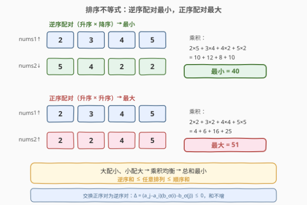
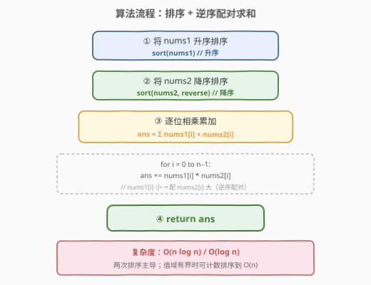

# LeetCode 两个数组的最小乘积和 题解

## 1. 题目概述

- **标题 / 题号**：两个数组的最小乘积和（#1874，medium）
- **链接**：https://leetcode.cn/problems/minimize-product-sum-of-two-arrays/
- **难度**：中等
- **标签**：贪心、排序、数组、数学

**题意**：给定两个长度为 $n$ 的正整数数组 `nums1` 和 `nums2`，你可以任意重排其中一个或两个数组的元素顺序。定义**乘积和**为：

$$\text{productSum} = \sum_{i=0}^{n-1} \text{nums1}[i] \times \text{nums2}[i]$$

返回重排后能达到的**最小乘积和**。

**示例 1**：

```text
输入：nums1 = [5,3,4,2], nums2 = [4,2,2,5]
输出：40
解释：将 nums1 重排为 [2,3,4,5]，nums2 重排为 [5,4,2,2]，
      乘积和 = 2×5 + 3×4 + 4×2 + 5×2 = 10+12+8+10 = 40。
```

**示例 2**：

```text
输入：nums1 = [2,1,4,5,7], nums2 = [3,2,4,8,6]
输出：65
解释：将 nums1 升序排为 [1,2,4,5,7]，nums2 降序排为 [8,6,4,3,2]，
      乘积和 = 1×8 + 2×6 + 4×4 + 5×3 + 7×2 = 8+12+16+15+14 = 65。
```

**约束**：

- $n = \text{nums1.length} = \text{nums2.length}$
- $1 \le n \le 10^5$
- $1 \le \text{nums1}[i], \text{nums2}[i] \le 100$

> 💡 **关键直觉**：两个数组的配对顺序决定了乘积和的大小。直觉上，「大数配小数」能互相「压制」——大的被小的拉低、小的被大的抬升，乘积趋于均衡，总和最小；反之「大配大、小配小」会两极分化，总和最大。这背后是经典的**排序不等式**（rearrangement inequality）。

## 2. 解题思路

### 2.1 暴力思路：全排列枚举

枚举 `nums1` 的所有 $n!$ 种排列（`nums2` 固定不变），对每种排列计算乘积和取最小值。时间 $O(n! \cdot n)$，$n = 10^5$ 时完全不可行。

> ⚠️ 瓶颈：全排列爆炸增长，$n = 15$ 时 $15! \approx 1.3 \times 10^{12}$ 已无法枚举。必须利用数学结构跳过枚举。

### 2.2 核心观察：排序不等式（逆序配对最小）



**排序不等式**：设 $a_1 \le a_2 \le \cdots \le a_n$ 和 $b_1 \le b_2 \le \cdots \le b_n$ 为两个升序排列的序列，$b$ 的任意排列记为 $b_{\sigma(1)}, b_{\sigma(2)}, \cdots, b_{\sigma(n)}$，则：

$$\sum_{i=1}^{n} a_i \cdot b_{n+1-i} \;\le\; \sum_{i=1}^{n} a_i \cdot b_{\sigma(i)} \;\le\; \sum_{i=1}^{n} a_i \cdot b_i$$

- **右端（正序配对）**：升序配升序（大配大、小配小），乘积和**最大**。
- **左端（逆序配对）**：升序配降序（大配小、小配大），乘积和**最小**。

本题求最小值，故将一个数组**升序**、另一个**降序**后逐位相乘累加即可。

**交换论证**：设 $a_1 \le \cdots \le a_n$，$b_1 \le \cdots \le b_n$ 均已升序。考察排列 $\sigma$ 中的一对位置 $i < j$，若 $\sigma(i) < \sigma(j)$（即 $a_i \le a_j$ 配了 $b_{\sigma(i)} \le b_{\sigma(j)}$，**正序对**），将这两个 $b$ 交换为逆序配对后，和的变化量：

$$\Delta = \left(a_i b_{\sigma(j)} + a_j b_{\sigma(i)}\right) - \left(a_i b_{\sigma(i)} + a_j b_{\sigma(j)}\right) = (a_j - a_i)\left(b_{\sigma(i)} - b_{\sigma(j)}\right) \le 0$$

因为 $a_j - a_i \ge 0$ 且 $b_{\sigma(i)} - b_{\sigma(j)} \le 0$。即**正序对交换为逆序对后，和不增**。反复交换直到整个排列变为完全逆序（$\sigma(i) = n+1-i$），和单调下降到全局最小。

> 💡 **一句话记忆**：「大配小、小配大」→ 乘积和最小；「大配大、小配小」→ 乘积和最大。本题取前者。

### 2.3 算法流程图



只需三步：① 将 `nums1` 升序排序；② 将 `nums2` 降序排序；③ 逐位相乘累加。时间 $O(n \log n)$，空间 $O(\log n)$（排序栈）或 $O(1)$ 额外空间。

### 2.4 示例演算

![示例演算：nums1=[5,3,4,2], nums2=[4,2,2,5] 的逆序配对过程](../images/1874_example_walkthrough.svg)

以示例 1 为例：

| 步骤 | nums1 | nums2 | 配对 | 乘积 | 累计和 |
|------|-------|-------|------|------|--------|
| 排序前 | [5,3,4,2] | [4,2,2,5] | — | — | — |
| nums1 升序 | [2,3,4,5] | — | — | — | — |
| nums2 降序 | — | [5,4,2,2] | — | — | — |
| $i=0$ | 2 | 5 | 2×5 | 10 | 10 |
| $i=1$ | 3 | 4 | 3×4 | 12 | 22 |
| $i=2$ | 4 | 2 | 4×2 | 8 | 30 |
| $i=3$ | 5 | 2 | 5×2 | 10 | 40 |

最终答案 = **40**。

**对照**（正序配对 = 最大值）：`[2,3,4,5]` 配 `[2,2,4,5]` = $4+6+16+25 = 51$，比 40 大，验证逆序配对确实更小。

> 💡 **为何不用搜索中间状态？** 排序不等式告诉我们最大和最小都在排序配对中产生——不存在某种「半乱序」配对 比 逆序更小。一旦两数组各自有序，最优配对就是两个极端（正序或逆序），无需搜索中间状态。

## 3. 参考代码

### Python

```python
class Solution:
    def minProductSum(self, nums1: list[int], nums2: list[int]) -> int:
        nums1.sort()
        nums2.sort(reverse=True)
        return sum(a * b for a, b in zip(nums1, nums2))
```

### C++

```cpp
class Solution {
public:
    int minProductSum(vector<int>& nums1, vector<int>& nums2) {
        sort(nums1.begin(), nums1.end());
        sort(nums2.begin(), nums2.end(), greater<int>());
        int ans = 0;
        for (int i = 0; i < (int)nums1.size(); i++) {
            ans += nums1[i] * nums2[i];
        }
        return ans;
    }
};
```

### C++（反向迭代器变体）

```cpp
class Solution {
public:
    int minProductSum(vector<int>& nums1, vector<int>& nums2) {
        sort(nums1.begin(), nums1.end());
        sort(nums2.rbegin(), nums2.rend());
        int ans = 0;
        for (int i = 0; i < (int)nums1.size(); i++) {
            ans += nums1[i] * nums2[i];
        }
        return ans;
    }
};
```

> 💡 **实现细节**：① 只需排一个升序、一个降序——「哪个升哪个降」无所谓，结果相同（交换两数组的角色不改变逆序配对关系）；② Python 的 `sort(reverse=True)` 与 C++ 的 `greater<int>()` 或 `rbegin()/rend()` 等价；③ 本题元素 $\le 100$、$n \le 10^5$，最大乘积和 $= 10^5 \times 100 \times 100 = 10^9$，在 32 位 `int` 范围内（$\approx 2.1 \times 10^9$），无需 `long long`。

> ⚠️ **若约束放大**：若题目改为 $\text{nums}[i] \le 10^5$，最坏乘积和可达 $10^5 \times (10^5)^2 = 10^{15}$，超出 `int` 范围。此时 C++ 需用 `long long` 累加。面试中可主动提及此边界，展示对溢出的敏感度。

## 4. 复杂度分析

| 维度 | 复杂度 | 说明 |
|------|--------|------|
| 时间复杂度 | $O(n \log n)$ | 两次排序主导，各 $O(n \log n)$；逐位求和 $O(n)$ 被吸收 |
| 空间复杂度 | $O(\log n)$ | 排序递归栈（C++ 内省排序 / Python Timsort）；不计输入数组则为 $O(1)$ 额外空间 |

> 💡 **能否 $O(n)$？** 若利用元素值域 $[1, 100]$ 有界，可用**计数排序**（值域 $100$ 的桶）在 $O(n + V)$ 时间内完成排序。但 $V = 100$ 远小于 $n$，计数排序后双指针（一头取最小、一头取最大）配对求和即可做到 $O(n)$。不过比较排序 $O(n \log n)$ 在 $n = 10^5$ 时已足够快（$\approx 1.7 \times 10^6$ 次比较），面试中作为「知道值域时的进阶优化」提及即可。

## 5. 扩展：排序不等式与配对问题

### 5.1 排序不等式的完整表述

对两个序列 $a$（升序）和 $b$（升序），$b$ 的任意排列 $\sigma$ 有：

$$\sum_{i=1}^{n} a_i b_{n+1-i} \le \sum_{i=1}^{n} a_i b_{\sigma(i)} \le \sum_{i=1}^{n} a_i b_i$$

左端叫**逆序和**（最小），右端叫**顺序和**（最大）。等号成立当且仅当 $a$ 或 $b$ 中元素全相等（此时任意配对都一样）。

### 5.2 若改为「最大化乘积和」

将两数组都升序（或都降序）后逐位相乘即为最大值。排序不等式的另一半，理解了最小化就自然懂最大化。

### 5.3 若数组含负数

排序不等式对任意实数序列成立（不等号方向不变），逆序配对仍是最小。但「最大乘积」可能出现在负 $\times$ 负（正）上，直觉可能失效——严格依赖排序不等式而非直觉。

### 5.4 关联：最小化「差的平方和」

$$\sum (a_i - b_{\sigma(i)})^2 = \sum a_i^2 + \sum b_i^2 - 2\sum a_i b_{\sigma(i)}$$

前两项与排列无关，故**最小化差的平方和 $\Leftrightarrow$ 最大化乘积和** $\Leftrightarrow$ 正序配对；反之**最大化差的平方和 $\Leftrightarrow$ 最小化乘积和** $\Leftrightarrow$ 逆序配对（即本题）。

## 6. 面试要点

**Q1：为什么逆序配对能得到最小乘积和？**

> 由排序不等式，升序序列配降序序列（逆序和）$\le$ 任意排列的乘积和。交换论证：若存在「正序对」（小 $a$ 配小 $b$、大 $a$ 配大 $b$），交换为逆序对后和的变化量 $\Delta = (a_j - a_i)(b_{\sigma(i)} - b_{\sigma(j)}) \le 0$，和下降。反复交换直到完全逆序，达到全局最小。

**Q2：需要排两个数组吗？只排一个行不行？**

> 题目允许重排任意一个或两个数组。实际只需把一个升序、另一个降序即可——「哪个升哪个降」结果相同。也可以固定一个数组不动，只对另一个按前者的逆序来排，但代码上分别排序最简洁。

**Q3：时间复杂度能优于 $O(n \log n)$ 吗？**

> 若元素值域有界（本题 $[1, 100]$），可用计数排序做到 $O(n + V)$，$V = 100$ 时即 $O(n)$。若值域未知或无界，基于比较的排序 $O(n \log n)$ 是下界。

**Q4：如果数组含负数，结论还成立吗？**

> 排序不等式对任意实数成立，逆序配对仍是最小乘积和。但「最大乘积和」的直觉可能失效——含负数时两个负数相乘为正可能很大。严格依赖排序不等式（顺序和最大），而非「大配大」的直觉。

**Q5：如何扩展到「最小化差的平方和」？**

> 展开 $\sum(a_i - b_{\sigma(i)})^2 = \sum a_i^2 + \sum b_i^2 - 2\sum a_i b_{\sigma(i)}$。前两项与排列无关，故最小化差的平方和等价于**最大化**乘积和（正序配对），最大化差的平方和等价于**最小化**乘积和（逆序配对，即本题）。

> 💡 **一句话总结**：排序不等式保证「升序配降序 = 逆序和 = 最小乘积和」，$O(n \log n)$ 排序后逐位相乘即可，是配对优化问题的母题级结论。

## 同类练习题

| # | 题目 | 与本题的关联 |
|---|------|-------------|
| 881 | [救生艇](https://leetcode.cn/problems/boats-to-save-people/) | 排序 + 双指针贪心配对（最轻配最重能否同船），同为「排序后配对优化」的贪心范式 |
| 561 | [数组拆分](https://leetcode.cn/problems/array-partition/) | 排序后取相邻配对的最小值之和最大，排序不等式在「自身配对」上的变体 |
| 2144 | [打折购买糖果的最小花费](https://leetcode.cn/problems/minimum-cost-of-buying-candies-with-discount/) | 排序 + 贪心取免费配对，配对优化的另一面 |
| 1833 | [雪糕的最大数量](https://leetcode.cn/problems/maximum-ice-cream-bars/)（[站内题解](../1801-1900/1833_雪糕的最大数量.md)） | 排序 + 贪心累计，排序后线性扫描做最优选择的同类模板 |
