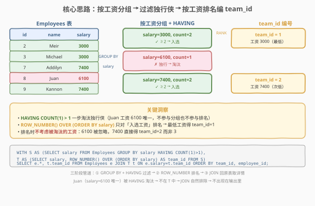
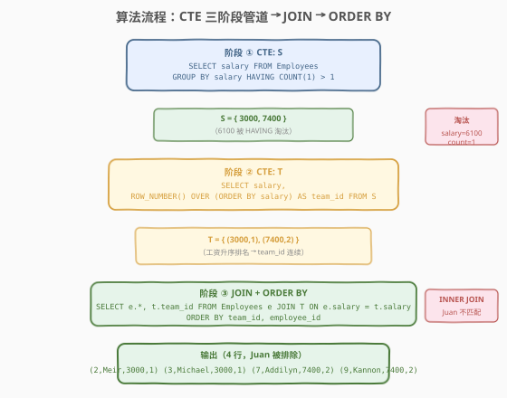
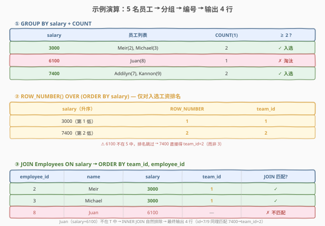

# LeetCode 将工资相同的雇员分组 题解

## 1. 题目概述

- **标题 / 题号**：将工资相同的雇员分组（#1875，medium）
- **链接**：https://leetcode.cn/problems/group-employees-of-the-same-salary/
- **难度**：中等
- **标签**：SQL、`GROUP BY`、`HAVING`、窗口函数、`ROW_NUMBER`、`CTE`、`JOIN`

**题意**：给定一张表 `Employees`，每行记录员工编号、姓名和工资。公司想将**工资相同**的雇员划分到同一个组中，并为每个组分配一个 `team_id`。分组规则如下：

1. 每个组至少由 **2 名**雇员组成。
2. 同一组中所有雇员工资相同；工资相同的所有雇员必须分到同一组。
3. 如果某雇员工资**独一无二**（无人与之同薪），则**不**分配到任何组。
4. `team_id` 基于该组工资相对于**其他组**的排名——工资**最低**的组 `team_id = 1`。排名时**不考虑**未分组雇员的工资。

结果按 `team_id` **升序**排列，`team_id` 相同则按 `employee_id` **升序**排列。输出四列：`employee_id`、`name`、`salary`、`team_id`。

**表结构**：

```text
Table: Employees
+-------------+---------+
| Column Name | Type    |
+-------------+---------+
| employee_id | int     |  ← 员工主键（唯一值）
| name        | varchar |  ← 员工姓名
| salary      | int     |  ← 工资
+-------------+---------+
(employee_id 是这张表具有唯一值的列)
```

**示例 1**：

```text
输入：
Employees 表:
+-------------+---------+--------+
| employee_id | name    | salary |
+-------------+---------+--------+
| 2           | Meir    | 3000   |
| 3           | Michael | 3000   |
| 7           | Addilyn | 7400   |
| 8           | Juan    | 6100   |
| 9           | Kannon  | 7400   |
+-------------+---------+--------+

输出：
+-------------+---------+--------+---------+
| employee_id | name    | salary | team_id |
+-------------+---------+--------+---------+
| 2           | Meir    | 3000   | 1       |
| 3           | Michael | 3000   | 1       |
| 7           | Addilyn | 7400   | 2       |
| 9           | Kannon  | 7400   | 2       |
+-------------+---------+--------+---------+
```

**解释**：

| employee_id | name | salary | 同薪人数 | 是否分组 | team_id | 说明 |
|-------------|------|--------|----------|----------|---------|------|
| 2 | Meir | 3000 | 2（含 id=3） | ✓ | 1 | 工资最低的组 → team_id=1 |
| 3 | Michael | 3000 | 2（含 id=2） | ✓ | 1 | 与 Meir 同组 |
| 7 | Addilyn | 7400 | 2（含 id=9） | ✓ | 2 | 工资次低的组 → team_id=2 |
| 8 | Juan | 6100 | 1（仅自己） | ✗ | — | 独行侠，不参与分组也不参与排名 |
| 9 | Kannon | 7400 | 2（含 id=7） | ✓ | 2 | 与 Addilyn 同组 |

**约束**：

- `employee_id` 为 `Employees` 表具有唯一值的列。
- `salary` 为正整数。
- 结果仅包含被分配到组的雇员，按 `team_id` 升序、`employee_id` 升序排列。

> 💡 **关键结构**：本题是 SQL **"分组聚合 + 窗口函数排名 + JOIN 回查"三段式招牌题**——核心难点不在单条语法，而在于把「过滤独行侠」「按工资排名编号」「回连取详情」三件事拆成清晰的管道阶段。`GROUP BY ... HAVING COUNT(1) > 1` 一刀切掉唯一工资，`ROW_NUMBER() OVER (ORDER BY salary)` 只对存活工资连续编号，`INNER JOIN` 自然排除未分组雇员——三步各司其职，层层过滤。

## 2. 解题思路

### 2.1 暴力思路：过程式逐行扫描

最直觉的命令式思维是：遍历 `Employees` 每一行，对每个员工去全表查「跟我同薪的有几人」；如果 $> 1$，记录该工资并参与排名；最后把同薪员工归到一组、按工资升序分配 `team_id`。

```text
salary_count = {}  # 工资 → 人数
for emp in Employees:
    salary_count[emp.salary] = salary_count.get(emp.salary, 0) + 1

grouped_salaries = sorted([s for s, c in salary_count.items() if c > 1])
team_map = {s: i+1 for i, s in enumerate(grouped_salaries)}  # 工资 → team_id

result = []
for emp in Employees:
    if emp.salary in team_map:
        result.append((emp.employee_id, emp.name, emp.salary, team_map[emp.salary]))
result.sort(by=(team_id, employee_id))
return result
```

逻辑正确，但这是**命令式思维**——SQL 不该用循环和字典写。SQL 的声明式范式里，「按工资统计人数并过滤」对应 `GROUP BY ... HAVING`，「按工资排名编号」对应窗口函数 `ROW_NUMBER() OVER (ORDER BY ...)`，「回连取详情」对应 `JOIN`。三步都能用集合操作一次表达，无需逐行扫描。

> ⚠️ **症结**：① 过程式思维把「分组 + 排名 + 关联」三件事糅在一个循环里，逻辑交织难维护；② 「排名时不考虑未分组工资」这条规则在过程式写法中需要额外标记哪些工资被淘汰——而 SQL 的 `HAVING` 先过滤再排名，管道天然保证「淘汰的工资不进入排名」。

### 2.2 核心观察：CTE 三阶段管道



把问题拆成**三个集合操作阶段**，用 CTE（Common Table Expression，公用表表达式）串联：

| 阶段 | CTE | SQL 操作 | 产出 |
|------|-----|----------|------|
| ① 过滤 | `S` | `GROUP BY salary HAVING COUNT(1) > 1` | 只保留出现 $\geq 2$ 次的工资 |
| ② 排名 | `T` | `ROW_NUMBER() OVER (ORDER BY salary)` | 每个存活工资分配连续 `team_id` |
| ③ 关联 | 主查询 | `Employees JOIN T ON salary` | 回连原表取员工详情 |

**阶段 ①：`HAVING COUNT(1) > 1` 一刀淘汰独行侠**

`GROUP BY salary` 把员工按工资分桶，`COUNT(1)` 数每桶人数。`HAVING COUNT(1) > 1` 只保留人数 $\geq 2$ 的桶——工资独一无二的员工（如 Juan 的 6100）整桶被过滤掉。这一步是**分组级过滤**（区别于 `WHERE` 的行级过滤）：`WHERE` 在分组前逐行筛选，`HAVING` 在分组后按聚合结果筛选桶。

> ⚠️ **`WHERE` vs `HAVING`**：`WHERE employee_id > 5` 过滤的是「行」（某员工是否满足条件），`HAVING COUNT(1) > 1` 过滤的是「组」（某工资桶是否满足条件）。本题需要「同薪人数 ≥ 2」这个**聚合后**的判断，必须用 `HAVING`——`WHERE` 无法引用 `COUNT()`。

**阶段 ②：`ROW_NUMBER()` 只对存活工资排名**

经过阶段 ① 后，`S` 中只剩 $\{3000, 7400\}$（6100 已被淘汰）。`ROW_NUMBER() OVER (ORDER BY salary)` 对这两个工资升序编号：3000 → 1，7400 → 2。**关键**：排名时 6100 不在 `S` 中，所以 7400 直接得 2 而非 3——这正是题面「排名时不需要考虑没有组的雇员的工资」的含义。管道的「先过滤后排名」天然实现了这条规则。

> 💡 **为何 `ROW_NUMBER` 而非 `DENSE_RANK`？** 经过 `GROUP BY salary` 后，`S` 中每个工资只出现一次（已去重），`ROW_NUMBER`、`RANK`、`DENSE_RANK` 三者完全等价——都产出连续无间隔的整数序号。选 `ROW_NUMBER` 因其语义最直白：「第几行」。详见第 5 节扩展。

**阶段 ③：`INNER JOIN` 自然排除未分组雇员**

`Employees JOIN T ON e.salary = t.salary` 是 `INNER JOIN`——只有 `salary` 在 `T` 中存在的员工才会出现在结果里。Juan 的 6100 不在 `T` 中（被阶段 ① 淘汰），JOIN 时找不到匹配行，自然不出现。无需额外 `WHERE` 过滤——`INNER JOIN` 的语义本身就是「只留匹配的」。

> 💡 **直觉理解**：把整个查询想象一条流水线——员工们排队进入「同薪检测站」（`GROUP BY + HAVING`），独行侠被拦在门外；通过的人按工资从低到高领取编号牌（`ROW_NUMBER`）；最后回到原队伍核对身份（`JOIN`），没领到牌的人自然不在最终名单里。

### 2.3 算法流程图



**逻辑执行步骤**：

| 步骤 | 子句 | 作用 |
|------|------|------|
| ① | `WITH S AS (SELECT salary FROM Employees GROUP BY salary HAVING COUNT(1) > 1)` | 按工资分组，保留出现 $\geq 2$ 次的工资 |
| ② | `T AS (SELECT salary, ROW_NUMBER() OVER (ORDER BY salary) AS team_id FROM S)` | 对存活工资升序编号 |
| ③ | `SELECT e.*, t.team_id FROM Employees e JOIN T ON e.salary = t.salary` | 回连原表，INNER JOIN 排除未分组员工 |
| ④ | `ORDER BY team_id, employee_id` | 按 team_id 升序、employee_id 升序排列输出 |

> 💡 **SQL 子句执行顺序**：`FROM`/`JOIN` → `WHERE` → `GROUP BY` → `HAVING` → `SELECT`（含窗口函数）→ `ORDER BY`。CTE `S` 在 `GROUP BY` + `HAVING` 阶段完成过滤；CTE `T` 在 `SELECT` 阶段调用窗口函数排名；主查询的 `JOIN` 在 `FROM` 阶段完成关联；`ORDER BY` 最后排序。

> ⚠️ **窗口函数的执行时机**：`ROW_NUMBER() OVER (ORDER BY salary)` 在 `SELECT` 阶段求值——此时 `GROUP BY` + `HAVING` 已完成，`S` 的行集已确定。窗口函数作用于 `S` 的全部行（无 `PARTITION BY`），按 `salary` 升序编号。理解这一时序有助于解释「为何 6100 不参与排名」——它在 `HAVING` 阶段已被移除，根本没进入 `T` 的输入。

### 2.4 示例演算

以示例 1 数据为例，观察三阶段管道的逐层变换：



**阶段 ① 输出（CTE `S`）**：

| salary | 员工列表 | COUNT(1) | HAVING 过滤 |
|--------|----------|----------|-------------|
| 3000 | Meir(2), Michael(3) | 2 | ✓ 入选 |
| 6100 | Juan(8) | 1 | ✗ 淘汰 |
| 7400 | Addilyn(7), Kannon(9) | 2 | ✓ 入选 |

`S = { 3000, 7400 }`（6100 被淘汰）。

**阶段 ② 输出（CTE `T`）**：

| salary（升序） | ROW_NUMBER | team_id |
|----------------|------------|---------|
| 3000（第 1 低） | 1 | 1 |
| 7400（第 2 低） | 2 | 2 |

`T = { (3000, 1), (7400, 2) }`。注意 6100 不在 `S` 中，排名跳过，7400 直接得 2。

**阶段 ③ 输出（JOIN + ORDER BY）**：

| employee_id | name | salary | team_id | JOIN 匹配? |
|-------------|------|--------|---------|------------|
| 2 | Meir | 3000 | 1 | ✓ |
| 3 | Michael | 3000 | 1 | ✓ |
| 7 | Addilyn | 7400 | 2 | ✓ |
| 8 | Juan | 6100 | — | ✗ 不匹配，排除 |
| 9 | Kannon | 7400 | 2 | ✓ |

Juan 的 6100 在 `T` 中无匹配 → `INNER JOIN` 排除 → 最终输出 4 行。排序后与示例输出一致。

> 💡 **易错点对照**：若误用 `LEFT JOIN`，Juan 会出现在结果中且 `team_id = NULL`——不符合「不分配到任何组」的要求（题面要求输出中**不包含**未分组雇员）。`INNER JOIN` 是正确选择：未匹配即丢弃。

## 3. 参考代码

### SQL（解法 A：CTE + ROW_NUMBER，推荐）

```sql
WITH
    S AS (
        SELECT salary
        FROM Employees
        GROUP BY salary
        HAVING COUNT(1) > 1
    ),
    T AS (
        SELECT salary, ROW_NUMBER() OVER (ORDER BY salary) AS team_id
        FROM S
    )
SELECT e.employee_id, e.name, e.salary, t.team_id
FROM
    Employees AS e
    JOIN T AS t ON e.salary = t.salary
ORDER BY t.team_id, e.employee_id;
```

> 💡 **写法要点**：
> - `WITH S AS (...), T AS (...)`：CTE 把三阶段管道写成自顶向下的可读结构——`S` 过滤、`T` 排名、主查询关联。CTE 之间可引用前一个 CTE 的结果（`T` 引用 `S`），形成数据流。
> - `GROUP BY salary HAVING COUNT(1) > 1`：`COUNT(1)` 等价于 `COUNT(*)`，数每桶行数。`HAVING` 在分组后过滤，保留人数 $\geq 2$ 的工资桶。
> - `ROW_NUMBER() OVER (ORDER BY salary)`：窗口函数，无 `PARTITION BY` 则对全部行统一编号，按 `salary` 升序从 1 开始。
> - `JOIN T ON e.salary = t.salary`：默认 `INNER JOIN`，只有 `salary` 在 `T` 中的员工才出现。
> - `ORDER BY t.team_id, e.employee_id`：先按组号升序，同组内按员工编号升序。
> - ✓ **最清晰**：CTE 三段式结构直译题意，面试首选。

### SQL（解法 B：子查询 + DENSE_RANK）

```sql
SELECT e.employee_id, e.name, e.salary, t.team_id
FROM
    Employees AS e
    JOIN (
        SELECT salary, DENSE_RANK() OVER (ORDER BY salary) AS team_id
        FROM (
            SELECT salary
            FROM Employees
            GROUP BY salary
            HAVING COUNT(1) > 1
        ) AS s
    ) AS t ON e.salary = t.salary
ORDER BY t.team_id, e.employee_id;
```

> 💡 **与解法 A 的区别**：把 CTE 换成嵌套子查询，逻辑完全等价。`DENSE_RANK()` 替代 `ROW_NUMBER()`——由于 `S` 中每个工资唯一（`GROUP BY` 已去重），两者产出相同。子查询嵌套层数多时可读性下降，CTE 更清晰。`DENSE_RANK` 的优势在「存在并列时仍连续编号」，本题无并列故无差异。

### SQL（解法 C：窗口函数直接计数，无需 CTE）

```sql
SELECT employee_id, name, salary, team_id
FROM (
    SELECT
        employee_id, name, salary,
        DENSE_RANK() OVER (ORDER BY salary) AS team_id,
        COUNT(1) OVER (PARTITION BY salary) AS cnt
    FROM Employees
) AS t
WHERE cnt > 1
ORDER BY team_id, employee_id;
```

> 💡 **写法要点**：① `COUNT(1) OVER (PARTITION BY salary)` 是**窗口版 COUNT**——不聚合行（不收缩），而是把同薪人数广播到每一行；② `DENSE_RANK() OVER (ORDER BY salary)` 此时对**全部**工资排名（含 6100），但外层 `WHERE cnt > 1` 过滤掉独行侠后——⚠️ **这里 team_id 会有间隔**！若 6100 排第 2，则 7400 排第 3（而非 2），不符合题意。**此解法有缺陷**，仅作「窗口函数思路」展示。正确做法是先过滤再排名（解法 A/B），或用 `DENSE_RANK` 后在子查询里重新映射。面试中若提出此思路，需主动说明缺陷并切换到 CTE 版。

### Python（pandas）

```python
import pandas as pd

def group_employees_by_salary(employees: pd.DataFrame) -> pd.DataFrame:
    cnt = employees.groupby('salary')['employee_id'].transform('count')
    grouped = employees[cnt > 1].copy()
    salary_order = grouped['salary'].drop_duplicates().sort_values()
    team_map = {s: i + 1 for i, s in enumerate(salary_order)}
    grouped['team_id'] = grouped['salary'].map(team_map)
    return grouped[['employee_id', 'name', 'salary', 'team_id']].sort_values(['team_id', 'employee_id']).reset_index(drop=True)
```

> 💡 **pandas 对照**：`groupby('salary')['employee_id'].transform('count')` 对应 `COUNT(1) OVER (PARTITION BY salary)`——`transform` 把聚合结果广播回每一行，不收缩行数；`cnt > 1` 过滤对应 `HAVING COUNT(1) > 1`；`drop_duplicates().sort_values()` + `enumerate` 对应 `ROW_NUMBER() OVER (ORDER BY salary)`；`.map(team_map)` 对应 `JOIN ON salary`。pandas 的「先过滤后排名」与 SQL CTE 管道同构。

## 4. 复杂度分析

| 维度 | 复杂度 | 说明 |
|------|--------|------|
| **时间** | $O(n \log n)$ | `GROUP BY` 哈希分组 $O(n)$；`ROW_NUMBER` 排序 $O(k \log k)$（$k$ 为不同工资数，$k \le n$）；`JOIN` 哈希连接 $O(n)$；`ORDER BY` 排序 $O(m \log m)$（$m$ 为输出行数）。瓶颈在排序 |
| **空间** | $O(n)$ | CTE `S`、`T` 的中间结果 + JOIN 的哈希表 + 排序辅助空间 |
| **结果行数** | $\le n$ | 仅含被分组的雇员，独行侠被排除，$m = n - \text{独行人数}$ |

> ⚠️ SQL 复杂度取决于**执行计划与索引**。若 `salary` 上有索引，`GROUP BY salary` 可走索引扫描避免额外排序；`JOIN ON salary` 可走索引嵌套循环。本题表小，各写法性能相当。面试中说明「全表扫描 + 哈希分组 $O(n)$ + 排序 $O(k \log k)$」即可。

## 5. 扩展：窗口排名函数对比与管道思想

### 5.1 ROW_NUMBER vs RANK vs DENSE_RANK

| 函数 | 行为 | 示例（值 10, 20, 20, 30） | 本题适用？ |
|------|------|--------------------------|------------|
| `ROW_NUMBER()` | 逐行递增，无重复无间隔 | 1, 2, 3, 4 | ✓ |
| `RANK()` | 并列同号，跳后续 | 1, 2, 2, 4 | ✓（无并列时间隔不影响） |
| `DENSE_RANK()` | 并列同号，不跳 | 1, 2, 2, 3 | ✓ |

本题 `GROUP BY salary` 后每个工资唯一，三者完全等价。选 `ROW_NUMBER` 因语义最直白。**若题目改为「同薪多人各自排名」**（不先 `GROUP BY`），则三者有差异：`DENSE_RANK` 保证 `team_id` 连续，`RANK` 会跳号，`ROW_NUMBER` 给同薪人不同号（不合题意）。

### 5.2 管道思想：CTE vs 子查询 vs 视图

| 方式 | 可读性 | 复用性 | 适用场景 |
|------|--------|--------|----------|
| **CTE（`WITH`）** | 最清晰，自顶向下命名 | 单查询内复用 | 多阶段管道，面试首选 |
| **嵌套子查询** | 层次深时难读 | 不可复用 | 简单单层嵌套 |
| **临时表/视图** | 需额外 DDL | 跨查询复用 | 复杂报表、多次引用 |

> 💡 **CTE 的本质**：CTE 不是「先执行并存结果」，而是查询内联的「命名子查询」——优化器可能将其内联展开，也可能物化为临时表。逻辑上它是「给中间结果起名字」，让数据流可读。本题三阶段管道用 CTE 命名 `S`（过滤）、`T`（排名），结构一目了然。

### 5.3 关联：HAVING 与 WHERE 的分工

| 维度 | `WHERE` | `HAVING` |
|------|---------|----------|
| **执行时机** | `GROUP BY` 之前 | `GROUP BY` 之后 |
| **过滤对象** | 行（单行是否满足） | 组（聚合结果是否满足） |
| **可用表达式** | 列名、标量函数 | 聚合函数（`COUNT`/`SUM`/`AVG`…） |
| **本题用途** | 无（无需行级过滤） | `COUNT(1) > 1` 过滤独行工资 |

> 💡 **记忆口诀**：「`WHERE` 管行，`HAVING` 管组」。需要判断「每桶几人」这种**聚合后**的属性，只能用 `HAVING`。本题「同薪至少 2 人」是典型的分组级条件。

## 6. 面试要点

1. **为什么用 `HAVING COUNT(1) > 1` 而不是 `WHERE`？**

   - 「同薪至少 2 人」是对**分组后**的聚合结果（`COUNT`）的判断，`WHERE` 在 `GROUP BY` 之前执行，无法引用聚合函数。`HAVING` 专为分组级过滤设计，在 `GROUP BY` 之后对每桶的 `COUNT(1)` 做判断，保留人数 $\geq 2$ 的工资桶。面试答：「`WHERE` 过滤行、`HAVING` 过滤组，需要聚合判断时只能用 `HAVING`。」

2. **为什么 `INNER JOIN` 能自然排除 Juan？**

   - Juan 的 6100 被 `HAVING` 淘汰，不在 CTE `T` 中。主查询 `Employees JOIN T ON e.salary = t.salary` 是 `INNER JOIN`——只有 `salary` 在 `T` 中存在匹配的员工才出现在结果里。Juan 找不到匹配行，被 JOIN 语义自动排除，无需额外 `WHERE`。若误用 `LEFT JOIN`，Juan 会以 `team_id = NULL` 出现，不符合题意。

3. **`ROW_NUMBER`、`RANK`、`DENSE_RANK` 有区别吗？**

   - 本题中**完全等价**。`GROUP BY salary` 后 `S` 中每个工资只出现一次（已去重），三种函数都产出连续无间隔的整数序号。选 `ROW_NUMBER` 因语义最直白。若题目改为不先 `GROUP BY` 直接对原始行排名，`DENSE_RANK` 保证 `team_id` 连续，`RANK` 会跳号，`ROW_NUMBER` 给同薪人不同号（不合题意）。

4. **「排名时不考虑未分组工资」这条规则如何保证？**

   - 管道的**先过滤后排名**天然保证。阶段 ① `HAVING` 先淘汰 6100，阶段 ② `ROW_NUMBER` 的输入是已过滤的 `S`（只有 3000、7400），6100 根本不参与排名。因此 7400 得 `team_id=2` 而非 3。若颠倒顺序（先对全表排名再过滤），7400 会得 3——这是解法 C 的缺陷所在。

5. **CTE 和子查询有什么区别？什么时候用 CTE？**

   - 逻辑上等价，CTE 是「命名子查询」。区别在可读性与复用性：CTE 给中间结果起名字，多阶段管道可自顶向下阅读；子查询嵌套深时层次混乱。CTE 还可在同一查询中多次引用（如 `T` 被多个 JOIN 引用）。**多阶段管道、中间结果需复用、可读性优先时用 CTE**；简单单层嵌套用子查询即可。

> 💡 **一句话总结**：1875 是 SQL **"分组过滤 + 窗口排名 + JOIN 回查"三段式管道招牌题**——`GROUP BY HAVING COUNT > 1` 淘汰独行、`ROW_NUMBER OVER ORDER BY` 连续编号、`INNER JOIN` 自然排除未分组者。核心考点：**`HAVING` vs `WHERE` 的分工、管道「先过滤后排名」保证排名正确性、`INNER JOIN` 的排除语义**。掌握这条骨架，所有「分组 + 排名 + 关联」类 SQL 题都能迁移。

## 同类练习题

| # | 题目 | 与本题的关联 |
|---|------|-------------|
| 1841 | [联赛信息统计](https://leetcode.cn/problems/league-statistics/)（[站内题解](../1801-1900/1841_联赛信息统计.md)） | `GROUP BY` + 聚合统计 + `ORDER BY`——与 1875 共享 `GROUP BY` 分组骨架，但聚合维度更丰富（胜/平/负/积分），巩固分组聚合能力 |
| 1820 | [最多邀请的个数](https://leetcode.cn/problems/maximum-number-of-interviews/)（[站内题解](../1801-1900/1820_最多邀请的个数.md)） | `GROUP BY` + 聚合计数 + 条件过滤——对照 1875 理解 `HAVING` 在不同场景的过滤逻辑 |
| 1854 | [人口最多的年份](https://leetcode.cn/problems/maximum-population-year/)（[站内题解](../1801-1900/1854_人口最多的年份.md)） | 聚合统计 + 排序取最值——与 1875 同为「聚合 + 排序」管道，但无需 `JOIN` 回查，适合对照理解管道的简化版 |
| 1789 | [员工的直属部门](https://leetcode.cn/problems/primary-department-for-employees/) | `GROUP BY` + 条件筛选 + `JOIN`——与 1875 同为「分组过滤 + 关联取详情」模式，场景同为员工表分组 |
| 1907 | [按分类切换薪水](https://leetcode.cn/problems/salary-categories/) | `CASE WHEN` 分桶 + `GROUP BY` 聚合 + `UNION`——扩展 1875 的分组思想到「自定义分桶」场景，对照 `GROUP BY`（按值分组）与 `CASE WHEN`（按条件分桶）的区别 |
