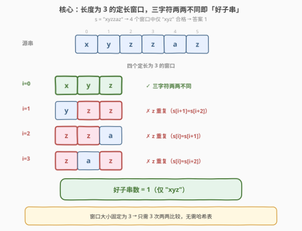
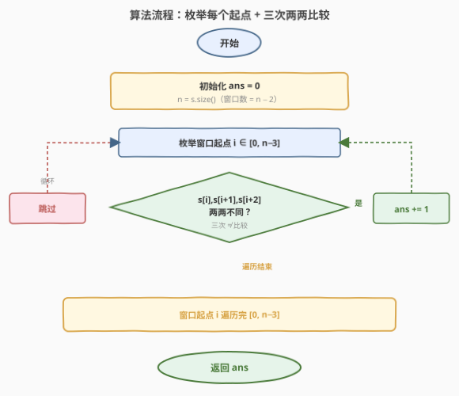
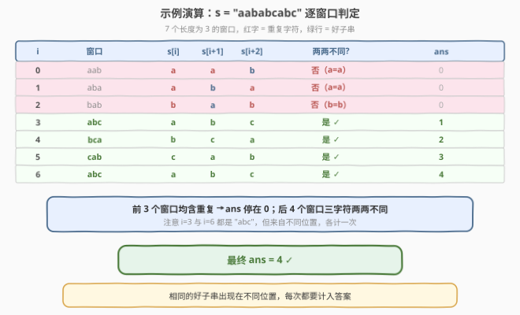

# 长度为三且各字符不同的子字符串

- **题目名称**：长度为三且各字符不同的子字符串
- **链接**：[1876. 长度为三且各字符不同的子字符串](https://leetcode.cn/problems/substrings-of-size-three-with-distinct-characters/)
- **难度**：简单
- **标签**：字符串、滑动窗口、哈希表

## 1. 题目概述

如果一个字符串**不含有任何重复字符**，称该字符串为**好字符串**。给定字符串 `s`，返回 `s` 中**长度为 3** 的好子字符串的数量。

> 注意：如果相同的好子字符串出现多次（出现在不同位置），每一次都应被记入答案之中。子字符串是字符串中**连续**的字符序列。

**示例 1**：

```text
输入：s = "xyzzaz"
输出：1
解释：长度为 3 的子字符串共 4 个："xyz"、"yzz"、"zza"、"zaz"。
      唯一的好子字符串是 "xyz"（x、y、z 两两不同）。
```

**示例 2**：

```text
输入：s = "aababcabc"
输出：4
解释：长度为 3 的子字符串共 7 个："aab"、"aba"、"bab"、"abc"、"bca"、"cab"、"abc"。
      好子字符串为 "abc"、"bca"、"cab"、"abc"（共 4 个，末尾的 "abc" 与 i=3 的 "abc" 内容相同但位置不同，各计一次）。
```

**约束条件**：

- $1 \le \text{s.length} \le 100$
- `s` 只包含小写英文字母

> 💡 **审题关键**：① 子字符串必须是**连续**的，且**长度恰好为 3**——既不是「至多 3」也不是「任意长度」；② 「好」的定义是该子串内**无任何重复字符**，即三个字符两两不同；③ **按位置计数**而非按内容去重——同一个 "abc" 出现在不同位置要重复计入。这三个要点决定了本题是「定长滑窗 + 逐窗判定」的模板题。

---

## 2. 解题思路

### 2.1 暴力思路：枚举所有长度为 3 的子串

最直观的做法是枚举每一个起点 $i \in [0, n-3]$，取出子串 `s[i..i+2]`，判断其中三个字符是否两两不同。长度为 3 的子串共有 $n - 2$ 个（$n = \text{s.length}$），每个子串只需 $3$ 次字符比较即可判定。

- **正确性**：枚举覆盖了所有长度为 3 的连续子串，判定条件「两两不同」等价于「无重复字符」，与「好字符串」定义一致。
- **效率**：$n - 2$ 个窗口 × 每窗 $3$ 次比较 = $O(n)$ 时间，$O(1)$ 空间。对 $n \le 100$ 毫无压力。

> 💡 本题的「暴力」其实已是最优解——窗口长度固定为 3 这个**常数**，使得任何基于哈希表的优化都是多余的。真正值得讨论的不是「如何更快」，而是「如何把窗口长度 3 泛化为任意 $k$」（见第 5 节）。

### 2.2 核心观察：定长滑动窗口 + 两两比较



关键洞察：**窗口长度固定为 3 是一个极小的常数**，判定「三个字符两两不同」只需 $3$ 次比较：

$$\text{good}(i) \iff s[i] \ne s[i+1] \;\land\; s[i] \ne s[i+2] \;\land\; s[i+1] \ne s[i+2]$$

无需维护频率表或哈希集合——$k=3$ 时「两两比较」比「查哈希」更快、更省空间。

> ⚠️ **最高频陷阱**：循环边界。起点 $i$ 的合法范围是 $[0, n-3]$（保证 $i+2$ 不越界），即 `i + 2 < n` 或 `i <= n - 3`。若误写成 `i < n - 2`（即 `i <= n - 3`，实际等价）不会出错，但若写成 `i < n` 则会访问 `s[i+2]` 越界。最稳妥的写法是 `for (int i = 0; i + 2 < n; ++i)`，让「$i+2$ 必须合法」直接体现在边界条件中。

> 💡 **为什么不用哈希表？** 对 $k=3$，一次哈希插入/查询的常数开销远大于 3 次字符比较。哈希表的价值在于 $k$ 较大时（如 [187. 重复的 DNA序列](https://leetcode.cn/problems/repeated-dna-sequences/) 中 $k=10$）能 $O(1)$ 增量维护窗口状态。本题 $k=3$ 属于「直接比较更优」的甜区。

### 2.3 算法流程图



1. **初始化**：`ans = 0`，`n = s.size()`。
2. **枚举**每个窗口起点 $i$ 从 $0$ 到 $n - 3$：
   - 判定 $s[i]$、$s[i+1]$、$s[i+2]$ 是否两两不同（$3$ 次 `!=` 比较）。
   - 若全部不同，`ans += 1`。
3. **返回** `ans`。

### 2.4 示例演算

以示例 2 `s = "aababcabc"` 为例，逐窗口追踪判定结果与 `ans` 累计：



| $i$ | 窗口 | $s[i]$ | $s[i+1]$ | $s[i+2]$ | 两两不同? | ans | 说明 |
|-----|------|--------|----------|----------|-----------|-----|------|
| $0$ | `aab` | `a` | `a` | `b` | 否（a=a） | $0$ | $s[i]=s[i+1]$ |
| $1$ | `aba` | `a` | `b` | `a` | 否（a=a） | $0$ | $s[i]=s[i+2]$ |
| $2$ | `bab` | `b` | `a` | `b` | 否（b=b） | $0$ | $s[i]=s[i+2]$ |
| $3$ | `abc` | `a` | `b` | `c` | 是 ✓ | $\mathbf{1}$ | 三字符两两不同 |
| $4$ | `bca` | `b` | `c` | `a` | 是 ✓ | $\mathbf{2}$ | 三字符两两不同 |
| $5$ | `cab` | `c` | `a` | `b` | 是 ✓ | $\mathbf{3}$ | 三字符两两不同 |
| $6$ | `abc` | `a` | `b` | `c` | 是 ✓ | $\mathbf{4}$ | 与 $i=3$ 同内容、不同位置，各计一次 |

最终 `ans = 4`。

> 💡 **观察要点**：① 前 3 个窗口均因首尾字符相同而失败（`aab`、`aba`、`bab` 都是「两端字符相同」型重复），`ans` 停在 $0$；② $i=3$ 起连续 4 个窗口三字符两两不同，`ans` 累加到 $4$；③ $i=6$ 的 `abc` 与 $i=3$ 的 `abc` 内容完全相同，但因位置不同各计一次——这正是题目「按位置计数」要求的体现。

---

## 3. 参考代码

### C++

```cpp
class Solution {
public:
    int countGoodSubstrings(string s) {
        int n = s.size(), ans = 0;
        for (int i = 0; i + 2 < n; ++i) {
            if (s[i] != s[i + 1] && s[i] != s[i + 2] && s[i + 1] != s[i + 2]) {
                ++ans;
            }
        }
        return ans;
    }
};
```

### Python

```python
class Solution:
    def countGoodSubstrings(self, s: str) -> int:
        ans = 0
        for i in range(len(s) - 2):
            if s[i] != s[i + 1] and s[i] != s[i + 2] and s[i + 1] != s[i + 2]:
                ans += 1
        return ans
```

### Python（集合判重一行流）

```python
class Solution:
    def countGoodSubstrings(self, s: str) -> int:
        return sum(len(set(s[i:i + 3])) == 3 for i in range(len(s) - 2))
```

> 💡 **写法对照**：① 前两版逻辑完全一致——直接做 $3$ 次两两比较，最直观也最快；② 第三版用 `set(s[i:i+3])` 把 3 字符放入集合，集合大小为 $3$ 即「无重复」，借助 Python 切片与集合把判定压成一行，适合快速验证，但每窗创建一个临时集合，常数略大；③ 三版均为 $O(n)$ 时间、$O(1)$ 空间，对 $n \le 100$ 无差异。面试中先写直接比较版展示思路，再口述集合版作为「更声明式」的替代即可。

---

## 4. 复杂度分析

| 维度 | 复杂度 | 说明 |
|------|--------|------|
| 时间复杂度 | $O(n)$ | 枚举 $n - 2$ 个窗口，每窗 $3$ 次 $O(1)$ 字符比较，总计 $O(n)$ |
| 空间复杂度 | $O(1)$ | 仅 `ans`、`n`、循环变量 `i`，无额外数据结构 |

> 💡 $n \le 100$，$O(n)$ 极其宽裕。即便 $n$ 放大到 $10^5$，$O(n)$ 仍轻松通过。空间上「直接比较」版严格 $O(1)$，优于任何基于哈希的方案。

---

## 5. 扩展：泛化为「长度为 K 且字符各不相同的子串数」

本题的 $k=3$ 是常数，直接比较最优。若把窗口长度泛化为任意 $k$（如 $k=10$ 的 [187. 重复的 DNA序列](https://leetcode.cn/problems/repeated-dna-sequences/)），就需要**频率表 + 去重计数**的增量维护。

### 5.1 频率表 + distinct 计数器

维护一个长度为 $k$ 的滑动窗口，用哈希表记录窗口内各字符频次，并用一个计数器 `distinct` 跟踪当前窗口内**不同字符的种类数**。窗口「好」当且仅当 `distinct == k`。

```cpp
int countGoodSubstringsK(string s, int k) {
    int n = s.size(), ans = 0, distinct = 0;
    int freq[26] = {0};
    for (int i = 0; i < n; ++i) {
        // 入窗：添加 s[i]
        if (++freq[s[i] - 'a'] == 1) ++distinct;
        // 出窗：移除 s[i - k]（当 i >= k 时）
        if (i >= k && --freq[s[i - k] - 'a'] == 0) --distinct;
        // 窗口大小达到 k 时判定
        if (i >= k - 1 && distinct == k) ++ans;
    }
    return ans;
}
```

- **入窗**：`freq[c]` 从 $0$ 变 $1$ 时 `distinct++`（新种类出现）。
- **出窗**：`freq[c]` 从 $1$ 变 $0$ 时 `distinct--`（某种类消失）。
- **判定**：窗口大小达到 $k$ 后，`distinct == k` 表示 $k$ 个字符全不同。

时间 $O(n)$，空间 $O(|Σ|)$（$|Σ| = 26$，小写字母）。

> ⚠️ 本题 $k=3$ 时此法同样可用，但 $3$ 次字符比较的常数远小于哈希增删，故直接比较更优。频率表法是「$k$ 较大或 $k$ 不定」时的通用武器。

### 5.2 滚动哈希（k 较大时）

当 $k$ 很大（如 $k = 10$）且只需判「是否全不同」时，可用位编码或滚动哈希把整个窗口压成一个整数键。本题 $k = 3$、$|Σ| = 26$，$26^3 < 10^5$，可三位 $26$ 进制编码，但收益为零——直接比较已是最简。

### 5.3 变长窗口的对照

本题是**定长**滑窗（窗口大小固定为 $k$）。对照 [3. 无重复字符的最长子串](https://leetcode.cn/problems/longest-substring-without-repeating-characters/)（求**最长**无重复子串），那是**变长**滑窗（`right` 扩张、`left` 收缩维护不变式）。两者共用「频率表 + distinct」的维护技巧，但窗口策略不同：定长窗只平移不伸缩，变长窗需双端调整。

---

## 6. 面试要点

**Q1：为什么不用哈希表来判断三个字符是否重复？**

> $k = 3$ 是极小常数，$3$ 次 `!=` 比较的常数开销远小于一次哈希插入/查询。哈希表的价值在于 $k$ 较大时能 $O(1)$ 增量维护窗口状态（入窗加、出窗减）。本题 $k = 3$ 处于「直接比较更优」的甜区，引入哈希表反而增加空间与常数。

**Q2：循环边界为什么是 `i + 2 < n` 而不是 `i < n`？**

> 窗口覆盖 $s[i]$、$s[i+1]$、$s[i+2]$，必须保证 $i + 2 \le n - 1$，即 $i \le n - 3$，等价于 `i + 2 < n`。把「$i+2$ 必须合法」直接写在边界条件里，比 `i <= n - 3` 更不易出错（避免 `n - 3` 在 $n < 3$ 时变负的坑）。当 $n < 3$ 时 `i + 2 < n` 天然不成立，循环不执行，返回 $0$，正确处理短串。

**Q3：同一个好子串出现在不同位置，为什么要重复计数？**

> 题目求的是「子字符串」的数量，而子字符串由**位置**定义——同内容的串出现在不同位置是不同的子字符串。例如 `s = "aababcabc"` 中 $i=3$ 和 $i=6$ 都是 `"abc"`，但它们是两个不同的子串，各计一次。这与「求不同好子串的种数」截然不同（后者才需要去重）。

**Q4：如何泛化到「长度为 K 且字符各不相同的子串数」？**

> 用频率表 + `distinct` 计数器维护定长为 $k$ 的窗口：入窗字符频次从 $0$ 变 $1$ 时 `distinct++`，出窗字符频次从 $1$ 变 $0$ 时 `distinct--`，窗口满 $k$ 时 `distinct == k` 即「好」。时间 $O(n)$，空间 $O(|Σ|)$。这是定长滑窗判重的通用模板，$k = 3$ 时退化为直接比较。

**Q5：本题与 [3. 无重复字符的最长子串] 有何异同？**

> 两者都关注「窗口内字符不重复」，但窗口策略不同：本题是**定长**窗（大小固定为 $3$，只平移不伸缩），求满足条件的窗口数；3 题是**变长**窗（`right` 扩张遇重复则 `left` 收缩），求最长窗口长度。共用「频率表维护字符种类」的思想，但定长窗无需 `left` 收缩逻辑，更简单。

> 💡 **一句话总结**：$k = 3$ 是常数，$3$ 次两两比较即可判定每个窗口，$O(n)$ 时间、$O(1)$ 空间——本题是「定长滑窗判重」的最简实例，泛化到任意 $k$ 才需要频率表。

---

## 7. 同类练习题

- [3. 无重复字符的最长子串](https://leetcode.cn/problems/longest-substring-without-repeating-characters/)（[题解](../0001-0100/3_无重复字符的最长子串.md)）：变长滑窗求「最长」无重复子串，对照本题「定长」窗求「计数」，共用频率表维护字符种类的思想
- [187. 重复的 DNA 序列](https://leetcode.cn/problems/repeated-dna-sequences/)（[题解](../0101-0200/187_重复的DNA序列.md)）：定长 $k=10$ 窗口 + 滚动哈希，本题泛化到大 $k$ 时的进阶形态
- [219. 存在重复元素 II](https://leetcode.cn/problems/contains-duplicate-ii/)（[题解](../0201-0300/219_存在重复元素II.md)）：滑动窗口 + 哈希集合判「距离不超过 k 内是否有重复」，同为「窗口内查重」范式
- [438. 找到字符串中所有字母异位词](https://leetcode.cn/problems/find-all-anagrams-in-a-string/)（[题解](../0401-0500/438_找到字符串中所有字母异位词.md)）：定长滑窗 + 频率表比对，定长窗模板的另一经典应用，对照「判重」与「判同构」两种窗口判定
