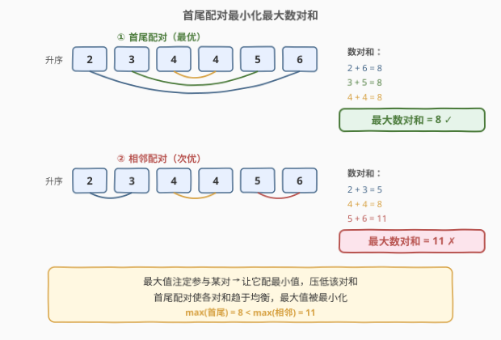
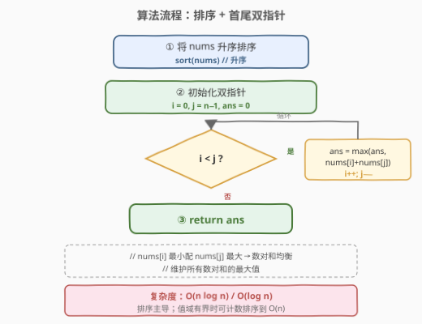

# LeetCode 数组中最大数对和的最小值 题解

## 1. 题目概述

- **标题 / 题号**：数组中最大数对和的最小值（#1877，medium）
- **链接**：https://leetcode.cn/problems/minimize-maximum-pair-sum-in-array/
- **难度**：中等
- **标签**：贪心、排序、数组、双指针

**题意**：一个数对 $(a, b)$ 的**数对和**等于 $a + b$。**最大数对和**是一个数对数组中最大的数对和。

> 比方说，如果我们有数对 $(1,5)$、$(2,3)$ 和 $(4,4)$，最大数对和为 $\max(1+5, 2+3, 4+4) = \max(6, 5, 8) = 8$。

给你一个长度为**偶数** $n$ 的数组 `nums`，请你将 `nums` 中的元素分成 $n / 2$ 个数对，使得：

- `nums` 中每个元素**恰好**在一个数对中，且
- **最大数对和**的值**最小**。

请你在最优数对划分的方案下，返回**最小的最大数对和**。

**示例 1**：

```text
输入：nums = [3,5,2,3]
输出：7
解释：数组中的元素可以分为数对 (3,3) 和 (5,2)。
      最大数对和为 max(3+3, 5+2) = max(6, 7) = 7。
```

**示例 2**：

```text
输入：nums = [3,5,4,2,4,6]
输出：8
解释：数组中的元素可以分为数对 (3,5)、(4,4) 和 (6,2)。
      最大数对和为 max(3+5, 4+4, 6+2) = max(8, 8, 8) = 8。
```

**约束**：

- $n = \text{nums.length}$
- $2 \le n \le 10^5$
- $n$ 是偶数
- $1 \le \text{nums}[i] \le 10^5$

> 💡 **关键直觉**：要让「最大数对和」尽量小，就要避免某一对特别大。直觉上，「大数配小数」能让各对和趋于均衡——大的被小的拉低、小的被大的抬升，最大值被压低；反之「大配大、小配小」会两极分化，最大值飙升。这背后是**排序 + 首尾配对**的贪心策略。

## 2. 解题思路

### 2.1 暴力思路：枚举所有配对方案

最直觉的做法是**枚举所有可能的配对方式**：把 $n$ 个数两两配对，共有

$$(n-1)!! = (n-1)(n-3)\cdots 3 \cdot 1$$

种方案。每种方案计算 $n/2$ 个数对和的最大值，取所有方案中的最小值。

> ⚠️ 这种方案数随 $n$ **超指数增长**（$n = 10$ 时已超 $6500$ 万），$n = 10^5$ 时完全不可行。必须利用配对的结构性规律跳过枚举。

### 2.2 核心观察：排序后首尾配对



将数组**升序排序**后，把**最小值与最大值配对**（首尾配对），即 $\text{nums}[i]$ 配 $\text{nums}[n-1-i]$。这样每对的和都趋于均衡，最大数对和被最小化。

**为什么首尾配对最优？** 用**交换论证**说明。

设数组已升序为 $a_1 \le a_2 \le \cdots \le a_n$。考察任意一种配对方案，若存在两对 $(a_i, a_j)$ 和 $(a_k, a_l)$ 满足 $a_i \le a_k$ 且 $a_j \le a_l$（即两组都「同序」），将它们交换为 $(a_i, a_l)$ 和 $(a_k, a_j)$：

- 交换前两对的最大值：$\max(a_i + a_j,\; a_k + a_l) = a_k + a_l$（因为 $a_k + a_l$ 同时 $\ge a_i + a_j$）
- 交换后两对的最大值：$\max(a_i + a_l,\; a_k + a_j)$

由于 $a_i + a_l \le a_k + a_l$（$a_i \le a_k$）且 $a_k + a_j \le a_k + a_l$（$a_j \le a_l$），故：

$$\max(a_i + a_l,\; a_k + a_j) \;\le\; a_k + a_l = \max(a_i + a_j,\; a_k + a_l)$$

即**交换后两对的最大值不增**。反复将「同序对」交换为「逆序对」，整体最大数对和单调不增，直到每对都变成「小配大」——即首尾配对 $(a_1, a_n), (a_2, a_{n-1}), \ldots$——达到全局最小。

> 💡 **一句话记忆**：最大值 $a_n$ 注定要参与某一对，它的和至少为 $a_n + a_1$（配最小值才最低）。让它配走最小值 $a_1$，剩下元素递归处理，就得首尾配对。

> ⚠️ **与 1874 的区别**：[1874. 两个数组的最小乘积和](../1801-1900/1874_两个数组的最小乘积和.md) 用排序不等式最小化**乘积和的总和**（逆序配对）；本题最小化的是**数对和的最大值**（首尾配对）。两者都是「大配小」的贪心，但优化的目标不同——前者关心「总和」，后者关心「最大值」。

### 2.3 算法流程图



只需四步：① 将 `nums` 升序排序；② 初始化双指针 `i = 0`、`j = n-1`、`ans = 0`；③ 当 `i < j` 时，更新 `ans = max(ans, nums[i] + nums[j])`，然后 `i++`、`j--`；④ 返回 `ans`。时间 $O(n \log n)$，空间 $O(\log n)$（排序栈）。

### 2.4 示例演算

![示例演算：nums=[3,5,4,2,4,6] 的首尾配对过程](../images/1877_example_walkthrough.svg)

以示例 2 `nums = [3,5,4,2,4,6]` 为例：

| 步骤 | i | j | 配对 | 数对和 | 当前 ans |
|------|---|---|------|--------|----------|
| 排序前 | — | — | `[3, 5, 4, 2, 4, 6]` | — | — |
| 排序后 | — | — | `[2, 3, 4, 4, 5, 6]` | — | 0 |
| ① | 0 | 5 | (2, 6) | 8 | $\max(0, 8) = 8$ |
| ② | 1 | 4 | (3, 5) | 8 | $\max(8, 8) = 8$ |
| ③ | 2 | 3 | (4, 4) | 8 | $\max(8, 8) = 8$ |

最终答案 = **8**。

**对照**（相邻配对 = 次优）：$(2,3)$、$(4,4)$、$(5,6)$ → $\max(5, 8, 11) = 11 > 8$，验证首尾配对确实更优。

> 💡 **为何三对和恰好都等于 8？** 这并非巧合——首尾配对让每对的和趋于均衡。当数组分布均匀时，各对和接近相等，最大值自然被压到最低。这正是「大配小」策略的核心收益。

## 3. 参考代码

### C++

```cpp
class Solution {
public:
    int minPairSum(vector<int>& nums) {
        sort(nums.begin(), nums.end());
        int ans = 0;
        int n = nums.size();
        for (int i = 0, j = n - 1; i < j; i++, j--) {
            ans = max(ans, nums[i] + nums[j]);
        }
        return ans;
    }
};
```

### Python

```python
class Solution:
    def minPairSum(self, nums: List[int]) -> int:
        nums.sort()
        return max(nums[i] + nums[-1 - i] for i in range(len(nums) // 2))
```

### Python（双指针显式版）

```python
class Solution:
    def minPairSum(self, nums: List[int]) -> int:
        nums.sort()
        ans = 0
        i, j = 0, len(nums) - 1
        while i < j:
            ans = max(ans, nums[i] + nums[j])
            i += 1
            j -= 1
        return ans
```

> 💡 **实现细节**：① 排序后只需遍历前一半，`nums[i]` 配 `nums[n-1-i]`，无需显式双指针；② Python 一行版用 `nums[-1-i]` 从尾部取，等价于 `nums[n-1-i]`；③ 本题 $\text{nums}[i] \le 10^5$、$n \le 10^5$，最大数对和 $= 2 \times 10^5$，远在 32 位 `int` 范围内，无需 `long long`。

> ⚠️ **常见误区**：有人会想到「每次贪心选当前最小值配当前最大值」需要优先队列维护。其实排序后首尾配对一次性确定所有配对，无需动态选取——排序已经把贪心选择的全局顺序固定下来了。

## 4. 复杂度分析

| 维度 | 复杂度 | 说明 |
|------|--------|------|
| 时间复杂度 | $O(n \log n)$ | 排序主导；首尾双指针扫描为 $O(n)$，被吸收 |
| 空间复杂度 | $O(\log n)$ | 排序递归栈（C++ 内省排序 / Python Timsort）；额外仅 `ans` 等变量 $O(1)$ |

> 💡 **能否 $O(n)$？** 若利用元素值域 $[1, 10^5]$ 有界，可用**计数排序**（值域桶）在 $O(n + V)$ 时间内完成排序，$V = 10^5$ 时即 $O(n)$。计数排序后用双指针从值域两端配对即可。但比较排序 $O(n \log n)$ 在 $n = 10^5$ 时已足够快（$\approx 1.7 \times 10^6$ 次比较），面试中作为「知道值域时的进阶优化」提及即可。

## 5. 扩展：交换论证的完整证明

### 5.1 最优配对的结构

**定理**：设 $a_1 \le a_2 \le \cdots \le a_n$（$n$ 为偶数）为升序排列，则最小化最大数对和的最优配对为 $(a_1, a_n), (a_2, a_{n-1}), \ldots, (a_{n/2}, a_{n/2+1})$，答案为：

$$\text{ans} = \max_{i=1}^{n/2} \left(a_i + a_{n+1-i}\right)$$

**证明**（交换论证）：对任意配对方案，若存在两对 $(a_i, a_j)$ 和 $(a_k, a_l)$ 满足 $a_i \le a_k$ 且 $a_j \le a_l$（同为「同序对」），交换为 $(a_i, a_l)$ 和 $(a_k, a_j)$ 后，这两对的最大值不增（见 2.2 节推导）。由于整体最大数对和 $\ge$ 任意两对的最大值，局部不增则全局不增。

反复交换直到不存在「同序对」——即每对都满足「左端 $\le$ 中点且右端 $\ge$ 中点」，等价于首尾配对。由于每次交换不增，首尾配对达到全局最小。$\blacksquare$

### 5.2 下界视角

最大值 $a_n$ 必在某对中，该对和 $\ge a_n + a_1$（$a_1$ 是能配给它的最小值）。去掉 $a_1, a_n$ 后，剩余最大值 $a_{n-1}$ 必在某对中，该对和 $\ge a_{n-1} + a_2$……递推得：

$$\text{ans} \ge \max_{i} \left(a_i + a_{n+1-i}\right)$$

而首尾配对恰好取到这个下界，故为最优。这个「下界即构造」的论证比交换论证更简洁。

### 5.3 与同类配对问题的对比

| 问题 | 优化目标 | 最优策略 | 关键不等式 |
|------|----------|----------|------------|
| **1877**（本题） | 最小化数对和的**最大值** | 首尾配对（小配大） | $\max(a_i + a_{n+1-i})$ 最小 |
| [561. 数组拆分](../0501-0600/561_数组拆分.md) | 最大化数对较小者的**总和** | 相邻配对（小配小） | $\sum \min$ 最大 |
| [1874. 最小乘积和](../1801-1900/1874_两个数组的最小乘积和.md) | 最小化乘积的**总和** | 逆序配对（小配大） | 排序不等式：逆序和最小 |
| [881. 救生艇](https://leetcode.cn/problems/boats-to-save-people/) | 最小化船的**数量** | 排序 + 贪心（轻配重） | 双指针计数 |

> 💡 **共性**：这些配对问题都先**排序**暴露位置结构，再用贪心确定配对方式。区别在于优化目标决定配对方向——关心「最大值」则首尾配对（均衡），关心「总和」则视最小化或最大化选择正序/逆序。

## 6. 面试要点

**Q1：为什么首尾配对能最小化最大数对和？**

> 交换论证：若存在两对「同序对」（小配小、大配大），交换为「逆序对」（小配大）后，这两对的最大值不增——因为 $\max(a_i + a_l, a_k + a_j) \le \max(a_i + a_j, a_k + a_l)$ 当 $a_i \le a_k, a_j \le a_l$。反复交换直到完全首尾配对，全局最大值单调下降到最小。更简洁的下界视角：最大值 $a_n$ 必在某对中，至少配 $a_1$，首尾配对恰好取到这个下界。

**Q2：为什么不用优先队列动态贪心？**

> 排序后首尾配对一次性确定所有配对，无需动态选取。排序已经把「当前最小配当前最大」的全局顺序固定下来了——第 $i$ 小的数一定配第 $i$ 大的数。用优先队列反而多此一举，且复杂度更高（$O(n \log n)$ 但常数更大）。

**Q3：时间复杂度能优于 $O(n \log n)$ 吗？**

> 若元素值域有界（本题 $[1, 10^5]$），可用计数排序做到 $O(n + V)$，$V = 10^5$ 时即 $O(n)$。计数排序后用双指针从值域两端配对求最大和即可。若值域未知或无界，基于比较的排序 $O(n \log n)$ 是下界。

**Q4：本题和 561「数组拆分」有什么区别？**

> 561 是把 $2n$ 个数分成 $n$ 对，最大化**每对较小者之和**——最优是相邻配对（小配小，让大数互相抵消以保住次大）。本题是最小化**数对和的最大值**——最优是首尾配对（小配大，让各对和均衡）。两者都排序后贪心，但配对方向相反，因为优化目标不同。

**Q5：如果数组含负数，结论还成立吗？**

> 成立。交换论证只依赖全序关系（$a_i \le a_k$ 等），与正负无关。首尾配对仍最小化最大数对和。例如 $[-5, -1, 2, 8]$ 排序后首尾配对 $(-5, 8)=3$、$(-1, 2)=1$，最大值 $3$；若相邻配对 $(-5,-1)=-6$、$(2,8)=10$，最大值 $10 > 3$。

> 💡 **一句话总结**：排序后首尾配对（小配大）让各对和均衡，最大数对和被最小化——$O(n \log n)$ 排序 + 一趟双指针扫描即可，是配对优化问题的母题级结论。

## 同类练习题

| # | 题目 | 与本题的关联 |
|---|------|-------------|
| 561 | [数组拆分](https://leetcode.cn/problems/array-partition/)（[站内题解](../0501-0600/561_数组拆分.md)） | 排序后相邻配对最大化较小者之和，与本题「排序揭示配对结构」同源但方向相反 |
| 1874 | [两个数组的最小乘积和](https://leetcode.cn/problems/minimize-product-sum-of-two-arrays/)（[站内题解](../1801-1900/1874_两个数组的最小乘积和.md)） | 排序不等式逆序配对最小化乘积总和，同为「大配小」贪心但优化目标不同 |
| 881 | [救生艇](https://leetcode.cn/problems/boats-to-save-people/) | 排序 + 双指针贪心配对（最轻配最重能否同船），配对优化的另一经典范式 |
| 2144 | [打折购买糖果的最小花费](https://leetcode.cn/problems/minimum-cost-of-buying-candies-with-discount/) | 排序 + 贪心取免费配对，排序后线性扫描做最优选择的同类模板 |
| 16 | [最接近的三数之和](https://leetcode.cn/problems/3sum-closest/)（[站内题解](../0001-0100/16_最接近的三数之和.md)） | 排序 + 双指针维护最值，共享「排序暴露结构 + 双指针」的骨架 |
