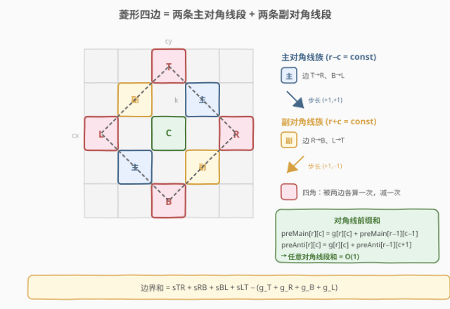
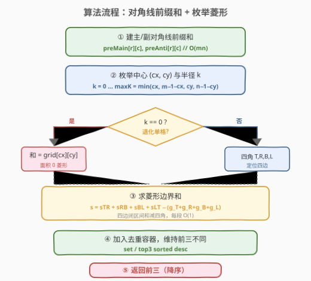
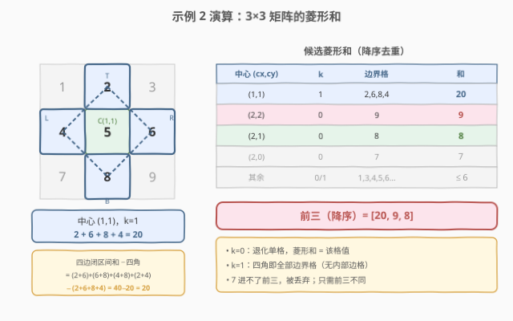

# 矩阵中最大的三个菱形和

- **题目名称**：矩阵中最大的三个菱形和
- **链接**：[1878. 矩阵中最大的三个菱形和](https://leetcode.cn/problems/get-biggest-three-rhombus-sums-in-a-grid/)
- **难度**：中等
- **标签**：数组、矩阵、前缀和、对角线前缀和、几何

## 1. 题目概述

给定一个 $m \times n$ 的整数矩阵 `grid`。**菱形和**指的是 `grid` 中一个**正菱形边界**上的元素之和。本题中的菱形必须为「正方形旋转 45°」的形状，且四个角都落在格子中心。菱形可以是一个面积为 0 的区域（即单个格子）。

请按**降序**返回 `grid` 中三个最大的**互不相同**的菱形和。若不同的和少于三个，则将它们全部返回。

**示例 1**：

```text
输入：grid = [[3,4,5,1,3],[3,3,4,2,3],[20,30,200,40,10],[1,5,5,4,1],[4,3,2,2,5]]
输出：[228,216,211]
解释：
- 蓝色：20 + 3 + 200 + 5 = 228
- 红色：200 + 2 + 10 + 4 = 216
- 绿色：5 + 200 + 4 + 2 = 211
```

**示例 2**：

```text
输入：grid = [[1,2,3],[4,5,6],[7,8,9]]
输出：[20,9,8]
解释：
- 蓝色：4 + 2 + 6 + 8 = 20   （中心 (1,1)，k=1）
- 红色：9                      （右下角面积为 0 的菱形）
- 绿色：8                      （下方中央面积为 0 的菱形）
```

**示例 3**：

```text
输入：grid = [[7,7,7]]
输出：[7]
解释：所有可能的菱形和都相同，故返回 [7]。
```

**约束条件**：

- $m = \text{grid.length}$，$n = \text{grid[i].length}$
- $1 \le m, n \le 100$
- $1 \le \text{grid}[i][j] \le 10^5$

> 💡 **关键直觉**：菱形由「中心格 + 半径 $k$」唯一确定，四条边分别沿**两条主对角线**与**两条副对角线**走向。只要能 $O(1)$ 求出每条对角线段之和，就能在 $O(m\cdot n\cdot \min(m,n))$ 内枚举所有菱形——这正是**对角线前缀和**的用武之地。

---

## 2. 解题思路

### 2.1 暴力思路：逐边累加

每个菱形由**中心** $(c_x, c_y)$ 与**半径** $k \ge 0$ 唯一确定。$k=0$ 时菱形退化为单格；$k \ge 1$ 时四个角为：

- 上 $T=(c_x-k,\; c_y)$　右 $R=(c_x,\; c_y+k)$　下 $B=(c_x+k,\; c_y)$　左 $L=(c_x,\; c_y-k)$

四条边各含 $k+1$ 个格子（含两个角），边界共有 $4k$ 个格子。暴力做法对每个菱形沿四条边**逐格累加**：单次求和 $O(k)$。

$$\text{总复杂度} = \sum_{\text{center}}\sum_{k=0}^{K} O(k) = O\!\left(m\cdot n\cdot K^2\right),\quad K = \min(m,n)$$

$m=n=100$ 时约 $5\times 10^7$ 次加法，可过但偏慢。

> ⚠️ 瓶颈：每个菱形重复扫描四条边，相邻菱形的同一段对角线被反复求和。若能把「任意对角线段之和」降到 $O(1)$，整体即可降到 $O(m\cdot n\cdot K)$。

### 2.2 核心观察：对角线前缀和



**观察 1：四条边恰好落在两条对角线族上。**

设主对角线（左上 → 右下，步长 $(+1,+1)$）上 $r-c$ 为常数；副对角线（右上 → 左下，步长 $(+1,-1)$）上 $r+c$ 为常数。则：

| 边 | 端点 | 步长 | 所属族 | 常数 |
|----|------|------|--------|------|
| 上→右 $T{\to}R$ | $(c_x{-}k,c_y) \to (c_x,c_y{+}k)$ | $(+1,+1)$ | 主对角线 | $r-c = c_x{-}c_y{-}k$ |
| 右→下 $R{\to}B$ | $(c_x,c_y{+}k) \to (c_x{+}k,c_y)$ | $(+1,-1)$ | 副对角线 | $r+c = c_x{+}c_y{+}k$ |
| 下→左 $B{\to}L$ | $(c_x{+}k,c_y) \to (c_x,c_y{-}k)$ | $(-1,-1)$ | 主对角线 | $r-c = c_x{-}c_y{+}k$ |
| 左→上 $L{\to}T$ | $(c_x,c_y{-}k) \to (c_x{-}k,c_y)$ | $(-1,+1)$ | 副对角线 | $r+c = c_x{+}c_y{-}k$ |

> 💡 主对角线族承担「上→右」「下→左」两条边；副对角线族承担「右→下」「左→上」两条边。

**观察 2：两个前缀和数组即可 $O(1)$ 查任意对角线段之和。**

预处理两个二维前缀和：

- $\text{preMain}[r][c]$：主对角线上从「最上方格子」到 $(r,c)$（含）的累计和。递推 $\text{preMain}[r][c] = \text{grid}[r][c] + \text{preMain}[r{-}1][c{-}1]$（越界取 0）。
- $\text{preAnti}[r][c]$：副对角线上从「最上方格子」到 $(r,c)$（含）的累计和。递推 $\text{preAnti}[r][c] = \text{grid}[r][c] + \text{preAnti}[r{-}1][c{+}1]$（越界取 0）。

于是端点 $(r_1,c_1)\to(r_2,c_2)$（$r_2\ge r_1$，沿对角线）的段和为「前缀相减」：

$$\text{seg}(r_1,c_1,r_2,c_2) = \text{pre}[r_2][c_2] - \text{pre}[r_1{-}1][\cdot]$$

（其中 $\text{pre}[r_1{-}1][\cdot]$ 为起点的上一格，越界取 0）。

**观察 3：四边各自含两端点，四个角被算两次，减去一次即可。**

$$\text{boundary} = \underbrace{s_{TR}+s_{RB}+s_{BL}+s_{LT}}_{\text{四边端点闭区间和}} - \underbrace{(g_T+g_R+g_B+g_L)}_{\text{四个角重复一次}}$$

这样四条边的段和都**闭区间**计算（实现最简），最后统一扣除四角。$k=1$ 时四边均无内部格，段和就是两端点之和，公式退化为「四角之和」，与单格菱形自然衔接。

> ⚠️ 注意方向：`diagMain` 总是从 $r$ 小的一端查到 $r$ 大的一端（下→右、左→下）；`diagAnti` 同理（右→下、上→左）。统一「上端为起点、下端为终点」可避免方向搞反。

### 2.3 算法流程图



整体三步：① $O(mn)$ 建主/副对角线前缀和；② 对每个中心枚举半径 $k=0\dots K$，$O(1)$ 算边界和丢入去重容器；③ 取最大的三个不同值降序返回。

### 2.4 示例演算



以示例 2 的 $3\times 3$ 矩阵为例（下标 0-based）：

```text
grid:
      c=0  c=1  c=2
r=0    1    2    3
r=1    4    5    6
r=2    7    8    9
```

| 中心 $(c_x,c_y)$ | $k$ | 菱形角 | 边界格 | 和 | 去重容器 |
|------------------|-----|--------|--------|----|---------|
| $(1,1)$ | $1$ | $T(0,1),R(1,2),B(2,1),L(1,0)$ | $2,6,8,4$ | $20$ | $\{20\}$ |
| $(2,2)$ | $0$ | 退化单格 | $9$ | $9$ | $\{20,9\}$ |
| $(2,1)$ | $0$ | 退化单格 | $8$ | $8$ | $\{20,9,8\}$ |
| $(2,0)$ | $0$ | 退化单格 | $7$ | $7$ | $\{20,9,8\}$（7 进不了前三） |
| ... | ... | ... | ... | ... | ... |

最终前三降序：$[20, 9, 8]$，与示例一致。

**$k=1$ 详细套用公式**（中心 $(1,1)$）：

| 边 | 段 | $\text{pre}$ 相减 | 段和 |
|----|----|-------------------|------|
| $T{\to}R$ | $(0,1)\to(1,2)$ 主 | $\text{preMain}[1][2]-0$ | $2+6=8$ |
| $R{\to}B$ | $(1,2)\to(2,1)$ 副 | $\text{preAnti}[2][1]-0$ | $6+8=14$ |
| $B{\to}L$ | $(1,0)\to(2,1)$ 主 | $\text{preMain}[2][1]-0$ | $4+8=12$ |
| $L{\to}T$ | $(0,1)\to(1,0)$ 副 | $\text{preAnti}[1][0]-0$ | $2+4=6$ |

四边合计 $8+14+12+6=40$；四角 $2+6+8+4=20$；边界 $=40-20=20$。✅

> 💡 **为何减四角而非减端点**：四条边闭区间求和时，每个角同时属于两条相邻边，被计入两次。减去一次（共减四角）恰好让每个边界格计入一次。$k\ge2$ 时边内部格只属于一条边，不受影响。

---

## 3. 参考代码

### Python

```python
class Solution:
    def getBiggestThree(self, grid: list[list[int]]) -> list[int]:
        m, n = len(grid), len(grid[0])
        # 主/副对角线前缀和（沿「上方→下方」累计）
        preMain = [[0] * n for _ in range(m)]   # 步长 (+1,+1)
        preAnti = [[0] * n for _ in range(m)]   # 步长 (+1,-1)
        for r in range(m):
            for c in range(n):
                preMain[r][c] = grid[r][c] + (preMain[r - 1][c - 1] if r and c else 0)
                preAnti[r][c] = grid[r][c] + (preAnti[r - 1][c + 1] if r and c + 1 < n else 0)

        def diagMain(r1, c1, r2, c2):            # 主对角线段和，r2 >= r1
            sub = preMain[r1 - 1][c1 - 1] if r1 and c1 else 0
            return preMain[r2][c2] - sub

        def diagAnti(r1, c1, r2, c2):            # 副对角线段和，r2 >= r1
            sub = preAnti[r1 - 1][c1 + 1] if r1 and c1 + 1 < n else 0
            return preAnti[r2][c2] - sub

        top = []                                 # 维护前三不同的值（降序）

        def add(val: int):
            if val in top:
                return
            top.append(val)
            top.sort(reverse=True)
            if len(top) > 3:
                top.pop()

        for cx in range(m):
            for cy in range(n):
                maxK = min(cx, m - 1 - cx, cy, n - 1 - cy)
                for k in range(maxK + 1):
                    if k == 0:
                        add(grid[cx][cy])
                    else:
                        Tr, Tc = cx - k, cy          # 上
                        Rr, Rc = cx, cy + k          # 右
                        Br, Bc = cx + k, cy          # 下
                        Lr, Lc = cx, cy - k          # 左
                        sTR = diagMain(Tr, Tc, Rr, Rc)
                        sRB = diagAnti(Rr, Rc, Br, Bc)
                        sBL = diagMain(Lr, Lc, Br, Bc)
                        sLT = diagAnti(Tr, Tc, Lr, Lc)
                        corners = grid[Tr][Tc] + grid[Rr][Rc] + grid[Br][Bc] + grid[Lr][Lc]
                        add(sTR + sRB + sBL + sLT - corners)
        return top
```

### C++

```cpp
class Solution {
public:
    vector<int> getBiggestThree(vector<vector<int>>& grid) {
        int m = grid.size(), n = grid[0].size();
        // 主/副对角线前缀和
        vector<vector<long long>> preMain(m, vector<long long>(n, 0));
        vector<vector<long long>> preAnti(m, vector<long long>(n, 0));
        for (int r = 0; r < m; ++r)
            for (int c = 0; c < n; ++c) {
                preMain[r][c] = grid[r][c] + (r && c ? preMain[r - 1][c - 1] : 0);
                preAnti[r][c] = grid[r][c] + (r && c + 1 < n ? preAnti[r - 1][c + 1] : 0);
            }
        auto diagMain = [&](int r1, int c1, int r2, int c2) -> long long {
            long long sub = (r1 && c1 ? preMain[r1 - 1][c1 - 1] : 0);
            return preMain[r2][c2] - sub;
        };
        auto diagAnti = [&](int r1, int c1, int r2, int c2) -> long long {
            long long sub = (r1 && c1 + 1 < n ? preAnti[r1 - 1][c1 + 1] : 0);
            return preAnti[r2][c2] - sub;
        };
        set<long long, greater<long long>> st;     // 降序去重
        for (int cx = 0; cx < m; ++cx)
            for (int cy = 0; cy < n; ++cy) {
                int maxK = min({cx, m - 1 - cx, cy, n - 1 - cy});
                for (int k = 0; k <= maxK; ++k) {
                    long long sum;
                    if (k == 0) {
                        sum = grid[cx][cy];
                    } else {
                        int Tr = cx - k, Tc = cy, Rr = cx, Rc = cy + k;
                        int Br = cx + k, Bc = cy, Lr = cx, Lc = cy - k;
                        long long sTR = diagMain(Tr, Tc, Rr, Rc);
                        long long sRB = diagAnti(Rr, Rc, Br, Bc);
                        long long sBL = diagMain(Lr, Lc, Br, Bc);
                        long long sLT = diagAnti(Tr, Tc, Lr, Lc);
                        long long corners = (long long)grid[Tr][Tc] + grid[Rr][Rc]
                                          + grid[Br][Bc] + grid[Lr][Lc];
                        sum = sTR + sRB + sBL + sLT - corners;
                    }
                    st.insert(sum);
                }
            }
        vector<int> ans;
        for (auto it = st.begin(); it != st.end() && ans.size() < 3; ++it)
            ans.push_back((int)*it);
        return ans;
    }
};
```

### Python（暴力逐边版，对照理解）

```python
class Solution:
    def getBiggestThree(self, grid: list[list[int]]) -> list[int]:
        m, n = len(grid), len(grid[0])
        sums = set()
        for cx in range(m):
            for cy in range(n):
                maxK = min(cx, m - 1 - cx, cy, n - 1 - cy)
                for k in range(maxK + 1):
                    if k == 0:
                        sums.add(grid[cx][cy]); continue
                    s = 0
                    for i in range(k + 1):          # T -> R（含两端）
                        s += grid[cx - k + i][cy + i]
                    for i in range(1, k + 1):        # R -> B（去 R）
                        s += grid[cx + i][cy + k - i]
                    for i in range(1, k + 1):        # B -> L（去 B）
                        s += grid[cx + k - i][cy - i]
                    for i in range(1, k):            # L -> T（去 L、去 T）
                        s += grid[cx - i][cy - k + i]
                    sums.add(s)
        return sorted(sums, reverse=True)[:3]
```

> 💡 **实现细节**：① 维护前三用 `set`（C++）或小列表排序（Python）均可，$m\cdot n\cdot K\le 5\times 10^5$ 个候选值，去重开销可忽略；② `maxK = min(cx, m-1-cx, cy, n-1-cy)` 直接锁定菱形不越界的最大半径；③ C++ 用 `long long` 存前缀和以防整条对角线（最坏 $100\times10^5=10^7$）累加越界——虽然最终单菱形和 $\le 4\times50\times10^5=2\times10^7$ 在 `int` 内，前缀中间值同样安全，但 `long long` 是更稳妥的工程习惯。

> ⚠️ **方向易错点**：`diagMain(Lr,Lc,Br,Bc)` 中起点是**左角** $L$（$r$ 较小），终点是**下角** $B$（$r$ 较大）；若误写成 `diagMain(Br,Bc,Lr,Lc)` 则 $r_1>r_2$，前缀相减得负。统一「$r$ 小者为起点」即可。

---

## 4. 复杂度分析

| 维度 | 复杂度 | 说明 |
|------|--------|------|
| 时间复杂度 | $O(m\cdot n\cdot \min(m,n))$ | 前缀和预处理 $O(mn)$；枚举中心 $mn$ 个，每中心至多 $K=\min(m,n)$ 个半径，每次 $O(1)$ 查四边 |
| 空间复杂度 | $O(m\cdot n)$ | 两个前缀和数组 $\text{preMain},\text{preAnti}$，各 $O(mn)$ |

> 💡 **暴力版对照**：$O(m\cdot n\cdot K^2)$，$m=n=100$ 时约 $5\times10^7$，可过但慢一个量级。前缀和把「逐边 $O(k)$」降到「四边 $O(1)$」，是典型的「以空间换查询时间」优化。

---

## 5. 扩展：对角线前缀和的通用化

### 5.1 为何不直接套二维前缀和？

经典二维前缀和 $\text{pre}[r][c]=\sum_{i\le r,j\le c}g[i][j]$ 适合求**轴对齐矩形**区域和（如 [304](../0301-0400/304_二维区域和检索%20-%20数组不可变.md)）。但菱形边沿 45° 对角线走，矩形前缀和无法直接表达「一条斜线段之和」。**对角线前缀和**正是把一维前缀和「搬」到斜方向上：每条对角线独立累计，段和仍为「前缀相减」。

### 5.2 推广到任意 45° 多边形边界和

凡是由若干条 45°/135° 斜线段围成的区域（菱形、八边形、平行四边形），都可分解为若干对角线段之和，用主/副两个前缀和数组 $O(1)$ 求每段。把闭合多边形按边拆段、端点去重，即可得边界总和——本质是「折线段前缀和」。

### 5.3 若改为「菱形内部所有格之和」

本题只算边界。若改成「菱形覆盖的全部格子和」（含内部），可用容斥：菱形 = 两个对角三角形相加减去重叠，或直接对两条对角线族做二维前缀和的斜变换。这是 45° 旋转坐标系后套标准二维前缀和的思路。

---

## 6. 面试要点

**Q1：为什么四条边恰好分属两条对角线族？**

> 菱形四边步长依次为 $(+1,+1),(+1,-1),(-1,-1),(-1,+1)$。步长 $(\pm1,\pm1)$ 中两分量同号 → $r-c$ 不变 → 主对角线；两分量异号 → $r+c$ 不变 → 副对角线。四边交替同号/异号，故两两归入两族。

**Q2：为什么最后要减去四个角？**

> 四条边都用闭区间（含两端点）求和，每个角同时属于两条相邻边，被计入两次。减去一次四角之和，让每个边界格恰好计入一次。$k=1$ 时四边无内部格，公式退化为四角之和，与 $k=0$ 单格自然衔接。

**Q3：如何保证只返回「互不相同」的前三？**

> 用去重容器收集：C++ 的 `set<long long, greater<>>` 天然去重且降序；Python 可用 `set` 收集后排序取前三，或维护长度 $\le3$ 的去重列表。最终从降序序列取前三个即可。

**Q4：半径上界 `maxK` 怎么定？**

> 菱形四角不越界要求 $c_x-k\ge0$、$c_x+k<m$、$c_y-k\ge0$、$c_y+k<n$，解得 $k\le\min(c_x,\,m{-}1{-}c_x,\,c_y,\,n{-}1{-}c_y)$。矩阵中心格的 `maxK` 最大，约为 $\lfloor\min(m,n)/2\rfloor$。

**Q5：前缀和用 `int` 还是 `long long`？**

> 本题值域下整条对角线和 $\le 100\times10^5=10^7$、单菱形和 $\le 2\times10^7$，均安全落在 `int`（$\approx2.1\times10^9$）内。但若约束放大（如 $\text{grid}[i][j]\le10^9$），前缀累加会溢出。工程上用 `long long` 存前缀和更稳妥，返回时再按题意转换。

> 💡 **一句话总结**：菱形四边 = 两条主对角线段 + 两条副对角线段；主/副对角线前缀和把每段降到 $O(1)$，整体 $O(mn\min(m,n))$ 枚举所有菱形取前三。

---

## 7. 同类练习题

- [304. 二维区域和检索 - 数组不可变](https://leetcode.cn/problems/range-sum-query-2d-immutable/)（[站内题解](../0301-0400/304_二维区域和检索%20-%20数组不可变.md)）：经典二维前缀和母题，轴对齐矩形区域 $O(1)$ 查询，对照本题的「斜方向前缀和」
- [1314. 矩阵区域和](https://leetcode.cn/problems/matrix-block-sum/)：二维前缀和求以每格为中心的 $k\times k$ 块和，前缀和查询的批量应用
- [1292. 元素和小于等于阈值的正方形最大边长](https://leetcode.cn/problems/maximum-side-length-of-a-square-with-sum-less-than-or-equal-to-threshold/)：二维前缀和 + 枚举正方形边长，同为「几何形状枚举 + 前缀和优化」范式
- [1504. 统计全 1 子矩形](https://leetcode.cn/problems/count-submatrices-with-all-ones/)：直方图枚举子矩形，另一种「几何形状枚举」的计数型变体
