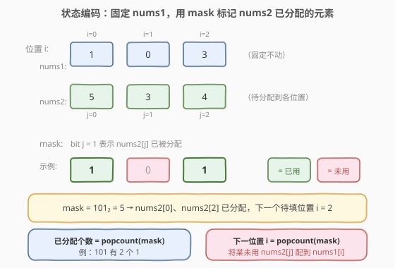
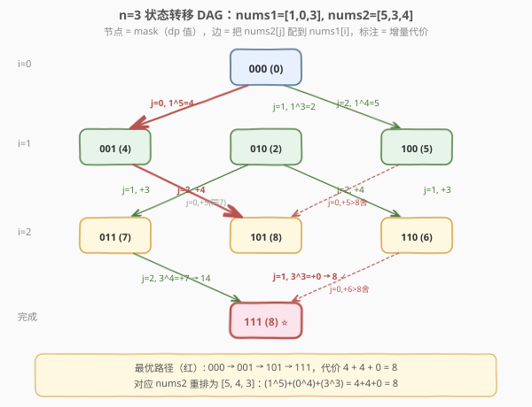

# LeetCode 两个数组最小的异或值之和 题解

## 1. 题目概述

- **标题 / 题号**：两个数组最小的异或值之和（#1879，hard）
- **链接**：https://leetcode.cn/problems/minimum-xor-sum-of-two-arrays/
- **难度**：困难
- **标签**：位运算、动态规划、状态压缩、分配问题

**题意**：给定两个长度都为 $n$ 的整数数组 `nums1` 和 `nums2`。将 `nums2` 中的元素**重新排列**，使**异或值之和**

$$\text{xorSum} = \sum_{i=0}^{n-1} \big(\text{nums1}[i] \oplus \text{nums2}[\sigma(i)]\big)$$

最小。返回该最小异或值之和。

**示例 1**：

```text
输入：nums1 = [1,2], nums2 = [2,3]
输出：2
解释：将 nums2 重排为 [3,2]，异或值之和 = (1 XOR 3) + (2 XOR 2) = 2 + 0 = 2。
```

**示例 2**：

```text
输入：nums1 = [1,0,3], nums2 = [5,3,4]
输出：8
解释：将 nums2 重排为 [5,4,3]，异或值之和 = (1 XOR 5) + (0 XOR 4) + (3 XOR 3) = 4 + 4 + 0 = 8。
```

**约束**：

- $n = \text{nums1.length} = \text{nums2.length}$
- $1 \le n \le 14$
- $0 \le \text{nums1}[i], \text{nums2}[i] \le 10^7$

> ⚠️ **关键信号**：$n \le 14$ 是**状压 DP（bitmask DP）**的标志性甜区——$2^{14} = 16384$ 个状态，恰好落在「可以枚举所有子集」的可承受范围。看到这种小范围 + 「配对/分配」的最值问题，第一反应应是状压 DP。

> 💡 **与 1874 的对照**：[1874. 两个数组的最小乘积和](../1801-1900/1874_两个数组的最小乘积和.md) 求最小**乘积**和、$n \le 10^5$，由**排序不等式**保证「升序配降序」即最小，$O(n \log n)$ 贪心解决。本题求最小**异或**和、$n \le 14$，看似同型，但**异或不满足排序不等式**（无单调性：$a \le b$ 时 $a \oplus c$ 与 $b \oplus c$ 大小关系不定），贪心失效，只能靠状压 DP 暴力枚举所有配对方案。**数据范围的悬殊差异（$10^5$ vs $14$）正是这两种解法的分水岭**。

## 2. 解题思路

### 2.1 暴力思路：全排列枚举

固定 `nums1` 不动，枚举 `nums2` 的所有 $n!$ 种排列，对每种排列计算异或值之和取最小值。时间 $O(n! \cdot n)$，$n=14$ 时 $14! \approx 8.7 \times 10^{10}$，远超时限。

> ⚠️ 瓶颈：全排列爆炸增长。必须利用「**配对是逐步构造的**」这一结构——已配哪些 `nums2` 元素决定了剩余可选集合，用记忆化避免重复子问题。

### 2.2 核心观察：用位掩码记录「nums2 已分配的元素集合」

把问题看作**二分图最小权完美匹配**：左部是 `nums1` 的 $n$ 个位置，右部是 `nums2` 的 $n$ 个元素，边权为 $\text{nums1}[i] \oplus \text{nums2}[j]$，求一一配对使总权最小。$n \le 14$ 时不必上匈牙利算法，直接状压 DP。

在任意中间时刻，我们只关心两件事：

1. **`nums2` 中哪些元素已经被分配掉了**（决定还能选哪些）；
2. **下一个要填 `nums1` 的第几号位置**（决定本轮的异或基准）。

而「下一个位置」由「已分配个数」唯一确定——若已经分配了 $i$ 个 `nums2` 元素，下一个就配 `nums1[i]`。因此**只需要一维信息「已分配集合」就能完整刻画状态**。



用一个 $n$ 位的二进制整数 `mask` 作为状态：

- `mask` 的第 $j$ 位（`0`-indexed）为 `1`，表示 `nums2[j]` **已被分配**到某个位置；
- 已分配个数 = $\text{popcount}(\text{mask})$（二进制中 `1` 的个数）；
- 下一位置 $i = \text{popcount}(\text{mask})$（`0`-indexed，配 `nums1[i]`）。

例如 $n=3$、`mask = 101₂ = 5`：`nums2[0]` 和 `nums2[2]` 已分配，下一个待填位置 $i = 2$（配 `nums1[2]`）。

### 2.3 状态转移

定义 `dp[mask]` = 已经把 `mask` 所表示的 `nums2` 元素分配到前 $\text{popcount}(\text{mask})$ 个位置时，能取得的**最小异或值之和**。

对当前状态 `mask`，下一位置 $i = \text{popcount}(\text{mask})$。枚举每一个**尚未分配**的 `nums2[j]`（即 `mask` 的第 $j$ 位为 `0`），把它配到 `nums1[i]`，产生增量代价 $\text{nums1}[i] \oplus \text{nums2}[j]$，转移到 `mask | (1 << j)`：

$$\text{dp}[\text{mask} \mid (1 \ll j)] \;=\; \min\Big(\text{dp}[\text{mask} \mid (1 \ll j)],\;\; \text{dp}[\text{mask}] + \text{nums1}[i] \oplus \text{nums2}[j]\Big)$$

![状态转移：枚举未用 nums2[j] 配到 nums1[i]，取最小](../images/1879_transition_flow.svg)

- **初始**：`dp[0] = 0`（什么都没配，代价为 0）。
- **其余**：`dp[*]` 初始化为 $+\infty$。
- **答案**：`dp[(1 << n) - 1]`（所有 $n$ 位都为 `1`，即 `nums2` 全部分配完）。

> 💡 **为什么不会漏 / 不会算错？** 每个状态 `mask` 对应一个**确定的已分配集合**，而下一位置 $i$ 又被 $\text{popcount}(\text{mask})$ 唯一确定。从 `mask` 出发分配 `nums2[j]` 走到的新状态 `mask | (1<<j)` 是唯一确定的。每条「分配序列」对应 DAG 上从 `0` 到全 `1` 的一条路径，**一一对应**。取 `min` 保证每个状态只保留到达它的最优前驱，无重复无遗漏。

> ⚠️ **为何不能用贪心？** 异或运算没有单调性：$a \le b$ 时 $a \oplus c$ 与 $b \oplus c$ 的大小关系随 $c$ 的位分布变化。例如 $1 \le 2$，但 $1 \oplus 2 = 3 > 2 \oplus 2 = 0$；而 $1 \oplus 1 = 0 < 2 \oplus 1 = 3$。因此「大配小」的直觉在这里**完全失效**，必须暴力枚举所有配对方案——这正是 $n \le 14$ 这一约束存在的意义。

### 2.4 示例演算（示例 2：`nums1 = [1,0,3]`, `nums2 = [5,3,4]`，$n = 3$）

$2^3 = 8$ 个状态，按 $\text{popcount}$ 分层。$\text{nums1}[i]$ 依次为 $1, 0, 3$。



逐层递推（节点形如 `mask (dp值)`，边标注「选 j, 增量代价」）：

| 层 | 状态 | dp 值 | 推导 |
|----|------|-------|------|
| 0 | `000` | 0 | 初始 |
| 1 | `001` | 4 | `000` 选 $j=0$：$1 \oplus 5 = 4$ |
| 1 | `010` | 2 | `000` 选 $j=1$：$1 \oplus 3 = 2$ |
| 1 | `100` | 5 | `000` 选 $j=2$：$1 \oplus 4 = 5$ |
| 2 | `011` | 7 | `001` 选 $j=1$：$4 + (0 \oplus 3) = 7$（`010` 选 $j=0$ 同为 7，不更优） |
| 2 | `101` | 8 | `001` 选 $j=2$：$4 + (0 \oplus 4) = 8$（`100` 选 $j=0$ 得 10，被舍） |
| 2 | `110` | 6 | `010` 选 $j=2$：$2 + (0 \oplus 4) = 6$（`100` 选 $j=1$ 得 8，被舍） |
| 3 | `111` | **8** ⭐ | `101` 选 $j=1$：$8 + (3 \oplus 3) = 8 + 0 = 8$（`011` 路径得 14、`110` 路径得 12，均被舍） |

最终答案 `dp[111] = 8`，与示例一致。

**最优方案回溯**（红色路径）：`000 → 001 → 101 → 111`

- 位置 $i=0$ ← `nums2[0]=5`（$1 \oplus 5 = 4$）
- 位置 $i=1$ ← `nums2[2]=4`（$0 \oplus 4 = 4$）
- 位置 $i=2$ ← `nums2[1]=3`（$3 \oplus 3 = 0$）

即 `nums2` 重排为 `[5, 4, 3]`，总代价 $4 + 4 + 0 = 8$，与题目解释完全吻合。

> 💡 **关键观察**：最优配对里 `3` 配 `3`（异或为 0）是「免费午餐」，状压 DP 自动发现了这个零代价配对，而不是被某种「大配小」的局部贪心误导。这正是枚举所有方案相对贪心的优势。

## 3. 参考代码

### 方法一：递推（自底向上，推荐）

从小到大枚举 `mask`，把贡献「推」给更大的状态。无需递归栈，常数小。

### Python

```python
class Solution:
    def minimumXORSum(self, nums1: list[int], nums2: list[int]) -> int:
        n = len(nums1)
        full = (1 << n) - 1
        dp = [float('inf')] * (1 << n)
        dp[0] = 0
        for mask in range(1 << n):
            if dp[mask] == float('inf'):
                continue
            i = mask.bit_count()                       # 下一位置（0-indexed）
            if i >= n:
                continue
            for j in range(n):
                if mask & (1 << j):
                    continue                           # nums2[j] 已分配
                nxt = mask | (1 << j)
                cand = dp[mask] + (nums1[i] ^ nums2[j])
                if cand < dp[nxt]:
                    dp[nxt] = cand
        return dp[full]
```

### C++

```cpp
class Solution {
public:
    int minimumXORSum(vector<int>& nums1, vector<int>& nums2) {
        int n = nums1.size();
        int full = (1 << n) - 1;
        vector<int> dp(1 << n, INT_MAX);
        dp[0] = 0;
        for (int mask = 0; mask <= full; ++mask) {
            if (dp[mask] == INT_MAX) continue;          // 不可达状态
            int i = __builtin_popcount(mask);           // 下一位置（0-indexed）
            if (i >= n) continue;
            for (int j = 0; j < n; ++j) {
                if (mask & (1 << j)) continue;          // nums2[j] 已分配
                int nxt = mask | (1 << j);
                int cand = dp[mask] + (nums1[i] ^ nums2[j]);
                if (cand < dp[nxt]) {
                    dp[nxt] = cand;
                }
            }
        }
        return dp[full];
    }
};
```

### 方法二：记忆化搜索（自顶向下，更直观）

### Python

```python
from functools import lru_cache

class Solution:
    def minimumXORSum(self, nums1: list[int], nums2: list[int]) -> int:
        n = len(nums1)
        full = (1 << n) - 1

        @lru_cache(None)
        def dfs(mask: int) -> int:
            if mask == full:
                return 0
            i = mask.bit_count()
            best = float('inf')
            for j in range(n):
                if mask & (1 << j):
                    continue
                best = min(best, dfs(mask | (1 << j)) + (nums1[i] ^ nums2[j]))
            return best

        return dfs(0)
```

### C++

```cpp
class Solution {
public:
    int minimumXORSum(vector<int>& nums1, vector<int>& nums2) {
        int n = nums1.size();
        int full = (1 << n) - 1;
        vector<int> memo(1 << n, -1);
        function<int(int)> dfs = [&](int mask) -> int {
            if (mask == full) return 0;
            if (memo[mask] != -1) return memo[mask];
            int i = __builtin_popcount(mask);
            int best = INT_MAX;
            for (int j = 0; j < n; ++j) {
                if (mask & (1 << j)) continue;
                best = min(best, dfs(mask | (1 << j)) + (nums1[i] ^ nums2[j]));
            }
            return memo[mask] = best;
        };
        return dfs(0);
    }
};
```

> 💡 **实现细节**：
> - **0-indexed 位置**：与 [526. 美丽的排列](../0501-0600/526_优美的排列.md) 的 1-indexed 不同，本题 `nums1` 数组下标本就是 0-indexed，故 $i = \text{popcount}(\text{mask})$ 直接用，无需 $+1$。
> - **`if dp[mask] == INF: continue`** 跳过不可达状态，常数优化明显；`__builtin_popcount` / `int.bit_count()` 是 CPU 单指令 popcount，比手写循环数 `1` 更快。
> - **`i >= n` 的保护**：当 `mask == full` 时 $\text{popcount} = n$，此时已无下一位置可填，递推写法里直接跳过即可（记忆化写法里靠 `mask == full` 基准情形返回）。
> - **数据范围**：$n \le 14$、元素 $\le 10^7 < 2^{24}$，异或结果不超过 $2^{24}$，总和上限 $14 \times 2^{24} \approx 2.3 \times 10^8$，在 32 位 `int` 范围内，C++ 无需 `long long`。

## 4. 复杂度分析

| 维度 | 复杂度 | 说明 |
|------|--------|------|
| 时间复杂度 | $O(n \cdot 2^n)$ | 共 $2^n$ 个状态，每个状态枚举 $n$ 个 `nums2[j]` 判定转移 |
| 空间复杂度 | $O(2^n)$ | `dp` / `memo` 数组大小为 $2^n$ |

$n=14$ 时约为 $14 \times 16384 \approx 2.3 \times 10^5$ 次操作，毫秒级完成。

> 💡 **对比匈牙利算法**：二分图最小权完美匹配的经典解法是匈牙利算法（Kuhn-Munkres），时间 $O(n^3)$。$n=14$ 时 $n^3 = 2744$，比状压 DP 的 $2.3 \times 10^5$ 更优。但状压 DP **写法更短、思路更直接**，且 $n \le 14$ 时两者都远在时限内，面试中状压 DP 是更易实现的首选。若 $n$ 放大到 $50 \sim 500$，则必须改用匈牙利算法。

## 5. 扩展：分配问题与配对优化家族

### 5.1 本题的本质：二分图最小权完美匹配

把 `nums1` 的 $n$ 个位置视为左部节点、`nums2` 的 $n$ 个元素视为右部节点，边 $(i, j)$ 的权为 $\text{nums1}[i] \oplus \text{nums2}[j]$。求一一配对使总权最小，即**二分图最小权完美匹配**。

- $n \le 20$：状压 DP，$O(n \cdot 2^n)$；
- $n$ 更大：匈牙利算法 / KM 算法，$O(n^3)$。

### 5.2 为何 1874 能贪心而 1879 不能

| 题目 | 配对代价函数 | 是否满足排序不等式 | 数据范围 | 解法 |
|------|--------------|--------------------|----------|------|
| [1874. 最小乘积和](../1801-1900/1874_两个数组的最小乘积和.md) | $a \times b$ | ✅（乘法关于正数单调） | $n \le 10^5$ | 排序 + 逆序配对 $O(n \log n)$ |
| **1879. 最小异或值之和** | $a \oplus b$ | ❌（异或无单调性） | $n \le 14$ | 状压 DP $O(n \cdot 2^n)$ |

**排序不等式**要求代价函数 $f(a, b)$ 在 $a, b$ 上**按相同方向单调**。乘积 $a \times b$（正数域）满足；但异或 $a \oplus b$ 是**按位**运算，整体大小取决于两数位模式的差异，与数值大小无单调关系。这是两题解法分野的根本原因。

### 5.3 若代价函数改为「差的绝对值之和」

$\sum |a_i - b_{\sigma(i)}|$ 中的绝对值差关于 $a, b$ **单调**，故也满足排序不等式——升序配降序并非最优，反而**升序配升序**最小（因为 $|a - b|$ 在两者接近时最小）。可见代价函数的结构决定了贪心方向，不能想当然。

### 5.4 求具体配对方案

状压 DP 只给出最小代价。若要还原具体配对（`nums2` 怎么重排），可额外维护 `pre[mask]` 记录最优前驱的 $j$，最后从 `full` 回溯到 `0` 即可。面试中可主动提及。

## 6. 面试要点

**Q1：为什么 $n \le 14$ 提示用状压 DP？**

> $2^{14} = 16384$ 个状态，乘以 $n$ 的转移枚举约 $2.3 \times 10^5$ 次操作，毫秒级完成。一般 $n \le 20$ 的「选/不选」或「配对/分配」计数/最值问题都可考虑状压 DP，这是**面试中识别该套路的经验阈值**。

**Q2：状态为什么只需一维 `mask`，不用再记「当前位置」？**

> 位置 $i$ 由 $\text{popcount}(\text{mask})$ 唯一确定：分配了几个 `nums2` 元素，下一个就配 `nums1[i]`。所以「已分配集合」已包含全部信息，无需额外维度。

**Q3：本题和 1874（最小乘积和）形似，为何解法完全不同？**

> 1874 的代价是**乘积**，满足排序不等式，「升序配降序」即最小，$O(n \log n)$ 贪心可解、$n$ 可达 $10^5$。本题代价是**异或**，无单调性（$a \le b$ 时 $a \oplus c$ 与 $b \oplus c$ 大小不定），贪心失效，必须枚举所有配对方案，故 $n$ 被限制在 14 内用状压 DP。**数据范围的悬殊差异正是这两种代价函数能否贪心的体现**。

**Q4：能否不用状压 DP，用匈牙利算法？**

> 可以。本题本质是二分图最小权完美匹配，匈牙利（KM）算法 $O(n^3) = O(2744)$ 也能解且更快。但状压 DP 写法更短、思路更直接，$n \le 14$ 时两者都远在时限内，面试先写状压 DP，再口述匈牙利作为 $n$ 放大时的进阶即可。

**Q5：如何还原具体的 `nums2` 重排方案？**

> 在递推时额外维护 `choice[mask] = j`，记录到达 `mask` 最优时所分配的 `nums2[j]`。从 `full` 出发，根据 $\text{choice}[\text{full}]$ 取出 $j$，把 `nums2[j]` 放到位置 $n-1$；然后 `mask ^= (1 << j)` 回到前驱，继续取 `choice`，直到 `mask = 0`，即可还原整条配对路径。

> 💡 **一句话总结**：$n \le 14$ 的配对最值问题 → 状压 DP，`mask` 标记 `nums2` 已分配集合，$i = \text{popcount}(\text{mask})$ 定位置，$O(n \cdot 2^n)$ 枚举所有配对取最小。异或无单调性，贪心失效，只能暴力枚举——这正是小数据范围存在的意义。

## 同类练习题

| # | 题目 | 与本题的关联 |
|---|------|-------------|
| 1874 | [两个数组的最小乘积和](https://leetcode.cn/problems/minimize-product-sum-of-two-arrays/)（[站内题解](../1801-1900/1874_两个数组的最小乘积和.md)） | 同型「两数组配对最小化和」，但代价为乘积（满足排序不等式），$n \le 10^5$ 贪心可解——对比可体会「代价函数是否单调」决定能否贪心 |
| 526 | [优美的排列](https://leetcode.cn/problems/beautiful-arrangement/)（[站内题解](../0501-0600/526_优美的排列.md)） | 状压 DP 母题，`mask` 标记已放数字集合，$n \le 15$，计数型——承接本题的最值型，模板一致 |
| 1799 | [N 次操作后的最大分数](https://leetcode.cn/problems/maximize-score-after-n-operations/) | `mask` 标记剩余可用数字，成对取数求最大得分，$n \le 14$——「配对/分组」型状压 DP 的另一变体 |
| 1944 | [队列中可以看到的人数](https://leetcode.cn/problems/number-of-visible-people-in-a-queue/) | 单调栈配对计数，对照「配对优化」在不同结构下的解法选择 |
| 1066 | [校园自行车分配 II](https://leetcode.cn/problems/campus-bikes-ii/) | $n \le 10$ 的二分图最小权匹配，状压 DP 经典应用，与本题完全同构（左部人、右部车、边权距离） |
