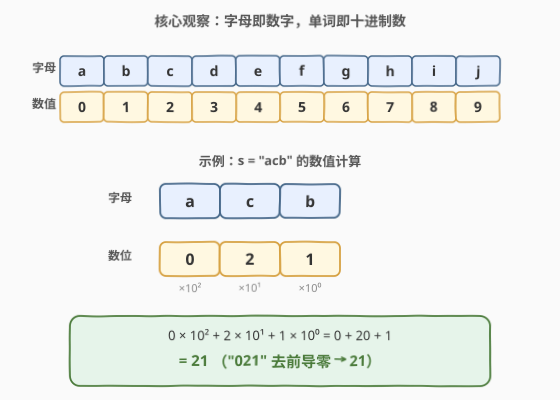
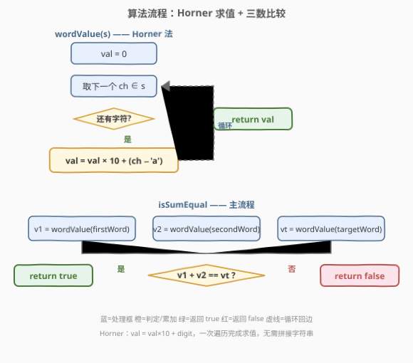
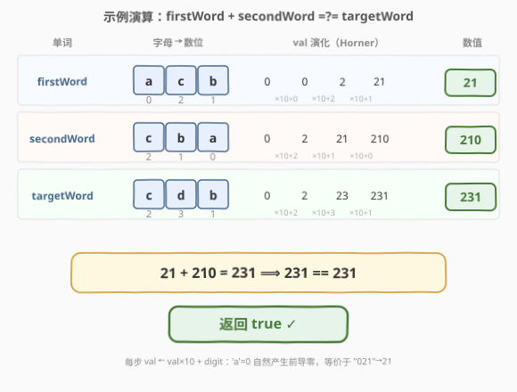

# LeetCode 检查某单词是否等于两单词之和 题解

## 1. 题目概述

- **标题 / 题号**：检查某单词是否等于两单词之和（#1880，easy）
- **链接**：https://leetcode.cn/problems/check-if-word-equals-summation-of-two-words/
- **难度**：简单
- **标签**：字符串、数学

**题意**：字母的**字母值**取决于字母在字母表中的位置，从 $0$ 开始计数，即 `'a'` $\to 0$、`'b'` $\to 1$、`'c'` $\to 2$，以此类推。

对某个由小写字母组成的字符串 $s$ 而言，其**数值**等于将 $s$ 中每个字母的字母值**按顺序连接**并**转换**成对应整数。

> 例如，$s = \texttt{"acb"}$，依次连接每个字母的字母值得到 `"021"`，转换为整数得到 $21$。

给你三个字符串 `firstWord`、`secondWord` 和 `targetWord`，每个字符串都由从 `'a'` 到 `'j'`（含 `'a'` 和 `'j'`）的小写英文字母组成。如果 `firstWord` 和 `secondWord` 的**数值之和**等于 `targetWord` 的数值，返回 `true`；否则返回 `false`。

**示例 1**：

```text
输入：firstWord = "acb", secondWord = "cba", targetWord = "cdb"
输出：true
解释：
firstWord 的数值为  "acb" -> "021" -> 21
secondWord 的数值为 "cba" -> "210" -> 210
targetWord 的数值为 "cdb" -> "231" -> 231
由于 21 + 210 == 231，返回 true
```

**示例 2**：

```text
输入：firstWord = "aaa", secondWord = "a", targetWord = "aab"
输出：false
解释：
firstWord 的数值为  "aaa" -> "000" -> 0
secondWord 的数值为 "a"   -> "0"   -> 0
targetWord 的数值为 "aab" -> "001" -> 1
由于 0 + 0 != 1，返回 false
```

**示例 3**：

```text
输入：firstWord = "aaa", secondWord = "a", targetWord = "aaaa"
输出：true
解释：
firstWord 的数值为  "aaa"  -> "000"  -> 0
secondWord 的数值为 "a"    -> "0"    -> 0
targetWord 的数值为 "aaaa" -> "0000" -> 0
由于 0 + 0 == 0，返回 true
```

**约束**：

- $1 \le \text{firstWord.length},\, \text{secondWord.length},\, \text{targetWord.length} \le 8$
- `firstWord`、`secondWord` 和 `targetWord` 仅由从 `'a'` 到 `'j'`（含 `'a'` 和 `'j'`）的小写英文字母组成

> 💡 **关键约束**：字母范围限定在 `'a'` ~ `'j'`，恰好对应数字 $0$ ~ $9$——每个字母就是一个**十进制数字**。于是「连接字母值再转整数」本质上就是把单词当作一个**十进制数**来读，`'a'` 充当数字 $0$（含前导零）。

## 2. 解题思路

### 2.1 暴力思路：拼接字符串再转整数

最直觉的做法：对每个单词，遍历字母取出字母值 $d_i = \texttt{ch} - \texttt{'a'}$，拼成数字字符串（如 `"021"`），再用 `int()` / `stoi()` 转成整数。最后比较 $\text{val}(\text{firstWord}) + \text{val}(\text{secondWord})$ 是否等于 $\text{val}(\text{targetWord})$。

```text
def value(s):
    digits = ''.join(str(ord(ch) - ord('a')) for ch in s)
    return int(digits)
return value(firstWord) + value(secondWord) == value(targetWord)
```

时间 $O(n)$、空间 $O(n)$（存中间字符串），能 AC。但有两个冗余：

1. **多建了一个字符串**：题目只要数值，拼接 `digit` 字符再解析回来是「数值 → 字符 → 数值」的来回折返。
2. **前导零的语义被绕了一圈**：`"021"` 经 `int()` 转换时才丢弃前导零，其实**按位累乘**天然就处理了前导零——$0 \times 10^k = 0$ 对高位无贡献。

> 💡 转机：把「拼接字符再解析」替换为「**按位累加**」——这正是**多项式求值**的标准做法：Horner 法。

### 2.2 核心观察：字母即数字，单词即十进制数（Horner 求值）



字母 `'a'` ~ `'j'` 的字母值恰好是 $0$ ~ $9$，所以一个单词就是**一个十进制数**的字母编码形式。其数值可用**按位多项式**表示：

$$\text{val}(s) = \sum_{i=0}^{n-1} d_i \cdot 10^{\,n-1-i}, \qquad d_i = s[i] - \texttt{'a'} \in \{0,1,\dots,9\}$$

例如 $s = \texttt{"acb"}$：$d = [0, 2, 1]$，$\text{val} = 0 \times 10^2 + 2 \times 10^1 + 1 \times 10^0 = 0 + 20 + 1 = 21$。前导 `'a'`（$d_0 = 0$）贡献为 $0$，自然等价于 `"021"` 去前导零得 $21$。

直接按多项式展开需要预处理 $10^k$，更简洁的是 **Horner 法**（秦九韶算法）——从左到右扫描，每读一位就把已累积的值「左移一位」（乘 $10$）再加新数位：

$$\text{val} = 0;\quad \text{val} \leftarrow \text{val} \times 10 + d_i \quad (i = 0, 1, \dots, n-1)$$

以 `"acb"` 为例：$\text{val} = 0 \to 0\times10+0 = 0 \to 0\times10+2 = 2 \to 2\times10+1 = 21$。

> 💡 **为什么 Horner 等价于「拼接再转整数」？** 十进制数的标准展开 $\sum d_i \cdot 10^{n-1-i}$ 正是 Horner 法的展开形式。Horner 法只是把多项式求值从「$O(n)$ 次乘幂 + 求和」重写为「$n$ 次 `×10 + d`」——少存中间字符串、无需处理前导零，一次遍历直接出数值。这正是 [171. Excel 表列序号](https://leetcode.cn/problems/excel-sheet-column-number/) 中 26 进制合成的同一套路（基数从 26 换成 10）。

**时间复杂度**：$O(n)$，每个字符一次乘加；**空间复杂度**：$O(1)$，仅维护一个累加变量。

### 2.3 算法流程图



整体分两层：

- **`wordValue(s)` 辅助函数**：`val = 0`，遍历每个字符 `ch`，执行 `val = val × 10 + (ch − 'a')`，遍历结束返回 `val`。
- **主流程**：调用三次 `wordValue` 得到 `v1`、`v2`、`vt`，判定 `v1 + v2 == vt`，相等返回 `true`，否则 `false`。

> 💡 **实现细节**：字母值 $d_i = \texttt{ch} - \texttt{'a'}$ 直接用字符 ASCII 差计算，无需哈希表。最长 $8$ 位、最大数字 $9$，故最大数值 $\le 99999999 < 10^8$，远在 32 位 `int` 范围内，无需大整数。

### 2.4 示例演算



以示例 1 逐步展示三个单词的 Horner 求值过程：

| 单词 | 字母→数位 | val 演化（Horner） | 数值 |
|------|-----------|---------------------|------|
| `firstWord` = `"acb"` | $a,c,b \to 0,2,1$ | $0 \xrightarrow{+0} 0 \xrightarrow{\times10+2} 2 \xrightarrow{\times10+1} 21$ | $21$ |
| `secondWord` = `"cba"` | $c,b,a \to 2,1,0$ | $0 \xrightarrow{+2} 2 \xrightarrow{\times10+1} 21 \xrightarrow{\times10+0} 210$ | $210$ |
| `targetWord` = `"cdb"` | $c,d,b \to 2,3,1$ | $0 \xrightarrow{+2} 2 \xrightarrow{\times10+3} 23 \xrightarrow{\times10+1} 231$ | $231$ |

最终比较：$21 + 210 = 231$，而 $\text{val}(\text{targetWord}) = 231$，$231 == 231$ 成立，返回 `true`。

> 💡 **对照示例 2/3**：当单词全为 `'a'` 时，每位 $d_i = 0$，Horner 法始终 `val = 0×10 + 0 = 0`，与 `"000"` → `int("000") = 0` 一致——前导零在按位累乘下天然消失，无需特判。

## 3. 参考代码

### Python

```python
class Solution:
    def isSumEqual(self, firstWord: str, secondWord: str, targetWord: str) -> bool:
        def wordValue(s: str) -> int:
            val = 0
            for ch in s:
                val = val * 10 + (ord(ch) - ord('a'))
            return val
        return wordValue(firstWord) + wordValue(secondWord) == wordValue(targetWord)
```

### C++

```cpp
class Solution {
public:
    bool isSumEqual(string firstWord, string secondWord, string targetWord) {
        auto wordValue = [](const string& s) {
            int val = 0;
            for (char ch : s) {
                val = val * 10 + (ch - 'a');
            }
            return val;
        };
        return wordValue(firstWord) + wordValue(secondWord) == wordValue(targetWord);
    }
};
```

### Python（拼接字符串版，对照用）

```python
class Solution:
    def isSumEqual(self, firstWord: str, secondWord: str, targetWord: str) -> bool:
        def wordValue(s: str) -> int:
            return int(''.join(str(ord(ch) - ord('a')) for ch in s))
        return wordValue(firstWord) + wordValue(secondWord) == wordValue(targetWord)
```

> ⚠️ **两种写法对比**：拼接版把「数值 → 字符 → 数值」绕一圈，多分配一个中间字符串、还需 `int()` 解析前导零；Horner 版直接「字符 → 数值」，一次遍历 $O(1)$ 额外空间。两者时间同为 $O(n)$，但 Horner 版更省空间、更贴近本质。面试先写 Horner 版，再提拼接版作直觉对照。

## 4. 复杂度分析

| 维度 | 复杂度 | 说明 |
|------|--------|------|
| 时间复杂度 | $O(n)$ | $n$ 为三个单词的总长度，每个字符一次 `×10 + d` 运算，三次 `wordValue` 调用共遍历三串 |
| 空间复杂度 | $O(1)$ | 仅维护累加变量 `val`，与输入规模无关；拼接版为 $O(n)$（中间字符串） |

> 💡 **数值范围核算**：单词最长 $8$ 位、每位最大 $9$，故单个单词数值 $\le 99999999 \approx 10^8$；两数之和 $\le 2 \times 10^8$，远小于 32 位 `int` 上界 $\approx 2.1 \times 10^9$，无需 `long long`。

## 5. 扩展：进制视角与 Horner 法的通用性

### 5.1 单词即 10 进制数

把字母 `'a'`~`'j'` 视为「数字 $0$~$9$」的字符编码，单词就是一个 **10 进制数**。本题的「连接字母值再转整数」= 10 进制按位展开求值。若字母范围扩到 `'a'`~`'z'`（$0$~$25$），则单词变成 **26 进制数**——这正是 [171. Excel 表列序号](https://leetcode.cn/problems/excel-sheet-column-number/) 的模型（ albeit 1-indexed）。Horner 法对任意基数 $b$ 都成立：

$$\text{val} \leftarrow \text{val} \times b + d_i$$

只需把 $10$ 换成 $b$。

### 5.2 Horner 法与多项式求值

更一般地，Horner 法是**多项式求值**的最优算法：$P(x) = d_0 x^{n-1} + d_1 x^{n-2} + \cdots + d_{n-1}$ 可重写为

$$P(x) = (\cdots((d_0 \cdot x + d_1) \cdot x + d_2) \cdot x + \cdots) \cdot x + d_{n-1}$$

把 $x = 10$ 代入即得本题的数值计算。Horner 法把 $O(n)$ 次乘幂降为 $n$ 次乘加，是数值计算中「减少乘法次数」的经典技巧。

### 5.3 若字母范围扩大或基数变化

- **字母到 `'z'`（$0$~$25$）**：单词变为 26 进制数，`val = val * 26 + (ch - 'a')`。此时「连接字母值再转整数」的语义失效（因为 $25$ 是两位十进制数，连接后不再是 26 进制），但 Horner 法依旧正确——只要明确基数 $b = 26$。
- **字母到 `'a'`~`'i'`（$0$~$8$）**：单词变为 9 进制数，`val = val * 9 + d`。本题限定 `'a'`~`'j'` 恰好让基数 $= 10$，与「十进制连接」语义一致，是题目设计的精巧之处。

## 6. 面试要点

**Q1：为什么不直接拼接字符串再 `int()` 转换？**

> 拼接版能 AC，但 (1) 多分配一个 $O(n)$ 的中间字符串；(2) 把「数值 → 字符 → 数值」绕了一圈，`int()` 还需解析前导零。Horner 法直接「字符 → 数值」，一次遍历 $O(1)$ 额外空间，且前导零在 `val × 10 + 0 = val` 中天然无效化，无需特判。

**Q2：Horner 法为什么等价于「连接字母值再转整数」？**

> 十进制数的标准展开 $\sum d_i \cdot 10^{n-1-i}$ 就是 Horner 法的展开形式。Horner 法只是把多项式求值从「预处理 $10^k$ 再求和」重写为「从左到右 $n$ 次 `×10 + d`」，两者代数等价。本题字母 `'a'`~`'j'` 恰好是 $0$~$9$，故基数 $= 10$，与十进制语义一致。

**Q3：前导 `'a'`（=0）如何处理？**

> Horner 法中 `val = 0 × 10 + 0 = 0`，前导零对累积值无贡献，等价于 `int("021") = 21` 自动丢弃前导零。无需任何特判——这是按位累乘相比字符串拼接的额外收益。

**Q4：字母范围为什么限定 `'a'`~`'j'`？**

> `'a'`~`'j'` 的字母值恰好是 $0$~$9$，每位是一个十进制数字，故「连接字母值」与「十进制按位展开」语义一致。若扩到 `'k'` 及以后（$\ge 10$），字母值变成两位十进制数，「连接」操作会破坏按位对应关系——此时需明确改用 26 进制 Horner（`val = val × 26 + d`），而非十进制连接。

**Q5：会溢出吗？需要 `long long` 吗？**

> 不会。单词最长 $8$ 位、每位最大 $9$，单个数值 $\le 99999999 \approx 10^8$，两数之和 $\le 2 \times 10^8$，远小于 32 位 `int` 上界 $\approx 2.1 \times 10^9$。`int` 足够，无需 `long long`。但面试中可主动点出此边界核算，展示对溢出的敏感度。

> 💡 **一句话总结**：字母 `'a'`~`'j'` 即数字 $0$~$9$，单词即十进制数；用 Horner 法 `val = val×10 + (ch−'a')` 一次遍历求值，三次调用后比较和是否相等，$O(n)$ 时间 $O(1)$ 空间。

## 同类练习题

| # | 题目 | 与本题的关联 |
|---|------|-------------|
| 171 | [Excel 表列序号](https://leetcode.cn/problems/excel-sheet-column-number/)（[站内题解](../0101-0200/171_Excel表列序号.md)） | 26 进制 Horner 合成方向（`val = val×26 + d`），本题的进制泛化版，基数从 10 换成 26 |
| 168 | [Excel 表列名称](https://leetcode.cn/problems/excel-sheet-column-title/)（[站内题解](../0001-0100/168_Excel表列名称.md)） | 1-indexed 进制转换分解方向（先减 1 再取余），与 171 互为逆运算，对照本题的「字母↔数字」双向映射 |
| 1837 | [K 进制表示下的各位数字总和](https://leetcode.cn/problems/sum-of-digits-in-base-k/)（[站内题解](../1801-1900/1837_K进制表示下的各位数字总和.md)） | 进制转换 + 数位求和，同为「按位展开」思想，对照 Horner 法的分解侧 |
| 1945 | [数字后缀和为 K 的字符串](https://leetcode.cn/problems/sum-of-digits-of-string-after-convert/) | 字母→数字映射 + 数位累加，同为「字符编码到数值」的转换套路 |
| 415 | [字符串相加](https://leetcode.cn/problems/add-strings/)（[站内题解](../0401-0500/415_字符串相加.md)） | 字符串形式的数值加法，对照本题「字符→数值→相加」的处理路径 |
