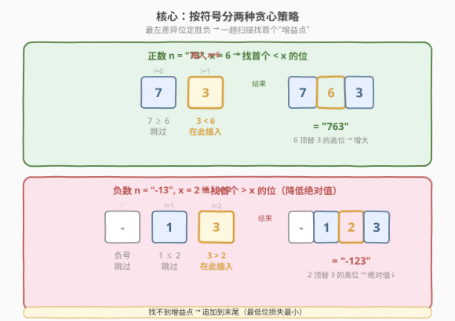
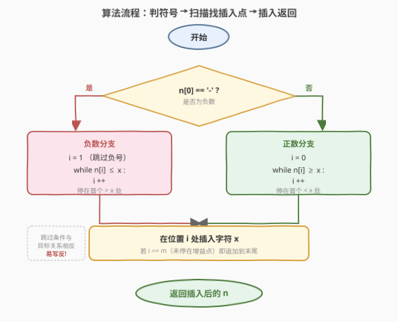
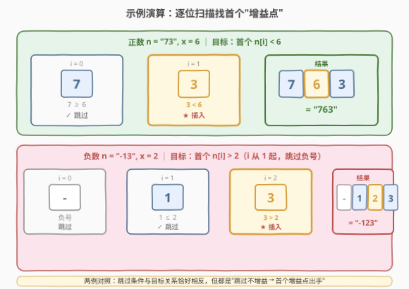

# LeetCode 插入后的最大值 题解

## 1. 题目概述

- **标题 / 题号**：插入后的最大值（#1881，medium）
- **链接**：https://leetcode.cn/problems/maximum-value-after-insertion/
- **难度**：中等
- **标签**：贪心、字符串

**题意**：给你一个非常大的整数 `n` 和一个数字 `x`（$1 \le x \le 9$）。`n` 用字符串表示，其中每一位数字都在 $[1,9]$ 内，且 `n` 可能是**负数**（以 `'-'` 开头）。

你可以在 `n` 的十进制表示的**任意位置**插入一个 `x`，以**最大化** `n` 的数值。但**不能**在负号左边插入。返回插入后用字符串表示的 `n` 的最大值。

> 例如 `n = "73"`、`x = 6`，最佳是把 `6` 插在 `7` 和 `3` 之间，得 `"763"`；`n = "-55"`、`x = 2`，最佳是把 `2` 插在第一个 `5` 之前，得 `"-255"`。

**示例 1**：

```text
输入：n = "99", x = 9
输出："999"
解释：不管插在哪里结果都相同。
```

**示例 2**：

```text
输入：n = "-13", x = 2
输出："-123"
解释：可得到 -213、-123 或 -132，最大的是 -123。
```

**约束**：

- $1 \le \text{n.length} \le 10^5$
- $1 \le x \le 9$
- `n` 中每一位数字都在闭区间 $[1,9]$ 内
- `n` 表示一个有效整数；为负时以 `'-'` 开头

> 💡 **题眼**：插入位置有 $n+1$ 种，但**最左边的"决定性差异位"直接定胜负**——这正是贪心的切入点。再注意到正数要"越大越好"、负数要"绝对值越小越好"，两种符号对应两套镜像规则。

## 2. 解题思路

### 2.1 暴力思路：枚举所有插入位置

最直白的做法是枚举 $n+1$ 个插入位置，对每个位置构造新串 $O(n)$，再两两比较取最大 $O(n)$，总复杂度 $O(n^2)$。当 $n = 10^5$ 时约 $10^{10}$ 次操作，必然超时。

> ⚠️ **浪费在哪**：完全没有利用"高位定胜负"的结构。其实只要找到**最优的那一个位置**即可，根本不必逐个枚举比较。

### 2.2 核心观察：按符号分两种贪心策略



把插入 `x` 在位置 $i$ 的结果记为 $R_i = n[0..i{-}1] + x + n[i..]$。任取两个候选 $R_i$、$R_j$（$i < j$），它们共享前缀 $n[0..i{-}1]$，**第一个不同位是第 $i$ 位**：$R_i$ 此处是 $x$、$R_j$ 此处是 $n[i]$。因此谁大完全由 $x$ 与 $n[i]$ 的大小关系决定——**最左的差异位一锤定音**。

由此推出两套镜像规则：

**正数（要最大）**：希望 $x$ 出现在"尽可能靠左、且 $x > n[i]$"的位置。从左到右扫描，找**第一个** $n[i] < x$ 的位置，把 $x$ 插在它前面——这样 $x$ 抢占了最高位的"增益点"。若所有位都 $\ge x$（无处可增益），则插到**末尾**（最低位加一个 $x$ 损失最小）。

**负数（要最大 $\Leftrightarrow$ 绝对值最小）**：希望 $x$ 出现在"尽可能靠左、且 $x < n[i]$"的位置（用更小的 $x$ 顶替更大的 $n[i]$，降低绝对值）。从左到右扫描，找**第一个** $n[i] > x$ 的位置，把 $x$ 插在它前面。若所有位都 $\le x$，则插到**末尾**。

> 💡 **正确性直觉**：以正数为例，设 $i^\*$ 是最左的 $n[i] < x$ 位。对任意 $j < i^\*$，由 $i^\*$ 的最左性有 $n[j] \ge x$，所以 $R_{i^\*}$ 在第 $j$ 位不劣于 $R_j$（$n[j] > x$ 时严格更优；$n[j] = x$ 时打平继续往后比，最终在 $i^\*$ 处 $R_{i^\*}$ 的 $x$ 胜过 $R_j$ 的 $n[i^\*] < x$）；对任意 $j > i^\*$，$R_{i^\*}$ 在第 $i^\*$ 位即胜出。故 $R_{i^\*}$ 全局最大。负数情形对称。

### 2.3 算法流程图



1. **判符号**：看 `n[0]` 是否为 `'-'`。
2. **正数分支**：`i = 0`，`while i < m and n[i] >= x: i++`（跳过所有 $\ge x$ 的位，停在首个 $< x$ 处或末尾）。
3. **负数分支**：`i = 1`（跳过负号），`while i < m and n[i] <= x: i++`（跳过所有 $\le x$ 的位，停在首个 $> x$ 处或末尾）。
4. **插入**：在位置 `i` 处插入 `x`，返回新串。

两分支共用一个"跳过不增益的位、在首个增益点插入"的骨架，只是比较方向相反。

### 2.4 示例演算



以两组样例追踪扫描过程：

**正数 `n = "73"`、`x = 6`**（找首个 $< 6$ 的位）：

| 步骤 | 当前位 | 比较 | 动作 | 说明 |
|------|--------|------|------|------|
| $i=0$ | `7` | $7 \ge 6$ | 跳过 | 此处插入会使第 0 位由 7 变 6，变小，不增益 |
| $i=1$ | `3` | $3 < 6$ | **插入** | 首个增益点：用 6 顶替 3 的位置，3 后移 |
| 结果 | — | — | `"7" + "6" + "3"` | $\to$ `"763"` ✓ |

**负数 `n = "-13"`、`x = 2`**（跳过 `'-'`，找首个 $> 2$ 的位）：

| 步骤 | 当前位 | 比较 | 动作 | 说明 |
|------|--------|------|------|------|
| $i=1$ | `1` | $1 \le 2$ | 跳过 | 此处插入会使第 1 位由 1 变 2，绝对值变大，不增益 |
| $i=2$ | `3` | $3 > 2$ | **插入** | 首个增益点：用 2 顶替 3 的位置，绝对值下降 |
| 结果 | — | — | `"-1" + "2" + "3"` | $\to$ `"-123"` ✓ |

> 💡 **对照两组样例的对称性**：正数"跳过 $\ge x$、停在 $< x$"，负数"跳过 $\le x$、停在 $> x$"——方向恰好相反，但都是"跳过不增益的位、在首个增益点出手"。这正是贪心由符号驱动的体现。

## 3. 参考代码

### C++

```cpp
class Solution {
public:
    string maxValue(string n, int x) {
        char c = '0' + x;
        int i = 0, m = n.size();
        if (n[0] != '-') {
            while (i < m && (n[i] - '0') >= x) i++;   // 正数：跳过 >= x，停在首个 < x
        } else {
            i = 1;                                    // 跳过负号
            while (i < m && (n[i] - '0') <= x) i++;   // 负数：跳过 <= x，停在首个 > x
        }
        n.insert(n.begin() + i, c);
        return n;
    }
};
```

### Python

```python
class Solution:
    def maxValue(self, n: str, x: int) -> str:
        c = str(x)
        if n[0] != '-':
            i = 0
            while i < len(n) and n[i] >= c:           # 正数：跳过 >= x，停在首个 < x
                i += 1
        else:
            i = 1                                     # 跳过负号
            while i < len(n) and n[i] <= c:           # 负数：跳过 <= x，停在首个 > x
                i += 1
        return n[:i] + c + n[i:]
```

> ⚠️ **细节**：Python 版用单字符字符串比较 `n[i] >= c`（`c = str(x)`），因 `'0'..'9'` 的 ASCII 序与数值序一致，等价于数值比较但更省一次 `int()` 转换。C++ 版用 `(n[i] - '0') >= x` 做数值比较。两版逻辑完全镜像：正数取 `>=` 跳过、负数取 `<=` 跳过，**比较符号与"要找的关系"相反**——这是最易写反的陷阱。

## 4. 复杂度分析

| 维度 | 复杂度 | 说明 |
|------|--------|------|
| 时间复杂度 | $O(n)$ | 单趟扫描，`i` 至多走到末尾；`insert` / 切片拼接各 $O(n)$，总计线性 |
| 空间复杂度 | $O(n)$ | 结果串长度为 $n+1$（C++ 原地 `insert` 扩容亦为 $O(n)$；Python 切片产生新串） |

> 💡 **与暴力的对比**：暴力 $O(n^2)$ 在 $n = 10^5$ 下约 $10^{10}$ 次操作超时；本解法 $O(n) \approx 10^5$ 次。增益来源于"最左差异位定胜负"的贪心，把"枚举 $n+1$ 个位置再比较"压缩成"一次扫描找首个增益点"。

## 5. 扩展：为什么"首个增益点"就是全局最优

贪心的正确性可严格证明，核心是**前缀相同 + 首差位定胜负**。以正数为例（设 $i^\*$ 为最左的 $n[i] < x$ 位）：

- **对任意 $j < i^\*$**：由最左性，$n[j] \ge x$。
  - 若 $n[j] > x$：$R_{i^\*}$ 在第 $j$ 位是 $n[j]$、$R_j$ 在第 $j$ 位是 $x$，$n[j] > x \Rightarrow R_{i^\*} > R_j$，直接胜出。
  - 若 $n[j] = x$：第 $j$ 位打平，继续往后比较，最终在 $i^\*$ 处 $R_{i^\*}$ 的 $x$ 胜过 $R_j$ 的 $n[i^\*] < x$。
- **对任意 $j > i^\*$**：$R_{i^\*}$ 与 $R_j$ 在第 $i^\*$ 位首次不同，$R_{i^\*}$ 是 $x$、$R_j$ 是 $n[i^\*] < x$，$R_{i^\*} > R_j$。

故 $R_{i^\*}$ 严格优于所有其他候选 $\Rightarrow$ 全局最大。**若不存在 $n[i] < x$**（所有位 $\ge x$），则任意 $i < m$ 处插入都使第 $i$ 位由 $n[i] \ge x$ 变 $x$（不增），唯有末尾插入只动最低位、损失最小，故选末尾。负数情形把"$<$ / $>$"与"最大 / 最小"同时取反，论证完全对称。

> 💡 **一句话**：首位差异定胜负 $\Rightarrow$ 最左增益点即最优 $\Rightarrow$ 一趟扫描搞定。这是"高位优先"贪心的典型范式。

## 6. 面试要点

**Q1：为什么正数找"首个 $< x$"、负数找"首个 $> x$"？**

> 两个候选结果串的第一个不同位决定大小。正数要最大，希望 $x$ 抢占"最高位且 $x > n[i]$"的位置，故从左扫到第一个 $n[i] < x$ 处插入。负数要最大（即绝对值最小），希望 $x$ 顶替"最高位且 $x < n[i]$"的位置以降低绝对值，故找第一个 $n[i] > x$。

**Q2：如果扫描完都没找到满足条件的位怎么办？**

> 说明任意位置插入都不增益（正数所有位 $\ge x$、负数所有位 $\le x$）。此时把 $x$ 插到**末尾**——末尾是最低位，加一个 $x$ 带来的变化最小。代码中 `while` 自然走到 `i == m`，`insert` / 切片即在末尾追加，无需特判。

**Q3：能否不用判符号、统一一套逻辑？**

> 可以把"找首个满足谓词的位"抽象出来，正数谓词为 `n[i] < x`、负数谓词为 `n[i] > x`，再传一个起始下标（正数 0、负数 1）。但两分支比较方向相反、起始下标不同，强行合并反而易错。面试中直写两分支更清晰，抽象化是"能口述优化"的加分项。

**Q4：时间 / 空间复杂度各是多少？**

> 时间 $O(n)$：单趟扫描，`i` 至多走到末尾，每步 $O(1)$。空间 $O(n)$：结果串长度 $n+1$；C++ 原地 `insert` 会触发扩容搬运 $O(n)$，Python 切片产生新串 $O(n)$。无递归栈、无额外数据结构。

**Q5：`x` 与 `n[i]` 比较时有什么实现细节？**

> C++ 中 `n[i]` 是 `char`，需 `n[i] - '0'` 转数值再与 `int x` 比；若直接 `n[i] >= x` 会把字符 ASCII 码（如 `'9'` = 57）与数字 9 比较，逻辑全错。Python 中用单字符字符串 `n[i] >= str(x)` 可直接比，因 `'0'..'9'` 的 ASCII 序与数值序一致；若写成 `int(n[i]) >= x` 也对但多一次转换。**最易写反的是跳过条件**：正数"找 $< x$"⇒ 跳过条件是 `>= x`，负数"找 $> x$"⇒ 跳过条件是 `<= x`，比较符与目标关系相反。

> 💡 **一句话总结**：判符号后一趟扫描——正数找首个 $< x$ 的位、负数找首个 $> x$ 的位插入，找不到就追加末尾；$O(n)$ / $O(n)$，"最左差异位定胜负"是贪心根基。

## 同类练习题

| # | 题目 | 与本题的关联 |
|---|------|-------------|
| 402 | [移掉 K 位数字](https://leetcode.cn/problems/remove-k-digits/) | 同样是"高位定胜负"的字符串贪心，用单调栈从左到右删较大的高位，对照"插入增益位"与"删除衰减位"的镜像操作 |
| 321 | [拼接最大数](https://leetcode.cn/problems/create-maximum-number/) | 在两个数组中选 k 位拼成最大数，仍是"高位优先 + 单调栈"贪心，是 402 的双数组进阶版 |
| 1323 | [6 和 9 组成的最大数字](https://leetcode.cn/problems/maximum-69-number/) | 贪心改一个数字使数最大——把最左的 6 改成 9，与本题正数分支"在最左增益位动手"同源，难度更小可作热身 |
| 1754 | [构造字典序最大的合并字符串](https://leetcode.cn/problems/largest-merge-of-two-strings/) | 逐位贪心选较大后缀，"首差位定胜负"的另一个应用场景 |
| 179 | [最大数](https://leetcode.cn/problems/largest-number/) | 按"拼接比较"自定义排序使整体最大，与本题"逐位定胜负"的贪心思想呼应，但用排序而非线性扫描 |
