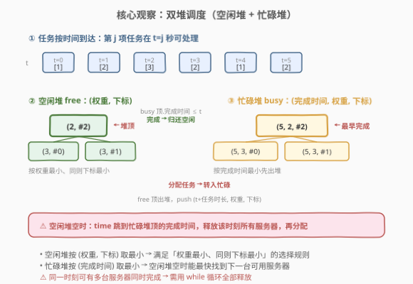
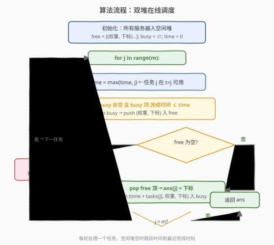

# LeetCode 使用服务器处理任务 题解

## 1. 题目概述

- **标题 / 题号**：使用服务器处理任务（#1882，medium）
- **链接**：https://leetcode.cn/problems/process-tasks-using-servers/
- **难度**：中等
- **标签**：堆、优先队列、模拟、贪心、双堆

**题意**：给定两个下标从 0 开始的整数数组 `servers` 和 `tasks`，长度分别为 $n$ 和 $m$。`servers[i]` 是第 $i$ 台服务器的**权重**，`tasks[j]` 是处理第 $j$ 项任务**所需的时间**（秒）。运行一个仿真系统，处理完所有任务后关闭。规则如下：

- 每台服务器只能同时处理一项任务。
- 第 $j$ 项任务在第 $j$ 秒可以开始处理。
- 处理第 $j$ 项任务时，分配一台**权重最小**的空闲服务器；若权重相同，选择**下标最小**的服务器。
- 若服务器在第 $t$ 秒被分配任务 $j$，则在 $t + \text{tasks}[j]$ 秒恢复空闲。
- 若无空闲服务器，必须等待，直到出现空闲服务器，并**尽可能早**地处理剩余任务。
- 同一时刻若有多台空闲服务器，可同时将多项任务分别分配给它们。

返回长度为 $m$ 的数组 `ans`，`ans[j]` 为第 $j$ 项任务分配的服务器下标。

**示例 1**：

```text
输入：servers = [3,3,2], tasks = [1,2,3,2,1,2]
输出：[2,2,0,2,1,2]
```

**示例 2**：

```text
输入：servers = [5,1,4,3,2], tasks = [2,1,2,4,5,2,1]
输出：[1,4,1,4,1,3,2]
```

**约束**：

- `servers.length == n`，`tasks.length == m`
- $1 \le n, m \le 2 \times 10^5$
- $1 \le \text{servers}[i], \text{tasks}[j] \le 2 \times 10^5$

> 💡 **关键直觉**：本题与 [1834. 单线程 CPU](../1801-1900/1834_单线程CPU.md) 形态相似——都是「时间驱动解锁 + 堆取最优」。区别在于：1834 只有一个 CPU（单消费者），而本题有**多台服务器**（多消费者）。因此需要一个堆管理「谁空闲」（按权重取最小），另一个堆管理「谁先完成」（按完成时间取最小），服务器在两堆之间流转。这是典型的**双堆在线调度**模型。

## 2. 解题思路

### 2.1 暴力思路：每轮线性扫描

每次处理任务 $j$ 时，扫描所有服务器找出空闲的（完成时间 $\le$ 当前时间），在其中选权重最小、同则下标最小者。单次 $O(n)$，共 $m$ 轮，总 $O(nm)$。$n, m$ 可达 $2 \times 10^5$，必超时。

> ⚠️ 瓶颈有两处：①「在空闲服务器中找权重最小」需用堆优化；②「何时有空闲服务器」需用完成时间堆驱动时间推进——不能逐秒递增，否则 $2 \times 10^5$ 个任务、时长可达 $2 \times 10^5$，总时间 $4 \times 10^{10}$ 必 TLE。

### 2.2 核心观察：双堆——空闲堆 + 忙碌堆



将问题拆成三件事：

1. **空闲堆 `free`**：小顶堆 `(权重, 下标)`，存放当前可分配的服务器。堆顶即「权重最小、同则下标最小」——恰好是题目的选择规则。初始所有服务器入此堆。
2. **忙碌堆 `busy`**：小顶堆 `(完成时间, 权重, 下标)`，存放正在工作的服务器。堆顶即「最早完成」——空闲堆空时，直接跳到该完成时间释放服务器。
3. **时间推进**：任务 $j$ 在 $t = j$ 秒可用。处理前先把 `busy` 中完成时间 $\le$ 当前时间的服务器全部释放回 `free`；若 `free` 为空，`time` 跳到 `busy` 堆顶的完成时间再释放。

三步循环：

```
for j in range(m):
    time = max(time, j)                      # 任务 j 在 t=j 可用
    while busy 顶.完成时间 ≤ time:            # 释放已完成的服务器
        pop busy → push free
    if free 空:                              # 无空闲 → 跳到最近完成时刻
        time = busy 顶.完成时间
        while busy 顶.完成时间 ≤ time: 释放
    pop free 顶 (权重, 下标)                   # 选权重最小服务器
    ans[j] = 下标
    push (time + tasks[j], 权重, 下标) 入 busy  # 该服务器转为忙碌
```

> ⚠️ **常见错误**：① 只用一个堆——无法同时按「权重」和「完成时间」两种关键字取最值；② 释放服务器时用 `if` 而非 `while`——同一时刻可能有多台服务器同时完成（如示例 1 的 t=5），必须全部释放；③ 空闲堆空时不跳跃时间、逐秒递增——总时长可达 $4 \times 10^{10}$，必 TLE。

### 2.3 算法流程图



### 2.4 示例演算

![示例演算：servers = [3,3,2], tasks = [1,2,3,2,1,2]](../images/1882_example_walkthrough.svg)

以示例 1 `servers = [3,3,2]`，`tasks = [1,2,3,2,1,2]` 为例，初始 `free = [(2,#2), (3,#0), (3,#1)]`，`busy = ∅`：

| $j$ | time | 事件 | free | busy | ans |
|-----|------|------|------|------|-----|
| 0 | 0 | pop (2,#2) → 分配任务 0 | {(3,#0),(3,#1)} | {(1,2,#2)} | [2] |
| 1 | 1 | 释放 #2（完成=1≤1）；pop (2,#2) → 分配任务 1 | {(3,#0),(3,#1)} | {(3,2,#2)} | [2,2] |
| 2 | 2 | busy 顶完成=3>2 → 不释放；pop (3,#0) → 分配任务 2 | {(3,#1)} | {(3,2,#2),(5,3,#0)} | [2,2,0] |
| 3 | 3 | 释放 #2（完成=3≤3）；pop (2,#2) → 分配任务 3 | {(3,#1)} | {(5,3,#0),(5,2,#2)} | [2,2,0,2] |
| 4 | 4 | busy 顶完成=5>4 → 不释放；pop (3,#1) → 分配任务 4 | ∅ | {(5,3,#0),(5,2,#2),(5,3,#1)} | [2,2,0,2,1] |
| 5 | 5 | free 空 → time 跳到 5；释放 #0、#2、#1；pop (2,#2) → 分配任务 5 | {(3,#0),(3,#1)} | {(7,2,#2)} | [2,2,0,2,1,2] |

> 💡 **j=5 是本题精髓**：空闲堆空时，`time` 跳跃到忙碌堆顶的完成时间 5，而 t=5 恰好有三台服务器同时完成——`while` 循环将它们全部释放回 free，再按权重选出 #2。这说明释放必须是 `while` 而非 `if`：同一时刻完成的服务器可能不止一台。

## 3. 参考代码

### Python

```python
import heapq

class Solution:
    def assignTasks(self, servers: list[int], tasks: list[int]) -> list[int]:
        n, m = len(servers), len(tasks)
        # 空闲堆：(权重, 下标)
        free = [(servers[i], i) for i in range(n)]
        heapq.heapify(free)
        # 忙碌堆：(完成时间, 权重, 下标)
        busy = []

        ans = [0] * m
        time = 0
        for j in range(m):
            time = max(time, j)
            # 释放所有已完成的服务器
            while busy and busy[0][0] <= time:
                _, w, i = heapq.heappop(busy)
                heapq.heappush(free, (w, i))
            # 空闲堆空 → 跳到最近完成时刻
            if not free:
                time = busy[0][0]
                while busy and busy[0][0] <= time:
                    _, w, i = heapq.heappop(busy)
                    heapq.heappush(free, (w, i))
            # 选权重最小（同则下标最小）的服务器
            w, i = heapq.heappop(free)
            ans[j] = i
            heapq.heappush(busy, (time + tasks[j], w, i))

        return ans
```

### C++

```cpp
class Solution {
public:
    vector<int> assignTasks(vector<int>& servers, vector<int>& tasks) {
        int n = servers.size(), m = tasks.size();
        // 空闲堆：(权重, 下标)
        priority_queue<pair<int,int>, vector<pair<int,int>>, greater<>> free;
        for (int i = 0; i < n; ++i) free.emplace(servers[i], i);
        // 忙碌堆：(完成时间, 权重, 下标)
        priority_queue<tuple<long long,int,int>,
                       vector<tuple<long long,int,int>>, greater<>> busy;

        vector<int> ans(m);
        long long time = 0;
        for (int j = 0; j < m; ++j) {
            time = max(time, (long long)j);
            // 释放所有已完成的服务器
            while (!busy.empty() && get<0>(busy.top()) <= time) {
                auto [t, w, i] = busy.top(); busy.pop();
                free.emplace(w, i);
            }
            // 空闲堆空 → 跳到最近完成时刻
            if (free.empty()) {
                time = get<0>(busy.top());
                while (!busy.empty() && get<0>(busy.top()) <= time) {
                    auto [t, w, i] = busy.top(); busy.pop();
                    free.emplace(w, i);
                }
            }
            // 选权重最小（同则下标最小）的服务器
            auto [w, i] = free.top(); free.pop();
            ans[j] = i;
            busy.emplace(time + tasks[j], w, i);
        }
        return ans;
    }
};
```

> 💡 **实现细节**：① `free` 堆存 `(权重, 下标)`，`greater<pair<int,int>>` 对 pair 按字典序比较——先比权重、同则比下标，天然实现题目的双关键字选择。② `busy` 堆存 `(完成时间, 权重, 下标)`，完成时间作第一关键字，保证堆顶是最早完成的服务器；权重和下标仅在完成时间相同时影响释放顺序（不影响正确性，因为同一时刻释放会全部进 free 再由 free 堆重排）。③ C++ 中 `time` 用 `long long`：$m = 2 \times 10^5$ 个任务串行等待、时长各 $2 \times 10^5$，极端情况 `time` 可达 $4 \times 10^{10}$，`int` 会溢出。④ 释放逻辑出现两次（`time = max(time, j)` 后一次、`free` 空跳跃后一次）——可提取为辅助函数，但内联写更直观。

## 4. 复杂度分析

| 维度 | 复杂度 | 说明 |
|------|--------|------|
| **时间** | $O((n + m) \log n)$ | 初始建堆 $O(n)$；每个任务恰好触发一次 `free` 出堆 + 一次 `busy` 入堆，每台服务器在 `free`/`busy` 间流转的总次数不超过 $2m$，每次堆操作 $O(\log n)$ |
| **空间** | $O(n)$ | 两个堆合计最多存 $n$ 个服务器（`free` + `busy` 元素总数恒为 $n$） |

> 💡 **堆元素守恒**：任意时刻 `free.size() + busy.size() == n` 恒成立——每台服务器要么空闲、要么忙碌，不会凭空消失或重复出现。因此堆操作总数与 $n, m$ 同阶，而非 $nm$。

## 5. 扩展：与 1834 单线程 CPU 的对比

本题与 [1834. 单线程 CPU](../1801-1900/1834_单线程CPU.md) 是**同范式**的调度题，核心差异在于消费者数量：

| 维度 | 1834 单线程 CPU | 1882 使用服务器处理任务 |
|------|-----------------|------------------------|
| 消费者 | 1 个 CPU | $n$ 台服务器 |
| 选择依据 | 执行时间最短 | **服务器权重最小** |
| 堆数量 | 1 个（就绪任务堆） | 2 个（空闲服务器堆 + 忙碌服务器堆） |
| 时间跳跃 | 跳到下一任务到达 | 跳到最近服务器完成 |
| 释放逻辑 | 无（任务用完即弃） | 服务器完成后回流 free |

> 💡 **从单堆到双堆的演进逻辑**：1834 中任务是一次性的（执行完就消失），只需一个堆管理「待执行任务」；1882 中服务器是**可复用资源**（完成任务后回到池中），因此需要两个堆——一个管「谁可用」，一个管「谁先归还」。这是资源池调度的通用模式：凡涉及可复用资源的在线分配，双堆（空闲池 + 忙碌池）几乎是标准解法。

## 6. 面试要点

1. **为什么需要两个堆？一个堆不行吗？**

   > 选择服务器要按「权重最小」，而判断何时有空闲服务器要按「完成时间最小」——两种不同的排序关键字无法用一个堆同时满足。`free` 堆按权重取最小服务于「选择」，`busy` 堆按完成时间取最小服务于「时间推进」，各司其职。

2. **空闲堆空时为什么要跳跃时间？**

   > 若逐秒递增 `time`，任务时长可达 $2 \times 10^5$、共 $2 \times 10^5$ 个任务，总时间 $4 \times 10^{10}$ 必 TLE。空闲堆空说明所有服务器都在忙，下一台最早在 `busy` 堆顶的完成时间空闲——直接跳到该时刻，省去中间空转。

3. **释放服务器为什么用 `while` 而非 `if`？**

   > 同一时刻可能有多台服务器同时完成（如示例 1 的 t=5 有三台）。`if` 只释放一台，后续 pop free 时可能仍为空（若刚释放的唯一一台已被本任务取走，下轮又空了），导致逻辑错误或重复跳跃。`while` 确保该时刻所有已完成服务器全部释放。

4. **`busy` 堆为什么也要存权重和下标？只存完成时间不行吗？**

   > 严格来说，仅用于「找最早完成」时只存 `(完成时间, 下标)` 即可。但存 `(完成时间, 权重, 下标)` 的好处是：释放时直接拿到 `(权重, 下标)` push 进 `free`，无需再从 `servers` 数组查权重，代码更简洁。完成时间相同时，堆按权重、下标排序不影响正确性（都会被释放）。

5. **`time` 为什么要用 `long long`（C++）？**

   > 极端情况：$m = 2 \times 10^5$ 个任务、每台服务器只有 1 台（$n = 1$）、每个任务时长 $2 \times 10^5$，`time` 可达 $4 \times 10^{10}$，远超 `int` 的 $2.1 \times 10^9$ 上限。Python 天然大整数无此问题。

> 💡 **一句话总结**：空闲堆 `(权重, 下标)` 取最小 + 忙碌堆 `(完成时间, 权重, 下标)` 驱动时间 + 空闲时跳跃到最近完成时刻。$O((n+m)\log n)$ 模拟多服务器在线调度。

## 同类练习题

| # | 题目 | 与本题的关联 |
|---|------|-------------|
| 1834 | [单线程 CPU](https://leetcode.cn/problems/single-threaded-cpu/)（[题解](../1801-1900/1834_单线程CPU.md)） | 单堆（就绪任务堆）+ 游标解锁，与本题「时间驱动 + 堆取最优」同范式，但消费者只有一个，是本题的退化基础版 |
| 1801 | [积压订单中的订单总数](https://leetcode.cn/problems/number-of-orders-in-the-backlog/)（[题解](../1801-1900/1801_积压订单中的订单总数.md)） | 双堆在线撮合买卖订单，同属「双堆维护动态最值 + 在线处理」家族 |
| 1705 | [吃苹果的最大数量](https://leetcode.cn/problems/maximum-number-of-eaten-apples/)（[题解](../1701-1800/1705_吃苹果的最大数目.md)） | 按天数推进 + 小顶堆按腐烂日期取最优苹果，与本题「时间驱动 + 堆调度 + 资源过期释放」结构一致 |
| 502 | [IPO](https://leetcode.cn/problems/ipo/)（[题解](../0501-0600/502_IPO.md)） | 排序按资本解锁 + 大顶堆取最大利润，与本题「游标解锁 + 堆取最值」思想一脉相承（方向相反：取最大而非最小） |
