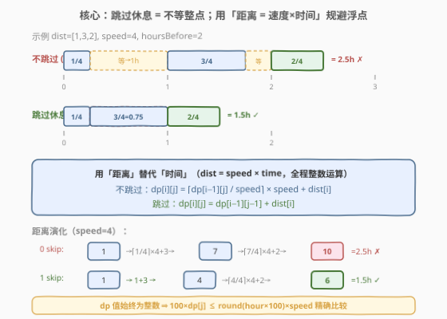
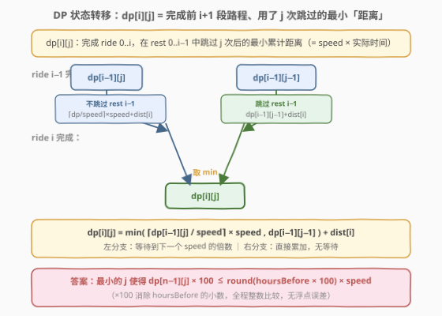
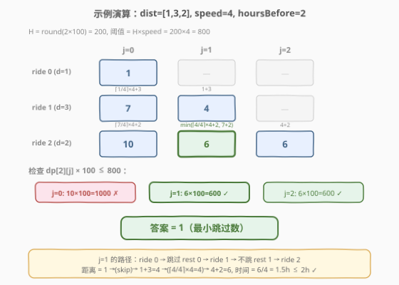

# 准时抵达会议现场的最少跳过数

- **题目名称**：准时抵达会议现场的最少跳过数
- **链接**：[1883. 准时抵达会议现场的最少跳过数](https://leetcode.cn/problems/minimum-skips-to-arrive-at-meeting-on-time/)
- **难度**：困难
- **标签**：动态规划、数学、数组

## 1. 题目概述

给定整数数组 `dist` 表示 $n$ 段路程的距离，整数 `speed` 表示行驶速度（千米/小时），浮点数 `hoursBefore` 表示会议开始前可用的总时间。必须**按给定顺序**依次行驶完所有 $n$ 段路程。

每段路程 $i$ 的行驶时间为 $\text{dist}[i] / \text{speed}$ 小时（可能是小数）。关键规则：

- 行驶完第 $i$ 段后（$i < n-1$），**默认需要等待到下一个整点**才能开始下一段。
- 可以选择**跳过**某个休息（skip），即不等待、立即开始下一段。
- **最后一段**（第 $n-1$ 段）无需等待，到达即结束。
- 每次跳过消耗 1 次跳过机会，求**最少跳过次数**使得总时间 $\le \text{hoursBefore}$；若不可能则返回 $-1$。

> 💡 **与 1870 的关键区别**：1870「准时到达的列车最小时速」中速度未知、需二分；本题速度已知，改为求最少跳过数 → 动态规划。

**示例 1**：

```text
输入：dist = [1,3,2], speed = 4, hoursBefore = 2
输出：1
解释：跳过第 1 个休息（ride 0 之后），ride 0→1 连续行驶。
      0.25 + 0.75 = 1.0h 到达 ride 1 末，恰为整点无需再等。
      ride 2 从 1.0h 出发，0.5h 到达，总时间 1.5h ≤ 2h。
```

**示例 2**：

```text
输入：dist = [7,3,5,5], speed = 2, hoursBefore = 10
输出：2
解释：最少跳过 2 次休息才能在 10h 内到达。
```

**示例 3**：

```text
输入：dist = [7,3,5,5], speed = 1, hoursBefore = 10
输出：-1
解释：总距离 20，speed=1，即使全部跳过也需 20h > 10h，不可能。
```

**约束条件**：

- $n = \text{dist.length}$
- $1 \le n \le 1000$
- $1 \le \text{dist}[i] \le 10^5$
- $1 \le \text{speed} \le 10^6$
- $1 \le \text{hoursBefore} \le 10^7$
- `hoursBefore` 小数点后最多两位

---

## 2. 解题思路

### 2.1 暴力思路

每段路程后有「跳过 / 不跳过」两种选择，共 $n-1$ 个休息点 → $2^{n-1}$ 种组合。$n$ 可达 1000，$2^{999}$ 完全不可行。需要更聪明的做法。

### 2.2 核心观察：距离 DP + 整数运算



本题的三个关键观察：

> 💡 **观察 1（状态定义）**：定义 $dp[i][j]$ = 完成第 $0 \sim i$ 段路程、在休息 $0 \sim i-1$ 中跳过了 $j$ 次后的**最小累计距离**（= speed × 实际时间）。最终只需检查 $dp[n-1][j] / \text{speed} \le \text{hoursBefore}$ 的最小 $j$。

> 💡 **观察 2（转移两分支）**：对休息 $i-1$（ride $i-1$ 与 ride $i$ 之间）：
> - **不跳过**：需等整点，累计距离变为 $\lceil dp[i-1][j] / \text{speed} \rceil \times \text{speed} + \text{dist}[i]$
> - **跳过**：直接累加，累计距离变为 $dp[i-1][j-1] + \text{dist}[i]$
>
> $$dp[i][j] = \min\Big(\lceil dp[i{-}1][j] / \text{speed} \rceil \times \text{speed},\;\; dp[i{-}1][j{-}1]\Big) + \text{dist}[i]$$

> 💡 **观察 3（整数消浮点）**：$dp$ 值始终是整数（初始 $\text{dist}[0]$ 是整数，$\lceil \cdot \rceil \times \text{speed}$ 也是整数，加法保持整数）。$\text{hoursBefore}$ 最多两位小数，令 $H = \text{round}(\text{hoursBefore} \times 100)$，则可行性条件 $dp / \text{speed} \le \text{hoursBefore}$ 等价于：
> $$100 \times dp[n{-}1][j] \le H \times \text{speed}$$
> **全程整数运算，零浮点误差。**

> ⚠️ **最大陷阱**：直接用 `double` 累加时间会因浮点精度在边界用例出错（如 `hoursBefore = 2.01`，实际 `2.0099999...`）。用「距离」替代「时间」是本题的核心技巧。

### 2.3 算法流程图



**空间优化**：$dp[i][j]$ 只依赖 $dp[i-1][j]$ 和 $dp[i-1][j-1]$，可用一维滚动数组。**内层 $j$ 从高到低遍历**（类似 0-1 背包），保证读取的 $dp[j-1]$ 仍是上一轮的旧值。

### 2.4 示例演算

以示例 1 `dist = [1,3,2]`、`speed = 4`、`hoursBefore = 2` 为例：



- $H = \text{round}(2 \times 100) = 200$，阈值 $= H \times \text{speed} = 800$。
- **ride 0**：$dp[0][0] = 1$（初始距离）。
- **ride 1**（$d=3$）：
  - $dp[1][0] = \lceil 1/4 \rceil \times 4 + 3 = 1 \times 4 + 3 = 7$（不跳 rest 0）
  - $dp[1][1] = 1 + 3 = 4$（跳过 rest 0）
- **ride 2**（$d=2$，末段）：
  - $dp[2][0] = \lceil 7/4 \rceil \times 4 + 2 = 2 \times 4 + 2 = 10$
  - $dp[2][1] = \min(\lceil 4/4 \rceil \times 4 + 2,\; 7 + 2) = \min(6, 9) = 6$
  - $dp[2][2] = 4 + 2 = 6$
- **检查**：$j=0$：$10 \times 100 = 1000 > 800$ ✗；$j=1$：$6 \times 100 = 600 \le 800$ ✓ → 答案 $1$。

> 💡 **$j=1$ 的实际路径**：ride 0（0.25h）→ **跳过** rest 0 → ride 1（0.75h，累计 1.0h）→ 不跳 rest 1（恰为整点，无等待）→ ride 2（0.5h）→ 总 1.5h ≤ 2h。

---

## 3. 参考代码

### C++

```cpp
class Solution {
public:
    int minSkips(vector<int>& dist, int speed, double hoursBefore) {
        int n = dist.size();
        long long H = llround(hoursBefore * 100);

        const long long INF = 1e18;
        vector<long long> dp(n, INF);
        dp[0] = dist[0];

        for (int i = 1; i < n; i++) {
            for (int j = i; j >= 0; j--) {
                long long best = INF;
                if (j < i)  // 不跳过 rest i-1
                    best = min(best, ((dp[j] + speed - 1) / speed) * speed + dist[i]);
                if (j >= 1)  // 跳过 rest i-1
                    best = min(best, dp[j - 1] + dist[i]);
                dp[j] = best;
            }
        }

        for (int j = 0; j < n; j++)
            if (dp[j] * 100 <= H * speed)
                return j;
        return -1;
    }
};
```

### Python

```python
class Solution:
    def minSkips(self, dist: List[int], speed: int, hoursBefore: float) -> int:
        n = len(dist)
        H = round(hoursBefore * 100)
        INF = 10 ** 18
        dp = [INF] * n
        dp[0] = dist[0]

        for i in range(1, n):
            for j in range(i, -1, -1):
                best = INF
                if j < i:  # 不跳过 rest i-1
                    best = min(best, ((dp[j] + speed - 1) // speed) * speed + dist[i])
                if j >= 1:  # 跳过 rest i-1
                    best = min(best, dp[j - 1] + dist[i])
                dp[j] = best

        for j in range(n):
            if dp[j] * 100 <= H * speed:
                return j
        return -1
```

> ⚠️ **三个易错点**：
> 1. **浮点陷阱**：千万不要用 `double` 累加时间再和 `hoursBefore` 比较。用「距离 = speed × time」全程整数运算，最终用 $100 \times dp \le H \times \text{speed}$ 精确比较。
> 2. **滚动数组方向**：内层 $j$ 必须**从高到低**遍历（`for j in range(i, -1, -1)`），否则 $dp[j-1]$ 会被提前覆盖成新值。
> 3. **$j$ 的边界**：$j < i$ 时才有「不跳过」分支（rest $0 \sim i{-}2$ 最多 $i{-}1$ 次跳过）；$j \ge 1$ 时才有「跳过」分支。$j = i$ 只能全部跳过，$j = 0$ 只能全部不跳。

---

## 4. 复杂度分析

| 维度 | 复杂度 | 说明 |
|------|--------|------|
| 时间复杂度 | $O(n^2)$ | 双层循环：外层 $n$ 段路程，内层最多 $n$ 种跳过数 |
| 空间复杂度 | $O(n)$ | 一维滚动数组，长度为 $n$ |

> 💡 $n \le 1000$，$n^2 = 10^6$，完全可接受。

---

## 5. 扩展：与 1870 准时到达的列车最小时速对比

本题与 1870 同属「准时到达」系列，但问题结构完全不同：

| 维度 | 1870 准时到达的列车 | 1883 准时抵达会议 |
|------|---------------------|-------------------|
| **未知量** | 最小时速 $v$ | 最少跳过数 $j$ |
| **已知量** | dist, hour | dist, speed, hoursBefore |
| **解法** | 二分答案 + $O(n)$ 验证 | $O(n^2)$ 动态规划 |
| **取整** | 前 $n{-}1$ 趟 $\lceil \cdot \rceil$，末趟精确 | 休息点可选跳过（不取整） |
| **浮点处理** | 累加 `double` + 容差 | 距离整数运算，零误差 |
| **复杂度** | $O(n \log M)$ | $O(n^2)$ |

> 💡 **识别信号**：当「速度」是自由变量且耗时单调 → 二分答案（1870）；当「速度」固定、求另一个离散最值 → DP（1883）。两题的共通技巧是**用距离替代时间**来规避浮点。

---

## 6. 面试要点

**Q1：为什么要用「距离」而不是「时间」做 DP？**

> 时间是小数（$\text{dist}[i] / \text{speed}$），累加后与 `hoursBefore` 比较时浮点精度会在边界用例出错。距离 $= \text{speed} \times \text{时间}$ 始终是整数（$\text{dist}[i]$ 是整数，$\lceil \cdot \rceil \times \text{speed}$ 也是整数），全程整数运算零误差。最终条件 $dp / \text{speed} \le \text{hoursBefore}$ 转化为 $100 \times dp \le H \times \text{speed}$（$H = \text{round}(\text{hoursBefore} \times 100)$）。

**Q2：滚动数组为什么 $j$ 从高到低遍历？**

> $dp[i][j]$ 依赖 $dp[i-1][j]$（同列）和 $dp[i-1][j-1]$（左列）。若 $j$ 从低到高遍历，更新 $dp[j-1]$ 后再算 $dp[j]$ 时读到的 $dp[j-1]$ 已是新值（第 $i$ 轮而非第 $i{-}1$ 轮），逻辑错误。从高到低遍历保证读 $dp[j-1]$ 时它尚未被覆盖，仍是上一轮旧值。这与 0-1 背包的滚动数组方向一致。

**Q3：$j = i$ 时为什么只有「跳过」分支？**

> $j = i$ 意味着 rest $0 \sim i{-}1$ 全部跳过（共 $i$ 个休息，$j = i$ 次跳过）。此时「不跳过 rest $i{-}1$」要求 rest $0 \sim i{-}2$ 中跳过 $j = i$ 次，但只有 $i{-}1$ 个休息，不可能。故 $j < i$ 才有不跳过分支。

**Q4：如何判断无解（返回 $-1$）？**

> 填完 DP 表后遍历 $j = 0 \sim n{-}1$，检查 $100 \times dp[n{-}1][j] \le H \times \text{speed}$。若所有 $j$ 都不满足，返回 $-1$。最极端情况：全部跳过（$j = n{-}1$），距离 $= \sum \text{dist}[i]$，时间 $= \sum \text{dist}[i] / \text{speed}$，若仍超时则无解。

**Q5：本题与 1870 的核心区别是什么？**

> 1870 速度未知，耗时关于速度单调递减 → 二分答案；1883 速度已知、求最少跳过数（离散组合优化）→ DP。两题共享「用距离替代时间」的浮点规避技巧，但解法框架完全不同（二分 vs DP）。

---

## 7. 同类练习题

- [1870. 准时到达的列车最小时速](https://leetcode.cn/problems/minimum-speed-to-arrive-on-time/)（[题解](../1801-1900/1870_准时到达的列车最小时速.md)）：同系列「准时到达」，速度未知 → 二分答案，对比 1883 速度已知 → DP
- [198. 打家劫舍](https://leetcode.cn/problems/house-robber/)（[题解](../0001-0100/198_打家劫舍.md)）：一维滚动 DP + 从高到低遍历的同类空间优化思想
- [416. 分割等和子集](https://leetcode.cn/problems/partition-equal-subset-sum/)（[题解](../0401-0500/416_分割等和子集.md)）：0-1 背包滚动数组，同样内层倒序遍历保证不重复使用
- [875. 爱吃香蕉的珂珂](https://leetcode.cn/problems/koko-eating-bananas/)（[题解](../0801-0900/875_爱吃香蕉的珂珂.md)）：二分答案模板题，与 1870 同类，对比 1883 的 DP 解法
