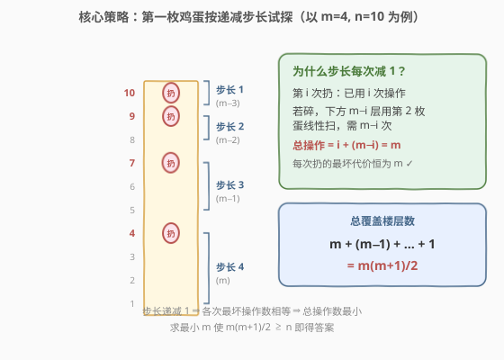
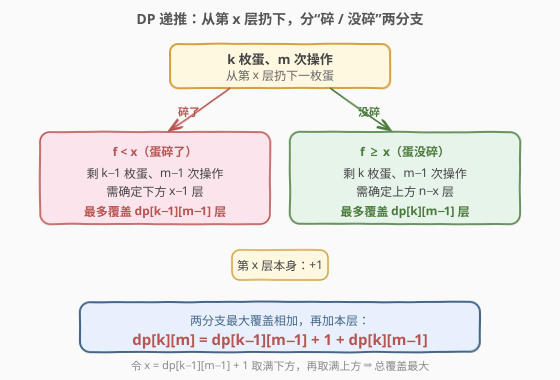
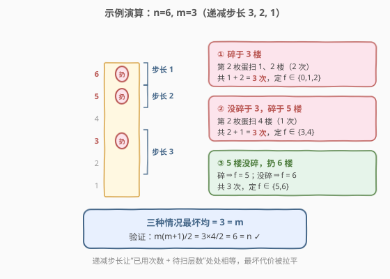

# 鸡蛋掉落-两枚鸡蛋

- **题目名称**：鸡蛋掉落-两枚鸡蛋
- **链接**：[1884. 鸡蛋掉落-两枚鸡蛋](https://leetcode.cn/problems/egg-drop-with-2-eggs-and-n-floors/)
- **难度**：中等
- **标签**：动态规划、数学、二分查找

## 1. 题目概述

给你 **2 枚相同的鸡蛋** 和一栋从第 $1$ 层到第 $n$ 层共 $n$ 层楼的建筑。已知存在临界楼层 $f$（$0 \le f \le n$）：

- 从**高于 $f$** 的楼层落下鸡蛋，鸡蛋**会碎**；
- 从 $f$ 层或更低的楼层落下，鸡蛋**不会碎**。

每次操作可取一枚**没碎的**鸡蛋从任一楼层 $x$（$1 \le x \le n$）扔下：碎了就不能再用；没碎可重复使用。请计算并返回**确定 $f$ 确切值所需的最小操作次数**（最坏情况下）。

**示例 1**：

```text
输入：n = 2
输出：2
解释：第 1 枚从 1 楼扔，第 2 枚从 2 楼扔。
      第 1 枚碎 ⇒ f = 0；
      第 1 枚没碎、第 2 枚碎 ⇒ f = 1；
      两枚都没碎 ⇒ f = 2。
```

**示例 2**：

```text
输入：n = 100
输出：14
```

**约束条件**：

- $1 \le n \le 1000$

> 💡 **本质**：经典「双蛋掉落」问题。鸡蛋只有 2 枚意味着第一枚蛋承担**粗定位**（大跨度试探），一旦碎了就只能靠第二枚蛋**线性精确定位**（一层层试）。目标是让“最坏情况”的操作次数最小。

---

## 2. 解题思路

### 2.1 暴力思路

最朴素：只用 1 枚蛋从 $1$ 层逐层往上试，最坏 $n$ 次。但还有第 2 枚蛋可以“赌”一把大跨度——枚举第一枚蛋的每次扔的楼层组合，搜索所有策略取最坏值的最小。$n = 1000$ 时搜索空间爆炸。

正确方向是**反过来思考**：不问“$n$ 层楼最少要几次”，而问“**给定 $k$ 枚蛋、$m$ 次操作，最多能确定多少层楼的 $f$**”。一旦这个最大覆盖层数 $\ge n$，对应的 $m$ 就是答案。

### 2.2 核心观察：递减步长策略



先从策略直觉出发。设最终最坏操作次数为 $m$。第一枚蛋从哪层扔？

- 若从第 $m$ 层扔，**碎了**：还剩 $1$ 枚蛋，必须从第 $1$ 层起**线性**试到第 $m-1$ 层，最坏再扔 $m-1$ 次，总计 $1 + (m-1) = m$ 次。
- **没碎**：还剩 $2$ 枚蛋、$m-1$ 次操作预算，可继续在上方“如法炮制”。

关键在于：**每多扔一次第一枚蛋，操作预算就少 1，因此下一次的跨度也要减 1**，才能保证“已用次数 + 下方待线性扫描层数”始终等于 $m$。于是第一枚蛋的试探楼层依次为

$$m,\quad m+(m-1),\quad m+(m-1)+(m-2),\quad \ldots$$

跨度序列 $m, m-1, m-2, \ldots, 1$，**总覆盖层数**为

$$m + (m-1) + \cdots + 1 = \frac{m(m+1)}{2}$$

> ⚠️ **为什么要递减而不是等距？** 若第一枚蛋等距（比如每 $m$ 层扔一次），碎了之后下方 $m-1$ 层线性扫需 $m-1$ 次，第一次总代价 $m$；但第二次碎了时已用 $2$ 次，下方仍有 $m-1$ 层要扫，总代价 $2 + (m-1) = m+1 > m$——越往后越糟。递减步长正是为了**把后段的下方待扫层数减下来**，抵消已用次数的增加，使各次最坏代价拉平为 $m$。

于是答案就是**最小的 $m$** 满足

$$\frac{m(m+1)}{2} \ge n$$

### 2.3 DP 视角：通用递推

上面的策略直觉可由一个干净的 DP 递推严格推出。定义 $\text{dp}[k][m]$ = **$k$ 枚蛋、$m$ 次操作最多能确定的楼层数**。



从第 $x$ 层扔下一枚蛋，分两种情况：

- **碎了**：$f < x$，剩 $k-1$ 枚蛋、$m-1$ 次操作，下方 $x-1$ 层需被确定 ⇒ 最多 $x - 1 \le \text{dp}[k-1][m-1]$。
- **没碎**：$f \ge x$，剩 $k$ 枚蛋、$m-1$ 次操作，上方 $n - x$ 层需被确定 ⇒ 最多 $n - x \le \text{dp}[k][m-1]$。

为使总层数最大，令下方取满 $x - 1 = \text{dp}[k-1][m-1]$、上方取满 $n - x = \text{dp}[k][m-1]$，再加上本层 $x$ 本身，得递推：

$$\text{dp}[k][m] = \text{dp}[k-1][m-1] + \text{dp}[k][m-1] + 1$$

**边界**：$\text{dp}[k][0] = 0$（没操作次数啥也定不了）；$\text{dp}[1][m] = m$（$1$ 枚蛋只能从低到高线性试，$m$ 次定 $m$ 层）。

**代入 $k=2$**：

$$\text{dp}[2][m] = \text{dp}[1][m-1] + \text{dp}[2][m-1] + 1 = (m-1) + \text{dp}[2][m-1] + 1 = \text{dp}[2][m-1] + m$$

累加得 $\text{dp}[2][m] = \dfrac{m(m+1)}{2}$，与策略直觉完全吻合。

> 💡 **逆向思维的好处**：原问题“$n$ 层最少几次”是求最小值，状态含“最坏”语义、不易直接递推；翻转成“$m$ 次最多几层”后变成**求最大值**，子结构立刻清晰——这是鸡蛋掉落问题的招牌技巧，也是面试加分点。

### 2.4 示例演算

以 $n = 6, m = 3$ 为例，直观验证递减步长策略如何把最坏代价拉平为 $3$：



第一枚蛋依次扔 $3, 5, 6$ 层（跨度 $3, 2, 1$，和 $= 6 = n$）：

| 情况 | 第一枚蛋 | 第二枚蛋补扫 | 总次数 | 确定 $f$ |
|------|----------|--------------|--------|----------|
| ① | 碎于 3 楼 | 扫 1、2 楼（2 次） | $1+2=3$ | $f \in \{0,1,2\}$ |
| ② | 3 楼没碎，碎于 5 楼 | 扫 4 楼（1 次） | $2+1=3$ | $f \in \{3,4\}$ |
| ③ | 5 楼没碎，扔 6 楼 | 碎⇒$f=5$，没碎⇒$f=6$ | $3$ | $f \in \{5,6\}$ |

三种情况最坏均为 $3 = m$。验证公式：$\frac{3 \times 4}{2} = 6 = n$ ✓。

**用公式核验示例**：

- $n = 2$：$\frac{2 \times 3}{2} = 3 \ge 2$，$\frac{1 \times 2}{2} = 1 < 2$ ⇒ $m = 2$ ✓
- $n = 100$：$\frac{14 \times 15}{2} = 105 \ge 100$，$\frac{13 \times 14}{2} = 91 < 100$ ⇒ $m = 14$ ✓

---

## 3. 参考代码

### 方法一：数学公式（$O(1)$）

由 $\frac{m(m+1)}{2} \ge n$ 解 $m^2 + m - 2n \ge 0$，取正根并向上取整：

$$m = \left\lceil \frac{-1 + \sqrt{1 + 8n}}{2} \right\rceil$$

为规避浮点误差，用整数运算微调一步即可（$n \le 1000$ 时 $m \le 45$，完全安全）。

### C++

```cpp
class Solution {
  public:
    int twoEggDrop(int n) {
        int m = ceil((-1.0 + sqrt(1.0 + 8.0 * n)) / 2.0);
        while ((long long)m * (m + 1) / 2 < n) m++;   // 浮点误差兜底
        while ((long long)(m - 1) * m / 2 >= n) m--;
        return m;
    }
};
```

### Python

```python
import math


class Solution:
    def twoEggDrop(self, n: int) -> int:
        m = math.ceil((-1 + math.sqrt(1 + 8 * n)) / 2)
        while m * (m + 1) // 2 < n:    # 浮点误差兜底
            m += 1
        while (m - 1) * m // 2 >= n:
            m -= 1
        return m
```

### 方法二：DP 递推（泛化到 $k$ 枚鸡蛋）

直接套用 $\text{dp}[k][m] = \text{dp}[k-1][m-1] + \text{dp}[k][m-1] + 1$，用**一维滚动数组**倒序更新 $k$，递增 $m$ 直到 $\text{dp}[K] \ge n$。该写法把 $K=2$ 当参数，**直接可迁移到 [887. 鸡蛋掉落](https://leetcode.cn/problems/super-egg-drop/)**（$K$ 任意）。

### C++

```cpp
class Solution {
  public:
    int twoEggDrop(int n) {
        int K = 2;
        vector<int> dp(K + 1, 0);     // dp[k] = 当前 m 轮下 k 枚蛋最多覆盖层数，初值 m=0
        int m = 0;
        while (dp[K] < n) {
            m++;
            for (int k = K; k >= 1; k--)   // 倒序：保证 dp[k-1] 仍是 m-1 轮旧值
                dp[k] = dp[k - 1] + dp[k] + 1;
        }
        return m;
    }
};
```

### Python

```python
class Solution:
    def twoEggDrop(self, n: int) -> int:
        K = 2
        dp = [0] * (K + 1)           # dp[k] = 当前 m 轮下 k 枚蛋最多覆盖层数
        m = 0
        while dp[K] < n:
            m += 1
            for k in range(K, 0, -1):  # 倒序：保证 dp[k-1] 仍是 m-1 轮旧值
                dp[k] = dp[k - 1] + dp[k] + 1
        return m
```

> 💡 **倒序更新的正确性**：递推 $\text{dp}[k][m]$ 需要 $\text{dp}[k-1][m-1]$ 和 $\text{dp}[k][m-1]$（均为上一轮 $m-1$ 的值）。内层 $k$ 从大到小更新，改写 $\text{dp}[k]$ 时下标更小的 $\text{dp}[k-1]$ 尚未被本轮覆盖，仍是旧值——与二维递推完全等价。

---

## 4. 复杂度分析

| 维度 | 复杂度 | 说明 |
|------|--------|------|
| 方法一 时间 | $O(1)$ | 直接套公式，仅常数次整数微调 |
| 方法一 空间 | $O(1)$ | 无额外存储 |
| 方法二 时间 | $O(m \cdot K)$ | 外层递增 $m$、内层 $K$ 次更新；$K=2$、$m \le 45$ 时约 $90$ 次操作 |
| 方法二 空间 | $O(K)$ | 一维滚动数组，$K=2$ 时 $O(1)$ |

> 💡 $n \le 1000$ 时 $m \le 45$（因 $45 \times 46 / 2 = 1035 \ge 1000$），两种方法都极轻量。方法二的价值在于**结构通用**——把 $K$ 当参数即可处理任意鸡蛋数。

---

## 5. 扩展：泛化到 $k$ 枚鸡蛋（衔接 887）

当鸡蛋数 $k$ 任意时，闭式不再简单（$\text{dp}[k][m]$ 无初等通项），但递推 $\text{dp}[k][m] = \text{dp}[k-1][m-1] + \text{dp}[k][m-1] + 1$ 依然成立。这正是 [887. 鸡蛋掉落](https://leetcode.cn/problems/super-egg-drop/) 的核心：给定 $k$ 枚蛋、$n$ 层楼，求最小 $m$。

887 的进阶要点：

1. **状态翻转**：同样用“$m$ 次操作最多覆盖几层”的逆向 DP，把 $O(kn)$ 的原问题降到 $O(k\sqrt n)$（$m$ 至多 $O(\sqrt n)$）。
2. **二分加速**：原状态 $\text{f}(k, n)$（$k$ 蛋 $n$ 层最少几次）对 $n$ 二分扔第一枚蛋的位置，结合单调性可做到 $O(k n \log n)$。
3. 本题 $k=2$ 的闭式 $\frac{m(m+1)}{2} \ge n$ 是 887 的最简单特例——能现场推到这一步，887 的 DP 也就触类旁通了。

---

## 6. 面试要点

**Q1：为什么把问题翻转为“$m$ 次操作最多覆盖几层”？**

> 原问题求“最小 $m$ 使最坏操作数 $\le m$”，含“最坏”语义、子问题结构模糊；翻转后变成“$m$ 次能覆盖的最大层数”，是标准的**求最大值**最优子结构，碎/没碎两分支干净地归约到 $m-1$ 轮，递推立得。

**Q2：递减步长策略的“递减”是怎么想到的？**

> 每扔一次第一枚蛋，操作预算减 1；若跨度不变，碎了之后下方待扫层数不变，总代价 = 已用次数 + 待扫层数 会随已用次数递增而递增。让跨度同步减 1，恰好抵消已用次数的 +1，使每次最坏代价恒为 $m$。这是“**各分支代价拉平**”的经典博弈思想。

**Q3：$\text{dp}[1][m] = m$ 的依据是什么？**

> 只剩 1 枚蛋时不能“赌”大跨度（碎了就没了），只能从最低楼层逐层往上试。$m$ 次操作最多试 $m$ 层，故能确定 $m$ 层楼的 $f$。

**Q4：方法二的滚动数组为什么内层 $k$ 要倒序？**

> 递推 $\text{dp}[k][m]$ 依赖 $\text{dp}[k-1][m-1]$ 和 $\text{dp}[k][m-1]$。倒序更新保证改写 $\text{dp}[k]$ 时 $\text{dp}[k-1]$（下标更小）尚未被本轮覆盖，仍是 $m-1$ 轮旧值。若正序，$\text{dp}[k-1]$ 已变成 $m$ 轮新值，递推就错了。

**Q5：$n=1000$ 时答案是多少？**

> 求 $m$ 使 $m(m+1)/2 \ge 1000$。$44 \times 45 / 2 = 990 < 1000$，$45 \times 46 / 2 = 1035 \ge 1000$，故 $m = 45$。

---

## 7. 同类练习题

- [887. 鸡蛋掉落](https://leetcode.cn/problems/super-egg-drop/)（[站内题解](../0801-0900/887_鸡蛋掉落.md)）：本题的 $k$ 任意版，同一递推 $\text{dp}[k][m] = \text{dp}[k-1][m-1] + \text{dp}[k][m-1] + 1$，加二分/单调性优化
- [69. x 的平方根](https://leetcode.cn/problems/sqrtx/)（[站内题解](../0001-0100/69_x的平方根.md)）：闭式解中 $\sqrt{1+8n}$ 的整数求解，二分答案的入门题
- [50. Pow(x, n)](https://leetcode.cn/problems/powx-n/)：数学/快速幂家族，与方法一的公式计算同属“闭式 + 数值实现”脉络
- [410. 分割数组的最大值](https://leetcode.cn/problems/split-array-largest-sum/)（[站内题解](../0401-0500/410_分割数组的最大值.md)）：二分答案 + 贪心验证，对照“求最小 $m$ 满足某单调条件”的二分视角
