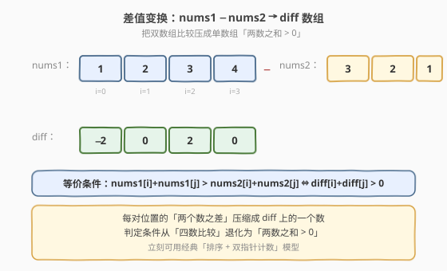
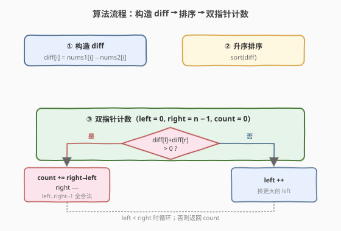

# LeetCode 统计数对 题解

## 1. 题目概述

- **标题 / 题号**：统计数对（#1885，medium）
- **链接**：https://leetcode.cn/problems/count-pairs-in-two-arrays/
- **难度**：中等
- **标签**：数组、排序、双指针、二分查找

**题意**：给定两个长度均为 $n$ 的整数数组 `nums1` 和 `nums2`，统计满足下列条件的**下标对** $(i, j)$ 的个数：

$$i < j \quad \text{且} \quad \text{nums1}[i] + \text{nums1}[j] > \text{nums2}[i] + \text{nums2}[j]$$

即「`nums1` 中两数之和」严格大于「`nums2` 中对应两数之和」的无序下标对数。

**示例 1**：

```text
输入：nums1 = [1,2,3,4], nums2 = [3,2,1,4]
输出：2
解释：逐对核对（下标从 0 起）：
  (0,1): 1+2=3  vs 3+2=5   3 > 5? 否
  (0,2): 1+3=4  vs 3+1=4   4 > 4? 否
  (0,3): 1+4=5  vs 3+4=7   5 > 7? 否
  (1,2): 2+3=5  vs 2+1=3   5 > 3? 是 ✓
  (1,3): 2+4=6  vs 2+4=6   6 > 6? 否
  (2,3): 3+4=7  vs 1+4=5   7 > 5? 是 ✓
  共 2 对。
```

**示例 2**：

```text
输入：nums1 = [10,20,30,40], nums2 = [5,15,35,25]
输出：4
解释：
  (0,1): 10+20=30  vs 5+15=20   30 > 20? 是 ✓
  (0,2): 10+30=40  vs 5+35=40   40 > 40? 否
  (0,3): 10+40=50  vs 5+25=30   50 > 30? 是 ✓
  (1,2): 20+30=50  vs 15+35=50  50 > 50? 否
  (1,3): 20+40=60  vs 15+25=40  60 > 40? 是 ✓
  (2,3): 30+40=70  vs 35+25=60  70 > 60? 是 ✓
  共 4 对。
```

**约束**：

- $n = \text{nums1.length} = \text{nums2.length}$
- $1 \le n \le 10^5$
- $-10^5 \le \text{nums1}[i], \text{nums2}[i] \le 10^5$

> 💡 **本质**：表面是「两数组对应位置配对求和再比较」，实则可经一次**线性变换**降维成「单数组上数对之和是否 $> 0$」——这是面试中典型的「**问题转化**」题型：把看似双数组的比较问题，通过构造差值数组 `diff[i] = nums1[i] − nums2[i]`，规约成经典的双指针/二分计数模型。本题是 [611. 有效三角形的个数](../0601-0700/611_有效三角形的个数.md) 的「一维版」，也是 [1099. 小于 K 的两数之和](https://leetcode.cn/problems/two-sum-less-than-k/) 的「阈值取 0、方向取大于」变体。

## 2. 解题思路

### 2.1 暴力思路：双重循环枚举

最直接的做法：双重循环枚举所有 $(i, j)$（$i < j$），逐对计算 `nums1[i] + nums1[j]` 与 `nums2[i] + nums2[j]` 并比较。

```text
count = 0
for i in 0..n:
    for j in i+1..n:
        if nums1[i] + nums1[j] > nums2[i] + nums2[j]:
            count += 1
```

时间复杂度 $O(n^2)$。$n = 10^5$ 时约 $5 \times 10^9$ 次比较，**超时**。需要把 $O(n^2)$ 降到 $O(n \log n)$。

> ⚠️ 暴力法有两个冗余：① 每对都重算四个加法；② 数组无序，无法利用单调性跳过整段区间。破局思路是**先把双数组问题压成单数组问题**，再**排序 + 双指针**一次性按区间计数。

### 2.2 核心观察：差值变换 + 排序双指针

**第一步：差值变换，把双数组压成单数组**。



将不等式 `nums1[i] + nums1[j] > nums2[i] + nums2[j]` 移项：

$$\big(\text{nums1}[i] - \text{nums2}[i]\big) + \big(\text{nums1}[j] - \text{nums2}[j]\big) > 0$$

令 $\text{diff}[i] = \text{nums1}[i] - \text{nums2}[i]$，则条件等价于

$$\text{diff}[i] + \text{diff}[j] > 0$$

> 💡 **为什么这一步是关键？** 原问题中每对 $(i, j)$ 的判定依赖**四个数**（`nums1[i], nums1[j], nums2[i], nums2[j]`），且 `i` 和 `j` 的角色纠缠——`nums1[i]` 要与 `nums2[i]` 配对、`nums1[j]` 要与 `nums2[j]` 配对，无法直接对 `nums1` 或 `nums2` 单独排序。差值变换把「每对位置的两个数之差」压缩成 `diff` 上的**一个数**，判定条件退化为单数组上「两数之和 $> 0$」，立刻可用经典双指针模型。

**第二步：排序 + 双指针计数**。

对 `diff` 升序排序。排序会打乱下标，但我们只关心**无序对**的个数（条件对称：$\text{diff}[i] + \text{diff}[j] > 0 \Leftrightarrow \text{diff}[j] + \text{diff}[i] > 0$），因此排序后的无序对计数与原问题完全等价。

![排序 + 双指针计数：diff[left] + diff[right] > 0 时按区间计数](../images/1885_two_pointers.svg)

设 `left = 0`、`right = n - 1`、`count = 0`，循环 `left < right`：

- 若 `diff[left] + diff[right] > 0`：由于 `diff` 升序，`left` 到 `right - 1` 的每个 `left'` 都满足 $\text{diff}[\text{left'}] \ge \text{diff}[\text{left}]$，故 $\text{diff}[\text{left'}] + \text{diff}[\text{right}] \ge \text{diff}[\text{left}] + \text{diff}[\text{right}] > 0$。**一次性计数** `right - left` 对，然后 `right--`。
- 若 `diff[left] + diff[right] <= 0`：当前 `left` 太小，即便配最大的 `right` 也凑不出正和，`left++`（换更大的 `left`）。

> 💡 **为什么双指针不漏不重？** 当 `diff[left] + diff[right] > 0` 时，固定 `right`，`left..right-1` 这一整段配 `right` 全部合法——共 `right - left` 对，互不相同。计数后 `right--`，这些对都以原 `right` 为较大端，后续不会再被访问。当 `diff[left] + diff[right] <= 0` 时，当前 `left` 与任何 `right' <= right` 配对都更小，不合法，`left` 可安全右移。**单调性**保证每个无序对恰被计数一次。

### 2.3 算法流程图



**完整步骤**：

1. **构造 diff**：`diff[i] = nums1[i] - nums2[i]`，$O(n)$
2. **排序**：`diff` 升序排序，$O(n \log n)$
3. **双指针计数**：`left = 0`，`right = n - 1`，`count = 0`
   - 若 `diff[left] + diff[right] > 0`：`count += right - left`，`right--`
   - 否则：`left++`
4. 返回 `count`

### 2.4 示例演算

以示例 1 为例：`nums1 = [1,2,3,4]`、`nums2 = [3,2,1,4]`。

![示例演算：diff = [-2,0,2,0] 排序后双指针计数](../images/1885_example_walkthrough.svg)

**第一步（差值变换）**：

| 下标 $i$ | 0 | 1 | 2 | 3 |
|----------|---|---|---|---|
| `nums1[i]` | 1 | 2 | 3 | 4 |
| `nums2[i]` | 3 | 2 | 1 | 4 |
| `diff[i]` | −2 | 0 | 2 | 0 |

**第二步（排序）**：`diff` 排序后为 `[-2, 0, 0, 2]`（下标信息丢失，但无序对计数不受影响）。

**第三步（双指针计数）**：

| 步骤 | left | right | diff[l] | diff[r] | 和 | 判定 | 动作 | 本轮计数 |
|------|------|-------|---------|---------|----|------|------|----------|
| 1 | 0 | 3 | −2 | 2 | 0 | $0 \le 0$ ✗ | `left++` | — |
| 2 | 1 | 3 | 0 | 2 | 2 | $2 > 0$ ✓ | `count += 2`，`right--` | +2 |
| 3 | 1 | 2 | 0 | 0 | 0 | $0 \le 0$ ✗ | `left++` | — |
| 4 | 2 | 2 | — | — | — | `left >= right`，结束 | — | — |

**总计** `count = 2`，与示例 1 一致。

**步骤 2 详解**：`left=1` 指向 `0`、`right=3` 指向 `2`，和为 $2 > 0$。由于数组升序，`left` 从 `1` 到 `right-1=2` 的每个元素（`0` 和 `0`）配 `right`（`2`）都合法——即 `(0,2)` 与 `(0,2)` 两个无序对（对应原 `diff` 中下标 `(1,2)` 与 `(3,2)`，即原数组的 `(1,2)` 和 `(2,3)`）。计数 `right - left = 2` 后 `right--`。

**核验示例 2**：`nums1 = [10,20,30,40]`、`nums2 = [5,15,35,25]`，`diff = [5, 5, -5, 15]`，排序后 `[-5, 5, 5, 15]`。

- `left=0, right=3`：$-5+15=10>0$，`count += 3`，`right--` → `count=3`
- `left=0, right=2`：$-5+5=0$，`left++`
- `left=1, right=2`：$5+5=10>0$，`count += 1`，`right--` → `count=4`
- `left=1, right=1`：结束

总计 `count = 4`，与示例 2 一致 ✓。

## 3. 参考代码

### 方法一：排序 + 双指针（推荐）

### C++

```cpp
// 统计数对.cpp —— 差值变换 + 排序 + 双指针计数
// 编译: g++ -O2 -std=c++17 统计数对.cpp -o count_pairs
#include <vector>
#include <algorithm>
using namespace std;

class Solution {
  public:
    long long countPairs(vector<int>& nums1, vector<int>& nums2) {
        int n = nums1.size();
        vector<int> diff(n);
        for (int i = 0; i < n; ++i)      // ① 差值变换
            diff[i] = nums1[i] - nums2[i];

        sort(diff.begin(), diff.end());  // ② 升序排序

        long long count = 0;             // ③ 双指针计数
        int left = 0, right = n - 1;
        while (left < right) {
            if (diff[left] + diff[right] > 0) {
                count += right - left;   // left..right-1 全部合法
                --right;
            } else {
                ++left;
            }
        }
        return count;
    }
};
```

### Python

```python
class Solution:
    def countPairs(self, nums1: list[int], nums2: list[int]) -> int:
        n = len(nums1)
        diff = [nums1[i] - nums2[i] for i in range(n)]  # ① 差值变换

        diff.sort()                                     # ② 升序排序

        count = 0                                       # ③ 双指针计数
        left, right = 0, n - 1
        while left < right:
            if diff[left] + diff[right] > 0:
                count += right - left                   # left..right-1 全部合法
                right -= 1
            else:
                left += 1
        return count
```

> ⚠️ **返回值类型用 `long long`**：$n = 10^5$ 时无序对总数达 $\binom{n}{2} \approx 5 \times 10^9$，超过 32 位有符号整数上界（$2^{31}-1 \approx 2.1 \times 10^9$）。C++ 必须用 `long long`，Python 无溢出问题但仍建议显式标注。

### 方法二：排序 + 二分查找

固定每个 `i`，在 `diff[i+1..n-1]` 中二分找**第一个** `j` 使 `diff[i] + diff[j] > 0`，即 `diff[j] > -diff[i]`（等价于找 `diff[j] >= -diff[i] + 1` 的下界）。该下界到 `n-1` 的所有元素都合法，计数 `n - bound`。

### C++

```cpp
class Solution {
  public:
    long long countPairs(vector<int>& nums1, vector<int>& nums2) {
        int n = nums1.size();
        vector<int> diff(n);
        for (int i = 0; i < n; ++i)
            diff[i] = nums1[i] - nums2[i];
        sort(diff.begin(), diff.end());

        long long count = 0;
        for (int i = 0; i < n; ++i) {
            // 找首个 j > i 使 diff[i] + diff[j] > 0  ⇔  diff[j] > -diff[i]
            // 即在 [i+1, n) 中找下界 -diff[i] + 1
            int target = -diff[i] + 1;
            int lo = i + 1, hi = n, bound = n;     // 半开区间 [lo, hi)
            while (lo < hi) {
                int mid = (lo + hi) / 2;
                if (diff[mid] >= target) {
                    bound = mid;
                    hi = mid;
                } else {
                    lo = mid + 1;
                }
            }
            count += n - bound;
        }
        return count;
    }
};
```

### Python

```python
import bisect


class Solution:
    def countPairs(self, nums1: list[int], nums2: list[int]) -> int:
        n = len(nums1)
        diff = sorted(nums1[i] - nums2[i] for i in range(n))

        count = 0
        for i in range(n):
            # 找首个 j > i 使 diff[i] + diff[j] > 0  ⇔  diff[j] > -diff[i]
            target = -diff[i] + 1
            bound = bisect.bisect_left(diff, target, lo=i + 1)
            count += n - bound
        return count
```

> 💡 **二分 vs 双指针**：二分法思路更直接（「对每个元素找合法配对数」），时间 $O(n \log n)$ 与双指针同阶，但常数更大。双指针利用了上一轮的移动结果（`left`、`right` 单调不回退），把每轮的二分省掉，总计最多 $2n$ 次比较，是更优选择。面试中可先讲二分（容易想到），再优化为双指针（利用单调性消 $\log n$ 因子），体现渐进优化思路。

## 4. 复杂度分析

| 维度 | 复杂度 | 说明 |
|------|--------|------|
| **方法一 时间** | $O(n \log n)$ | 差值变换 $O(n)$ + 排序 $O(n \log n)$ + 双指针 $O(n)$ |
| **方法一 空间** | $O(n)$ | 存储 `diff` 数组（排序原地，但 `diff` 本身需 $O(n)$） |
| **方法二 时间** | $O(n \log n)$ | 排序 $O(n \log n)$ + $n$ 次二分每次 $O(\log n)$ |
| **方法二 空间** | $O(n)$ | 同上 |

> 💡 两种方法时间同为 $O(n \log n)$，但方法一双指针的常数更小（无 $n$ 次二分的 $\log n$ 累积），实际运行更快。空间上若允许修改输入，可尝试原地计算 `diff`，但本题 `nums1`、`nums2` 仍需保留，`diff` 的 $O(n)$ 不可避免。

## 5. 扩展：问题变形与衍生

### 5.1 阈值变换

本题可推广为「统计 `nums1[i] + nums1[j] - nums2[i] - nums2[j] > K` 的对数」。令 `diff[i] = nums1[i] - nums2[i]`，条件变为 `diff[i] + diff[j] > K`，即 `diff[i] + diff[j] - K > 0`。双指针判定改为 `diff[left] + diff[right] > K`，其余不变。

### 5.2 方向反转

若改为统计 `nums1[i] + nums1[j] < nums2[i] + nums2[j]` 的对数（「小于」而非「大于」），有两种等价做法：

1. **直接反转双指针方向**：`diff[left] + diff[right] < 0` 时计数 `right - left` 并 `right--`，否则 `left++`——逻辑与本题镜像对称。
2. **取相反数**：令 `neg[i] = -diff[i] = nums2[i] - nums1[i]`，则 `diff[i] + diff[j] < 0 ⇔ neg[i] + neg[j] > 0`，规约回本题。

### 5.3 衔接 611 与 1099

| 题目 | 模型 | 关系 |
|------|------|------|
| [611. 有效三角形的个数](../0601-0700/611_有效三角形的个数.md) | 排序 + 固定最大边 + 双指针计数 `a + b > c` | 本题的「三维版」——多一层固定枚举 |
| [1099. 小于 K 的两数之和](https://leetcode.cn/problems/two-sum-less-than-k/) | 排序 + 双指针计数 `a + b < K` | 本题阈值取 0、方向取「大于」的镜像 |
| [259. 较小的三数之和](https://leetcode.cn/problems/3sum-smaller/) | 排序 + 固定一个 + 双指针计数 `a + b < target` | 611 的「小于」版 |

掌握「排序 + 双指针按区间计数」这一模板，即可秒杀上述同构题。

## 6. 面试要点

**Q1：为什么差值变换是合法的？不会丢失信息吗？**

> 变换 `diff[i] = nums1[i] - nums2[i]` 是等价代换：原条件 `nums1[i] + nums1[j] > nums2[i] + nums2[j]` 经移项得 `(nums1[i] − nums2[i]) + (nums1[j] − nums2[j]) > 0`，与 `diff[i] + diff[j] > 0` 完全等价。`diff` 完整保留了每对位置的相对大小信息，不丢失任何判定所需的数据。

**Q2：排序会打乱下标，为何不影响计数？**

> 原条件对 $(i, j)$ 对称（`diff[i] + diff[j]` 与 `diff[j] + diff[i]` 相等），且题目只要求**无序对**的个数（$i < j$ 仅用于避免重复计数，不携带额外语义）。排序后无序对的集合不变，只是顺序重排，计数结果一致。这是「排序 + 双指针计数」能用于「数对计数」题的根本前提。

**Q3：双指针计数 `count += right - left` 的正确性如何保证？**

> 当 `diff[left] + diff[right] > 0` 时，数组升序保证 `left` 到 `right - 1` 的每个 `left'` 满足 `diff[left'] >= diff[left]`，故 `diff[left'] + diff[right] >= diff[left] + diff[right] > 0`。这 `right - left` 个对都以 `right` 为较大端，互不相同。计数后 `right--`，这些对已全部计入，后续不会再访问——不漏不重。

**Q4：返回值为什么要用 `long long`？**

> $n = 10^5$ 时无序对总数 $\binom{n}{2} = \frac{n(n-1)}{2} \approx 5 \times 10^9$，超过 32 位有符号整数上界 $2^{31}-1 \approx 2.1 \times 10^9$。若全 `diff` 都为正，答案即为 $\binom{n}{2}$，必然溢出 `int`。C++ 必须用 `long long`，Python 整数无界但建议显式标注便于跨语言迁移。

**Q5：双指针和二分两种解法怎么选？**

> 时间同为 $O(n \log n)$。双指针常数更小（总计最多 $2n$ 次比较 vs $n$ 次二分各 $\log n$），实际更快；二分思路更直观、易想到（「对每个元素找合法配对数」）。面试建议先讲二分建立思路，再优化为双指针展示对单调性的利用——这条「渐进优化」讲法比直接写双指针更能体现思维过程。

> 💡 **一句话总结**：统计数对是「**问题转化 + 计数型双指针**」的招牌题——先用差值变换把双数组比较压成单数组「两数之和 $> 0$」，再排序 + 双指针按区间计数 `right - left`。它把 [611. 有效三角形的个数] 降一维、把 [1099. 小于 K 的两数之和] 取阈值为 0，是双指针计数模板的最干净载体。

## 同类练习题

| # | 题目 | 与本题的关联 |
|---|------|-------------|
| 611 | [有效三角形的个数](https://leetcode.cn/problems/valid-triangle-number/)（[站内题解](../0601-0700/611_有效三角形的个数.md)） | 排序 + 固定最大边 + 双指针计数 `a + b > c`，本题的「三维版」，多一层固定枚举 |
| 1099 | [小于 K 的两数之和](https://leetcode.cn/problems/two-sum-less-than-k/)（Premium） | 排序 + 双指针计数 `a + b < K`，本题阈值取 0、方向取「大于」的镜像 |
| 259 | [较小的三数之和](https://leetcode.cn/problems/3sum-smaller/)（Premium） | 排序 + 固定一个 + 双指针计数 `a + b < target`，611 的「小于」版 |
| 15 | [三数之和](https://leetcode.cn/problems/3sum/)（[站内题解](../0001-0100/15_三数之和.md)） | 排序 + 双指针的母题，枚举等于定值的三元组（对比本题的计数型） |
| 2824 | [统计和小于目标的下标对数目](https://leetcode.cn/problems/count-pairs-whose-sum-is-less-than-target/) | 排序 + 双指针计数 `a + b < target`，本题的「小于阈值」简化版，难度更友好 |
