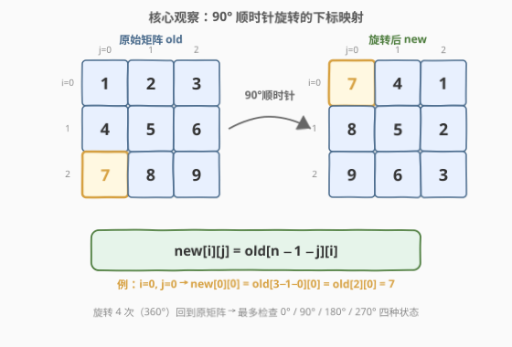
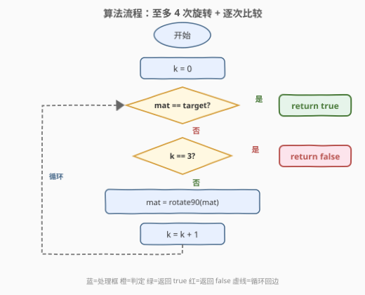
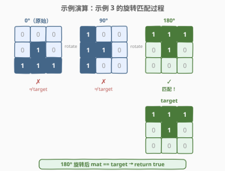

# 判断矩阵经轮转后是否一致

- **题目名称**：判断矩阵经轮转后是否一致
- **链接**：[1886. 判断矩阵经轮转后是否一致](https://leetcode.cn/problems/determine-whether-matrix-can-be-obtained-by-rotation/)
- **难度**：简单
- **标签**：数组、矩阵

## 1. 题目概述

给你两个大小为 $n \times n$ 的二进制矩阵 `mat` 和 `target`。现 **以 90 度顺时针轮转** 矩阵 `mat` 中的元素 **若干次**，如果能够使 `mat` 与 `target` 一致，返回 `true`；否则返回 `false`。

**示例 1**：

```text
输入：mat = [[0,1],[1,0]], target = [[1,0],[0,1]]
输出：true
解释：顺时针轮转 90 度一次可以使 mat 和 target 一致。

旋转前       旋转后（90°）
0 1         1 0
1 0    →    0 1
```

**示例 2**：

```text
输入：mat = [[0,1],[1,1]], target = [[1,0],[0,1]]
输出：false
解释：无法通过轮转矩阵中的元素使 mat 与 target 一致。
```

**示例 3**：

```text
输入：mat = [[0,0,0],[0,1,0],[1,1,1]], target = [[1,1,1],[0,1,0],[0,0,0]]
输出：true
解释：顺时针轮转 90 度两次（即 180°）可以使 mat 和 target 一致。
```

**约束条件**：

- $n = \text{mat.length} = \text{target.length}$
- $n = \text{mat[i].length} = \text{target[i].length}$
- $1 \le n \le 10$
- `mat[i][j]` 和 `target[i][j]` 不是 `0` 就是 `1`

> 💡 **关键约束**：$n \le 10$ 且矩阵元素只有 0/1，数据量极小。更重要的是——90° 旋转 4 次等于 360° 回到原矩阵，因此 `mat` 经旋转只有 **4 种可能状态**（0°/90°/180°/270°），逐一检查即可。

---

## 2. 解题思路

### 2.1 直觉思路：逐次旋转并比较

最直接的做法：检查当前 `mat` 是否等于 `target`，若不等则旋转 90° 再检查，最多旋转 3 次（加上原始状态共 4 种）。任意一次相等即返回 `true`，4 种都不等则返回 `false`。

```text
for k in 0..3:
    if mat == target: return true
    mat = rotate90(mat)
return false
```

这已经是**最优解**——$n \le 10$、最多 4 次旋转，总操作数不超过 $4 \times 10^2 = 400$。关键在于实现 `rotate90` 高效且正确。

### 2.2 核心观察：90° 顺时针旋转的下标映射 + 4 次周期性



**下标映射公式**：$n \times n$ 矩阵顺时针旋转 90° 后，新矩阵 `new` 的第 $i$ 行第 $j$ 列来自原矩阵 `old` 的第 $n-1-j$ 行第 $i$ 列：

$$\text{new}[i][j] = \text{old}[n-1-j][i]$$

以 $3 \times 3$ 矩阵 $\begin{bmatrix}1&2&3\\4&5&6\\7&8&9\end{bmatrix}$ 为例，旋转后得到 $\begin{bmatrix}7&4&1\\8&5&2\\9&6&3\end{bmatrix}$。其中 $\text{old}[2][0] = 7$ 旋转后落到 $\text{new}[0][0]$，因为 $\text{new}[0][0] = \text{old}[3-1-0][0] = \text{old}[2][0] = 7$。

> 💡 **公式记忆**：旋转 90° 后，原矩阵的**第 $j$ 列**变成新矩阵的**第 $j$ 行**（转置），且该列从下到上排列（翻转）。两者合起来即 $\text{new}[i][j] = \text{old}[n-1-j][i]$。

**4 次周期性**：连续旋转 4 次 90° 等于 360°，矩阵回到原始状态。因此 `mat` 经旋转只有 4 种不同状态（0°/90°/180°/270°），**逐一检查即可覆盖所有可能**，无需旋转更多次。

> 💡 **分解视角**：90° 顺时针旋转也可分解为两步简单操作——**转置 + 每行翻转**（先 $\text{old}[i][j] \leftrightarrow \text{old}[j][i]$，再每行 `reverse`）。这正是 [48. 旋转图像](https://leetcode.cn/problems/rotate-image/) 的原地旋转套路，可实现在 $O(1)$ 额外空间内完成旋转。

### 2.3 算法流程图



流程核心是一个**最多 4 轮的循环**：

1. 初始化 $k = 0$（已尝试的旋转次数）。
2. 检查当前 `mat` 是否等于 `target`：相等则立即返回 `true`。
3. 检查 $k = 3$（已旋转 3 次，加上原始状态共检查了 4 种）：是则说明 4 种状态都不匹配，返回 `false`。
4. 将 `mat` 旋转 90°，$k \gets k + 1$，回到步骤 2。

> ⚠️ **循环上限为什么是 4 而非 3？** 第 0 轮检查原始状态（0 次旋转），第 1~3 轮分别检查 1~3 次旋转后的状态，共覆盖 0°/90°/180°/270° 四种。第 4 次旋转 = 360° = 原始状态，无需重复检查。

### 2.4 示例演算



以示例 3 逐步展示（$n = 3$）：

| 旋转次数 | 矩阵状态 | 是否等于 target | 说明 |
|----------|----------|----------------|------|
| 0°（原始） | $\begin{bmatrix}0&0&0\\0&1&0\\1&1&1\end{bmatrix}$ | ✗ | 第一行全 0，target 第一行全 1 |
| 90° | $\begin{bmatrix}1&0&0\\1&1&0\\1&0&0\end{bmatrix}$ | ✗ | 第二行 `[1,1,0]` ≠ `[0,1,0]` |
| 180° | $\begin{bmatrix}1&1&1\\0&1&0\\0&0&0\end{bmatrix}$ | ✓ | 与 target 完全一致！ |

第 2 次旋转（180°）后 `mat` 与 `target` 完全一致，返回 `true`。

> 💡 **演算验证**：90° 旋转时 $\text{new}[i][j] = \text{old}[2-j][i]$。如 $\text{new}[0][0] = \text{old}[2][0] = 1$，$\text{new}[0][1] = \text{old}[1][0] = 0$，$\text{new}[0][2] = \text{old}[0][0] = 0$，得到 90° 状态的第一行 `[1,0,0]`，与 target 第一行 `[1,1,1]` 不等。

---

## 3. 参考代码

### Python

```python
class Solution:
    def findRotation(self, mat: List[List[int]], target: List[List[int]]) -> bool:
        n = len(mat)
        for _ in range(4):
            if mat == target:
                return True
            mat = [[mat[n - 1 - j][i] for j in range(n)] for i in range(n)]
        return False
```

### C++

```cpp
class Solution {
public:
    bool findRotation(vector<vector<int>>& mat, vector<vector<int>>& target) {
        int n = mat.size();
        for (int k = 0; k < 4; k++) {
            if (mat == target) return true;
            vector<vector<int>> tmp(n, vector<int>(n));
            for (int i = 0; i < n; i++)
                for (int j = 0; j < n; j++)
                    tmp[i][j] = mat[n - 1 - j][i];
            mat = tmp;
        }
        return false;
    }
};
```

### Python（转置 + 翻转版，一行旋转）

```python
class Solution:
    def findRotation(self, mat: List[List[int]], target: List[List[int]]) -> bool:
        n = len(mat)
        for _ in range(4):
            if mat == target:
                return True
            # 90° 顺时针 = 转置 + 每行翻转
            mat = [list(row)[::-1] for row in zip(*mat)]
        return False
```

> 💡 **两种写法对比**：下标映射版直接套用公式 $\text{new}[i][j] = \text{old}[n-1-j][i]$，直观且不易出错；转置+翻转版利用 `zip(*mat)` 转置再每行反转，代码更 Pythonic。两者时间复杂度相同，均为 $O(n^2)$。

---

## 4. 复杂度分析

| 维度 | 复杂度 | 说明 |
|------|--------|------|
| 时间复杂度 | $O(n^2)$ | 最多 4 轮循环，每轮比较 $O(n^2)$ + 旋转 $O(n^2)$，总计 $O(4n^2) = O(n^2)$ |
| 空间复杂度 | $O(n^2)$ | 下标映射版需创建新矩阵存储旋转结果；转置+翻转版可做到 $O(1)$ 额外空间（原地修改） |

> 💡 **$n \le 10$ 的意义**：数据量极小，$O(n^2)$ 在最坏情况下仅 $400$ 次操作。本题考察的不是性能优化，而是旋转公式的正确实现与 4 次周期性的洞察。

---

## 5. 扩展：原地旋转与分解视角

### 5.1 90° 顺时针 = 转置 + 每行翻转

矩阵的 90° 顺时针旋转可分解为两步：

1. **转置**：$\text{old}[i][j] \leftrightarrow \text{old}[j][i]$（沿主对角线翻转）
2. **每行翻转**：每一行左右反转 $\text{row}[j] \leftrightarrow \text{row}[n-1-j]$

两步组合后恰好等价于 $\text{new}[i][j] = \text{old}[n-1-j][i]$。这个分解的优势在于**两步都可以原地完成**——转置只需交换对称位置、行翻转只需双指针，无需额外矩阵。

### 5.2 其他旋转角度

| 旋转角度 | 等价分解 | 下标公式 |
|----------|----------|----------|
| 90° 顺时针 | 转置 + 每行翻转 | $\text{new}[i][j] = \text{old}[n-1-j][i]$ |
| 180° | 每行翻转 + 上下翻转 | $\text{new}[i][j] = \text{old}[n-1-i][n-1-j]$ |
| 270° 顺时针 | 转置 + 每列翻转 | $\text{new}[i][j] = \text{old}[j][n-1-i]$ |

> 💡 180° = 旋转 90° 两次，270° = 旋转 90° 三次。掌握 90° 的公式后，连续应用即可得到其他角度。

### 5.3 不构造旋转矩阵直接比较

若追求极致空间，可不实际旋转 `mat`，而是对每个旋转角度 $\theta \in \{0°, 90°, 180°, 270°\}$，**按旋转后的下标映射直接逐元素比较** `mat` 与 `target`。空间 $O(1)$，但需为每个角度写出正确的映射公式，代码更复杂，$n \le 10$ 时收益甚微。

---

## 6. 面试要点

**Q1：为什么最多只检查 4 次旋转？**

> 90° 旋转 4 次等于 360°，矩阵回到原始状态。因此 `mat` 经旋转只有 4 种不同状态：0°（原始）、90°、180°、270°。第 5 次旋转回到 0° 状态，重复无意义。

**Q2：90° 顺时针旋转的下标映射公式是什么？**

> $\text{new}[i][j] = \text{old}[n-1-j][i]$。即新矩阵第 $i$ 行第 $j$ 列的元素来自原矩阵第 $n-1-j$ 行第 $i$ 列。记忆方式：旋转后原第 $j$ 列变成新第 $j$ 行（转置），且原第 $j$ 列从下到上排列（翻转）。

**Q3：如何将 90° 旋转分解为更简单的操作？**

> 分解为转置 + 每行翻转两步。转置沿主对角线交换 $\text{old}[i][j] \leftrightarrow \text{old}[j][i]$，再对每一行做左右翻转。两步均可原地完成，实现 $O(1)$ 额外空间。这正是 [48. 旋转图像](https://leetcode.cn/problems/rotate-image/) 的标准解法。

**Q4：本题和 48 题的区别是什么？**

> 48 题要求**原地**旋转一次 90°，考察的是分解技巧（转置+翻转）以实现 $O(1)$ 空间；本题只需判断旋转后是否等于 target，允许使用辅助矩阵，且需要旋转**多次**（最多 4 次）逐一比较。本题更简单，但需要洞察 4 次周期性。

**Q5：能否不实际旋转矩阵，直接判断？**

> 可以。对每个角度 $\theta$，按旋转后的下标映射公式直接逐元素比较 `mat` 与 `target`，无需构造旋转矩阵。空间 $O(1)$，但需为每个角度写出正确的映射公式，代码更易出错。$n \le 10$ 时实际旋转更简洁。

> 💡 **一句话总结**：90° 顺时针旋转满足 $\text{new}[i][j] = \text{old}[n-1-j][i]$，旋转 4 次回到原矩阵。最多检查 4 种状态（0°/90°/180°/270°），每种与 `target` 逐元素比较，任意一种相等即返回 `true`。

---

## 7. 同类练习题

- [48. 旋转图像](https://leetcode.cn/problems/rotate-image/)（[站内题解](../0001-0100/48_旋转图像.md)）：原地 90° 顺时针旋转，考察转置+翻转分解技巧，本题的进阶版（要求 $O(1)$ 空间）
- [1861. 旋转盒子](https://leetcode.cn/problems/rotating-the-box/)（[站内题解](../1801-1900/1861_旋转盒子.md)）：矩阵旋转 + 重力模拟，旋转操作的综合应用
- [54. 螺旋矩阵](https://leetcode.cn/problems/spiral-matrix/)：矩阵遍历，同属矩阵操作系列，考察方向控制与边界处理
- [836. 矩形重叠](https://leetcode.cn/problems/rectangle-overlap/)：二维几何判断，矩阵/坐标系的另一种应用场景
