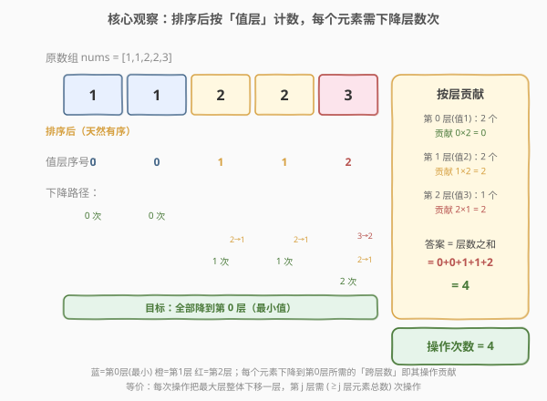
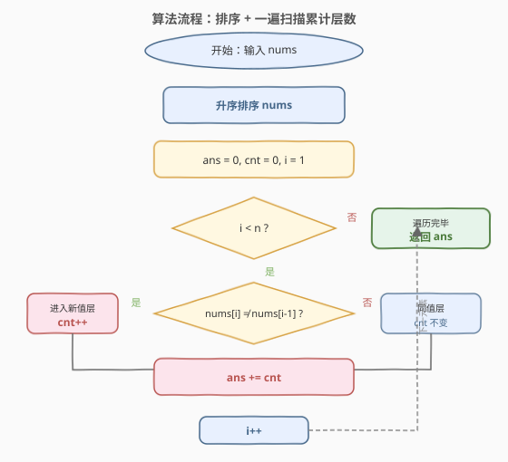

# 使数组元素相等的减少操作次数

- **题目名称**：使数组元素相等的减少操作次数
- **链接**：[1887. 使数组元素相等的减少操作次数](https://leetcode.cn/problems/reduction-operations-to-make-the-array-elements-equal/)
- **难度**：中等
- **标签**：数组、排序、贪心

## 1. 题目概述

给你一个整数数组 `nums`，你的目标是令 `nums` 中的所有元素相等。完成**一次减少操作**需要遵照下面的几个步骤：

1. 找出 `nums` 中的 **最大** 值，记这个值为 `largest` 并取其下标 `i`（**下标从 0 开始**）。如果有多个元素都是最大值，则取**最小的** `i`。
2. 找出 `nums` 中的 **下一个最大** 值，这个值 **严格小于** `largest`，记为 `nextLargest`。
3. 将 `nums[i]` 减少到 `nextLargest`。

返回使 `nums` 中的所有元素相等的**操作次数**。

**示例 1**：

```text
输入：nums = [5,1,3]
输出：3
解释：需要 3 次操作使 nums 中的所有元素相等：
1. largest = 5 下标为 0 。nextLargest = 3 。将 nums[0] 减少到 3 。nums = [3,1,3] 。
2. largest = 3 下标为 0 。nextLargest = 1 。将 nums[0] 减少到 1 。nums = [1,1,3] 。
3. largest = 3 下标为 2 。nextLargest = 1 。将 nums[2] 减少到 1 。nums = [1,1,1] 。
```

**示例 2**：

```text
输入：nums = [1,1,1]
输出：0
解释：nums 中的所有元素已经是相等的。
```

**示例 3**：

```text
输入：nums = [1,1,2,2,3]
输出：4
解释：需要 4 次操作使 nums 中的所有元素相等：
1. largest = 3 下标为 4 。nextLargest = 2 。将 nums[4] 减少到 2 。nums = [1,1,2,2,2] 。
2. largest = 2 下标为 2 。nextLargest = 1 。将 nums[2] 减少到 1 。nums = [1,1,1,2,2] 。
3. largest = 2 下标为 3 。nextLargest = 1 。将 nums[3] 减少到 1 。nums = [1,1,1,1,2] 。
4. largest = 2 下标为 4 。nextLargest = 1 。将 nums[4] 减少到 1 。nums = [1,1,1,1,1] 。
```

**约束条件**：

- $1 \le \text{nums.length} \le 5 \times 10^4$
- $1 \le \text{nums}[i] \le 5 \times 10^4$

> 💡 **核心矛盾**：每次操作只能把**一个**最大元素下拉到「次大值」，看似需要逐操作模拟，但操作总数可能高达 $O(n^2)$（全互异时为 $n(n-1)/2$）。突破口在于：操作永远沿「值层」逐级下降，排序后每个元素**需要下降的层数**只取决于它比最小值大几个不同的值——这能把逐操作模拟压缩成一遍线性计数。

---

## 2. 解题思路

### 2.1 暴力思路

最直观的做法是**按定义逐操作模拟**：每轮扫描数组找出 `largest` 及其下标、再扫一遍找出 `nextLargest`，把 `nums[i]` 改写为 `nextLargest`，操作数 $+1$，直到所有元素相等。

问题在于操作次数本身可能极大。考虑 `nums = [1,2,3,...,n]`（$n$ 个互异值），每个元素要逐层下降到 $1$，总操作数 $= 0+1+\cdots+(n-1) = \dfrac{n(n-1)}{2}$。当 $n = 5\times10^4$ 时约 $1.25\times10^9$ 次；即便用**大根堆**把每轮找最值降到 $O(\log n)$，整体仍是 $O(n^2 \log n) \approx 2\times10^{10}$，远超时限。

> ⚠️ 暴力模拟的瓶颈在于「逐操作」视角：它把 $O(n^2)$ 个操作一个个走。要破局，必须**换视角**——不再问「每次操作做什么」，而是问「每个元素最终要被操作几次」。

### 2.2 核心观察：排序后按「值层」计数



关键洞察分三层：

**第一层：操作即「降一层」。** 把数组中**互异值**从小到大记为 $v_0 < v_1 < \cdots < v_{k-1}$，称为 $k$ 个「值层」（$v_0$ 是最小值，即目标层）。一次操作把某个最大值元素从当前层下拉到**相邻的下一层**（`largest` → `nextLargest` 严格相邻）。因此每个元素从其初始所在层降到第 $0$ 层，**恰好需要「层序号」次操作**——第 $j$ 层的元素需要 $j$ 次操作。

**第二层：总操作数 = 层序号之和。** 排序后，相同值的元素聚成连续一段。第 $i$ 个位置（$0$ 基）的元素，其层序号 $=$ 它左侧**出现过的不同值个数**。于是：

$$\text{ans} = \sum_{i=0}^{n-1} \text{层序号}(i) = \sum_{i=1}^{n-1} \text{cnt}[i]$$

其中 $\text{cnt}[i]$ 表示前 $i$ 个位置中出现过的不同值数量（$\text{cnt}[0]=0$）。这可以用一个滚动变量在排序后一遍扫描得到。

**第三层：等价「按层贡献」视角。** 把求和换序：每次「第 $j$ 层整体降到第 $j-1$ 层」需要操作 $\ge j$ 层的全部元素，即 $n - \text{firstIdx}[v_j]$ 次（$\text{firstIdx}[v_j]$ 为 $v_j$ 在排序数组中首次出现的下标）。于是：

$$\text{ans} = \sum_{j=1}^{k-1} \bigl(n - \text{firstIdx}[v_j]\bigr)$$

两种视角完全等价（$\sum_i \text{cnt}[i] = \sum_{j\ge1}(\ge j\text{ 层元素数})$），后者更贴近操作语义，前者更便于一行写出代码。

> 💡 **为什么排序是关键？** 排序让相同值聚成连续段，使「不同值个数」可由相邻比较 $O(1)$ 增量维护；同时消除了「大值夹小值」导致 nextLargest 难以确定的歧义。排序后问题从「逐操作调度」降维成「数每个元素的层序号」，是典型的**用排序暴露贪心/计数结构**。

### 2.3 算法流程图



流程核心：先对 `nums` **升序排序**，初始化 `ans = 0, cnt = 0, i = 1`。然后循环 $i$ 从 $1$ 到 $n-1$：若 $\text{nums}[i] \neq \text{nums}[i-1]$ 说明进入了新的值层，`cnt++`；随后 `ans += cnt`（当前位置元素的层序号恰为当前 `cnt`）。循环结束 `ans` 即答案。

> ⚠️ **边界**：$i$ 从 $1$ 开始（$\text{nums}[0]$ 的层序号恒为 $0$，无需累加）；$n=1$ 时循环不执行，`ans=0` 正确（单元素已「全等」）。

### 2.4 示例演算

![示例演算：nums = [1,1,2,2,3] 的层序号累计与操作模拟](../images/1887_example_walkthrough.svg)

以 `nums = [1,1,2,2,3]` 为例（排序后不变）：

| $i$ | $\text{nums}[i]$ | $\text{nums}[i-1]$ | 换层? | `cnt` | `ans`（累加） |
|-----|------------------|--------------------|-------|-------|---------------|
| 1 | 1 | 1 | 同值 | 0 | 0 |
| 2 | 2 | 1 | 换层 ↑ | 1 | $0+1=1$ |
| 3 | 2 | 2 | 同值 | 1 | $1+1=2$ |
| 4 | 3 | 2 | 换层 ↑ | 2 | $2+2=4$ |

最终 `ans = 4` ✓。对照右侧操作模拟：$3\to2$（1 次）+ 三个 $2\to1$（3 次）$= 4$ 次，与「层序号之和」$0+0+1+1+2=4$ 完全吻合。

> 💡 注意 $i=2$ 与 $i=4$ 是「换层」位置（值发生变化），`cnt` 自增；$i=3$ 同值层 `cnt` 不变但 `ans` 仍累加 `cnt`（该元素同样需要下降 $1$ 层）。这说明**同值层的每个元素都要单独操作**——这正是「每次只下拉一个元素」语义的体现。

---

## 3. 参考代码

### C++

```cpp
class Solution {
  public:
    int reductionOperations(vector<int>& nums) {
        sort(nums.begin(), nums.end());
        int ans = 0, cnt = 0;
        for (int i = 1; i < (int)nums.size(); i++) {
            if (nums[i] != nums[i - 1]) cnt++;
            ans += cnt;
        }
        return ans;
    }
};
```

### Python

```python
class Solution:
    def reductionOperations(self, nums: List[int]) -> int:
        nums.sort()
        ans = cnt = 0
        for i in range(1, len(nums)):
            if nums[i] != nums[i - 1]:
                cnt += 1
            ans += cnt
        return ans
```

### Python（pairwise 版）

```python
from itertools import pairwise


class Solution:
    def reductionOperations(self, nums: List[int]) -> int:
        nums.sort()
        ans = cnt = 0
        for a, b in pairwise(nums):
            if a != b:
                cnt += 1
            ans += cnt
        return ans
```

> 💡 **两种写法对比**：下标版显式展示 $i$ 与 $\text{nums}[i-1]$ 的关系，便于讲解；`pairwise` 版用相邻对 `(a, b)` 更 Pythonic，逻辑完全等价（`a = nums[i-1]`, `b = nums[i]`）。

> ⚠️ **值域说明**：$\text{nums}[i] \le 5\times10^4$，$n \le 5\times10^4$。答案上界为 $\dfrac{n(n-1)}{2} \approx 1.25\times10^9$，超过 `int` 但未超过 $2^{31}-1 \approx 2.1\times10^9$——实际上 $n\le5\times10^4$ 时 $\dfrac{5\times10^4 \times 49999}{2} \approx 1.25\times10^9 < 2.1\times10^9$，`int` 恰好安全；C++ 中若担心可改 `long long`，Python 无此问题。

---

## 4. 复杂度分析

| 维度 | 复杂度 | 说明 |
|------|--------|------|
| 时间复杂度 | $O(n \log n)$ | 排序 $O(n \log n)$ + 一次线性扫描 $O(n)$，排序为主导 |
| 空间复杂度 | $O(\log n)$ | 排序栈空间（原地排序）；`ans`/`cnt` 变量 $O(1)$ |

> 💡 本题的精妙在于把「逐操作模拟」这个 $O(n^2)$ 量级的调度过程，重塑为「数每个元素的层序号」的一遍扫描。排序暴露了值层结构，使每个元素的操作贡献可由相邻比较 $O(1)$ 增量得到——典型的「排序 + 计数」范式。

---

## 5. 扩展：按层贡献视角与 $O(n)$ 计数优化

### 5.1 按层贡献的等价写法

由 2.2 的「按层贡献」视角，答案 $= \sum_{j=1}^{k-1}(n - \text{firstIdx}[v_j])$。可以倒序遍历排序数组，维护「已处理的元素数」`seen`（即 $\ge$ 当前值的元素总数），每遇到一个新值层（非最小值）就把 `seen` 累加到答案：

```python
class Solution:
    def reductionOperations(self, nums: List[int]) -> int:
        nums.sort()
        ans = seen = 0
        for i in range(len(nums) - 1, 0, -1):
            seen += 1
            if nums[i] != nums[i - 1]:
                ans += seen
        return ans
```

> ⚠️ 这里 `seen` 在每个位置 $+1$，但只在「换层」（`nums[i] != nums[i-1]`）时把 `seen` 累加进 `ans`——因为第 $j$ 层整体降到第 $j-1$ 层的操作数恰为 $\ge j$ 层元素总数。到 $i=1$ 处理完最小值的上一段即止，最小值层 $v_0$ 不需再降。逻辑与正序 `cnt` 版严格等价，只是从「元素视角」换到「层视角」。

### 5.2 $O(n)$ 计数排序优化

利用约束 $\text{nums}[i] \le 5\times10^4$（值域 $V$ 与 $n$ 同阶），可用**频次数组**替代比较排序，做到 $O(n + V) = O(n)$：

```python
class Solution:
    def reductionOperations(self, nums: List[int]) -> int:
        V = max(nums)
        freq = [0] * (V + 1)
        for x in nums:
            freq[x] += 1
        ans = seen = 0
        for v in range(V, 0, -1):
            if freq[v] == 0:
                continue
            ans += seen           # 当前层 v → 下一层：≥v 的元素各操作一次
            seen += freq[v]       # 累入本层元素数
        return ans
```

> 💡 倒序遍历值域 $v$，`seen` 始终代表「值 $\ge v$ 的元素总数」。对每个非最小值层 $v$，它降到下一层需要 `seen` 次操作（与 5.1 同理）。跳过 `freq[v]==0` 的空值。时间 $O(n + V)$，空间 $O(V)$；当值域与 $n$ 同阶时优于 $O(n\log n)$。这与 [1846](1846_减小和重新排列数组后的最大元素.md) 截断值域做计数的思路异曲同工。

---

## 6. 面试要点

**Q1：为什么排序后一遍计数就能得到答案？**

> 排序让相同值聚成连续段，每个元素需要下降的「层数」$=$ 它左侧出现过的不同值个数，可由相邻比较 $O(1)$ 增量维护。每个元素的层数即它需要的操作次数，求和即总操作数。排序把逐操作模拟（$O(n^2)$）降维成一遍扫描（$O(n)$，排序主导 $O(n\log n)$）。

**Q2：暴力模拟为什么不行？**

> 操作总数最坏为 $\dfrac{n(n-1)}{2}$（全互异时），$n=5\times10^4$ 约 $1.25\times10^9$ 次。即便用堆把每次找最值降到 $O(\log n)$，整体 $O(n^2\log n)\approx2\times10^{10}$ 仍超时。瓶颈在于「逐操作」视角，必须换为「数每个元素贡献」的计数视角。

**Q3：「层序号之和」和「按层贡献」两种视角有何关系？**

> 严格等价。前者按元素求和：$\sum_i \text{层序号}(i)$；后者按层求和：$\sum_{j\ge1}(\ge j\text{ 层元素数})$。交换求和序即得 $\sum_t t\cdot\text{count}_t = \sum_{j\ge1}\sum_{t\ge j}\text{count}_t$。前者写代码更简洁（正序一遍），后者更贴操作语义（倒序按层合并）。

**Q4：$n=5\times10^4$ 时答案会溢出 `int` 吗？**

> 最坏答案 $\dfrac{n(n-1)}{2} \approx 1.25\times10^9 < 2^{31}-1 \approx 2.1\times10^9$，`int` 恰好安全但余量不大。若 $n$ 上界再大一些（如 $10^5$）就会溢出，C++ 应改用 `long long`；Python 无此问题。面试时可主动提及该边界。

**Q5：本题与 1331（数组序号转换）有什么联系？**

> 1331 把每个元素替换为「严格小于它的不同值个数 $+1$」即排名；本题中每个元素的「层序号」恰为「严格小于它的不同值个数」$=$ 排名 $-1$。所以 1887 的答案 $=$ $\sum(\text{排名}-1)$。两者都依赖「排序后数不同值」的核心操作，1331 输出每个排名，1887 求排名之和。

---

## 7. 同类练习题

- [1846. 减小和重新排列数组后的最大元素](https://leetcode.cn/problems/maximum-element-after-decreasing-and-rearranging/)（[站内题解](1846_减小和重新排列数组后的最大元素.md)）：同目录同套路的「排序 + 一遍扫描」姊妹题，但目标相反——1846 是「封顶求最大值」（每个元素取 $\min(\text{原值}, \text{prev}+1)$），1887 是「数下降次数」（每个元素累计层序号），对照「向下压」与「向下数」两种贪心/计数范式
- [1331. 数组序号转换](https://leetcode.cn/problems/rank-transform-of-an-array/)（[站内题解](../1301-1400/1331_数组序号转换.md)）：排序 + 哈希把每个元素替换为排名，而本题的「层序号」恰为排名 $-1$，答案 $=$ $\sum(\text{排名}-1)$，共享「排序后数不同值」的核心
- [1827. 最少操作使数组递增](https://leetcode.cn/problems/minimum-operations-to-make-the-array-increasing/)（[站内题解](1827_最少操作使数组递增.md)）：同为「数组 + 排序 + 逐位置依赖前驱」的简单题，但操作方向相反（只能 $+1$ 抬升使严格递增），对照「向上顶」与「向下数」两种线性扫描
- [945. 使数组唯一的最小增量](https://leetcode.cn/problems/minimum-increment-to-make-array-unique/)（[站内题解](../0901-1000/945_使数组唯一的最小增量.md)）：排序 + 贪心使数组元素各不相同，每个元素顶到前驱 $+1$；与本题「排序后逐位置依赖前驱做局部最优」同源，对照「向上顶唯一」与「向下数层数」
- [1636. 按照频率将数组升序排序](https://leetcode.cn/problems/sort-array-by-increasing-frequency/)（[站内题解](../1601-1700/1636_按照频率将数组升序排序.md)）：同为「排序 + 频率计数」的中等题，先按值统计频率再按频率排序，对照「排序后计数」的不同应用场景
