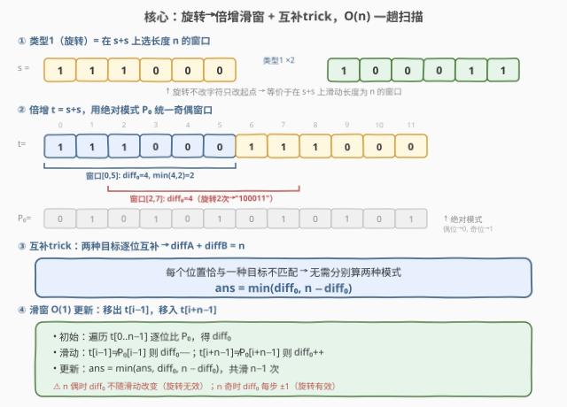
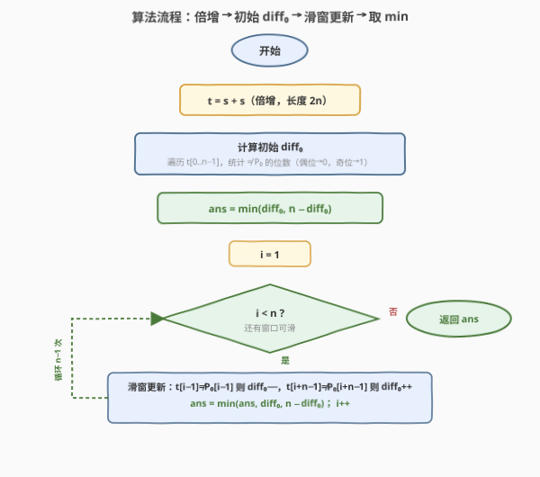
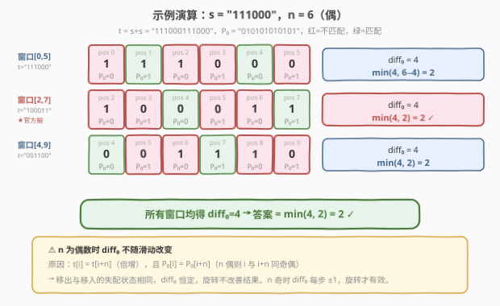

# LeetCode 使二进制字符串字符交替的最少反转次数 题解

## 1. 题目概述

- **标题 / 题号**：使二进制字符串字符交替的最少反转次数（#1888，medium）
- **链接**：https://leetcode.cn/problems/minimum-number-of-flips-to-make-the-binary-string-alternating/
- **难度**：中等
- **标签**：字符串、滑动窗口、贪心

**题意**：给定一个仅由 `'0'` 和 `'1'` 组成的字符串 `s`。你可以按任意顺序执行以下两种操作任意次：

- **类型 1（旋转）**：删除字符串 `s` 的第一个字符并将它添加到字符串结尾。
- **类型 2（翻转）**：选择字符串 `s` 中任意一个字符并将该字符反转（`'0'` ↔ `'1'`）。

返回使 `s` 变成**交替**字符串的前提下，**类型 2** 的**最少**操作次数。交替字符串定义为任意相邻字符都不同（即形如 `"0101…"` 或 `"1010…"`）。

**示例 1**：

```text
输入：s = "111000"
输出：2
解释：执行第一种操作两次，得到 s = "100011"。
然后对第三个和第六个字符执行第二种操作，得到 s = "101010"。
```

**示例 2**：

```text
输入：s = "010"
输出：0
解释：字符串已经是交替的。
```

**示例 3**：

```text
输入：s = "1110"
输出：1
解释：对第二个字符执行第二种操作，得到 s = "1010"。
```

**约束**：

- $1 \le \text{s.length} \le 10^5$
- `s[i]` 为 `'0'` 或 `'1'`

> 💡 **与 1758 / 1864 的关键区别**：1758 只有翻转操作（无旋转），逐位统计差异 + 互补 trick 即可；1864 是交换操作（不改频次），需判可行性且 `swaps = mis / 2`。本题在 1758 的翻转基础上**增加了旋转**——旋转不改字符只改起点，等价于在环形串上选起点，由此引入倍增 + 滑窗技巧。

## 2. 解题思路

### 2.1 暴力思路：枚举所有旋转 + 逐位统计

旋转操作不改变字符内容，只改变起始位置。长度为 $n$ 的串共有 $n$ 种旋转结果。对每种旋转，计算使其交替所需的最少翻转数（与 1758 相同：逐位比对两种目标 `"0101…"` 和 `"1010…"`，取较小值）。

```text
ans = ∞
for i in 0 .. n-1:                         # 枚举旋转起点
    rotated = s[i:] + s[:i]                # 旋转后的串
    diffA = 0                              # 与 "0101..." 的差异
    for j in 0 .. n-1:
        expected = '0' if j 偶 else '1'
        if rotated[j] != expected: diffA += 1
    diffB = n - diffA                      # 互补trick
    ans = min(ans, diffA, diffB)
return ans
```

时间 $O(n^2)$、空间 $O(n)$。$n \le 10^5$ 时会超时。

> ⚠️ **症结**：旋转和翻转是**可分离**的——旋转只选起点，翻转只改值。暴力对每个旋转独立重算差异，但相邻旋转的差异高度重叠，可以用滑窗复用。

### 2.2 核心观察：倍增滑窗 + 互补 trick



关键洞察分三层：

**第一层——旋转 = 环形选起点 → 倍增 + 滑窗**：类型 1 操作把首字符移到末尾，等价于在环形串上选择一个新的起点。将 `s` 拼接为 `t = s + s`（长度 $2n$），则所有 $n$ 种旋转结果恰好对应 `t` 上 $n$ 个长度为 $n$ 的滑动窗口：`t[0..n-1]`、`t[1..n]`、…、`t[n-1..2n-2]`。

**第二层——互补 trick，只跟踪一个 diff**：与 1758 相同，两种交替目标 `"0101…"` 和 `"1010…"` 逐位互补，每个位置恰与一种目标不匹配，故 $\text{diffA} + \text{diffB} = n$。只需跟踪 $\text{diff}_0$（与某一种目标的差异），答案即 $\min(\text{diff}_0, n - \text{diff}_0)$。

**第三层——绝对模式统一窗口奇偶**：定义**绝对模式** $P_0$：位置 $j$ 在 $P_0$ 中为 `'0'` 若 $j$ 为偶、为 `'1'` 若 $j$ 为奇（即 $P_0[j] = j \bmod 2$）。对窗口 $[i, i{+}n{-}1]$，其「起始 `'0'`」模式与 $P_0$ 的关系取决于 $i$ 的奇偶：

| 窗口起点 $i$ | 窗口「起始 `'0'`」模式 vs $P_0$ | $\text{diff}_0$（与 $P_0$ 的差异）含义 |
|---|---|---|
| $i$ 偶 | 对齐（同一起始字符） | $\text{diff}_0 = \text{diffA}$，$n - \text{diff}_0 = \text{diffB}$ |
| $i$ 奇 | 反相（互补） | $\text{diff}_0 = \text{diffB}$，$n - \text{diff}_0 = \text{diffA}$ |

**无论 $i$ 奇偶，答案都是 $\min(\text{diff}_0, n - \text{diff}_0)$** —— 绝对模式将两种窗口奇偶性统一为同一个 $\text{diff}_0$ 指标，无需分类讨论。

> 💡 **为什么用绝对模式而非相对模式？** 若按「窗口内部索引」定义模式（窗口位置 0 → `'0'`），滑动时所有内部索引移位，模式逐位翻转，$\text{diff}$ 无法增量更新。改用绝对模式（按 $t$ 中的绝对位置定义），滑动时只有首尾两个位置变化，$\text{diff}_0$ 可 $O(1)$ 增量更新。

**滑窗 $O(1)$ 更新**：从窗口 $[i{-}1, i{+}n{-}2]$ 滑到 $[i, i{+}n{-}1]$：
- 移出 $t[i{-}1]$：若 $t[i{-}1] \ne P_0[i{-}1]$（即 $t[i{-}1] \ne (i{-}1) \bmod 2$），$\text{diff}_0 \mathrel{-}{=} 1$
- 移入 $t[i{+}n{-}1]$：若 $t[i{+}n{-}1] \ne P_0[i{+}n{-}1]$（即 $t[i{+}n{-}1] \ne (i{+}n{-}1) \bmod 2$），$\text{diff}_0 \mathrel{+}{=} 1$

### 2.3 算法流程图



1. **倍增**：`t = s + s`，长度 $2n$。
2. **初始窗口**：对 $t[0..n{-}1]$ 逐位比对 $P_0$，得 $\text{diff}_0$。
3. **初始答案**：$\text{ans} = \min(\text{diff}_0, n - \text{diff}_0)$。
4. **滑动**：$i$ 从 $1$ 到 $n - 1$，每步 $O(1)$ 更新 $\text{diff}_0$（移出 + 移入），$\text{ans} = \min(\text{ans}, \text{diff}_0, n - \text{diff}_0)$。
5. **返回** $\text{ans}$。

总共 $n$ 次窗口位置，每次 $O(1)$，时间 $O(n)$。

### 2.4 示例演算

以示例 1 `s = "111000"`（$n=6$）为例：



**倍增**：$t = \text{"111000111000"}$，$P_0 = \text{"010101010101"}$。

**窗口 $[0,5]$**（$t = \text{"111000"}$，$P_0 = \text{"010101"}$）：

| 位置 | 0 | 1 | 2 | 3 | 4 | 5 |
|------|---|---|---|---|---|---|
| $t$ | 1 | 1 | 1 | 0 | 0 | 0 |
| $P_0$ | 0 | 1 | 0 | 1 | 0 | 1 |
| 匹配 | ✗ | ✓ | ✗ | ✗ | ✓ | ✗ |

$\text{diff}_0 = 4$，$\min(4, 6 - 4) = 2$。

**窗口 $[2,7]$**（$t = \text{"100011"}$，$P_0[2..7] = \text{"010101"}$，即官方解旋转 2 次的结果）：

| 位置 | 2 | 3 | 4 | 5 | 6 | 7 |
|------|---|---|---|---|---|---|
| $t$ | 1 | 0 | 0 | 0 | 1 | 1 |
| $P_0$ | 0 | 1 | 0 | 1 | 0 | 1 |
| 匹配 | ✗ | ✗ | ✓ | ✗ | ✗ | ✓ |

$\text{diff}_0 = 4$，$\min(4, 2) = 2$。

**窗口 $[4,9]$**（$t = \text{"001100"}$，$P_0[4..9] = \text{"010101"}$）：

| 位置 | 4 | 5 | 6 | 7 | 8 | 9 |
|------|---|---|---|---|---|---|
| $t$ | 0 | 0 | 1 | 1 | 1 | 0 |
| $P_0$ | 0 | 1 | 0 | 1 | 0 | 1 |
| 匹配 | ✓ | ✗ | ✗ | ✓ | ✗ | ✗ |

$\text{diff}_0 = 4$，$\min(4, 2) = 2$。

> 💡 **$n$ 偶时 $\text{diff}_0$ 不随滑动改变**——所有窗口均得 $\text{diff}_0 = 4$。这是因为倍增后 $t[i] = t[i{+}n]$，且 $n$ 为偶时 $i$ 与 $i{+}n$ 同奇偶故 $P_0[i] = P_0[i{+}n]$，移出与移入的失配状态完全相同。因此 $n$ 偶时旋转无效，只需算初始窗口即可。

## 3. 参考代码

### C++

```cpp
class Solution {
public:
    int minFlips(string s) {
        int n = s.size();
        string t = s + s;
        int diff0 = 0;
        for (int j = 0; j < n; ++j) {
            if ((t[j] - '0') != (j % 2)) ++diff0;
        }
        int ans = min(diff0, n - diff0);
        for (int i = 1; i < n; ++i) {
            if ((t[i - 1] - '0') != ((i - 1) % 2)) --diff0;
            if ((t[i + n - 1] - '0') != ((i + n - 1) % 2)) ++diff0;
            ans = min({ans, diff0, n - diff0});
        }
        return ans;
    }
};
```

### Python

```python
class Solution:
    def minFlips(self, s: str) -> int:
        n = len(s)
        t = s + s
        diff0 = sum(1 for j in range(n) if int(t[j]) != j % 2)
        ans = min(diff0, n - diff0)
        for i in range(1, n):
            if int(t[i - 1]) != (i - 1) % 2:
                diff0 -= 1
            if int(t[i + n - 1]) != (i + n - 1) % 2:
                diff0 += 1
            ans = min(ans, diff0, n - diff0)
        return ans
```

> 💡 **写法要点**：
> - `(t[j] - '0') != (j % 2)` 即「$t[j]$ 与 $P_0[j]$ 失配」——$P_0[j] = j \bmod 2$（偶位期望 `'0'`，奇位期望 `'1'`）。
> - 互补 trick：`n - diff0` 即与另一种目标的差异，无需第二次遍历。
> - `min({ans, diff0, n - diff0})`（C++）与 `min(ans, diff0, n - diff0)`（Python）等价，每步同时考虑两种目标。
>
> ⚠️ **空间优化**：倍增串 `t = s + s` 占 $O(n)$ 空间。可用模运算 `s[j % n]` 替代 `t[j]`，降至 $O(1)$ 额外空间。注意到 $t[i{+}n{-}1] = s[(i{+}n{-}1) \bmod n] = s[i{-}1]$（对 $i \in [1, n{-}1]$），即移入字符的**值**与移出字符相同，只是**比较位置**的奇偶性不同——这正是 $n$ 奇偶性影响 $\text{diff}_0$ 的根源。

## 4. 复杂度分析

| 维度 | 复杂度 | 说明 |
|------|--------|------|
| 时间复杂度 | $O(n)$ | 初始窗口 $O(n)$ + $n - 1$ 次滑动每次 $O(1)$ |
| 空间复杂度 | $O(n)$ | 倍增串 `t = s + s`；可优化至 $O(1)$（模运算替代） |

> 💡 $n \le 10^5$，$O(n)$ 完全可接受。相比暴力的 $O(n^2)$，滑窗将重复计算消除为增量更新。

## 5. 扩展：$n$ 奇偶性对旋转效果的影响

$\text{diff}_0$ 在滑动时的变化量取决于移出字符 $t[i{-}1]$ 和移入字符 $t[i{+}n{-}1]$ 的失配状态之差。由于倍增 $t[i{-}1] = t[i{+}n{-}1]$（同一个字符 $s[i{-}1]$），变化量仅由 $P_0[i{-}1]$ 与 $P_0[i{+}n{-}1]$ 的关系决定：

$$
P_0[i{+}n{-}1] = (i{+}n{-}1) \bmod 2 = \big((i{-}1) + n\big) \bmod 2
$$

| $n$ 奇偶 | $P_0[i{+}n{-}1]$ vs $P_0[i{-}1]$ | 移入失配状态 vs 移出 | $\text{diff}_0$ 变化 |
|---|---|---|---|
| $n$ 偶 | 相同（$i{-}1$ 与 $i{+}n{-}1$ 同奇偶） | 相同（值同 + 模式同） | **不变**，旋转无效 |
| $n$ 奇 | 相反（奇偶翻转） | 翻转（值同 + 模式反） | **±1**，旋转有效 |

**结论**：$n$ 为偶数时，所有旋转的 $\text{diff}_0$ 相同，旋转不改善结果，只需算初始窗口（退化为 1758）；$n$ 为奇数时，$\text{diff}_0$ 每步变化 $\pm 1$，旋转可能找到更优窗口。

> 💡 **面试速判**：看到「旋转 + 翻转」组合，先看 $n$ 奇偶——$n$ 偶直接退化为 1758（无旋转），$n$ 奇才需滑窗。但代码无需分支，统一滑窗即可，$n$ 偶时滑窗自然退化为恒等更新。

## 6. 面试要点

**Q1：为什么旋转可以转化为倍增 + 滑窗？**
> 旋转操作把首字符移到末尾，等价于在环形串上选起点。将 `s` 拼成 `t = s + s`，所有 $n$ 种旋转恰好对应 `t` 上 $n$ 个长度为 $n$ 的窗口。滑窗复用相邻窗口的重叠部分，将 $O(n^2)$ 暴力优化为 $O(n)$。这是环形串问题的通用技巧。

**Q2：为什么要用「绝对模式」而非「相对模式」？**
> 相对模式按窗口内部索引定义（窗口位置 0 → `'0'`），滑动时所有内部索引移位，模式逐位翻转，$\text{diff}$ 无法增量更新。绝对模式按 $t$ 中的绝对位置定义（$P_0[j] = j \bmod 2$），滑动时只有首尾两个位置变化，$\text{diff}_0$ 可 $O(1)$ 更新。且无论窗口起点 $i$ 奇偶，答案都是 $\min(\text{diff}_0, n - \text{diff}_0)$，无需分类讨论。

**Q3：互补 trick `diffA + diffB = n` 在这里如何使用？**
> 两种交替目标 `"0101…"` 和 `"1010…"` 逐位互补，每个位置恰与一种目标不匹配。所以只需跟踪与一种目标的差异 $\text{diff}_0$，另一种自动为 $n - \text{diff}_0$，答案取 $\min$。这与 1758 的互补 trick 完全一致，只是 1758 无旋转（单一窗口），本题有 $n$ 个窗口需滑窗维护 $\text{diff}_0$。

**Q4：$n$ 为偶数时旋转有用吗？**
> 无用。倍增后 $t[i] = t[i{+}n]$（同一字符），且 $n$ 偶时 $i$ 与 $i{+}n$ 同奇偶故 $P_0[i] = P_0[i{+}n]$，移出与移入的失配状态完全相同，$\text{diff}_0$ 不变。此时退化为 1758（无旋转），只需算初始窗口。$n$ 为奇数时 $\text{diff}_0$ 每步 $\pm 1$，旋转才可能改善。

**Q5：本题与 1758、1864 的关系？**
> 三题都是「使二进制串交替」家族：1758 是**翻转**（每位独立可变），利用互补 trick 一趟扫描，永远可行；1864 是**交换**（不改频次），需判可行性且 `swaps = mis / 2`；1888 在 1758 的翻转基础上**增加旋转**（类型 1），用倍增 + 滑窗处理 $n$ 种起点，核心仍是互补 trick，但 $\text{diff}_0$ 需增量维护。

## 同类练习题

| # | 题目 | 与本题的关联 |
|---|------|-------------|
| 1758 | [生成交替二进制字符串的最少操作数](https://leetcode.cn/problems/minimum-changes-to-make-alternating-binary-string/)（[题解](../1701-1800/1758_生成交替二进制字符串的最少操作数.md)） | 翻转版母题，无旋转，互补 trick `diffB = n − diffA` 一趟扫描；1888 在此基础上加旋转→倍增滑窗 |
| 1864 | [构成交替字符串需要的最小交换次数](https://leetcode.cn/problems/minimum-number-of-swaps-to-make-the-binary-string-alternating/)（[题解](1864_构成交替字符串需要的最小交换次数.md)） | 交换版，不改频次需判可行性，`swaps = mis / 2`；对照 1888 的翻转版每位独立 |
| 1653 | [使字符串平衡的最少删除次数](https://leetcode.cn/problems/minimum-deletions-to-make-string-balanced/) | 二进制串分区问题，枚举分界点 + 前缀和，同样是「枚举所有起点取最小」的滑窗/前缀思想 |
| 1702 | [修改后的最大二进制字符串](https://leetcode.cn/problems/maximum-binary-string-after-change/)（[题解](../1701-1800/1702_修改后的最大二进制字符串.md)） | 二进制串操作优化，关注 `0`/`1` 的位置布局对结果的影响 |
| 2134 | [最少交换次数使二进制串交替](https://leetcode.cn/problems/minimum-swaps-to-group-all-1s-together-ii/) | 环形串上的最少交换，同样用倍增 + 滑窗处理旋转，技巧直接迁移 |
