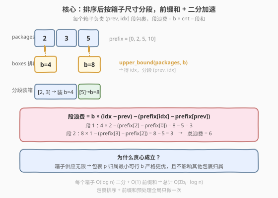
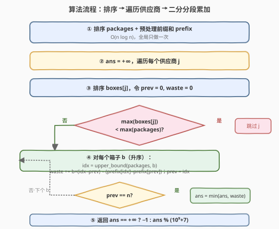
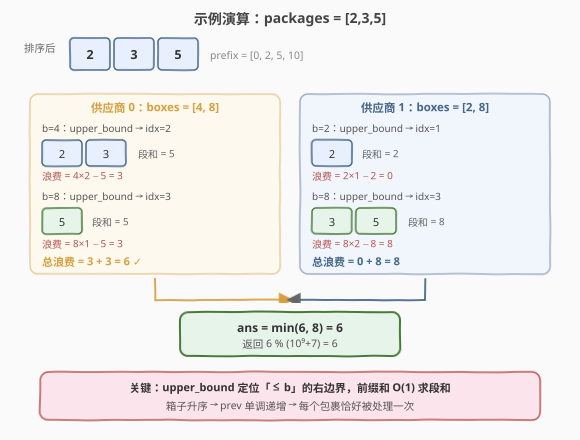

# LeetCode 装包裹的最小浪费空间 题解

## 1. 题目概述

- **标题 / 题号**：装包裹的最小浪费空间（#1889，hard）
- **链接**：https://leetcode.cn/problems/minimum-space-wasted-from-packaging/
- **难度**：困难
- **标签**：数组、二分查找、前缀和、排序

**题意**：给定 `n` 个包裹（尺寸数组 `packages`）和 `m` 个供应商（每个供应商提供一组**不同尺寸**的箱子，每种尺寸数量无限）。**每个箱子只能装一个包裹**，且包裹尺寸需 **小于等于** 箱子尺寸。

需要**选择一个供应商**，只使用该供应商的箱子装完所有包裹，使**总浪费空间最小**。浪费空间定义为「箱子尺寸 − 包裹尺寸」逐箱累加。若某供应商无法装下所有包裹则跳过；若所有供应商都装不下返回 `-1`。答案对 $10^9 + 7$ 取模。

**示例 1**：

```text
输入：packages = [2,3,5], boxes = [[4,8],[2,8]]
输出：6
解释：选供应商 0，用两个尺寸 4 装包裹 2、3，一个尺寸 8 装包裹 5。
      浪费 = (4-2) + (4-3) + (8-5) = 6。
      供应商 1 浪费 = (2-2) + (8-3) + (8-5) = 8，更差。
```

**示例 2**：

```text
输入：packages = [2,3,5], boxes = [[1,4],[2,3],[3,4]]
输出：-1
解释：没有任何供应商的箱子能装下尺寸为 5 的包裹。
```

**示例 3**：

```text
输入：packages = [3,5,8,10,11,12], boxes = [[12],[11,9],[10,5,14]]
输出：9
解释：选供应商 2，浪费 = (5-3)+(5-5)+(10-8)+(10-10)+(14-11)+(14-12) = 9。
```

**约束**：

- $1 \le n \le 10^5$，$1 \le m \le 10^5$
- $1 \le \text{packages}[i] \le 10^5$
- $1 \le \text{boxes}[j].\text{length} \le 10^5$，$\sum_j \text{boxes}[j].\text{length} \le 10^5$
- `boxes[j]` 中元素**互不相同**

> 💡 **本质**：对每个供应商独立求「最小浪费」，再取全局最小。单个供应商内部，箱子尺寸升序后，**每个包裹应装进能装下它的最小箱子**（贪心）——这样浪费最少。关键是高效计算「一批包裹装进某个箱子」的总浪费，避免逐包裹累加。

## 2. 解题思路

### 2.1 暴力思路

对每个供应商的每种箱子尺寸组合，逐个包裹枚举能装它的最小箱子，累加浪费。包裹数 $n$、箱子种类总数 $\sum b_j$ 都达 $10^5$，逐包裹线性扫描会到 $O(n \cdot \sum b_j) \approx 10^{10}$，超时。

### 2.2 核心观察：排序 + 前缀和 + 二分定位



**贪心基础**：包裹排序后，对某个箱子的尺寸 $b$，所有 $\le b$ 且尚未被更小箱子装走的包裹，都应该用这个 $b$ 来装（因为更小的箱子装不下它们，更大的箱子浪费更多）。

**分段计算**：将某供应商的箱子尺寸升序排列 $b_1 < b_2 < \cdots < b_k$。对每个 $b_t$，用**二分查找**（`upper_bound`）在排序后的 `packages` 中定位出「$\le b_t$」的右边界 $r_t$。那么 $(r_{t-1}, r_t]$ 这段包裹（即尺寸在 $(b_{t-1}, b_t]$ 之间的包裹）全部用 $b_t$ 装箱。该段的浪费为：

$$\text{waste}_t = b_t \cdot (r_t - r_{t-1}) - \sum_{i=r_{t-1}+1}^{r_t} \text{packages}[i]$$

其中包裹和用**前缀和** $O(1)$ 查询。这样每个箱子的处理只需 $O(\log n)$ 的二分 + $O(1)$ 求和，而非逐包裹累加。

> ⚠️ **为什么每个包裹装最小可行箱子？** 设包裹 $p$ 可被箱子 $b_s$ 和 $b_t$（$b_s < b_t$）装下。用 $b_s$ 浪费 $b_s - p$，用 $b_t$ 浪费 $b_t - p > b_s - p$。因此让 $p$ 归属最小可行箱子是严格更优的，贪心成立。

### 2.3 算法流程图



整体流程：

1. **排序 packages** + **预处理前缀和**（全局只做一次）。
2. **遍历每个供应商** $j$：
   - 排序 `boxes[j]`；
   - 若最大箱子 $< \max(\text{packages})$，**直接跳过**（装不下最大包裹）；
   - 维护游标 `prev = 0`，对每个箱子尺寸 $b$ 做 `upper_bound` 得 `idx`；
   - 若 `idx > prev`，累加浪费 $b \cdot (\text{idx} - \text{prev}) - (\text{prefix}[\text{idx}] - \text{prefix}[\text{prev}])$，更新 `prev = idx`；
   - `prev == n` 时提前终止该供应商。
3. **取所有可装下供应商的最小浪费**，取模返回；全不可装则返回 `-1`。

### 2.4 示例演算

以示例 1 `packages = [2,3,5]`，供应商 0 的 `boxes = [4,8]` 为例：



排序后 `packages = [2,3,5]`，前缀和 `prefix = [0,2,5,10]`。

| 箱子尺寸 $b$ | `upper_bound` 得 `idx` | 本段包裹 | 段和 | 段浪费 $b \cdot \text{cnt} - \text{段和}$ | `prev` |
|--------------|------------------------|----------|------|-------------------------------------------|--------|
| 4 | 2（`packages[0..1]=2,3 ≤ 4`） | 2, 3 | 5 | $4 \times 2 - 5 = 3$ | 2 |
| 8 | 3（`packages[2]=5 ≤ 8`） | 5 | 5 | $8 \times 1 - 5 = 3$ | 3 |

供应商 0 总浪费 $= 3 + 3 = 6$，`prev == 3 == n` ✓。

供应商 1 `boxes = [2,8]`：$b=2$ 时 `idx=1`（仅包裹 2），段浪费 $2 \times 1 - 2 = 0$；$b=8$ 时 `idx=3`（包裹 3、5），段浪费 $8 \times 2 - (5+5) = 6$；总浪费 $0 + 6 = 6$……等一下，包裹 3、5 的段和是 `prefix[3]-prefix[1] = 10-2 = 8`，段浪费 $= 8 \times 2 - 8 = 8$，总浪费 $0 + 8 = 8$。

最终 $\min(6, 8) = 6$ ✓。

## 3. 参考代码

### C++

```cpp
class Solution {
  public:
    int minWastedSpace(vector<int>& packages, vector<vector<int>>& boxes) {
        const int MOD = 1e9 + 7;
        sort(packages.begin(), packages.end());
        int n = packages.size();
        vector<long long> prefix(n + 1, 0);
        for (int i = 0; i < n; i++) prefix[i + 1] = prefix[i] + packages[i];

        long long ans = LLONG_MAX;
        for (auto& bs : boxes) {
            sort(bs.begin(), bs.end());
            if (bs.back() < packages.back()) continue;  // 装不下最大包裹

            long long waste = 0;
            int prev = 0;
            for (int b : bs) {
                int idx = upper_bound(packages.begin(), packages.end(), b) - packages.begin();
                if (idx > prev) {
                    waste += (long long)b * (idx - prev) - (prefix[idx] - prefix[prev]);
                    prev = idx;
                }
                if (prev == n) break;
            }
            if (prev == n) ans = min(ans, waste);
        }
        return ans == LLONG_MAX ? -1 : ans % MOD;
    }
};
```

### Python

```python
import bisect


class Solution:
    def minWastedSpace(self, packages: List[int], boxes: List[List[int]]) -> int:
        MOD = 10**9 + 7
        packages.sort()
        n = len(packages)
        prefix = [0] * (n + 1)
        for i in range(n):
            prefix[i + 1] = prefix[i] + packages[i]

        ans = float("inf")
        for bs in boxes:
            bs.sort()
            if bs[-1] < packages[-1]:
                continue
            waste = 0
            prev = 0
            for b in bs:
                idx = bisect.bisect_right(packages, b)
                if idx > prev:
                    waste += b * (idx - prev) - (prefix[idx] - prefix[prev])
                    prev = idx
                if prev == n:
                    break
            if prev == n:
                ans = min(ans, waste)
        return -1 if ans == float("inf") else ans % MOD
```

> 💡 **溢出提醒**：$n \le 10^5$，单个包裹浪费最坏 $10^5$，总浪费最坏 $10^{10}$，超出 `int` 范围。C++ 中 `waste` 与 `prefix` 须用 `long long`；最后取模再转 `int` 返回。Python 无此问题。

## 4. 复杂度分析

| 维度 | 复杂度 | 说明 |
|------|--------|------|
| 时间 | $O\!\big(n \log n + \sum_j b_j \log b_j + (\sum_j b_j) \log n\big)$ | 排序包裹 + 各供应商排序箱子 + 每个箱子一次二分；$\sum b_j \le 10^5$，整体约 $O(10^5 \log 10^5) \approx 1.7 \times 10^6$ |
| 空间 | $O(n)$ | 前缀和数组；排序视语言实现可能 $O(\log n)$ 额外栈 |

> ⚠️ **为何不是 $O(n \cdot m)$？** 关键在于**前缀和把「一段包裹的和」降到 $O(1)$**，二分把「找到 $\le b$ 的边界」降到 $O(\log n)$。每个箱子只做一次二分而非遍历所有包裹，所以总工作是箱子种类数的线性倍（再乘 $\log n$），与包裹数无关地遍历。

## 5. 扩展：前缀和加速区间求和的通用范式

本题是「**排序 + 前缀和 + 二分**」三件套的典型应用。这类模式的共性：

1. **排序**把无序数据变成可二分的单调序列；
2. **前缀和**把任意区间求和从 $O(n)$ 降到 $O(1)$；
3. **二分**把「找边界」从 $O(n)$ 降到 $O(\log n)$。

三者组合后，原本 $O(n^2)$ 的「逐元素配对累加」可降到 $O(n \log n)$。当题目中出现「批量统计某区间元素的和/计数」且数据可排序时，应优先想到这套组合。

## 6. 面试要点

**Q1：为什么每个包裹要装进能装下它的最小箱子？**

> 贪心正确性：设包裹 $p$ 可被 $b_s$、$b_t$（$b_s < b_t$）装下。用 $b_s$ 浪费 $b_s - p$，用 $b_t$ 浪费 $b_t - p$，差值 $b_t - b_s > 0$。用更小箱子严格更优，且不影响其他包裹的归属（箱子供应无限），故贪心成立。

**Q2：如何避免逐包裹累加导致超时？**

> 排序 packages 后，对每个箱子尺寸 $b$ 用 `upper_bound` 找到 $\le b$ 的右边界 `idx`，该箱子负责的包裹段为 `(prev, idx]`。段内包裹和用前缀和 $O(1)$ 查询，段浪费 $= b \cdot \text{cnt} - \text{段和}$。每个箱子 $O(\log n)$，总计 $O(\sum b_j \cdot \log n)$。

**Q3：什么情况下跳过整个供应商？**

> 若该供应商的最大箱子尺寸 $< \max(\text{packages})$，则最大包裹无法装入，直接跳过，避免无意义的遍历。这是 $O(1)$ 剪枝。

**Q4：为什么 `prev` 游标只前进不回退？**

> 箱子尺寸升序排列，`upper_bound` 得到的 `idx` 单调递增。已被较小箱子装走的包裹（`prev` 之前）不会被更大箱子重复处理，故 `prev` 单调递增，每个包裹恰好被处理一次。

**Q5：答案为什么最后才取模而不是中途取模？**

> 浪费是各段累加，中间取模会破坏「取最小值」的比较——两个取模后的值无法判断原始大小关系。因此全程用 `long long` 累加，比较出最小值后**最后一步**取模返回。

## 同类练习题

| # | 题目 | 与本题的关联 |
|---|------|-------------|
| 410 | [分割数组的最大值](https://leetcode.cn/problems/split-array-largest-sum/)（[站内题解](../0401-0500/410_分割数组的最大值.md)） | 二分答案 + 贪心分段验证，对照「按值分段 + 前缀和求段和」的思路 |
| 1011 | [在 D 天内送达包裹的能力](https://leetcode.cn/problems/capacity-to-ship-packages-within-d-days/)（[站内题解](../1001-1100/1011_在D天内送达包裹的能力.md)） | 二分答案 + 贪心累加验证，同样是「排序/分段 + 求和」家族 |
| 1838 | [最高频元素的频数](https://leetcode.cn/problems/frequency-of-the-most-frequent-element/) | 排序 + 前缀和 + 滑动窗口/二分，区间求和加速的另一种变体 |
| 1855 | [下标对中的最大距离](https://leetcode.cn/problems/maximum-distance-between-a-pair-of-values/) | 两有序数组 + 双指针/二分找边界，二分定位思想的直接练习 |
