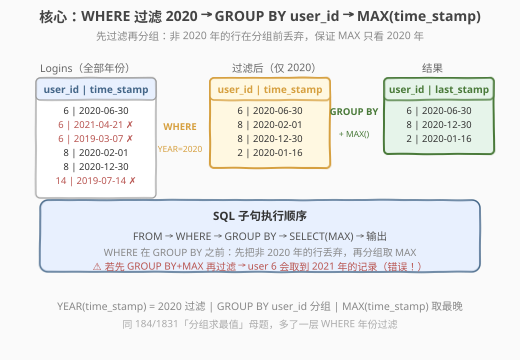
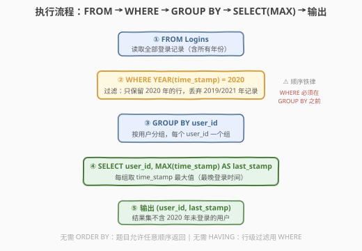
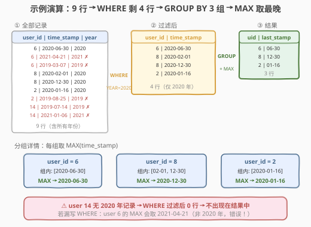

# LeetCode 2020年最后一次登录 题解

## 1. 题目概述

- **标题 / 题号**：2020年最后一次登录（#1890，easy）
- **链接**：https://leetcode.cn/problems/the-latest-login-in-2020/
- **难度**：简单
- **标签**：SQL、`GROUP BY`、`MAX()`、`WHERE`、`YEAR()` 函数、分组求最值

**题意**：给定 `Logins` 表（登录记录，含用户 ID 和登录时间），编写 SQL 查询获取**在 2020 年登录过的所有用户**的 2020 年内**最后一次登录时间**。结果集**不包含** 2020 年没有登录过的用户，可以按任意顺序排列。

**表结构**：

```text
Table: Logins
+----------------+----------+
| Column Name    | Type     |
+----------------+----------+
| user_id        | int      |  ← 用户 ID
| time_stamp     | datetime |  ← 登录时间
+----------------+----------+
(user_id, time_stamp) 是主键（组合唯一）
```

> 💡 **关键约束**：`(user_id, time_stamp)` 是组合主键——同一用户可以有**多条**登录记录，分布在不同年份。题目要求的是「2020 年内的最后一次」，而非「全部记录中的最后一次」——这意味着必须**先过滤到 2020 年，再分组取 MAX**，顺序不能反。

**示例 1**：

```text
输入：
Logins 表:
+---------+---------------------+
| user_id | time_stamp          |
+---------+---------------------+
| 6       | 2020-06-30 15:06:07 |
| 6       | 2021-04-21 14:06:06 |
| 6       | 2019-03-07 00:18:15 |
| 8       | 2020-02-01 05:10:53 |
| 8       | 2020-12-30 00:46:50 |
| 2       | 2020-01-16 02:49:50 |
| 2       | 2019-08-25 07:59:08 |
| 14      | 2019-07-14 09:00:00 |
| 14      | 2021-01-06 11:59:59 |
+---------+---------------------+

输出：
+---------+---------------------+
| user_id | last_stamp          |
+---------+---------------------+
| 6       | 2020-06-30 15:06:07 |
| 8       | 2020-12-30 00:46:50 |
| 2       | 2020-01-16 02:49:50 |
+---------+---------------------+
```

**解释**：

| user_id | 2020 年登录记录 | 2020 年内最后一次 | 是否输出 |
|---------|----------------|-------------------|---------|
| 6 | 仅 `2020-06-30`（2021 和 2019 被过滤） | `2020-06-30 15:06:07` | ✓ |
| 8 | `2020-02-01` 和 `2020-12-30` 两条 | `2020-12-30 00:46:50`（更晚） | ✓ |
| 2 | 仅 `2020-01-16`（2019 被过滤） | `2020-01-16 02:49:50` | ✓ |
| 14 | 无 2020 年记录 | — | ✗ 不输出 |

**约束**：

- `(user_id, time_stamp)` 为 `Logins` 表主键，行唯一无重复。
- 结果只输出 `user_id` 和 `last_stamp` 两列，可按任意顺序排列。
- 2020 年没有登录记录的用户**不出现在结果中**。

> 💡 **关键结构**：本题是 SQL **"分组求最值"入门招牌题**——核心套路与 184（部门工资最高）、1831（每天最大交易）同源：「先过滤 + 再分组 + 取 MAX」。考点在三件事：① 用 `WHERE YEAR(time_stamp) = 2020` 过滤到目标年份；② 用 `GROUP BY user_id` 按用户分组；③ 用 `MAX(time_stamp)` 取每组最新时间。难度不在算法，在 SQL 三件套的正确拼接。

## 2. 解题思路

### 2.1 暴力思路：逐用户遍历全部记录

最直觉的过程式思维是：遍历 `Logins` 每一行，对每个 `user_id` 收集其所有 2020 年的登录时间，再取其中最大的。

```text
result = {}
for row in Logins:
    if row.time_stamp.year == 2020:
        uid = row.user_id
        if uid not in result or row.time_stamp > result[uid]:
            result[uid] = row.time_stamp
return [(uid, ts) for uid, ts in result.items()]
```

逻辑完全正确，但这是**命令式思维**——SQL 不该用循环写。SQL 的声明式范式里，「按用户分组取最大」直接对应 `GROUP BY user_id` + `MAX(time_stamp)`，一行就能表达。而「只看 2020 年的记录」对应 `WHERE` 子句——在分组前过滤掉非 2020 年的行。

> ⚠️ **症结**：① 过程式思维把分组聚合写成循环，啰嗦且非 SQL 惯用；② **过滤顺序易错**——若先 `GROUP BY` 取 `MAX(time_stamp)` 再过滤年份，会取到非 2020 年的最后一次登录（如 user 6 会取到 `2021-04-21`），完全错误。`WHERE` 必须在 `GROUP BY` **之前**执行，先把数据缩小到 2020 年范围。

### 2.2 核心观察：WHERE 过滤 + GROUP BY 分组 + MAX 聚合



把「**2020 年内每个用户的最后一次登录**」拆成三个声明式步骤：

1. **`WHERE YEAR(time_stamp) = 2020`**：先过滤，只保留 2020 年的登录记录——2019、2021 年的行直接丢弃。这保证了后续聚合只看 2020 年数据。
2. **`GROUP BY user_id`**：把过滤后的行按用户分组——每个 `user_id` 一个组。
3. **`MAX(time_stamp) AS last_stamp`**：对每组取 `time_stamp` 的最大值——即该用户 2020 年内最晚的登录时间。

$$\text{last\_stamp}(u) = \max\{\,\text{time\_stamp} \mid \text{user\_id} = u \,\land\, \text{YEAR}(\text{time\_stamp}) = 2020\,\}$$

> ⚠️ **SQL 子句执行顺序**：`FROM` → `WHERE` → `GROUP BY` → `SELECT`（含 `MAX` 聚合）→ `ORDER BY`。`WHERE` 在 `GROUP BY` **之前**执行，先把非 2020 年的行过滤掉，再对剩下的行分组取 MAX——这正是本题正确性的保证。若把年份过滤放到 `HAVING`（`GROUP BY` 之后），语义就变了——变成「过滤掉 MAX 值不在 2020 年的组」，完全错误。

> 💡 **直觉理解**：把整个查询想成一个「漏斗 + 分桶」——先过 `WHERE` 漏斗，只放 2020 年的登录记录通过；再按 `user_id` 分桶，每个桶里放同一用户的所有 2020 年登录；最后每桶取最晚的一条。`WHERE` 是漏斗口，`GROUP BY` 是分桶器，`MAX` 是每桶的取最大器。

### 2.3 算法流程图



**逻辑执行步骤**：

| 步骤 | 子句 | 作用 |
|------|------|------|
| ① | `FROM Logins` | 读取全部登录记录（含所有年份） |
| ② | `WHERE YEAR(time_stamp) = 2020` | 过滤，只保留 2020 年的行 |
| ③ | `GROUP BY user_id` | 按用户 ID 分组，每个用户一个组 |
| ④ | `SELECT user_id, MAX(time_stamp) AS last_stamp` | 每组取最晚登录时间 |
| ⑤ | 输出 | 返回 `(user_id, last_stamp)` 结果集 |

> 💡 **SQL 子句执行顺序回顾**：`FROM` → `WHERE` → `GROUP BY` → `HAVING` → `SELECT` → `ORDER BY` → `LIMIT`。本题只用到 `FROM` → `WHERE` → `GROUP BY` → `SELECT` 四步。`WHERE` 在分组前过滤行级数据，`GROUP BY` 把行分桶，`SELECT` 里的 `MAX` 对每桶做聚合。理解这个顺序是写对所有「过滤 + 分组 + 聚合」SQL 的基础。

### 2.4 示例演算

以示例数据为例，观察三步执行过程：



**步骤 ① — FROM（全部 9 行）**：

| # | user_id | time_stamp | 年份 |
|---|---------|------------|------|
| 1 | 6 | 2020-06-30 15:06:07 | 2020 ✓ |
| 2 | 6 | 2021-04-21 14:06:06 | 2021 ✗ |
| 3 | 6 | 2019-03-07 00:18:15 | 2019 ✗ |
| 4 | 8 | 2020-02-01 05:10:53 | 2020 ✓ |
| 5 | 8 | 2020-12-30 00:46:50 | 2020 ✓ |
| 6 | 2 | 2020-01-16 02:49:50 | 2020 ✓ |
| 7 | 2 | 2019-08-25 07:59:08 | 2019 ✗ |
| 8 | 14 | 2019-07-14 09:00:00 | 2019 ✗ |
| 9 | 14 | 2021-01-06 11:59:59 | 2021 ✗ |

**步骤 ② — WHERE 过滤后（剩 4 行）**：

| user_id | time_stamp |
|---------|------------|
| 6 | 2020-06-30 15:06:07 |
| 8 | 2020-02-01 05:10:53 |
| 8 | 2020-12-30 00:46:50 |
| 2 | 2020-01-16 02:49:50 |

> user 14 的两条记录（2019 和 2021）均被过滤，**不参与后续分组**——这就是「2020 年没登录的用户不出现在结果中」的实现原理。

**步骤 ③④ — GROUP BY + MAX（3 组）**：

| user_id | 组内 time_stamp | MAX → last_stamp |
|---------|----------------|------------------|
| 6 | `[2020-06-30 15:06:07]` | `2020-06-30 15:06:07` |
| 8 | `[2020-02-01 05:10:53, 2020-12-30 00:46:50]` | `2020-12-30 00:46:50` |
| 2 | `[2020-01-16 02:49:50]` | `2020-01-16 02:49:50` |

**输出**：

| user_id | last_stamp |
|---------|------------|
| 6 | 2020-06-30 15:06:07 |
| 8 | 2020-12-30 00:46:50 |
| 2 | 2020-01-16 02:49:50 |

与示例输出一致。

> 💡 **易错点对照**：user 6 有 3 条登录记录（2019、2020、2021），若忘记 `WHERE` 过滤直接 `GROUP BY + MAX`，会取到 `2021-04-21 14:06:06`——这是「全部记录的最后一次」而非「2020 年内的最后一次」，完全错误。`WHERE` 过滤是本题正确性的核心。

## 3. 参考代码

### SQL（解法 A：YEAR() 函数过滤，推荐）

```sql
SELECT user_id, MAX(time_stamp) AS last_stamp
FROM Logins
WHERE YEAR(time_stamp) = 2020
GROUP BY user_id;
```

> 💡 **写法要点**：
> - `WHERE YEAR(time_stamp) = 2020`：`YEAR()` 是 MySQL 日期函数，从 `datetime` 中提取年份。先过滤再分组，保证只看 2020 年数据。
> - `GROUP BY user_id`：按用户分组，每个 `user_id` 一个组。
> - `MAX(time_stamp) AS last_stamp`：每组取 `time_stamp` 最大值（最晚时间），列别名 `last_stamp`。
> - 不需要 `ORDER BY`——题目允许任意顺序返回。
> - ✓ **最自然**：一条查询把「过滤 + 分组 + 取最值」三步一气呵成，可读性最佳，面试首选。

### SQL（解法 B：日期范围过滤，跨库通用）

```sql
SELECT user_id, MAX(time_stamp) AS last_stamp
FROM Logins
WHERE time_stamp >= '2020-01-01' AND time_stamp < '2021-01-01'
GROUP BY user_id;
```

> 💡 **写法要点**：用日期范围比较代替 `YEAR()` 函数——`time_stamp >= '2020-01-01' AND time_stamp < '2021-01-01'` 选取 2020 全年。两种写法语义完全等价，但日期范围比较有两大优势：① **跨数据库通用**——`YEAR()` 是 MySQL 函数，PostgreSQL / SQL Server / Oracle 语法不同（`EXTRACT(YEAR FROM ...)` / `DATEPART(YEAR, ...)`），而 `>=` / `<` 比较是 SQL 标准全平台支持；② **可走索引**——`time_stamp` 上若有索引，范围比较可利用 B+Tree 范围扫描（index range scan），而 `YEAR(time_stamp)` 是函数表达式，默认不走索引（除非建函数索引）。**面试中若被追问性能或可移植性，答此日期范围版**。

### SQL（解法 C：窗口函数 RANK()）

```sql
SELECT user_id, last_stamp
FROM (
    SELECT user_id,
           time_stamp AS last_stamp,
           RANK() OVER (PARTITION BY user_id ORDER BY time_stamp DESC) AS rk
    FROM Logins
    WHERE YEAR(time_stamp) = 2020
) t
WHERE rk = 1;
```

> 💡 **写法要点**：
> - 子查询先用 `WHERE YEAR(time_stamp) = 2020` 过滤，再给每行打组内时间降序排名——`RANK() OVER (PARTITION BY user_id ORDER BY time_stamp DESC)`。
> - `PARTITION BY user_id` 对应 `GROUP BY user_id`；`ORDER BY time_stamp DESC` 使最晚时间的排名为 1。
> - 外层 `WHERE rk = 1` 取每组第一名——即最晚登录时间。
> - ⚠️ 本题只需 `user_id` 和 `MAX(time_stamp)` 两列，解法 A 的 `GROUP BY + MAX` 更简洁。窗口函数的优势在于**需要返回整行多列**时（如还要取该次登录的 IP、设备等），`GROUP BY` 拿不到非聚合列，而窗口函数可以。本题作为扩展了解即可。
> - 需 MySQL 8.0+ / PostgreSQL / SQL Server 等支持窗口函数的版本。

### Python（pandas）

```python
import pandas as pd

def latest_login(logins: pd.DataFrame) -> pd.DataFrame:
    logins_2020 = logins[logins['time_stamp'].dt.year == 2020]
    result = logins_2020.groupby('user_id')['time_stamp'].max().reset_index()
    result.columns = ['user_id', 'last_stamp']
    return result
```

> 💡 **pandas 对照**：
> - `logins['time_stamp'].dt.year == 2020` 对应 SQL 的 `WHERE YEAR(time_stamp) = 2020`——先过滤到 2020 年。
> - `groupby('user_id')['time_stamp'].max()` 对应 SQL 的 `GROUP BY user_id` + `MAX(time_stamp)`——按用户分组取最晚时间。
> - `reset_index()` 把 `groupby` 的组键（`user_id`）从索引变回普通列，对应 SQL `SELECT` 输出 `user_id` 列。
> - `result.columns = ['user_id', 'last_stamp']` 重命名列，对应 SQL 的 `AS last_stamp` 别名。

## 4. 复杂度分析

| 维度 | 复杂度 | 说明 |
|------|--------|------|
| **时间** | $O(n)$ | 对 `Logins` 全表扫描一次过滤 2020 年，每行做 `YEAR()` 提取 $O(1)$；`GROUP BY user_id` 哈希聚合 $O(n)$；每组 `MAX` 比较累计 $O(n)$。总体 $O(n)$，$n$ = Logins 行数 |
| **空间** | $O(n)$ | 过滤后的中间结果集大小 $\le n$；哈希分组表大小 $O(m)$，$m$ = 不同 user_id 数 |
| **结果行数** | $= m_{2020}$ | $m_{2020}$ = 在 2020 年有登录记录的不同用户数 |

> ⚠️ SQL 复杂度取决于**执行计划与索引**。若 `time_stamp` 上有索引，解法 B 的日期范围比较可走索引范围扫描，只需读 2020 年的行而非全表；解法 A 的 `YEAR()` 函数默认不走索引（MySQL 需建函数索引或生成列）。数据量大时解法 B 性能更优。面试中说明「全表扫描 $O(n)$ + 哈希聚合 $O(n)$，有索引时可走范围扫描」即可。

## 5. 扩展：YEAR() vs 日期范围 vs 窗口函数

### 5.1 年份过滤的三种写法对比

| 写法 | 语法 | 可移植性 | 索引利用 | 推荐 |
|------|------|---------|---------|------|
| `YEAR(time_stamp) = 2020` | MySQL 函数 | ✗ MySQL 专有 | ✗ 默认不走索引 | 简单场景首选 |
| `time_stamp >= '2020-01-01' AND time_stamp < '2021-01-01'` | 范围比较 | ✓ SQL 标准 | ✓ 走索引范围扫描 | 大数据量 / 跨库首选 |
| `EXTRACT(YEAR FROM time_stamp) = 2020` | SQL 标准 | ✓ 全平台 | ✗ 不走索引 | PostgreSQL / Oracle |

> 💡 **为什么日期范围能走索引而 YEAR() 不能？** B+Tree 索引按 `time_stamp` 的原始值排序。`WHERE time_stamp >= '2020-01-01' AND time_stamp < '2021-01-01'` 是对原始列的范围条件，优化器可直接定位到 2020 年的索引区间扫描。而 `WHERE YEAR(time_stamp) = 2020` 对列套了函数，索引中存的是原始 `datetime` 值而非年份——优化器无法从 B+Tree 直接定位「年份=2020」的区间，只能全表扫描逐行算 `YEAR()`。MySQL 5.7+ 支持函数索引（`CREATE INDEX idx_year ON Logins ((YEAR(time_stamp)))`），但需显式建。

### 5.2 "分组求最值"母题的泛化

本题与 184（部门工资最高）、1831（每天最大交易）共享同一套「过滤 + 分组 + 取最值」模板，差异仅在分组键和过滤条件：

| 题目 | 过滤条件 | 分组键 | 最值列 |
|------|---------|--------|--------|
| **1890 2020年最后一次登录** | `YEAR(time_stamp) = 2020` | `user_id` | `time_stamp` |
| 184 部门工资最高 | 无 | `departmentId` | `salary` |
| 1831 每天最大交易 | 无 | `DATE(day)` | `amount` |
| 1549 每件商品最新订单 | 无 | `product_id` | `order_date` |

```sql
-- 模板：过滤 + 分组 + 取 MAX（只需聚合列时）
SELECT group_key, MAX(val) AS max_val
FROM T
WHERE <过滤条件>
GROUP BY group_key;
```

> 💡 1890 相比 184 和 1831 多了一层 `WHERE` 年份过滤——这是因为用户的登录记录跨多年，而题目只要 2020 年的。184 和 1831 不需要过滤是因为所有行都在目标范围内。**判断要不要 `WHERE` 的关键**：题目求的是「全量数据的每组最值」还是「满足某条件的子集的每组最值」——后者必须 `WHERE` 先过滤。

### 5.3 GROUP BY + MAX vs 窗口函数的选择

| 维度 | `GROUP BY + MAX` | 窗口函数 `RANK()` |
|------|-------------------|------------------|
| **适用场景** | 只需分组键 + 聚合值 | 需返回整行多列（含非聚合列） |
| **输出列** | 只能输出分组键 + 聚合函数 | 可输出任意列 |
| **并列处理** | `MAX` 自动取一个值（datetime 无并列） | `RANK` 并列同秩，可取多个 |
| **写法复杂度** | 简洁（3 行） | 需子查询包裹（5-6 行） |
| **本题推荐** | ✓ **首选** | △ 仅扩展 |

> 💡 本题只需 `user_id` 和 `MAX(time_stamp)` 两列，`GROUP BY + MAX` 是最简洁的正解。窗口函数在「需要取最值所在行的其他列」时才必要——例如若题目还要求输出该次登录的 IP 地址，`GROUP BY` 拿不到非聚合列，就得用窗口函数 `RANK() = 1` 取整行。

## 6. 面试要点

1. **`WHERE` 和 `GROUP BY` 的执行顺序？为什么不能反？**

   - SQL 子句执行顺序是 `FROM` → `WHERE` → `GROUP BY` → `SELECT` → `ORDER BY`。`WHERE` 在 `GROUP BY` **之前**执行，先过滤行级数据再分组。本题必须先用 `WHERE YEAR(time_stamp) = 2020` 过滤到 2020 年，再 `GROUP BY user_id` 取 `MAX`——若反过来先 `GROUP BY + MAX` 再过滤，会取到非 2020 年的最后一次登录（如 user 6 会取到 2021 年），完全错误。**「先过滤再分组」是所有「子集分组求最值」SQL 的铁律**。

2. **`YEAR(time_stamp) = 2020` 和日期范围比较哪个更好？**

   - 语义等价，但日期范围比较 `time_stamp >= '2020-01-01' AND time_stamp < '2021-01-01'` 有两大优势：① **跨数据库通用**——`YEAR()` 是 MySQL 专有函数，PostgreSQL 用 `EXTRACT(YEAR FROM ...)`，SQL Server 用 `DATEPART(YEAR, ...)`，而 `>=` / `<` 是 SQL 标准；② **可走索引**——`time_stamp` 上有索引时，范围比较可走 B+Tree 范围扫描，`YEAR()` 函数默认不走索引。**面试答：「简单场景用 `YEAR()` 可读性好，大数据量或需跨库时用日期范围比较走索引」**。

3. **为什么不需要 `HAVING`？**

   - `HAVING` 是对 `GROUP BY` 后的**组级聚合结果**做过滤（如 `HAVING MAX(time_stamp) > '2020-06-01'`）。本题的过滤条件是「行级」的（`time_stamp` 的年份是否 2020），发生在分组**之前**，必须用 `WHERE`。若误用 `HAVING YEAR(MAX(time_stamp)) = 2020`，语义变成「过滤掉 MAX 不在 2020 年的组」——会把 user 6 的组（MAX 是 2021 年）过滤掉，但 user 6 在 2020 年有登录，应该出现在结果里。**「行级过滤用 WHERE，组级过滤用 HAVING」**是 SQL 的基本法则。

4. **如果还要输出该次登录的 IP 地址，怎么改？**

   - `GROUP BY + MAX` 只能输出分组键和聚合函数，拿不到 `MAX(time_stamp)` 对应行的 IP 地址（非聚合列）。两种改法：① **窗口函数**——`RANK() OVER (PARTITION BY user_id ORDER BY time_stamp DESC)` 给每行排名，外层 `WHERE rk = 1` 取整行（含 IP）；② **自连接**——先 `GROUP BY` 算出每组的 `(user_id, MAX(time_stamp))`，再 `JOIN` 原表取对应行的 IP。窗口函数写法更优雅，自连接兼容老版本 MySQL。

5. **`(user_id, time_stamp)` 是组合主键意味着什么？**

   - 组合主键意味着 `(user_id, time_stamp)` 二元组唯一，但 `user_id` 单独不唯一——同一用户可以有多条不同时间的登录记录。这正是本题需要 `GROUP BY user_id` 的原因：要把同一用户的多条记录归为一组取 MAX。若 `user_id` 本身唯一（每个用户只有一条记录），就不需要 `GROUP BY` 了——直接 `SELECT` 即可。**理解主键结构是判断要不要 `GROUP BY` 的第一步**。

> 💡 **一句话总结**：1890 是 SQL **"分组求最值入门招牌题"**——核心就一句 `SELECT user_id, MAX(time_stamp) FROM Logins WHERE YEAR(time_stamp) = 2020 GROUP BY user_id`。考点三件事：**① `WHERE` 先过滤 2020 年再分组（顺序不能反）；② `GROUP BY user_id` + `MAX(time_stamp)` 分组取最值；③ `YEAR()` 函数 vs 日期范围比较的可移植性与索引利用**。掌握这条骨架，所有「过滤 + 分组 + 取最值」类 SQL 题都能迁移。

## 同类练习题

| # | 题目 | 与本题的关联 |
|---|------|-------------|
| 184 | [部门工资最高的员工](https://leetcode.cn/problems/department-highest-salary/) | 1890 的母题——"分组求最值"招牌题，核心套路完全一致（`GROUP BY` + `MAX`），唯一差异是 184 分组键为现成列 `departmentId`，1890 需先用 `WHERE` 过滤年份 |
| 1831 | [每天的最大交易](https://leetcode.cn/problems/maximum-transaction-each-day/) | 同属"分组求最值"家族——1831 用 `DATE(day)` 从 datetime 提取分组键，1890 用 `YEAR(time_stamp)` 做 WHERE 过滤，对比 datetime 函数在分组键与过滤条件中的不同用法 |
| 1549 | [每件商品的最新订单](https://leetcode.cn/problems/latest-orders-per-customer/) | 同属"取每组最新时间"——1549 按 `product_id` 分组取 `order_date` 最大，1890 按 `user_id` 分组取 `time_stamp` 最大，共享 `GROUP BY + MAX` 模板 |
| 1174 | [即时食物配送 II](https://leetcode.cn/problems/immediate-food-delivery-ii/) | 同需 `WHERE` 过滤 + `GROUP BY` 的变体——先筛选首次订单再分组计算即时配送比例，对照 1890 理解「先过滤再分组」在不同场景的迁移 |
| 511 | [游戏玩法分析 I](https://leetcode.cn/problems/game-play-analysis-i/) | 最简"分组求最值"——按 `player_id` 分组取首次登录日期 `MIN(event_date)`，与 1890 取 `MAX` 镜像对照，一最小一最大共享同一模板 |
