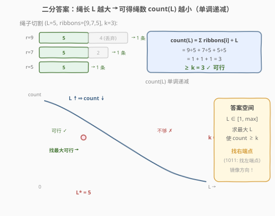
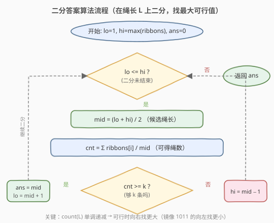

# 割绳子

- **题目名称**：割绳子
- **链接**：[1891. 割绳子](https://leetcode.cn/problems/cutting-ribbons/)（Plus 会员专享题）
- **难度**：中等
- **标签**：数组、二分查找

## 1. 题目概述

给定一个整数数组 `ribbons` 和一个整数 $k$，数组每项 `ribbons[i]` 表示第 $i$ 条绳子的长度。对于每条绳子，你可以将其切割成一系列长度为**正整数**的部分，或者选择不切割。

例如，长度为 4 的绳子可以：保持 4 不变；切成 3+1；切成 2+2；切成 2+1+1；切成 1+1+1+1。

你的任务是找出**最大** $x$ 值，要求满足可以裁切出**至少 $k$ 条**长度均为 $x$ 的绳子。剩余部分可以丢弃。如果不可能切割出 $k$ 条相同长度的绳子，返回 0。

**示例 1**：

```text
输入：ribbons = [9,7,5], k = 3
输出：5
解释：
- 把 9 切成 5 + 4 → 得 1 条长度 5
- 把 7 切成 5 + 2 → 得 1 条长度 5
- 5 不切割       → 得 1 条长度 5
共 3 条长度为 5 的绳子。
```

**示例 2**：

```text
输入：ribbons = [7,5,9], k = 4
输出：4
解释：
- 把 7 切成 4 + 3       → 得 1 条长度 4
- 把 5 切成 4 + 1       → 得 1 条长度 4
- 把 9 切成 4 + 4 + 1   → 得 2 条长度 4
共 4 条长度为 4 的绳子。
```

**示例 3**：

```text
输入：ribbons = [5,7,9], k = 22
输出：0
解释：绳子总长 5+7+9 = 21 < 22，即使全切成 1 也凑不够 22 条。
```

**约束条件**：

- $1 \le \text{ribbons.length} \le 10^5$
- $1 \le \text{ribbons}[i] \le 10^5$
- $1 \le k \le 10^9$

> 💡 **本质**：每条绳子 `ribbons[i]` 能切出 $\lfloor \text{ribbons}[i] / x \rfloor$ 条长度为 $x$ 的绳子。问题等价于：**求最大 $x$，使 $\sum \lfloor \text{ribbons}[i] / x \rfloor \ge k$**。这是典型的「二分答案」——二分的不是数组下标，而是答案 $x$ 本身。

---

## 2. 解题思路

### 2.1 暴力思路

答案 $x$ 的取值范围是 $[1,\ \max(\text{ribbons})]$：

- 下界 1：最短的正整数长度。
- 上界 $\max(\text{ribbons})$：不可能切出比最长绳子还长的段。

从 $x = 1$ 到 $\max(\text{ribbons})$ 逐个尝试，对每个 $x$ 计算 $\text{count}(x) = \sum \lfloor \text{ribbons}[i] / x \rfloor$，取最大的满足 $\text{count}(x) \ge k$ 的 $x$。验证单个 $x$ 是 $O(n)$，整体 $O(n \cdot \max)$，$\max$ 可达 $10^5$、$n$ 可达 $10^5$，总运算量 $10^{10}$，必然超时。

### 2.2 核心观察：二分答案（镜像方向）



关键直觉是：**可得绳数 $\text{count}(x)$ 关于绳长 $x$ 单调递减**。

- $x$ 越大，每条绳子能切出的段数越少，总条数越少。
- $x = 1$ 时 $\text{count} = \sum \text{ribbons}[i]$（最多）；$x = \max$ 时 $\text{count}$ 最少。

于是存在一个**分界点** $x^*$：

```text
x <= x* → count(x) >= k   (够 k 条，可行)
x >  x* → count(x) <  k   (不够 k 条，不可行)
```

这正是二分查找所需的**二段性**。把「求最大可行 $x$」转化为：在有序区间 $[1,\ \max]$ 上二分，每次 $O(n)$ 验证 `mid` 是否可行，可行则去右半找更大的，不可行则去左半缩小。

> ⚠️ **与 [1011. 在 D 天内送达包裹的能力](../1001-1100/1011_在D天内送达包裹的能力.md) / [410. 分割数组的最大值](../0401-0500/410_分割数组的最大值.md) 的关键区别——镜像方向**：
>
> | 维度 | 1011 / 410 | 本题 1891 |
> |------|-----------|-----------|
> | 求什么 | **最小**可行值（最小运力 / 最小上限） | **最大**可行值（最大绳长） |
> | check 单调性 | 递增（参数 $\uparrow$ → 越来越可行） | 递减（参数 $\uparrow$ → 越来越不可行） |
> | 二分目标 | 找**左端点**（首个 true） | 找**右端点**（末个 true） |
> | 可行时 | `hi = mid − 1`（向左找更小） | `lo = mid + 1`（向右找更大） |
> | 不可行时 | `lo = mid + 1`（向右找） | `hi = mid − 1`（向左找） |
>
> 两者的 `check()` 都是 $O(n)$ 线性扫描，骨架完全一致，**唯一区别是可行时的收缩方向翻转**。掌握这个「镜像」关系，就能秒杀「求最大/最小可行值」两整类二分答案题。

> 💡 **识别信号**：题目求「最大的满足某单调条件的值」，且能 $O(n)$ 验证候选值是否合法 → 想「二分答案」。若 check 单调递减则找右端点（最大可行），若单调递增则找左端点（最小可行）。

### 2.3 算法流程图



注意判定为「可行」时**先记录 `ans = mid` 再收缩左界**（`lo = mid + 1`），保证最终保留的是「最大的可行值」。这与 1011 的「可行时收缩右界」恰好相反。

### 2.4 示例演算

![示例演算：ribbons = [7,5,9], k = 4](../images/1891_example_walkthrough.svg)

以 `ribbons = [7,5,9]`、$k = 4$ 为例，$\max = 9$，答案区间 $[1, 9]$：

- **第 1 轮** $[1,9]$，`mid=5`，$\text{cnt} = 7÷5 + 5÷5 + 9÷5 = 1+1+1 = 3 < 4$ ✗ → 不够，`hi=4`。
- **第 2 轮** $[1,4]$，`mid=2`，$\text{cnt} = 3+2+4 = 9 \ge 4$ ✓ → 可行，记 `ans=2`，`lo=3`。
- **第 3 轮** $[3,4]$，`mid=3`，$\text{cnt} = 2+1+3 = 6 \ge 4$ ✓ → 可行，记 `ans=3`，`lo=4`。
- **第 4 轮** $[4,4]$，`mid=4`，$\text{cnt} = 1+1+2 = 4 \ge 4$ ✓ → 可行，记 `ans=4`，`lo=5`。
- **第 5 轮** `lo=5 > hi=4`，循环结束，返回 `ans=4`。

验证 `mid=5` 时 cnt=3 < 4，故 4 确实是最大可行长度。

---

## 3. 参考代码

### C++

```cpp
class Solution {
  public:
    int maxLength(vector<int>& ribbons, int k) {
        int lo = 1, hi = *max_element(ribbons.begin(), ribbons.end());
        int ans = 0;
        while (lo <= hi) {
            int mid = lo + (hi - lo) / 2;
            long long cnt = 0;
            for (int r : ribbons) {
                cnt += r / mid;
                if (cnt >= k) break;   // 提前终止，兼顾防溢出
            }
            if (cnt >= k) {
                ans = mid;       // 可行，尝试更大长度
                lo = mid + 1;
            } else {
                hi = mid - 1;    // 不够 k 条，缩短长度
            }
        }
        return ans;
    }
};
```

### Python

```python
class Solution:
    def maxLength(self, ribbons: List[int], k: int) -> int:
        lo, hi = 1, max(ribbons)
        ans = 0
        while lo <= hi:
            mid = (lo + hi) // 2
            cnt = sum(r // mid for r in ribbons)
            if cnt >= k:
                ans = mid        # 可行，尝试更大长度
                lo = mid + 1
            else:
                hi = mid - 1     # 不够 k 条，缩短长度
        return ans
```

> ⚠️ **三个易错点**：
> 1. **`cnt` 用 `long long`（C++）**：$n \le 10^5$、$\text{ribbons}[i] \le 10^5$，当 `mid=1` 时 $\text{cnt} = \sum \text{ribbons}[i]$ 可达 $10^{10}$，溢出 `int`。用 `long long` 或提前 `break`（`cnt >= k` 即停）均可规避。Python 无此问题。
> 2. **下界取 1 而非 0**：`mid` 作为除数，必须 $\ge 1$，否则除零异常。`ans` 初始化为 0，自然处理了「全切成 1 仍不够 $k$ 条」的不可行情形（循环中从未更新 `ans`，返回 0）。
> 3. **可行时 `lo = mid + 1` 而非 `hi = mid - 1`**：本题求最大可行值，可行时要向**右**搜索更大的 $x$，与 1011 求最小可行值时向左搜索恰好相反。搞反方向会导致返回「最小可行值」而非「最大可行值」。

---

## 4. 复杂度分析

| 维度 | 复杂度 | 说明 |
|------|--------|------|
| 时间复杂度 | $O(n \log M)$ | $M = \max(\text{ribbons})$；二分 $O(\log M)$ 次，每次验证 $O(n)$ |
| 空间复杂度 | $O(1)$ | 仅用常数额外变量 |

> 💡 $M \le 10^5$，$\log M \approx 17$，$n \le 10^5$，总运算量约 $1.7 \times 10^6$，远低于时限。提前 `break` 进一步减少常数。

---

## 5. 扩展：两种二分写法对照

### 5.1 `lo <= hi` + `ans` 写法（本文采用，与 1011/410 一致）

```text
lo=1, hi=max, ans=0
while lo <= hi:
    mid = (lo+hi)/2
    if check(mid):  ans=mid; lo=mid+1   ← 可行向右
    else:           hi=mid-1            ← 不可行向左
return ans
```

优点：与 1011/410 风格统一，只需记住「可行时的收缩方向翻转」；`ans` 独立记录结果，逻辑清晰。

### 5.2 `left < right` + 上取整 mid 写法（参考解法）

```text
left=0, right=max
while left < right:
    mid = (left+right+1) >> 1           ← 上取整防死锁
    if check(mid):  left=mid            ← 可行，left 直接跳到 mid
    else:           right=mid-1
return left
```

优点：无需 `ans` 变量，`left` 本身即答案；`left=0` 初始化天然处理不可行情形（返回 0）。

> ⚠️ **为什么这里 `mid` 要上取整 `(left+right+1)>>1`？** 因为可行分支执行 `left=mid`（而非 `left=mid+1`），若 `left` 和 `right` 相邻（如 `left=4, right=5`），普通下取整 `mid=(4+5)/2=4=left`，`left` 不变 → 死循环。上取整 `mid=(4+5+1)/2=5=right`，保证 `left` 能推进。这是「找右端点」二分的标志性写法，与「找左端点」时用下取整 `mid=(left+right)/2` 配合 `right=mid` 的套路对称。

---

## 6. 面试要点

**Q1：为什么能二分？二段性体现在哪？**

> $\text{count}(x) = \sum \lfloor \text{ribbons}[i] / x \rfloor$ 随 $x$ 单调递减。存在分界点 $x^*$，使 $x \le x^*$ 时 count $\ge k$（可行）、$x > x^*$ 时 count $< k$（不可行）。这种「左可行 / 右不可行」的结构就是二段性，可用二分定位 $x^*$。

**Q2：上下界为什么是 1 和 max(ribbons)？**

> 下界 1：最小的正整数长度，且作为除数必须 $\ge 1$。上界 $\max(\text{ribbons})$：切出的段不可能比原绳还长，故 $x \le \max$。取更松的上界（如 $10^5$）只增加几次无效二分，不影响正确性。

**Q3：ans 初始化为 0 有什么用？**

> 当 $\sum \text{ribbons}[i] < k$ 时，即使 $x=1$（全部切成 1）也凑不够 $k$ 条，所有 `mid` 的 check 均失败，`ans` 从未被更新，最终返回 0——正是题目要求的「不可能时返回 0」。无需单独写 `if sum < k: return 0` 的特判。

**Q4：和 1011/410 的二分方向有什么区别？**

> 1011/410 的 check 单调递增（参数越大越可行），求最小可行值，可行时 `hi=mid−1` 向左搜索。本题的 check 单调递减（参数越大越不可行），求最大可行值，可行时 `lo=mid+1` 向右搜索。两者是镜像关系，check 函数和收缩方向都翻转。

**Q5：C++ 中 cnt 为什么可能溢出？如何规避？**

> $n \le 10^5$、$\text{ribbons}[i] \le 10^5$，`mid=1` 时 $\text{cnt} = \sum \text{ribbons}[i]$ 可达 $10^{10}$，超过 `int` 上限 $\approx 2.1 \times 10^9$。用 `long long` 累加，或在 `cnt >= k` 时提前 `break`（$k \le 10^9$ 不溢出 `int`）即可规避。

---

## 7. 同类练习题

- [875. 爱吃香蕉的珂珂](https://leetcode.cn/problems/koko-eating-bananas/)（[站内题解](../0801-0900/875_爱吃香蕉的珂珂.md)）：**镜像方向**，二分吃速求最小可行 $k$（找左端点），对照本题找右端点
- [1011. 在 D 天内送达包裹的能力](https://leetcode.cn/problems/capacity-to-ship-packages-within-d-days/)（[站内题解](../1001-1100/1011_在D天内送达包裹的能力.md)）：**镜像方向**，二分运力求最小可行 cap（找左端点），与本题构成镜像对
- [410. 分割数组的最大值](https://leetcode.cn/problems/split-array-largest-sum/)（[站内题解](../0401-0500/410_分割数组的最大值.md)）：**镜像方向**，二分上限求最小可行 limit（找左端点），同骨架异方向
- [719. 找出第 K 小的数对距离](https://leetcode.cn/problems/find-k-th-smallest-pair-distance/)（[站内题解](../0701-0800/719_找出第K小的数对距离.md)）：二分距离 + 双指针计数，另一种 `check` 形式的二分答案
- [1552. 两球之间的磁力](https://leetcode.cn/problems/magnetic-force-between-two-balls/)：**同方向**，二分间距求最大可行值（找右端点），与本题同构
