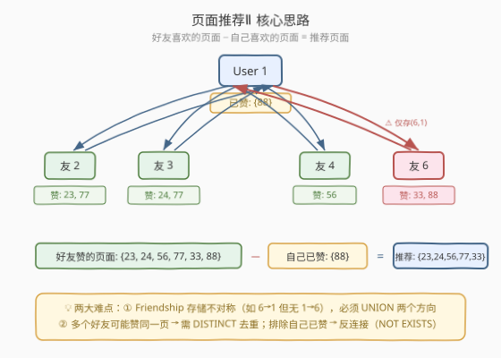
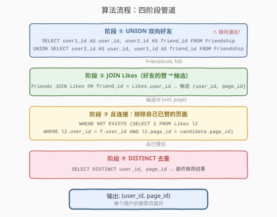
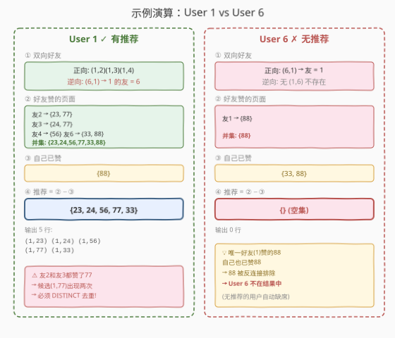

# 页面推荐Ⅱ

- **题目名称**：页面推荐Ⅱ
- **链接**：[1892. 页面推荐Ⅱ](https://leetcode.cn/problems/page-recommendations-ii/)
- **难度**：困难
- **标签**：数据库、SQL、`UNION`（双向好友展开）、`JOIN`、反连接（Anti-Join / `NOT EXISTS` / `LEFT JOIN ... IS NULL`）、`DISTINCT`、CTE、LeetCode 锁题

## 1. 题目概述

给定 `Friendship` 表（好友关系，**双向/对称**）和 `Likes` 表（用户点赞的页面），编写 SQL 查询：**为每一个用户**推荐其**好友**点赞过、但**自己未点赞**的页面。结果输出 `user_id` 和 `page_id` 两列，顺序不限。

> ⚠️ **本题是 Plus 会员锁题**。题目是 [1893. 页面推荐 I](https://leetcode.cn/problems/page-recommendations/) 的进阶版——I 版给定单个 `@user_id` 参数只推荐一人，Ⅱ 版**对所有用户同时推荐**，且需正确处理 `Friendship` 的**双向对称性**。

**表结构**：

```text
Table: Friendship
+----------+------+
| Column Name | Type |
+----------+------+
| user1_id  | int  |  ← 好友对的一方
| user2_id  | int  |  ← 好友对的另一方
+----------+------+
(user1_id, user2_id) 是主键
每行表示 user1_id 和 user2_id 互为好友（关系双向/对称）

Table: Likes
+----------+------+
| Column Name | Type |
+----------+------+
| user_id   | int  |  ← 点赞用户
| page_id   | int  |  ← 被赞页面
+----------+------+
(user_id, page_id) 是主键
```

> ⚠️ **核心陷阱：Friendship 存储不对称**。好友关系是双向的，但表里每对好友**只存一行**——例如 `(6, 1)` 表示 6 和 1 是好友，但表里**没有** `(1, 6)` 这行。查「用户 1 的好友」时，既要查 `user1_id = 1`（得到 2, 3, 4），也要查 `user2_id = 1`（得到 6）。**只查一个方向会漏掉好友 6**。

**示例 1**：

```text
输入：
Friendship 表:
+----------+----------+
| user1_id | user2_id |
+----------+----------+
| 1        | 2        |
| 1        | 3        |
| 1        | 4        |
| 2        | 3        |
| 2        | 4        |
| 2        | 5        |
| 6        | 1        |
+----------+----------+

Likes 表:
+---------+---------+
| user_id | page_id |
+---------+---------+
| 1       | 88      |
| 2       | 23      |
| 3       | 24      |
| 4       | 56      |
| 5       | 11      |
| 6       | 33      |
| 2       | 77      |
| 3       | 77      |
| 6       | 88      |
+---------+---------+

输出：
+---------+---------+
| user_id | page_id |
+---------+---------+
| 1       | 23      |
| 1       | 24      |
| 1       | 56      |
| 1       | 77      |
| 1       | 33      |
| 2       | 88      |
| 2       | 24      |
| 2       | 56      |
| 2       | 11      |
| 3       | 88      |
| 3       | 23      |
| 4       | 88      |
| 4       | 23      |
| 4       | 77      |
| 5       | 23      |
| 5       | 77      |
+---------+---------+
（顺序不限）
```

**解释**（以 User 1 和 User 6 为例）：

| 用户 | 双向好友 | 好友赞的页面 | 自己已赞 | 推荐（差集） |
|------|---------|-------------|---------|-------------|
| 1 | {2, 3, 4, 6} | {23, 24, 56, 77, 33, 88} | {88} | {23, 24, 56, 77, 33} |
| 6 | {1} | {88} | {33, 88} | {}（空，88 已自赞） |

User 6 虽有好友 1，但好友赞的唯一页面 88 自己也已赞，反连接后候选集为空，**User 6 不出现在结果中**。

**约束条件**：

- `Friendship` 的 `(user1_id, user2_id)` 为复合主键，无重复行。
- `Likes` 的 `(user_id, page_id)` 为复合主键，无重复行。
- 好友关系**双向/对称**：`(a, b)` 表示 a 和 b 互为好友。
- 结果顺序不限；无推荐的用户**不出现**在结果中。

> 💡 **关键结构**：本题是 SQL **"双向好友展开 + 反连接去已赞"招牌题**——三大难点环环相扣：① `Friendship` 存储不对称，必须 `UNION` 两个方向展开成对称好友表；② 对所有用户同时推荐（无 `@user_id` 参数），需用 `JOIN` 把「好友 → 好友的赞」连起来；③ 排除自己已赞的页面用**反连接**（`NOT EXISTS` / `LEFT JOIN ... IS NULL`），且多个好友可能赞同一页需 `DISTINCT` 去重。三步缺一不可，难度标"困难"正源于此。

---

## 2. 解题思路

### 2.1 暴力思路：逐用户扫描

最直觉的过程式思维是：对每个用户 `u`，先找出 `u` 的所有好友，再收集这些好友赞过的页面，最后去掉 `u` 自己赞过的页面。

```text
result = []
for u in all_users:
    friends = set()
    for (a, b) in Friendship:
        if a == u: friends.add(b)
        if b == u: friends.add(a)       # ← 两个方向都要查！

    friend_pages = set()
    for f in friends:
        for (uid, pid) in Likes:
            if uid == f: friend_pages.add(pid)

    own_pages = {pid for (uid, pid) in Likes if uid == u}

    for pid in (friend_pages - own_pages):
        result.append((u, pid))
return result
```

逻辑正确，但 **SQL 没有显式逐行循环**——需要换成「集合式」表达。「找好友」对应 `UNION` 展开双向关系，「好友的赞」对应 `JOIN`，「去掉自己已赞」对应**反连接**（`NOT EXISTS` / `LEFT JOIN ... IS NULL`）。三步都能用集合操作一次表达。

> ⚠️ **过程式思维的最大陷阱：只查一个方向的好友**。若在循环里只写 `if a == u: friends.add(b)` 而漏掉 `if b == u: friends.add(a)`，用户 1 就会漏掉好友 6（因为表里只存了 `(6, 1)` 而没有 `(1, 6)`）。SQL 中同理——只 `SELECT user1_id AS user_id, user2_id AS friend_id` 而不 `UNION` 反向，会系统性地漏掉所有「反向存储」的好友。

### 2.2 核心观察：双向展开 + 反连接（Anti-Join）



本题可拆解为**三个独立子问题**，每个对应一个 SQL 集合操作：

| 子问题 | SQL 手法 | 说明 |
|--------|----------|------|
| ① 把不对称的 `Friendship` 展开为对称好友表 | `UNION`（两个方向） | `user1→user2` ∪ `user2→user1` |
| ② 把「好友」与「好友的赞」连起来 | `JOIN ... ON friend_id = Likes.user_id` | 产出候选 `(user_id, page_id)` 对 |
| ③ 排除自己已赞的页面 | 反连接 `NOT EXISTS` / `LEFT JOIN ... IS NULL` | 候选 − `Likes` 自身 |

**子问题 ①：双向展开**

`Friendship` 每对好友只存一行，方向可能任意。展开为对称表：

```sql
WITH Friends AS (
    SELECT user1_id AS user_id, user2_id AS friend_id FROM Friendship
    UNION
    SELECT user2_id AS user_id, user1_id AS friend_id FROM Friendship
)
```

> 💡 **`UNION` vs `UNION ALL`**：这里用 `UNION`（去重）而非 `UNION ALL`。虽然主键保证同一 `(user1_id, user2_id)` 不会重复，但两个方向展开后可能出现 `(1,2)` 来自正向、`(1,2)` 来自反向（如果表里同时存了 `(1,2)` 和 `(2,1)`）——`UNION` 自动消去这种重复。若确定表里不会同时存正反两行，用 `UNION ALL` 也行（省一次排序去重），但 `UNION` 更安全。

**子问题 ②：好友的赞**

把好友表与 `Likes` 连接，得到「某用户的好友赞了某页面」的候选对：

```sql
Friends f
JOIN Likes l ON f.friend_id = l.user_id
```

此时每行是 `(f.user_id, l.page_id)`——即「user_id 的某好友赞了 page_id」。

**子问题 ③：反连接排除自己已赞**

候选对中有些 `page_id` 已经被 `user_id` 自己赞过，需要排除。这就是**反连接**（Anti-Join）——保留左表中在右表「找不到匹配」的行：

$$\text{推荐} = \text{候选} \setminus \text{Likes}$$

SQL 有三种等价写法：

| 写法 | 语法 | 特点 |
|------|------|------|
| `NOT EXISTS` | `WHERE NOT EXISTS (SELECT 1 FROM Likes l2 WHERE l2.user_id = f.user_id AND l2.page_id = l.page_id)` | 语义最清晰，优化器友好，**推荐** |
| `LEFT JOIN ... IS NULL` | `LEFT JOIN Likes l2 ON l2.user_id = f.user_id AND l2.page_id = l.page_id WHERE l2.user_id IS NULL` | 经典反连接写法 |
| `NOT IN` | `WHERE (f.user_id, l.page_id) NOT IN (SELECT user_id, page_id FROM Likes)` | 简洁但有 NULL 陷阱（见 5.2） |

> ⚠️ **为什么需要 `DISTINCT`？** 多个好友可能赞同一个页面——例如用户 1 的好友 2 和好友 3 都赞了页面 77。`JOIN` 后会产生两行 `(1, 77)`（分别来自友 2 和友 3）。推荐结果只需一个 `(1, 77)`，所以必须 `DISTINCT` 去重。

### 2.3 算法流程图



**逻辑执行步骤**：

| 步骤 | 操作 | 作用 | 行数变化 |
|------|------|------|---------|
| ① | `UNION` 两个方向 | 展开为对称好友表 `Friends(user_id, friend_id)` | ≤ 2×|Friendship| |
| ② | `JOIN Likes ON friend_id = user_id` | 好友的赞 → 候选 `(user_id, page_id)` 对 | 可能膨胀（多友同赞一页） |
| ③ | `NOT EXISTS`（反连接） | 排除自己已赞的页面 | ≤ 步骤②行数 |
| ④ | `DISTINCT` | 多好友同赞去重 | ≤ 步骤③行数 |

> 💡 **SQL 子句执行顺序**：`WITH`（CTE 物化 `Friends`）→ `FROM`（`Friends JOIN Likes`）→ `WHERE`（`NOT EXISTS` 子查询逐行判定）→ `SELECT`（`DISTINCT` 去重投影）。CTE `Friends` 在最前面一次性展开；主查询的 `JOIN` 在 `FROM` 阶段连接；`NOT EXISTS` 作为相关子查询在 `WHERE` 阶段逐行执行；`DISTINCT` 在 `SELECT` 阶段最后去重。

### 2.4 示例演算

以示例数据为例，对比 User 1（有推荐）和 User 6（无推荐）两个典型用户：



**User 1 的完整演算**：

**步骤 ①**：展开双向好友

| 方向 | Friendship 行 | 提取 (user_id, friend_id) |
|------|--------------|--------------------------|
| 正向 | (1,2), (1,3), (1,4) | (1,2), (1,3), (1,4) |
| 逆向 | (6,1) | (1,6) |

→ User 1 的好友 = {2, 3, 4, 6}

> ⚠️ **好友 6 来自逆向展开**：表里只有 `(6, 1)` 而没有 `(1, 6)`。只查 `user1_id = 1` 会漏掉好友 6——这是本题最易踩的坑。

**步骤 ②**：好友的赞

| 好友 | 赞的页面 |
|------|---------|
| 2 | 23, 77 |
| 3 | 24, 77 |
| 4 | 56 |
| 6 | 33, 88 |

→ 候选 `(1, page_id)` 对（含重复）：(1,23), (1,77), (1,24), (1,77), (1,56), (1,33), (1,88)

> 💡 **(1,77) 出现两次**——好友 2 和好友 3 都赞了 77，`JOIN` 后产生两行。这就是步骤 ④ 需要 `DISTINCT` 的原因。

**步骤 ③**：反连接排除自己已赞

User 1 已赞页面：{88}

| 候选 | 88 ∈ 自己已赞？ | 去留 |
|------|----------------|------|
| (1, 23) | ✗ | 保留 |
| (1, 77) | ✗ | 保留 |
| (1, 24) | ✗ | 保留 |
| (1, 77) | ✗ | 保留 |
| (1, 56) | ✗ | 保留 |
| (1, 33) | ✗ | 保留 |
| (1, 88) | ✓ | **排除** |

→ 过滤后剩 6 行（含一个重复的 (1,77)）

**步骤 ④**：`DISTINCT` 去重

| user_id | page_id |
|---------|---------|
| 1 | 23 |
| 1 | 24 |
| 1 | 56 |
| 1 | 77 |
| 1 | 33 |

→ User 1 最终推荐 5 个页面。

**User 6 的完整演算**（对比）：

- 步骤 ①：好友 = {1}（来自 `(6,1)` 正向）
- 步骤 ②：好友 1 赞了 {88} → 候选 (6, 88)
- 步骤 ③：User 6 已赞 {33, 88} → 88 被排除 → 候选集为空
- 步骤 ④：无行输出

> 💡 **无推荐的用户自动缺席**：User 6 在结果中不出现——不需要额外处理，反连接天然把候选集清空，`DISTINCT` 后零行输出。

---

## 3. 参考代码

### SQL（解法 A：CTE + JOIN + NOT EXISTS，推荐）

```sql
WITH Friends AS (
    SELECT user1_id AS user_id, user2_id AS friend_id FROM Friendship
    UNION
    SELECT user2_id AS user_id, user1_id AS friend_id FROM Friendship
)
SELECT DISTINCT f.user_id, l.page_id
FROM Friends f
JOIN Likes l ON f.friend_id = l.user_id
WHERE NOT EXISTS (
    SELECT 1 FROM Likes l2
    WHERE l2.user_id = f.user_id AND l2.page_id = l.page_id
);
```

> 💡 **写法要点**：
> - CTE `Friends` 用 `UNION` 把 `Friendship` 的两个方向展开为对称好友表——这是整个查询的基石。
> - `JOIN Likes ON f.friend_id = l.user_id`：把好友与好友的赞连起来，产出候选 `(user_id, page_id)` 对。
> - `NOT EXISTS`：相关子查询，对每行候选检查 `(f.user_id, l.page_id)` 是否已存在于 `Likes` 中——存在则排除。
> - `DISTINCT`：多个好友可能赞同一页，去重保证每对 `(user_id, page_id)` 只出现一次。
> - ✓ **最推荐**：语义清晰、兼容性好（MySQL 5.7+ 均支持 CTE 需 8.0+，`NOT EXISTS` 全版本支持），优化器通常将其转为半连接/反连接高效执行。

### SQL（解法 B：CTE + LEFT JOIN ... IS NULL）

```sql
WITH Friends AS (
    SELECT user1_id AS user_id, user2_id AS friend_id FROM Friendship
    UNION
    SELECT user2_id AS user_id, user1_id AS friend_id FROM Friendship
)
SELECT DISTINCT f.user_id, l.page_id
FROM Friends f
JOIN Likes l ON f.friend_id = l.user_id
LEFT JOIN Likes l2 ON l2.user_id = f.user_id AND l2.page_id = l.page_id
WHERE l2.user_id IS NULL;
```

> 💡 **写法要点**：
> - `LEFT JOIN Likes l2 ON l2.user_id = f.user_id AND l2.page_id = l.page_id`：尝试匹配自己已赞的记录。
> - `WHERE l2.user_id IS NULL`：只保留**未匹配到**的行（即自己没赞过的页面）——这是经典的**反连接**模式。
> - 与解法 A 的 `NOT EXISTS` 逻辑完全等价，多数优化器会生成相同的执行计划。
> - ⚠️ **注意 `IS NULL` 的列选择**：必须用 `l2.user_id IS NULL`（右表的非空列），不能用 `l2.page_id IS NULL`——虽然 `page_id` 也是 `Likes` 的主键部分不会为 NULL，但用 `user_id` 更明确。切勿用 `l2.* IS NULL` 这种不存在的语法。

### SQL（解法 C：子查询替代 CTE，兼容 MySQL 5.7）

```sql
SELECT DISTINCT f.user_id, l.page_id
FROM (
    SELECT user1_id AS user_id, user2_id AS friend_id FROM Friendship
    UNION
    SELECT user2_id AS user_id, user1_id AS friend_id FROM Friendship
) f
JOIN Likes l ON f.friend_id = l.user_id
WHERE NOT EXISTS (
    SELECT 1 FROM Likes l2
    WHERE l2.user_id = f.user_id AND l2.page_id = l.page_id
);
```

> 💡 **写法要点**：把 CTE `WITH Friends AS (...)` 换成内联子查询 `FROM (...) f`，逻辑完全等价。MySQL 5.7 及更早版本不支持 CTE（`WITH` 子句），需用此写法。MySQL 8.0+ 两者均可，CTE 可读性更好。

### Python（pandas）

```python
import pandas as pd

def page_recommendations(friendship: pd.DataFrame, likes: pd.DataFrame) -> pd.DataFrame:
    f1 = friendship[['user1_id', 'user2_id']].rename(
        columns={'user1_id': 'user_id', 'user2_id': 'friend_id'})
    f2 = friendship[['user2_id', 'user1_id']].rename(
        columns={'user2_id': 'user_id', 'user1_id': 'friend_id'})
    friends = pd.concat([f1, f2])

    friend_likes = friends.merge(
        likes.rename(columns={'user_id': 'friend_id'}),
        on='friend_id'
    )[['user_id', 'page_id']]

    merged = friend_likes.merge(
        likes,
        on=['user_id', 'page_id'],
        how='left',
        indicator=True
    )
    result = (merged[merged['_merge'] == 'left_only']
              [['user_id', 'page_id']]
              .drop_duplicates()
              .reset_index(drop=True))
    return result
```

> 💡 **pandas 对照**：
> - `pd.concat([f1, f2])` 对应 SQL 的 `UNION` 双向展开——把 `(user1→user2)` 和 `(user2→user1)` 两份 DataFrame 竖着拼。
> - `friends.merge(likes.rename(...), on='friend_id')` 对应 SQL 的 `JOIN Likes ON friend_id = user_id`——`rename` 是为了消除列名冲突（两表都有 `user_id`），把 `Likes.user_id` 改名为 `friend_id` 后按 `friend_id` 连接。
> - `merge(likes, on=['user_id','page_id'], how='left', indicator=True)` + `_merge == 'left_only'` 对应 SQL 的反连接 `NOT EXISTS` / `LEFT JOIN ... IS NULL`——`indicator=True` 给每行打 `_merge` 标签，`left_only` 即「左表有、右表无」。
> - `drop_duplicates()` 对应 SQL 的 `DISTINCT`。

---

## 4. 复杂度分析

| 维度 | 复杂度 | 说明 |
|------|--------|------|
| **时间** | $O(F + L \cdot k)$ | $F$ = |Friendship|，$L$ = |Likes|；`UNION` 展开 $O(F)$，`JOIN` 产出候选行数取决于好友-点赞分布（$k$ 为平均每好友的点赞数），反连接 `NOT EXISTS` 每行 $O(\log L)$（若有索引）或 $O(L)$（无索引） |
| **空间** | $O(F)$ | CTE `Friends` 物化临时表，大小 $\le 2 \times |Friendship|$ |
| **结果行数** | $\le \sum_u |{\text{好友赞}} - {\text{自赞}}|$ | 每个用户的推荐数不超过其好友赞的页面去重后减去自赞数 |

> ⚠️ SQL 复杂度取决于**执行计划与索引**：
> - `Friendship` 上若有 `(user1_id)` 和 `(user2_id)` 索引，`UNION` 两个方向均可走索引扫描。
> - `Likes` 上若有 `(user_id, page_id)` 主键索引，`NOT EXISTS` 子查询可走索引等值查找 $O(\log L)$ 而非全表扫描 $O(L)$。
> - `JOIN ON friend_id = l.user_id` 若 `Likes.user_id` 有索引，可走索引嵌套循环。
> - 面试中说明「`UNION` 展开 $O(F)$，`JOIN` + 反连接在有索引时 $O(\text{候选} \cdot \log L)$，`DISTINCT` 哈希去重 $O(\text{候选})$」即可。

---

## 5. 扩展：反连接三写法对比与 NULL 陷阱

### 5.1 三种反连接写法

排除「自己已赞的页面」有三种等价写法，语义相同但各有陷阱：

| 写法 | 示例 | 优点 | 缺点 |
|------|------|------|------|
| **`NOT EXISTS`** | `WHERE NOT EXISTS (SELECT 1 FROM Likes l2 WHERE l2.user_id = f.user_id AND l2.page_id = l.page_id)` | 语义最清晰；无 NULL 陷阱；优化器友好 | 子查询语法稍长 |
| **`LEFT JOIN ... IS NULL`** | `LEFT JOIN Likes l2 ON ... WHERE l2.user_id IS NULL` | 经典反连接模式；一条 `JOIN` 搞定 | 多一个 `JOIN` 可读性略降；`IS NULL` 列需选非空列 |
| **`NOT IN`** | `WHERE (f.user_id, l.page_id) NOT IN (SELECT user_id, page_id FROM Likes)` | 语法最简洁 | ⚠️ **NULL 陷阱**：若子查询结果含 NULL，整个 `NOT IN` 返回空集 |

> 💡 **推荐优先级**：`NOT EXISTS` > `LEFT JOIN ... IS NULL` > `NOT IN`。面试中首选 `NOT EXISTS`，被追问时展示 `LEFT JOIN ... IS NULL`，`NOT IN` 仅作对比提及。

### 5.2 `NOT IN` 的 NULL 陷阱

`NOT IN` 有一个经典陷阱：若子查询结果集包含 `NULL`，`NOT IN` 会**返回空集**而非预期的行：

```sql
-- 若 Likes 表某行 page_id 为 NULL（本题主键保证不会，但泛化场景需注意）
SELECT 1 WHERE 5 NOT IN (1, 2, NULL);  -- 返回空！因为 5 <> NULL 的结果是 NULL（未知），NOT NULL 仍是 NULL
```

本题 `Likes` 的 `(user_id, page_id)` 是主键，两列均非 NULL，所以 `NOT IN` 不会触发陷阱。但在**无主键约束**或**可空列**的场景下，`NOT IN` 是危险写法。**养成习惯：反连接一律用 `NOT EXISTS` 或 `LEFT JOIN ... IS NULL`**。

### 5.3 `UNION` vs `UNION ALL` 的选择

展开双向好友时，`UNION` 和 `UNION ALL` 的区别在于是否去重：

| 场景 | `UNION`（去重） | `UNION ALL`（不去重） |
|------|----------------|----------------------|
| 表里无正反重复（如无 `(1,2)` 和 `(2,1)` 同时存在） | 多一次排序去重，结果相同 | 省去重开销，更优 |
| 表里可能有正反重复 | 自动消重，安全 | 会产生重复好友行，后续 `JOIN` 膨胀 |

本题主键 `(user1_id, user2_id)` 保证同一方向无重复，但**不保证** `(1,2)` 和 `(2,1)` 不同时存在。用 `UNION` 更安全；若确定数据不会正反同时存，`UNION ALL` 更快。面试中说明「`UNION` 保险，`UNION ALL` 在确认无对称重复时更高效」即可。

---

## 6. 面试要点

1. **为什么必须 `UNION` 两个方向？只查一个方向会怎样？**

   - `Friendship` 表的好友关系是**双向/对称**的，但存储**不对称**——每对好友只存一行，方向任意。例如 `(6, 1)` 表示 6 和 1 是好友，但表里没有 `(1, 6)`。若只 `SELECT user1_id AS user_id, user2_id AS friend_id`，查「用户 1 的好友」只能从 `user1_id = 1` 得到 {2, 3, 4}，**漏掉好友 6**（6 只在 `user2_id` 侧出现）。必须 `UNION` 反向 `SELECT user2_id AS user_id, user1_id AS friend_id` 才能补全。这是本题最大的陷阱。

2. **`NOT EXISTS`、`LEFT JOIN ... IS NULL`、`NOT IN` 三种反连接有何区别？**

   - 三者语义等价（排除左表中在右表有匹配的行），但：① `NOT EXISTS` 语义最清晰、无 NULL 陷阱，**推荐首选**；② `LEFT JOIN ... IS NULL` 是经典写法，注意 `IS NULL` 要选右表的非空列；③ `NOT IN` 语法最简洁但有 **NULL 陷阱**——若子查询结果含 NULL，整个 `NOT IN` 返回空集。本题 `Likes` 主键保证非 NULL，三种写法均安全，但**工程中应避免 `NOT IN`**。

3. **为什么需要 `DISTINCT`？不加会怎样？**

   - 多个好友可能赞同一个页面——例如用户 1 的好友 2 和好友 3 都赞了页面 77。`Friends JOIN Likes` 后会产生两行 `(1, 77)`（分别来自友 2 和友 3 的连接）。推荐结果只需一个 `(1, 77)`，不加 `DISTINCT` 会输出重复行。`DISTINCT` 在 `SELECT` 阶段做哈希/排序去重，保证 `(user_id, page_id)` 唯一。

4. **本题与 1893（页面推荐 I）的区别是什么？**

   - 1893（页面推荐 I）给定单个 `@user_id` 参数，只为一个用户推荐——`WHERE user_id = @user_id` 一次定位，不需要 `UNION` 展开所有好友（虽然仍需双向查好友）。Ⅱ 版**对所有用户同时推荐**，没有参数——需要用 `JOIN` 把「每个用户 → 其好友 → 好友的赞」一次性连起来，查询结构更复杂。难度从 Medium 升到 Hard，核心增量在于「全用户范围 + 双向展开 + 反连接 + 去重」四件事同时处理。

5. **如果 `Friendship` 表很大（数百万好友对），如何优化？**

   - ① 在 `Friendship(user1_id)` 和 `Friendship(user2_id)` 上各建索引，使 `UNION` 两个方向均可走索引扫描；② 在 `Likes(user_id, page_id)` 上建复合主键索引，使 `NOT EXISTS` 子查询走索引等值查找 $O(\log L)$；③ `JOIN ON friend_id = l.user_id` 可走 `Likes.user_id` 索引的嵌套循环；④ 若数据量极大，可考虑物化视图预计算对称好友表，避免每次查询都 `UNION`。面试中说明「索引加速 `UNION` 和反连接是关键，全表扫描场景下 $O(F \cdot L)$ 可能很慢」即可。

> 💡 **一句话总结**：1892 是 SQL **"双向好友展开 + 反连接去已赞"困难招牌题**——核心管道「`UNION` 两个方向展开对称好友 → `JOIN Likes` 连好友的赞 → `NOT EXISTS` 排除自己已赞 → `DISTINCT` 多友同赞去重」。三大考点：**① `UNION` 双向（漏则缺友）、② 反连接三写法（`NOT EXISTS` 优先）、③ `DISTINCT` 去重**。掌握这条骨架，所有「关系对称 + 排除自身 + 全量推荐」类 SQL 题都能迁移。

---

## 7. 同类练习题

- [1893. 页面推荐 I](https://leetcode.cn/problems/page-recommendations/)：本题的单用户版——给定 `@user_id` 只推荐一人，对照理解「单用户参数 vs 全用户范围」的查询结构差异
- [602. 好友申请 II - 谁有最多的好友](https://leetcode.cn/problems/friend-requests-ii-who-has-the-most-friends/)：同样需要 `UNION` 两个方向展开 `Friendship`/`RequestAccepted` 对称好友表——双向关系展开的模板题
- [585. 2016年的投资](https://leetcode.cn/problems/investments-in-2016/)：`LEFT JOIN ... IS NULL` 反连接排除已投保用户——反连接经典练习
- [1811. 寻找面试候选人](https://leetcode.cn/problems/find-interview-candidates/)：[题解](../1801-1900/1811_寻找面试候选人.md)：`UNION ALL` 逆透视 + 自连接 + `GROUP BY HAVING`——同为「展开 + 连接 + 过滤」多阶段 SQL 管道，对照锁题风格
- [1841. 联赛信息统计](https://leetcode.cn/problems/league-statistics/)：[题解](../1801-1900/1841_联赛信息统计.md)：`UNION ALL` 逆透视宽表 + `GROUP BY` + `LEFT JOIN`——同为「展开 + 聚合 + 反向关联」多阶段管道，对照 `UNION ALL` vs `UNION` 的使用场景
