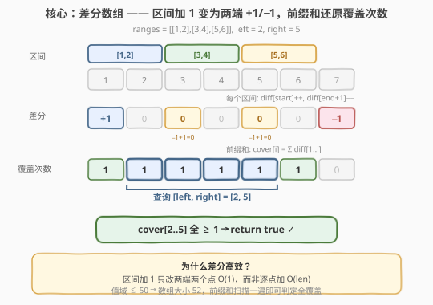
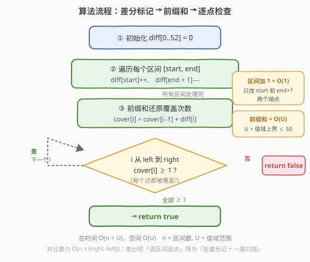
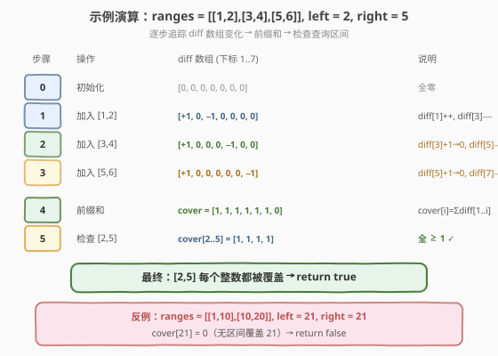

# 检查是否区域内所有整数都被覆盖

- **题目名称**：检查是否区域内所有整数都被覆盖
- **链接**：[1893. 检查是否区域内所有整数都被覆盖](https://leetcode.cn/problems/check-if-all-the-integers-in-a-range-are-covered/)
- **难度**：简单
- **标签**：数组、差分数组、前缀和

## 1. 题目概述

给定一个二维整数数组 `ranges`，其中每个 `ranges[i] = [starti, endi]` 表示一个**闭区间** $[\text{start}_i, \text{end}_i]$。再给定两个整数 `left` 和 `right`，判断闭区间 $[\text{left}, \text{right}]$ 内**每个整数**是否都被 `ranges` 中**至少一个**区间覆盖。

> 整数 $x$ 被区间 $[\text{start}_i, \text{end}_i]$ 覆盖，当且仅当 $\text{start}_i \le x \le \text{end}_i$。

**示例 1**：

```text
输入：ranges = [[1,2],[3,4],[5,6]], left = 2, right = 5
输出：true
解释：2 到 5 的每个整数都被覆盖了：
      - 2 被第一个区间覆盖。
      - 3 和 4 被第二个区间覆盖。
      - 5 被第三个区间覆盖。
```

**示例 2**：

```text
输入：ranges = [[1,10],[10,20]], left = 21, right = 21
输出：false
解释：21 没有被任何一个区间覆盖。
```

**约束条件**：

- $1 \le \text{ranges.length} \le 50$
- $1 \le \text{start}_i \le \text{end}_i \le 50$
- $1 \le \text{left} \le \text{right} \le 50$

> 💡 **审题关键**：① 值域极小（$\le 50$），这是选择差分数组的关键信号——可以用 $O(U)$ 空间换取 $O(1)$ 的区间标记；② 判定的是「全覆盖」而非「覆盖次数」，只需检查 $[\text{left}, \text{right}]$ 内每个位置的覆盖次数 $\ge 1$；③ 区间可能重叠，但重叠不影响判定——覆盖次数 $\ge 1$ 即可。

---

## 2. 解题思路

### 2.1 暴力思路：逐点枚举

最直观的做法：对 $[\text{left}, \text{right}]$ 中的每个整数 $x$，遍历所有区间判断是否有至少一个覆盖 $x$。

- **正确性**：枚举查询区间内每个点，逐个检查覆盖性，与题意完全一致。
- **效率**：查询区间长度 $\times$ 区间数 $= O((\text{right} - \text{left}) \times n)$。对 $\le 50$ 的规模毫无压力。

> 💡 本题数据规模极小，暴力完全可行。但若值域放大到 $10^5$、区间数放大到 $10^5$，暴力 $O(n \times U)$ 会超时。差分数组能把区间标记降到 $O(1)$，总复杂度降为 $O(n + U)$——这才是面试官想看到的解法。

### 2.2 核心观察：差分数组



关键洞察：**区间加 1 可以拆解为两端各一次 $O(1)$ 操作**。对每个区间 $[\text{start}, \text{end}]$：

$$\text{diff}[\text{start}] \mathrel{+}= 1, \quad \text{diff}[\text{end} + 1] \mathrel{-}= 1$$

做完所有区间的标记后，对 `diff` 做一次前缀和即得到每个位置的**覆盖次数** `cover[i]`：

$$\text{cover}[i] = \sum_{j=1}^{i} \text{diff}[j]$$

最后只需检查 $[\text{left}, \text{right}]$ 内每个 $\text{cover}[i] \ge 1$。

> ⚠️ **数组大小**：差分数组需要覆盖到 $\text{end} + 1$，最大为 $50 + 1 = 51$，因此开大小 $52$ 的数组即可（下标 $0 \sim 51$）。开小了会导致 `diff[end + 1]` 越界。

> 💡 **相邻区间的抵消**：当两个区间首尾相接（如 $[1,2]$ 和 $[3,4]$），前一个的 $\text{diff}[3] -\!= 1$ 与后一个的 $\text{diff}[3] +\!= 1$ 恰好抵消为 $0$。这正是差分数组的精妙之处——**连续覆盖在差分数组中只表现为首端 $+1$ 和尾端 $-1$**，中间所有抵消点的前缀和保持不变。

### 2.3 算法流程图



1. **初始化**：`diff[0..51] = 0`。
2. **区间标记**：遍历每个 `ranges[i] = [start, end]`，执行 `diff[start]++`、`diff[end + 1]--`。
3. **前缀和**：从 $1$ 到 $50$ 累加，`cover[i] = cover[i-1] + diff[i]`。
4. **检查**：遍历 $i \in [\text{left}, \text{right}]$，若任意 `cover[i] < 1` 则返回 `false`；全部通过返回 `true`。

### 2.4 示例演算

以示例 1 `ranges = [[1,2],[3,4],[5,6]], left = 2, right = 5` 为例，逐步追踪 `diff` 数组的变化、前缀和与最终检查：



| 步骤 | 操作 | diff 数组 (下标 1..7) | 说明 |
|------|------|----------------------|------|
| $0$ | 初始化 | $[0, 0, 0, 0, 0, 0, 0]$ | 全零 |
| $1$ | 加入 $[1,2]$ | $[+1, 0, -1, 0, 0, 0, 0]$ | diff[1]++, diff[3]−− |
| $2$ | 加入 $[3,4]$ | $[+1, 0, 0, 0, -1, 0, 0]$ | diff[3]+1→0（抵消）, diff[5]−− |
| $3$ | 加入 $[5,6]$ | $[+1, 0, 0, 0, 0, 0, -1]$ | diff[5]+1→0（抵消）, diff[7]−− |
| $4$ | 前缀和 | cover $= [1, 1, 1, 1, 1, 1, 0]$ | cover[i] = Σdiff[1..i] |
| $5$ | 检查 $[2,5]$ | cover[2..5] $= [1, 1, 1, 1]$ | 全 $\ge 1$ → `true` ✓ |

> 💡 **观察要点**：① 步骤 2 和 3 中，相邻区间的端点操作恰好抵消（diff[3] 和 diff[5] 归零），最终 diff 数组只剩首端 $+1$ 和尾端 $-1$；② 前缀和后，$1 \sim 6$ 的覆盖次数均为 $1$，$7$ 为 $0$；③ 查询区间 $[2,5]$ 全部 $\ge 1$，返回 `true`。

---

## 3. 参考代码

### C++

```cpp
class Solution {
public:
    bool isCovered(vector<vector<int>>& ranges, int left, int right) {
        int diff[52] = {0};
        for (auto& r : ranges) {
            diff[r[0]]++;
            diff[r[1] + 1]--;
        }
        int cover = 0;
        for (int i = 1; i <= 50; ++i) {
            cover += diff[i];
            if (i >= left && i <= right && cover < 1) {
                return false;
            }
        }
        return true;
    }
};
```

### Python

```python
class Solution:
    def isCovered(self, ranges: list[list[int]], left: int, right: int) -> bool:
        diff = [0] * 52
        for s, e in ranges:
            diff[s] += 1
            diff[e + 1] -= 1
        cover = 0
        for i in range(1, 51):
            cover += diff[i]
            if left <= i <= right and cover < 1:
                return False
        return True
```

### Python（暴力逐点枚举）

```python
class Solution:
    def isCovered(self, ranges: list[list[int]], left: int, right: int) -> bool:
        for x in range(left, right + 1):
            if not any(s <= x <= e for s, e in ranges):
                return False
        return True
```

> 💡 **写法对照**：① 差分版把区间标记与查询合并到一次遍历中——一边累加前缀和一边检查，无需额外 `cover` 数组，空间 $O(U)$；② 暴力版用 `any()` 一行判定每个点是否被覆盖，简洁但对大规模数据会超时；③ 本题 $U \le 50$ 两版均可 AC，面试中先写差分版展示技巧，再口述暴力版作为对照。

---

## 4. 复杂度分析

| 维度 | 复杂度 | 说明 |
|------|--------|------|
| 时间复杂度 | $O(n + U)$ | 区间标记 $O(n)$ + 前缀和扫描 $O(U)$，$n$ = 区间数, $U$ = 值域上界 $\le 50$ |
| 空间复杂度 | $O(U)$ | 差分数组 `diff[52]`，大小与值域上界成正比 |

> 💡 本题 $U \le 50$，$O(n + U)$ 极其宽裕。即便 $U$ 放大到 $10^5$，差分法仍为 $O(n + U)$，远优于暴力 $O(n \times U)$。差分数组是「区间批量修改 + 单点查询」的经典武器。

---

## 5. 扩展：差分数组的适用场景与变体

### 5.1 差分数组的本质

差分数组是前缀和的**逆运算**：原数组 $a$ 的差分数组 $d$ 满足 $d[i] = a[i] - a[i-1]$。对 $a$ 的区间 $[l, r]$ 整体加 $v$，等价于 $d[l] \mathrel{+}= v$、$d[r+1] \mathrel{-}= v$——**两次 $O(1)$ 操作替代 $O(r-l)$ 次逐点修改**。

适用场景：**多次区间修改、最后一次性查询**。若修改和查询交替进行，则需要配合树状数组（BIT）或线段树。

### 5.2 查询区间最大值而非全覆盖

本题判定的是「全覆盖」（每个点 $\ge 1$）。若改为「查询 $[\text{left}, \text{right}]$ 内覆盖次数的最小值/最大值」，差分数组 + 前缀和仍可 $O(U)$ 求出覆盖次数序列，再 $O(\text{right}-\text{left})$ 扫描求最值。但若值域很大且查询频繁，需用线段树的区间最小值查询。

### 5.3 离线处理 vs 在线查询

差分数组是**离线**方法——必须先收集所有区间，再做前缀和。若区间是动态添加的（在线），每次添加后立即查询，则差分数组每次查询都需重新做前缀和 $O(U)$，不如树状数组 $O(\log U)$ 高效。

---

## 6. 面试要点

**Q1：为什么用差分数组而不是排序合并区间？**

> 两种方法都可行。排序合并区间（按 `start` 排序后扫描合并）是 $O(n \log n + (\text{right}-\text{left}))$。差分数组是 $O(n + U)$，$U$ 为值域上界。本题 $U \le 50$ 极小，差分法更简洁且无需排序。当 $U$ 很大但 $n$ 小时，排序合并更优；当 $U$ 小且 $n$ 大时，差分更优。

**Q2：差分数组为什么要开大小 52 而不是 51？**

> 区间端点 $\text{end}_i \le 50$，而差分操作需要访问 $\text{diff}[\text{end}_i + 1]$，最大下标为 $51$。因此数组大小至少 $52$（下标 $0 \sim 51$）。开 $51$ 会导致 `diff[51]` 越界。

**Q3：前缀和和差分是什么关系？**

> 互为逆运算。前缀和数组 $S[i] = \sum_{j=1}^{i} a[j]$ 把「区间求和」变为 $O(1)$（$S[r] - S[l-1]$）；差分数组 $d[i] = a[i] - a[i-1]$ 把「区间加值」变为 $O(1)$（$d[l] +\!= v, d[r+1] -\!= v$）。对差分数组做前缀和就还原了原数组——本题正是利用这一点，把区间覆盖标记还原为逐点覆盖次数。

**Q4：如果区间可以动态增删，还能用差分数组吗？**

> 差分数组适合「批量修改后一次性查询」。若区间动态增删且每次需立即查询，删除操作（反向 diff：$d[\text{start}] -\!= 1, d[\text{end}+1] +\!= 1$）虽可行，但每次查询仍需 $O(U)$ 重做前缀和。更高效的做法是用树状数组（BIT），支持 $O(\log U)$ 的单点修改和前缀查询。

**Q5：本题与区间合并（[56. 合并区间]）有何区别？**

> 56 题求合并后的区间列表，关注区间间的重叠与连接关系，需排序 $O(n \log n)$；本题只判定一个查询区间是否被全覆盖，值域小可差分 $O(n + U)$。两者面向不同问题：合并区间输出区间列表，差分数组输出逐点状态。

> 💡 **一句话总结**：值域 $\le 50$ 是差分数组的甜区——区间标记 $O(1)$、前缀和 $O(U)$ 一遍扫描判定全覆盖，简洁高效。

---

## 7. 同类练习题

- [56. 合并区间](https://leetcode.cn/problems/merge-intervals/)（[题解](../0001-0100/56_合并区间.md)）：排序后贪心合并重叠区间，对照本题「差分标记」与「排序合并」两种区间处理范式
- [57. 插入区间](https://leetcode.cn/problems/insert-interval/)（[题解](../0001-0100/57_插入区间.md)）：插入一个新区间后合并，区间操作的三阶段扫描，同为区间覆盖类问题
- [370. 区间加法](https://leetcode.cn/problems/range-addition/)：差分数组的母题——多次区间加值后返回最终数组，本题的「纯差分」版（无全覆盖判定）
- [1109. 航班预订统计](https://leetcode.cn/problems/corporate-flight-bookings/)：差分数组 + 前缀和还原每趟航班座位数，与本题完全同模板（区间加值 → 前缀和 → 查询）
