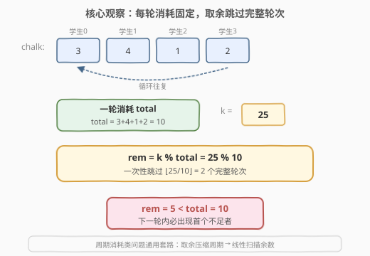
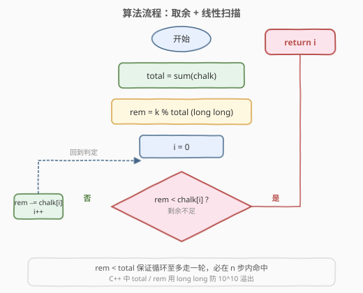
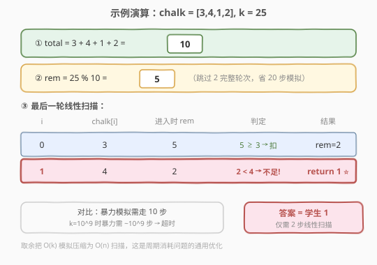

# 找到需要补充粉笔的学生

- **题目名称**：找到需要补充粉笔的学生
- **链接**：[1894. 找到需要补充粉笔的学生](https://leetcode.cn/problems/find-the-student-that-will-replace-the-chalk/)
- **难度**：中等
- **标签**：数组、前缀和、数学

## 1. 题目概述

一个班级里有 `n` 个学生，编号为 `0` 到 `n - 1`。班主任按编号顺序依次给学生出题：第 `0` 号、第 `1` 号、……、第 `n - 1` 号，然后再次回到第 `0` 号继续，如此循环。

每个学生 `i` 解题需要消耗 `chalk[i]` 支粉笔。班级共有 `k` 支粉笔。当某个学生发现**剩余粉笔不足以完成自己的题目**（即剩余粉笔严格小于 `chalk[i]`）时，该学生需要去补充粉笔。

返回需要补充粉笔的学生编号。

**示例 1**：

```text
输入：chalk = [5,1,5], k = 22
输出：0
解释：消耗顺序为 5,1,5,5,1,5,5。最后一轮学生 0 开始时仅剩 0 支，不足 5，需补充。
```

**示例 2**：

```text
输入：chalk = [3,4,1,2], k = 25
输出：1
解释：消耗顺序为 3,4,1,2,3,4,1,2,3,4。学生 1 开始时仅剩 2 支，不足 4，需补充。
```

**约束条件**：

- `chalk.length == n`
- `1 <= n <= 10^5`
- `1 <= chalk[i] <= 10^5`
- `1 <= k <= 10^9`

---

## 2. 解题思路

### 2.1 暴力思路

直接模拟：每轮按顺序让学生消耗粉笔，`k -= chalk[i]`，直到 `k < chalk[i]` 时返回 `i`。

问题在于 `k` 高达 $10^9$，而每轮总消耗 `total = sum(chalk)` 至少为 $1$，最坏情况下需要模拟约 $k / \text{total}$ 轮，即最多 $10^9$ 次操作，**必然超时**。

### 2.2 核心观察：取余跳过完整轮次



关键观察：**每一轮完整循环消耗的粉笔数量是固定的**，等于 `total = sum(chalk)`。

- 如果 `k >= total`，那么至少能撑过 $\lfloor k / \text{total} \rfloor$ 个完整轮次，这些轮次中不会有人需要补充粉笔。
- 因此可以先把 `k` 对 `total` 取余：`k %= total`，把所有「完整轮次」一次性跳过。
- 取余后 `k < total`，意味着至多再走不到一轮就能找到答案。

> 💡 这就是「周期性消耗」类问题的通用套路：**先用取余压缩掉所有完整周期，再在最后一个不完整周期里线性扫描**。类似思想见 [189. 旋转数组](https://leetcode.cn/problems/rotate-array/) 的 `k %= n`。

> ⚠️ 取余前需用 `total` 求和。注意 `chalk[i]` 最大 $10^5$、`n` 最大 $10^5$，故 `total` 最大 $10^{10}$，会超过 32 位 `int` 范围。C++ 中需用 `long long` 累加，Python 原生大整数无需担心。

### 2.3 算法流程图



### 2.4 示例演算

以 `chalk = [3,4,1,2], k = 25` 为例：



1. `total = 3 + 4 + 1 + 2 = 10`
2. `k = 25 % 10 = 5`（跳过 2 个完整轮次，共消耗 20）
3. 线性扫描最后一轮：
   - `i = 0`：`k = 5 >= 3` → `k = 5 - 3 = 2`
   - `i = 1`：`k = 2 < 4` → **返回 1**

---

## 3. 参考代码

### C++

```cpp
class Solution {
  public:
    int chalkReplacer(vector<int>& chalk, int k) {
        long long total = 0;
        for (int c : chalk) {
            total += c;
        }
        long long rem = k % total;
        for (int i = 0; i < chalk.size(); i++) {
            if (rem < chalk[i]) {
                return i;
            }
            rem -= chalk[i];
        }
        return -1;
    }
};
```

### Python

```python
class Solution:
    def chalkReplacer(self, chalk: List[int], k: int) -> int:
        total = sum(chalk)
        rem = k % total
        for i, c in enumerate(chalk):
            if rem < c:
                return i
            rem -= c
        return -1
```

---

## 4. 复杂度分析

| 维度 | 复杂度 | 说明 |
|------|--------|------|
| 时间复杂度 | $O(n)$ | 一次求和 + 取余后至多一轮线性扫描 |
| 空间复杂度 | $O(1)$ | 仅用常数额外变量 |

---

## 5. 扩展：前缀和 + 二分查找

取余后 `rem` 严格小于 `total`，最后一轮中各学生消耗后的剩余量单调递减。可预处理前缀和 `prefix[i] = chalk[0] + ... + chalk[i]`，然后二分找到**首个 `prefix[i] > rem`** 的下标，即答案。

- 时间复杂度 $O(n)$ 预处理 + $O(\log n)$ 单次查询。
- 当 `n` 很大且需要**多次查询**不同 `k` 时，二分版比线性扫描更优（本题只需一次查询，线性版已足够）。

```cpp
int chalkReplacer(vector<int>& chalk, int k) {
    int n = chalk.size();
    vector<long long> prefix(n);
    prefix[0] = chalk[0];
    for (int i = 1; i < n; i++) prefix[i] = prefix[i - 1] + chalk[i];
    long long rem = k % prefix[n - 1];
    int lo = 0, hi = n - 1;
    while (lo < hi) {
        int mid = lo + (hi - lo) / 2;
        if (prefix[mid] > rem) hi = mid;
        else lo = mid + 1;
    }
    return lo;
}
```

---

## 6. 面试要点

1. **为什么取余是安全的？**
   - 每完整一轮消耗恰好 `total`，取余 `k % total` 等价于扣掉所有能完整走完的轮次，剩余 `rem` 一定落在 `[0, total)` 内，必在下一轮内出现首个不足者。

2. **`k` 和 `total` 的溢出风险在哪？**
   - `k` 最大 $10^9$，`total` 最大 $10^{10}$，均超过 `int` 上界（约 $2.1 \times 10^9$）。C++ 求和与取余都要用 `long long`；Python 无此问题。

3. **如果允许 `chalk[i]` 为 0 会怎样？**
   - `total` 可能为 0，此时取余会除零；需特判。本题约束 `chalk[i] >= 1`，无需处理。

4. **能否不用取余，直接二分？**
   - 可以：预处理前缀和后，答案等价于找首个 `prefix[i] > k % total`。但取余这一步仍省不掉，否则 `k` 太大无法直接二分前缀和。

---

## 7. 同类练习题

- [189. 旋转数组](https://leetcode.cn/problems/rotate-array/)：同样是 `k %= n` 跳过完整周期后处理余数
- [2601. 质数减法运算](https://leetcode.cn/problems/prime-subtraction-operation/)：周期/前缀思想的变体，贪心 + 预处理
- [238. 除自身以外数组的乘积](https://leetcode.cn/problems/product-of-array-except-self/)（[题解](../0201-0300/238_除自身以外数组的乘积.md)）：前缀积与后缀积，前缀技巧的延伸
