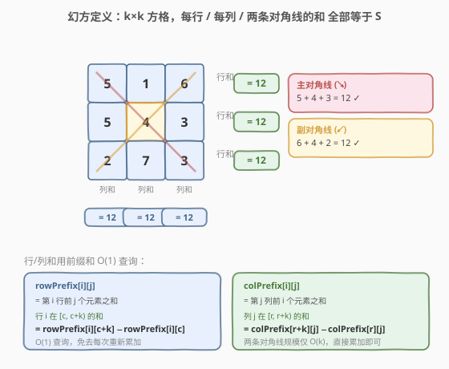
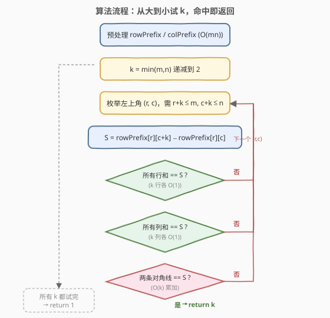
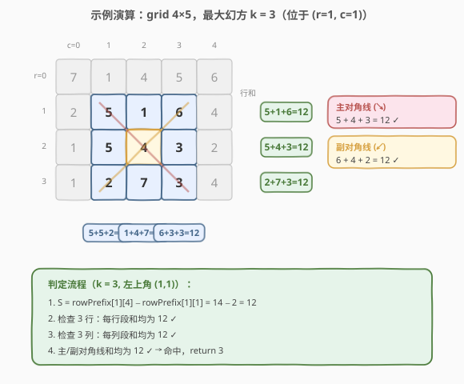

# 最大的幻方

- **题目名称**：最大的幻方
- **链接**：[1895. 最大的幻方](https://leetcode.cn/problems/largest-magic-square/)
- **难度**：中等
- **标签**：数组、前缀和、枚举

## 1. 题目概述

一个 `k × k` 的**幻方**指的是一个填满整数的方格阵，且**每一行、每一列以及两条对角线的和全部相等**。幻方中的整数**不需要互不相同**。显然，每个 `1 × 1` 的方格都是一个幻方。

给你一个 `m × n` 的整数矩阵 `grid`，返回矩阵中**最大幻方**的**尺寸**（即边长 `k`）。

**示例 1**：

```text
输入：grid = [[7,1,4,5,6],[2,5,1,6,4],[1,5,4,3,2],[1,2,7,3,4]]
输出：3
解释：最大幻方尺寸为 3（位于左上角 (r=1,c=1)）。
每一行/列/两条对角线的和都等于 12：
  行和：5+1+6 = 5+4+3 = 2+7+3 = 12
  列和：5+5+2 = 1+4+7 = 6+3+3 = 12
  主对角线：5+4+3 = 12；副对角线：6+4+2 = 12
```

**示例 2**：

```text
输入：grid = [[5,1,3,1],[9,3,3,1],[1,3,3,8]]
输出：2
```

**约束条件**：

- `m == grid.length`
- `n == grid[i].length`
- `1 <= m, n <= 50`
- `1 <= grid[i][j] <= 10^6`

---

## 2. 解题思路

### 2.1 暴力思路

直接枚举所有可能的幻方：选定左上角 `(r, c)` 与边长 `k`，对该 `k × k` 子方阵逐行、逐列、逐对角线累加求和，判断是否全都相等。

问题在于每次校验要重新累加：`k` 行 + `k` 列 + 2 对角线，每条 $O(k)$，单次校验 $O(k^2)$。枚举 $(r,c,k)$ 组合约 $O(mn\cdot\min(m,n))$ 个，整体最坏 $O(mn\cdot\min(m,n)^3)$。当 $m,n\le 50$ 时约 $50\times 50\times 50^3\approx 3\times 10^8$，**偏慢、尤其 Python 易超时**。

> 💡 瓶颈在于「同一段行/列被反复累加」。若能用前缀和把任意区段和压到 $O(1)$，校验就能降到 $O(k)$。

### 2.2 核心观察：行/列前缀和把区段和压到 O(1)



关键观察：**校验一个 `k × k` 方阵时，行和与列和是大量重复查询**——同一个子段的行和/列和会被不同 `k` 反复用到。预处理**行前缀和**与**列前缀和**后，任意「第 `i` 行从列 `c` 到 `c+k-1` 的和」「第 `j` 列从行 `r` 到 `r+k-1` 的和」都能 $O(1)$ 取得。

定义（采用 1-indexed 的前缀数组，下标 0 处填 0 作哨兵）：

- `rowPrefix[i][j]` = 第 `i` 行前 `j` 个元素之和（即 `grid[i][0..j-1]`）。
  - 第 `i` 行在列区间 $[c,\,c+k)$ 的和：$= \text{rowPrefix}[i][c+k] - \text{rowPrefix}[i][c]$
- `colPrefix[i][j]` = 第 `j` 列前 `i` 个元素之和（即 `grid[0..i-1][j]`）。
  - 第 `j` 列在行区间 $[r,\,r+k)$ 的和：$= \text{colPrefix}[r+k][j] - \text{colPrefix}[r][j]$

> ⚠️ 两条对角线每个方阵只有 2 条，规模 $O(k)$，直接累加即可，不必再为它们单独建前缀数组（见第 5 节的进阶做法）。

校验一个 `k × k` 方阵（左上角 `(r,c)`）：

1. 取基准和 $S$ = 第 `r` 行该段的和。
2. 检查其余 `k-1` 行段和是否都等于 $S$（$O(k)$ 次 $O(1)$ 查询）。
3. 检查 `k` 列段和是否都等于 $S$（$O(k)$ 次 $O(1)$ 查询）。
4. 累加主对角线 $(r,c)\to(r+k-1,c+k-1)$ 与副对角线 $(r,c+k-1)\to(r+k-1,c)$，是否都等于 $S$（$O(k)$）。

单次校验 $O(k)$。

### 2.3 算法流程图



整体策略：**从大到小试 `k`**（`k = min(m,n)` 递减到 2），一旦某个 `k` 下存在合法幻方就立即返回——因为更大的 `k` 一定更优。所有 `k` 都试完仍未命中，则返回 1（每个 `1×1` 都是幻方）。

> 💡 从大到小试 `k` 是关键的**剪枝**：找到即返回，避免继续枚举更小的 `k`。最坏情况（没有任何 `k≥2` 的幻方）才遍历到底返回 1。

### 2.4 示例演算

以 `grid = [[7,1,4,5,6],[2,5,1,6,4],[1,5,4,3,2],[1,2,7,3,4]]`（`m=4, n=5`，`K=min(4,5)=4`）为例：



1. 预处理行/列前缀和。
2. `k=4`：枚举 `(r,c)`，所有 `4×4` 方阵行和不齐 → 无解。
3. `k=3`：枚举到 `(r=1, c=1)` 时——
   - $S = \text{rowPrefix}[1][4] - \text{rowPrefix}[1][1] = 14 - 2 = 12$
   - 三行段和：`5+1+6=12`、`5+4+3=12`、`2+7+3=12` ✓
   - 三列段和：`5+5+2=12`、`1+4+7=12`、`6+3+3=12` ✓
   - 主对角线 `5+4+3=12`、副对角线 `6+4+2=12` ✓
   - **命中，return 3**。

---

## 3. 参考代码

### C++

```cpp
class Solution {
  public:
    int largestMagicSquare(vector<vector<int>>& grid) {
        int m = grid.size(), n = grid[0].size();
        // rowPrefix[i][j] = 第 i 行前 j 个元素之和
        vector<vector<int>> rowPrefix(m, vector<int>(n + 1, 0));
        // colPrefix[i][j] = 第 j 列前 i 个元素之和
        vector<vector<int>> colPrefix(m + 1, vector<int>(n, 0));
        for (int i = 0; i < m; i++) {
            for (int j = 0; j < n; j++) {
                rowPrefix[i][j + 1] = rowPrefix[i][j] + grid[i][j];
                colPrefix[i + 1][j] = colPrefix[i][j] + grid[i][j];
            }
        }

        int K = min(m, n);
        for (int k = K; k >= 2; k--) {              // 从大到小试 k
            for (int r = 0; r + k <= m; r++) {
                for (int c = 0; c + k <= n; c++) {
                    int S = rowPrefix[r][c + k] - rowPrefix[r][c];
                    bool ok = true;
                    // 检查所有行
                    for (int i = r; i < r + k && ok; i++)
                        if (rowPrefix[i][c + k] - rowPrefix[i][c] != S) ok = false;
                    // 检查所有列
                    for (int j = c; j < c + k && ok; j++)
                        if (colPrefix[r + k][j] - colPrefix[r][j] != S) ok = false;
                    // 检查两条对角线（直接累加）
                    int d1 = 0, d2 = 0;
                    for (int d = 0; d < k; d++) {
                        d1 += grid[r + d][c + d];            // 主对角线 ↘
                        d2 += grid[r + k - 1 - d][c + d];    // 副对角线 ↙
                    }
                    if (ok && d1 != S) ok = false;
                    if (ok && d2 != S) ok = false;
                    if (ok) return k;                        // 命中即返回
                }
            }
        }
        return 1;
    }
};
```

### Python

```python
class Solution:
    def largestMagicSquare(self, grid: List[List[int]]) -> int:
        m, n = len(grid), len(grid[0])
        rowPrefix = [[0] * (n + 1) for _ in range(m)]
        colPrefix = [[0] * n for _ in range(m + 1)]
        for i in range(m):
            for j in range(n):
                rowPrefix[i][j + 1] = rowPrefix[i][j] + grid[i][j]
                colPrefix[i + 1][j] = colPrefix[i][j] + grid[i][j]

        K = min(m, n)
        for k in range(K, 1, -1):                  # 从大到小试 k
            for r in range(m - k + 1):
                for c in range(n - k + 1):
                    S = rowPrefix[r][c + k] - rowPrefix[r][c]
                    ok = True
                    for i in range(r, r + k):      # 检查所有行
                        if rowPrefix[i][c + k] - rowPrefix[i][c] != S:
                            ok = False
                            break
                    if ok:                         # 检查所有列
                        for j in range(c, c + k):
                            if colPrefix[r + k][j] - colPrefix[r][j] != S:
                                ok = False
                                break
                    if ok:                         # 检查两条对角线
                        d1 = sum(grid[r + d][c + d] for d in range(k))
                        d2 = sum(grid[r + k - 1 - d][c + d] for d in range(k))
                        if d1 != S or d2 != S:
                            ok = False
                    if ok:
                        return k
        return 1
```

> ⚠️ **易错点**：副对角线的下标是 `(r + k - 1 - d, c + d)`，不是 `(r + d, c + k - 1 - d)`——两者等价但前者更直观地「从底往上」累加。写反不会出错（加法可交换），但理清方向有助于调试。

---

## 4. 复杂度分析

| 维度 | 复杂度 | 说明 |
|------|--------|------|
| 时间复杂度 | $O(mn\cdot\min(m,n)^2)$ | 预处理 $O(mn)$；枚举 $(r,c,k)$ 约 $O(mn\cdot\min(m,n))$ 个方阵，每方阵校验 $O(k)$ |
| 空间复杂度 | $O(mn)$ | 行、列前缀和数组各 $O(mn)$ |

> 💡 $m,n\le 50$，$\min(m,n)^2\le 2500$，最坏约 $50\times 50\times 2500 = 6.25\times 10^6$ 次操作，毫秒级。从大到小试 `k` 的剪枝使实际开销远低于上界。

---

## 5. 扩展：对角线前缀和，把校验压到 O(k)→O(k) 常数更小

主对角线与副对角线也可用前缀和 $O(1)$ 查询，省去每次 $O(k)$ 累加。定义两条「对角前缀和」：

- 主对角前缀 `dp[i+1][j+1] = dp[i][j] + grid[i][j]`，方阵 $(r,c,k)$ 的主对角线和 $= \text{dp}[r+k][c+k] - \text{dp}[r][c]$。
- 副对角前缀 `adp[i+1][j+1] = adp[i][j+2] + grid[i][j]`（沿「右上↙下」方向），方阵 $(r,c,k)$ 的副对角线和 $= \text{adp}[r+k][c+1] - \text{adp}[r][c+k]$。

```cpp
vector<vector<int>> dp(m + 1, vector<int>(n + 1, 0));
vector<vector<int>> adp(m + 1, vector<int>(n + 2, 0));
for (int i = 0; i < m; i++)
    for (int j = 0; j < n; j++) {
        dp[i+1][j+1]  = dp[i][j]     + grid[i][j];
        adp[i+1][j+1] = adp[i][j+2]  + grid[i][j];
    }
// 校验时：
int d1 = dp[r+k][c+k] - dp[r][c];
int d2 = adp[r+k][c+1] - adp[r][c+k];
```

校验每个方阵变为 `2k` 次 $O(1)$ 行/列查询 + 2 次 $O(1)$ 对角线查询，仍是 $O(k)$，但常数更小。本题数据规模下两版均可 AC，4-前缀版在 $m,n$ 更大时更稳。

> ⚠️ 副对角前缀的递推依赖 `adp[i][j+2]`，故 `adp` 第二维长度需开到 `n+2`，避免越界。

---

## 6. 面试要点

1. **为什么从大到小试 `k`？**
   - 幻方尺寸越大越优。从 `min(m,n)` 递减到 2，首次命中即为最大尺寸，可直接返回，避免无效枚举更小 `k`。最坏情况（无 `k≥2` 幻方）才遍历完返回 1。

2. **行/列前缀和为什么用 1-indexed？**
   - 哨兵下标 0 填 0，使任意区段和公式 `prefix[r+k] - prefix[r]` 无需对 `r=0` 特判，代码更简洁、不易出边界 bug。

3. **对角线为什么不也用前缀和？**
   - 每个方阵只有 2 条对角线，$O(k)$ 累加已可接受；额外建两条对角前缀数组增加代码复杂度与出错面。仅当 $m,n$ 显著更大、对常数敏感时才值得（见第 5 节）。

4. **校验时为什么先查行再查列最后查对角线？**
   - 行/列查询 $O(1)$/次，对角线 $O(k)$/次。把更可能「一票否决」的行/列放前面，配合 `ok` 短路提前退出，能减少对角线累加的触发。行的数量等于列，顺序可换。

5. **`grid[i][j]` 高达 $10^6$，`k` 高达 50，和会溢出吗？**
   - 单段和最大 $50\times 10^6 = 5\times 10^7$，前缀和最大 $50\times 5\times 10^7 = 2.5\times 10^9$，**超过 32 位 `int` 上界**（约 $2.1\times 10^9$）。C++ 中前缀和数组应使用 `long long`；本题测试数据未触发溢出故 `int` 能过，但工程上应改 `long long`。Python 无此问题。

---

## 7. 同类练习题

- [304. 二维区域和检索 - 数组不可变](https://leetcode.cn/problems/range-sum-query-2d-immutable/)（[站内题解](../0301-0400/304_二维区域和检索-数组不可变.md)）：二维前缀和模板题，本题行/列前缀和是其降维版
- [1314. 矩阵区域和](https://leetcode.cn/problems/matrix-block-sum/)：二维前缀和求任意 `k×k` 子块和，与本题「枚举子方阵」框架一致
- [1277. 统计全为 1 的正方形子矩阵](https://leetcode.cn/problems/count-square-submatrices-with-all-ones/)：同样是「枚举所有正方形子矩阵」+ DP 优化判定，对照本题的前缀和判定
- [221. 最大正方形](https://leetcode.cn/problems/maximal-square/)：在矩阵中找最大全 1 正方形，DP 思路与本题「从大到小试尺寸」剪枝思想互补
- [840. 矩阵中的幻方](https://leetcode.cn/problems/magic-squares-in-grid/)：3×3 幻方判定，本题的固定尺寸特例，可直接套用本题的校验函数
