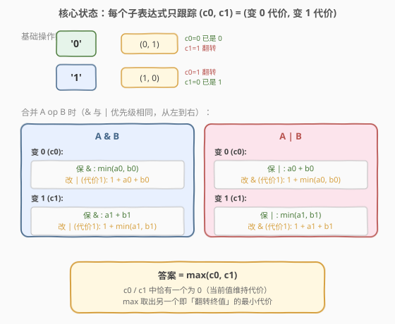
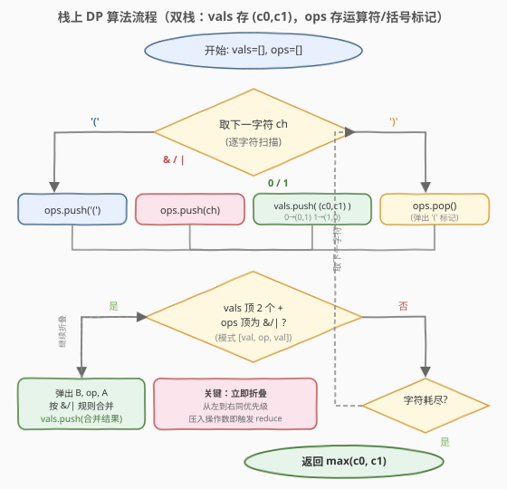
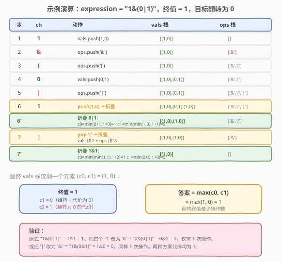

# 反转表达式值的最少操作次数

- **题目名称**：反转表达式值的最少操作次数
- **链接**：[1896. 反转表达式值的最少操作次数](https://leetcode.cn/problems/minimum-cost-to-change-the-final-value-of-expression/)
- **难度**：困难
- **标签**：栈、动态规划、字符串

## 1. 题目概述

给定一个**有效的**布尔表达式字符串 `expression`，其中只包含 `'1'`、`'0'`、`'&'`（按位与）、`'|'`（按位或）、`'('`、`')'`。

> ⚠️ **关键规则**：`'&'` 与 `'|'` 的**运算优先级相同**，计算时括号优先级最高，然后**从左到右**顺序运算（不是先 & 后 | 的常规优先级）。

每次**操作**可二选一：
- 将一个 `'1'` 变成 `'0'`，或将一个 `'0'` 变成 `'1'`；
- 将一个 `'&'` 变成 `'|'`，或将一个 `'|'` 变成 `'&'`。

目标是把整个表达式的**终值反转**（`0→1` 或 `1→0`），返回所需**最少操作次数**。

**示例 1**：

```text
输入：expression = "1&(0|1)"
输出：1
解释：将 '|' 改为 '&' → "1&(0&1)" = 1&0 = 0，1 次操作。
```

**示例 2**：

```text
输入：expression = "(0&0)&(0&0&0)"
输出：3
解释：将 "(0&0)&(0&0&0)" 改为 "(0|1)|(0&0&0)"，3 次操作（翻转 1 个操作数 + 2 次改运算符），新值 = 1。
```

**示例 3**：

```text
输入：expression = "(0|(1|0&1))"
输出：1
解释：把内层 '1' 改为 '0' → "(0|(0|0&1))" = (0|(0&1)) = (0|0) = 0，1 次操作。
```

**约束条件**：

- $1 \le \text{expression.length} \le 10^5$
- `expression` 只包含 `'1'`、`'0'`、`'&'`、`'|'`、`'('`、`')'`
- 所有括号都有匹配的对应括号，不会有空括号 `"()"`
- 表达式保证有效

---

## 2. 解题思路

### 2.1 暴力思路

表达式长度可达 $10^5$，其中操作数与运算符合计约 $5 \times 10^4$ 个。暴力枚举每个可翻转位置（操作数或运算符），逐一翻转后重新求值并比较终值是否改变，取最小代价。单次求值 $O(n)$，枚举 $O(n)$ 个位置，总复杂度 $O(n^2) \approx 2.5 \times 10^9$，**必然超时**。

### 2.2 核心观察：栈上 DP，每个子表达式只跟踪 $(c_0, c_1)$



这道题的破局点在于：**不需要关心子表达式的具体值，只需跟踪「把它变成 0 / 变成 1 的最小代价」**。

对任意子表达式定义状态 $(c_0, c_1)$：

- $c_0$ = 让该子表达式求值为 $0$ 的最小操作次数；
- $c_1$ = 让该子表达式求值为 $1$ 的最小操作次数。

> 💡 **一个不变式**：$c_0$ 与 $c_1$ 中**恰好有一个为 0**。因为子表达式有一个确定的当前值，维持它无需任何操作（代价 0），而翻转它至少需要 1 次操作。因此最终答案就是 $\max(c_0, c_1)$——取那个非零项。

#### 基础操作数

| 操作数 | $c_0$ | $c_1$ | 说明 |
|--------|-------|-------|------|
| `'0'` | 0 | 1 | 已是 0，维持代价 0；翻转为 1 代价 1 |
| `'1'` | 1 | 0 | 已是 1，维持代价 0；翻转为 0 代价 1 |

#### 合并规则 $A \;\text{op}\; B$

合并时不仅可以在操作数上动手，**还可以翻转运算符本身**（`&↔|`，代价 1）。设左子表达式状态为 $(a_0, a_1)$、右为 $(b_0, b_1)$。

**`&`（与）运算**，结果为 $A \wedge B$：

- **变 0**（$c_0$）：结果为 0 只需至少一边为 0。
  - 保 `&`：让至少一边变 0 → $\min(a_0,\, b_0)$
  - 改 `&`→`|`（代价 1）：变成 $A \vee B$，需两边都为 0 → $1 + a_0 + b_0$
  - $c_0 = \min\big(\min(a_0, b_0),\; 1 + a_0 + b_0\big)$

- **变 1**（$c_1$）：结果为 1 需两边都为 1。
  - 保 `&`：两边都变 1 → $a_1 + b_1$
  - 改 `&`→`|`（代价 1）：变成 $A \vee B$，至少一边为 1 → $1 + \min(a_1, b_1)$
  - $c_1 = \min\big(a_1 + b_1,\; 1 + \min(a_1, b_1)\big)$

**`|`（或）运算**，结果为 $A \vee B$（与 `&` 对称）：

- **变 0**：两边都为 0。
  - 保 `|`：$a_0 + b_0$
  - 改 `|`→`&`（代价 1）：至少一边为 0 → $1 + \min(a_0, b_0)$
  - $c_0 = \min\big(a_0 + b_0,\; 1 + \min(a_0, b_0)\big)$

- **变 1**：至少一边为 1。
  - 保 `|`：$\min(a_1, b_1)$
  - 改 `|`→`&`（代价 1）：两边都为 1 → $1 + a_1 + b_1$
  - $c_1 = \min\big(\min(a_1, b_1),\; 1 + a_1 + b_1\big)$

> 💡 注意四个公式**都不依赖 $A$、$B$ 的具体值**，只用它们的 $(c_0, c_1)$，所以全程无需跟踪布尔值本身。

### 2.3 算法流程图



用**双栈**模拟：

- `vals` 栈：存子表达式的 $(c_0, c_1)$；
- `ops` 栈：存运算符 `'&'`/`'|'` 与括号标记 `'('`。

逐字符扫描 `expression`：

- `'('`：压入 `ops` 作分组标记；
- `'&'` / `'|'`：压入 `ops`；
- `'0'` / `'1'`：把对应 $(c_0, c_1)$ 压入 `vals`，然后尝试**折叠**；
- `')'`：弹出 `ops` 顶的 `'('` 标记，再尝试**折叠**。

**折叠（reduce）**：只要 `vals` 顶有 2 个元素且 `ops` 顶是 `'&'` 或 `'|'`（即栈顶模式为 `[val, op, val]`），就弹出三者、按合并规则计算后压回 `vals`。用 `while` 循环可连续折叠（处理 `)` 后可能触发的链式合并）。

> ⚠️ **为什么压入操作数后要立即折叠？** 因为 `&` 与 `|` 优先级相同、从左到右运算。一旦读入右操作数，`[左值, 运算符, 右值]` 三元组就已成定局，立即归约正是模拟「从左到右」的求值顺序。`'('` 标记充当分组屏障：折叠循环遇到 `ops` 顶为 `'('` 时自然停止，保证只归约当前括号层。

### 2.4 示例演算

以 `expression = "1&(0|1)"` 为例（终值为 1，目标翻转为 0）：



逐步栈状态如下：

1. `'1'` → `vals=[(1,0)]`，`ops=[]`
2. `'&'` → `vals=[(1,0)]`，`ops=['&']`
3. `'('` → `ops=['&','(']`
4. `'0'` → `vals=[(1,0),(0,1)]`（`ops` 顶是 `'('`，不折叠）
5. `'|'` → `ops=['&','(','|']`
6. `'1'` → 压入 `(1,0)`，`ops` 顶是 `'|'`，**折叠** `0|1`：
   - $c_0 = \min(0+1,\; 1+\min(0,1)) = \min(1,1) = 1$
   - $c_1 = \min(\min(1,0),\; 1+1+0) = \min(0,2) = 0$
   - 结果 `(1,0)` 压回 → `vals=[(1,0),(1,0)]`，`ops=['&','(']`
7. `')'` → 弹出 `'('`，`ops` 顶变 `'&'`，**折叠** `1&1`：
   - $c_0 = \min(\min(1,1),\; 1+1+1) = \min(1,3) = 1$
   - $c_1 = \min(0+0,\; 1+\min(0,0)) = \min(0,1) = 0$
   - 结果 `(1,0)` 压回 → `vals=[(1,0)]`，`ops=[]`

最终 `vals` 仅剩 `(c_0, c_1) = (1, 0)`，终值为 1（$c_1=0$）。翻转代价 $= \max(1, 0) = 1$。

---

## 3. 参考代码

### C++

```cpp
class Solution {
  public:
    int minOperationsToFlip(string expression) {
        stack<pair<int,int>> vals; // (c0, c1)
        stack<char> ops;           // '&', '|', '('

        auto combine = [](pair<int,int> a, char op, pair<int,int> b) {
            int a0 = a.first, a1 = a.second;
            int b0 = b.first, b1 = b.second;
            int c0, c1;
            if (op == '&') {
                c0 = min(min(a0, b0), 1 + a0 + b0);
                c1 = min(a1 + b1, 1 + min(a1, b1));
            } else { // '|'
                c0 = min(a0 + b0, 1 + min(a0, b0));
                c1 = min(min(a1, b1), 1 + a1 + b1);
            }
            return make_pair(c0, c1);
        };

        auto reduce = [&]() {
            while (vals.size() >= 2 &&
                   (ops.top() == '&' || ops.top() == '|')) {
                auto b = vals.top(); vals.pop();
                char op = ops.top(); ops.pop();
                auto a = vals.top(); vals.pop();
                vals.push(combine(a, op, b));
            }
        };

        for (char ch : expression) {
            if (ch == '(') {
                ops.push('(');
            } else if (ch == '&' || ch == '|') {
                ops.push(ch);
            } else if (ch == '0') {
                vals.push({0, 1});
                reduce();
            } else if (ch == '1') {
                vals.push({1, 0});
                reduce();
            } else { // ')'
                ops.pop(); // 弹出 '('
                reduce();
            }
        }

        auto [c0, c1] = vals.top();
        return max(c0, c1);
    }
};
```

### Python

```python
class Solution:
    def minOperationsToFlip(self, expression: str) -> int:
        vals = []  # 元素 (c0, c1)
        ops = []   # '&', '|', '('

        def combine(a, op, b):
            a0, a1 = a
            b0, b1 = b
            if op == '&':
                c0 = min(min(a0, b0), 1 + a0 + b0)
                c1 = min(a1 + b1, 1 + min(a1, b1))
            else:  # '|'
                c0 = min(a0 + b0, 1 + min(a0, b0))
                c1 = min(min(a1, b1), 1 + a1 + b1)
            return (c0, c1)

        def reduce():
            while (len(vals) >= 2 and ops and
                   ops[-1] in ('&', '|')):
                b = vals.pop()
                op = ops.pop()
                a = vals.pop()
                vals.append(combine(a, op, b))

        for ch in expression:
            if ch == '(':
                ops.append('(')
            elif ch in '&|':
                ops.append(ch)
            elif ch == '0':
                vals.append((0, 1))
                reduce()
            elif ch == '1':
                vals.append((1, 0))
                reduce()
            else:  # ')'
                ops.pop()  # 弹出 '('
                reduce()

        c0, c1 = vals[0]
        return max(c0, c1)
```

> ⚠️ **两个易错点**：
> 1. **`&` 与 `|` 优先级相同**：不要套用「先 & 后 |」的常规优先级。本题严格从左到右，靠「压入操作数即折叠」自然实现，无需额外处理优先级。
> 2. **`reduce` 用 `while` 而非 `if`**：处理 `)` 时弹出 `'('` 后可能暴露出下层运算符，需要连续折叠（如 `"1&(0|1)&0"` 关闭第一个 `)` 后要连折两次）。`while` 循环保证栈顶 `[val, op, val]` 模式被彻底归约。

---

## 4. 复杂度分析

| 维度 | 复杂度 | 说明 |
|------|--------|------|
| 时间复杂度 | $O(n)$ | 每个字符入栈/出栈各一次，`reduce` 均摊 $O(1)$（每次折叠消耗一个运算符） |
| 空间复杂度 | $O(n)$ | 最坏情况 `vals` 与 `ops` 各存 $O(n)$ 个元素（如 `"((((0))))"`） |

> 💡 $n \le 10^5$，单趟扫描 + 均摊常数操作，运行时间在毫秒级。

---

## 5. 扩展：递归下降解法

除双栈外，也可用**递归下降**解析表达式：以 `parse_or` → `parse_and` → `parse_val` 三层递归（或合并为单层因优先级相同）。每层返回子表达式的 $(c_0, c_1)$，在遇到 `)` 或同级运算符时返回。逻辑等价，但栈法无需递归栈开销，且对 $10^5$ 深度嵌套更稳健（递归版可能栈溢出，需手动模拟）。

合并规则还可进一步简化。观察到 $c_0$ 与 $c_1$ 恰有一个为 0，定义 $f = c_0 + c_1$（即翻转代价，也等于 $\max(c_0, c_1)$），则：

- $A \;\&\; B$：若两边都「易翻」则改运算符更省，否则翻一边即可；
- 实质是对每个运算符取 $\min$（保运算符翻一边）与 $1 + \min$（改运算符翻两边）的较小值。

这种单值视角等价但牺牲了对「当前值」的显式跟踪，合并时需额外判断方向，可读性不如双值 $(c_0, c_1)$ 清晰。

---

## 6. 面试要点

**Q1：为什么要同时跟踪 $c_0$ 和 $c_1$，而不只跟踪翻转代价？**

> 因为合并时运算符可翻（`&↔|`），翻运算符后子表达式的角色会变——比如 `A&B` 变 `A|B`，此时「让结果为 0」从「让一边为 0」变成「让两边为 0」。只有同时知道 $c_0$ 和 $c_1$，才能在「保运算符」和「翻运算符」两条路线中取最小。单值无法区分方向。

**Q2：为什么 $c_0$、$c_1$ 恰有一个为 0？答案为什么是 $\max(c_0, c_1)$？**

> 子表达式有唯一确定的当前值 $v$，维持 $v$ 无需操作（$c_v = 0$），翻转为 $1-v$ 至少需 1 次操作（$c_{1-v} \ge 1$）。所以 $c_0 + c_1 = c_{1-v} \ge 1$ 且恰一个为 0。翻转终值就是要把它变成 $1-v$，代价即 $c_{1-v} = \max(c_0, c_1)$。

**Q3：`&` 与 `|` 优先级相同、从左到右，如何在栈上体现？**

> 压入一个操作数后立即检查栈顶是否构成 `[val, op, val]`，若是就折叠。这种「即压即折」保证每次读入右操作数时，左侧已被归约成单值，自然实现从左到右的结合律。`'('` 作为 `ops` 中的屏障阻止跨层折叠，`)` 时弹出屏障再折叠，实现括号分组。

**Q4：四个合并公式怎么记？**

> 记住「保运算符」和「翻运算符」两条分支，按布尔逻辑推导：`&` 要全 1 才 1（变 1 贵，需两边）；`|` 要全 0 才 0（变 0 贵，需两边）。翻运算符加 1 代价后变成对偶问题。`&` 与 `|` 的公式完全对称——把 0/1 互换即得另一组。

**Q5：如果表达式不是合法的（括号不匹配）怎么办？**

> 本题保证输入有效。若需鲁棒处理，可在 `)` 时检查 `ops` 顶是否为 `'('`，非 `'('` 则报错；结尾检查 `ops` 仅剩标记、`vals` 仅剩一个元素。

---

## 7. 同类练习题

- [224. 基本计算器](https://leetcode.cn/problems/basic-calculator/)（[站内题解](../0201-0300/224_基本计算器.md)）：双栈处理中缀表达式 + 括号，栈式求值的经典模板，本题的栈骨架与之同源
- [772. 基本计算器 III](https://leetcode.cn/problems/basic-calculator-iii/)：含 `+ - * / ( )` 的中缀求值，双栈 + 优先级处理，对照本题「同级从左到右」的简化版
- [1541. 平衡括号字符串的最少插入次数](https://leetcode.cn/problems/minimum-insertions-to-balance-a-parentheses-string/)：栈/贪心处理括号合法性的最小操作，另一类「最少操作改字符串」问题
- [2019. 解出数学表达式的学生分数](https://leetcode.cn/problems/the-score-of-students-solving-math-expression/)：栈/区间 DP 枚举表达式所有可能值，与本题「子表达式状态传递」思想相通
- [736. Lisp 语法解析](https://leetcode.cn/problems/parse-lisp-expression/)：递归下降/栈解析嵌套表达式求值，前缀表达式版的中缀求值对照
