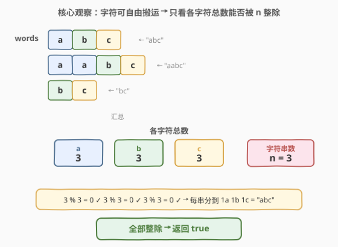
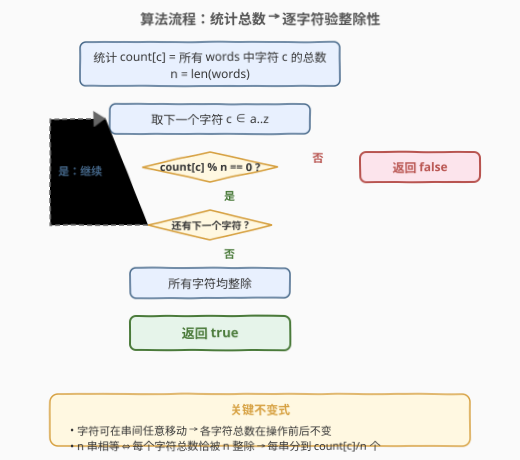
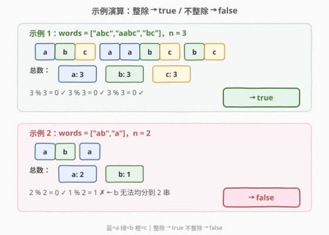

# 重新分配字符使所有字符串都相等

- **题目名称**：重新分配字符使所有字符串都相等
- **链接**：[1897. 重新分配字符使所有字符串都相等](https://leetcode.cn/problems/redistribute-characters-to-make-all-strings-equal/)
- **难度**：简单
- **标签**：哈希表、字符串、计数

## 1. 题目概述

给定一个字符串数组 `words`（下标从 0 开始）。在一步操作中，需先选出两个**不同**下标 `i` 和 `j`，其中 `words[i]` 是非空字符串，接着将 `words[i]` 中的**任一**字符移动到 `words[j]` 中的**任一**位置上。

如果执行任意步操作可以使 `words` 中的每个字符串都相等，返回 `true`；否则返回 `false`。

**示例 1**：

```text
输入：words = ["abc","aabc","bc"]
输出：true
解释：将 words[1] 中的第一个 'a' 移动到 words[2] 的最前面，
      使 words[1] = "abc" 且 words[2] = "abc"。所有字符串都等于 "abc"。
```

**示例 2**：

```text
输入：words = ["ab","a"]
输出：false
解释：执行操作无法使所有字符串都相等。
```

**约束条件**：

- $1 \le \text{words.length} \le 100$
- $1 \le \text{words[i].length} \le 100$
- `words[i]` 由小写英文字母组成

> 💡 **审题关键**：① 操作可以执行**任意步**，且每次只搬一个字符——这意味着字符在串之间的流动几乎不受限制；② 题目只问「能否」而非「最少几步」，是判定性问题而非优化问题；③ 字符在小写字母集内（仅 26 种），天然适合固定数组计数。

---

## 2. 解题思路

### 2.1 暴力思路：枚举目标模板

最直觉的想法：既然要让所有字符串相等，总得有一个「目标字符串」$T$。那不妨**枚举 `words` 中每个串作为目标模板 $T$**，验证其余串能否通过搬运变成 $T$。

对于一个候选目标 $T$，验证条件是：对每个字符 $c$，其在所有串中的**总数**恰好等于 $n \times T.\text{count}(c)$（$n$ 个串每个都有 $T.\text{count}(c)$ 个 $c$）。

```text
for T in words:
    ok = True
    for c in 'a'..'z':
        if total_count[c] != n * T.count(c):
            ok = False; break
    if ok: return True
return False
```

时间 $O(n \cdot |\Sigma|)$（$|\Sigma|=26$），空间 $O(|\Sigma|)$，能 AC。但做了**多余的功**：枚举了 $n$ 个候选 $T$，而真正起作用的条件只有一个。

> 💡 转机：注意到 `total_count[c] == n * T.count(c)` 等价于 `total_count[c] % n == 0`（此时 `T.count(c) = total_count[c] / n`）。这个等价关系与 $T$ 的具体内容无关——**只要整除性成立，任意满足 `count(c) = total / n` 的 $T$ 都可行**。于是枚举 $T$ 完全是多余步骤。

### 2.2 核心观察：只验整除性，不必枚举目标



关键观察分两层：

**第一层——不变式**：操作只在串之间搬运字符，**不增不减**任何字符。因此每个字符 $c$ 在所有串中的总数 $\text{total}(c)$ 是操作前后的**不变量**。

**第二层——充分必要条件**：$n$ 个串最终全相等 $\iff$ 每个串的字符组成完全相同 $\iff$ 对每个字符 $c$，每串恰好含 $\text{total}(c) / n$ 个 $c$ $\iff$

$$\forall c \in \Sigma:\quad \text{total}(c) \bmod n = 0$$

> 💡 **为什么充分？** 若 $\text{total}(c) \bmod n = 0$ 对所有 $c$ 成立，则令 $k_c = \text{total}(c) / n$。目标模板 $T$ 就是「$k_a$ 个 a、$k_b$ 个 b、……」的任意排列。由于字符可自由搬运，总能把多余的搬到不足的，最终每串都变成 $T$。**目标模板的存在性被整除性自动保证，无需显式构造。**

> ⚠️ **不要遗漏未出现的字符**：若某字符 $c$ 在所有串中都没出现（$\text{total}(c) = 0$），则 $0 \bmod n = 0$ 自然成立，不影响判定。因此遍历 26 个字母即可，无需只遍历出现过的。

### 2.3 算法流程图



一次遍历统计 $\text{count}[c]$ 与 $n$，再遍历 26 个字母逐个验证 $\text{count}[c] \bmod n$：

- 遇到**不整除**的字符 → 立即 `return false`（提前终止）；
- 26 个字符全部整除 → `return true`。

### 2.4 示例演算



以题目给出的两个示例逐个验证：

| 示例 | `words` | $n$ | 各字符总数 | 整除性判定 | 结果 |
|------|---------|-----|-----------|-----------|------|
| 1 | `["abc","aabc","bc"]` | 3 | a:3, b:3, c:3 | $3\%3=0$ ✓（全部） | `true` |
| 2 | `["ab","a"]` | 2 | a:2, b:1 | $2\%2=0$ ✓, $1\%2=1$ ✗ | `false` |

> 💡 示例 2 中 `b` 的总数为 1，无法均分到 2 个串——无论怎么搬，总有一个串含 `b` 而另一个不含，二者不可能相等。这就是「不整除即不可行」的直观体现。

---

## 3. 参考代码

### C++

```cpp
class Solution {
  public:
    bool makeStringsEqual(vector<string>& words) {
        int n = words.size();
        int cnt[26] = {0};
        for (const string& w : words) {
            for (char c : w) {
                cnt[c - 'a']++;
            }
        }
        for (int i = 0; i < 26; i++) {
            if (cnt[i] % n != 0) return false;
        }
        return true;
    }
};
```

### Python

```python
class Solution:
    def makeStringsEqual(self, words: List[str]) -> bool:
        cnt = collections.Counter("".join(words))
        n = len(words)
        return all(v % n == 0 for v in cnt.values())
```

### Python（显式遍历版，对照用）

```python
class Solution:
    def makeStringsEqual(self, words: List[str]) -> bool:
        n = len(words)
        cnt = [0] * 26
        for w in words:
            for c in w:
                cnt[ord(c) - ord('a')] += 1
        for c in cnt:
            if c % n != 0:
                return False
        return True
```

> ⚠️ `Counter` 版只遍历**出现过的**字符（未出现的不在 `.values()` 中），但因为未出现字符 `total = 0`，$0 \bmod n = 0$ 恒成立，所以无需检查——逻辑等价于显式遍历 26 个字母。面试中先写显式版讲清思路，再提 `Counter` 版作为 Pythonic 简写。

---

## 4. 复杂度分析

| 维度 | 复杂度 | 说明 |
|------|--------|------|
| 时间复杂度 | $O(S)$ | $S = \sum_i \text{len}(\text{words}[i])$，一次遍历所有字符统计频次 + 至多 26 次取余判定 |
| 空间复杂度 | $O(|\Sigma|) = O(1)$ | 固定 26 个字母的计数数组 / Counter，与输入规模无关 |

> 💡 本题的 $|\Sigma| = 26$ 是常数，故空间严格 $O(1)$。若字符集扩大到 Unicode，则空间退化为 $O(\min(S, |\Sigma|))$，需用哈希表替代定长数组。

---

## 5. 扩展：不变式思维与充要条件降维

### 5.1 操作不变式

本题的核心是把一个**构造性问题**（「能否通过操作达到目标」）转化为**判定性问题**（「某个不变式是否满足」）。这一降维的根基在于识别出操作的不变量：

- **守恒量**：每个字符的总数 $\text{total}(c)$ 在操作前后不变（操作只搬不改）。
- **目标约束**：$n$ 串全等 $\Rightarrow$ 每串字符组成相同 $\Rightarrow$ $\text{total}(c) = n \cdot k_c$。

当守恒量与目标约束碰撞，就得到充要条件 $\text{total}(c) \bmod n = 0$——**不必构造操作序列，只验数值条件即可**。

### 5.2 若题目改为「最少操作步数」

若问「最少几步能使所有串相等」，则需在满足整除性的前提下，**实际构造搬运方案**并最小化搬运次数。此时每步搬运一个字符，最小步数等于各串中「多余字符数」之和（也等于「不足字符数」之和）：

$$\text{steps} = \sum_{c} \sum_{i} \max\!\big(0,\ \text{words}[i].\text{count}(c) - k_c\big)$$

这与 [463. 岛屿的周长](https://leetcode.cn/problems/island-perimeter/) 等题类似——从「能否」升级到「多少」时，需在不变式之上做进一步计数。

### 5.3 若字符集扩大

若 `words[i]` 可含任意 Unicode 字符，则 26 长度数组不再适用，改用哈希表（`unordered_map` / `Counter`）统计。算法逻辑不变，仅空间从 $O(1)$ 变为 $O(\min(S, |\Sigma|))$。

---

## 6. 面试要点

**Q1：为什么不需要实际模拟搬运过程？**

> 操作只搬字符不改字符，每个字符的总数是**不变量**。$n$ 串全等的充要条件是每个字符总数被 $n$ 整除——这是**数值条件**，与具体搬运顺序无关。满足则必可行（可构造），不满足则必不可行（守恒量矛盾）。因此只需验整除性，不必模拟。

**Q2：整除性为什么是充要条件？**

> **必要性**：若 $n$ 串全等，每串含 $k_c$ 个字符 $c$，则 $\text{total}(c) = n \cdot k_c$，自然整除。**充分性**：若 $\text{total}(c) \bmod n = 0$，令 $k_c = \text{total}(c) / n$，则目标模板 $T$ = 「$k_c$ 个各字符」存在。由于字符可自由搬运，把每串中多余的 $c$ 搬到不足的串，最终每串都变成 $T$。

**Q3：`Counter` 版只检查出现过的字符，会漏判吗？**

> 不会。未出现的字符 $\text{total} = 0$，而 $0 \bmod n = 0$ 恒成立（$n \geq 1$），所以自动满足整除性。`Counter.values()` 只含非零计数，跳过的都是零计数——逻辑等价于遍历全集。

**Q4：如果 `words` 只有一个字符串，结果是什么？**

> $n = 1$ 时，任何整数 $\bmod 1 = 0$，故恒返回 `true`——一个串天然「全等」（没有比较对象）。这与题意一致：`1 <= words.length` 且单串无需操作即满足「每个字符串都相等」。

**Q5：能否不用取余，改用其他判定方式？**

> 可以但不推荐。例如可先算目标模板 $T$ 的字符组成 $k_c = \text{total}(c) / n$，再验证 $k_c \cdot n = \text{total}(c)$——本质上仍是整除判定，多了除法与乘法两步。取余是最直接的「整除性谓词」，一步到位且无精度问题。

---

## 7. 同类练习题

- [1160. 拼写单词](https://leetcode.cn/problems/find-words-that-can-be-formed-by-characters/)（[站内题解](../1101-1200/1160_拼写单词.md)）：同为「字符频次计数 + 条件判定」——用 `chars` 的频次表验证每个词是否可由其拼写，对照本题的「总数统计 → 整除判定」两阶段结构
- [389. 找不同](https://leetcode.cn/problems/find-the-difference/)（[站内题解](../0301-0400/389_找不同.md)）：同为「字符频次比较」——两串频次表求差定位多出的字符，对照本题的频次汇总思想
- [350. 两个数组的交集 II](https://leetcode.cn/problems/intersection-of-two-arrays-ii/)（[站内题解](../0301-0400/350_两个数组的交集II.md)）：同为「哈希计数取交集」——双频次表逐键取 `min`，对照本题的「汇总后判定」计数范式
- [1893. 检查是否区域内所有整数都被覆盖](https://leetcode.cn/problems/check-if-all-the-integers-in-a-range-are-covered/)（[站内题解](./1893_检查是否区域内所有整数都被覆盖.md)）：同为简单判定题——「全覆盖」⇔ 每个位置覆盖次数 $\geq 1$，与本题「全等」⇔ 每字符总数 $\bmod n = 0$ 异曲同工，均为把构造性问题降维为数值判定
