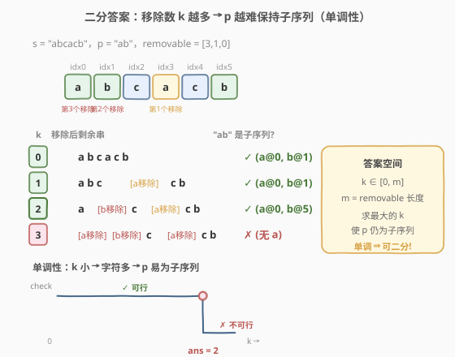
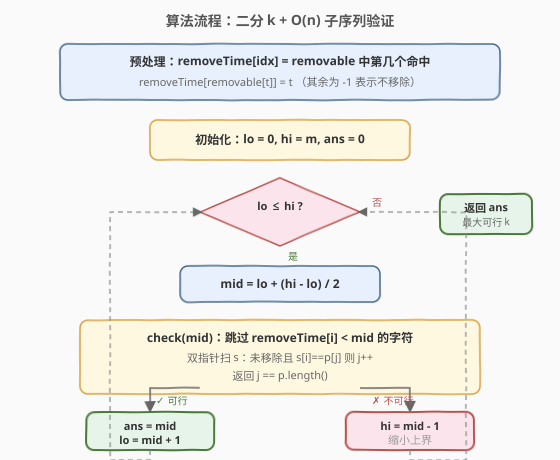
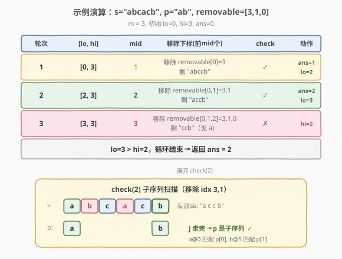

# LeetCode 可移除字符的最大数目 题解

## 1. 题目概述

- **标题 / 题号**：可移除字符的最大数目（#1898，medium）
- **链接**：https://leetcode.cn/problems/maximum-number-of-removable-characters/
- **难度**：中等
- **标签**：数组、二分查找、双指针、字符串

**题意**：给你两个字符串 `s` 和 `p`，其中 `p` 是 `s` 的一个**子序列**。同时给你一个元素**互不相同**且下标从 0 开始的整数数组 `removable`，它是 `s` 中下标的一个子集。

请找出一个整数 `k`（`0 <= k <= removable.length`），选出 `removable` 中的**前** `k` 个下标，从 `s` 中移除这些下标对应的 `k` 个字符，使得移除后 `p` 仍然是 `s` 的一个**子序列**。返回你可以找出的**最大** `k`。

**示例 1**：

```text
输入：s = "abcacb", p = "ab", removable = [3,1,0]
输出：2
解释：移除下标 3、1 对应字符后，"abcacb" → "accb"。
     "ab" 仍 "accb" 的子序列（a@0, b@5）。
     若再移除下标 0，剩 "ccb"，"ab" 不再是子序列。故最大 k = 2。
```

**示例 2**：

```text
输入：s = "abcbddddd", p = "abcd", removable = [3,2,1,4,5,6]
输出：1
解释：仅移除下标 3 后，"abcddddd" 仍含子序列 "abcd"。
```

**示例 3**：

```text
输入：s = "abcab", p = "abc", removable = [0,1,2,3,4]
输出：0
解释：移除任一下标都会破坏 "abc" 子序列。
```

**约束**：

- $1 \le p.length \le s.length \le 10^5$
- $0 \le removable.length < s.length$
- $0 \le removable[i] < s.length$
- `p` 是 `s` 的一个子序列
- `s` 和 `p` 都由小写英文字母组成
- `removable` 中的元素**互不相同**

## 2. 解题思路

### 2.1 暴力思路

从 `k = 0` 到 `k = removable.length` 逐个尝试：对每个 `k`，把 `removable` 前 `k` 个下标的字符从 `s` 中删掉，再用双指针 $O(|s| + |p|)$ 判断 `p` 是否仍是子序列，返回第一个「不可行」的 `k` 减一（或最后一个可行的 `k`）。

单次验证 $O(|s|)$，整体 $O(|s| \cdot m)$，其中 $m = |removable|$ 可达 $10^5$，总运算量约 $10^{10}$，**必然超时**。

### 2.2 核心观察：二分答案



关键直觉是：**移除的字符越少，`s` 保留得越完整，`p` 越容易保持子序列**。

- 若 `k` 可行（移除前 `k` 个后 `p` 仍是子序列），则任意 $k' < k$ 也必然可行——因为移除得更少，保留字符是 `k` 情形的超集。
- 若 `k` 不可行，则任意 $k' > k$ 也不可行——只会删得更多，更不可能。

于是存在一个分界点 $k^*$：

```text
k <= k* → p 仍是子序列   (可行 ✓)
k >  k* → p 不再是子序列  (不可行 ✗)
```

这正是二分查找所需的**二段性**（「左可行 / 右不可行」）。把「求最大可行 `k`」转化为：在 $[0, m]$ 上二分，每次 $O(|s| + |p|)$ 验证 `mid` 是否可行，可行则记录 `ans = mid` 并向右找更大的，不可行则向左缩小。

> 💡 **识别信号**：题目求「最大的满足某单调条件的值」，且能 $O(n)$ 验证候选值是否合法 → 想「二分答案」。与 [1011. 在 D 天内送达包裹的能力](../1001-1100/1011_在D天内送达包裹的能力.md)、[875. 爱吃香蕉的珂珂](../0801-0900/875_爱吃香蕉的珂珂.md) 是同一套模板，区别只在 `check()` 的内部实现。

> ⚠️ **答案区间是 $[0, m]$ 而非 $[0, |s|]$**：`k` 的取值受 `removable.length` 约束，最多只能移除 $m$ 个字符（`removable` 元素互不相同），故上界取 `m`。

### 2.3 算法流程图



**`check(mid)` 的高效实现**：朴素做法是每次重建一个 `removed` 布尔数组（$O(|s|)$ 建表 + $O(|s|)$ 扫描）。更优雅的做法是**预处理移除时刻表** `removeTime`：

- `removeTime[i]` 表示 `s[i]` 在 `removable` 中是第几个被移除的（从 0 计起），未出现在 `removable` 中则记为 $-1$。
- 验证 `k` 时，`s[i]` 被移除当且仅当 `removeTime[i] != -1 && removeTime[i] < k`。
- 这样**只需预处理一次** $O(m)$，每次 `check` 不再重建数组，直接双指针扫描 $O(|s| + |p|)$。

> 💡 **「移除时刻表」技巧**：把「某下标是否被移除」从布尔判定升级为「在第几步被移除」的整数时间戳，即可用一次预处理支撑所有二分轮次的快速判定。本质和 [189. 旋转数组](https://leetcode.cn/problems/rotate-array/) 用取余压缩周期一样，是用**预处理换重复计算**。

### 2.4 示例演算

以 `s = "abcacb"`、`p = "ab"`、`removable = [3,1,0]`（$m = 3$）为例：



预处理 `removeTime`：`s` 下标 `0→a, 1→b, 2→c, 3→a, 4→c, 5→b`，`removable = [3,1,0]` 表示第 0 步移除下标 3、第 1 步移除下标 1、第 2 步移除下标 0。故 `removeTime = [2, 1, -1, 0, -1, -1]`。

二分过程（初始 `lo=0, hi=3, ans=0`）：

- **第 1 轮** `[0,3]`，`mid=1`：移除 `removeTime < 1` 的下标即下标 3，剩 `"abccb"`，`p="ab"` 匹配 `a@0, b@1` ✓ → 可行，记 `ans=1`，`lo=2`。
- **第 2 轮** `[2,3]`，`mid=2`：移除 `removeTime < 2` 的下标即下标 3、1，剩 `"accb"`，`p="ab"` 匹配 `a@0, b@5` ✓ → 可行，记 `ans=2`，`lo=3`。
- **第 3 轮** `[3,3]`，`mid=3`：移除 `removeTime < 3` 的下标即下标 3、1、0，剩 `"ccb"`，无 `a` ✗ → 不可行，`hi=2`。
- `lo=3 > hi=2`，循环结束，返回 `ans=2`。

## 3. 参考代码

### C++

```cpp
class Solution {
  public:
    int maximumRemovals(string s, string p, vector<int>& removable) {
        int n = s.size(), r = removable.size();
        // removeTime[i]：s[i] 在 removable 中是第几个被移除的，-1 表示不会被移除
        vector<int> removeTime(n, -1);
        for (int t = 0; t < r; t++) {
            removeTime[removable[t]] = t;
        }

        int lo = 0, hi = r, ans = 0;
        while (lo <= hi) {
            int mid = lo + (hi - lo) / 2;
            if (isSubsequence(s, p, removeTime, mid)) {
                ans = mid;        // 可行，尝试移除更多
                lo = mid + 1;
            } else {
                hi = mid - 1;     // 不可行，少移除一些
            }
        }
        return ans;
    }

  private:
    // 验证移除前 k 个后，p 是否仍为 s 的子序列
    bool isSubsequence(const string& s, const string& p,
                       const vector<int>& removeTime, int k) {
        int j = 0;
        for (int i = 0; i < (int) s.size() && j < (int) p.size(); i++) {
            if (removeTime[i] != -1 && removeTime[i] < k) continue; // 该字符已移除
            if (s[i] == p[j]) j++;
        }
        return j == (int) p.size();
    }
};
```

### Python

```python
class Solution:
    def maximumRemovals(self, s: str, p: str, removable: List[int]) -> int:
        n, r = len(s), len(removable)
        # remove_time[i]：s[i] 在 removable 中是第几个被移除的，-1 表示不会被移除
        remove_time = [-1] * n
        for t, idx in enumerate(removable):
            remove_time[idx] = t

        lo, hi, ans = 0, r, 0
        while lo <= hi:
            mid = (lo + hi) // 2
            if self._is_subsequence(s, p, remove_time, mid):
                ans = mid        # 可行，尝试移除更多
                lo = mid + 1
            else:
                hi = mid - 1     # 不可行，少移除一些
        return ans

    def _is_subsequence(self, s: str, p: str,
                        remove_time: List[int], k: int) -> bool:
        j = 0
        for i in range(len(s)):
            if j == len(p):
                break
            if remove_time[i] != -1 and remove_time[i] < k:
                continue        # 该字符已移除
            if s[i] == p[j]:
                j += 1
        return j == len(p)
```

> ⚠️ **两个易错点**：
> 1. **「移除前 `k` 个」即 `removeTime < k`**：`removable` 的前 `k` 个下标对应 `removeTime` 取值 `0, 1, ..., k-1`，故判定条件是 `removeTime[i] < k`（且不为 $-1$）。写成 `<= k` 会多删一个导致误判。
> 2. **`hi` 初值取 `m` 而非 `m - 1`**：`k` 可以取到 `removable.length`（全部移除后 `p` 仍可能是子序列，如 `p` 为空串；本题 `p` 非空但上界闭合更安全），故二分区间为闭区间 $[0, m]$。

## 4. 复杂度分析

| 维度 | 复杂度 | 说明 |
|------|--------|------|
| 时间复杂度 | $O((|s| + |p|) \log m)$ | 预处理 `removeTime` $O(m)$；二分 $O(\log m)$ 轮，每轮双指针扫描 $O(|s| + |p|)$ |
| 空间复杂度 | $O(|s|)$ | `removeTime` 数组占 $O(|s|)$ |

> 💡 本题 $|s| \le 10^5$、$m < 10^5$，$\log m \approx 17$，总运算量约 $1.7 \times 10^6$，远低于时限。若每次 `check` 重建布尔数组，会多出 $O(|s| \log m)$ 的建表开销，常数更大但仍可过；`removeTime` 预处理把建表摊到一次，更优。

## 5. 扩展：朴素布尔数组 vs 移除时刻表

**朴素版**（每次重建 `removed` 布尔数组）：

```cpp
bool isSubsequence(const string& s, const string& p,
                   const vector<int>& removable, int k) {
    vector<char> removed(s.size(), 0);
    for (int i = 0; i < k; i++) removed[removable[i]] = 1;
    int j = 0;
    for (int i = 0; i < (int)s.size() && j < (int)p.size(); i++) {
        if (removed[i]) continue;
        if (s[i] == p[j]) j++;
    }
    return j == (int)p.size();
}
```

- 时间 $O(|s| \log m + (|s| + |p|) \log m)$：每轮建表 $O(k) \le O(|s|)$ + 扫描 $O(|s| + |p|)$。
- **优点**：逻辑直白，无需预处理；**缺点**：每轮重复建表，常数更大。

**时刻表版**（本文主解）：预处理一次 `removeTime`，每轮省去建表，仅扫描。

> 💡 **何时用时刻表？** 当「按顺序施加操作、且需多次查询前缀操作效果」时，把操作序号作为时间戳预处理，即可用 $O(1)$ 判定任意元素在前 `k` 步中是否被命中。这是一种通用的「**离线操作时间戳**」思想，与并查集撤销、离线查询同源。

## 6. 面试要点

1. **为什么能二分？二段性体现在哪？**

   - 移除更少字符时，保留的 `s` 是移除更多时的超集，故 `p` 是前者子序列 ⇒ 必是后者子序列不成立，反向才成立：`k` 可行 ⇒ $k' < k$ 可行。这种「左可行 / 右不可行」的单调结构即二段性，可二分定位分界点 $k^*$。

2. **`check(mid)` 怎么写？复杂度多少？**

   - 双指针 `i` 扫 `s`、`j` 扫 `p`：跳过被移除下标，未移除且 `s[i]==p[j]` 则 `j++`，最后看 `j` 是否走完 `p`。借助 `removeTime` 预处理，判定「已移除」是 $O(1)$，整体 $O(|s| + |p|)$。

3. **为什么用 `removeTime` 而不是每次重建布尔数组？**

   - 重建布尔数组每轮 $O(|s|)$ 建表，二分 $O(\log m)$ 轮累计 $O(|s| \log m)$ 额外开销；`removeTime` 一次性预处理 $O(m)$，每轮 $O(1)$ 查询，常数更小。两者渐近复杂度同级，但时刻表版更优雅、实际更快。

4. **「移除前 `k` 个」的判定条件为什么是 `removeTime[i] < k`？**

   - `removable` 前 `k` 项的下标对应 `removeTime` 值 $0, 1, \dots, k-1$，故严格小于 `k` 即「在前 `k` 步被移除」。注意还要排除 `removeTime[i] == -1`（永不移除）。

5. **如果 `removable` 中有重复下标会怎样？**

   - 题目保证元素互不相同。若有重复，`removeTime` 会被后一次覆盖，破坏「前 `k` 个」的语义，需改用布尔数组或对 `removable` 去重后再处理。

## 同类练习题

| # | 题目 | 与本题的关联 |
|---|------|-------------|
| 1011 | [在 D 天内送达包裹的能力](https://leetcode.cn/problems/capacity-to-ship-packages-within-d-days/) | 同模板，二分运载能力 `cap`，`check` 贪心装船，求最小可行 `cap`（方向相反：求最小 vs 本题求最大） |
| 875 | [爱吃香蕉的珂珂](https://leetcode.cn/problems/koko-eating-bananas/) | 二分吃香蕉速度 `k`，`check` 用向上取整求和，求最小可行 `k` |
| 410 | [分割数组的最大值](https://leetcode.cn/problems/split-array-largest-sum/) | 二分「最大子数组和」上限，`check` 贪心划分，几乎与 1011 同构 |
| 719 | [找出第 K 小的数对距离](https://leetcode.cn/problems/find-k-th-smallest-pair-distance/) | 二分距离上限，`check` 用双指针统计满足条件的数对数 |
| 392 | [判断子序列](https://leetcode.cn/problems/is-subsequence/) | 本题 `check()` 的退化版（无移除），双指针判定子序列的母题 |
