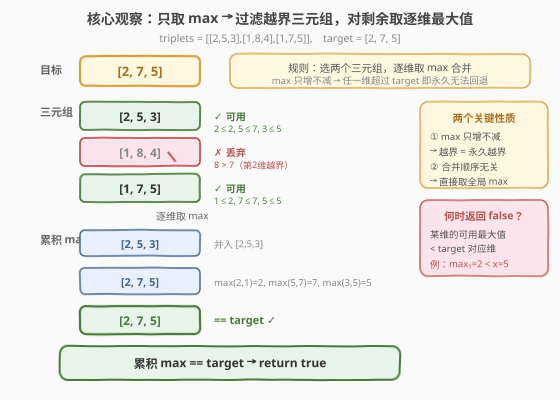
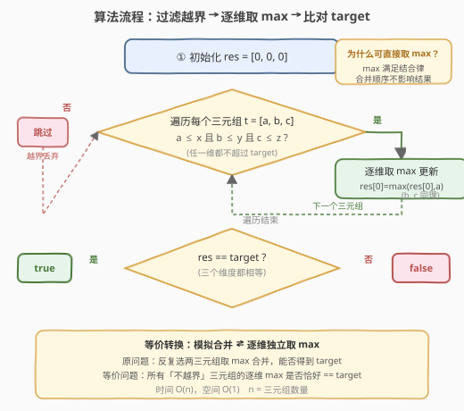
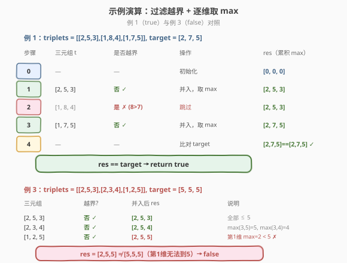

# 合并若干三元组以形成目标三元组

- **题目名称**：合并若干三元组以形成目标三元组
- **链接**：[1899. Merge Triplets to Form Target Triplet](https://leetcode.cn/problems/merge-triplets-to-form-target-triplet/)
- **难度**：中等
- **标签**：贪心、数组

## 1. 题目概述

**三元组**是三个整数的数组。给定一个二维整数数组 `triplets`，其中 `triplets[i] = [ai, bi, ci]` 描述第 `i` 个三元组。再给定一个整数数组 `target = [x, y, z]`，描述你想要得到的目标三元组。

为得到 `target`，可以对 `triplets` 执行以下操作**任意次数**（包括 0 次）：

- 选择两个下标 `i` 和 `j`（`0 <= i, j < triplets.length`），令 `triplets[i] = [max(ai, aj), max(bi, bj), max(ci, cj)]`。
- 然后**删除**下标 `j` 处的三元组。

如果能让 `target = [x, y, z]` 成为 `triplets` 的一个元素，返回 `true`；否则返回 `false`。

> 操作的本质是：每次选两个三元组，**逐维取最大值**合并成一个，再删掉另一个。目标是判断能否通过反复合并得到 `target`。

**示例 1**：

```text
输入：triplets = [[2,5,3],[1,8,4],[1,7,5]], target = [2,7,5]
输出：true
解释：选第 1 个和第 3 个三元组 [2,5,3] 和 [1,7,5]：
      [max(2,1), max(5,7), max(3,5)] = [2,7,5]
      更新第 3 个为 [2,7,5]，triplets = [[2,5,3],[1,8,4],[2,7,5]]
      target [2,7,5] 已成为 triplets 的元素。
```

**示例 2**：

```text
输入：triplets = [[1,3,4],[2,5,8]], target = [2,5,8]
输出：true
解释：选第 1 个和第 2 个 [1,3,4] 和 [2,5,8]：
      [max(1,2), max(3,5), max(4,8)] = [2,5,8]
      target [2,5,8] 已成为 triplets 的元素。
```

**示例 3**：

```text
输入：triplets = [[2,5,3],[2,3,4],[1,2,5]], target = [5,5,5]
输出：false
解释：无法让第一个值达到 5。
```

**约束条件**：

- $1 \le \text{triplets.length} \le 10^5$
- $\text{triplets}[i].\text{length} == \text{target.length} == 3$
- $1 \le a_i, b_i, c_i, x, y, z \le 10^5$

> 💡 **审题关键**：① 操作是**逐维取 max**——max 只增不减，意味着任意一维一旦超过 `target` 对应值便**永久无法回退**；② 操作可执行任意次数、合并顺序自由——这暗示最终结果与合并顺序无关，只取决于「参与合并的三元组集合」；③ 三元组长度恒为 3，维度固定且极少，可以逐维独立分析。

---

## 2. 解题思路

### 2.1 暴力思路：模拟所有合并

最直观的做法是模拟：枚举所有两两合并的顺序，判断是否能得到 `target`。

- **正确性**：穷举所有合并路径，一定能覆盖所有可达结果。
- **效率**：合并顺序的组合数是阶乘级别，$n$ 个三元组有 $O(n!)$ 种合并方式，对 $n \le 10^5$ 完全不可行。

> 💡 暴力模拟的瓶颈在于「顺序爆炸」。但操作本质是取 max，而 max 满足**结合律与交换律**——合并顺序不影响最终结果。这个性质让我们能跳过模拟，直接计算「所有可用三元组的逐维最大值」。

### 2.2 核心观察：过滤越界 + 逐维取 max



关键洞察分两步：

**第一步：哪些三元组能用？——过滤越界**

由于 max 只增不减，若某三元组 $t = [a, b, c]$ 在**任意一维**超过 `target` 对应值（如 $a > x$），则它**一旦参与合并就会让该维永久超过 target**，无法回退。因此：

$$t \text{ 可用} \iff a \le x \;\land\; b \le y \;\land\; c \le z$$

> ⚠️ **三个维度必须同时不越界**。只要有一维越界，整个三元组就必须丢弃——因为合并是逐维同时取 max，无法只取「好的维度」而避开「坏的维度」。

**第二步：可用三元组的逐维 max 是否恰好等于 target？**

对所有可用三元组取逐维最大值：

$$\text{res} = \left[\max_i a_i,\; \max_i b_i,\; \max_i c_i\right] \quad (\text{仅对可用 } i)$$

若 $\text{res} == \text{target}$，则返回 `true`；否则 `false`。

> 💡 **正确性论证**：① max 的结合律与交换律保证「反复两两合并」等价于「一次性对全部取 max」；② 过滤掉越界三元组后，剩余的逐维 max 不会超过 target（每个维都 $\le$ target）；③ 若某维 max $<$ target，说明没有任何可用三元组在该维达到 target 值，无法通过合并补齐——因为 max 只增不减，差值永远无法填补。

### 2.3 算法流程图



1. **初始化**：`res = [0, 0, 0]`（累积逐维最大值）。
2. **遍历每个三元组** `t = [a, b, c]`：
   - 若 $a \le x$ 且 $b \le y$ 且 $c \le z$（不越界）：更新 `res = [max(res[0], a), max(res[1], b), max(res[2], c)]`。
   - 否则跳过（越界丢弃）。
3. **比对**：返回 `res == target`。

### 2.4 示例演算

以示例 1 `triplets = [[2,5,3],[1,8,4],[1,7,5]], target = [2,7,5]` 与示例 3 `triplets = [[2,5,3],[2,3,4],[1,2,5]], target = [5,5,5]` 对照，逐步追踪过滤与取 max 过程：



**例 1**（返回 `true`）：

| 步骤 | 三元组 $t$ | 是否越界 | 操作 | res（累积 max） |
|------|-----------|----------|------|-----------------|
| $0$ | — | — | 初始化 | $[0, 0, 0]$ |
| $1$ | $[2, 5, 3]$ | 否（$2\le2, 5\le7, 3\le5$） | 并入，取 max | $[2, 5, 3]$ |
| $2$ | $[1, 8, 4]$ | **是**（$8 > 7$，第 2 维越界） | 跳过 | $[2, 5, 3]$ |
| $3$ | $[1, 7, 5]$ | 否（$1\le2, 7\le7, 5\le5$） | 并入，取 max | $[2, 7, 5]$ |
| $4$ | — | — | 比对 target | $[2,7,5] == [2,7,5]$ ✓ |

**例 3**（返回 `false`）：

| 三元组 $t$ | 越界? | 并入后 res | 说明 |
|-----------|-------|-----------|------|
| $[2, 5, 3]$ | 否 ✓ | $[2, 5, 3]$ | 全部 $\le 5$ |
| $[2, 3, 4]$ | 否 ✓ | $[2, 5, 4]$ | $\max(3,5)=5$, $\max(3,4)=4$ |
| $[1, 2, 5]$ | 否 ✓ | $[2, 5, 5]$ | 第 1 维 $\max=2 < 5$ ✗ |

> 💡 **观察要点**：① 例 1 中 $[1,8,4]$ 因第 2 维 $8 > 7$ 被丢弃——尽管它的第 1、3 维都「可用」，但合并是逐维同时进行的，无法只取好的维度；② 例 3 中所有三元组都不越界，但第 1 维的最大值仅为 $2$，达不到 target 的 $5$——**max 只增不减**，意味着没有任何三元组能提供 $5$ 这个值，差值永远无法填补；③ 最终只需比较 `res == target`，三个维度同时相等才返回 `true`。

---

## 3. 参考代码

### C++

```cpp
class Solution {
public:
    bool mergeTriplets(vector<vector<int>>& triplets, vector<int>& target) {
        int x = target[0], y = target[1], z = target[2];
        int ra = 0, rb = 0, rc = 0;
        for (auto& t : triplets) {
            if (t[0] <= x && t[1] <= y && t[2] <= z) {
                ra = max(ra, t[0]);
                rb = max(rb, t[1]);
                rc = max(rc, t[2]);
            }
        }
        return ra == x && rb == y && rc == z;
    }
};
```

### Python

```python
class Solution:
    def mergeTriplets(self, triplets: list[list[int]], target: list[int]) -> bool:
        x, y, z = target
        ra = rb = rc = 0
        for a, b, c in triplets:
            if a <= x and b <= y and c <= z:
                ra = max(ra, a)
                rb = max(rb, b)
                rc = max(rc, c)
        return [ra, rb, rc] == target
```

### Python（函数式写法：filter + 逐维 max）

```python
class Solution:
    def mergeTriplets(self, triplets: list[list[int]], target: list[int]) -> bool:
        x, y, z = target
        usable = [(a, b, c) for a, b, c in triplets if a <= x and b <= y and c <= z]
        if not usable:
            return False
        return [max(t[0] for t in usable),
                max(t[1] for t in usable),
                max(t[2] for t in usable)] == target
```

> 💡 **写法对照**：① 第一版用单次遍历 + 三个标量累积 max，$O(n)$ 时间 $O(1)$ 空间，最优；② 函数式版先 filter 再三次 `max`，语义清晰但需三遍遍历且额外空间，面试中先写第一版展示效率意识，再口述函数式版作为对照；③ 注意函数式版需处理 `usable` 为空的边界——空列表 `max()` 会抛异常，故提前返回 `False`。

---

## 4. 复杂度分析

| 维度 | 复杂度 | 说明 |
|------|--------|------|
| 时间复杂度 | $O(n)$ | 单次遍历所有三元组，每个做 $O(1)$ 的越界判定与 max 更新 |
| 空间复杂度 | $O(1)$ | 仅用三个标量 `ra, rb, rc` 累积，与输入规模无关 |

> 💡 本题 $n \le 10^5$，$O(n)$ 单次扫描十分宽裕。关键在于利用 max 的结合律将「模拟合并」降为「逐维独立取 max」，避免了阶乘级的暴力搜索。

---

## 5. 扩展：max 结合律与「合并等价类」

### 5.1 为什么合并顺序无关？

max 运算满足**结合律**（$\max(a, \max(b, c)) = \max(\max(a, b), c)$）与**交换律**（$\max(a, b) = \max(b, a)$）。因此对任意子集 $S$ 的三元组，无论以何种顺序两两合并，最终结果的每一维都是 $S$ 中该维的最大值。

这使得我们可以跳过「选择哪两个合并」的决策，直接计算「参与合并的集合」的逐维 max——从 $O(n!)$ 的搜索问题降为 $O(n)$ 的聚合问题。

### 5.2 推广到 k 维

本题维度 $k = 3$。若推广到 $k$ 维（三元组变为 $k$ 元组），算法不变：过滤越界（$k$ 维同时 $\le$ target）后取 $k$ 维各自 max，比对 target。时间仍为 $O(n \cdot k)$，空间 $O(k)$。

### 5.3 若操作改为取 min 呢？

若操作改为「逐维取 min 合并」，对称地：min 只减不增，因此任意一维**低于** target 对应值的三元组必须丢弃；对剩余取逐维 min，比对是否等于 target。逻辑完全对称，只需把「越上界」改为「越下界」。

---

## 6. 面试要点

**Q1：为什么可以直接取所有可用三元组的 max，而不需要模拟合并过程？**

> 因为 max 满足结合律与交换律。两两合并的最终结果等于对所有参与合并的三元组逐维取 max，与合并顺序无关。所以「能否通过合并得到 target」等价于「是否存在一个可用三元组子集，其逐维 max == target」。再由「可用三元组越多 max 只会更大不会更小」可知，直接对全部可用三元组取 max 即为最优——若全集 max 都达不到 target，任何子集也达不到。

**Q2：为什么要过滤掉某维超过 target 的三元组？不能只用它「好的维度」吗？**

> 合并操作是**逐维同时取 max**，无法选择性地只合并某些维度。若某三元组第 $i$ 维 $> \text{target}[i]$，一旦参与合并，该维结果必超过 target 且无法回退（max 只增不减）。因此整个三元组必须丢弃。这是本题最易踩的坑——容易被「它的其他维度有用」误导。

**Q3：如果所有三元组都被过滤掉了怎么办？**

> 此时 `res` 保持初始值 $[0, 0, 0]$。由于 $\text{target}[i] \ge 1$（约束条件），$[0,0,0] \ne \text{target}$，自然返回 `false`。无需特判——代码逻辑天然处理了这种情况。函数式写法中若用 `max()` 需先检查 `usable` 非空，否则会抛异常。

**Q4：这道题的「贪心」体现在哪里？**

> 贪心体现在两点：① **过滤策略贪心**——只要不越界就一律纳入候选集，因为更多候选只会让 max 更大（更可能达到 target），不存在「纳入反而有害」的情况；② **不需要回退**——一旦某三元组越界就永久丢弃，无需尝试「先纳入再移除」。这种贪心的正确性由 max 的单调性保证。

**Q5：与「区间合并」类问题有何区别？**

> 区间合并（如 [56. 合并区间]）处理的是**区间重叠关系**，需排序后扫描；本题处理的是**逐维 max 聚合**，无需排序，单次遍历即可。两者都涉及「合并」一词但语义完全不同：区间合并输出合并后的区间列表，本题判定能否达到目标值。

> 💡 **一句话总结**：max 的结合律让「模拟合并」降为「逐维取 max」，max 的单调性让「越界即永久丢弃」——两个性质合在一起，$O(n!)$ 的搜索问题变为 $O(n)$ 的聚合问题。

---

## 7. 同类练习题

- [1846. 减小和重新排列数组后的最大元素](https://leetcode.cn/problems/maximum-element-after-decreasing-and-rearranging/)（[题解](1846_减小和重新排列数组后的最大元素.md)）：贪心 + 排序，通过排序后贪心约束逐元素最大值，与本题「在约束下求可达最大值」的贪心思想相通
- [1887. 使数组元素相等的减少操作次数](https://leetcode.cn/problems/reduction-operations-to-make-the-array-elements-equal/)（[题解](1887_使数组元素相等的减少操作次数.md)）：排序后逐层归并使所有元素相等，与本题「max 合并归一」对照——一个向上取 max、一个向下取 min
- [2536. 子矩阵元素加减 1 的得分处理](https://leetcode.cn/problems/increment-submatrices-by-one/)：二维差分标记，与本题「逐维聚合」同为对矩阵/数组的高效扫描类问题
- [2210. 统计数组中峰和谷的数量](https://leetcode.cn/problems/count-hills-and-valleys-in-an-array/)：单次遍历 + 局部极值判定，与本题「单次遍历 + 逐维 max 累积」同为 $O(n)$ 扫描贪心范式
