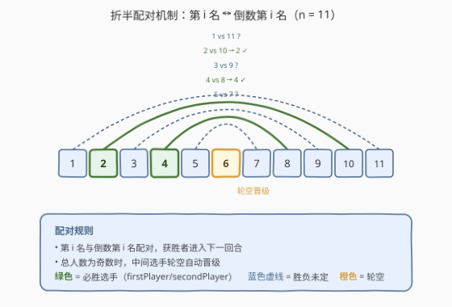
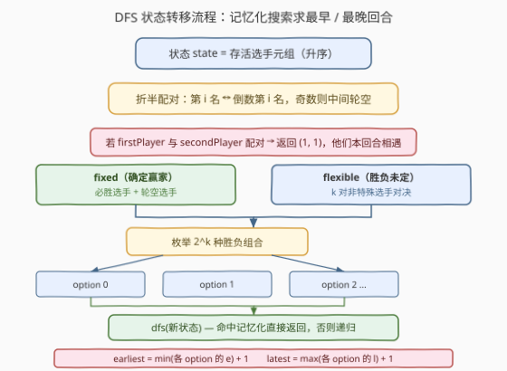
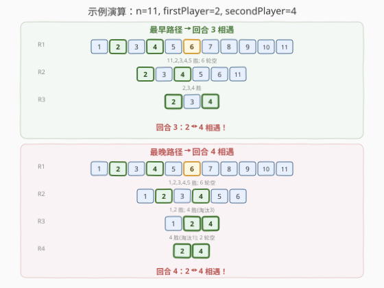

# 最佳运动员的比拼回合

- **题目名称**：最佳运动员的比拼回合
- **链接**：[1900. 最佳运动员的比拼回合](https://leetcode.cn/problems/the-earliest-and-latest-rounds-where-players-compete/)
- **难度**：困难
- **标签**：记忆化搜索、深度优先搜索、博弈

## 1. 题目概述

$n$ 名运动员站成一排，按初始站位从 $1$ 到 $n$ 编号。锦标赛由多个回合组成，每一回合中**第 $i$ 名**（从前数）与**倒数第 $i$ 名**（从后数）配对比拼，获胜者进入下一回合。若当前回合人数为奇数，中间那位运动员**轮空**自动晋级。每回合结束后，获胜者按**原始编号升序**重新排成一排。

编号为 `firstPlayer` 和 `secondPlayer` 的两位是最佳运动员，**在他们相遇之前可以战胜任何其他运动员**。而任意两个其他运动员之间，任一方都有可能获胜——你可以**裁定**每场非特殊对决的胜负。

求两位最佳运动员在锦标赛中比拼的**最早**和**最晚**回合数。

**示例 1**：

```text
输入：n = 11, firstPlayer = 2, secondPlayer = 4
输出：[3, 4]
解释：
最早（回合 3）：
  回合 1：1,2,3,4,5,6,7,8,9,10,11 → 11,2,3,4,5 胜, 6 轮空
  回合 2：2,3,4,5,6,11           → 2,3,4 胜
  回合 3：2,3,4                   → 2 ↔ 4 相遇
最晚（回合 4）：
  回合 1：1,2,3,4,5,6,7,8,9,10,11 → 1,2,3,4,5 胜, 6 轮空
  回合 2：1,2,3,4,5,6             → 1,2 胜, 4 胜(淘汰3)
  回合 3：1,2,4                   → 4 胜(淘汰1), 2 轮空
  回合 4：2,4                     → 2 ↔ 4 相遇
```

**示例 2**：

```text
输入：n = 5, firstPlayer = 1, secondPlayer = 5
输出：[1, 1]
解释：回合 1 中 1 和 5 配对（第 1 名 ↔ 倒数第 1 名），直接相遇。
```

**约束条件**：

- $2 \le n \le 28$
- $1 \le \text{firstPlayer} < \text{secondPlayer} \le n$

> 💡 **关键观察**：配对方式是**折半折叠**——第 $i$ 名与倒数第 $i$ 名配对，不是相邻配对。这意味着选手 $1$ 和选手 $n$ 在回合 1 就配对。两位最佳选手何时相遇，取决于每回合中**他们之间的其他选手**被淘汰的速度。

---

## 2. 解题思路

### 2.1 暴力思路：枚举所有胜负组合

每回合中，非特殊选手之间的对决胜负未定。最朴素地，枚举所有可能的胜负组合，模拟锦标赛直到两位特殊选手相遇，记录回合数。

$n = 28$ 时，回合 1 有 $14$ 对，其中 $2$ 对涉及特殊选手（胜负确定），剩余 $12$ 对各有 $2$ 种可能 $\Rightarrow$ 仅回合 1 就有 $2^{12} = 4096$ 种分支。虽然每回合人数减半、深度仅 $\lceil \log_2 28 \rceil = 5$ 层，但总分支数可能很大。

> ⚠️ **症结**：不同分支可能产生**相同的存活选手集合**。例如回合 1 中 $(5, 7)$ 选 $5$、$(9, 10)$ 选 $9$，与选 $7$、选 $10$ 在某些组合下可能到达相同的下一回合状态。暴力搜索会重复计算这些状态。突破口是**记忆化**——对每个存活集合只算一次。

### 2.2 核心观察：折半配对 + 记忆化搜索



**配对规则**：每一回合，存活选手按编号升序排列，第 $i$ 名与倒数第 $i$ 名配对。奇数时中间选手轮空。配对后：

- **特殊选手**（`firstPlayer` / `secondPlayer`）参与的对决：特殊选手**必胜**，对手被淘汰。
- **非特殊选手**之间的对决：任一方可能获胜，需枚举两种可能。
- 若两位特殊选手**直接配对**：他们本回合相遇，返回 $(1, 1)$。

**状态定义**：`state` = 当前存活选手的升序元组。由于每回合淘汰约一半选手，且两位特殊选手始终存活，状态天然压缩。

> 💡 **为什么记忆化有效？** 虽然初始状态分支很多（$2^{12}$），但不同分支经常**汇聚到同一存活集合**。例如回合 1 的 $4096$ 种分支，到回合 2 时可能只剩数百个不同的存活集合。记忆化确保每个集合只计算一次。

### 2.3 算法流程图



**算法步骤**：

1. **初始状态**：`state = (1, 2, ..., n)`，回合数计数从 $1$ 开始。
2. **折半配对**：对当前 `state`，第 $i$ 名与倒数第 $i$ 名配对，中间选手（若有）轮空。
3. **检查相遇**：若某对恰好是 `{firstPlayer, secondPlayer}`，返回 $(1, 1)$。
4. **分离固定 / 灵活**：
   - **fixed**：特殊选手（必胜）+ 轮空选手 → 胜者确定。
   - **flexible**：$k$ 对非特殊选手对决 → 枚举 $2^k$ 种胜负组合。
5. **枚举 + 递归**：对每种组合，生成新存活集合（升序排列），递归调用 `dfs(new_state)`。
6. **合并结果**：`earliest = min(各分支的 e) + 1`，`latest = max(各分支的 l) + 1`。
7. **记忆化**：每个 `state` 的 `(earliest, latest)` 缓存，重复访问直接返回。

### 2.4 示例演算

以示例 1（$n = 11$, `firstPlayer = 2`, `secondPlayer = 4`）为例，展示最早与最晚两条路径：



**最早路径（回合 3）**：

| 回合 | 存活选手 | 配对 | 胜者 |
|------|----------|------|------|
| 1 | 1,2,3,4,5,6,7,8,9,10,11 | (1,11),(2,10),(3,9),(4,8),(5,7),6 轮空 | 11,2,3,4,5,6 |
| 2 | 2,3,4,5,6,11 | (2,11),(3,6),(4,5) | 2,3,4 |
| 3 | 2,3,4 | (2,4),3 轮空 | **2 ↔ 4 相遇！** |

关键：回合 1 让 $11$ 淘汰 $1$（而非 $1$ 淘汰 $11$），回合 2 让 $3$ 淘汰 $6$，这样回合 3 中 $2$ 和 $4$ 分别处于第 $1$ 和第 $3$ 位（倒数第 $1$ 和第 $3$），直接配对。

**最晚路径（回合 4）**：

| 回合 | 存活选手 | 配对 | 胜者 |
|------|----------|------|------|
| 1 | 1,2,3,4,5,6,7,8,9,10,11 | 同上 | 1,2,3,4,5,6 |
| 2 | 1,2,3,4,5,6 | (1,6),(2,5),(3,4) | 1,2,4 |
| 3 | 1,2,4 | (1,4),2 轮空 | 4,2 → 2,4 |
| 4 | 2,4 | (2,4) | **2 ↔ 4 相遇！** |

关键：回合 2 让 $4$ 淘汰 $3$（而非 $3$ 胜），回合 3 让 $4$ 淘汰 $1$，使 $2$ 和 $4$ 拖到第 4 回合才配对。

> 💡 **最早 vs 最晚的本质**：最早路径让两位特殊选手**之间的选手快速被淘汰**，使他们尽早成为折半配对的对称位置；最晚路径则**在他们之间保留更多选手**，推迟对称时刻的到来。

---

## 3. 参考代码

### C++

```cpp
class Solution {
public:
    vector<int> earliestAndLatest(int n, int firstPlayer, int secondPlayer) {
        int fp = firstPlayer, sp = secondPlayer;
        unordered_map<int, pair<int,int>> memo;

        function<pair<int,int>(int)> dfs = [&](int mask) -> pair<int,int> {
            auto it = memo.find(mask);
            if (it != memo.end()) return it->second;

            vector<int> players;
            for (int i = 0; i < 28; i++)
                if (mask & (1 << i)) players.push_back(i + 1);
            int m = players.size();

            vector<pair<int,int>> pairs;
            for (int i = 0; i < m / 2; i++)
                pairs.push_back({players[i], players[m - 1 - i]});
            int bye = (m % 2) ? players[m / 2] : -1;

            for (auto& [a, b] : pairs) {
                if ((a == fp && b == sp) || (a == sp && b == fp))
                    return memo[mask] = {1, 1};
            }

            vector<int> fixed;
            vector<pair<int,int>> flexible;
            for (auto& [a, b] : pairs) {
                if (a == fp || a == sp) fixed.push_back(a);
                else if (b == fp || b == sp) fixed.push_back(b);
                else flexible.push_back({a, b});
            }
            if (bye != -1) fixed.push_back(bye);

            int k = flexible.size();
            int earliest = INT_MAX, latest = 0;
            for (int bm = 0; bm < (1 << k); bm++) {
                int newMask = 0;
                for (int x : fixed) newMask |= (1 << (x - 1));
                for (int i = 0; i < k; i++) {
                    int w = (bm >> i) & 1 ? flexible[i].first : flexible[i].second;
                    newMask |= (1 << (w - 1));
                }
                auto [e, l] = dfs(newMask);
                earliest = min(earliest, e);
                latest = max(latest, l);
            }

            return memo[mask] = {earliest + 1, latest + 1};
        };

        int initMask = 0;
        for (int i = 1; i <= n; i++) initMask |= (1 << (i - 1));
        auto [e, l] = dfs(initMask);
        return {e, l};
    }
};
```

### Python

```python
class Solution:
    def earliestAndLatest(self, n: int, firstPlayer: int, secondPlayer: int) -> List[int]:
        sp = {firstPlayer, secondPlayer}

        @lru_cache(maxsize=None)
        def dfs(state):
            m = len(state)
            pairs = []
            for i in range(m // 2):
                pairs.append((state[i], state[m - 1 - i]))
            bye = state[m // 2] if m % 2 else None

            for a, b in pairs:
                if a in sp and b in sp:
                    return (1, 1)

            fixed = []
            flexible = []
            for a, b in pairs:
                if a in sp:
                    fixed.append(a)
                elif b in sp:
                    fixed.append(b)
                else:
                    flexible.append((a, b))
            if bye is not None:
                fixed.append(bye)

            k = len(flexible)
            earliest = float('inf')
            latest = 0
            for mask in range(1 << k):
                winners = list(fixed)
                for i in range(k):
                    a, b = flexible[i]
                    winners.append(a if (mask >> i) & 1 else b)
                winners.sort()
                e, l = dfs(tuple(winners))
                if e < earliest:
                    earliest = e
                if l > latest:
                    latest = l

            return (earliest + 1, latest + 1)

        return list(dfs(tuple(range(1, n + 1))))
```

> 💡 **实现要点**：① **状态表示**：Python 直接用 `tuple` 作 `lru_cache` 键；C++ 用 28 位 `mask`（每位代表一名选手是否存活），`mask` 作为 `unordered_map` 的键。② **折半配对**：第 $i$ 名 `state[i]` 与倒数第 $i$ 名 `state[m-1-i]` 配对，`m//2` 对，奇数时 `state[m//2]` 轮空。③ **fixed / flexible 分离**：含特殊选手的对决，胜者确定（直接加入 `fixed`）；其余对决加入 `flexible`，枚举 $2^k$ 种组合。④ **合并**：最早 = $\min$ 各分支 + 1，最晚 = $\max$ 各分支 + 1。

---

## 4. 复杂度分析

| 维度 | 复杂度 | 说明 |
|------|--------|------|
| 时间 | $O(S \cdot 2^{n/2})$ | $S$ 为不同存活集合数；最坏 $n=28$ 时回合 1 产生 $\sim 4096$ 个状态，每状态枚举 $\le 2^{12}$ 种组合，但记忆化后总计算量 $\sim 10^5$ 级别 |
| 空间 | $O(S)$ | 记忆化缓存 $S$ 个状态，每个 $O(1)$ |

> 💡 **状态空间为何可控？** 每回合淘汰约一半选手，深度仅 $5$ 层（$28 \to 14 \to 7 \to 4 \to 2$）。回合 1 的 $4096$ 个分支到回合 2 大量汇聚（$14$ 选 $7$ 的可达集合远少于 $\binom{28}{7}$），回合 3 仅数百状态，回合 4 必然相遇。总状态数约 $10^4$ 量级，记忆化后极快。

> ⚠️ **最坏情况**：$n=28$, `firstPlayer=1`, `secondPlayer=2`（两位特殊选手相邻在端点），需要 $5$ 回合才相遇，中间需淘汰 $26$ 名选手，分支最多但记忆化后仍 $\le 0.3$ 秒。

---

## 5. 扩展：状态压缩——只关心计数 $(l, m, r)$

上述解法以完整存活集合为状态，已足够高效。但若 $n$ 更大（如 $n = 10^5$），可进一步压缩状态。

**观察**：两位特殊选手将存活集合分为三段——左侧 $l$ 人（编号 $<$ `firstPlayer`）、中间 $m$ 人（`firstPlayer` $<$ 编号 $<$ `secondPlayer`）、右侧 $r$ 人（编号 $>$ `secondPlayer`）。非特殊选手的**具体编号不影响配对结构**，只有三段的**计数** $(l, m, r)$ 决定配对关系。

- 两位特殊选手在折半配对中相遇 $\Leftrightarrow$ $l = r$（左右对称时，他们恰好是折半配对的对称点）。
- 每回合的配对、淘汰、轮空完全由 $(l, m, r)$ 和各非特殊对决的胜负决定。
- 状态空间从 $2^n$ 降至 $O(n^3)$（$(l, m, r)$ 的组合数 $\le \binom{n+3}{3}$）。

这一优化将 $n = 28$ 的状态数从 $10^4$ 降到数百，但实现复杂度显著上升（需分类讨论每位特殊选手的配对对象落在左 / 中 / 右哪一段）。对于本题 $n \le 28$ 的约束，元组 / 位掩码记忆化已足够，$(l, m, r)$ DP 适合作为面试加分点提及。

---

## 6. 面试要点

**Q1：为什么配对方式是折半而不是相邻？这对解题有什么影响？**

> 折半配对意味着第 $i$ 名与倒数第 $i$ 名配对，选手 $1$ 和 $n$ 在回合 1 就对决。这直接影响两位特殊选手何时成为对称配对——关键在于他们之间有多少选手，以及这些选手何时被淘汰。相邻配对则会形成完全不同的赛程结构。

**Q2：为什么记忆化搜索比纯暴力快这么多？**

> 不同胜负分支经常汇聚到同一存活集合。例如回合 1 中 $(5,7)$ 选 $5$ 且 $(9,10)$ 选 $9$，与某些其他选择组合可能到达相同的回合 2 状态。记忆化缓存这些重复状态，将总计算量从指数级降到 $\sim 10^4$。

**Q3：C++ 中为什么用位掩码而不是 `vector<int>` 作状态键？**

> $n \le 28$，每位代表一名选手是否存活，$28$ 位恰好存入一个 `int`。位掩码作 `unordered_map` 键的哈希/比较均为 $O(1)$，比 `vector<int>` 高效得多。Python 用 `tuple` 是因为 `lru_cache` 原生支持不可变序列作键。

**Q4：什么时候返回 $(1, 1)$？为什么加 $1$？**

> 当某回合中两位特殊选手直接配对时返回 $(1, 1)$——他们本回合（第 $1$ 层递归）相遇。递归返回后，上层需要 $+1$ 因为又经过了一个回合。例如子问题返回 $(1, 1)$，上层得到 $(2, 2)$，再上层得到 $(3, 3)$，以此类推。

**Q5：最早和最晚路径的策略本质是什么？**

> 最早路径让两位特殊选手之间的选手**尽快被淘汰**，使他们尽早占据折半配对的对称位置（$l = r$）；最晚路径则**在他们之间保留更多选手**，推迟对称时刻。两位特殊选手外侧的选手不影响相遇时机，只影响配对结构。

---

## 7. 同类练习题

- [464. 我能赢吗](https://leetcode.cn/problems/can-i-win/)（[站内题解](../0401-0500/464_我能赢吗.md)）：记忆化搜索 + 博弈——枚举所有可能的选择，记忆化缓存胜负结果，与本题「枚举胜负组合 + 记忆化」结构同构
- [877. 石子游戏](https://leetcode.cn/problems/stone-game/)（[站内题解](../0801-0900/877_石子游戏.md)）：博弈型区间 DP——两位玩家交替选择，Minimax 思想，对照本题「两位必胜选手何时相遇」的博弈框架
- [526. 优美的排列](https://leetcode.cn/problems/beautiful-arrangement/)（[站内题解](../0501-0600/526_优美的安排.md)）：状态压缩 DP——`bitmask` 记已用元素，$n \le 15$ 甜区，理解后本题的位掩码状态编码水到渠成
- [1728. 猫和老鼠 II](https://leetcode.cn/problems/cat-and-mouse-ii/)（[站内题解](../1701-1800/1728_猫和老鼠II.md)）：博弈 DFS + 记忆化——状态含位置 + 回合数，与本题「状态 + 递归 + 记忆化」范式一脉相承
- [292. Nim 游戏](https://leetcode.cn/problems/nim-game/)（[站内题解](../0201-0300/292_Nim游戏.md)）：博弈论入门——先手必胜的判定，对照本题中「裁定胜负」的博弈语义
