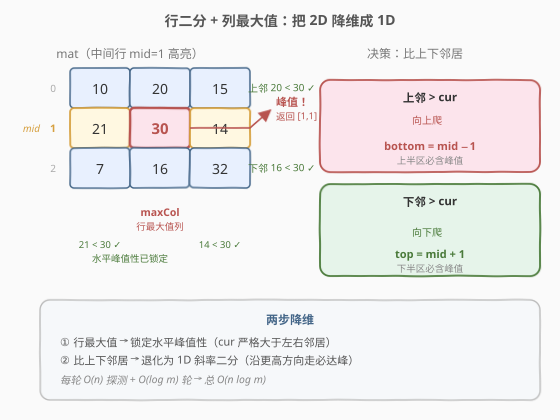
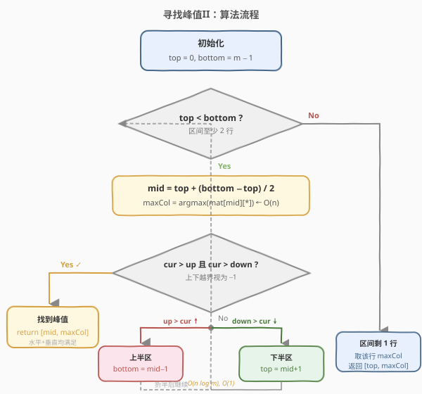
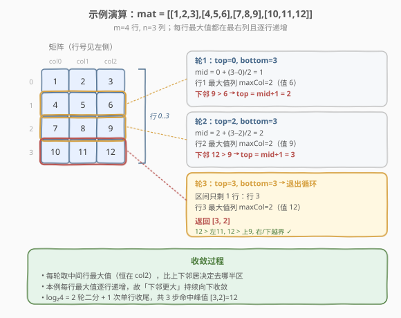

# LeetCode 寻找峰值II 题解

## 1. 题目概述

- **标题 / 题号**：寻找峰值II（#1901，medium）
- **链接**：https://leetcode.cn/problems/find-a-peak-element-ii/
- **难度**：中等
- **标签**：数组、二分查找、矩阵

**题意**：峰值元素是指其值**严格大于所有相邻邻居**的元素。在一个二维矩阵 `mat` 中，某位置 `(i, j)` 的相邻邻居为 `(i-1, j)`、`(i+1, j)`、`(i, j-1)`、`(i, j+1)`（超出矩阵边界的位置视为 $-1$，即比任何矩阵内的值都小）。

给定一个 $m \times n$ 的矩阵 `mat`，满足**任意两个相邻位置的元素都不相等**，请返回**任意一个**峰值元素的下标 `[pi, pj]`。

> ⚠️ 三点注意：① 只需返回**任意一个**峰值，不必找全局最大值；② 相邻元素必不相等，保证没有平台；③ 矩阵边界外视为 $-1$，结合 `mat[i][j] >= 1` 的约束，**峰值一定存在**（至少全局最大值就是一个峰值）。

**示例 1**：

```text
输入：mat = [[1,4],[3,2]]
输出：[0,1] 或 [1,0]
解释：mat[0][1] = 4 严格大于左邻居 1、下邻居 2（上/右越界为 -1），是峰值；
      mat[1][0] = 3 严格大于上邻居 1、右邻居 2（下/左越界为 -1），也是峰值。
```

**示例 2**：

```text
输入：mat = [[10,20,15],[21,30,14],[7,16,32]]
输出：[1,1] 或 [2,2]
解释：mat[1][1] = 30 严格大于 20、21、14、16，是峰值；
      mat[2][2] = 32 严格大于 14、16（右/下越界为 -1），也是峰值。
```

**约束**：

- `m == mat.length`
- `n == mat[i].length`
- `1 <= m, n <= 500`
- `1 <= mat[i][j] <= 10^5`
- 任意两个相邻位置（上下左右）的元素都不相等
- 要求 $O(m \log n)$ 或 $O(n \log m)$ 时间

## 2. 解题思路

### 2.1 暴力思路

最直观的做法是遍历每个位置 `(i, j)`，检查它是否严格大于四个邻居，命中即返回。时间复杂度 $O(m \times n)$，空间 $O(1)$。

问题在于 $m, n$ 均可达 500，$m \times n$ 最高 $2.5 \times 10^5$，虽然暴力法能过，但**不满足题目要求的 $O(m \log n)$**。既然 1D 版本（[162. 寻找峰值](../0101-0200/162_寻找峰值.md)）能用斜率二分做到 $O(\log n)$，2D 版本能复用类似思想吗？

### 2.2 核心观察：行二分 + 列最大值



把 162 的「斜率二分」从 1D 推广到 2D，关键在于**如何用一个 $O(n)$ 的探测来决定峰值在上半区还是下半区**。答案是：

> 💡 **取中间行 `mid`，找到该行的最大值所在列 `maxCol`**。此时 `mat[mid][maxCol]` 已严格大于左右邻居（同行最大）。剩下的就是看它和上下邻居的关系——这就退化成 1D 的斜率二分了。

具体决策：

- 若 `mat[mid][maxCol]` **严格大于**上下邻居（边界视为 $-1$），则它就是峰值，直接返回 `[mid, maxCol]`。
- 若**上方邻居更大**（`mat[mid-1][maxCol] > mat[mid][maxCol]`）：说明上半区一定有峰值——从该更大值出发往「更高处」走，因为矩阵四边界外是 $-1$，爬升必止于某个峰。**向上半区收缩**：`bottom = mid - 1`。
- 若**下方邻居更大**（`mat[mid+1][maxCol] > mat[mid][maxCol]`）：对称地，**向下半区收缩**：`top = mid + 1`。

> ⚠️ 为什么找「行最大值」这一步是关键？因为它一步解决了**水平方向的峰值性**：`mat[mid][maxCol]` 严格大于同行的左右邻居，于是后续只需比较上下方向即可判定是否为 2D 峰值。这是把 2D 问题降维到 1D 的核心技巧。

> 💡 **一句话直觉**：站在中间行的最高点，如果上面更高就往上爬、下面更高就往下爬——上下都是悬崖（$-1$），爬到无路可走就是峰。与 162 的「沿斜率上升方向走必达峰值」完全同构，只不过这里「斜率方向」由行最大值的上下邻居决定。

### 2.3 算法流程图



### 2.4 示例演算

以 `mat = [[10,20,15],[21,30,14],[7,16,32]]`（`m = 3, n = 3`）为例，演示行二分过程：



| 轮次 | top | bottom | mid | 行最大值列 maxCol | mat[mid][maxCol] | 上邻居 | 下邻居 | 决策 |
|------|-----|--------|-----|------------------|------------------|--------|--------|------|
| 1 | 0 | 2 | 1 | 1（值为 30） | 30 | 20 | 16 | 30 > 20 且 30 > 16 → **峰值，返回 [1,1]** |

仅一轮即命中。`mat[1][1] = 30` 严格大于左 21、右 14、上 20、下 16，确为峰值 ✓。

再看一个需要多轮收敛的例子 `mat = [[1,2,3],[4,5,6],[7,8,9],[10,11,12]]`（`m = 4, n = 3`，每行最大值都在最右列且逐行递增）：

| 轮次 | top | bottom | mid | maxCol | mat[mid][maxCol] | 上邻居 | 下邻居 | 决策 |
|------|-----|--------|-----|--------|------------------|--------|--------|------|
| 1 | 0 | 3 | 1 | 2（值 6） | 6 | 3 | 9 | 9 > 6 → 向下：top = 2 |
| 2 | 2 | 3 | 2 | 2（值 9） | 9 | 6 | 12 | 12 > 9 → 向下：top = 3 |
| 3 | 3 | 3 | — | — | — | — | — | top == bottom，取行 3 最大值列 2，返回 [3,2] |

`mat[3][2] = 12` 严格大于左 11、上 9（右/下越界为 $-1$），确为峰值 ✓。

## 3. 参考代码

### C++

```cpp
class Solution {
  public:
    vector<int> findPeakGrid(vector<vector<int>>& mat) {
        int m = mat.size(), n = mat[0].size();
        int top = 0, bottom = m - 1;
        while (top < bottom) {
            int mid = top + (bottom - top) / 2;
            int maxCol = 0;
            for (int j = 1; j < n; j++) {
                if (mat[mid][j] > mat[mid][maxCol]) maxCol = j;
            }
            int cur = mat[mid][maxCol];
            int up   = (mid > 0)     ? mat[mid - 1][maxCol] : -1;
            int down = (mid < m - 1) ? mat[mid + 1][maxCol] : -1;
            if (cur > up && cur > down) {
                return {mid, maxCol};
            } else if (up > cur) {
                bottom = mid - 1;
            } else {
                top = mid + 1;
            }
        }
        int maxCol = 0;
        for (int j = 1; j < n; j++) {
            if (mat[top][j] > mat[top][maxCol]) maxCol = j;
        }
        return {top, maxCol};
    }
};
```

### Python

```python
class Solution:
    def findPeakGrid(self, mat: List[List[int]]) -> List[int]:
        m, n = len(mat), len(mat[0])
        top, bottom = 0, m - 1
        while top < bottom:
            mid = (top + bottom) // 2
            max_col = max(range(n), key=lambda j: mat[mid][j])
            cur = mat[mid][max_col]
            up   = mat[mid - 1][max_col] if mid > 0 else -1
            down = mat[mid + 1][max_col] if mid < m - 1 else -1
            if cur > up and cur > down:
                return [mid, max_col]
            elif up > cur:
                bottom = mid - 1
            else:
                top = mid + 1
        max_col = max(range(n), key=lambda j: mat[top][j])
        return [top, max_col]
```

## 4. 复杂度分析

| 维度 | 复杂度 | 说明 |
|------|--------|------|
| 时间复杂度 | $O(n \log m)$ | 每轮二分对中间行做一次 $O(n)$ 的行最大值扫描，共 $O(\log m)$ 轮；若改为列二分 + 行最大值则为 $O(m \log n)$，取较优方向可进一步优化 |
| 空间复杂度 | $O(1)$ | 仅用 `top`/`bottom`/`mid`/`maxCol` 等常数变量 |

> 💡 当 $m \neq n$ 时，应**在较长维度上做二分、较短维度上做线性扫描**：若 $m > n$ 则行二分（$O(n \log m)$），若 $n > m$ 则列二分（$O(m \log n)$），这样总复杂度更优。

## 5. 扩展：为什么「行最大值 + 上下邻居」一定能收敛到峰值

本题的正确性依赖两条不变式：

1. **水平峰值性**：每轮取 `maxCol` 为 `mid` 行的最大值列，保证 `mat[mid][maxCol]` 严格大于左右邻居（相邻不等保证严格）。于是判定峰值时**只需再检查上下方向**，把 2D 降维成 1D。

2. **垂直收敛性**：与 162 相同的「斜率上升必达峰」论证。若 `up > cur`，则上半区存在峰值——从 `up` 出发沿任意「往更高邻居走」的路径，由于四边界外为 $-1$ 且矩阵有限，路径必在某处停止，停止点即为峰值。对称地，`down > cur` 时下半区存在峰值。

两条不变式合起来保证了：**每轮二分都能安全排除掉一半行，且剩余半区必含峰值**，故对数轮内必收敛。

> ⚠️ 注意：本题的「行最大值」是 $O(n)$ 的探测代价，正是为了让「水平峰值性」立即成立。若改为随便取一列（非最大值列），则 `mat[mid][maxCol]` 未必大于左右邻居，决策方向就不可靠了——这是 2D 版本相对 1D 版本的关键额外代价。

## 6. 面试要点

1. **2D 版本与 1D 版本（162）的核心区别是什么？**
   - 1D 只需比较 `nums[mid]` 与 `nums[mid+1]` 一个邻居即可决策方向；2D 有上下左右四个邻居，需要先用「行最大值」把水平方向的峰值性「锁定」，再退化为 1D 的上下斜率决策。多花的 $O(n)$ 就是这个锁定的代价。

2. **为什么找行最大值而不是随便取一列？**
   - 行最大值保证 `mat[mid][maxCol]` 严格大于左右邻居，于是判定峰值只需比上下；若随便取一列，左右可能有更大值，决策方向会被左右干扰，无法保证收敛到峰值。

3. **`while` 用 `top < bottom` 还是 `top <= bottom`？**
   - 用 `top < bottom`。当 `top == bottom` 时区间只剩一行，该行最大值所在列必为峰值（上下邻居已在前几轮被正确排除，或为边界 $-1$），循环外直接返回。用 `<=` 需额外处理 `mid+1` 越界与死循环。

4. **能否做到 $O(\log m + \log n)$ 的双对数复杂度？**
   - 理论上存在更精细的 2D 二分（如「十字切分」交替行列二分），但实现复杂且常数大；本题 $m, n \le 500$，$O(n \log m)$ 已绰绰有余。面试中写出 $O(n \log m)$ 的清晰版本远胜于硬拗双对数。

5. **如果允许相邻元素相等会怎样？**
   - 「行最大值」可能不严格大于左右邻居（出现平台），决策方向不再唯一确定，正确性论证失效。题目用「相邻必不等」规避了这一情况。

## 同类练习题

| # | 题目 | 与本题的关联 |
|---|------|-------------|
| 162 | [寻找峰值](https://leetcode.cn/problems/find-peak-element/)（[题解](../0101-0200/162_寻找峰值.md)） | 1D 版本，斜率二分的母题，本题的思想根基 |
| 852 | [山脉数组的峰顶索引](https://leetcode.cn/problems/peak-index-in-a-mountain-array/) | 162 的特化版，唯一峰 + 严格先增后减，二分套路一致 |
| 1095 | [山脉数组中查找目标值](https://leetcode.cn/problems/find-in-mountain-array/) | 先二分找峰再分段二分，综合运用斜率二分 + 有序二分 |
| 1283 | [使结果不超过阈值的最小 divisor](https://leetcode.cn/problems/find-the-smallest-divisor-given-a-threshold/) | 二分答案 + $O(n)$ 验证，对比「二分值」与「二分性质」两种范式 |
| 378 | [有序矩阵中第K小的元素](https://leetcode.cn/problems/kth-smallest-element-in-a-sorted-matrix/)（[题解](../0301-0400/378_有序矩阵中第K小的元素.md)） | 另一道矩阵上的二分，对比「二分值域 + 计数」与本题「二分区间 + 行最大值」 |
