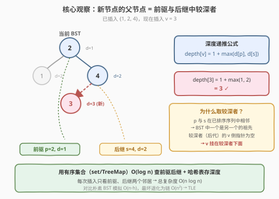
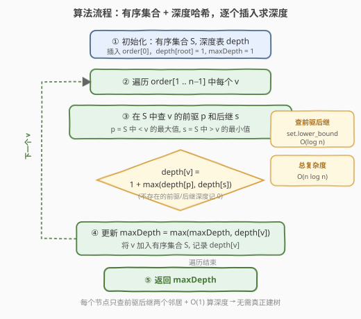

# 给定二叉搜索树的插入顺序求深度

- **题目名称**：给定二叉搜索树的插入顺序求深度
- **链接**：[1902. 给定二叉搜索树的插入顺序求深度](https://leetcode.cn/problems/depth-of-bst-given-insertion-order/)
- **难度**：中等
- **标签**：二叉搜索树、有序集合、树

## 1. 题目概述

给定一个长度为 $n$ 的 **0 下标**整数数组 `order`，它是 $1$ 到 $n$ 的一个**排列**，表示依次将这些整数插入一棵**二叉搜索树（BST）**的顺序：

- `order[0]` 作为 BST 的根节点；
- 后续每个元素按 BST 性质（左子树 $<$ 根 $<$ 右子树）挂到某个已有节点下作为孩子。

返回这棵 BST 的**深度**——即从根节点到最远叶节点路径上的**节点数**。

> 💡 **审题关键**：① `order` 是 $1 \sim n$ 的排列，值互不相同；② 按给定顺序**朴素插入**（不做自平衡），树形完全由插入顺序决定；③ 深度定义为**节点数**而非边数，单节点树深度为 $1$；④ $n \le 10^5$，朴素建树模拟最坏 $O(n^2)$ 会超时，需要利用 BST 的结构性质加速。

**示例 1**：

```text
输入：order = [2,1,4,3]
输出：3
解释：BST 结构为 2(根) → 右孩子 4 → 4 的左孩子 3，最长路径 2→4→3 共 3 个节点。
```

**示例 2**：

```text
输入：order = [2,1,3,4]
输出：3
解释：BST 结构为 2(根) → 右孩子 3 → 3 的右孩子 4，最长路径 2→3→4 共 3 个节点。
```

**示例 3**：

```text
输入：order = [1,2,3,4]
输出：4
解释：完全右斜链 1→2→3→4，深度为 4。
```

**约束条件**：

- $n = \text{order.length}$
- $1 \le n \le 10^5$
- `order` 是 $1$ 到 $n$ 的一个排列

---

## 2. 解题思路

### 2.1 暴力思路：朴素 BST 模拟

最直观的做法：真正建一棵 BST，逐个按 BST 规则插入，插入时记录每个节点的深度，最后取最大深度。

- **正确性**：完全模拟插入过程，与题意一致。
- **效率**：每次插入需从根搜索到空位，耗时 $O(h)$，$h$ 为当前树高。总时间 $O(\sum h_i)$。若插入顺序接近有序（如示例 3），BST 退化为链，$h = O(n)$，总时间 $O(n^2)$，$n = 10^5$ 时超时。

> ⚠️ **陷阱**：$n \le 10^5$ 的规模暗示朴素模拟会 TLE。需要找到一种**不真正建树**就能算出每个节点深度的方法。

### 2.2 核心观察：前驱后继定父节点



关键洞察：**插入新值 $v$ 时，$v$ 的父节点只可能是它在已插入集合中的中序前驱 $p$ 或后继 $s$**——且一定是**两者中深度更大**的那个。

设已插入的有序集合为 $S$，令：

- $p = \max\{x \in S \mid x < v\}$（前驱，若不存在记深度为 $0$）
- $s = \min\{x \in S \mid x > v\}$（后继，若不存在记深度为 $0$）

则：

$$\text{depth}[v] = 1 + \max(\text{depth}[p],\ \text{depth}[s])$$

> 💡 **为什么取较深者？** $p$ 与 $s$ 在已排序序列中**相邻**（中间没有其他已插入值），因此在 BST 中**一个是另一个的祖先**——二者构成一条祖先链。较深者（后代）朝向 $v$ 那侧的子指针必然为空（因为 $p$ 与 $s$ 之间没有任何已插入节点），所以 $v$ 恰好挂在较深者下面。
>
> 具体而言：若 $p$ 是 $s$ 的祖先（$\text{depth}[p] < \text{depth}[s]$），则 $s$ 的左子指针为空，$v$ 成为 $s$ 的左孩子；若 $s$ 是 $p$ 的祖先（$\text{depth}[s] < \text{depth}[p]$），则 $p$ 的右子指针为空，$v$ 成为 $p$ 的右孩子。

以示例 1 插入 $v=3$ 为例：已插入 $\{1,2,4\}$，前驱 $p=2$（$\text{depth}=1$），后继 $s=4$（$\text{depth}=2$）。$s$ 更深 → $3$ 挂在 $4$ 的左侧，$\text{depth}[3] = 1 + \max(1,2) = 3$。

### 2.3 算法流程图



1. **初始化**：有序集合 $S = \{\}$，深度哈希表 $\text{depth} = \{\}$，$\text{maxDepth} = 0$。
2. **插入根**：将 $\text{order}[0]$ 加入 $S$，$\text{depth}[\text{order}[0]] = 1$，$\text{maxDepth} = 1$。
3. **逐个插入**：对 $i = 1 \dots n-1$，令 $v = \text{order}[i]$：
   - 在 $S$ 中二分查找前驱 $p$（$< v$ 的最大值）和后继 $s$（$> v$ 的最小值），$O(\log n)$；
   - 计算 $\text{depth}[v] = 1 + \max(\text{depth}[p] \text{ 或 } 0,\ \text{depth}[s] \text{ 或 } 0)$；
   - $\text{maxDepth} = \max(\text{maxDepth}, \text{depth}[v])$；
   - 将 $v$ 加入 $S$ 并记录 $\text{depth}[v]$。
4. **返回** $\text{maxDepth}$。

### 2.4 示例演算

以 `order = [2,1,4,3]` 为例，逐步追踪前驱、后继与深度递推：

![示例演算：order = [2,1,4,3] 的逐步追踪](../images/1902_example_walkthrough.svg)

| 步 | 插入 $v$ | 前驱 $p$ | 后继 $s$ | $\text{d}[p]$ | $\text{d}[s]$ | $\text{depth}[v]$ | BST 结构 |
|----|---------|---------|---------|--------------|--------------|-------------------|---------|
| 1 | 2 | — | — | 0 | 0 | $1$（根） | 2 |
| 2 | 1 | — | 2 | 0 | 1 | $1+\max(0,1)=2$ | 2 ← 1 |
| 3 | 4 | 2 | — | 1 | 0 | $1+\max(1,0)=2$ | 2 → 4 |
| 4 | 3 | 2 | 4 | 1 | 2 | $1+\max(1,2)=3$ | 4 ← 3 |

> 💡 **观察要点**：① 步骤 4 是关键——前驱 $p=2$（深度 1）与后继 $s=4$（深度 2）中，$s$ 更深，因此 $3$ 挂在 $4$ 下面；② 全程无需真正建树，只需有序集合查邻居 + 哈希表存深度；③ 最终 $\text{maxDepth} = 3$，路径为 $2 \to 4 \to 3$。

---

## 3. 参考代码

### C++

```cpp
class Solution {
public:
    int maxDepthBST(vector<int>& order) {
        set<int> s;
        unordered_map<int, int> depth;
        s.insert(order[0]);
        depth[order[0]] = 1;
        int maxDepth = 1;
        for (int i = 1; i < (int)order.size(); ++i) {
            int v = order[i];
            auto it = s.lower_bound(v);
            int dp = 0, ds = 0;
            if (it != s.begin()) {
                int p = *prev(it);
                dp = depth[p];
            }
            if (it != s.end()) {
                int suc = *it;
                ds = depth[suc];
            }
            depth[v] = 1 + max(dp, ds);
            maxDepth = max(maxDepth, depth[v]);
            s.insert(it, v);
        }
        return maxDepth;
    }
};
```

### Python

```python
from sortedcontainers import SortedList

class Solution:
    def maxDepthBST(self, order: list[int]) -> int:
        sl = SortedList([order[0]])
        depth = {order[0]: 1}
        max_depth = 1
        for v in order[1:]:
            idx = sl.bisect_left(v)
            dp = depth[sl[idx - 1]] if idx > 0 else 0
            ds = depth[sl[idx]] if idx < len(sl) else 0
            depth[v] = 1 + max(dp, ds)
            max_depth = max(max_depth, depth[v])
            sl.add(v)
        return max_depth
```

### Python（标准库 TreeMap 风格，无需第三方依赖）

```python
import bisect

class Solution:
    def maxDepthBST(self, order: list[int]) -> int:
        keys = [order[0]]
        depth = {order[0]: 1}
        max_depth = 1
        for v in order[1:]:
            idx = bisect.bisect_left(keys, v)
            dp = depth[keys[idx - 1]] if idx > 0 else 0
            ds = depth[keys[idx]] if idx < len(keys) else 0
            depth[v] = 1 + max(dp, ds)
            max_depth = max(max_depth, depth[v])
            bisect.insort(keys, v)
        return max_depth
```

> 💡 **写法对照**：① C++ 版用 `std::set::lower_bound` 同时定位前驱（`prev(it)`）与后继（`*it`），并利用 `insert(it, v)` 的提示加速插入到 $O(\log n)$；② Python `SortedList` 版同理，`bisect_left` 一次定位双邻居；③ 标准库版用 `bisect.insort` 维护有序数组，插入为 $O(n)$ 导致总复杂度退化为 $O(n^2)$，仅适用于 $n$ 较小或无 `sortedcontainers` 的环境；④ 面试中优先写 C++ `set` 或 Python `SortedList` 版本，保证 $O(n \log n)$。

---

## 4. 复杂度分析

| 维度 | 复杂度 | 说明 |
|------|--------|------|
| 时间复杂度 | $O(n \log n)$ | 每次插入 $O(\log n)$ 查前驱后继 + $O(1)$ 算深度 + $O(\log n)$ 插入有序集合，共 $n$ 次 |
| 空间复杂度 | $O(n)$ | 有序集合 $S$ 与深度哈希表各存 $n$ 个元素 |

> 💡 对比朴素 BST 模拟 $O(\sum h_i)$，最坏退化为链时 $O(n^2)$。本解法**完全规避了树高**——每次只看前驱后继两个邻居，无论树退化与否都是 $O(\log n)$ 单次操作。标准库 `bisect.insort` 版本因数组插入为 $O(n)$，总复杂度 $O(n^2)$，仅作备用。

---

## 5. 扩展：前驱后继定父节点性质的证明

### 5.1 性质陈述

设 $S$ 为已插入值集合，$v \notin S$ 为待插入值，$p = \max\{x \in S \mid x < v\}$，$s = \min\{x \in S \mid x > v\}$。则 $v$ 在 BST 中的父节点是 $p$ 与 $s$ 中**深度更大**者，等价地：

$$\text{depth}[v] = 1 + \max(\text{depth}[p],\ \text{depth}[s])$$

### 5.2 证明思路

1. **$p$ 与 $s$ 在 BST 中构成祖先链**：由于 $p$ 与 $s$ 在 $S$ 的排序中相邻（$p < v < s$ 且 $S$ 中无介于 $p, s$ 之间的值），BST 中从根搜索 $v$ 的路径必经过 $p$ 或 $s$ 之一。更进一步，$p$ 与 $s$ 中一个是另一个的祖先——否则它们的 LCA $a$ 满足 $p < a < s$，与 $p, s$ 相邻矛盾。

2. **较深者是后代，其朝向 $v$ 的子指针为空**：设 $p$ 是 $s$ 的祖先（$\text{depth}[p] < \text{depth}[s]$），则 $s$ 在 $p$ 的右子树中。$v$ 介于 $p$ 与 $s$ 之间，搜索 $v$ 时从 $p$ 向右走，最终到达 $s$ 后需向左走（$v < s$），而 $s$ 的左子树中没有任何值 $> p$ 且 $< s$（因为 $p, s$ 相邻），故 $s.\text{left} = \text{null}$，$v$ 挂为 $s$ 的左孩子。对称地，若 $s$ 是 $p$ 的祖先，$p.\text{right} = \text{null}$，$v$ 挂为 $p$ 的右孩子。

3. **结论**：$v$ 的父节点 = $\arg\max_{\text{depth}}(p, s)$，深度递推公式成立。

> ⚠️ **边界**：若 $p$ 不存在（$v$ 小于所有已插入值），则 $v$ 挂在 $s$ 的左子树最左端，$\text{depth}[v] = 1 + \text{depth}[s]$；若 $s$ 不存在，对称处理。两者均不存在仅首节点情况，$\text{depth} = 1$。

---

## 6. 面试要点

**Q1：为什么不用朴素 BST 模拟？**

> 朴素模拟每次插入从根搜索到空位，耗时 $O(h)$。若插入顺序接近有序（如 $[1,2,3,\dots,n]$），BST 退化为链，$h = O(n)$，总时间 $O(n^2)$，$n = 10^5$ 时超时。利用「前驱后继定父节点」性质，可用有序集合 $O(\log n)$ 查邻居，总时间 $O(n \log n)$。

**Q2：为什么 $v$ 的父节点一定是前驱或后继？**

> $v$ 插入后成为叶子，其父节点是搜索路径的最后一个节点。该节点的值要么是 $< v$ 的最大值（前驱 $p$，$v$ 成为其右孩子），要么是 $> v$ 的最小值（后继 $s$，$v$ 成为其左孩子）。因为 $p$ 与 $s$ 在已排序集合中相邻，BST 中二者构成祖先链，较深者（后代）朝向 $v$ 的子指针为空，$v$ 恰好挂在那里。

**Q3：为什么取前驱和后继中深度更大的那个？**

> $p$ 与 $s$ 相邻意味着 BST 中一个是另一个的祖先。较深者是后代，它朝向 $v$ 那侧的子指针必然为空（因为 $p$ 与 $s$ 之间没有任何已插入节点），所以 $v$ 挂在较深者下面。等价地，$\text{depth}[v] = 1 + \max(\text{depth}[p], \text{depth}[s])$。

**Q4：C++ 中如何用 `std::set` 同时查前驱和后继？**

> 用 `s.lower_bound(v)` 得到指向第一个 $\ge v$ 的迭代器 `it`。若 `it != s.end()`，则 `*it` 是后继 $s$；若 `it != s.begin()`，则 `*prev(it)` 是前驱 $p$。一次 `lower_bound` 同时定位两个邻居，$O(\log n)$。插入时用 `s.insert(it, v)` 传入提示迭代器，插入也 $O(\log n)$。

**Q5：本题与平衡 BST（AVL/红黑树）有何关系？**

> 本题模拟的是**朴素 BST 插入**（不做旋转平衡），树形完全由插入顺序决定。若题目改为用自平衡 BST 插入，深度为 $O(\log n)$，问题平凡化。本题的精髓在于：即使朴素 BST 可能退化，我们仍能利用 BST 的中序性质（前驱后继相邻 → 祖先链）在 $O(n \log n)$ 内算出深度，无需真正建树。

> 💡 **一句话总结**：BST 插入的精髓在中序——前驱与后继相邻意味着祖先链，$v$ 挂在较深者下，深度 $= 1 + \max(\text{d}[p], \text{d}[s])$，用有序集合 $O(\log n)$ 查邻居即可 $O(n \log n)$ 求解。

---

## 7. 同类练习题

- [108. 将有序数组转换为二叉搜索树](https://leetcode.cn/problems/convert-sorted-array-to-binary-search-tree/)（[题解](../0101-0200/108_将有序数组转换为二叉搜索树.md)）：有序数组构造平衡 BST，对照本题「给定顺序构造朴素 BST」——平衡 vs 退化的对比
- [220. 存在重复元素 III](https://leetcode.cn/problems/contains-duplicate-iii/)（[题解](../0201-0300/220_存在重复元素III.md)）：有序集合 `lower_bound` 查值域邻居，与本题前驱后继查找同模板
- [981. 基于时间的键值存储](https://leetcode.cn/problems/time-based-key-value-store/)（[题解](../0901-1000/981_基于时间的键值存储.md)）：有序数组 + 二分找右界，同为「有序结构查邻居」范式
- [109. 有序链表转换二叉搜索树](https://leetcode.cn/problems/convert-sorted-list-to-binary-search-tree/)（[题解](../0101-0200/109_有序链表转换二叉搜索树.md)）：中序序列构造 BST，与本题「中序前驱后继定结构」的思想呼应
- [315. 计算右侧小于当前元素的个数](https://leetcode.cn/problems/count-of-smaller-numbers-after-self/)（[题解](../0201-0300/315_计算右侧小于当前元素的个数.md)）：有序集合统计右侧更小元素个数，同为「有序结构 + 逐元素插入」套路
