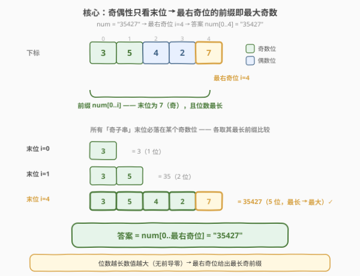
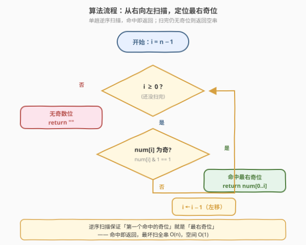
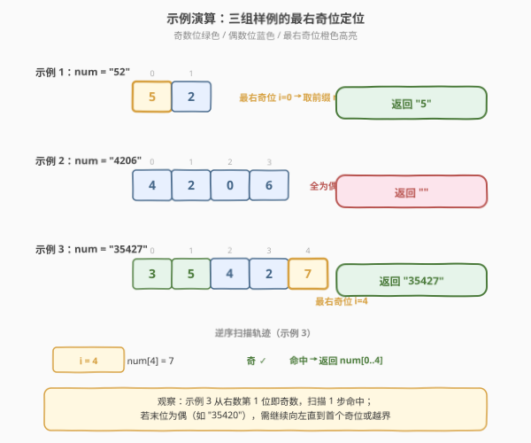

# 字符串中的最大奇数

- **题目名称**：字符串中的最大奇数
- **链接**：[1903. 字符串中的最大奇数](https://leetcode.cn/problems/largest-odd-number-in-string/)
- **难度**：简单
- **标签**：字符串、贪心、数学

## 1. 题目概述

给定一个表示大整数的字符串 `num`，在它的所有**非空子字符串**中找出**值最大的奇数**，并以字符串形式返回。若不存在奇数，返回空字符串 `""`。

> **子字符串**是字符串中一个连续的字符序列。

**示例 1**：

```text
输入：num = "52"
输出："5"
解释：非空子字符串有 "5"、"2"、"52"。其中唯一的奇数是 "5"。
```

**示例 2**：

```text
输入：num = "4206"
输出：""
解释："4206" 中不存在奇数（所有子字符串都以偶数位结尾）。
```

**示例 3**：

```text
输入：num = "35427"
输出："35427"
解释："35427" 本身就是奇数，且是值最大的奇子串。
```

**约束条件**：

- $1 \le \text{num.length} \le 10^5$
- `num` 仅由数字组成且**不含前导零**

> 💡 **审题关键**：① 「子字符串」必须是**连续**的，且按**位置**定义——同内容不同位置的子串各算一个（但本题求「最大值」，重复内容不影响最大）；② 判断一个数是否为奇数**只看末位**——末位为 1/3/5/7/9 即奇；③ `num` 无前导零，意味着「位数越多数值越大」成立，这是把「最大」转化为「最长」的关键。

---

## 2. 解题思路

### 2.1 暴力思路：枚举所有子串

最直观的做法是枚举所有 $O(n^2)$ 个非空子串 `num[l..r]`，对每个检查末位 `num[r]` 是否为奇数（$O(1)$），若是则与当前最大值做字符串比较。维护过程中保留「位数最长且字典序最大」的串即可。

- **正确性**：覆盖所有奇子串，逐个比较取最大，显然正确。
- **效率**：$O(n^2)$ 个子串 × 每个比较最坏 $O(n)$ = $O(n^3)$，对 $n \le 10^5$ 完全不可行。

> ⚠️ 暴力法的瓶颈在于「盲目枚举所有子串」。其实题目只关心**奇子串的最大值**，而奇偶性由末位唯一决定——这给了我们一个强有力的剪枝：**只有末位落在奇数位上的子串才可能是奇数**。

### 2.2 核心观察：最右奇位的前缀即答案



关键洞察分两步：

**第一步：奇子串的末位必是奇数字符。** 一个数 $N$ 为奇数当且仅当其末位为奇数字符：

$$N \text{ 为奇} \iff \text{num}[r] \in \{1,3,5,7,9\}$$

因此所有奇子串必定以某个「奇数位」`i` 为末位。

**第二步：对每个奇数位 $i$，最大的奇子串是前缀 `num[0..i]`。** 因为 `num` 无前导零，任何以 $i$ 为末位的子串 `num[l..i]`（$l \ge 0$）的数值随位数单调递增——$l=0$ 时位数最长（$i+1$ 位），数值最大。所以在所有以 $i$ 结尾的奇子串中，**前缀 `num[0..i]` 最大**。

**第三步：全局最大 = 最右奇位的前缀。** 在所有奇数位 $\{i_1, i_2, \dots\}$ 中，对应的最长奇子串分别为 `num[0..i_k]`，位数分别为 $i_k + 1$。位数越长数值越大，因此**最右**奇位 $i^\* = \max\{i_k\}$ 给出的前缀 `num[0..i^\*]` 位数最长、数值最大，即为答案。

$$\boxed{\text{答案} = \text{num}[0\,..\,i^\*], \quad i^\* = \text{最右奇数位下标}}$$

若不存在奇数位，返回 `""`。

> 💡 **为什么「位数越长数值越大」成立？** 因为 `num` 无前导零（`num[0] ≠ 0`），所以前缀 `num[0..i]` 是一个 $i+1$ 位的合法正整数，没有前导零。两个无前导零的正整数，位数多的严格大于位数少的。题目保证 `num` 无前导零，恰好让这一步成立——若 `num` 可能有前导零（如 `"0123"`），则位数多未必数值大，结论需调整。

> ⚠️ **最高频陷阱**：误以为「最大奇数 = 最大奇数字符」。例如 `num = "2419"`，最大奇数字符是 `9`，但答案不是 `"9"` 而是 `"2419"`——因为以 `9` 为末位的前缀 `"2419"` 比 `"9"` 位数更多、数值更大。正确的转化是「最右奇位的**前缀**」，而非「最右奇位**字符**」。

### 2.3 算法流程图



1. **初始化**：`i = n - 1`（`n = num.size()`），从串尾开始。
2. **逆序扫描**：只要 `i >= 0`：
   - 若 `num[i]` 为奇（`num[i] % 2 == 1`）：命中最右奇位，**立即返回** `num[0..i]`（即 `num.substr(0, i + 1)`）。
   - 否则 `i -= 1`，继续向左。
3. **扫描结束**：若循环结束仍未命中，说明全串无奇数位，返回 `""`。

> 💡 **为什么逆序扫描？** 逆序扫描保证「第一个命中的奇位」就是「最右奇位」，命中即可返回，无需扫描到底。最坏情况（末位为偶、奇位靠左，或全偶）才扫完整串。

### 2.4 示例演算

以三组官方样例演示最右奇位的定位过程：



| 示例 | `num` | 奇数位下标 | 最右奇位 $i^\*$ | 返回 |
|------|-------|-----------|----------------|------|
| 1 | `"52"` | $\{0\}$（字符 `5`） | $0$ | `"5"` |
| 2 | `"4206"` | $\varnothing$（全偶） | — | `""` |
| 3 | `"35427"` | $\{0, 1, 4\}$（字符 `3, 5, 7`） | $4$ | `"35427"` |

**示例 3 的逆序扫描轨迹**：

| 步骤 | $i$ | `num[i]` | 奇? | 动作 |
|------|-----|----------|-----|------|
| 1 | $4$ | `7` | ✓ | 命中最右奇位 → 返回 `num[0..4]` = `"35427"` |

只需 1 步即命中。若把示例 3 改为 `"35420"`（末位改偶），则 $i=4,3,2$ 均为偶，需扫到 $i=1$（字符 `5`）才命中，返回 `num[0..1]` = `"35"`。

> 💡 **观察要点**：① 示例 1 的最右奇位在首位，前缀即单字符 `"5"`；② 示例 2 全偶，扫描到 $i = -1$ 越界，返回空串；③ 示例 3 最右奇位恰在末位，整个串都是答案。三种情形恰好覆盖「奇位在头/在尾/不存在」的典型分布。

---

## 3. 参考代码

### C++

```cpp
class Solution {
public:
    string largestOddNumber(string num) {
        for (int i = (int)num.size() - 1; i >= 0; --i) {
            if ((num[i] - '0') % 2 == 1) {
                return num.substr(0, i + 1);
            }
        }
        return "";
    }
};
```

### Python

```python
class Solution:
    def largestOddNumber(self, num: str) -> str:
        for i in range(len(num) - 1, -1, -1):
            if int(num[i]) % 2 == 1:
                return num[:i + 1]
        return ""
```

### Python（rfind 一行流）

```python
class Solution:
    def largestOddNumber(self, num: str) -> str:
        i = max(num.rfind(d) for d in "13579")
        return num[:i + 1] if i >= 0 else ""
```

> 💡 **写法对照**：① 前两版逻辑完全一致——逆序扫描，命中即返回前缀，最直观；② 第三版利用 `str.rfind` 一次定位每个奇数字符的最右下标，取其最大值即为最右奇位，借助 Python 内建的逆序查找把循环压成一行，可读性也很好；③ 三版均为 $O(n)$ 时间、$O(1)$ 额外空间（不计返回的子串）。面试中先写逆序扫描版展示思路，再口述 `rfind` 版作为 Pythonic 替代。

> 💡 **奇偶判定的小技巧**：字符 `'0'`~`'9'` 的 ASCII 码为 48~57，其中奇数字符 `'1','3','5','7','9'` 的 ASCII 码（49,51,53,55,57）恰好都是奇数，偶数字符亦然。因此 `(num[i] - '0') % 2` 可直接简化为 `num[i] & 1`（或 `num[i] % 2`）——字符本身的奇偶就反映数字的奇偶。C++ 中 `num[i] % 2 == 1` 是最快的写法，但 `(num[i] - '0') % 2` 更显式可读。

---

## 4. 复杂度分析

| 维度 | 复杂度 | 说明 |
|------|--------|------|
| 时间复杂度 | $O(n)$ | 逆序扫描，最坏遍历整串一次；`substr`/切片复制 $i+1$ 个字符 $\le O(n)$，总计 $O(n)$ |
| 空间复杂度 | $O(1)$ | 仅循环变量 `i`，不计返回的子串；返回串至多 $n$ 个字符（若计入输出则为 $O(n)$） |

> 💡 $n \le 10^5$，$O(n)$ 单趟扫描十分宽裕。本题的优雅之处在于把「$O(n^2)$ 子串枚举」化简为「$O(n)$ 单趟逆序查找」——关键在于识别出「奇偶性由末位唯一决定」这一结构。

---

## 5. 扩展：若 `num` 允许前导零会怎样？

本题能成立「最右奇位的前缀即最大」依赖于 `num` **无前导零**，从而「位数越多数值越大」。若放宽这一假设（例如输入 `"0103"`），结论需调整：

- 以最右奇位 $i^\*$ 为末位时，前缀 `num[0..i^\*]` 可能有前导零（如 `num[0] = '0'`），其数值未必最大。
- 此时需在 $[0, i^\*]$ 内找到**最左的非零起点** $l^\*$，取 `num[l^\*..i^\*]` 作为该末位下的最大奇子串；再对所有奇末位横向比较。
- 若整串无非零字符（如 `"0000"`），则不存在合法正整数奇子串。

> ⚠️ 本题保证无前导零，故无需此处理。理解「无前导零」在证明中的作用，有助于在变体题中快速识别结论是否仍然成立。

---

## 6. 面试要点

**Q1：为什么最大奇数一定是某个前缀，而不是中间的子串？**

> 因为 `num` 无前导零，对任意末位 $r$，以 $r$ 结尾的子串中**起点越靠左位数越多、数值越大**，所以最大的是起点为 $0$ 的前缀 `num[0..r]`。再对所有合法末位（奇数位）取最长前缀，即为最右奇位的前缀。

**Q2：为什么是「最右奇位」而不是「最大奇数字符」？**

> 「最大奇数字符」只看单个字符的数值（如 `9 > 7`），但答案追求的是**整个数**的最大值。以最右奇位 $i^\*$ 为末位的前缀 `num[0..i^\*]` 位数最长，因而数值最大——哪怕 $i^\*$ 上的字符是 `1`，只要它最靠右，前缀就比任何更短奇子串都大。例如 `"2419"` 的最右奇位是 `9`（$i=3$），答案是 `"2419"` 而非 `"9"`。

**Q3：如何判断一个数字字符是奇数？**

> 数字字符 `'0'`~`'9'` 的 ASCII 码 48~57 与数字本身的奇偶性一致（奇数字符 ASCII 为奇），故 `num[i] % 2 == 1` 或 `num[i] & 1` 直接判定，无需先减 `'0'`。但 `(num[i] - '0') % 2` 更显式，视团队风格取舍。

**Q4：最坏情况下算法扫描多少次？举一个最坏样例。**

> 最坏情况扫描整串 $n$ 次，发生在「奇位在最左」或「全偶」时。例 1：`num = "24680"`（全偶），扫到 $i = -1$ 返回 `""`；例 2：`num = "12468"`（仅首位 `1` 为奇），需从 $i=4$ 扫到 $i=0$ 才命中，返回 `"1"`。两种情形都是 $O(n)$。

**Q5：如果输入是一个超长数字字符串（$n = 10^5$），`substr` 的开销会不会成为瓶颈？**

> `substr` 复制 $i+1$ 个字符，最坏 $O(n)$，与扫描合计仍为 $O(n)$，对 $n = 10^5$ 完全可接受。若进一步追求极致（如 $n = 10^7$），可返回 `(0, i+1)` 的下标对而非拷贝子串，在调用方按需切片，实现严格 $O(1)$ 额外空间——但 LeetCode 的返回类型是 `string`，拷贝不可避免。

> 💡 **一句话总结**：奇偶性只看末位 + 无前导零保证「位数越长越大」→ 答案 = 最右奇位的前缀 → 逆序扫描 $O(n)$ 命中即返回。

---

## 7. 同类练习题

- [9. 回文数](https://leetcode.cn/problems/palindrome-number/)（[题解](../0001-0100/9_回文数.md)）：同样是「数字字符与数值性质」的转化，反转一半数字判回文，关注末位/位数的结构利用
- [7. 整数反转](https://leetcode.cn/problems/reverse-integer/)（[题解](../0001-0100/7_整数反转.md)）：逐位取出数字字符做数值运算，与本题「字符→奇偶判定」共用「按位处理数字串」的基础技能
- [231. 2 的幂](https://leetcode.cn/problems/power-of-two/)（[题解](../0201-0300/231_2的幂.md)）：二进制位级别「最低位决定性质」——`n & (n-1) == 0` 判单 1，与本题「末位决定奇偶」同为「边界位定全局性质」的贪心剪枝
- [190. 颠倒二进制位](https://leetcode.cn/problems/reverse-bits/)（[题解](../0101-0200/190_颠倒二进制位.md)）：按位逆序处理 + 位级性质判定，对照本题的十进制末位奇偶性，体会「按位扫描」在不同进制下的共通套路
