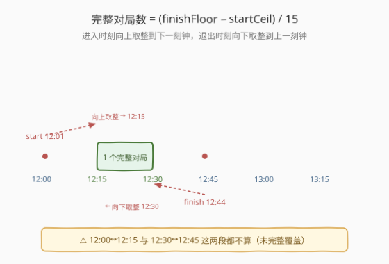
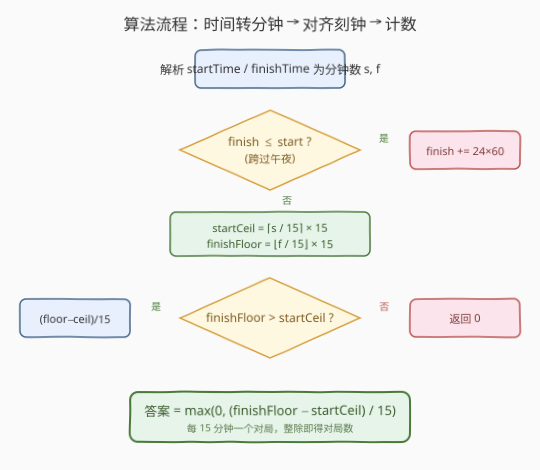
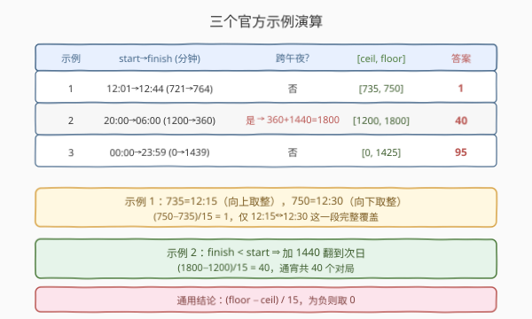

# 你完成的完整对局数

- **题目名称**：你完成的完整对局数
- **链接**：[1904. 你完成的完整对局数](https://leetcode.cn/problems/the-number-of-full-rounds-you-have-played/)
- **难度**：中等
- **标签**：数学、字符串

## 1. 题目概述

一款在线电子游戏以**刻钟**为周期规划若干时长为 **15 分钟**的对局：在 `HH:00`、`HH:15`、`HH:30`、`HH:45` 都会开始一个新对局，时钟为 24 小时制（最早 `00:00`，最晚 `23:59`）。

给你两个字符串 `startTime` 和 `finishTime`（均为 `"HH:MM"` 格式），分别表示你**进入**和**退出**游戏的确切时间。请计算整个会话期间你**完成的完整对局数**——即你完整覆盖了整段 15 分钟的那些对局。

- 若 `finishTime` **早于** `startTime`，表示你玩了个通宵（从 `startTime` 跨过午夜到次日 `finishTime`）。
- 你只有在对局**开始前或开始时进入**、且在对局**结束后或结束时退出**，才算完成该对局。

**示例 1**：

```text
输入：startTime = "12:01", finishTime = "12:44"
输出：1
解释：你完成了从 12:15 到 12:30 的一个完整对局。
      12:00↔12:15 这段你 12:01 才进入，不算；12:30↔12:45 这段你 12:44 就退出，不算。
```

**示例 2**：

```text
输入：startTime = "20:00", finishTime = "06:00"
输出：40
解释：通宵。20:00 到 00:00 完成 16 个对局，00:00 到 06:00 完成 24 个，共 40 个。
```

**示例 3**：

```text
输入：startTime = "00:00", finishTime = "23:59"
输出：95
解释：除最后一个小时只完成 3 个对局外，其余每小时均完成 4 个。
```

**约束条件**：

- `startTime` 和 `finishTime` 的格式为 `HH:MM`
- `00 <= HH <= 23`
- `00 <= MM <= 59`
- `startTime` 和 `finishTime` 不相等

---

## 2. 解题思路

### 2.1 暴力思路：逐分钟模拟

把会话区间展开成「分钟」序列，对每个 15 分钟对局 `[q*15, q*15+15)` 判断是否被 `[start, finish]` 完全覆盖。一天共 $96$ 个对局，逐个判 `start <= q*15` 且 `q*15+15 <= finish` 即可，$O(96) = O(1)$。

> 这种做法正确但绕了一圈。本质上「完整对局」的边界完全由 `start`、`finish` 落在哪个刻钟格子决定，直接做**刻钟对齐**即可一步到位，不必逐格枚举。

### 2.2 核心观察：刻钟对齐（向上/向下取整）



把时间统一转成「从 `00:00` 起的分钟数」$s$、$f$。一个完整对局对应区间 $[15k,\;15k+15)$。会话 $[s, f]$ 完整覆盖它的充要条件是：

$$
15k \ge s \quad \text{且} \quad 15k+15 \le f
$$

满足条件的 $k$ 构成一段**连续整数区间**：

- 左端点：$k \ge s/15$，即 $k_{\min} = \lceil s/15 \rceil$，对应起始刻钟 $\text{startCeil} = \lceil s/15 \rceil \times 15$（把进入时刻**向上取整**到下一刻钟）。
- 右端点：$15k+15 \le f \Rightarrow k \le f/15 - 1$，即 $k_{\max} = \lfloor f/15 \rfloor - 1$，对应结束刻钟 $\text{finishFloor} = \lfloor f/15 \rfloor \times 15$（把退出时刻**向下取整**到上一刻钟）。

完整对局数 $= k_{\max} - k_{\min} + 1 = \dfrac{\text{finishFloor} - \text{startCeil}}{15}$，若为负则取 $0$。

> 💡 **直觉**：进入时刻往「后」靠到刻钟线，退出时刻往「前」靠到刻钟线，夹在两条线之间的整段就是完整覆盖的对局。若进入、退出落在同一刻钟格内（如 `12:01`→`12:02`），则 `floor < ceil`，没有完整对局，答案为 $0$。

**跨午夜处理**：若 $f \le s$，说明退到次日，把 $f$ 加上 $24 \times 60 = 1440$ 即可把会话拉成一条单调递增的线段，后续取整逻辑不变。

### 2.3 算法流程图



整体步骤：

1. 解析 `startTime`、`finishTime` 为分钟数 $s$、$f$。
2. 若 $f \le s$，则 $f \mathrel{+}= 1440$（通宵翻到次日）。
3. $\text{startCeil} = \lceil s/15 \rceil \times 15$，$\text{finishFloor} = \lfloor f/15 \rfloor \times 15$。
4. 返回 $\max(0,\;(\text{finishFloor} - \text{startCeil}) / 15)$。

### 2.4 示例演算



以**示例 1** `12:01→12:44` 逐项演算：

| 量 | 计算 | 值 |
|------|------|------|
| $s$ | $12\times60+1$ | $721$ |
| $f$ | $12\times60+44$ | $764$ |
| 跨午夜? | $764 > 721$ | 否 |
| startCeil | $\lceil 721/15\rceil \times 15 = 49\times15$ | $735$（即 `12:15`） |
| finishFloor | $\lfloor 764/15\rfloor \times 15 = 50\times15$ | $750$（即 `12:30`） |
| 对局数 | $(750-735)/15$ | $1$ |

**示例 2** `20:00→06:00`：$s=1200$、$f=360 \le 1200$，故 $f \mathrel{+}= 1440 = 1800$；$\text{startCeil}=1200$、$\text{finishFloor}=1800$，$(1800-1200)/15 = 40$。

**示例 3** `00:00→23:59`：$s=0$、$f=1439$；$\text{startCeil}=0$、$\text{finishFloor}=\lfloor1439/15\rfloor\times15=95\times15=1425$，$(1425-0)/15 = 95$。

---

## 3. 参考代码

### C++

```cpp
class Solution {
public:
    int numberOfRounds(string startTime, string finishTime) {
        int s = ((startTime[0] - '0') * 10 + (startTime[1] - '0')) * 60
              + ((startTime[3] - '0') * 10 + (startTime[4] - '0'));
        int f = ((finishTime[0] - '0') * 10 + (finishTime[1] - '0')) * 60
              + ((finishTime[3] - '0') * 10 + (finishTime[4] - '0'));
        if (f <= s) f += 24 * 60; // 通宵：翻到次日
        int startCeil   = (s + 14) / 15 * 15; // 向上取整到刻钟
        int finishFloor = f / 15 * 15;        // 向下取整到刻钟
        return max(0, (finishFloor - startCeil) / 15);
    }
};
```

### Python

```python
class Solution:
    def numberOfRounds(self, startTime: str, finishTime: str) -> int:
        def to_min(t: str) -> int:
            h, m = t.split(":")
            return int(h) * 60 + int(m)

        s = to_min(startTime)
        f = to_min(finishTime)
        if f <= s:
            f += 24 * 60  # 通宵：翻到次日
        start_ceil = (s + 14) // 15 * 15   # 向上取整到刻钟
        finish_floor = f // 15 * 15         # 向下取整到刻钟
        return max(0, (finish_floor - start_ceil) // 15)
```

> ⚠️ **向上取整的写法**：$\lceil s/15\rceil = (s + 14) / 15$（整数除法），切勿写成 `(s + 15) / 15`——当 $s$ 恰为 $15$ 的倍数时会多算一个刻钟。例如 $s=735$ 时，正确得 $735$（已是刻钟），错写会得 $750$。
>
> 💡 **跨午夜判定用 $f \le s$ 而非 $f < s$**：题目保证 `startTime != finishTime`，但 `00:00→00:00` 这种「整 24 小时」会话理论上也属通宵（玩了一整天）。用 `<=` 可正确把 $f$ 翻到次日 $1440$，得 $\text{finishFloor}=1440$、答案 $96$（全天所有对局）。

---

## 4. 复杂度分析

| 维度 | 复杂度 | 说明 |
|------|--------|------|
| 时间复杂度 | $O(1)$ | 仅解析字符串与几次算术运算 |
| 空间复杂度 | $O(1)$ | 只用常数个整型变量 |

---

## 5. 扩展：通用「取整计数」模型

本题是**区间对齐计数**的典型例子：给定一个大区间 $[s, f]$ 与一组等长为 $L$ 的标准格子 $[kL, kL+L)$，求被完整覆盖的格子数。通用公式为

$$
\max\!\left(0,\; \left\lfloor \frac{f}{L} \right\rfloor - \left\lceil \frac{s}{L} \right\rceil \right)
$$

即「右端向下取整减左端向上取整」。同类问题包括：求某月内完整的周数、时间段内整点的打卡次数、文件传输中完整的块数等，均可套用此模型。

> 💡 若格子起点有偏移（如对局从 `HH:05` 开始而非整点），可先做坐标平移 $s' = s - \text{offset}$、$f' = f - \text{offset}$，再代入上式即可。

---

## 6. 面试要点

1. **为什么是「向上取整 start、向下取整 finish」而不是反过来？**

   > 完整覆盖要求对局开始时你已在场（$15k \ge s$）、对局结束时你未离场（$15k+15 \le f$）。前者把 $s$ 往后靠到刻钟线（取 ceil），后者把 $f$ 往前靠（取 floor），夹中间的格子才两头都满足。

2. **跨午夜为什么要用 `f <= s` 而不是 `f < s`？**

   > 题目说 `finishTime` 早于 `startTime` 即通宵，但「整 24 小时」会话（如 `00:00→00:00`，被题目 `!=` 约束排除，但逻辑上存在）也应算作通宵。用 `<=` 把 $f$ 加 $1440$ 拉到次日，可统一处理这类边界。

3. **`(s + 14) / 15` 这个向上取整写法可靠吗？**

   > 整数除法下 $\lceil s/15\rceil = \lfloor (s+14)/15 \rfloor$，对 $s \ge 0$ 恒成立。当 $s$ 是 $15$ 的倍数时，$s+14$ 仍落在同一格，不会多进位，因此安全。

4. **如果题目改为「对局长度任意（如 13 分钟）」还能这样做吗？**

   > 只要格子等长且起点对齐，公式 $\lfloor f/L \rfloor - \lceil s/L \rceil$ 仍成立。若格子起点有偏移，先平移坐标；若格子不等长，则需枚举每个格子单独判断。

5. **`finishFloor < startCeil` 时为什么直接返回 0？**

   > 此时会话落在同一个刻钟格内（或会话为空），没有任何一个完整对局被两头覆盖。`max(0, ...)` 正是处理这种情况，避免出现负数答案。

---

## 7. 同类练习题

- [1344. 时钟指针的夹角](https://leetcode.cn/problems/angle-between-hands-of-a-clock/)（[题解](../1301-1400/1344_时钟指针的夹角.md)）：同样把 `HH:MM` 转分钟做数学计算，巩固时间字符串解析与角度公式
- [1360. 日期之间隔几天](https://leetcode.cn/problems/number-of-days-between-two-dates/)：日期转「绝对天数」之差做计数，与本题「时间转分钟之差」同源的时间对齐思想
- [1185. 一周中的第几天](https://leetcode.cn/problems/day-of-the-week/)：日期到星期的映射，涉及日期/时间的统一量化与边界判定
- [204. 计数质数](https://leetcode.cn/problems/count-primes/)（[题解](../0001-0100/204_计数质数.md)）：另一类「区间内满足条件的整数计数」，对照体会不同计数模型
