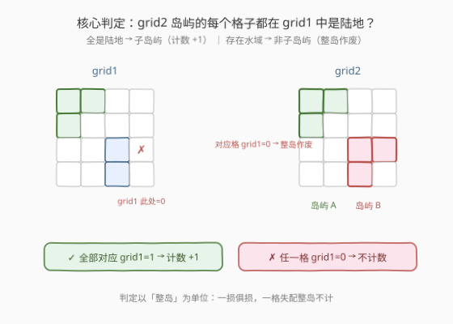
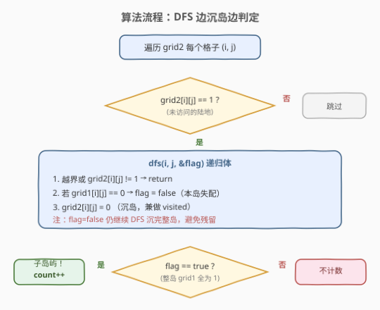
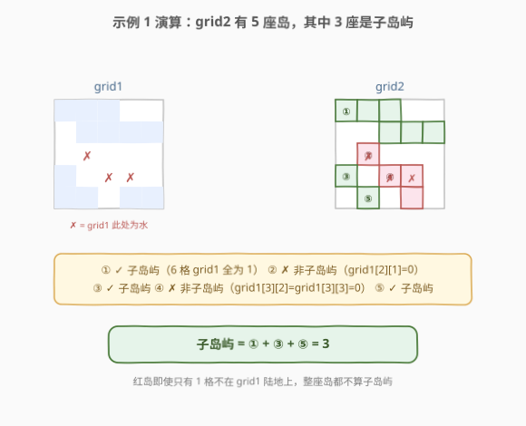

# 统计子岛屿

- **题目名称**：统计子岛屿
- **链接**：[1905. 统计子岛屿](https://leetcode.cn/problems/count-sub-islands/)
- **难度**：中等
- **标签**：图、DFS、BFS、连通分量、网格

## 1. 题目概述

给你两个 $m \times n$ 的二进制矩阵 `grid1` 和 `grid2`，只含 `0`（水）和 `1`（陆地）。**岛屿**是由**水平/竖直**四个方向相邻的 `1` 组成的连通区域。

如果 `grid2` 的一座岛屿，其**每一个格子**在 `grid1` 中都是陆地（即 `grid1[i][j] == 1`），则称 `grid2` 中的这座岛屿为**子岛屿**。返回 `grid2` 中**子岛屿的数目**。

**示例 1**：

```text
输入：grid1 = [[1,1,1,0,0],[0,1,1,1,1],[0,0,0,0,0],[1,0,0,0,0],[1,1,0,1,1]],
      grid2 = [[1,1,1,0,0],[0,0,1,1,1],[0,1,0,0,0],[1,0,1,1,0],[0,1,0,1,0]]
输出：3
```

**示例 2**：

```text
输入：grid1 = [[1,0,1,0,1],[1,1,1,1,1],[0,0,0,0,0],[1,1,1,1,1],[1,0,1,0,1]],
      grid2 = [[0,0,0,0,0],[1,1,1,1,1],[0,1,0,1,0],[0,1,0,1,0],[1,0,0,0,1]]
输出：2
```

**约束条件**：

- $m == \text{grid1.length} == \text{grid2.length}$
- $n == \text{grid1[i].length} == \text{grid2[i].length}$
- $1 \le m, n \le 500$
- `grid1[i][j]` 和 `grid2[i][j]` 都要么是 `0` 要么是 `1`

---

## 2. 解题思路

### 2.1 暴力思路：两阶段分离

先用 DFS 把 `grid2` 的所有岛屿找出来（每座岛存成坐标列表），再对每座岛遍历其所有格子检查 `grid1[i][j] == 1`，全为 1 则计数。这样需要额外存「岛屿 → 格子列表」的映射，两趟遍历、两份状态，常数与代码都偏重。

> 这种「先发现、再判定」的拆分正确但啰嗦。其实**发现岛屿与判定合法性可以融合在同一个 DFS 里**，一遍走完整岛的同时就把答案确定下来。

### 2.2 核心观察：DFS 边沉岛边判定



关键洞察：**`grid2` 的一座岛是子岛屿，当且仅当该岛每个格子在 `grid1` 中都是陆地**。因此遍历 `grid2` 时，遇到未访问的 `1` 就启动一次 DFS 沉掉整座岛，沉岛过程中同步检查 `grid1[i][j]`：

- 只要发现**任一格** `grid1[i][j] == 0`，就把一个 `flag` 标为 `false`；
- DFS 走完整座岛后，若 `flag` 仍为 `true`，说明全岛都被 `grid1` 覆盖，计数 $+1$。

> 💡 **一损俱损**：判定以「整岛」为单位，一格失配整座岛都不算。因此即使 `flag` 变 `false`，DFS 仍要继续把整座岛沉完——既为了避免残留格子被当作新岛重复计数，也保证 `visited` 语义完整。这正是 [200. 岛屿数量](../0101-0200/200_岛屿数量.md)「沉岛法」的天然延伸：把「标记已访问」与「收集合法性」合并成一次漫灌。

> ⚠️ 与 200 题的区别：200 只需沉岛计数；本题沉岛时还要「对照另一张图」逐格核对，多了一个 `flag` 维度。但骨架完全一致——这说明**很多网格 DFS 题都能在「沉岛模板」上叠加额外判定**。

### 2.3 算法流程图



整体步骤：

1. 遍历 `grid2` 每个格子 `(i, j)`。
2. 若 `grid2[i][j] == 1`：置 `flag = true`，从 `(i, j)` 启动 DFS。
3. DFS 体：越界或 `grid2[i][j] != 1` 则返回；若 `grid1[i][j] == 0` 则 `flag = false`；把 `grid2[i][j]` 置 `0`（沉岛）；对四方向递归。
4. DFS 返回后若 `flag == true`，则 `count++`。
5. 遍历结束返回 `count`。

### 2.4 示例演算

以**示例 1** 演算，`grid2` 共有 5 座岛：



| 岛屿 | 格子（grid2 中） | 关键核对（grid1） | flag | 计数? |
|------|------------------|-------------------|------|-------|
| ① | (0,0)(0,1)(0,2)(1,2)(1,3)(1,4) | 6 格 grid1 全为 1 | true | ✓ +1 |
| ② | (2,1) | grid1[2][1] = 0 | false | ✗ |
| ③ | (3,0) | grid1[3][0] = 1 | true | ✓ +1 |
| ④ | (3,2)(3,3)(4,3) | grid1[3][2] = 0 | false | ✗ |
| ⑤ | (4,1) | grid1[4][1] = 1 | true | ✓ +1 |

最终 $count = 3$，与示例输出一致。

**示例 2** 同理：`grid2` 的中部大岛虽连成一片，但含有 `grid1` 为 `0` 的格子（如 `(2,1)`、`(2,3)`），整岛作废；只有右下角与左下角两座单格岛完全落在 `grid1` 陆地上，故答案为 $2$。

---

## 3. 参考代码

### C++

```cpp
class Solution {
    int m, n;
    int dx[4] = {0, 0, 1, -1};
    int dy[4] = {1, -1, 0, 0};

    // 沉掉 grid2 中 (i,j) 所在的整座岛，同时把「是否所有格子都在 grid1 为陆地」写入 flag
    void dfs(vector<vector<int>>& grid1, vector<vector<int>>& grid2,
             int i, int j, bool& flag) {
        if (i < 0 || i >= m || j < 0 || j >= n || grid2[i][j] != 1)
            return;
        if (grid1[i][j] == 0) flag = false; // 一格失配，整岛作废
        grid2[i][j] = 0;                    // 沉岛，兼做 visited
        for (int d = 0; d < 4; d++)
            dfs(grid1, grid2, i + dx[d], j + dy[d], flag);
    }

public:
    int countSubIslands(vector<vector<int>>& grid1, vector<vector<int>>& grid2) {
        m = grid1.size();
        n = grid1[0].size();
        int count = 0;
        for (int i = 0; i < m; i++)
            for (int j = 0; j < n; j++)
                if (grid2[i][j] == 1) {
                    bool flag = true;
                    dfs(grid1, grid2, i, j, flag);
                    if (flag) count++;
                }
        return count;
    }
};
```

### Python

```python
class Solution:
    def countSubIslands(self, grid1: List[List[int]], grid2: List[List[int]]) -> int:
        m, n = len(grid1), len(grid1[0])
        count = 0

        def dfs(i: int, j: int, flag: List[bool]) -> None:
            if i < 0 or i >= m or j < 0 or j >= n or grid2[i][j] != 1:
                return
            if grid1[i][j] == 0:
                flag[0] = False
            grid2[i][j] = 0  # 沉岛
            for di, dj in [(0, 1), (0, -1), (1, 0), (-1, 0)]:
                dfs(i + di, j + dj, flag)

        for i in range(m):
            for j in range(n):
                if grid2[i][j] == 1:
                    flag = [True]
                    dfs(i, j, flag)
                    if flag[0]:
                        count += 1
        return count
```

> ⚠️ **Python 传递布尔标志**：Python 的布尔是不可变对象，递归内部无法直接改写外层 `bool` 变量。这里用单元素列表 `flag = [True]` 模拟「可变引用」（闭包改写 `flag[0]`），等价于 C++ 的 `bool& flag`。也可改用 `nonlocal` 声明，或让 `dfs` 返回「本子树是否全合法」并与子树结果做逻辑与。

---

## 4. 复杂度分析

| 维度 | 复杂度 | 说明 |
|------|--------|------|
| 时间复杂度 | $O(m \times n)$ | 每个格子最多被 DFS 访问一次（沉岛后不再进入） |
| 空间复杂度 | $O(m \times n)$ | DFS 递归栈最坏深度 $m \times n$（`grid2` 全为 1）；改 BFS 可降到 $O(\min(m,n))$ |

---

## 5. 扩展：归约为「岛屿数量」的预处理法

还有一种更「规整」的写法——**先排除，再计数**：

1. **预处理**：遍历所有格子，若 `grid2[i][j] == 1` 且 `grid1[i][j] == 0`，则从 `(i,j)` 出发把 `grid2` 中这座岛**整座沉掉**（因为它必然不是子岛屿）。
2. **计数**：对处理后的 `grid2` 跑一遍 [200. 岛屿数量](../0101-0200/200_岛屿数量.md) 的标准沉岛计数，剩下的岛全是子岛屿。

```cpp
// 预处理：凡是含 grid1 缺口的 grid2 岛，整座沉掉
for (int i = 0; i < m; i++)
    for (int j = 0; j < n; j++)
        if (grid2[i][j] == 1 && grid1[i][j] == 0)
            sink(grid2, i, j);   // 普通 DFS 沉岛，无需 flag
// 计数：剩下的 grid2 岛屿即为子岛屿
return countIslands(grid2);
```

> 💡 **两种写法等价**：预处理法把「判定」与「计数」拆成两趟 DFS，思路更接近 200 题模板、易记；单趟带 `flag` 的写法只扫一遍、常数更小。面试中两种都 acceptable，按你更顺手的讲即可。本质都是「失配的整座岛必须整座抹掉」。

---

## 6. 面试要点

1. **为什么 `flag=false` 之后还要继续 DFS 沉完整座岛？**

   > 沉岛同时承担「visited 标记」职责。若中途停下，岛里剩余的 `1` 会被外层遍历再次当作新岛启动 DFS，导致重复计数与判定错乱。必须一次性把整座岛沉完，保证每个格子只被访问一次。

2. **能否不修改 `grid2`、用额外 `visited` 矩阵？**

   > 可以。建一个 $m \times n$ 的 `visited` 矩阵替代「沉岛置 0」，逻辑不变。代价是 $O(m \times n)$ 额外空间。原地沉岛省空间但会改输入，面试时先问一句「能否修改输入」。

3. **这题和 200. 岛屿数量 的关系是什么？**

   > 200 是「找连通块并计数」的母题；本题在沉岛模板上叠加了一个「对照另一张图逐格判合法」的维度。把 200 的 DFS 骨架记住，本题只需多传一个 `flag`（或做预处理归约）。网格 DFS 系列题大多如此——**模板 + 一个额外判定**。

4. **DFS 与 BFS 在这题如何取舍？**

   > 时间都是 $O(m \times n)$。DFS 写法简洁但最坏递归深度 $m \times n$，$500 \times 500$ 全 1 网格在 Python 下可能栈溢出；BFS 用队列更稳妥，空间最坏 $O(\min(m,n))$。力扣此题数据规模下 DFS 一般能过，但面试可主动提 BFS 作为稳妥方案。

5. **预处理法为什么要「整座沉掉」而不是只置那一个失配格为 0？**

   > 因为判定单位是「整座岛」：只要有一格失配，整座岛都不是子岛屿。若只沉失配格，剩余格子仍连成岛、且之后可能恰好全落在 `grid1` 陆地上，被误判为子岛屿。整座沉掉才能彻底剔除这座岛。

---

## 7. 同类练习题

- [200. 岛屿数量](https://leetcode.cn/problems/number-of-islands/)（[题解](../0101-0200/200_岛屿数量.md)）：网格 DFS 沉岛模板，本题的母题
- [695. 岛屿的最大面积](https://leetcode.cn/problems/max-area-of-island/)：沉岛模板上叠加「统计面积」，体会模板 + 一个累加维度
- [1254. 统计封闭岛屿的数目](https://leetcode.cn/problems/number-of-closed-islands/)：沉岛模板上叠加「是否触及边界」判定，与本题的 flag 思路同构
- [1020. 飞地的数量](https://leetcode.cn/problems/number-of-enclaves/)：边界连通分量预处理 + 剩余计数，对照本文「预处理法」的归约思路
